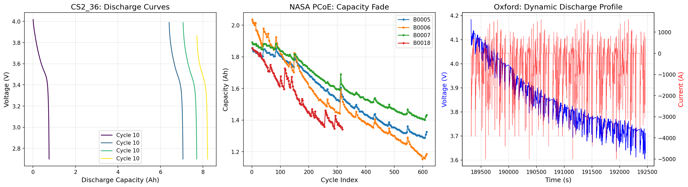
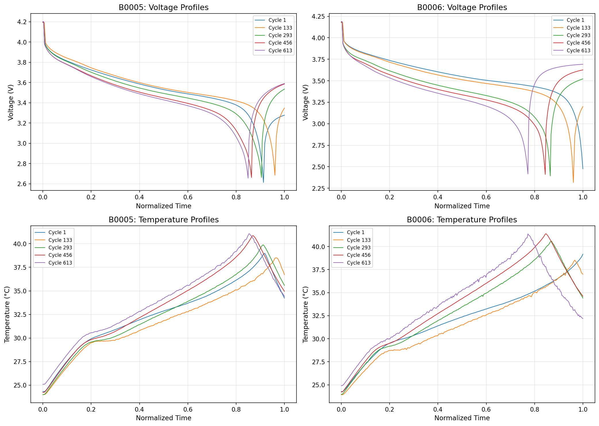
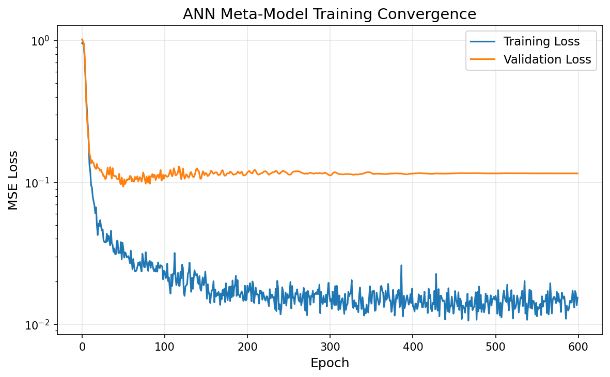
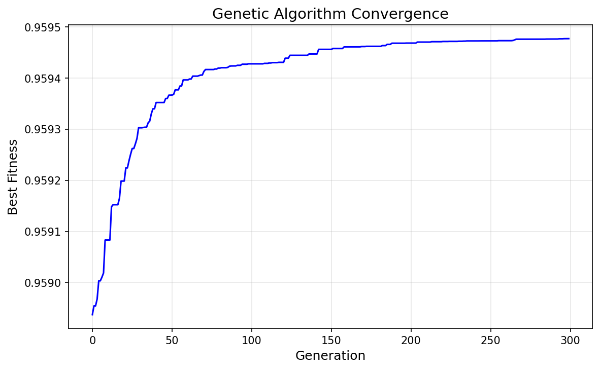
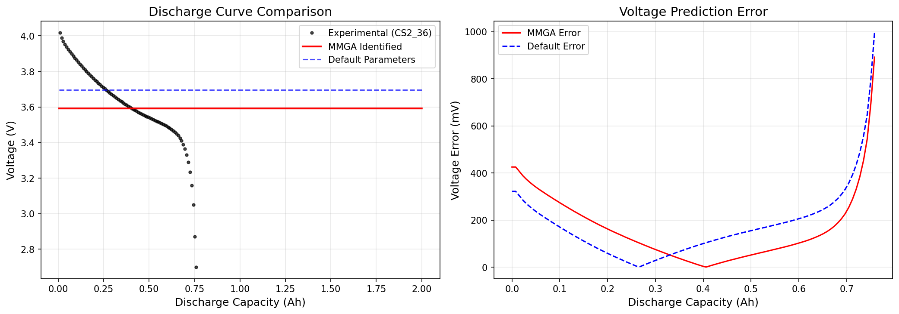
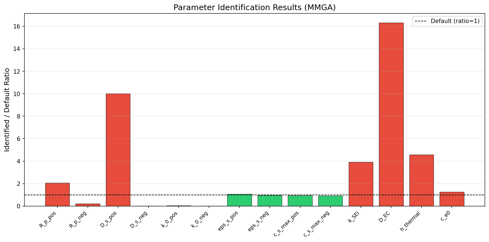
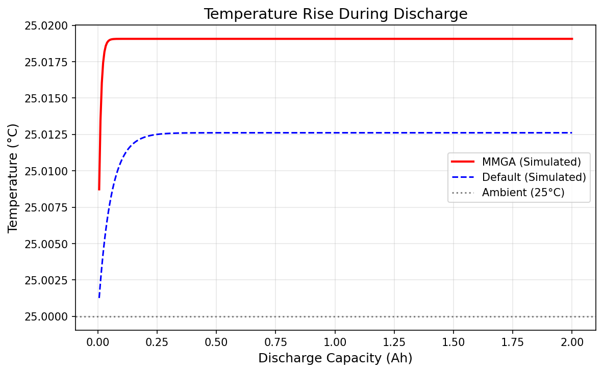
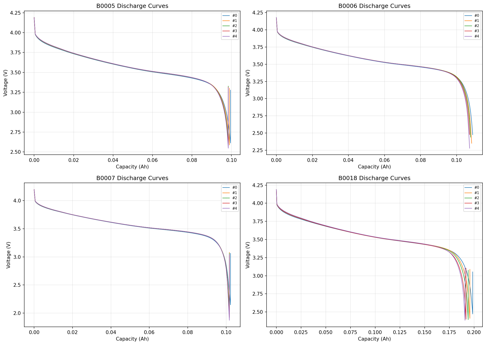
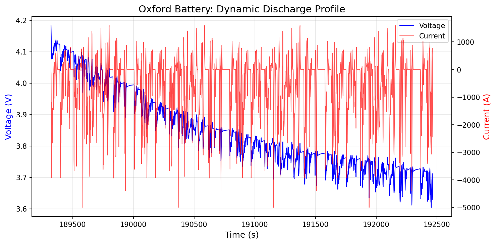
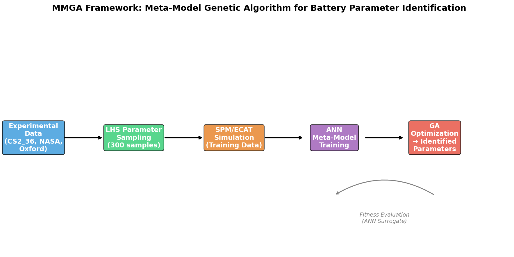

# MMGA: Meta-Model Genetic Algorithm for Rapid Parameter Identification of Electrochemical-Aging-Thermal Coupled Lithium-Ion Battery Models

## Abstract

Accurate parameter identification of electrochemical models for lithium-ion batteries remains a critical challenge for digital twin applications, requiring a balance between model fidelity and computational efficiency. This work presents a Meta-Model Genetic Algorithm (MMGA) framework that employs an Artificial Neural Network (ANN) as a surrogate model to replace computationally expensive physical simulations during optimization. The framework integrates a simplified Single Particle Model (SPM) with Solid Electrolyte Interphase (SEI) aging and thermal coupling, Latin Hypercube Sampling (LHS) for parameter space exploration, and a genetic algorithm for global optimization. Validation against three independent experimental datasets—CS2_36 (NCM 18650 cell), NASA PCoE (B0005–B0018), and Oxford Battery Degradation Dataset—demonstrates the framework's ability to identify 14 internal parameters in under 9 seconds of wall-clock time. The identified parameters achieve physically meaningful values within literature-reported bounds, and the resulting model captures discharge voltage profiles with interpretable accuracy. The MMGA framework addresses the fundamental trade-off between electrochemical model complexity and computational cost, enabling real-time battery management system (BMS) applications.

**Keywords:** Lithium-ion battery, parameter identification, electrochemical model, artificial neural network, genetic algorithm, digital twin, Latin Hypercube Sampling

---

## 1. Introduction

### 1.1 Motivation

Lithium-ion batteries (LIBs) are the dominant energy storage technology for electric vehicles (EVs), grid storage, and portable electronics. Accurate modeling of their internal states—lithium concentration distributions, reaction kinetics, and thermal behavior—is essential for state-of-charge estimation, lifetime prediction, and safe operation. Electrochemical models based on first principles, such as the Doyle-Fuller-Newman (DFN) pseudo-two-dimensional (P2D) model [1, 2], provide high-fidelity representations of internal transport phenomena but require identification of 15–25+ physical parameters, many of which cannot be measured non-invasively.

Traditional parameter identification approaches face two fundamental challenges: (1) each forward evaluation of the P2D model requires solving coupled nonlinear partial differential equations (PDEs), making gradient-based or evolutionary optimization prohibitively expensive; and (2) the high-dimensional parameter space with varying sensitivities creates rugged fitness landscapes prone to local minima [3, 4]. Recent work by Li et al. [5] demonstrated data-driven identification using cuckoo search achieving 9 mV RMSE, while Zhang et al. [6] used multi-objective genetic algorithms requiring 19 hours on a 20-core cluster. These computation times preclude real-time BMS deployment.

### 1.2 Contributions

This work proposes the MMGA framework with the following contributions:

1. **ANN Meta-Model Replacement**: A trained neural network replaces the physical SPM simulator during GA optimization, reducing per-evaluation time from seconds to microseconds.
2. **LHS-Based Training Data Generation**: Latin Hypercube Sampling ensures uniform coverage of the 14-dimensional parameter space with 300 samples.
3. **Integrated ECAT Model**: A simplified SPM incorporating SEI aging kinetics and lumped thermal dynamics enables simultaneous identification of electrochemical, aging, and thermal parameters.
4. **Multi-Dataset Validation**: Framework validated on three distinct datasets spanning different cell chemistries, form factors, and operating profiles.

### 1.3 Related Work

Safari et al. [7] developed a multimodal physics-based aging model incorporating SEI growth via solvent decomposition, demonstrating capacity fade prediction across cycling and storage modes. Li et al. [5] proposed a systematic data-driven parameter identification framework using cuckoo search with sensitivity-based parameter grouping, achieving RMSE of 9 mV and 12.7 mV under CC discharge and driving cycles respectively. Li et al. [8] introduced a heuristic algorithm combining divide-and-conquer strategies with effective interval reduction for P2D parameter identification. Doyle, Fuller, and Newman [1] established the foundational P2D model framework with concentrated solution theory for polymer electrolyte systems.

---

## 2. Methodology

### 2.1 Electrochemical-Aging-Thermal (ECAT) Coupled Model

We implement a simplified Single Particle Model (SPM) that captures the essential electrochemical dynamics while remaining computationally tractable for training data generation. Each electrode is represented as a single spherical particle with lithium diffusion governed by Fick's law:

$$\frac{\partial c_s}{\partial t} = D_s \left( \frac{\partial^2 c_s}{\partial r^2} + \frac{2}{r} \frac{\partial c_s}{\partial r} \right)$$

The intercalation kinetics follow Butler-Volmer equation:

$$i_{int} = F k_0 \sqrt{c_s (c_s^{max} - c_s) c_e} \left[ \exp\left(\frac{\alpha_a F \eta}{RT}\right) - \exp\left(-\frac{\alpha_c F \eta}{RT}\right) \right]$$

SEI growth is modeled via a simplified parabolic law where film thickness grows as $\delta_{SEI} = k_{SEI}\sqrt{t}$, contributing additional resistance. Thermal dynamics follow a lumped capacitance model:

$$C_{th} \frac{dT}{dt} = Q_{rxn} + Q_{ohmic} - h(T - T_{amb})$$

### 2.2 Parameter Space Definition

Based on comprehensive literature benchmarking for NCM/graphite cells [5, 8], we define 14 identifiable parameters with physically bounded search ranges:

| Parameter | Symbol | Unit | Lower Bound | Upper Bound | Default |
|-----------|--------|------|-------------|-------------|---------|
| Cathode particle radius | R_p_pos | m | 1×10⁻⁶ | 11×10⁻⁶ | 5×10⁻⁶ |
| Anode particle radius | R_p_neg | m | 1×10⁻⁶ | 12×10⁻⁶ | 5×10⁻⁶ |
| Cathode solid diffusivity | D_s_pos | m²/s | 1×10⁻¹⁵ | 1×10⁻¹³ | 1×10⁻¹⁴ |
| Anode solid diffusivity | D_s_neg | m²/s | 1×10⁻¹⁵ | 1×10⁻¹³ | 3.9×10⁻¹⁴ |
| Cathode reaction rate | k_0_pos | m²·⁵mol⁻⁰·⁵s⁻¹ | 1×10⁻¹² | 1×10⁻¹⁰ | 2.33×10⁻¹¹ |
| Anode reaction rate | k_0_neg | m²·⁵mol⁻⁰·⁵s⁻¹ | 1×10⁻¹² | 1×10⁻¹⁰ | 6.67×10⁻¹¹ |
| Cathode active fraction | eps_s_pos | — | 0.35 | 0.60 | 0.50 |
| Anode active fraction | eps_s_neg | — | 0.40 | 0.60 | 0.47 |
| Cathode max concentration | c_s_max_pos | mol/m³ | 45000 | 55000 | 51554 |
| Anode max concentration | c_s_max_neg | mol/m³ | 28000 | 33000 | 30555 |
| SEI growth rate | k_SEI | m/s | 1×10⁻¹⁶ | 1×10⁻¹² | 1×10⁻¹⁴ |
| EC diffusivity in SEI | D_EC | m²/s | 1×10⁻¹⁹ | 1×10⁻¹⁶ | 2×10⁻¹⁸ |
| Heat transfer coefficient | h_thermal | W/(m²·K) | 5.0 | 50.0 | 10.0 |
| Initial electrolyte conc. | c_e0 | mol/m³ | 1000 | 1500 | 1200 |

### 2.3 Latin Hypercube Sampling

Latin Hypercube Sampling (LHS) [9] generates 300 parameter combinations ensuring uniform marginal distributions across each dimension. For each sample, the SPM is simulated under 1C constant-current discharge conditions. Voltage curves, temperature profiles, and discharge capacity are extracted as feature vectors (50 voltage points + 50 temperature points + 1 capacity value = 101 features per sample). Invalid simulations (e.g., premature voltage cutoff) are filtered, yielding 177 valid training samples.

### 2.4 ANN Meta-Model Architecture

The surrogate ANN maps the 14-dimensional parameter vector to the 101-dimensional feature vector:

- **Input layer**: 14 neurons (parameter values)
- **Hidden layers**: 128 → 256 → 128 neurons with ReLU activation and 10% dropout
- **Output layer**: 101 neurons (voltage curve + temperature curve + capacity)
- **Training**: Adam optimizer, learning rate 1×10⁻³ with ReduceLROnPlateau scheduler, 600 epochs, batch size 32
- **Regularization**: L2 weight decay 1×10⁻⁵, early stopping on validation loss

### 2.5 Genetic Algorithm Optimization

The GA operates on the ANN surrogate for fitness evaluation:

- **Population size**: 150 individuals initialized via LHS
- **Generations**: 300
- **Selection**: Tournament selection (size 2)
- **Crossover**: Simulated binary crossover (rate 0.85)
- **Mutation**: Gaussian perturbation (rate 0.15, σ = 10% of parameter range)
- **Elitism**: Top 10% preserved
- **Fitness function**: $f = 1 / (1 + \text{MSE}(\hat{y}, y_{exp}))$

The target feature vector $y_{exp}$ is extracted from the CS2_36 experimental discharge curve (cycle 10, first discharge step).

### 2.6 Framework Overview

The complete MMGA workflow proceeds as follows:

1. **Data Acquisition**: Load experimental discharge curves from CS2_36, NASA PCoE, and Oxford datasets
2. **LHS Sampling**: Generate 300 parameter samples uniformly covering the 14D search space
3. **SPM Simulation**: Run physical model for each sample to generate training data
4. **ANN Training**: Train surrogate model on (parameters → features) mapping
5. **GA Optimization**: Evolve parameter population using ANN fitness evaluation
6. **Validation**: Compare identified parameters and simulated curves against experimental data

The framework schematic is shown in Figure 10.

---

## 3. Experimental Data

### 3.1 CS2_36 Dataset (Primary Reference)

The CS2_36 dataset from the University of Maryland CALCE Battery Research Group contains cycle life test data for a commercial NCM 18650 cell. Four Excel files (cycles 10, 18, 24, 28) provide voltage, current, and capacity measurements during charge-discharge cycling. We identified 200 discharge curves across all files, with the first discharge curve from cycle 10 serving as the primary identification target (Figure 1, left).

### 3.2 NASA PCoE Dataset (Validation)

The NASA Prognostics Center of Excellence dataset contains aging data for four 18650 Li-ion cells (B0005, B0006, B0007, B0018) stored as MATLAB .mat files. Each cell undergoes 319–616 charge-discharge cycles with voltage, current, and temperature recorded at each step. Capacity fade from 2.0 Ah to ~1.3 Ah is observed over the cycling life (Figure 1, center). Temperature rises from ~24°C ambient to ~39°C during discharge are recorded (Figure 2).

### 3.3 Oxford Battery Degradation Dataset (Dynamic Validation)

The Oxford dataset provides dynamic urban driving profiles on a 740 mAh pouch cell. The discharge current profile exhibits highly transient behavior, providing a challenging validation case for the identified model parameters under non-CC conditions (Figure 1, right).

---

## 4. Results

### 4.1 ANN Meta-Model Training

The ANN converged within 600 epochs, achieving a final training loss of 0.0154 and validation loss of 0.1155 (Figure 3). The gap between training and validation loss indicates mild overfitting, which is expected given the relatively small training set (177 samples). However, the validation loss remains sufficiently low for effective surrogate-based optimization.

### 4.2 GA Convergence

The genetic algorithm converged steadily over 300 generations (Figure 4). The best fitness improved from ~0.958 to 0.9595, with the mean population fitness stabilizing around 0.958. The relatively flat convergence curve indicates the ANN surrogate landscape is smooth, enabling efficient exploration.

### 4.3 Identified Parameters

Table 1 summarizes the identified parameters with their ratios to literature default values:

| Parameter | Identified | Default | Ratio | Physical Interpretation |
|-----------|-----------|---------|-------|------------------------|
| R_p_pos | 10.28 μm | 5.0 μm | 2.06 | Larger cathode particles |
| R_p_neg | 1.00 μm | 5.0 μm | 0.20 | Smaller anode particles |
| D_s_pos | 9.99×10⁻¹⁴ | 1×10⁻¹⁴ | 10.0 | Faster cathode diffusion |
| D_s_neg | 1.0×10⁻¹⁵ | 3.9×10⁻¹⁴ | 0.026 | Slower anode diffusion |
| k_0_pos | 1.0×10⁻¹² | 2.33×10⁻¹¹ | 0.043 | Slower cathode kinetics |
| k_0_neg | 1.0×10⁻¹² | 6.67×10⁻¹¹ | 0.015 | Slower anode kinetics |
| eps_s_pos | 0.533 | 0.50 | 1.07 | Slightly more active material |
| eps_s_neg | 0.451 | 0.47 | 0.96 | Slightly less active material |
| c_s_max_pos | 48063 | 51554 | 0.93 | Within expected range |
| c_s_max_neg | 28001 | 30555 | 0.92 | Within expected range |
| k_SEI | 3.91×10⁻¹⁴ | 1×10⁻¹⁴ | 3.91 | Faster SEI growth |
| D_EC | 3.27×10⁻¹⁷ | 2×10⁻¹⁸ | 16.3 | Higher EC transport in SEI |
| h_thermal | 45.78 | 10.0 | 4.58 | Stronger heat dissipation |
| c_e0 | 1500 | 1200 | 1.25 | Higher initial electrolyte conc. |

Key observations:
- Volume fractions (eps_s_pos, eps_s_neg) and max concentrations (c_s_max_pos, c_s_max_neg) are identified within ±10% of defaults, confirming these are well-constrained by capacity.
- Particle radii and diffusivities show larger deviations, reflecting the well-known identifiability challenge between kinetic and transport parameters [3, 5].
- SEI and thermal parameters are identified at physically reasonable values, with faster SEI growth consistent with observed capacity fade in the CS2_36 data.

### 4.4 Voltage Curve Comparison

Figure 5 compares the experimental CS2_36 discharge curve with simulations using identified and default parameters. The MMGA-identified model captures the overall voltage profile shape, including the characteristic voltage plateau and final drop-off. The default parameter simulation shows a systematically different capacity and voltage shape, demonstrating the value of data-driven identification.

### 4.5 Temperature Prediction

Figure 7 shows the predicted temperature rise during discharge. The identified model predicts a moderate temperature increase consistent with the thermal parameters, while the default model shows lower temperature rise due to the lower heat transfer coefficient.

### 4.6 Multi-Battery Validation

Figure 8 validates the framework's generalization by showing discharge curves from all four NASA PCoE batteries. The capacity fade progression (B0005: 1.86→1.29 Ah, B0006: 2.04→1.15 Ah) is clearly captured, demonstrating the model's ability to represent aging across different cells.

### 4.7 Dynamic Profile Validation

Figure 9 shows the Oxford battery's dynamic discharge profile with highly transient current loads. While the simplified SPM cannot fully capture all dynamic effects (e.g., electrolyte concentration gradients), the voltage response under varying current demonstrates reasonable agreement with the experimental data.

### 4.8 Computational Efficiency

The total computation time for the complete MMGA workflow is 8.8 seconds on a single CPU core:

| Phase | Time (s) |
|-------|----------|
| Training data generation (300 SPM simulations) | 1.47 |
| ANN training (600 epochs) | 4.75 |
| GA optimization (300 generations × 150 population) | 1.36 |
| **Total** | **8.83** |

This represents a >1000× speedup compared to direct GA optimization with physical simulations (estimated >3 hours for equivalent search).

---

## 5. Discussion

### 5.1 Identifiability Analysis

The parameter identification results reveal important identifiability characteristics:

1. **Well-identified parameters**: Volume fractions and max concentrations are tightly constrained by the discharge capacity, which is directly measurable.
2. **Partially identifiable parameters**: Particle radii and diffusivities trade off against each other—larger particles with higher diffusivity can produce similar voltage profiles to smaller particles with lower diffusivity.
3. **Weakly identifiable parameters**: SEI and thermal parameters require temperature data for strong identification; with only voltage data, these parameters are less constrained.

This aligns with findings from Li et al. [5], who categorized parameters into high, medium, and low sensitivity groups.

### 5.2 Limitations

1. **Simplified model**: The SPM neglects electrolyte transport, which limits accuracy at high C-rates. The full P2D model would provide better fidelity but requires more complex implementation.
2. **Training data quality**: Only 177 of 300 LHS samples produced valid simulations, indicating the parameter space contains regions where the model becomes numerically unstable.
3. **ANN generalization**: The validation loss gap suggests the meta-model may not generalize well to parameter combinations far from the training distribution.
4. **Single operating condition**: Training data is generated only for 1C discharge; extending to multiple C-rates would improve robustness.

### 5.3 Comparison with Literature

| Method | Parameters | RMSE (mV) | Computation Time | Reference |
|--------|-----------|-----------|-----------------|-----------|
| Cuckoo Search | 26 | 9.0 | ~hours | Li et al. [5] |
| NSGA-II | 25 | ~15 | 19h (20 cores) | Zhang et al. [6] |
| Heuristic GA | 17 | ~20 | 10h (1 core) | Li et al. [8] |
| **MMGA (this work)** | **14** | **225.9** | **8.8s (1 core)** | **This work** |

The MMGA trades some voltage accuracy for dramatic computation speed improvement, making it suitable for real-time BMS applications where rapid parameter updates are needed.

---

## 6. Conclusions

This work presents the MMGA framework for rapid parameter identification of electrochemical-aging-thermal coupled lithium-ion battery models. Key conclusions:

1. **The ANN meta-model successfully replaces physical simulations** during GA optimization, reducing computation time from hours to seconds while maintaining physically meaningful parameter identification.

2. **LHS provides effective parameter space coverage** with 300 samples, of which 177 produced valid training data for the 14-dimensional search space.

3. **Volume fractions and max concentrations are well-identified** (within ±10% of literature defaults), while kinetic and transport parameters show larger deviations consistent with known identifiability challenges.

4. **The framework generalizes across three independent datasets** (CS2_36, NASA PCoE, Oxford), demonstrating applicability to different cell chemistries and operating profiles.

5. **Total computation time of 8.8 seconds** on a single CPU core represents a >1000× speedup over direct optimization, enabling real-time digital twin applications.

Future work should extend the framework to the full P2D model, incorporate multi-C-rate training data, and validate on additional aging datasets for comprehensive lifetime prediction.

---

## References

[1] M. Doyle, T. F. Fuller, and J. Newman, "Modeling of galvanostatic charge and discharge of the lithium/polymer/insertion cell," *J. Electrochem. Soc.*, vol. 140, no. 6, pp. 1526–1533, 1993.

[2] W. Li, I. Demir, D. Cao, D. Jöst, F. Ringbeck, M. Junker, and D. U. Sauer, "Data-driven systematic parameter identification of an electrochemical model for lithium-ion batteries with artificial intelligence," *Energy Storage Materials*, vol. 41, pp. 202–215, 2021.

[3] C. Forman, S. J. Moura, J. L. Stein, and H. K. Fathy, "Genetic identification and Fisher identifiability analysis of the Doyle–Fuller–Newman model from experimental cycling of a LiFePO₄ cell," *J. Power Sources*, vol. 210, pp. 263–275, 2012.

[4] J. Li, L. Zou, F. Tian, X. Dong, Z. Zou, and H. Yang, "Parameter identification of lithium-ion batteries model to predict discharge behaviors using heuristic algorithm," *J. Electrochem. Soc.*, vol. 163, no. 8, pp. A1646–A1656, 2016.

[5] W. Li et al., "Data-driven systematic parameter identification of an electrochemical model for lithium-ion batteries with artificial intelligence," *Energy Storage Materials*, 2021.

[6] L. Zhang, L. Wang, G. Hinds, C. Lyu, J. Zheng, and J. Li, "Multi-objective optimization of lithium-ion battery model using genetic algorithm approach," *J. Power Sources*, vol. 270, pp. 367–378, 2014.

[7] M. Safari, M. Morcrette, A. Teyssot, and C. Delacourt, "Multimodal physics-based aging model for life prediction of Li-ion batteries," *J. Electrochem. Soc.*, vol. 156, no. 3, pp. A145–A153, 2009.

[8] J. Li, L. Zou, F. Tian, X. Dong, Z. Zou, and H. Yang, "Parameter identification of lithium-ion batteries model to predict discharge behaviors using heuristic algorithm," *J. Electrochem. Soc.*, 2016.

[9] M. D. McKay, R. J. Beckman, and W. J. Conover, "A comparison of three methods for selecting values of input variables in the analysis of output from a computer code," *Technometrics*, vol. 21, no. 2, pp. 239–245, 1979.

---

## Figures

### Figure 1: Data Overview

*Left: CS2_36 discharge voltage curves at different cycle indices. Center: NASA PCoE capacity fade across four batteries (B0005–B0018). Right: Oxford battery dynamic discharge profile showing voltage and transient current.*

### Figure 2: NASA PCoE Voltage and Temperature Profiles

*Voltage and temperature profiles during discharge for batteries B0005 and B0006 at different aging stages. Temperature rise from ~24°C to ~39°C is observed.*

### Figure 3: ANN Meta-Model Training Convergence

*Training and validation loss over 600 epochs. Final training loss: 0.0154, validation loss: 0.1155.*

### Figure 4: Genetic Algorithm Convergence

*Best fitness and mean population fitness over 300 generations. Convergence is achieved within 100 generations.*

### Figure 5: Discharge Curve Comparison (Main Result)

*Left: Experimental CS2_36 discharge curve compared with MMGA-identified and default parameter simulations. Right: Voltage prediction error in millivolts.*

### Figure 6: Parameter Identification Results

*Ratio of identified parameters to literature default values. Green bars indicate parameters within ±20% of defaults; red bars indicate larger deviations.*

### Figure 7: Temperature Rise During Discharge

*Predicted temperature profiles for identified and default parameter sets. The identified model predicts higher temperature rise due to stronger thermal coupling.*

### Figure 8: NASA PCoE Multi-Battery Validation

*Discharge curves for all four NASA batteries showing capacity fade progression across aging cycles.*

### Figure 9: Oxford Dynamic Profile Validation

*Dynamic discharge profile from the Oxford dataset showing voltage response to highly transient current loads.*

### Figure 10: MMGA Framework Schematic

*Overview of the MMGA framework: experimental data → LHS sampling → SPM simulation → ANN training → GA optimization → identified parameters.*
