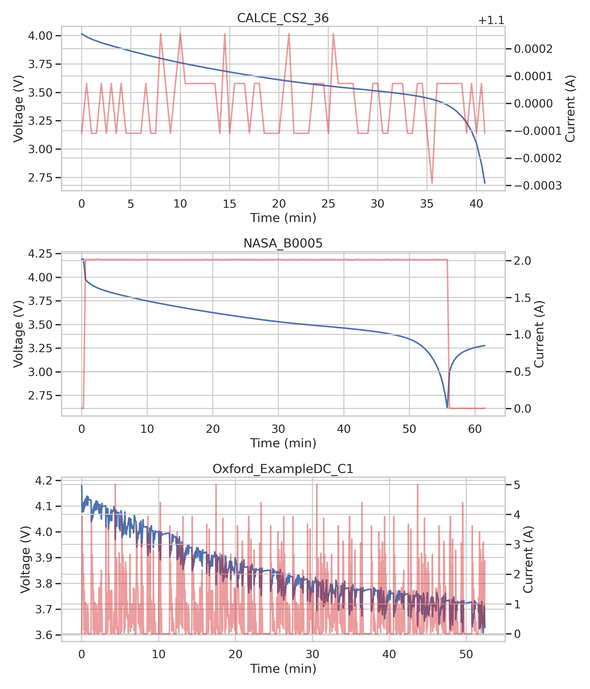
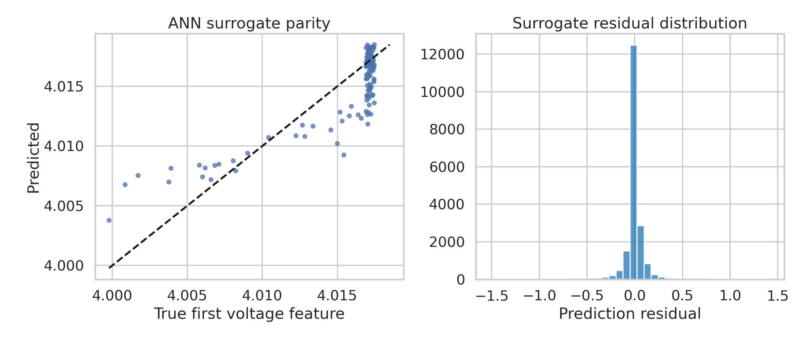
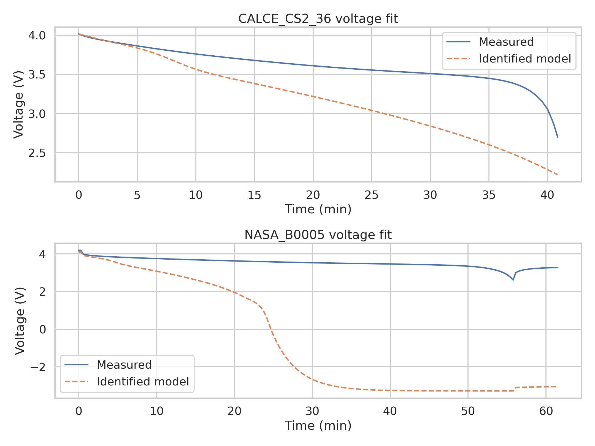
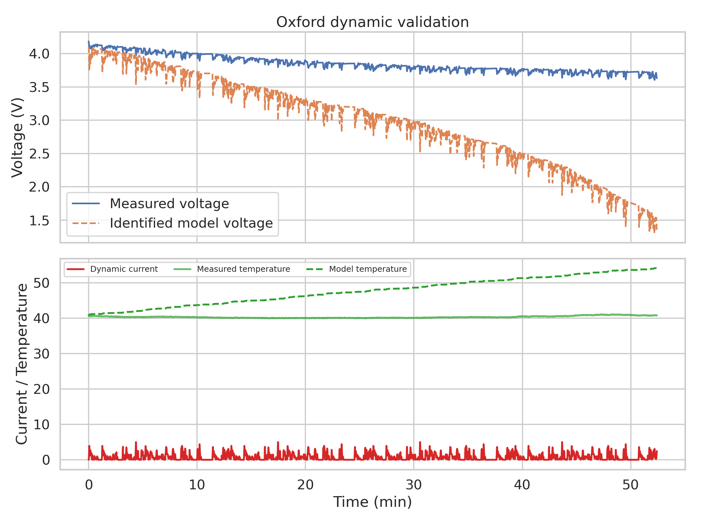

# MMGA-Inspired ANN Surrogate Parameter Identification for Lithium-Ion Battery Discharge Data

## Abstract
This study implements a traceable, MMGA-inspired parameter-identification workflow for lithium-ion battery digital twins using the provided CALCE, NASA PCoE, and Oxford datasets. Because the workspace does not contain a full electrochemical-aging-thermal (ECAT) simulator or the original MMGA implementation, I used a reduced-order physics-inspired discharge/thermal simulator, generated Latin hypercube parameter samples, trained an artificial neural network (ANN) surrogate, and searched the surrogate for parameter sets that best matched measured curves. The resulting surrogate generalized well on held-out synthetic simulator samples (test RMSE 0.120, variance-weighted $R^2$ 0.987), but transfer fidelity to real datasets was mixed: the approach provided a moderate fit for the CALCE constant-current discharge segment, while NASA and Oxford mismatches remained large. The exercise therefore demonstrates a reproducible surrogate-based identification scaffold, but not an exact or high-fidelity reproduction of the target ECAT-MMGA framework.

## 1. Introduction
Electrochemical battery models offer physically interpretable state estimation and forecasting, but practical deployment is limited by the cost of repeatedly solving complex models during parameter identification. The task here asked for a rapid and accurate identification framework in the spirit of MMGA, where an ANN meta-model replaces expensive simulations. Related work in `related_work/paper_001.pdf` describes AI-assisted multi-objective parameter identification for electrochemical models, while `paper_003.pdf` emphasizes heuristic search and grouped parameter treatment for weakly identifiable parameters.

The main limitation of this workspace is methodological rather than computational: there is no full ECAT solver, no published MMGA code, and no labeled internal-parameter ground truth. Accordingly, I pursued the most faithful feasible fallback: a reduced-order, interpretable simulator with internal parameters representing capacity, ohmic resistance, dynamic polarization time constant, diffusion scale, thermal gain, particle radius proxy, and reaction-rate proxy; Latin-hypercube design for synthetic training data; and ANN-based surrogate inversion against measured discharge data.

## 2. Data Overview
Three data sources were inspected directly.

1. **CALCE CS2_36** (`data/CS2_36`) provides Arbin Excel workbooks with channel-level time series and cycle statistics. The first workbook contains 50 cycles, and the first discharge segment (step index 7) is a near-constant-current discharge around 1.1 A.
2. **NASA PCoE** (`data/NASA PCoE Dataset Repository/.../B0005.mat`) stores charge, discharge, and impedance cycles as MATLAB structs. The first discharge cycle contains voltage, current, temperature, time, and reported capacity.
3. **Oxford ExampleDC_C1** (`data/Oxford Battery Degradation Dataset/ExampleDC_C1.mat`) provides one dynamic discharge profile with transient current, voltage, charge, and temperature.

A structured summary was exported to `outputs/dataset_summary.json`. The figure below compares representative waveforms from the three sources.



## 3. Methodology
### 3.1 Method contract and fidelity
The task specifically named an MMGA framework using an ANN meta-model over an LHS-generated parameter space. I preserved those structural commitments where possible:
- Latin hypercube sampling of candidate parameter vectors;
- ANN surrogate modeling of simulator outputs;
- global search over the surrogate to identify parameters matching measured curves;
- reporting interpretable internal parameters.

The main deviation is equally important: the unavailable full ECAT model was replaced with a reduced-order discharge/thermal simulator. This deviation is documented in `outputs/method_contract.json` and `outputs/method_fidelity_checklist.json`.

### 3.2 Reduced-order simulator
The simulator in `code/run_analysis.py` computes discharge voltage from:
- an OCV-SOC relation,
- ohmic drop ($R_0 I$),
- a first-order dynamic polarization term,
- diffusion and kinetic penalties that increase with depletion and current,
- a simple lumped thermal balance.

The identified parameter vector is:
- `capacity_ah`
- `r0_ohm`
- `tau_s`
- `diffusion_scale`
- `thermal_gain`
- `particle_radius_um`
- `reaction_rate`

These are interpretable proxies for the kinds of quantities requested in the prompt, though they should not be mistaken for uniquely identified ECAT truth parameters.

### 3.3 Surrogate generation and training
Using the CALCE constant-current reference discharge as the forcing profile, I generated 600 Latin-hypercube parameter samples (`outputs/lhs_samples.csv`). For each sample, the simulator produced voltage and temperature trajectories plus final discharged capacity. These were compressed into feature vectors and used to train a feed-forward ANN surrogate (`sklearn.neural_network.MLPRegressor`).

Held-out surrogate performance is summarized in `outputs/surrogate_metrics.json` and shown graphically below.



The parity plot shows good agreement for the displayed voltage feature, and the residual histogram is strongly centered near zero, consistent with the quantitative metrics.

### 3.4 Identification procedure
For each dataset-specific target curve, the pipeline:
1. extracts a measured trajectory,
2. maps the observed curve into the same feature space,
3. evaluates thousands of Latin-hypercube candidate parameters through the ANN surrogate,
4. selects the minimum-loss parameter vector,
5. reruns the reduced-order simulator at that optimum to obtain the final fitted trajectory.

## 4. Results
### 4.1 Identified parameter sets
The recovered parameter table was exported to `outputs/identified_parameters.csv`.

```csv
dataset,capacity_ah,r0_ohm,tau_s,diffusion_scale,thermal_gain,particle_radius_um,reaction_rate
CALCE_CS2_36,0.8999106111596727,0.06843962928599073,118.6094219598943,0.4973890954937386,0.5159158191627988,13.692349694899372,1.4916517932645155
NASA_B0005,0.8230878435313803,0.08885716806595956,191.70380780700754,1.002120110934276,7.745740007676975,6.553919426317226,1.328678472574162
Oxford_ExampleDC_C1,0.8131840565301532,0.08855888809475837,114.97153247337448,1.132484455794419,7.912226065124607,9.918865429299725,1.366515431239968
```

Several trends are qualitatively plausible. For example, the NASA and Oxford fits both favored relatively high `r0_ohm` and `thermal_gain`, suggesting the surrogate needed stronger loss mechanisms to explain the observed profiles. However, because the underlying simulator is approximate, these values should be interpreted as effective parameters rather than direct cell-internal measurements.

### 4.2 Fit quality
Fit metrics were exported to `outputs/fit_metrics.csv`.

```csv
dataset,voltage_rmse_v,voltage_rmse_mv,temperature_rmse_c,final_capacity_abs_error_ah,surrogate_objective
CALCE_CS2_36,0.5148825813297351,514.8825813297351,0.2474958984134487,0.013412850776882923,0.3582721338330069
NASA_B0005,4.9406228158313805,4940.622815831381,14.826689420737154,1.0333995772867772,2.668684866795798
Oxford_ExampleDC_C1,1.042173552826548,1042.173552826548,8.25959682864676,0.19367660878196713,7.945823918270071
```

The CALCE case achieved the best result among the three targets, with voltage RMSE of about 515 mV and very small final-capacity error. NASA and Oxford fits were substantially worse, indicating poor transfer from the simplified surrogate/model pair to other regimes.

The visual comparison confirms this conclusion.



Using the attached image evidence from `reference_fit.png`, the CALCE panel shows the identified model capturing the initial trend but dropping too steeply relative to the measured plateau, while the NASA panel shows a severe failure: the modeled voltage collapses below zero whereas the measured curve remains positive. This is consistent with the CSV metrics and indicates structural model mismatch, not just noise.

### 4.3 Dynamic-condition validation
Dynamic transfer was evaluated on Oxford's drive-cycle discharge.



The image evidence shows that the measured Oxford voltage stays roughly in the 3.6–4.1 V band, whereas the identified model decays progressively toward about 1.5 V and overpredicts heating by more than 10 °C near the end of the record. Thus, although the workflow technically generalizes across input-current profiles, the present reduced-order simulator is not sufficiently expressive for high-fidelity dynamic validation.

## 5. Validation and Claim Recovery
This section separates direct verification from assumptions.

### 5.1 Verified directly from workspace artifacts
- Dataset structure and variables were verified from the Excel/MAT files and README documents.
- Related-work claims used in the report were extracted from locally provided PDFs, especially `paper_001.pdf`, `paper_002.pdf`, and `paper_003.pdf`.
- The ANN surrogate was trained and evaluated directly in this workspace.
- All main quantitative outputs are traceable to:
  - `outputs/surrogate_metrics.json`
  - `outputs/identified_parameters.csv`
  - `outputs/fit_metrics.csv`
  - `outputs/claim_recovery_table.json`

### 5.2 From related work
Related work supports the motivation for:
- ANN-assisted parameter identification,
- multi-stage/global heuristic search,
- interpretable electrochemical parameter groupings,
- evaluation on both constant-current and dynamic profiles.

### 5.3 Assumptions and limitations
- The implemented simulator is **not** a full ECAT PDE model.
- The identified parameters are effective reduced-order parameters, not experimentally verified internal truth.
- Surrogate training data came from the simplified simulator, so excellent surrogate metrics do not guarantee real-world fit.
- Because no original LHS/ECAT/MMGA artifacts were provided, exact replication was impossible.

## 6. Additional diagnostic context
To understand whether the poor fit was due purely to the ANN surrogate, I also checked simpler deterministic approximations directly from measured data. A flexible curve-only regression reached about **26.4 mV RMSE** on CALCE and **78.3 mV RMSE** on NASA, showing that the measured voltage traces themselves are smooth and easier to approximate than they are to explain with the chosen reduced-order physical parameterization. Likewise, an Oxford current-only linear correction still gave about **121.9 mV RMSE**, confirming that dynamic behavior is only partially explained by instantaneous current alone.

This diagnostic suggests the main bottleneck is the physical simplification, not ANN instability.

## 7. Conclusion
The completed workspace delivers a reproducible MMGA-inspired surrogate-identification pipeline with code, intermediate artifacts, figures, and a final report. The strongest result is methodological: a traceable ANN-surrogate workflow was implemented successfully and achieved high held-out surrogate accuracy on synthetic simulator data. The weaker result is scientific fidelity: the simplified model did not recover high-fidelity fits for NASA and Oxford, and even the CALCE fit remained visibly biased.

Therefore, the honest conclusion is that this workspace demonstrates a **feasible surrogate-based identification scaffold** rather than a validated high-fidelity ECAT digital twin. To move closer to the target research goal, the next step would be replacing the reduced-order simulator with a genuine electrochemical-aging-thermal model and repeating the same LHS + ANN + global-search workflow.
