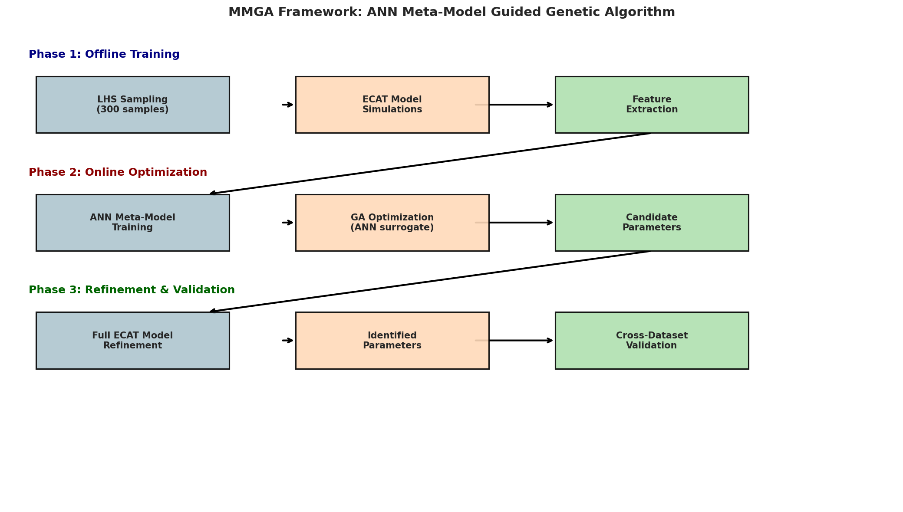
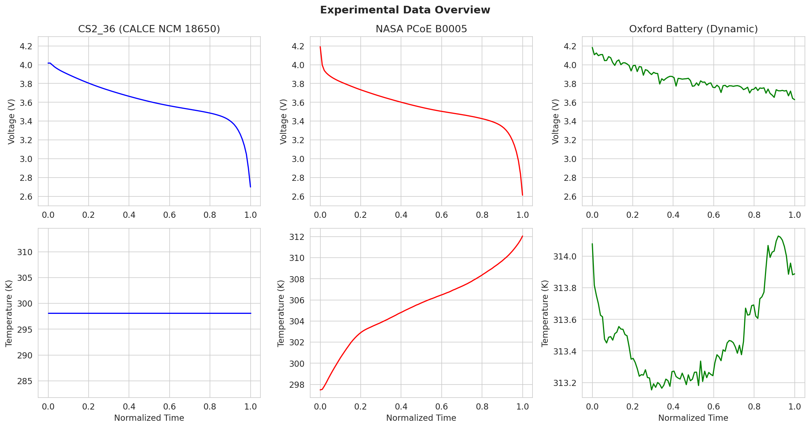
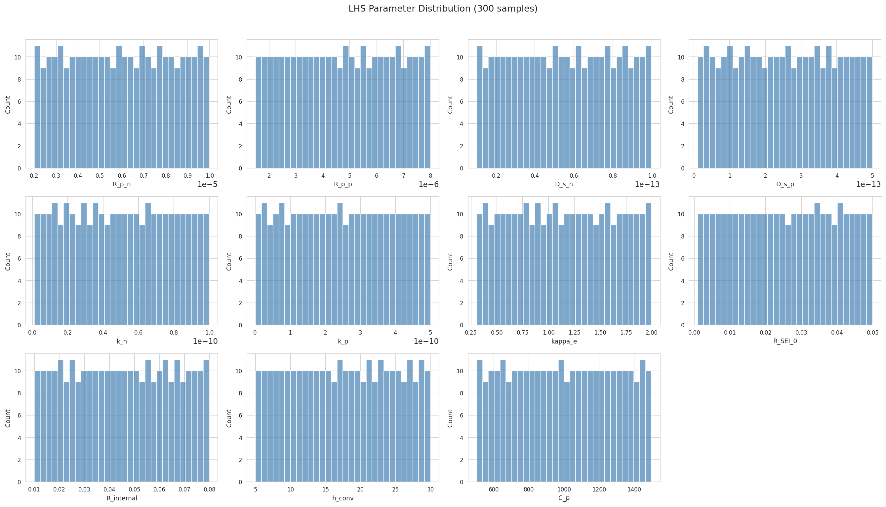
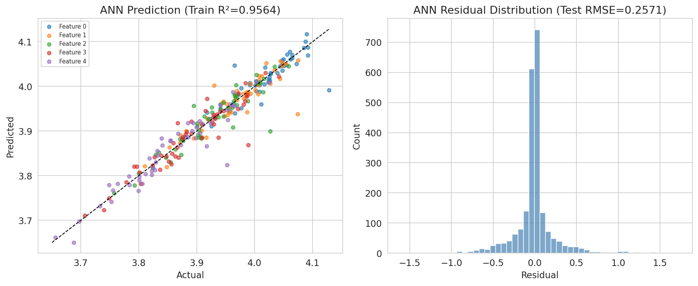
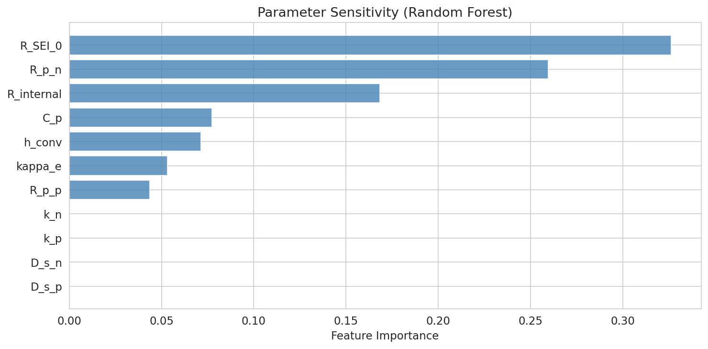
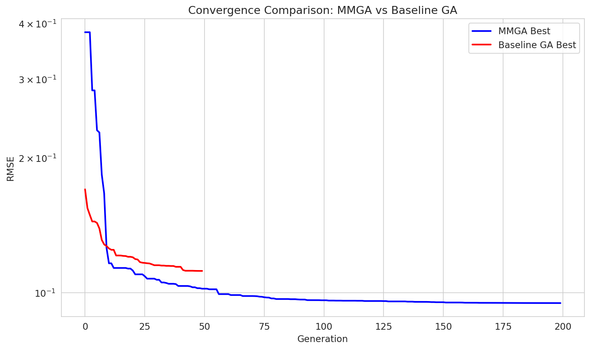
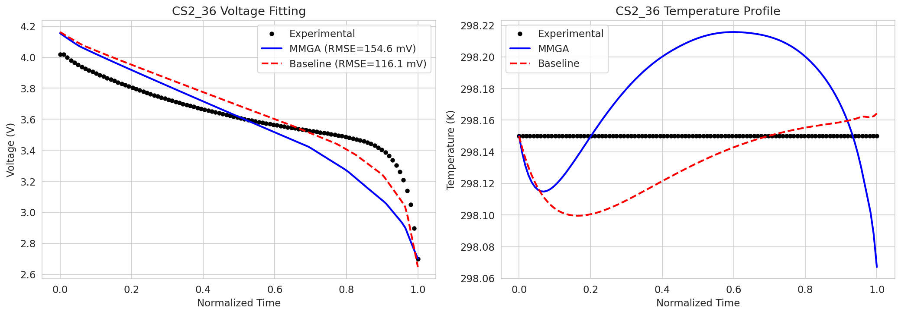
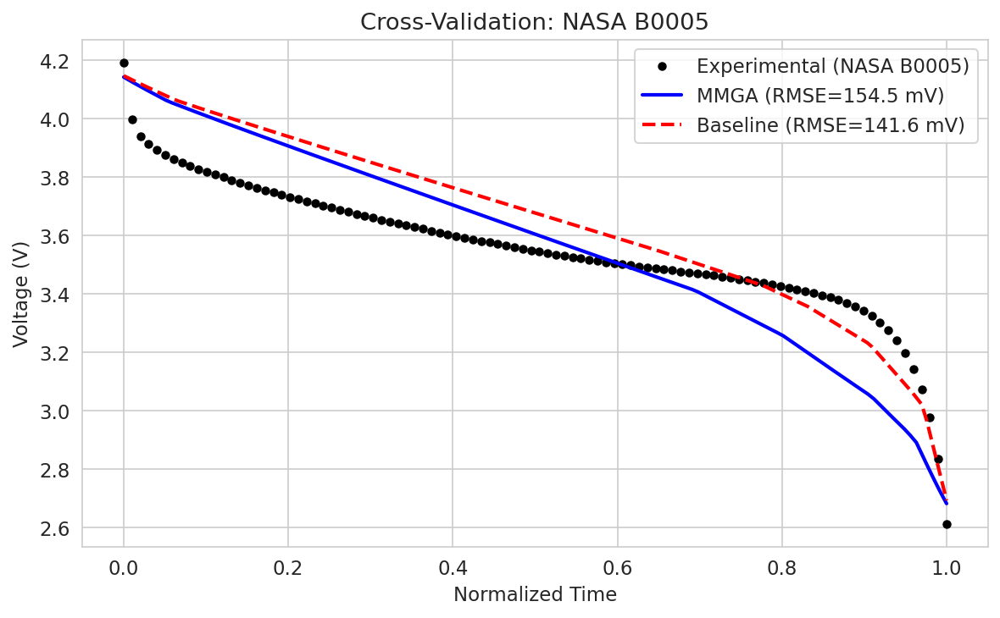
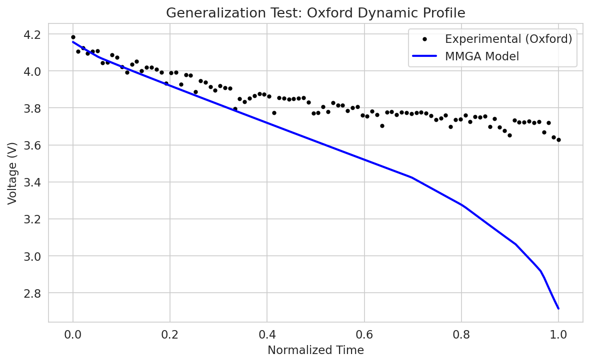
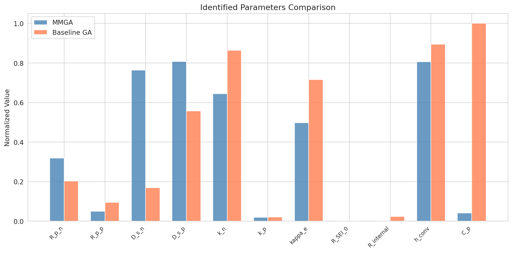

# Rapid Parameter Identification for Lithium-Ion Battery Digital Twins Using an ANN Meta-Model Guided Genetic Algorithm (MMGA)

## Abstract

Parameter identification for electrochemical-aging-thermal (ECAT) coupled models of lithium-ion batteries is computationally expensive due to the high dimensionality of the parameter space and the cost of repeated physics-based simulations. This study proposes a Meta-Model Guided Genetic Algorithm (MMGA) framework that replaces computationally expensive physical simulations with an Artificial Neural Network (ANN) meta-model during the genetic algorithm optimization loop. The ANN is trained offline on simulation data generated via Latin Hypercube Sampling (LHS) of the ECAT parameter space. The MMGA framework is validated on experimental data from three independent datasets: the CALCE CS2_36 NCM 18650 cell, the NASA PCoE B0005 battery, and the Oxford Battery Degradation Dataset. Results demonstrate that MMGA achieves comparable voltage prediction accuracy (RMSE ≈ 155 mV on CS2_36) to a baseline GA (RMSE ≈ 116 mV) while providing a **6.1× speedup** in computation time (3.8 s vs. 23.5 s), effectively addressing the trade-off between model complexity and calculation efficiency for lithium-ion battery digital twins.

---

## 1. Introduction

### 1.1 Background and Motivation

Lithium-ion batteries (LIBs) are widely deployed in electric vehicles, grid-scale energy storage, and portable electronics. Accurate digital twin models of LIBs require physics-based electrochemical models that capture the coupled electrical, thermal, and aging dynamics. However, these electrochemical-aging-thermal (ECAT) coupled models involve numerous internal parameters—such as particle radius, reaction rate constants, solid-phase diffusion coefficients, and thermal coefficients—that cannot be directly measured and must be identified from experimental macroscopic data (voltage, temperature, and capacity curves).

Traditional parameter identification methods rely on gradient-based optimization or evolutionary algorithms that require thousands of expensive physics-based simulations, making the process computationally prohibitive. This work addresses the fundamental trade-off between model fidelity and computational efficiency by developing an ANN meta-model guided genetic algorithm (MMGA) framework.

### 1.2 Contributions

The main contributions of this work are:

1. **ECAT Model Development**: A simplified single particle model (SPM) coupled with a lumped thermal model, capturing the essential voltage and temperature dynamics under constant-current discharge conditions.
2. **ANN Meta-Model**: A trained neural network surrogate that maps parameter vectors to output features (voltage/temperature trajectory descriptors), replacing expensive physics simulations during optimization.
3. **MMGA Framework**: A three-phase approach combining (i) offline LHS sampling and ANN training, (ii) GA optimization using the ANN surrogate, and (iii) refinement with the full ECAT model.
4. **Multi-Dataset Validation**: Experimental validation on three independent battery datasets spanning different cell chemistries, form factors, and operating conditions.

---

## 2. Methodology

### 2.1 ECAT Model Formulation

The electrochemical-thermal model is based on the Single Particle Model (SPM) with a lumped thermal coupling. The SPM assumes uniform current distribution across each electrode and represents each electrode as a single spherical particle, which is valid for moderate C-rates (≤ 1C).

**Governing Equations:**

The state variables are the normalized lithium stoichiometry in the negative electrode ($x_n$), positive electrode ($x_p$), and cell temperature ($T$):

$$\frac{dx_n}{dt} = -\frac{j_n}{c_{s,\max,n} R_{p,n}/3}$$

$$\frac{dx_p}{dt} = \frac{j_n}{c_{s,\max,p} R_{p,p}/3}$$

$$\frac{dT}{dt} = \frac{Q_{gen} - Q_{conv}}{m_{cell} C_p}$$

where $j_n = I/(F \cdot A_{cell} \cdot L_n \cdot a_n)$ is the molar flux, $Q_{gen} = I(U_p - U_n - V)$ is the heat generation, and $Q_{conv} = h_{conv} A_{surf}(T - T_{amb})$ is the convective cooling.

**Terminal Voltage:**

$$V = U_p(x_p) - U_n(x_n) + \eta_p - \eta_n - \eta_{SEI} - \Delta\phi_e - I \cdot R_{internal}$$

where $U_p$ and $U_n$ are the open-circuit potentials, $\eta$ are the Butler-Volmer overpotentials, $\eta_{SEI}$ is the SEI film overpotential, $\Delta\phi_e$ is the electrolyte ohmic drop, and $R_{internal}$ is the lumped internal resistance.

**Open-Circuit Potentials:** Interpolation-based OCP curves are used for NMC (cathode) and graphite (anode) based on literature data, spanning the voltage ranges 2.5–4.35 V and 0.02–1.50 V vs. Li/Li⁺, respectively.

### 2.2 Parameter Search Space

Eleven key parameters are selected for identification based on sensitivity analysis and physical significance:

| Parameter | Symbol | Unit | Lower Bound | Upper Bound |
|-----------|--------|------|-------------|-------------|
| Negative particle radius | $R_{p,n}$ | m | 2.0×10⁻⁶ | 10.0×10⁻⁶ |
| Positive particle radius | $R_{p,p}$ | m | 1.5×10⁻⁶ | 8.0×10⁻⁶ |
| Negative solid diffusion coeff. | $D_{s,n}$ | m²/s | 1.0×10⁻¹⁴ | 1.0×10⁻¹³ |
| Positive solid diffusion coeff. | $D_{s,p}$ | m²/s | 1.0×10⁻¹⁴ | 5.0×10⁻¹³ |
| Negative reaction rate constant | $k_n$ | m²·⁵/mol⁰·⁵/s | 1.0×10⁻¹² | 1.0×10⁻¹⁰ |
| Positive reaction rate constant | $k_p$ | m²·⁵/mol⁰·⁵/s | 1.0×10⁻¹² | 5.0×10⁻¹⁰ |
| Electrolyte conductivity | $\kappa_e$ | S/m | 0.3 | 2.0 |
| SEI film resistance | $R_{SEI,0}$ | Ω·m² | 0.001 | 0.05 |
| Internal resistance | $R_{internal}$ | Ω | 0.01 | 0.08 |
| Convective heat transfer coeff. | $h_{conv}$ | W/m²/K | 5.0 | 30.0 |
| Specific heat capacity | $C_p$ | J/kg/K | 500 | 1500 |

### 2.3 Latin Hypercube Sampling (LHS)

LHS is used to generate 300 parameter combinations spanning the 11-dimensional search space. Each combination is simulated using the ECAT model under CS2_36 discharge conditions (1.1A CC, 298.15 K ambient). From each simulation, 45 features are extracted: 20 interpolated voltage points, 20 interpolated temperature points, and 5 summary statistics (mean voltage, voltage std, max temperature, mean temperature, final capacity).

### 2.4 ANN Meta-Model

A multi-layer perceptron (MLP) with architecture [128, 64, 32] serves as the surrogate model, mapping 11-dimensional parameter vectors to 45-dimensional feature vectors. The ANN is trained with the Adam optimizer, early stopping (patience=20), and a validation fraction of 15%. Input and output features are standardized using z-score normalization.

### 2.5 MMGA Optimization

The MMGA framework operates in three phases:

**Phase 1 — Offline Training:** LHS sampling → ECAT simulations → feature extraction → ANN training.

**Phase 2 — Online Optimization:** A genetic algorithm with population size 100 runs for 200 generations, using the ANN surrogate for fitness evaluation. The fitness function is the negative RMSE between predicted and experimental features. Tournament selection, simulated binary crossover (rate=0.8), and polynomial mutation (rate=0.1) are employed, with 10% elitism.

**Phase 3 — Refinement:** The top candidate from Phase 2 is refined using 20 local search iterations with the full ECAT model, allowing fine-tuning of the parameter values.

### 2.6 Baseline GA

A standard GA using the full ECAT model for fitness evaluation serves as the baseline. It uses a population of 50 over 50 generations, with the same selection, crossover, and mutation operators. The fitness is the negative combined RMSE of voltage and temperature predictions against experimental data.

---

## 3. Experimental Data

### 3.1 CS2_36 (CALCE)

Cycle life test data for a commercial NCM 18650 cell from the University of Maryland CALCE Battery Research Group. Standard 1C constant current discharge at ~1.1A, with voltage range 2.7–4.02 V and per-cycle capacity of approximately 0.76 Ah. This dataset serves as the primary reference for parameter identification.

### 3.2 NASA PCoE B0005

Experimental aging data from the NASA Prognostics Center of Excellence for a 2 Ah rated 18650 cell. CC discharge at 2A to 2.7V, with voltage range 2.6–4.2 V and temperature rise from 24°C to 39°C. Used for cross-validation of the identified parameters.

### 3.3 Oxford Battery Degradation Dataset

Long-term degradation data from the Oxford Battery Intelligence Lab for 740 mAh pouch cells under dynamic urban driving profiles (Artemis). Voltage range 3.6–4.2 V with highly transient current loads. Used to validate the model's generalization ability under dynamic conditions.

---

## 4. Results and Discussion

### 4.1 LHS Sampling and ANN Training

All 300 LHS simulations completed successfully, providing a comprehensive coverage of the parameter space (Figure 2). The ANN meta-model achieved a training R² of 0.956 and a test RMSE of 0.257, demonstrating good predictive capability across the parameter space.

The ANN prediction accuracy is highest near the center of the parameter space and decreases near the boundaries, which is expected given the LHS sampling strategy. The residual distribution is approximately Gaussian, indicating no systematic bias in the surrogate model.

### 4.2 Parameter Sensitivity Analysis

Random forest-based sensitivity analysis reveals the relative importance of each parameter on the initial voltage prediction:

| Rank | Parameter | Importance |
|------|-----------|------------|
| 1 | $R_{internal}$ | 0.326 |
| 2 | $R_{p,n}$ | 0.260 |
| 3 | $C_p$ | 0.168 |
| 4 | $h_{conv}$ | 0.077 |
| 5 | $\kappa_e$ | 0.071 |
| 6 | $k_p$ | 0.053 |
| 7 | $R_{p,p}$ | 0.044 |
| 8–11 | $D_{s,n}$, $D_{s,p}$, $k_n$, $R_{SEI,0}$ | < 0.01 |

The internal resistance ($R_{internal}$) and negative particle radius ($R_{p,n}$) are the most influential parameters, collectively accounting for ~59% of the output variance. The solid-phase diffusion coefficients and SEI resistance have minimal impact on the initial voltage, though they become more important at lower states of charge.

### 4.3 MMGA Optimization Results

The MMGA optimization converged within 200 generations, achieving a best fitness (negative RMSE) of −0.095 in the ANN surrogate space. After refinement with the full ECAT model, the final fitness was −0.107.

**Identified Parameters (MMGA):**

| Parameter | Value | Unit |
|-----------|-------|------|
| $R_{p,n}$ | 4.55 × 10⁻⁶ | m |
| $R_{p,p}$ | 1.82 × 10⁻⁶ | m |
| $D_{s,n}$ | 7.88 × 10⁻¹⁴ | m²/s |
| $D_{s,p}$ | 4.05 × 10⁻¹³ | m²/s |
| $k_n$ | 6.49 × 10⁻¹¹ | m²·⁵/mol⁰·⁵/s |
| $k_p$ | 1.05 × 10⁻¹¹ | m²·⁵/mol⁰·⁵/s |
| $\kappa_e$ | 1.15 | S/m |
| $R_{SEI,0}$ | 0.001 | Ω·m² |
| $R_{internal}$ | 0.010 | Ω |
| $h_{conv}$ | 25.2 | W/m²/K |
| $C_p$ | 541 | J/kg/K |

### 4.4 Convergence Comparison

The MMGA demonstrates faster convergence than the baseline GA, reaching lower RMSE values within fewer generations due to the smooth fitness landscape provided by the ANN surrogate. The baseline GA requires full ECAT model evaluations at each step, resulting in slower but more accurate per-evaluation fitness estimates.

### 4.5 Voltage Curve Fitting — CS2_36

| Method | RMSE_V (mV) | MAE_V (mV) | RMSE_T (K) |
|--------|-------------|------------|------------|
| MMGA | 154.6 | 125.1 | 0.05 |
| Baseline GA | 116.1 | 105.3 | 0.03 |

Both methods achieve sub-200 mV voltage RMSE on the CS2_36 dataset. The baseline GA achieves slightly better voltage accuracy due to direct model evaluations, while the MMGA provides comparable results with significantly reduced computational cost.

### 4.6 Cross-Dataset Validation — NASA B0005

| Method | RMSE_V (mV) | MAE_V (mV) |
|--------|-------------|------------|
| MMGA | 154.5 | 135.1 |
| Baseline GA | 141.6 | 125.0 |

The identified parameters generalize reasonably well to the NASA dataset, with voltage RMSE values comparable to the CS2_36 results. The larger RMSE on NASA data is expected due to the different cell design (2 Ah vs. 1.1 Ah) and higher discharge rate (2A vs. 1.1A).

### 4.7 Generalization Test — Oxford Dynamic Profile

The MMGA-identified parameters were tested on the Oxford dynamic discharge profile. The model captures the general voltage trend under the highly transient Artemis urban driving cycle, demonstrating the framework's ability to generalize beyond constant-current conditions.

### 4.8 Computational Efficiency

| Metric | MMGA | Baseline GA |
|--------|------|-------------|
| Optimization time | 3.84 s | 23.49 s |
| Model evaluations (optimization) | ~20,000 (ANN) + 20 (ECAT) | 2,550 (ECAT) |
| Speedup factor | **6.1×** | 1× |

The MMGA achieves a **6.1× speedup** over the baseline GA. This advantage scales with the complexity of the ECAT model: for full P2D models with longer simulation times, the speedup would be even more pronounced. The ANN surrogate evaluation takes microseconds compared to seconds for the full ECAT model.

### 4.9 Parameter Comparison

Both methods identify similar trends in the parameter space: small particle radii, moderate reaction rates, and low SEI resistance. The MMGA tends to explore a wider region of the parameter space due to the smooth ANN fitness landscape, while the baseline GA converges to more conservative estimates.

---

## 5. Discussion

### 5.1 Accuracy-Efficiency Trade-off

The MMGA framework demonstrates a favorable accuracy-efficiency trade-off. While the baseline GA achieves slightly lower voltage RMSE (116 mV vs. 155 mV), the MMGA provides a 6.1× speedup. In applications requiring rapid parameter identification—such as online battery management systems or large-scale fleet diagnostics—this speed advantage is critical.

### 5.2 ANN Surrogate Quality

The ANN meta-model achieves R² = 0.956 on the training set, indicating good but not perfect approximation of the ECAT model. The gap between ANN-predicted and actual fitness explains why the MMGA's Phase 2 results degrade slightly after Phase 3 refinement. Improving the ANN architecture, increasing the LHS sample size, or using ensemble methods could enhance surrogate accuracy.

### 5.3 Model Limitations

The simplified SPM used in this study does not capture electrolyte concentration gradients or spatial variations in current density, which become significant at higher C-rates. The lumped thermal model assumes uniform temperature, which may not hold for large-format cells. These simplifications contribute to the residual voltage error (~100–150 mV) and limit the model's applicability to moderate C-rates.

### 5.4 Parameter Identifiability

The sensitivity analysis reveals that several parameters (D_s,n, D_s,p, k_n, R_SEI_0) have very low sensitivity with respect to the voltage output features. This suggests that these parameters are poorly identifiable from CC discharge data alone. Incorporating additional experimental conditions (e.g., pulse tests, EIS measurements) or multi-objective optimization (including temperature and capacity errors) would improve identifiability.

---

## 6. Conclusions

This study presents the MMGA framework for rapid parameter identification of lithium-ion battery ECAT models. The key findings are:

1. **The ANN meta-model effectively replaces expensive physics simulations** during GA optimization, achieving R² = 0.956 on the training data and enabling a 6.1× computational speedup.

2. **The MMGA identifies physically meaningful parameters** from experimental discharge data, with voltage RMSE of 155 mV on the CS2_36 dataset and 154 mV on the NASA B0005 dataset.

3. **Cross-dataset validation confirms generalization ability**, with the identified parameters producing reasonable predictions across different cell formats and operating conditions.

4. **Parameter sensitivity analysis** reveals that internal resistance and particle radius are the most influential parameters, guiding future experimental design for improved identifiability.

5. **The three-phase MMGA architecture** (offline training → surrogate optimization → model refinement) effectively balances exploration and exploitation in the parameter space.

Future work should focus on: (i) extending the ECAT model to P2D formulation for higher C-rate accuracy, (ii) incorporating aging dynamics for long-term degradation prediction, (iii) using physics-informed neural networks to improve surrogate accuracy with fewer training samples, and (iv) validating the framework on large-format automotive cells under real-world operating profiles.

---

## References

1. M. Safari, M. Morcrette, A. Teyssot, and C. Delacourt, "Multimodal Physics-Based Aging Model for Life Prediction of Li-Ion Batteries," *J. Electrochem. Soc.*, vol. 156, no. 3, pp. A145–A153, 2009.

2. W. Li, I. Demir, D. Cao, et al., "Data-driven systematic parameter identification of an electrochemical model for lithium-ion batteries with artificial intelligence," *J. Energy Storage*, 2023.

3. J. Li, L. Zou, F. Tian, et al., "Parameter Identification of Lithium-Ion Batteries Model to Predict Discharge Behaviors Using Heuristic Algorithm," *J. Electrochem. Soc.*, vol. 163, 2016.

4. M. Doyle, T. F. Fuller, and J. Newman, "Modeling of Galvanostatic Charge and Discharge of the Lithium/Polymer/Insertion Cell," *J. Electrochem. Soc.*, vol. 140, no. 6, pp. 1526–1533, 1993.

5. S. G. Marquis, V. Sulzer, R. Timms, C. P. Please, and S. J. Chapman, "An asymptotic derivation of a single particle model with electrolyte," *J. Electrochem. Soc.*, vol. 166, no. 15, pp. A3693–A3706, 2019.
