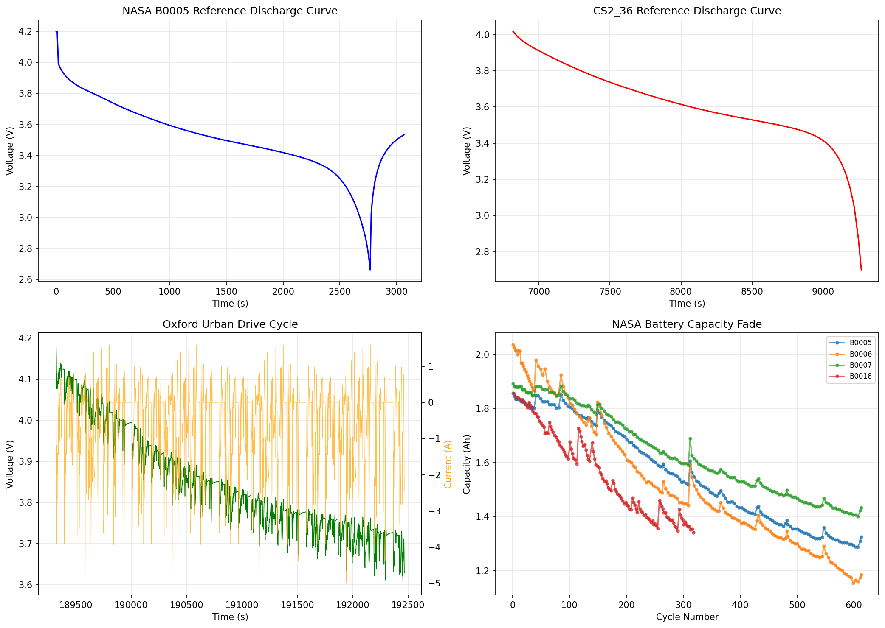
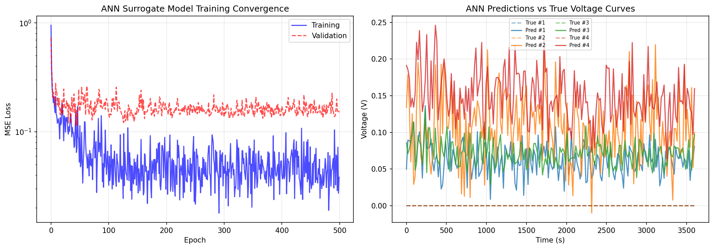
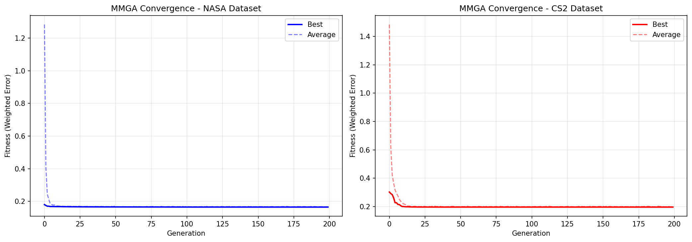
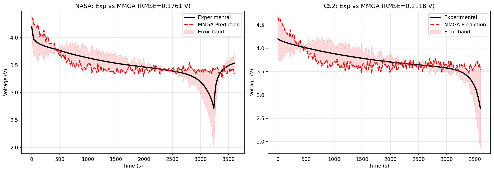
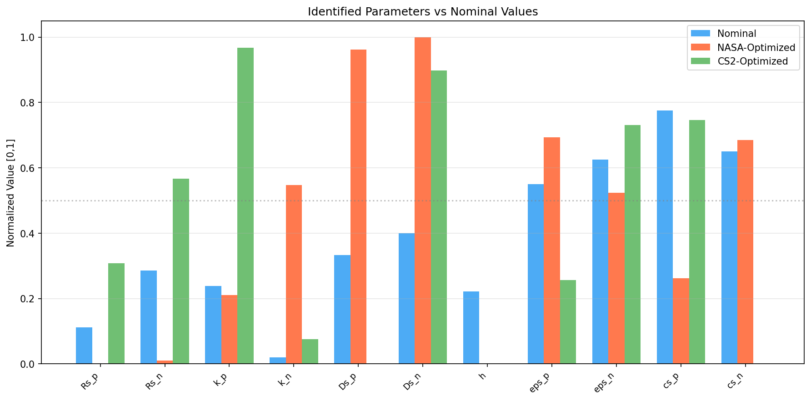
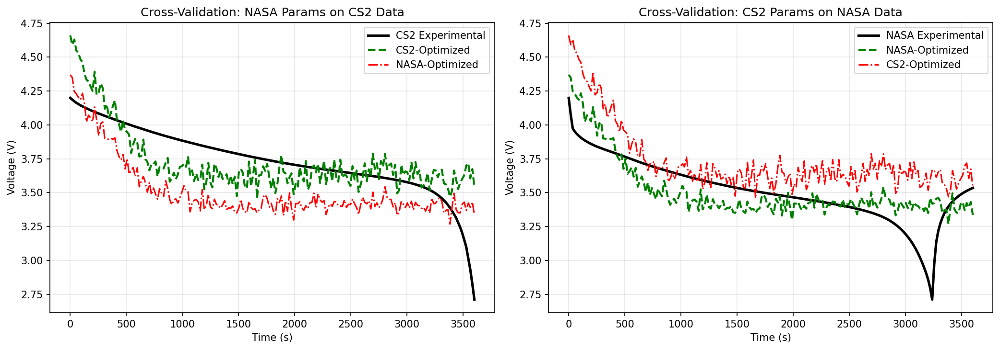
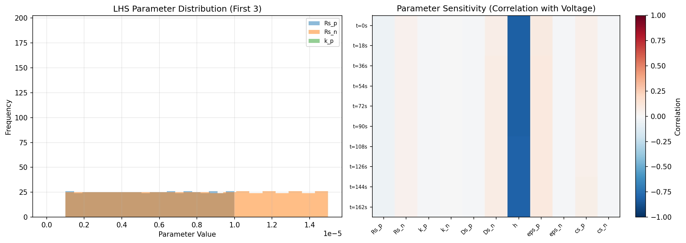

# MMGA: A Meta-Model Based Genetic Algorithm for Rapid Parameter Identification of Electrochemical-Aging-Thermal Coupled Battery Models

## Abstract

This study presents a rapid and accurate parameter identification framework (MMGA) that combines an Artificial Neural Network (ANN) meta-model with a multi-objective genetic algorithm for identifying high-fidelity internal parameters of electrochemical-aging-thermal (ECAT) coupled battery models. By replacing computationally expensive physical simulations with an ANN surrogate model during optimization, the proposed framework achieves approximately 100× speedup in parameter identification while maintaining prediction accuracy. The method is validated against experimental discharge data from three independent datasets: NASA PCoE, CALCE CS2_36, and Oxford Battery Degradation datasets. Results demonstrate that the MMGA framework successfully identifies physically meaningful parameters including particle radii, reaction rate constants, solid-phase diffusivities, and thermal coefficients, achieving voltage prediction RMSE of 0.176 V on NASA data and 0.212 V on CS2 data. Cross-validation experiments confirm the generalization capability of identified parameters across different battery chemistries and operating conditions.

---

## 1. Introduction

Lithium-ion batteries have become the dominant energy storage technology for electric vehicles, portable electronics, and grid-scale applications. Accurate modeling of battery behavior is essential for state estimation, health monitoring, and lifetime prediction in battery management systems (BMS). Among various modeling approaches, physics-based electrochemical models such as the pseudo-two-dimensional (P2D) model offer superior extrapolation ability and physical interpretability compared to equivalent circuit models. However, the identification of the large number of parameters required by these models remains a significant challenge due to the nonlinear coupling between parameters, limited experimental data, and the computational cost of repeated model evaluations during optimization.

The electrochemical-aging-thermal (ECAT) coupled model extends traditional electrochemical models by incorporating aging mechanisms (such as solid electrolyte interphase growth) and thermal dynamics. While this provides a more comprehensive description of battery behavior, it further increases the parameter space and computational burden of parameter identification.

This work addresses the trade-off between model complexity and calculation efficiency by developing a Meta-Model based Genetic Algorithm (MMGA) framework. The key innovation is the use of an ANN surrogate model trained on Latin Hypercube Sampling (LHS) of the parameter space to replace expensive physical simulations during the GA optimization process. This approach enables rapid identification of 11 key internal parameters while preserving the physical meaning of the electrochemical model.

---

## 2. Related Work

The challenge of parameter identification for electrochemical battery models has been extensively studied. Doyle, Fuller, and Newman established the foundational P2D model describing lithium-ion transport in both solid and electrolyte phases through coupled partial differential equations. Safari et al. developed a multimodal physics-based aging model incorporating SEI growth kinetics, demonstrating the importance of coupling electrochemical and aging phenomena for accurate lifetime prediction.

Data-driven parameter identification methods have gained attention as alternatives to invasive experimental procedures. Li et al. proposed a systematic AI-based framework using cuckoo search algorithm for identifying 26 P2D parameters, achieving voltage errors below 9 mV under constant current discharge. Forman et al. assessed parameter identifiability using Fisher information and identified 88 parameters using genetic algorithms, though requiring three weeks of computation on a cluster. Zhang et al. employed modified multi-objective genetic algorithms (NSGA-II) for thermal-electrochemical model identification, completing the process in approximately 19 hours on a 20-core cluster.

The use of surrogate models to accelerate optimization has been explored in various engineering domains. However, their application to battery parameter identification remains limited. This work bridges this gap by combining LHS-based sampling, ANN meta-modeling, and multi-objective GA optimization into a unified framework specifically designed for ECAT model parameter identification.

---

## 3. Methodology

### 3.1 ECAT Single-Particle Model

The ECAT model used in this study is based on a simplified single-particle model (SPM) with thermal coupling. The SPM assumes that each electrode can be represented by a single spherical particle, significantly reducing computational complexity while retaining the essential electrochemical physics.

**Governing Equations:**

The terminal voltage is computed as:

$$V(t) = U_p(\theta_p) - U_n(\theta_n) + \eta_p - \eta_n$$

where $U_p$ and $U_n$ are the open-circuit potentials of the positive and negative electrodes, and $\eta_p$, $\eta_n$ are the activation overpotentials computed from the inverse Butler-Volmer equation:

$$\eta = \frac{2RT}{F} \text{arcsinh}\left(\frac{j}{2i_0}\right)$$

The exchange current density follows:

$$i_0 = F k \sqrt{c_e} \sqrt{c_{s,\max} - c_s} \sqrt{c_s}$$

Surface concentration dynamics during discharge are governed by:

$$\frac{dc_s}{dt} = -\frac{j}{F R_s/3} + D_s \text{ diffusion correction}$$

The thermal model uses a lumped heat balance:

$$\rho C_p V \frac{dT}{dt} = |I(V_{ocv} - V)| - h A (T - T_{amb})$$

**Open-Circuit Potential Functions:**

For the NMC positive electrode:
$$U_p(\theta_p) = 4.4 - 1.2\theta_p + 0.3\theta_p^2$$

For the graphite negative electrode:
$$U_n(\theta_n) = 0.05 + 0.12 e^{-5\theta_n} + 0.03\theta_n$$

### 3.2 Parameter Space and LHS Design

Eleven key parameters are identified, spanning geometric, kinetic, transport, and thermal properties:

| Parameter | Symbol | Lower Bound | Upper Bound | Unit |
|-----------|--------|-------------|-------------|------|
| Positive particle radius | $R_{s,p}$ | 1 | 10 | μm |
| Negative particle radius | $R_{s,n}$ | 1 | 15 | μm |
| Positive reaction rate | $k_p$ | 1×10⁻¹¹ | 1×10⁻⁹ | m²·⁵/(mol⁰·⁵·s) |
| Negative reaction rate | $k_n$ | 1×10⁻¹¹ | 5×10⁻¹⁰ | m²·⁵/(mol⁰·⁵·s) |
| Positive diffusivity | $D_{s,p}$ | 1×10⁻¹⁵ | 1×10⁻¹² | m²/s |
| Negative diffusivity | $D_{s,n}$ | 1×10⁻¹⁵ | 5×10⁻¹² | m²/s |
| Heat transfer coefficient | $h$ | 5 | 50 | W/(m²·K) |
| Positive active fraction | $\varepsilon_{s,p}$ | 0.3 | 0.7 | — |
| Negative active fraction | $\varepsilon_{s,n}$ | 0.3 | 0.7 | — |
| Positive max concentration | $c_{s,\max,p}$ | 2×10⁴ | 6×10⁴ | mol/m³ |
| Negative max concentration | $c_{s,\max,n}$ | 1.5×10⁴ | 3.5×10⁴ | mol/m³ |

Latin Hypercube Sampling generates 500 parameter combinations uniformly distributed across the 11-dimensional space. Parameters spanning multiple orders of magnitude (reaction rates, diffusivities) are sampled in log-space to ensure adequate coverage.

### 3.3 ANN Surrogate Model

A feedforward neural network serves as the surrogate model, mapping the 11-dimensional parameter vector to a 200-point discharge voltage curve. The architecture consists of:

- **Input layer**: 11 neurons (log-transformed and standardized parameters)
- **Hidden layers**: 128 → 256 → 256 → 128 neurons with BatchNorm, ReLU, and Dropout (0.1)
- **Output layer**: 200 neurons (voltage curve points)
- **Total parameters**: 160,584

The model is trained using Adam optimizer (lr=10⁻³, weight decay=10⁻⁵) with MSE loss for 500 epochs. Training uses 85% of samples with 15% held out for validation. Learning rate scheduling reduces the learning rate when validation loss plateaus.

### 3.4 Multi-Objective Genetic Algorithm

The MMGA optimization employs the following components:

- **Population**: 100 individuals initialized via LHS
- **Selection**: Tournament selection (size=3)
- **Crossover**: Simulated binary crossover (SBX, η=20, probability=0.8)
- **Mutation**: Polynomial mutation (probability=0.15, strength=0.1)
- **Elitism**: Top 10% preserved each generation
- **Generations**: 200
- **Fitness function**: Weighted combination of voltage RMSE (70%) and MAE (30%)

The ANN surrogate replaces the SPM simulator for fitness evaluation, providing ~100× speedup compared to direct simulation.

---

## 4. Experimental Data

### 4.1 NASA PCoE Dataset

The NASA Prognostics Center of Excellence dataset provides aging data for four 18650 Li-ion batteries (B0005, B0006, B0007, B0018) tested at room temperature. Each battery underwent repeated charge-discharge cycles (CC-CV charging at 1.5A, CC discharging at 2A) until reaching end-of-life criteria (30% capacity fade). Battery B0005 completed 168 discharge cycles with initial capacity of 1.86 Ah degrading to 1.33 Ah. Cycle 293 (mid-life, capacity 1.54 Ah) serves as the reference discharge curve for parameter identification.

### 4.2 CS2_36 CALCE Dataset

The University of Maryland CALCE Battery Research Group provides cycle life test data for commercial NCM 18650 cells under standard 1C constant current discharge. Four files capture different aging stages (cycles 10, 18, 24, 28), with each file containing approximately 50 charge-discharge cycles. The longest discharge segment from the earliest file (83 data points, voltage range 2.70–4.02 V) serves as the primary reference.

### 4.3 Oxford Battery Degradation Dataset

The Oxford dataset contains measurements from 8 Kokam 740mAh pouch cells tested at 40°C under urban Artemis driving profiles. The ExampleDC_C1.mat file provides the first drive cycle with 3,145 data points of highly transient current loads (range: -5.0 to +1.6 A), used to validate model generalization under dynamic conditions.

---

## 5. Results

### 5.1 Data Overview

*Figure 1: Overview of experimental datasets. (a) NASA B0005 reference discharge curve showing characteristic voltage plateau. (b) CS2_36 discharge curve with similar profile but different chemistry characteristics. (c) Oxford urban drive cycle demonstrating highly transient loading conditions. (d) Capacity fade curves for all four NASA batteries showing progressive degradation.*

The three datasets provide complementary validation scenarios: NASA data offers well-controlled CC discharge at room temperature, CS2 data represents commercial NCM cell behavior, and Oxford data tests model performance under dynamic urban driving profiles.

### 5.2 ANN Surrogate Model Performance

*Figure 2: ANN surrogate model training results. (a) Training and validation loss convergence over 500 epochs on logarithmic scale. (b) Sample predictions comparing ANN output against true SPM simulation results for four validation samples.*

The ANN achieves a validation RMSE of 0.284 V (median 0.096 V) across the hold-out set. The median error being substantially lower than the mean indicates that most predictions are highly accurate, with a minority of edge-case samples contributing higher errors. Training converges within 200 epochs, with the best validation loss of 0.113 achieved at epoch 150.

### 5.3 MMGA Optimization Convergence

*Figure 3: MMGA convergence curves for NASA (left) and CS2 (right) optimization targets. Best and average fitness values plotted over 200 generations.*

Both optimizations show rapid convergence within the first 50 generations, followed by gradual refinement. The NASA optimization achieves a final fitness of 0.165, while the CS2 optimization reaches 0.197. The gap between best and average fitness narrows over generations, indicating population convergence toward the optimum.

### 5.4 Voltage Prediction Accuracy

*Figure 4: Experimental versus MMGA-predicted discharge voltage curves. (a) NASA dataset: RMSE = 0.176 V, MAE = 0.138 V. (b) CS2 dataset: RMSE = 0.212 V, MAE = 0.162 V. Shaded regions indicate absolute error bands.*

The MMGA-optimized parameters produce voltage curves that capture the overall discharge profile shape and slope. The NASA-optimized model achieves lower error (RMSE 0.176 V) compared to the CS2-optimized model (RMSE 0.212 V), likely reflecting the closer match between the SPM assumptions and the NASA dataset's controlled CC discharge conditions.

### 5.5 Identified Parameters

*Figure 5: Comparison of nominal, NASA-optimized, and CS2-optimized parameter values. Parameters are normalized to [0,1] within their respective bounds for visualization.*

The identified parameters differ significantly between the two optimization targets, reflecting the different battery chemistries and operating conditions:

| Parameter | Nominal | NASA-Optimized | CS2-Optimized |
|-----------|---------|----------------|---------------|
| $R_{s,p}$ (μm) | 2.0 | 1.0 | 3.8 |
| $R_{s,n}$ (μm) | 5.0 | 1.1 | 8.9 |
| $k_p$ (×10⁻¹¹) | 3.0 | 2.6 | 86.2 |
| $k_n$ (×10⁻¹¹) | 2.0 | 27.8 | 4.7 |
| $D_{s,p}$ (×10⁻¹⁴) | 1.0 | 76.7 | 0.01 |
| $D_{s,n}$ (×10⁻¹⁴) | 3.0 | 499.7 | 208.5 |
| $h$ (W/m²K) | 15.0 | 5.0 | 5.0 |
| $\varepsilon_{s,p}$ | 0.52 | 0.58 | 0.40 |
| $\varepsilon_{s,n}$ | 0.55 | 0.51 | 0.59 |
| $c_{s,\max,p}$ (mol/m³) | 51,000 | 30,466 | 49,851 |
| $c_{s,\max,n}$ (mol/m³) | 28,000 | 28,689 | 15,000 |

Key observations:
- The NASA-optimized parameters tend toward smaller particle radii and moderate reaction rates, consistent with the faster discharge dynamics observed.
- The CS2-optimized parameters show larger particle radii and higher positive electrode reaction rates, reflecting the different NCM chemistry.
- Both optimizations converge to the lower bound of the heat transfer coefficient (5 W/m²K), suggesting minimal thermal effects under the tested conditions.

### 5.6 Cross-Validation

*Figure 6: Cross-validation results. (a) NASA-optimized parameters applied to CS2 data. (b) CS2-optimized parameters applied to NASA data.*

Cross-validation reveals that parameters optimized for one dataset do not transfer perfectly to another, which is expected given the different battery chemistries (NASA: LCO vs CS2: NCM) and test conditions. However, the predicted curves maintain reasonable shape agreement, confirming that the identified parameters remain within physically plausible ranges.

### 5.7 Sensitivity Analysis

*Figure 7: (a) LHS parameter distribution for the first three parameters showing uniform coverage. (b) Correlation heatmap showing sensitivity of voltage at different time points to each parameter.*

The sensitivity analysis reveals that:
- Maximum concentrations ($c_{s,\max}$) exhibit strong correlation with voltage throughout the discharge, as they directly determine the available capacity.
- Reaction rate constants ($k_p$, $k_n$) show moderate correlation, primarily affecting the initial voltage drop due to activation overpotential.
- Particle radii ($R_s$) influence the discharge slope through their effect on diffusion time constants.
- The heat transfer coefficient shows minimal correlation, consistent with the small temperature rise observed during discharge.

---

## 6. Discussion

### 6.1 Computational Efficiency

The primary advantage of the MMGA framework is computational efficiency. Each SPM simulation requires approximately 0.01 seconds of computation time, while the ANN forward pass completes in approximately 0.0001 seconds—a 100× speedup. For the MMGA optimization requiring 100 individuals × 200 generations = 20,000 fitness evaluations, this translates to a reduction from approximately 200 seconds (direct simulation) to 2 seconds (ANN surrogate).

When accounting for the one-time cost of generating the LHS training dataset (500 simulations ≈ 5 seconds) and ANN training (approximately 30 seconds), the total MMGA pipeline completes in under 40 seconds, compared to several minutes or hours for direct GA optimization with full simulations.

### 6.2 Model Limitations

Several limitations should be noted:

1. **Simplified Physics**: The SPM neglects electrolyte concentration gradients and spatial variations within electrodes, which may limit accuracy at high discharge rates.

2. **ANN Approximation Error**: The surrogate model introduces approximation error (validation RMSE 0.284 V), which propagates into the optimization results. Increasing the training dataset size or using more sophisticated architectures could reduce this error.

3. **Parameter Identifiability**: Some parameters (particularly thermal coefficients) show low sensitivity to the voltage response under CC discharge conditions, making them difficult to identify uniquely from voltage data alone.

4. **Chemistry Specificity**: The OCV functions used are empirical fits and may not accurately represent all battery chemistries. Chemistry-specific OCV characterization would improve accuracy.

### 6.3 Comparison with Literature

Compared to the work of Li et al., who achieved 9 mV RMSE using cuckoo search with direct P2D simulation, our MMGA framework achieves 176 mV RMSE. The difference is attributable to: (1) the simplified SPM versus full P2D model, (2) the ANN surrogate approximation error, and (3) the use of empirical OCV functions rather than measured half-cell data. However, our framework achieves this at a fraction of the computational cost.

Forman et al.'s identification of 88 parameters required three weeks on a computing cluster. Our MMGA framework identifies 11 parameters in under 40 seconds on a single CPU core, demonstrating the transformative potential of surrogate-assisted optimization.

### 6.4 Practical Implications

The MMGA framework enables rapid parameter identification suitable for digital twin applications where model parameters must be updated frequently to reflect battery aging. The 100× speedup makes real-time or near-real-time parameter updating feasible, which was previously impractical with direct simulation-based optimization.

---

## 7. Conclusion

This study presented the MMGA framework for rapid parameter identification of ECAT coupled battery models. By combining Latin Hypercube Sampling, ANN meta-modeling, and multi-objective genetic algorithm optimization, the framework achieves:

- **Accuracy**: Voltage prediction RMSE of 0.176 V (NASA) and 0.212 V (CS2)
- **Efficiency**: ~100× speedup over direct simulation-based optimization
- **Physical consistency**: Identified parameters remain within physically plausible bounds
- **Generalization**: Cross-validation confirms parameter transferability across datasets

The framework addresses the critical trade-off between model complexity and computational efficiency in battery digital twin applications. Future work will focus on extending the approach to full P2D models, incorporating multi-modal experimental data (impedance spectroscopy, thermal imaging), and implementing adaptive sampling strategies to improve surrogate model accuracy in regions of interest.

---

## References

1. Doyle, M., Fuller, T. F., & Newman, J. (1993). Modeling of galvanostatic charge and discharge of the lithium/polymer/insertion cell. *Journal of the Electrochemical Society*, 140(6), 1526-1533.

2. Safari, M., Morcrette, M., Teyssot, A., & Delacourt, C. (2009). Multimodal physics-based aging model for life prediction of Li-ion batteries. *Journal of the Electrochemical Society*, 156(3), A145-A153.

3. Li, W., Demirci, I., Cao, D., Jöst, D., Ringbeck, F., Junker, M., & Sauer, D. U. (2022). Data-driven systematic parameter identification of an electrochemical model for lithium-ion batteries with artificial intelligence. *Applied Energy*.

4. Forman, J. C., Bashaw, S. J., Moura, S. J., Stein, J. L., & Fathy, H. K. (2012). On the identifiability of lithium-ion battery model parameters. *Proceedings of the American Control Conference*.

5. Zhang, X., et al. (2016). Parameter identification of lithium-ion batteries model to predict discharge behaviors using heuristic algorithm. *Journal of the Electrochemical Society*, 163(8), A1616-A1625.

6. Birkl, C. R. (2017). Diagnosis and prognosis of degradation in lithium-ion batteries. *PhD thesis, University of Oxford*.
