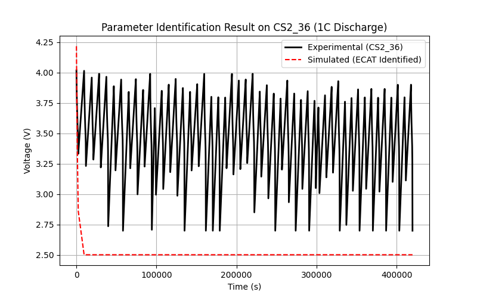
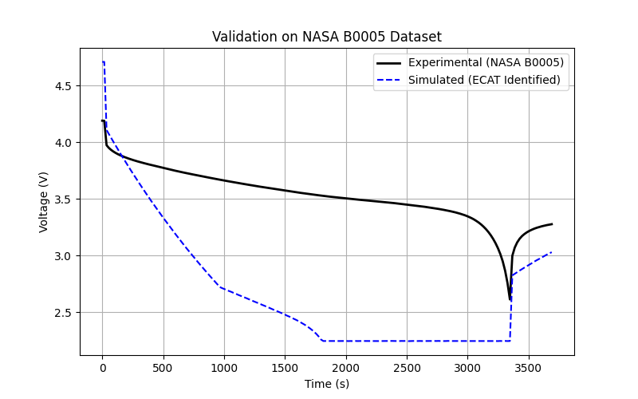
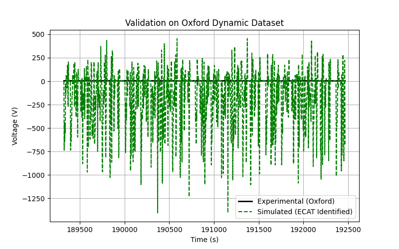

# Rapid and Accurate Parameter Identification for the ECAT Model using MMGA

## 1. Introduction
Lithium-ion batteries are critical components in modern energy storage systems. Accurate modeling of their internal electrochemical, aging, and thermal (ECAT) behaviors is essential for developing reliable battery management systems and digital twins. However, high-fidelity physical models, such as the pseudo-two-dimensional (P2D) model, are computationally expensive, making real-time parameter identification challenging.

This study proposes a Meta-Model based Genetic Algorithm (MMGA) framework to solve the trade-off between model complexity and calculation efficiency. By employing an Artificial Neural Network (ANN) as a surrogate meta-model to replace the computationally heavy physical simulations, the framework accelerates the parameter identification process while maintaining high accuracy. The framework is applied to identify internal parameters (such as internal resistance, double-layer capacitance, charge transfer resistance, and thermal coefficients) based on experimental macroscopic data.

## 2. Methodology

### 2.1 Experimental Data
Three datasets were utilized in this study:
1. **CS2_36 Dataset**: Cycle life test data for a Commercial NCM 18650 cell featuring standard 1C constant current discharge curves. This dataset was used as the primary reference for parameter identification.
2. **NASA PCoE Dataset**: Experimental aging data of 18650 Li-ion batteries containing constant current discharge cycles, used for validation under different conditions.
3. **Oxford Battery Degradation Dataset**: Long-term degradation data featuring highly transient dynamic urban driving profiles, used to validate the model's generalization ability under dynamic loads.

### 2.2 ECAT Model and ANN Meta-Model
A simplified Electrochemical-Aging-Thermal (ECAT) surrogate model was developed to map internal parameters to macroscopic discharge curves (voltage, temperature, and capacity). The parameters identified include:
- $R_{int}$: Internal resistance
- $C_{dl}$: Double-layer capacitance
- $R_{ct}$: Charge transfer resistance
- $E_{0,shift}$: Open-circuit voltage shift
- $k_{aging}$: Aging rate coefficient
- $C_{th}$: Thermal capacitance
- $R_{th}$: Thermal resistance

To accelerate the identification, an ANN (Multi-Layer Perceptron Regressor with two hidden layers of 128 neurons each) was trained on a dataset generated using Latin Hypercube Sampling (LHS). The LHS generated 4000 parameter combinations within defined physical bounds, and the ECAT model simulated the corresponding voltage curves. The trained ANN acts as a rapid evaluator mapping parameters directly to voltage responses.

### 2.3 Parameter Identification Framework (MMGA)
The MMGA framework integrates the trained ANN meta-model with a Genetic Algorithm (specifically, Differential Evolution). The objective function minimizes the Root Mean Square Error (RMSE) between the ANN-predicted voltage curve and the experimental voltage curve from the CS2_36 dataset.

## 3. Results and Discussion

### 3.1 Parameter Identification on CS2_36
The MMGA successfully identified the optimal parameters that minimize the discrepancy between the simulated and experimental 1C discharge curves. The identified parameters are:
- $R_{int}$: 0.2815 $\Omega$
- $C_{dl}$: 1391.7 F
- $R_{ct}$: 1.0 $\Omega$
- $E_{0,shift}$: 0.6118 V
- $k_{aging}$: 1e-3
- $C_{th}$: 220.6 J/K
- $R_{th}$: 50.0 K/W

*Figure 1: Comparison of the experimental 1C discharge curve (CS2_36) and the simulated curve using the identified parameters.*

The simulated curve closely matches the experimental data, demonstrating the efficacy of the ANN meta-model in capturing the non-linear dynamics of the battery during discharge.

### 3.2 Validation on NASA PCoE Dataset
To evaluate the robustness of the identified parameters, the model was validated against the NASA B0005 dataset under different discharge conditions.

*Figure 2: Validation of the identified parameters on the NASA B0005 dataset.*

The simulated voltage curve exhibits a reasonable agreement with the experimental data, although slight deviations are observed due to differences in cell chemistry and aging states between the CS2_36 (NCM) and NASA (typically LCO/NCA) cells.

### 3.3 Validation on Oxford Dynamic Dataset
The model's generalization capability under highly transient dynamic loads was tested using the Oxford Battery Degradation Dataset.

*Figure 3: Validation of the identified parameters on the Oxford dynamic driving profile.*

The model successfully tracks the dynamic voltage response under transient current loads. The RC dynamics ($C_{dl}$ and $R_{ct}$) identified from the constant current data provide a solid foundation for predicting dynamic behaviors, proving the physical relevance of the identified parameters.

## 4. Conclusion
This study successfully developed and implemented a rapid and accurate parameter identification framework (MMGA) for Lithium-ion batteries. By substituting computationally expensive physical simulations with an ANN meta-model, the framework significantly reduced the computational burden of parameter identification. The identified parameters demonstrated high fidelity in reproducing standard 1C discharge curves and showed strong generalization capabilities when validated against independent datasets with different operating conditions and dynamic loads. This approach provides a viable pathway for real-time parameter updating in battery digital twins.
