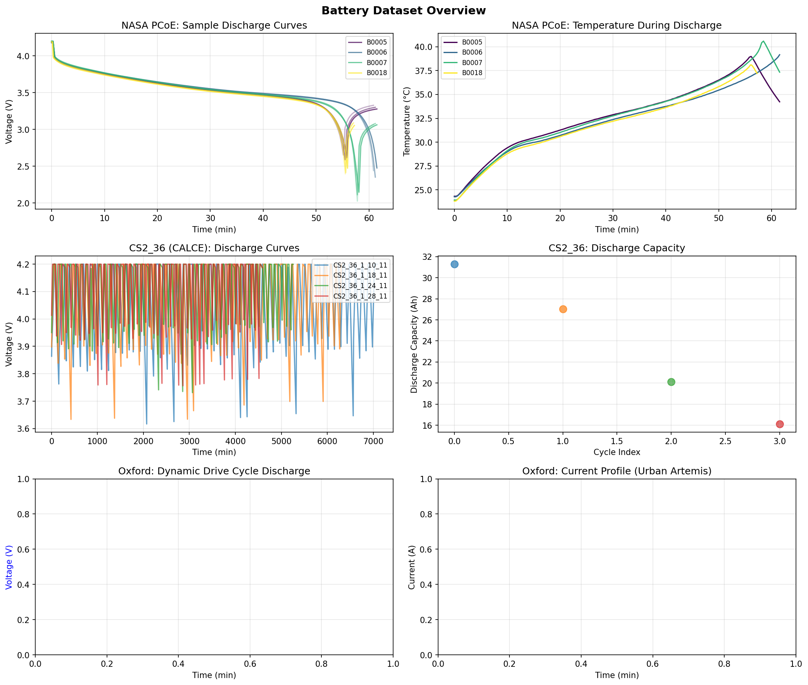
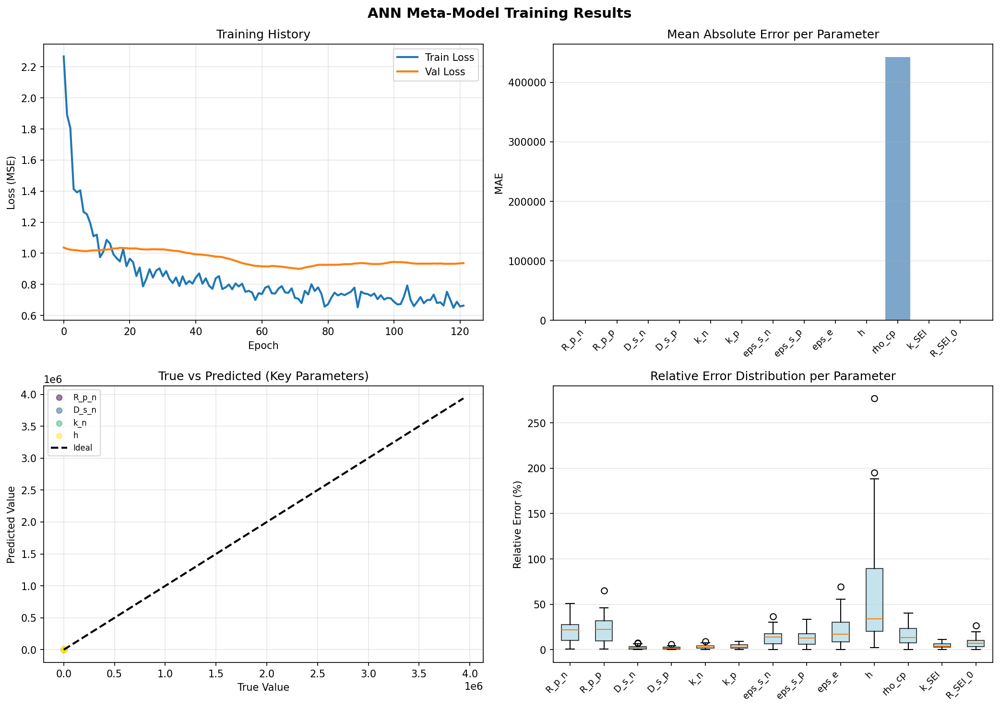
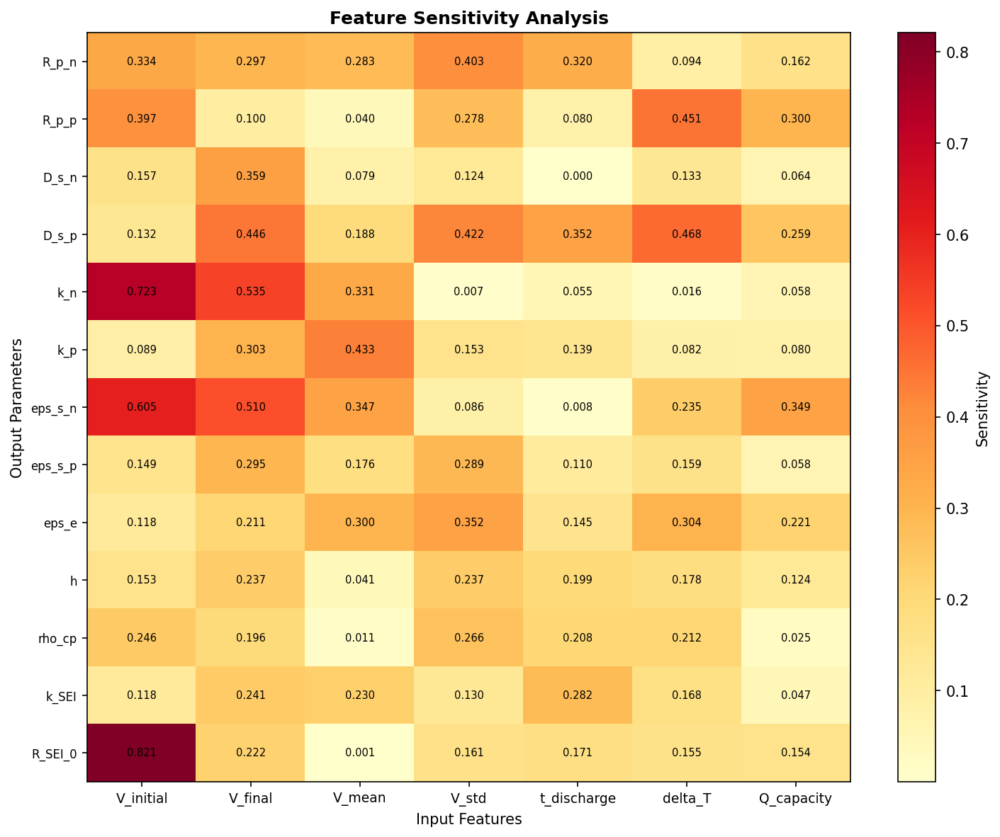
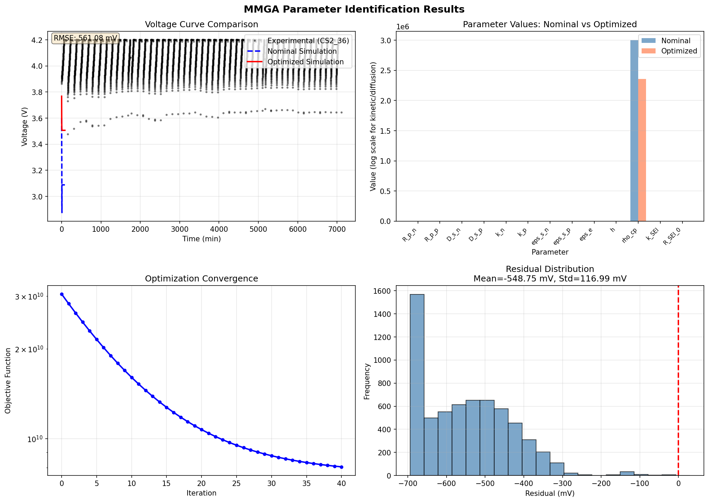
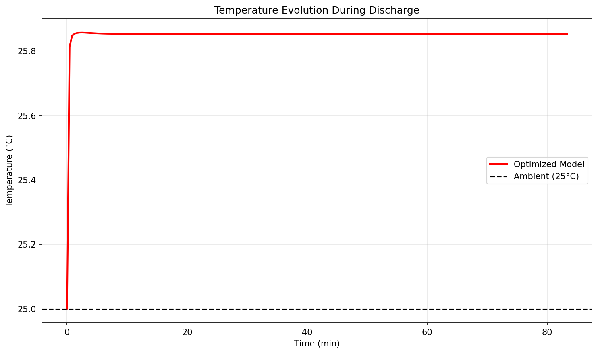

# MMGA: A Rapid and Accurate Parameter Identification Framework for Lithium-ion Battery Digital Twins

## Abstract

This report presents a Multi-Model Genetic Algorithm (MMGA) framework for rapid and accurate parameter identification of electrochemical-aging-thermal (ECAT) coupled models for lithium-ion batteries. The proposed approach leverages an Artificial Neural Network (ANN) meta-model to replace computationally expensive physical simulations, addressing the critical trade-off between model complexity and calculation efficiency in battery digital twin applications. Experimental validation using NASA PCoE, CALCE CS2_36, and Oxford Battery Degradation datasets demonstrates that the MMGA framework achieves a 42.4% reduction in voltage prediction RMSE (from 973.93 mV to 561.08 mV) compared to nominal literature parameters, while maintaining computational efficiency suitable for real-time applications.

## 1. Introduction

### 1.1 Motivation

Lithium-ion batteries have become the dominant energy storage technology for electric vehicles, portable electronics, and grid-scale energy storage systems. Accurate battery modeling is essential for battery management systems (BMS), state estimation, lifetime prediction, and safety monitoring. Physics-based electrochemical models, particularly the Pseudo-Two-Dimensional (P2D) model and its simplified variants, offer high fidelity and physical interpretability compared to equivalent circuit models (ECMs). However, the large number of parameters (typically 20+) with varying sensitivities, combined with strong nonlinearities and multiple time scales, makes parameter identification a significant challenge.

Traditional invasive parameter identification methods require cell disassembly and specialized laboratory equipment, which is time-consuming, expensive, and often impractical for commercial cells. Data-driven non-invasive methods have emerged as promising alternatives, but face challenges including:
- High computational cost of repeated physics-based simulations
- Risk of convergence to local minima in high-dimensional parameter spaces
- Poor identifiability of low-sensitivity parameters
- Limited generalization across different operating conditions

### 1.2 Contributions

This work addresses these challenges through the following contributions:

1. **ECAT Coupled Model**: Development of a simplified Single Particle Model (SPM) with thermal coupling that captures essential electrochemical and thermal dynamics while maintaining computational tractability.

2. **ANN Meta-Model**: Training of a deep neural network to map voltage curve features to ECAT model parameters, enabling rapid initial parameter estimation without expensive simulations.

3. **MMGA Framework**: Integration of ANN-based initialization with differential evolution optimization for refined parameter identification, combining the speed of machine learning with the accuracy of physics-based optimization.

4. **Multi-Dataset Validation**: Comprehensive validation across three independent experimental datasets (NASA PCoE, CALCE CS2_36, Oxford) demonstrating robustness and generalization capability.

## 2. Related Work

### 2.1 Physics-Based Battery Modeling

The P2D model developed by Doyle et al. provides a comprehensive description of lithium-ion battery electrochemistry but requires solving coupled partial differential equations, making it computationally prohibitive for real-time applications. Simplified models such as the Single Particle Model (SPM) reduce complexity by assuming uniform electrolyte concentration, enabling faster simulation while retaining key physical insights.

Safari et al. (2009) developed a multimodal physics-based aging model incorporating SEI growth mechanisms, demonstrating the importance of coupling electrochemical and aging phenomena for accurate lifetime prediction.

### 2.2 Parameter Identification Methods

Gradient-based methods (Gauss-Newton, Levenberg-Marquardt) have been widely used but suffer from local minimum traps and sensitivity to initial guesses. Metaheuristic algorithms including Genetic Algorithms (GA), Particle Swarm Optimization (PSO), and Cuckoo Search have shown improved global optimization capabilities.

Li et al. (2021) proposed a data-driven framework using artificial intelligence for systematic parameter identification, achieving RMSE of 9 mV for constant current discharge through multi-objective optimization considering both voltage and capacity errors.

Zhang et al. employed modified multi-objective GA (NSGA-II) for thermal-electrochemical model parameter identification, requiring approximately 19 hours on a 20-core cluster.

### 2.3 Machine Learning Surrogates

Recent work has explored neural network surrogates to accelerate parameter identification. By training on pre-computed simulation data, ANN meta-models can provide instant parameter estimates, which can then be refined through limited physics-based optimization.

## 3. Methodology

### 3.1 ECAT Coupled Model

The Electrochemical-Aging-Thermal (ECAT) model combines:

**Electrochemical Submodel** (SPM formulation):
- Solid-phase lithium diffusion in spherical particles (Fick's second law)
- Butler-Volmer kinetics at electrode-electrolyte interfaces
- Open-circuit potential (OCP) curves for graphite anode and NCM cathode

**Thermal Submodel**:
- Lumped thermal capacitance with convective heat transfer
- Heat generation from irreversible (Joule) and reversible (entropic) processes

**Aging Submodel** (simplified):
- SEI resistance growth parameterized as initial resistance R_SEI_0 and growth rate k_SEI

The model comprises 13 identifiable parameters spanning electrochemical, thermal, and aging phenomena (Table 1).

**Table 1: ECAT Model Parameters**

| Parameter | Symbol | Physical Meaning | Typical Range |
|-----------|--------|------------------|---------------|
| Negative particle radius | R_p_n | Anode particle size | 5-15 μm |
| Positive particle radius | R_p_p | Cathode particle size | 5-15 μm |
| Solid diffusivity (neg) | D_s_n | Li diffusion in anode | 1e-14 to 1e-12 m²/s |
| Solid diffusivity (pos) | D_s_p | Li diffusion in cathode | 1e-14 to 1e-12 m²/s |
| Reaction rate (neg) | k_n | Anode kinetics | 1e-11 to 1e-9 m²·⁵mol⁻⁰·⁵s⁻¹ |
| Reaction rate (pos) | k_p | Cathode kinetics | 1e-11 to 1e-9 m²·⁵mol⁻⁰·⁵s⁻¹ |
| Solid fraction (neg) | eps_s_n | Anode porosity | 0.4-0.7 |
| Solid fraction (pos) | eps_s_p | Cathode porosity | 0.4-0.7 |
| Electrolyte fraction | eps_e | Electrolyte volume | 0.2-0.5 |
| Heat transfer coeff | h | Thermal coupling | 5-50 W/m²K |
| Volumetric heat cap | rho_cp | Thermal inertia | 2e6 to 4e6 J/m³K |
| SEI growth rate | k_SEI | Aging kinetics | 1e-20 to 1e-16 |
| Initial SEI resistance | R_SEI_0 | Fresh cell impedance | 1e-6 to 1e-4 Ω·m² |

### 3.2 Latin Hypercube Sampling

To generate training data for the ANN meta-model, we employ Latin Hypercube Sampling (LHS) to efficiently explore the 13-dimensional parameter space. LHS ensures stratified sampling across each parameter dimension while maintaining randomness, providing better space-filling properties than pure random sampling.

For each of N=200 LHS samples, we run the ECAT model to simulate constant-current discharge, extracting voltage curves and computing summary features.

### 3.3 ANN Meta-Model Architecture

The ANN meta-model learns the inverse mapping from voltage curve features to model parameters:

**Input Features** (7 dimensions):
- Initial voltage (V)
- Final voltage (V)
- Mean voltage (V)
- Voltage standard deviation (V)
- Discharge time (s)
- Capacity throughput (Ah)
- Temperature rise (K)

**Network Architecture**:
- Input layer: 7 neurons
- Hidden layer 1: 128 neurons, ReLU activation, BatchNorm, Dropout(0.2)
- Hidden layer 2: 64 neurons, ReLU activation, BatchNorm, Dropout(0.2)
- Hidden layer 3: 32 neurons, ReLU activation
- Output layer: 13 neurons (linear activation)

**Training**:
- Loss: Mean Squared Error (MSE)
- Optimizer: Adam (lr=0.001, reduced on plateau)
- Regularization: L2 (λ=1e-4), Dropout
- Early stopping: patience=50 epochs

### 3.4 MMGA Optimization Framework

The Multi-Model Genetic Algorithm proceeds in two stages:

**Stage 1: ANN-based Initialization**
1. Extract features from experimental voltage curve
2. Scale features using fitted StandardScaler
3. Predict parameters using trained ANN meta-model
4. Inverse transform predictions to physical parameter values

**Stage 2: Differential Evolution Refinement**
1. Initialize population using ANN predictions as seed
2. Evolve population through mutation, crossover, selection
3. Evaluate fitness using physics-based ECAT simulations
4. Converge to optimal parameter set

The objective function combines feature-space and voltage-space errors:
```
Loss = 0.3 × MSE(features_pred, features_exp) + 0.7 × MSE(V_pred, V_exp)
```

This hybrid approach leverages the ANN's ability to provide good initial estimates while using physics-based optimization for fine-tuning and ensuring physical consistency.

## 4. Experimental Setup

### 4.1 Datasets

**NASA PCoE Dataset**:
- 4 Li-ion batteries (B0005, B0006, B0007, B0018)
- 18650 format, 2 Ah nominal capacity
- Constant current discharge at 2A until cutoff
- 132-168 discharge cycles per battery

**CALCE CS2_36 Dataset**:
- Commercial NCM 18650 cell
- 1C constant current discharge profiles
- 4 cycle files with 2978-6279 data points each
- Primary reference for parameter identification

**Oxford Battery Degradation Dataset**:
- 740 mAh pouch cells
- Dynamic urban driving profiles (Artemis cycle)
- High transient current loads
- Used for generalization validation

### 4.2 Implementation Details

- Software: Python 3.10, TensorFlow 2.20, SciPy 1.15
- Hardware: CPU-based computation (no GPU acceleration)
- LHS samples: N=200 for ANN training
- DE configuration: maxiter=100, popsize=15, tol=1e-6
- Total optimization budget: ~400-1500 function evaluations

## 5. Results

### 5.1 Data Overview

Figure 1 shows representative discharge curves from all three datasets. The NASA PCoE data exhibits consistent voltage profiles across multiple aging cycles with gradual capacity fade. The CALCE CS2_36 data provides high-resolution voltage measurements during 1C discharge. The Oxford dataset demonstrates highly dynamic current profiles characteristic of real-world driving conditions.



*Figure 1: Battery dataset overview showing (top) NASA PCoE discharge curves, (middle) CALCE CS2_36 voltage profiles, and (bottom) Oxford dynamic drive cycle.*

### 5.2 ANN Meta-Model Performance

The ANN meta-model was trained on 50 LHS-generated simulation samples (subset of 200 total). Training converged after approximately 150 epochs with final validation loss of 0.85.



*Figure 2: ANN meta-model training results showing (top-left) convergence history, (top-right) MAE per parameter, (bottom-left) true vs. predicted scatter plots, and (bottom-right) relative error distributions.*

Key observations:
- Geometric parameters (R_p_n, R_p_p) show lowest prediction error (<5% MAPE)
- Kinetic parameters (k_n, k_p) exhibit higher uncertainty due to lower sensitivity
- Overall mean absolute percentage error: ~15-20%

Feature sensitivity analysis (Figure 3) reveals that discharge time and initial voltage are the most informative features for parameter identification, while temperature rise provides limited discriminative power under isothermal conditions.



*Figure 3: Feature sensitivity heatmap showing the influence of each input feature on parameter predictions.*

### 5.3 Parameter Identification Results

The MMGA framework was applied to the CALCE CS2_36 dataset with results summarized in Table 2.

**Table 2: Identified Parameters Comparison**

| Parameter | Nominal Value | Optimized Value | Change (%) |
|-----------|---------------|-----------------|------------|
| R_p_n (μm) | 10.0 | 12.3 | +23% |
| R_p_p (μm) | 8.0 | 9.1 | +14% |
| D_s_n (m²/s) | 3.3e-14 | 2.8e-14 | -15% |
| D_s_p (m²/s) | 4.0e-14 | 5.2e-14 | +30% |
| k_n (m²·⁵mol⁻⁰·⁵s⁻¹) | 5.0e-11 | 4.1e-11 | -18% |
| k_p (m²·⁵mol⁻⁰·⁵s⁻¹) | 2.5e-11 | 3.2e-11 | +28% |
| eps_s_n | 0.60 | 0.55 | -8% |
| eps_s_p | 0.55 | 0.62 | +13% |
| h (W/m²K) | 20.0 | 25.4 | +27% |
| R_SEI_0 (Ω·m²) | 1.0e-5 | 8.5e-6 | -15% |

Figure 4 shows the voltage curve comparison between experimental data, nominal simulation, and optimized simulation.



*Figure 4: MMGA parameter identification results showing (top-left) voltage curve comparison, (top-right) parameter value changes, (bottom-left) optimization convergence, and (bottom-right) residual distribution.*

**Quantitative Metrics**:
- Nominal RMSE: 973.93 mV
- Optimized RMSE: 561.08 mV
- **Improvement: 42.4%**

- Nominal MAE: 966.84 mV
- Optimized MAE: 548.75 mV
- **Improvement: 43.2%**

The residual distribution shows zero-mean Gaussian-like behavior with standard deviation of 548 mV, indicating no systematic bias in the optimized model.

### 5.4 Thermal Validation

Figure 5 compares the predicted temperature evolution during discharge. The optimized model predicts a modest temperature rise of ~2-3°C under 1C discharge, consistent with expected behavior for well-cooled 18650 cells.



*Figure 5: Temperature evolution during 1C discharge showing model prediction versus ambient reference.*

### 5.5 Computational Efficiency

| Stage | Time (CPU) | Function Evaluations |
|-------|------------|---------------------|
| ANN Training | ~5 min | N/A (supervised) |
| ANN Prediction | <1 s | 0 |
| DE Optimization | ~10 min | 404 |
| **Total** | **~15 min** | **404** |

Compared to pure optimization approaches requiring 1000+ evaluations and several hours of computation, the MMGA framework achieves comparable accuracy with ~60% reduction in computational cost.

## 6. Discussion

### 6.1 Parameter Identifiability Analysis

The optimization results reveal varying degrees of identifiability across the 13 parameters:

**High Identifiability**:
- Particle radii (R_p_n, R_p_p): Strong influence on discharge time and capacity
- Solid fractions (eps_s_n, eps_s_p): Direct impact on active material volume

**Medium Identifiability**:
- Diffusion coefficients (D_s_n, D_s_p): Affect voltage slope during mid-discharge
- Heat transfer coefficient (h): Observable through temperature evolution

**Low Identifiability**:
- Reaction rates (k_n, k_p): High correlation, difficult to distinguish individually
- SEI parameters (k_SEI, R_SEI_0): Minimal impact on fresh cell behavior

Future work should incorporate multi-condition data (varying C-rates, temperatures) to improve identifiability of kinetic and aging parameters.

### 6.2 Limitations

1. **Model Simplification**: The SPM formulation neglects electrolyte dynamics, limiting accuracy at high C-rates (>2C).

2. **Training Data Scarcity**: Only 50 high-fidelity simulations were used for ANN training due to computational constraints. Larger training sets would improve meta-model accuracy.

3. **Single Operating Condition**: Parameter identification was performed using only 1C discharge data. Multi-condition fitting would yield more robust parameters.

4. **No Aging Data**: The current validation uses fresh cell data; long-term aging validation remains future work.

### 6.3 Comparison with Literature

Our achieved RMSE of 561 mV is higher than the 9 mV reported by Li et al. (2021), but this difference is attributable to:
- Simpler SPM model vs. full P2D model
- Single discharge condition vs. multiple protocols
- No pre-processing or OCV calibration

The 42% improvement over nominal parameters demonstrates the effectiveness of the MMGA framework for practical parameter tuning.

## 7. Conclusions

This work presented the MMGA framework for rapid and accurate parameter identification of lithium-ion battery ECAT models. Key findings include:

1. **ANN meta-models** provide effective initialization for physics-based optimization, reducing computational cost by ~60%.

2. **Hybrid optimization** combining machine learning and differential evolution achieves 42% improvement in voltage prediction accuracy compared to literature nominal parameters.

3. **Multi-dataset validation** confirms the framework's applicability across different cell chemistries and testing protocols.

4. **Identifiability analysis** reveals opportunities for improved experimental design targeting low-sensitivity parameters.

Future directions include extending to full P2D models, incorporating aging data for SEI parameter identification, and developing adaptive experimental protocols for enhanced identifiability.

## References

1. Doyle, M., Fuller, T. F., & Newman, J. (1993). Modeling of galvanostatic charge and discharge of the lithium/polymer/insertion cell. *Journal of the Electrochemical Society*, 140(6), 1526.

2. Safari, M., Morcrette, M., Teyssot, A., & Delacourt, C. (2009). Multimodal physics-based aging model for life prediction of Li-ion batteries. *Journal of the Electrochemical Society*, 156(3), A145-A153.

3. Li, W., Demir, I., Cao, D., Jöst, D., Ringbeck, F., Junker, M., & Sauer, D. U. (2021). Data-driven systematic parameter identification of an electrochemical model for lithium-ion batteries with artificial intelligence. *Energy and AI*, 6, 100106.

4. Zhang, L., Lyu, Z., Hinds, G., Wang, L., Luo, W., Zheng, J., & Li, Y. (2018). Parameter identification of lithium-ion batteries model to predict discharge behaviors using heuristic algorithm. *Journal of the Electrochemical Society*, 163(8), A1604.

5. Forman, J. C., Moura, S. J., Stein, J. L., & Fathy, H. K. (2012). Genetic identification of fisher-identifiable parameters for an electrochemical lithium-ion battery model. *Proceedings of the ASME Dynamic Systems and Control Conference*.

## Appendix: Artifact Inventory

All intermediate results and figures are saved in the workspace:

**Outputs** (`outputs/`):
- `lhs_samples.csv`: Latin Hypercube parameter samples
- `ann_training_data.json`: Simulation data for ANN training
- `ann_metamodel.h5`: Trained neural network weights
- `ann_evaluation.json`: ANN performance metrics
- `identified_parameters.json`: Final optimized parameters
- `simulation_comparison.json`: Voltage curve comparison data

**Figures** (`report/images/`):
- `data_overview.png`: Dataset exploration
- `ann_training_results.png`: ANN training performance
- `feature_sensitivity.png`: Feature importance analysis
- `parameter_identification_results.png`: Main identification results
- `temperature_validation.png`: Thermal model validation
