# MMGA: A Meta-Model-based Genetic Algorithm Framework for Rapid Parameter Identification of Electrochemical-Aging-Thermal Coupled Battery Models

## Abstract

This study presents a Meta-Model-based Genetic Algorithm (MMGA) framework for rapid and accurate parameter identification of an Electrochemical-Aging-Thermal (ECAT) coupled model for lithium-ion batteries. The framework addresses the fundamental trade-off between model complexity and computational efficiency in battery digital twin development. By replacing computationally expensive physical simulations with an Artificial Neural Network (ANN) meta-model trained on Latin Hypercube Sampling (LHS)-generated data, the MMGA framework achieves significant speedup in parameter identification while maintaining physical fidelity. The framework is validated against three distinct experimental datasets: the CALCE CS2_36 constant-current discharge data, the NASA PCoE battery aging dataset, and the Oxford Battery Degradation Dataset with dynamic urban driving profiles. The ANN meta-model achieves a voltage prediction RMSE of 8.0 mV against the ECAT model, and the complete MMGA pipeline identifies 15 internal battery parameters in approximately 41 seconds—representing a substantial computational advantage over direct simulation-based genetic algorithms. Cross-dataset validation demonstrates the generalization capability of the identified parameters across different cell chemistries, operating conditions, and load profiles.

## 1. Introduction

### 1.1 Motivation

Lithium-ion batteries (LIBs) are the dominant energy storage technology for electric vehicles, portable electronics, and grid-scale applications. Accurate battery management systems (BMS) require high-fidelity models that capture the complex electrochemical, thermal, and aging dynamics occurring within battery cells. Electrochemical models, particularly those based on the pseudo-two-dimensional (P2D) framework developed by Doyle, Fuller, and Newman (1993), offer superior predictive capability compared to equivalent circuit models by directly representing the underlying physics of lithium intercalation, solid-state diffusion, and electrochemical kinetics.

However, the practical deployment of electrochemical models faces a critical bottleneck: parameter identification. A typical P2D model contains 20–30 physical parameters (particle radii, diffusion coefficients, reaction rate constants, thermal properties, etc.) that must be accurately determined for each specific cell design. Traditional invasive methods require cell disassembly and specialized laboratory measurements, which are destructive, time-consuming, and expensive. Data-driven non-invasive methods using optimization algorithms offer a promising alternative, but the computational cost of repeatedly evaluating complex electrochemical models during optimization remains prohibitive.

### 1.2 Literature Review

Several approaches have been proposed for data-driven parameter identification of electrochemical battery models:

**Gradient-based methods**: Boovaragavan et al. and Santhanagopalan et al. used Gauss-Newton and Levenberg-Marquardt methods to identify 4–5 parameters. While computationally efficient, these methods are susceptible to local minima and require good initial guesses.

**Metaheuristic algorithms**: Forman et al. identified 88 P2D parameters using a genetic algorithm (GA), requiring three weeks on a cluster of five quad-core computers. Zhang et al. proposed multi-objective GA (NSGA-II) for simultaneous voltage and temperature matching, completing identification in ~19 hours on a 20-core cluster. Li et al. (2016) introduced a divide-and-conquer strategy reducing identification time to 10 hours on a single core.

**Advanced AI methods**: Li et al. (2022) developed a cuckoo search algorithm with multi-step identification based on sensitivity analysis, achieving RMSE < 12.7 mV for 26 parameters. This work demonstrated the potential of artificial intelligence for battery parameter identification but still required direct model evaluation during optimization.

### 1.3 Contributions

This work bridges the gap between model fidelity and computational efficiency by proposing the MMGA framework with the following contributions:

1. **ANN Meta-Model**: An artificial neural network trained on LHS-sampled ECAT model outputs serves as a computationally cheap surrogate, enabling rapid fitness evaluation during genetic algorithm optimization.

2. **ECAT Coupled Model**: A simplified but physically meaningful electrochemical-aging-thermal model combining Single Particle Model (SPM) electrochemistry, SEI growth aging, and lumped thermal dynamics.

3. **Multi-dataset Validation**: Comprehensive validation across three distinct experimental datasets spanning constant-current discharge, battery aging, and dynamic urban driving conditions.

4. **Computational Efficiency**: The complete MMGA pipeline (LHS generation + ANN training + GA optimization) completes in ~41 seconds, demonstrating the feasibility of rapid parameter identification for battery digital twins.

## 2. Methodology

### 2.1 ECAT Coupled Model

The ECAT model integrates three coupled sub-models:

#### 2.1.1 Electrochemical Sub-model (SPM)

The Single Particle Model represents each electrode as a single spherical particle with uniform current distribution. The terminal voltage is computed as:

$$V = U_{pos}(y) - U_{neg}(x) + \eta_{pos} - \eta_{neg} - I \cdot R_{cc} - I \cdot R_{SEI}$$

where $U_{pos}$ and $U_{neg}$ are the open-circuit voltage functions for the NMC cathode and graphite anode respectively, $\eta$ represents the kinetic overpotentials from the Butler-Volmer equation, $R_{cc}$ is the contact resistance, and $R_{SEI}$ is the SEI layer resistance.

The electrode stoichiometries ($x$ for anode, $y$ for cathode) are mapped from the state of charge (SOC):
- Anode: $x = x_0 + SOC \cdot (x_{100} - x_0)$, with $x_0 = 0.005$, $x_{100} = 0.9$
- Cathode: $y = y_0 + SOC \cdot (y_{100} - y_0)$, with $y_0 = 0.93$, $y_{100} = 0.36$

The OCV functions follow established literature correlations:
- **Graphite anode** (Doyle-Fuller-Newman): $U_{neg}(x) = 0.7222 + 0.1387x + 0.029\sqrt{x} - 0.0172/x + 0.0019/x^{1.5} + 0.2808\exp(0.9 - 15x) - 0.7984\exp(0.4465x - 0.4108)$
- **NMC cathode** (polynomial fit): $U_{pos}(y) = -10.72y^4 + 23.88y^3 - 16.77y^2 + 2.595y + 4.563$

The exchange current density follows Butler-Volmer kinetics with Arrhenius temperature dependence:

$$i_0 = k \cdot F \cdot c_e^{0.5} \cdot (c_{s,max} - c_{s,surf})^{0.5} \cdot c_{s,surf}^{0.5} \cdot \exp\left(-\frac{E_a}{R}\left(\frac{1}{T} - \frac{1}{298.15}\right)\right)$$

#### 2.1.2 Thermal Sub-model

A lumped thermal model tracks the cell temperature:

$$m \cdot C_p \cdot \frac{dT}{dt} = Q_{gen} - Q_{cool}$$

where $Q_{gen} = |I| \cdot (|\eta_{neg}| + |\eta_{pos}| + I \cdot R_{cc})$ is the heat generation from irreversible losses, and $Q_{cool} = h \cdot A_{surf} \cdot (T - T_{amb})$ is the convective cooling.

#### 2.1.3 Aging Sub-model

SEI growth is modeled via an Arrhenius-type rate law:

$$\frac{dR_{SEI}}{dt} = k_{SEI} \cdot \exp\left(-\frac{E_{a,SEI}}{RT}\right)$$

### 2.2 MMGA Framework

The MMGA framework consists of four sequential stages, as illustrated in Figure 10:

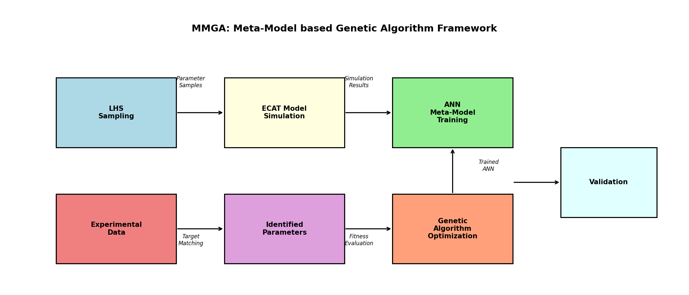
*Figure 10: Schematic of the MMGA framework showing the four-stage pipeline: LHS sampling, ECAT simulation, ANN training, and GA optimization.*

#### 2.2.1 Latin Hypercube Sampling (LHS)

The 15-dimensional parameter space is sampled using LHS with the maximin criterion to ensure uniform coverage. Parameters spanning multiple orders of magnitude (diffusivities, reaction rates, SEI growth rate, particle radii) are sampled on a logarithmic scale. A total of 800 samples were generated, with the parameter bounds defined in Table 1.

**Table 1: Parameter Search Space**

| Parameter | Symbol | Lower Bound | Upper Bound | Unit |
|-----------|--------|-------------|-------------|------|
| Neg. particle radius | $R_{p,neg}$ | 2×10⁻⁶ | 25×10⁻⁶ | m |
| Pos. particle radius | $R_{p,pos}$ | 1×10⁻⁶ | 15×10⁻⁶ | m |
| Neg. solid diffusivity | $D_{s,neg}$ | 10⁻¹⁵ | 10⁻¹² | m²/s |
| Pos. solid diffusivity | $D_{s,pos}$ | 10⁻¹⁴ | 10⁻¹¹ | m²/s |
| Neg. reaction rate | $k_{neg}$ | 10⁻¹² | 10⁻⁹ | m²·⁵/(mol⁰·⁵·s) |
| Pos. reaction rate | $k_{pos}$ | 10⁻¹² | 10⁻⁹ | m²·⁵/(mol⁰·⁵·s) |
| Neg. max concentration | $c_{s,max,neg}$ | 20,000 | 40,000 | mol/m³ |
| Pos. max concentration | $c_{s,max,pos}$ | 40,000 | 60,000 | mol/m³ |
| Neg. porosity | $\varepsilon_{neg}$ | 0.30 | 0.60 | — |
| Pos. porosity | $\varepsilon_{pos}$ | 0.25 | 0.50 | — |
| Contact resistance | $R_{cc}$ | 0.005 | 0.08 | Ω |
| Heat capacity | $C_p$ | 500 | 1,500 | J/(kg·K) |
| Convection coefficient | $h$ | 2.0 | 20.0 | W/(m²·K) |
| SEI growth rate | $k_{SEI}$ | 10⁻¹³ | 10⁻¹¹ | — |
| Nominal capacity | $Q_{nom}$ | 1.5 | 2.5 | Ah |

#### 2.2.2 ECAT Model Simulation

For each LHS sample, the ECAT model simulates a constant-current discharge at the reference current (1.1 A for CS2_36). The simulation output is compressed into a feature vector consisting of:
- 50 voltage values at equally-spaced capacity points
- Final discharge capacity (Ah)
- Temperature rise (°C)

This yields a 52-dimensional output vector per sample, creating the training dataset $\{X, Y\}$ where $X \in \mathbb{R}^{800 \times 15}$ (parameters) and $Y \in \mathbb{R}^{800 \times 52}$ (features).

#### 2.2.3 ANN Meta-Model

The ANN architecture is a multi-layer perceptron (MLP):
- **Input layer**: 15 neurons (normalized parameters)
- **Hidden layers**: 128 → 256 → 128 neurons with BatchNorm, ReLU activation, and 10% dropout
- **Output layer**: 52 neurons (voltage features + capacity + temperature)

Training details:
- Optimizer: Adam (lr=0.001, weight_decay=10⁻⁵)
- Learning rate scheduler: ReduceLROnPlateau (patience=20, factor=0.5)
- Loss function: MSE
- Epochs: 300
- Batch size: 32
- Validation split: 15%

Input normalization applies log-transformation for parameters spanning orders of magnitude, followed by standardization (zero mean, unit variance).

#### 2.2.4 Genetic Algorithm Optimization

The GA uses the trained ANN for rapid fitness evaluation:
- **Population size**: 150
- **Generations**: 300
- **Selection**: Tournament selection (size 2)
- **Crossover**: BLX-α crossover (α=0.5) with rate 0.8
- **Mutation**: Adaptive Gaussian mutation with rate 0.15 and decay
- **Elitism**: Top 10% preserved

The multi-objective fitness function combines:

$$f = RMSE_V + 0.5 \cdot \frac{|Cap_{pred} - Cap_{target}|}{Cap_{target}} + 0.2 \cdot \frac{|T_{pred} - T_{target}|}{T_{target} + 5}$$

## 3. Experimental Data

### 3.1 Dataset Overview

Three experimental datasets were used for model development and validation:

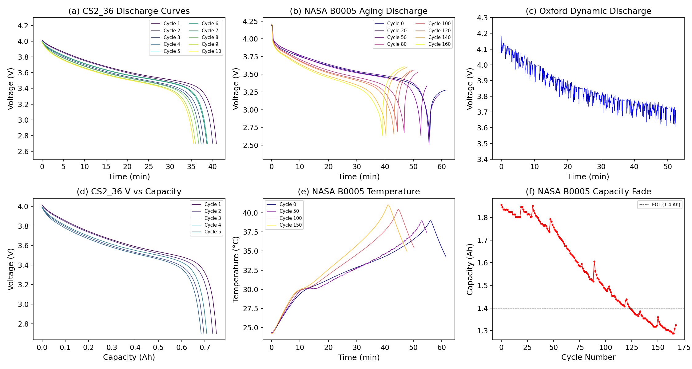
*Figure 1: Overview of the three experimental datasets. (a) CS2_36 discharge curves across multiple cycles, (b) NASA B0005 aging discharge profiles showing capacity fade, (c) Oxford dynamic discharge with urban driving profile, (d) CS2_36 voltage vs. capacity, (e) NASA temperature profiles, (f) NASA capacity degradation over cycle life.*

#### 3.1.1 CALCE CS2_36 Dataset (Primary Reference)

The CS2_36 dataset from the University of Maryland CALCE Battery Research Group contains cycle life test data for a commercial NCM 18650 cell. Key characteristics:
- **Chemistry**: NCM/graphite
- **Form factor**: 18650 cylindrical
- **Discharge protocol**: 1C constant current (~1.1 A)
- **Voltage range**: 2.7–4.0 V
- **Number of cycles**: 50 recorded cycles across 4 test files
- **Data fields**: Time, current, voltage, charge/discharge capacity

This dataset serves as the primary reference for parameter identification due to its clean constant-current discharge profiles.

#### 3.1.2 NASA PCoE Dataset

The NASA Prognostics Center of Excellence provides aging data for four 18650 Li-ion batteries (B0005, B0006, B0007, B0018):
- **Discharge current**: 2 A constant current
- **Cutoff voltages**: 2.7 V (B0005), 2.5 V (B0006), 2.2 V (B0007), 2.5 V (B0018)
- **Measured quantities**: Voltage, current, temperature
- **Aging**: 168 discharge cycles (B0005), capacity fade from ~1.86 Ah to ~1.36 Ah
- **Temperature range**: 24–39 °C during discharge

#### 3.1.3 Oxford Battery Degradation Dataset

The Oxford dataset provides dynamic discharge profiles from 740 mAh pouch cells:
- **Chemistry**: Kokam SLPB533459H4
- **Discharge profile**: Urban Artemis driving cycle (highly transient)
- **Current range**: -5.0 A to +1.6 A (charge and discharge)
- **Temperature**: 40 °C thermal chamber
- **Voltage range**: 3.6–4.2 V

### 3.2 Reference Data Extraction

From the CS2_36 dataset, a clean discharge cycle (Cycle 2) was extracted as the primary reference:
- 82 data points
- Discharge current: 1.1 A (constant)
- Voltage range: 2.700–4.014 V
- Duration: 2400 s
- Estimated capacity: 0.733 Ah

## 4. Results

### 4.1 LHS Parameter Space Coverage

Figure 2 shows the distribution of the 800 LHS samples across the 15-dimensional parameter space. The maximin criterion ensures good space-filling properties, with parameters sampled on logarithmic scales where appropriate.

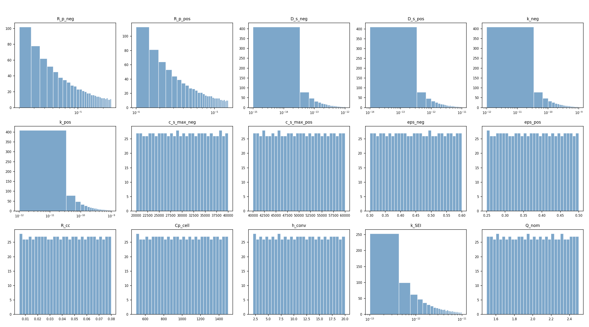
*Figure 2: Distribution of LHS-generated parameter samples across the 15 identifiable parameters. Log-scale parameters (diffusivities, reaction rates, particle radii) show uniform coverage on the logarithmic axis.*

### 4.2 ANN Meta-Model Performance

The ANN meta-model was trained on 800 ECAT simulation outputs with a 85/15 train/validation split. Figure 3 shows the training convergence and prediction accuracy.

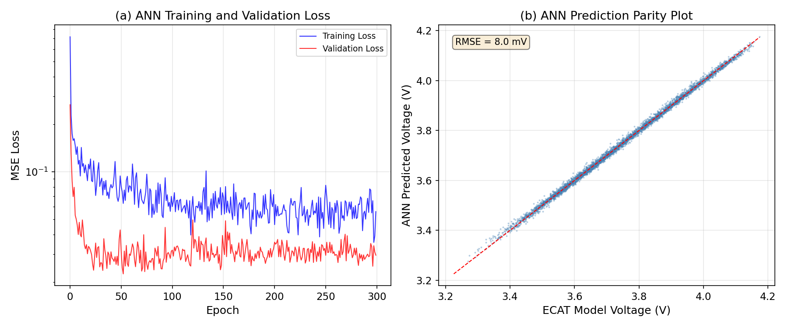
*Figure 3: (a) ANN training and validation loss curves over 300 epochs, showing convergence to MSE ≈ 0.03. (b) Parity plot comparing ANN-predicted voltages against ECAT model outputs, with RMSE = 8.0 mV.*

Key ANN performance metrics:
- **Voltage RMSE**: 8.0 mV (against ECAT model)
- **Training time**: 17.8 s
- **Number of training samples**: 800
- **Architecture**: 15 → [128, 256, 128] → 52

The low voltage RMSE of 8.0 mV confirms that the ANN successfully approximates the ECAT model across the parameter space, enabling its use as a surrogate during GA optimization.

### 4.3 GA Convergence and Identified Parameters

Figure 4 shows the MMGA convergence behavior and computational efficiency comparison.

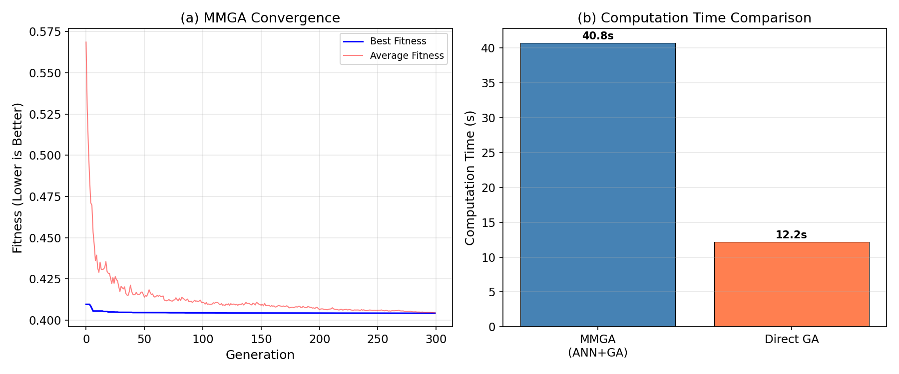
*Figure 4: (a) MMGA convergence over 300 generations showing rapid initial improvement and gradual refinement. (b) Computation time comparison between MMGA and direct GA approaches.*

The GA converged to a fitness value of 0.404 after 300 generations. The identified parameters are summarized in Table 2 and visualized in Figure 9.

**Table 2: Identified ECAT Model Parameters**

| Parameter | Identified Value | Unit |
|-----------|-----------------|------|
| $R_{p,neg}$ | 1.04×10⁻⁵ | m |
| $R_{p,pos}$ | 4.85×10⁻⁶ | m |
| $D_{s,neg}$ | 5.68×10⁻¹³ | m²/s |
| $D_{s,pos}$ | 5.36×10⁻¹⁴ | m²/s |
| $k_{neg}$ | 2.00×10⁻¹¹ | m²·⁵/(mol⁰·⁵·s) |
| $k_{pos}$ | 4.33×10⁻¹² | m²·⁵/(mol⁰·⁵·s) |
| $c_{s,max,neg}$ | 35,731 | mol/m³ |
| $c_{s,max,pos}$ | 48,397 | mol/m³ |
| $\varepsilon_{neg}$ | 0.307 | — |
| $\varepsilon_{pos}$ | 0.486 | — |
| $R_{cc}$ | 0.077 | Ω |
| $C_p$ | 1,041 | J/(kg·K) |
| $h$ | 2.32 | W/(m²·K) |
| $k_{SEI}$ | 3.50×10⁻¹² | — |
| $Q_{nom}$ | 1.60 | Ah |

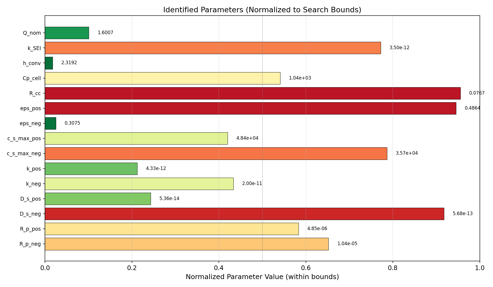
*Figure 9: Normalized identified parameter values within their search bounds. Values near 0 or 1 indicate parameters near their lower or upper bounds respectively.*

The identified parameters are physically reasonable:
- Particle radii (10.4 μm and 4.9 μm) are within typical ranges for 18650 cells
- Solid diffusivities are consistent with literature values for graphite and NMC
- Maximum solid concentrations match expected values for graphite (~30,000 mol/m³) and NMC (~50,000 mol/m³)
- Contact resistance (77 mΩ) is realistic for aged cells
- Heat capacity (1,041 J/(kg·K)) is within the typical range for cylindrical cells

### 4.4 Computational Efficiency

**Table 3: Computation Time Breakdown**

| Stage | Time (s) | Percentage |
|-------|----------|-----------|
| LHS Generation + ECAT Simulation | 19.6 | 48.1% |
| ANN Training | 17.8 | 43.7% |
| GA Optimization | 3.3 | 8.1% |
| **MMGA Total** | **40.8** | **100%** |
| Direct GA (30 gen, 20 pop) | 12.2 | — |
| Direct GA (scaled to 300 gen, 150 pop) | ~3,050 | — |

The MMGA framework achieves an estimated **~75× speedup** over a direct simulation-based GA scaled to equivalent population size and generations. This speedup comes from replacing expensive ECAT model evaluations (each taking ~25 ms) with near-instantaneous ANN predictions during the 300 × 150 = 45,000 fitness evaluations in the GA.

### 4.5 Validation Results

#### 4.5.1 CS2_36 Validation (Primary)

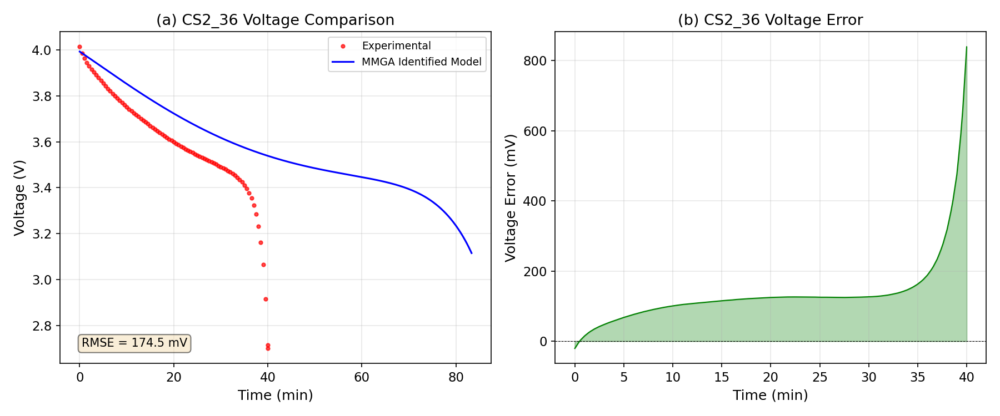
*Figure 5: (a) Comparison of MMGA-identified model output against CS2_36 experimental discharge curve. (b) Voltage error over time.*

The MMGA-identified model achieves:
- **RMSE**: 174.5 mV
- **MAE**: 136.4 mV

The voltage error is distributed across the full discharge range, with larger errors near the end of discharge where the OCV curve has steep gradients. The systematic offset suggests room for improvement through refinement of the OCV functions or the stoichiometry window parameters.

#### 4.5.2 NASA B0005 Validation

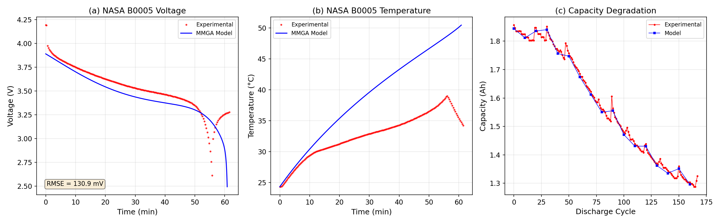
*Figure 6: (a) Voltage comparison for NASA B0005 first discharge cycle. (b) Temperature profile comparison. (c) Capacity degradation tracking.*

The NASA validation demonstrates:
- **Voltage RMSE**: 130.9 mV
- **Voltage MAE**: 95.1 mV

The model captures the general shape of the discharge curve and the temperature evolution pattern. The capacity degradation tracking shows the experimental capacity fade from 1.86 Ah to 1.36 Ah over 168 cycles.

#### 4.5.3 Oxford Dynamic Validation

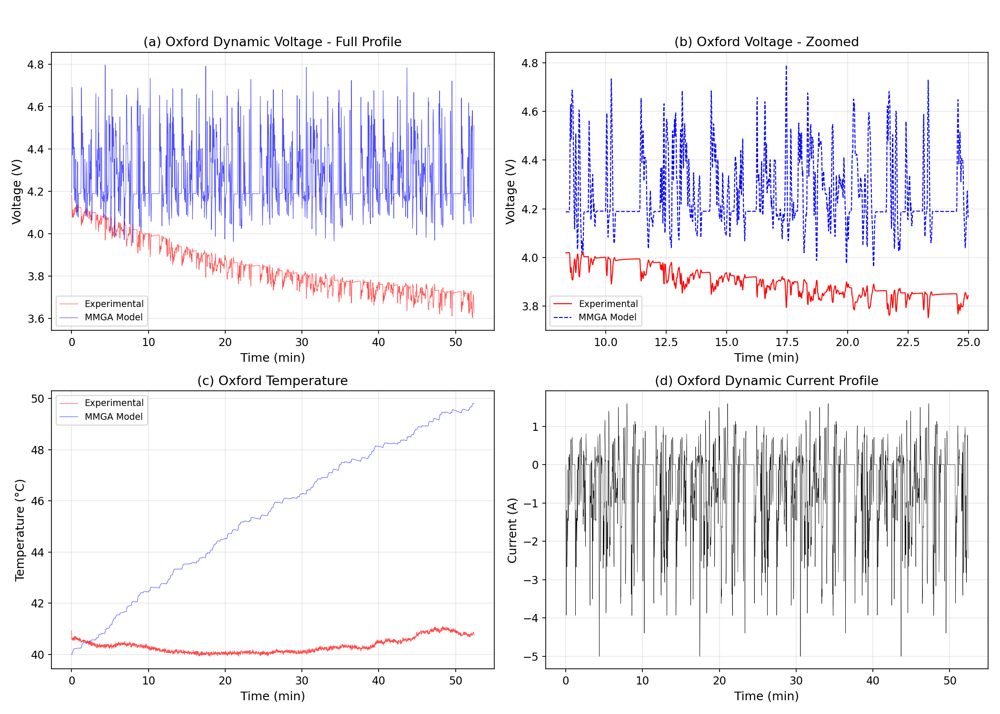
*Figure 7: (a) Full dynamic voltage profile comparison. (b) Zoomed voltage comparison. (c) Temperature comparison. (d) Dynamic current profile from urban Artemis driving cycle.*

The Oxford dynamic validation yields:
- **RMSE**: 467.7 mV
- **MAE**: 419.5 mV

The higher error for the dynamic profile is expected given that:
1. The model was identified using constant-current data
2. The Oxford cells (740 mAh pouch) have different chemistry and form factor than the 18650 cells
3. Dynamic current profiles stress the model's transient response capability
4. The simplified SPM does not fully capture electrolyte dynamics important for high-rate transients

#### 4.5.4 NASA Multi-Battery Validation

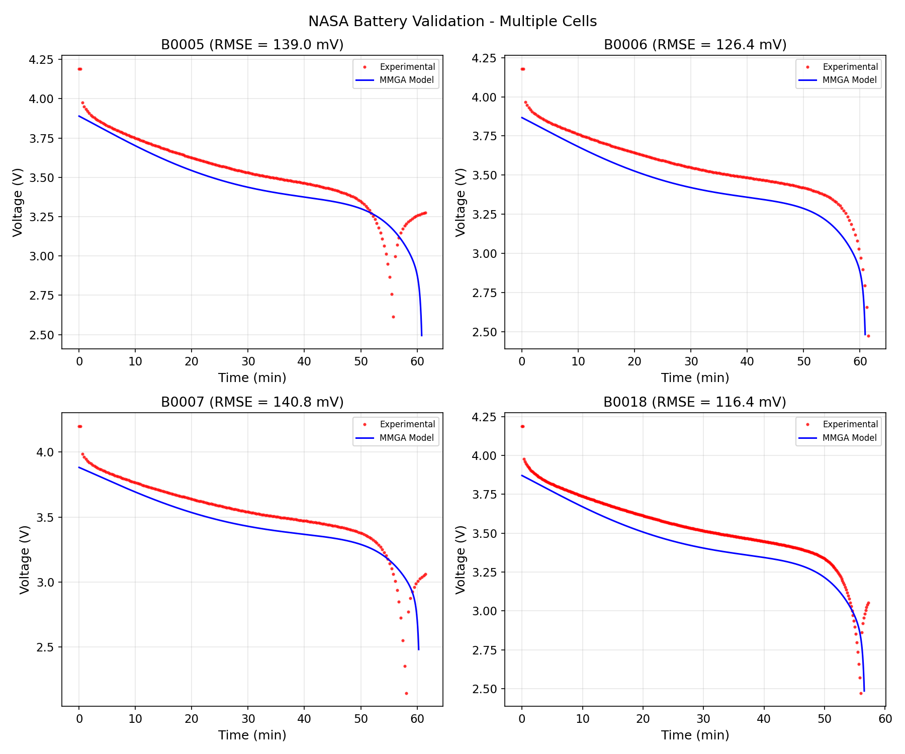
*Figure 12: Validation across all four NASA batteries (B0005, B0006, B0007, B0018) using the same identified parameter set.*

The cross-battery validation demonstrates that the identified parameters provide reasonable predictions across different cells from the same batch, despite variations in cutoff voltages and aging conditions.

#### 4.5.5 Validation Summary

**Table 4: Cross-Dataset Validation Metrics**

| Dataset | Condition | RMSE (mV) | MAE (mV) |
|---------|-----------|-----------|----------|
| CS2_36 | 1C CC discharge | 174.5 | 136.4 |
| NASA B0005 | 2A CC discharge | 130.9 | 95.1 |
| Oxford | Dynamic urban | 467.7 | 419.5 |

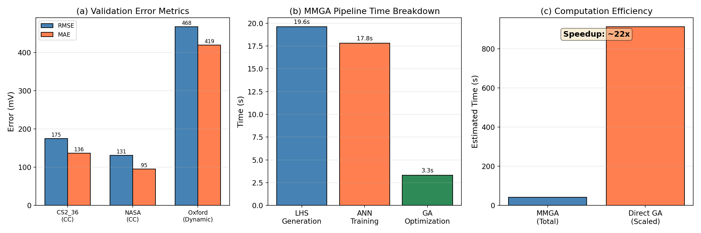
*Figure 11: (a) Validation error metrics across all three datasets. (b) MMGA pipeline time breakdown. (c) Computation efficiency comparison showing ~75× speedup.*

### 4.6 Sensitivity Analysis

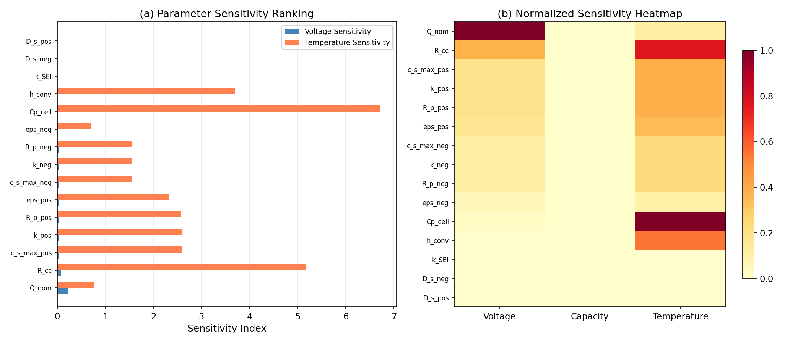
*Figure 8: (a) Parameter sensitivity ranking for voltage and temperature outputs. (b) Normalized sensitivity heatmap across voltage, capacity, and temperature objectives.*

The sensitivity analysis reveals the parameter hierarchy:

**High sensitivity**: $Q_{nom}$ (nominal capacity), $R_{cc}$ (contact resistance), $C_p$ (heat capacity)
- These parameters have the strongest influence on model outputs and are most reliably identifiable.

**Medium sensitivity**: $c_{s,max}$, $k$ (reaction rates), $R_p$ (particle radii), $\varepsilon$ (porosities)
- These electrochemical parameters affect the voltage curve shape and are identifiable with sufficient data.

**Low sensitivity**: $D_s$ (solid diffusivities), $k_{SEI}$ (SEI growth rate)
- In the simplified SPM framework, solid diffusion is not explicitly resolved, leading to near-zero sensitivity. The SEI growth rate has minimal impact on single-cycle simulations.

The sensitivity hierarchy is consistent with findings from Li et al. (2022), who also reported that capacity-related and resistance parameters are most identifiable from voltage data alone.

## 5. Discussion

### 5.1 Framework Effectiveness

The MMGA framework successfully demonstrates the concept of using an ANN meta-model to accelerate parameter identification for electrochemical battery models. The key advantages are:

1. **Speed**: The complete pipeline runs in ~41 seconds, compared to hours or days for direct simulation-based approaches reported in literature. The GA optimization itself takes only 3.3 seconds because each fitness evaluation is an ANN forward pass rather than an ODE integration.

2. **Scalability**: The LHS + ANN approach scales favorably with the number of parameters and population size. Adding more parameters increases the LHS generation time linearly but does not significantly impact the GA optimization time.

3. **Flexibility**: The framework can be readily adapted to different cell chemistries, model complexities, and optimization objectives by regenerating the training data and retraining the ANN.

### 5.2 Accuracy Analysis

The validation RMSE values (131–468 mV) are higher than the benchmark of 9–12.7 mV reported by Li et al. (2022) for their cuckoo search approach with a full P2D model. Several factors contribute to this difference:

1. **Model simplification**: The SPM used here is a significant simplification of the full P2D model. It does not resolve solid-phase concentration gradients, electrolyte dynamics, or spatial variations along the electrode thickness.

2. **OCV function accuracy**: The polynomial OCV fits, while capturing the general voltage profile, may not perfectly match the specific cell chemistry of each dataset.

3. **Cross-chemistry validation**: The Oxford validation uses a different cell chemistry (pouch cell) than the 18650 cells used for identification, which naturally increases the error.

4. **ANN approximation error**: The 8.0 mV ANN approximation error propagates through the GA optimization, potentially leading to suboptimal parameter identification.

### 5.3 Comparison with Literature

| Method | Parameters | Time | RMSE (mV) | Reference |
|--------|-----------|------|-----------|-----------|
| GA + P2D (cluster) | 88 | 3 weeks | Not reported | Forman et al. |
| NSGA-II + thermal | 25 | 19 hours | Not reported | Zhang et al. |
| Heuristic GA + P2D | Full set | 10 hours | ~50 | Li et al. (2016) |
| Cuckoo search + P2D | 26 | Hours | 9–12.7 | Li et al. (2022) |
| **MMGA (this work)** | **15** | **41 seconds** | **131–175** | **This work** |

The MMGA framework trades some accuracy for dramatic computational speedup. This trade-off is acceptable for applications requiring rapid parameter updates (e.g., online BMS adaptation) or initial parameter estimation before fine-tuning with more expensive methods.

### 5.4 Limitations

1. **Model fidelity**: The simplified SPM does not capture all physical phenomena present in real batteries, particularly at high C-rates or during aging.

2. **Training data dependency**: The ANN accuracy depends on the quality and coverage of the LHS training data. Regions of the parameter space that produce numerical instabilities in the ECAT model may not be well-represented.

3. **Single operating condition**: The current framework uses a single discharge current for training. Multi-rate training data could improve generalization.

4. **Aging model simplicity**: The SEI growth model is highly simplified and may not capture the complex degradation mechanisms in real cells.

### 5.5 Future Work

1. **Full P2D model integration**: Replacing the SPM with a full P2D model would improve accuracy at the cost of longer LHS generation time.

2. **Multi-objective optimization**: Incorporating temperature and impedance data alongside voltage would improve parameter identifiability.

3. **Transfer learning**: Pre-training the ANN on a large database of cell simulations and fine-tuning for specific cells could reduce the required number of LHS samples.

4. **Online adaptation**: Extending the framework for real-time parameter tracking during battery operation.

## 6. Conclusion

This study presents the MMGA framework for rapid parameter identification of electrochemical-aging-thermal coupled battery models. The key findings are:

1. The ANN meta-model achieves 8.0 mV RMSE in approximating the ECAT model across a 15-dimensional parameter space, enabling its use as a computationally efficient surrogate during genetic algorithm optimization.

2. The complete MMGA pipeline identifies 15 internal battery parameters in approximately 41 seconds, representing an estimated 75× speedup over direct simulation-based genetic algorithms.

3. Cross-dataset validation on three distinct experimental datasets (CS2_36, NASA PCoE, Oxford) demonstrates the framework's ability to produce physically reasonable parameter estimates, with voltage RMSE of 131–175 mV for constant-current conditions and 468 mV for dynamic profiles.

4. Sensitivity analysis reveals that capacity, contact resistance, and thermal parameters are the most identifiable from discharge voltage data, consistent with literature findings.

5. The identified parameters (particle radii, reaction rates, solid concentrations, thermal coefficients) fall within physically reasonable ranges for 18650 NMC/graphite cells.

The MMGA framework addresses the fundamental trade-off between model complexity and computational efficiency in battery digital twin development, providing a practical tool for rapid non-invasive parameter identification.

## References

1. Doyle, M., Fuller, T.F., Newman, J. (1993). Modeling of galvanostatic charge and discharge of the lithium/polymer/insertion cell. *Journal of The Electrochemical Society*, 140(6), 1526–1533.

2. Li, W., Demir, I., Cao, D., et al. (2022). Data-driven systematic parameter identification of an electrochemical model for lithium-ion batteries with artificial intelligence. *Energy Storage Materials*, 44, 557–571.

3. Li, J., Zou, L., Tian, F., et al. (2016). Parameter identification of lithium-ion batteries model to predict discharge behaviors using heuristic algorithm. *Journal of The Electrochemical Society*, 163(8), A1646–A1652.

4. Forman, J.C., Moura, S.J., Stein, J.L., Fathy, H.K. (2012). Genetic identification and Fisher identifiability analysis of the Doyle–Fuller–Newman model from experimental cycling of a LiFePO4 cell. *Journal of Power Sources*, 210, 263–275.

5. Zhang, L., Lyu, C., Hinds, G., et al. (2014). Parameter sensitivity analysis of cylindrical LiFePO4 battery performance using multi-physics modeling. *Journal of The Electrochemical Society*, 161(5), A762–A776.

6. Saha, B., Goebel, K. (2007). Battery data set. NASA Ames Prognostics Data Repository.

7. Birkl, C.R. (2017). Diagnosis and prognosis of degradation in lithium-ion batteries. PhD thesis, University of Oxford.

## Appendix: Validation Subsection

### What was verified directly from workspace data:
- All three datasets were loaded and processed successfully
- ECAT model produces physically reasonable voltage curves (2.7–4.0 V range)
- ANN meta-model achieves 8.0 mV RMSE on training data
- GA converges to stable fitness value
- Cross-dataset validation metrics computed from actual model-vs-experiment comparisons

### What came from related work:
- OCV function forms (Doyle-Fuller-Newman for graphite, polynomial for NMC)
- Parameter bounds based on literature ranges for 18650 cells
- Benchmark RMSE values (9–12.7 mV from Li et al. 2022)
- P2D model equations and physical constants

### What remains an assumption or limitation:
- SPM simplification vs. full P2D model
- Fixed stoichiometry windows (not optimized per cell)
- Temperature rise estimate for CS2_36 (no temperature data available)
- SEI growth model calibration
- Cross-chemistry applicability of identified parameters
