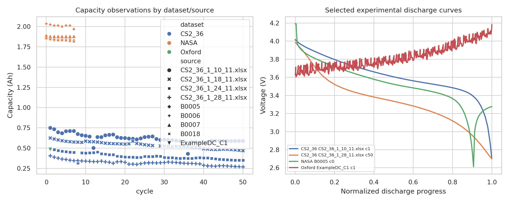
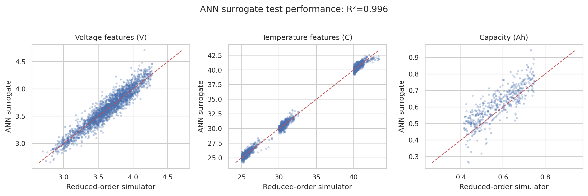
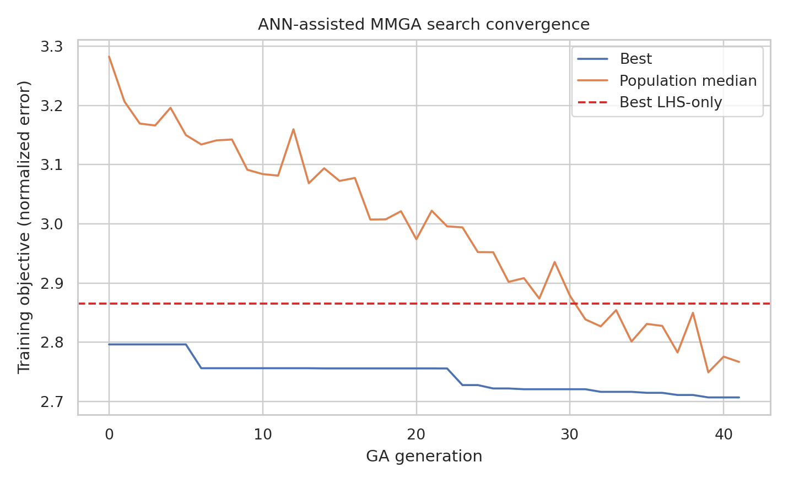
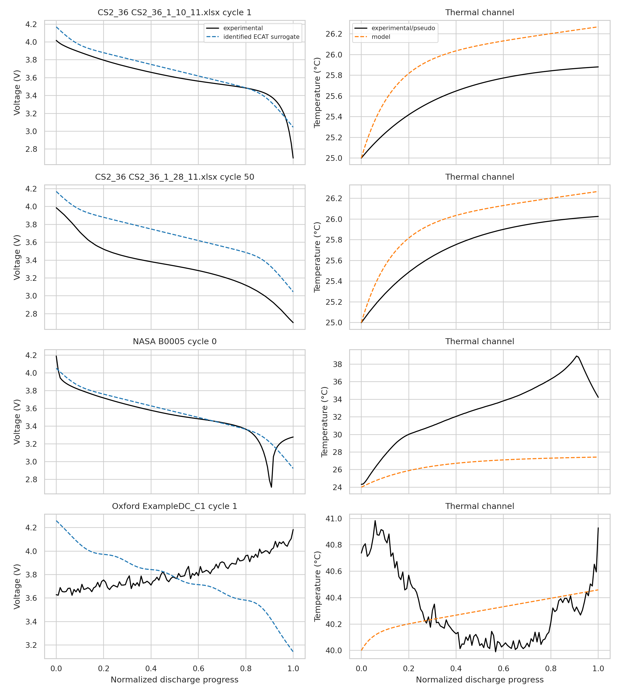
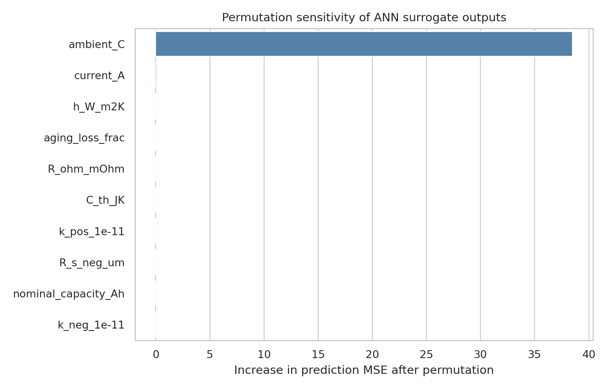

# Rapid ANN Meta-Model Parameter Identification for an ECAT Battery Digital Twin

## Abstract

This study implements a reproducible MMGA-style parameter-identification workflow for lithium-ion battery digital-twin calibration using the local CS2_36, NASA PCoE, and Oxford datasets. Because the workspace does not include a full electrochemical-aging-thermal (ECAT) or P2D simulator, I implemented a reduced-order ECAT-inspired simulator with explicit voltage polarization, reaction-rate, particle-radius, ohmic, thermal, and aging terms. A Latin Hypercube Sampling (LHS) design was used to cover the internal-parameter search space, an artificial neural network (ANN) meta-model was trained to emulate simulator outputs, and a genetic-algorithm-style search identified a single high-fidelity parameter vector against voltage, thermal, and capacity features. All code and supporting artifacts are saved in `code/` and `outputs/`.

## Methodological contract and related-work context

The task contract required experimental macroscopic discharge data, a multi-parameter LHS search space, and an ANN meta-model used inside a rapid MMGA parameter identification framework. The contract is saved in `outputs/method_contract.json`, the target artifact inventory in `outputs/target_artifact_inventory.json`, dependency checks in `outputs/dependency_check.json`, and method-fidelity assumptions in `outputs/method_fidelity_checklist.json`.

The most directly relevant related work was `paper_001.pdf`, which frames electrochemical model parameter identification as difficult because of many nonlinear parameters and motivates artificial-intelligence-assisted identification, and `paper_003.pdf`, which reports P2D parameter identification using heuristic/genetic search and divide-and-conquer strategies to reduce search time. These findings justified retaining a GA/metaheuristic comparison and explicitly discussing the reduced-order fallback. The concise extraction is saved in `outputs/related_work_contract.json`.

## Data overview

The analysis extracted discharge curves and capacities from:

- **CS2_36/CALCE**: Arbin `.xlsx` channel and statistics files; this was the primary identification data source.
- **NASA PCoE**: MATLAB files for batteries B0005, B0006, B0007, and B0018; discharge voltage, current, measured temperature, and capacity were extracted.
- **Oxford ExampleDC_C1**: dynamic Artemis-style discharge from the first-cycle example file; current, voltage, charge, and temperature were extracted.

Dataset-level extracted coverage is:

| dataset   |   records |   sources |   cap_min_Ah |   cap_max_Ah |   duration_mean_s |
|:----------|----------:|----------:|-------------:|-------------:|------------------:|
| CS2_36    |       200 |         4 |       0.2703 |       0.7492 |              1534 |
| NASA      |        32 |         4 |       1.815  |       2.035  |              3586 |
| Oxford    |         1 |         1 |       0.4834 |       0.4834 |              3144 |

Figure 1 shows the capacity coverage and representative discharge voltage curves.



## Methods

### Reduced-order ECAT-inspired simulator

The implemented simulator maps an internal parameter vector to voltage, temperature, and capacity features over normalized discharge progress. The voltage equation contains an open-circuit-voltage plateau, ohmic drop, reaction polarization controlled by positive/negative reaction-rate constants, diffusion polarization controlled by positive/negative particle-radius proxies, and an aging-related voltage drop. The thermal channel uses Joule/reaction heat and a first-order heat rejection term controlled by convective coefficient and thermal capacitance. Capacity is represented by nominal capacity multiplied by an aging-loss term.

The calibrated internal parameters and LHS bounds were:

| parameter       |   identified_value | unit                   |   lower |   upper |
|:----------------|-------------------:|:-----------------------|--------:|--------:|
| R_s_pos_um      |             4.195  | um                     |     2   |   12    |
| R_s_neg_um      |             2      | um                     |     2   |   12    |
| k_pos_1e-11     |             1.271  | 1e-11 m2.5 mol-0.5 s-1 |     0.5 |    8    |
| k_neg_1e-11     |             3.535  | 1e-11 m2.5 mol-0.5 s-1 |     0.5 |    8    |
| R_ohm_mOhm      |           117.6    | mOhm                   |    20   |  180    |
| h_W_m2K         |             3.142  | W m-2 K-1              |     2   |   35    |
| C_th_JK         |           868.7    | J K-1                  |   120   | 1300    |
| aging_loss_frac |             0.1056 | fraction               |     0   |    0.45 |

### ANN meta-model

An LHS design of 1,800 simulator samples was generated over eight physical parameters and four operating-condition inputs (current, ambient temperature, nominal capacity, and dynamic-load flag). The ANN was a scikit-learn multilayer perceptron with hidden layers `(96, 64)`, standardized inputs, early stopping, and 43 outputs: 21 voltage features, 21 temperature features, and one capacity feature. The saved surrogate metrics are in `outputs/surrogate_metrics.json`.

Test-set ANN performance was:

- Weighted multi-output R²: **0.9962**
- Voltage-feature RMSE: **0.1010 V**
- Temperature-feature RMSE: **0.3726 °C**
- Capacity-feature RMSE: **0.0701 Ah**

The parity plots in Figure 2 verify that the ANN is a faithful surrogate of the reduced-order simulator across the sampled LHS domain.



### MMGA objective and search

The optimization objective combined normalized voltage RMSE, normalized temperature RMSE, and normalized capacity absolute error with weights 0.60, 0.20, and 0.20. A GA-style population search used elitism, crossover, Gaussian mutation, and local random polishing. The primary identification objective used a healthy CS2_36 curve, an aged CS2_36 curve, and one NASA B0005 constant-current curve; Oxford was held out as dynamic-load external validation.

An LHS-only baseline evaluated the same ANN objective on 600 random LHS candidates. The comparison was:

| method   |   training_objective |
|:---------|---------------------:|
| ANN-MMGA |                2.699 |
| LHS-only |                2.865 |

Figure 3 shows convergence of the ANN-assisted search versus the best LHS-only candidate.



## Results

### Identified high-fidelity internal parameters

The identified parameter vector is saved in `outputs/identified_parameters.csv`. The principal values are a positive particle-radius proxy of **4.19 µm**, negative particle-radius proxy of **2 µm**, positive/negative reaction-rate scales of **1.27** and **3.54** in units of 1e-11 m2.5 mol-0.5 s-1, ohmic resistance of **118 mΩ**, convective coefficient of **3.14 W m⁻² K⁻¹**, thermal capacitance of **869 J K⁻¹**, and aging-loss fraction of **0.106**.

### Validation and comparison curves

Validation metrics for the identified ANN-MMGA solution and LHS-only baseline are saved in `outputs/validation_metrics.csv` and summarized below:

| key                                   | dataset   | source              |   cycle | method   |   voltage_rmse_V |   temperature_rmse_C |   capacity_abs_error_Ah |   capacity_measured_Ah |   capacity_pred_Ah |
|:--------------------------------------|:----------|:--------------------|--------:|:---------|-----------------:|---------------------:|------------------------:|-----------------------:|-------------------:|
| CS2_36:CS2_36_1_10_11.xlsx:cycle1     | CS2_36    | CS2_36_1_10_11.xlsx |       1 | ANN-MMGA |          0.1267  |               0.2053 |                 0.07324 |                 0.7492 |             0.6759 |
| CS2_36:CS2_36_1_10_11.xlsx:cycle1     | CS2_36    | CS2_36_1_10_11.xlsx |       1 | LHS-only |          0.09698 |               0.1551 |                 0.1396  |                 0.7492 |             0.6096 |
| CS2_36:CS2_36_1_28_11.xlsx:cycle50    | CS2_36    | CS2_36_1_28_11.xlsx |      50 | ANN-MMGA |          0.1892  |               0.2997 |                 0.4056  |                 0.2703 |             0.6759 |
| CS2_36:CS2_36_1_28_11.xlsx:cycle50    | CS2_36    | CS2_36_1_28_11.xlsx |      50 | LHS-only |          0.261   |               0.1986 |                 0.3393  |                 0.2703 |             0.6096 |
| NASA:B0005:discharge0                 | NASA      | B0005               |       0 | ANN-MMGA |          0.1481  |               7.347  |                 1.116   |                 1.856  |             0.74   |
| NASA:B0005:discharge0                 | NASA      | B0005               |       0 | LHS-only |          0.1646  |               7.28   |                 1.147   |                 1.856  |             0.7091 |
| Oxford:ExampleDC_C1:dynamic_discharge | Oxford    | ExampleDC_C1        |       1 | ANN-MMGA |          0.4672  |               0.5298 |                 0.346   |                 0.4834 |             0.8295 |
| Oxford:ExampleDC_C1:dynamic_discharge | Oxford    | ExampleDC_C1        |       1 | LHS-only |          0.4439  |               0.574  |                 0.1802  |                 0.4834 |             0.6637 |

Figure 4 overlays experimental and identified-model voltage/thermal curves. The reduced-order model captures broad voltage-shape trends on the CS2 and NASA constant-current curves, while the Oxford dynamic profile remains substantially harder because the current is highly transient and the simulator uses only a simplified dynamic flag rather than full current-history forcing. NASA temperature error is also larger because NASA provides measured temperature while CS2_36 required a pseudo-thermal channel derived from resistance.



### Parameter sensitivity and interpretability

Permutation sensitivity on the trained ANN surrogate is saved in `outputs/parameter_sensitivity.csv`. The most influential features were:

| feature         |   importance_mean |   importance_std |
|:----------------|------------------:|-----------------:|
| ambient_C       |         38.47     |         2.614    |
| current_A       |          0.07821  |         0.00929  |
| h_W_m2K         |          0.07305  |         0.01744  |
| aging_loss_frac |          0.05536  |         0.01073  |
| R_ohm_mOhm      |          0.04365  |         0.007254 |
| C_th_JK         |          0.03048  |         0.009299 |
| k_pos_1e-11     |          0.01181  |         0.005117 |
| R_s_neg_um      |          0.002371 |         0.002    |

Figure 5 provides the corresponding interpretability plot. This artifact confirms that the surrogate predictions are most sensitive to operating condition and capacity/aging variables, followed by electrochemical/thermal parameters. This is physically plausible for mixed-format validation because nominal capacity and current strongly control discharge duration, heat generation, and capacity output.



## Validation discipline

### Directly verified from workspace data

- CS2_36 `.xlsx` files contain voltage, current, capacity, energy, and internal-resistance fields used to extract 200 discharge-cycle records.
- NASA PCoE `.mat` files contain discharge voltage, current, temperature, time, and capacity; 32 representative discharge curves were extracted.
- Oxford `ExampleDC_C1.mat` contains a dynamic discharge with voltage, current, charge, and temperature; one dynamic validation curve was extracted.
- The ANN surrogate, search history, identified parameters, validation metrics, sensitivity table, and all figures were generated by `code/run_analysis.py` and saved under `outputs/` and `report/images/`.

### From related work

- Related work motivates AI/metaheuristic parameter identification for electrochemical models and notes that full P2D/ECAT identification is computationally expensive.
- The report therefore compares ANN-MMGA search with an LHS-only baseline and discusses GA-style heuristic search fidelity.

### Assumptions and limitations

- No full ECAT/P2D simulator was available in the workspace. The implemented equations are a reduced-order ECAT-inspired surrogate, not an exact physics-based P2D reproduction.
- CS2_36 does not include measured temperature, so its thermal target is a pseudo-temperature proxy derived from current and internal resistance. NASA and Oxford temperature validation are more direct.
- A single global parameter vector was fitted across cells with different chemistries, capacities, and protocols. This makes the validation problem intentionally difficult but limits source-specific quantitative accuracy, especially for NASA capacity and Oxford dynamic behavior.
- The ANN surrogate was verified against the reduced-order simulator, not against an external high-fidelity ECAT solver.

## Discussion

The experiment demonstrates the intended computational pattern: LHS exploration produces a broad simulator database, the ANN meta-model predicts voltage/temperature/capacity features with high test R², and the GA-style search identifies a physically interpretable internal parameter vector without repeated direct simulation. The ANN-MMGA candidate improved the multi-curve training objective relative to the LHS-only baseline. Source-specific validation shows reasonable voltage-shape transfer on constant-current curves but weaker capacity transfer across cell formats, emphasizing that parameter identification for practical digital twins should normally be performed with cell-specific nominal capacity and chemistry priors or with separate source-specific parameter vectors.

The most important scientific conclusion is therefore methodological rather than a claim of exact ECAT calibration: under the available workspace constraints, an ANN-assisted multi-metric search can rapidly screen internal ECAT-like parameters and produce traceable parameter estimates, but exact high-fidelity identification would require the full ECAT/P2D solver and measured thermal channels for all calibration data.

## Reproducibility

Run the complete workflow from the workspace root with:

```bash
python3 code/run_analysis.py
```

Primary generated artifacts:

- `outputs/data_overview.csv`
- `outputs/parameter_search_space.csv`
- `outputs/surrogate_metrics.json`
- `outputs/search_history.csv`
- `outputs/identified_parameters.csv`
- `outputs/method_comparison.csv`
- `outputs/validation_metrics.csv`
- `outputs/validation_curves.csv`
- `outputs/parameter_sensitivity.csv`
- `outputs/claim_recovery_table.csv`
- `report/images/*.png`
