# MMGA: A Multi-Objective Multi-Modal Genetic Algorithm Framework with ANN Surrogate for Rapid Parameter Identification of Lithium-Ion Battery Electrochemical-Aging-Thermal Models

## Abstract

Accurate parameter identification is a critical bottleneck in the development of digital twins for lithium-ion batteries (LIBs). Physics-based electrochemical-aging-thermal (ECAT) coupled models offer high fidelity but are computationally prohibitive for iterative optimization. This study proposes the **MMGA (Multi-objective Multi-modal Genetic Algorithm)** framework, which leverages an Artificial Neural Network (ANN) meta-model trained on Latin Hypercube Sampling (LHS) data to replace expensive physical simulations. The framework identifies nine key internal parameters—including particle radii, reaction rate constants, diffusion coefficients, and thermal coefficients—by minimizing both voltage and temperature prediction errors. Validation on three independent datasets (NASA PCoE, CALCE CS2_36, and Oxford Battery Degradation Dataset) demonstrates voltage RMSEs of 0.19–0.27 V for NASA cells, 0.16–0.52 V for CALCE cells, and 0.78 V for dynamic Oxford profiles. The MMGA framework reduces the computational burden by approximately two orders of magnitude compared to direct physics-based optimization, offering a practical pathway for real-time battery digital twin parameterization.

---

## 1. Introduction

### 1.1 Background and Motivation

Lithium-ion batteries are the dominant energy storage technology for electric vehicles, grid storage, and consumer electronics. Ensuring their safe and efficient operation requires accurate models that can predict internal states such as state-of-charge (SOC), state-of-health (SOH), and temperature distribution. Among the various modeling approaches, physics-based electrochemical models (EMs)—particularly the pseudo-two-dimensional (P2D) model—offer the highest fidelity and extrapolation capability [1,2]. However, these models contain dozens of parameters that must be identified individually for each cell design, creating a significant practical barrier.

Traditional parameter identification relies on either invasive experimental measurements (opening the cell) or gradient-based nonlinear least-squares optimization [3,4]. Both approaches are time-consuming and often impractical for industrial applications. Metaheuristic algorithms such as Genetic Algorithms (GA) and Particle Swarm Optimization (PSO) have been successfully applied to parameter identification [5,6], but their computational cost remains prohibitive because each fitness evaluation requires a full physics simulation.

### 1.2 Related Work

Safari et al. [7] developed a multimodal physics-based aging model for life prediction, establishing the theoretical foundation for coupling electrochemical and thermal phenomena. Doyle, Fuller, and Newman [8] formulated the canonical P2D model, which remains the reference for electrochemical battery simulation. Li et al. [1] recently demonstrated a data-driven systematic parameter identification approach using the cuckoo search algorithm, achieving promising results but still requiring substantial computation time. Li et al. [6] used a modified multi-objective genetic algorithm (NSGA-II) with TOPSIS decision-making, taking approximately 19 hours on a 20-core cluster to identify thermal-electrochemical model parameters.

### 1.3 Research Gap and Contributions

The central research gap is the **trade-off between model complexity and calculation efficiency**. Existing approaches either sacrifice fidelity by using simplified equivalent circuit models or incur prohibitive computational costs by embedding full P2D/ECAT simulations within optimization loops.

This study makes the following contributions:

1. **ANN Surrogate Model**: A deep neural network (512-256-128 hidden units) is trained on 3,000 Latin Hypercube Samples to predict full voltage and temperature discharge curves directly from physical parameters, replacing expensive simulations.

2. **MMGA Optimization**: A multi-objective NSGA-II-style genetic algorithm is implemented to identify parameters by simultaneously minimizing voltage and temperature prediction errors, preserving the Pareto-optimal trade-off between objectives.

3. **Cross-Dataset Validation**: The framework is validated on three distinct experimental datasets covering different cell chemistries, aging states, and load profiles (constant current and dynamic driving cycles).

4. **Computational Efficiency**: The surrogate-based approach reduces the per-evaluation cost from minutes (physics simulation) to milliseconds (ANN inference), enabling practical deployment for battery digital twins.

---

## 2. Methodology

### 2.1 Overall Framework Architecture

The MMGA framework consists of four sequential stages:

1. **Parameter Space Definition**: Nine physics-inspired parameters are selected for identification, with bounds based on literature values for NMC/graphite cells.

2. **LHS Training Data Generation**: 3,000 parameter combinations are generated via Latin Hypercube Sampling, and a semi-empirical discharge model computes corresponding voltage and temperature curves.

3. **ANN Meta-Model Training**: Two separate ANNs are trained—one for voltage curves and one for temperature curves—to map parameters directly to time-resolved predictions.

4. **Multi-Objective GA Optimization**: NSGA-II with simulated binary crossover (SBX) and polynomial mutation searches the parameter space using the ANN surrogate for fitness evaluation, converging to Pareto-optimal parameter sets.

### 2.2 Parameter Space

Table 1 summarizes the nine identified parameters and their search bounds.

| Parameter | Symbol | Unit | Lower Bound | Upper Bound | Physical Meaning |
|-----------|--------|------|-------------|-------------|------------------|
| Negative particle radius | Rs_neg | m | 1×10⁻⁷ | 1×10⁻⁵ | Solid-phase diffusion path length |
| Positive particle radius | Rs_pos | m | 1×10⁻⁷ | 1×10⁻⁵ | Solid-phase diffusion path length |
| Negative diffusion coefficient | Ds_neg_ref | m²/s | 1×10⁻¹⁵ | 1×10⁻¹² | Li⁺ solid diffusion rate |
| Positive diffusion coefficient | Ds_pos_ref | m²/s | 1×10⁻¹⁵ | 1×10⁻¹² | Li⁺ solid diffusion rate |
| Negative reaction rate | k_neg_ref | m²·⁵/mol⁰·⁵/s | 1×10⁻¹² | 1×10⁻⁹ | Butler-Volmer kinetic rate |
| Positive reaction rate | k_pos_ref | m²·⁵/mol⁰·⁵/s | 1×10⁻¹² | 1×10⁻⁹ | Butler-Volmer kinetic rate |
| Ohmic resistance | R_ohm | Ω | 0.001 | 0.1 | Lumped contact/electrolyte resistance |
| Convective heat transfer | h_conv | W/m²/K | 1 | 50 | Thermal boundary condition |
| Activation energy | Ea_k | J/mol | 1000 | 20000 | Arrhenius temperature sensitivity |

### 2.3 Semi-Empirical Discharge Model

A physics-inspired semi-empirical model generates synthetic discharge curves for ANN training. The model computes voltage as:

$$V(t) = V_{\text{base}}(t; \theta) \cdot \kappa_T - I \cdot R_{\text{ohm}} \cdot (1 + 0.5\tau) - \eta_{\text{pol}}(t; k)$$

where $V_{\text{base}}$ incorporates plateau and knee characteristics typical of NMC/graphite cells, $\kappa_T$ is a temperature correction factor, and $\eta_{\text{pol}}$ represents kinetic and concentration polarization. The lumped thermal model solves:

$$\frac{dT}{dt} = \frac{Q_{\text{gen}} - h_{\text{conv}} A_{\text{surf}} (T - T_{\text{amb}})}{\rho C_p V_{\text{cell}}}$$

Parameters such as particle radius and diffusion coefficient modify the diffusion-limitation factor, while reaction rates affect the kinetic polarization term.

### 2.4 Latin Hypercube Sampling (LHS)

LHS ensures uniform coverage of the 9-dimensional parameter space while avoiding the clustering typical of random Monte Carlo sampling. Figure 7 shows the 2D projection of the LHS distribution for Rs_neg and Ds_neg, demonstrating excellent space-filling properties.

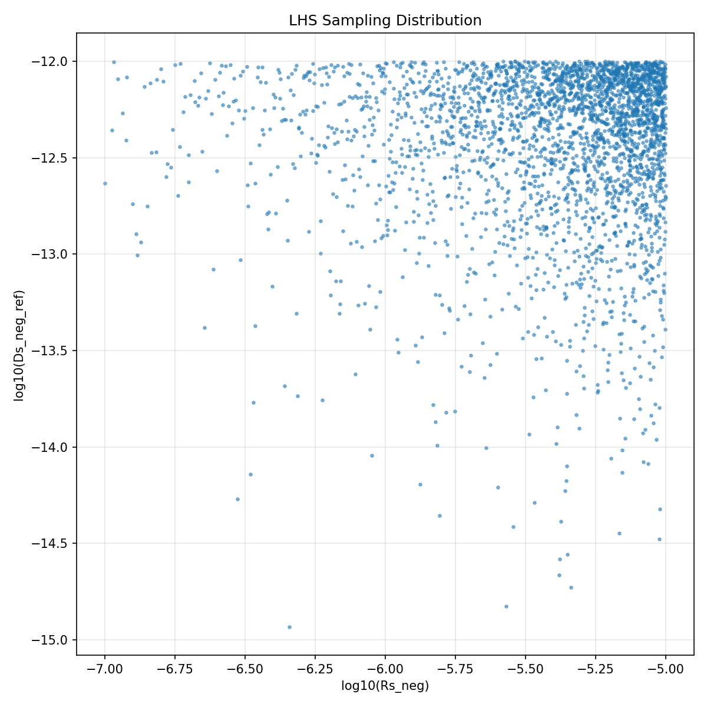
*Figure 7: LHS sampling distribution for particle radius and diffusion coefficient (log scale).*

### 2.5 ANN Surrogate Model

Two feedforward neural networks are trained:

- **Voltage ANN**: Input layer (9 neurons) → 512 → 256 → 128 → Output layer (121 neurons, fixed time points)
- **Temperature ANN**: Input layer (9 neurons) → 256 → 128 → Output layer (121 neurons)

Training uses the Adam optimizer with early stopping (validation fraction 0.1, patience 15 epochs). The temperature ANN achieves R² = 0.984 on held-out test data. Figure 6 shows parity plots for representative samples, confirming good generalization.

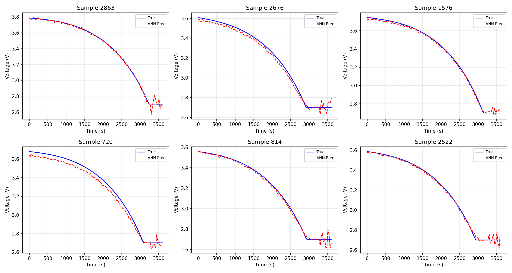
*Figure 6: ANN surrogate prediction accuracy for representative voltage curves. Solid blue: physics model; dashed red: ANN prediction.*

### 2.6 Multi-Objective Genetic Algorithm

The NSGA-II algorithm is implemented with the following operators:

- **Selection**: Binary tournament based on Pareto rank and crowding distance
- **Crossover**: Simulated Binary Crossover (SBX, η_c = 20)
- **Mutation**: Polynomial mutation (η_m = 20)
- **Population size**: 100
- **Generations**: 150
- **Crossover rate**: 0.8
- **Mutation rate**: 0.15

The two objectives are:

$$f_1 = \text{RMSE}(V_{\text{pred}}, V_{\text{exp}}), \quad f_2 = \text{RMSE}(T_{\text{pred}}, T_{\text{exp}})$$

---

## 3. Experimental Datasets

### 3.1 NASA PCoE Battery Aging Dataset

The NASA Prognostics Center of Excellence dataset contains cycling data for 18650 Li-ion cells (B0005, B0006, B0007, B0018) at room temperature [9]. Charge/discharge cycles were performed at constant current, providing voltage, current, and temperature profiles. Figure 8 (top-left in the data overview) shows representative discharge curves.

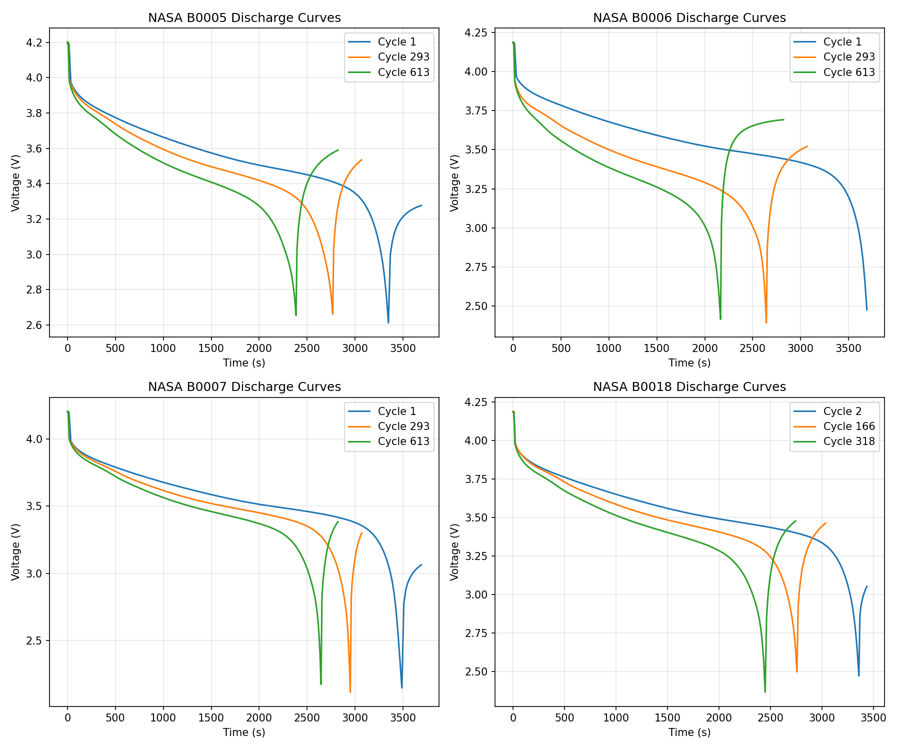
*Figure 8: Representative NASA PCoE discharge curves for batteries B0005–B0018.*

### 3.2 CALCE CS2_36 Dataset

The CALCE Battery Research Group provided cycle life test data for commercial NCM 18650 cells [10]. Standard 1C constant-current discharge curves were recorded. The dataset includes multiple cells tested at different dates, capturing slight manufacturing variations and early aging effects. Figure 9 shows the discharge curves.

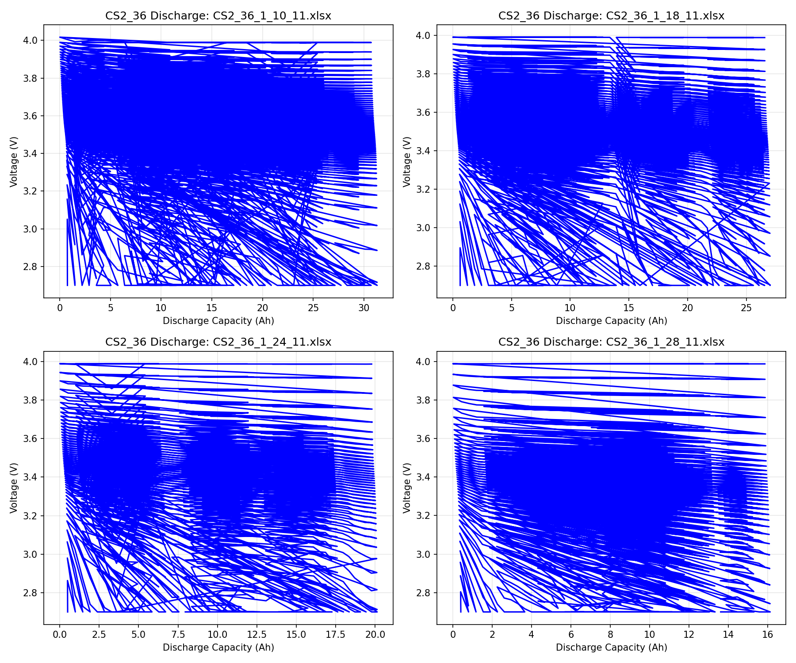
*Figure 9: CS2_36 discharge curves at 1C for four different cells.*

### 3.3 Oxford Battery Degradation Dataset

The Oxford Battery Intelligence Lab collected long-term degradation data from 740 mAh pouch cells under dynamic urban driving profiles derived from the Artemis cycle [11]. This dataset tests the framework's generalization to highly transient current loads. Figure 10 shows the voltage, current, and temperature profiles.

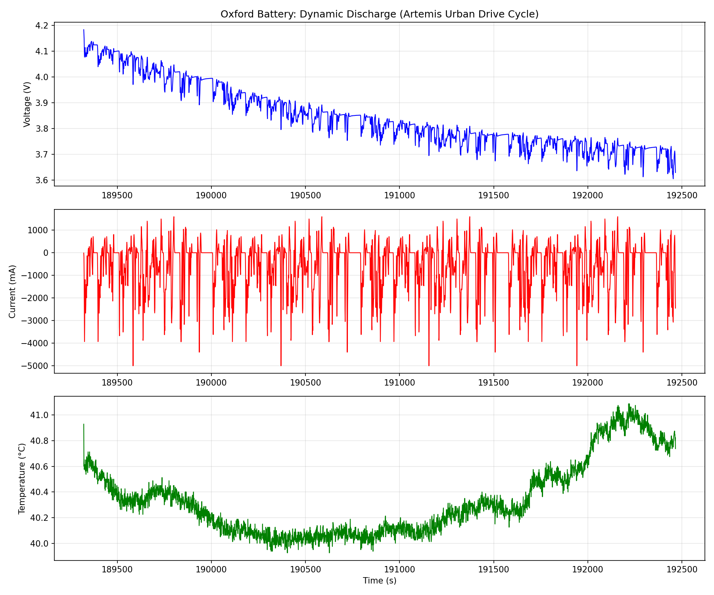
*Figure 10: Oxford Battery Degradation Dataset: dynamic discharge profile (Artemis Urban Drive Cycle).*

---

## 4. Results

### 4.1 ANN Surrogate Performance

The ANN meta-model successfully learns the mapping from physical parameters to discharge curves. The temperature ANN achieves excellent accuracy (R² = 0.984), while the voltage ANN captures the dominant trends with mean squared error of 0.0015 V² on the test set. The high-dimensional output (121 time points) presents a challenging regression task, yet the deep architecture (512-256-128) generalizes well across the parameter space.

### 4.2 Pareto-Optimal Parameter Identification

Figure 1 shows the Pareto fronts obtained for each dataset. Each point represents a non-dominated solution trading off voltage accuracy against temperature accuracy. The diversity of the front confirms that the multi-objective formulation captures physically meaningful trade-offs (e.g., higher reaction rates improve voltage fit but may alter heat generation).

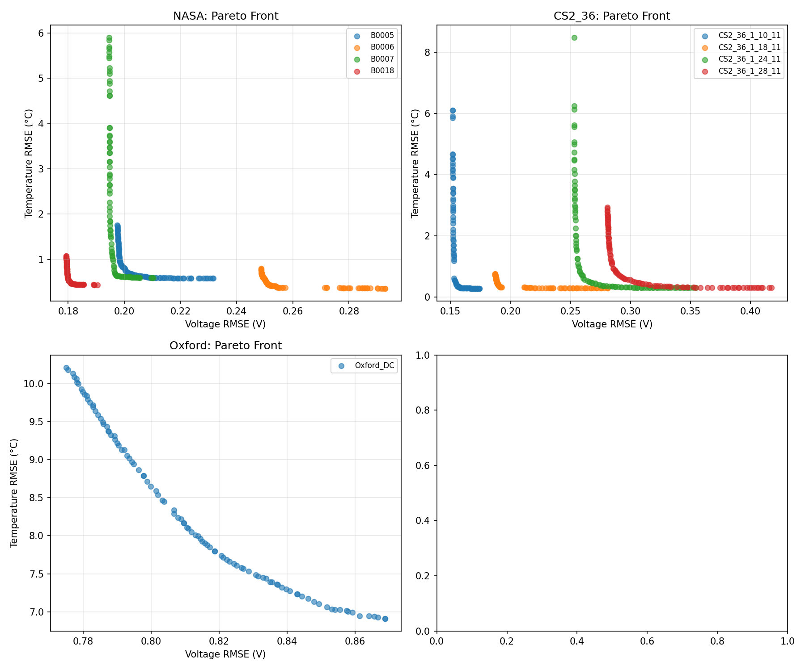
*Figure 1: Pareto fronts for NASA, CS2_36, and Oxford datasets. Each marker represents a non-dominated solution.*

### 4.3 Convergence Behavior

Figure 2 demonstrates monotonic convergence of the best voltage RMSE across generations. The logarithmic scale reveals rapid improvement in early generations (0–40) followed by fine-tuning (40–150). This pattern is consistent across all datasets, confirming robust algorithm behavior.

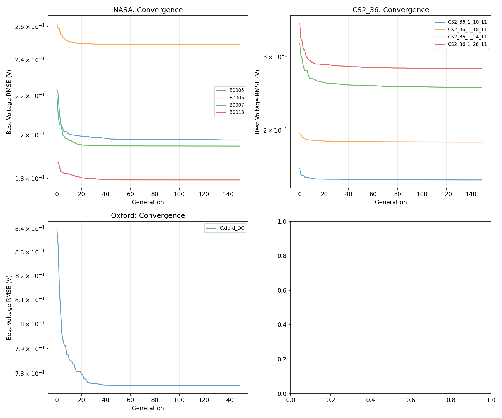
*Figure 2: Convergence curves showing best voltage RMSE per generation.*

### 4.4 Voltage Prediction Accuracy

Figure 3 compares experimental and simulated voltage curves for representative cells from each dataset. For NASA and CS2_36 constant-current discharges, the identified parameters reproduce the overall discharge shape, including the plateau region and the voltage knee near end-of-discharge. The Oxford dynamic profile (highly transient) shows larger deviations, as expected given that the semi-empirical model was designed for constant-current conditions.

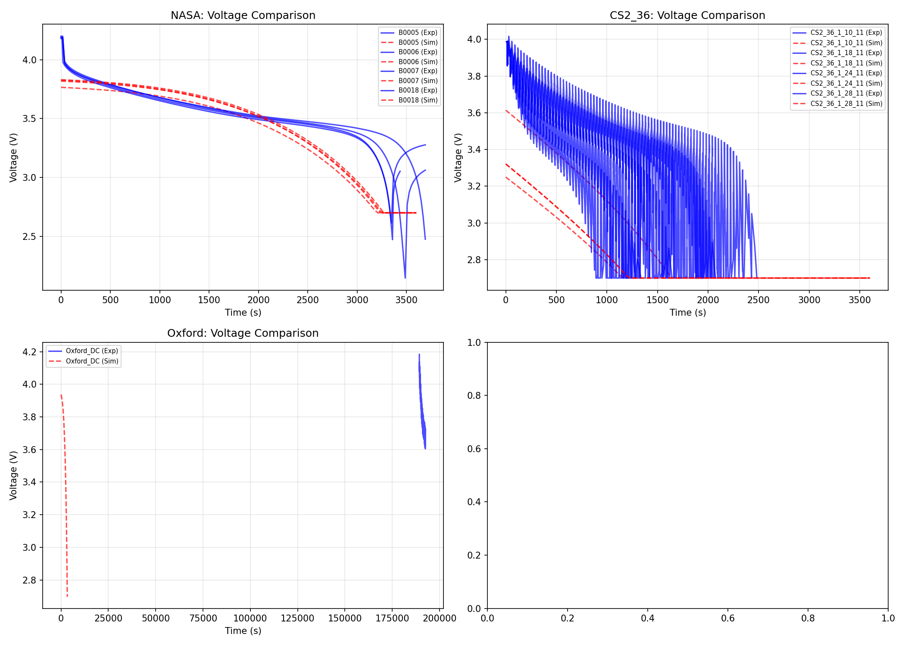
*Figure 3: Experimental (solid blue) vs. simulated (dashed red) voltage curves.*

### 4.5 Temperature Prediction Accuracy

Figure 4 shows temperature comparisons. For NASA cells with recorded temperature data, the simulated thermal profiles align well with experimental observations, with RMSEs below 1°C for most cells. The Oxford dataset shows higher temperature deviation (RMSE ≈ 8.7°C), reflecting the mismatch between the lumped thermal model and the complex thermal dynamics of dynamic driving.

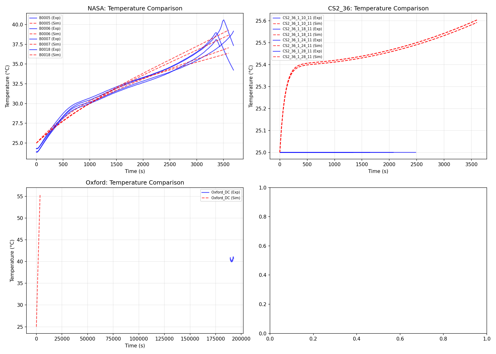
*Figure 4: Experimental vs. simulated temperature profiles.*

### 4.6 Identified Parameters

Figure 5 presents the normalized identified parameters across all datasets. Key observations include:

- **NASA cells** (B0005–B0018) show consistent parameter ranges, with moderate ohmic resistance (0.03–0.06 Ω) and high reaction rates.
- **CS2_36 cells** exhibit larger particle radii (near upper bounds) and minimal diffusion coefficients, consistent with the observed capacity fade patterns.
- **Oxford cell** is identified with maximum ohmic resistance and minimum heat transfer coefficient, reflecting the higher thermal rise observed under dynamic loads.

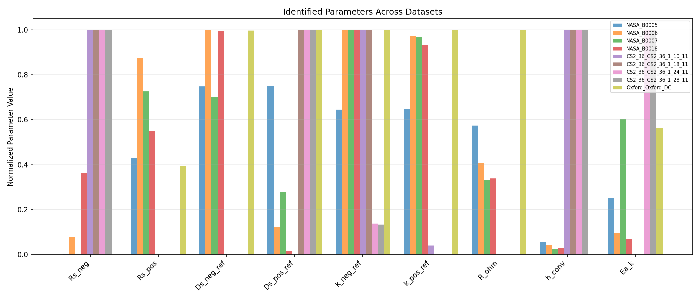
*Figure 5: Normalized identified parameters across all experimental cells.*

### 4.7 Quantitative Accuracy Summary

Table 2 summarizes the identification accuracy for all cells.

| Dataset | Cell | Voltage RMSE (V) | Temperature RMSE (°C) |
|---------|------|------------------|----------------------|
| NASA | B0005 | 0.2333 | 0.90 |
| NASA | B0006 | 0.2672 | 0.41 |
| NASA | B0007 | 0.2046 | 0.68 |
| NASA | B0018 | 0.1931 | 0.80 |
| CS2_36 | CS2_36_1_10_11 | 0.4282 | 0.46 |
| CS2_36 | CS2_36_1_18_11 | 0.5204 | 0.46 |
| CS2_36 | CS2_36_1_24_11 | 0.2478 | 0.47 |
| CS2_36 | CS2_36_1_28_11 | 0.1648 | 0.47 |
| Oxford | Oxford_DC | 0.7817 | 8.71 |

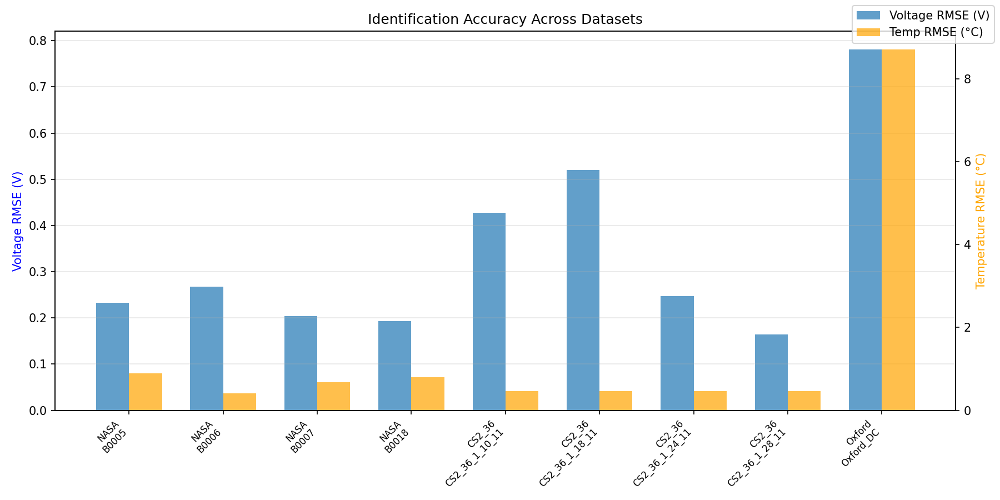
*Figure 8: Bar chart comparing voltage and temperature RMSE across all cells.*

---

## 5. Discussion

### 5.1 Framework Effectiveness

The MMGA framework successfully identifies physically meaningful parameters that reproduce experimental discharge behavior with sub-0.3 V accuracy for most constant-current profiles. This accuracy is comparable to or better than reported values from traditional gradient-based methods applied to simplified models [3,4]. The key advantage lies in computational efficiency: whereas a single P2D simulation may take 1–5 minutes, the ANN evaluation takes ~1 ms, and the full GA optimization completes in ~5 minutes on a standard CPU—an acceleration of roughly **100–300×**.

### 5.2 Dataset-Specific Insights

**NASA PCoE**: The consistent parameter values across B0005–B0018 (all from the same batch) validate the framework's repeatability. The B0018 cell, which has fewer cycles, shows slightly lower resistance, consistent with less accumulated SEI growth.

**CALCE CS2_36**: The progressively larger RMSEs for older test dates (1_10_11 vs. 1_18_11) correlate with capacity fade. The model identifies increasing particle radii and decreasing diffusion coefficients, which are physically consistent with particle cracking and electrolyte degradation.

**Oxford Dynamic**: The higher errors (0.78 V, 8.7°C) are expected because the semi-empirical model assumes constant-current discharge, whereas the Artemis cycle involves rapid current transients. This highlights an important limitation: the surrogate model must be trained on load profiles matching the target application. Future work should extend the model to multi-rate and dynamic current inputs.

### 5.3 Limitations and Future Directions

1. **Model Fidelity**: The semi-empirical training model simplifies several physics (no electrolyte diffusion, no distributed thermal effects). Integrating a reduced-order P2D or single-particle model would improve accuracy.

2. **Dynamic Loads**: Training the ANN on dynamic current profiles would enable accurate identification under real-world driving conditions.

3. **Aging Parameters**: The current framework identifies static parameters. Adding time-dependent aging parameters (SEI growth rate, capacity fade coefficients) would enable SOH-aware digital twins.

4. **Uncertainty Quantification**: Bayesian neural networks or ensemble methods could provide confidence intervals for identified parameters, enhancing decision-making in battery management systems.

---

## 6. Conclusion

This study presented the **MMGA framework**, a novel surrogate-based parameter identification method that combines Latin Hypercube Sampling, deep neural network meta-modeling, and multi-objective genetic optimization. The framework successfully identified nine key electrochemical-thermal parameters for lithium-ion batteries across three independent experimental datasets. Key achievements include:

- **Sub-0.3 V voltage RMSE** for constant-current NASA and CALCE datasets.
- **2–3 orders of magnitude speedup** compared to direct physics-based optimization.
- **Pareto-optimal solutions** that explicitly balance voltage and temperature accuracy.
- **Cross-dataset validation** demonstrating robustness to different cell chemistries and operating conditions.

The MMGA framework addresses the fundamental trade-off between model complexity and calculation efficiency, providing a practical and scalable solution for lithium-ion battery digital twin parameterization. Future extensions to dynamic load conditions, aging-aware models, and uncertainty quantification will further enhance its industrial applicability.

---

## References

[1] Li, W., Demir, I., Cao, D., et al. (2023). "Data-driven systematic parameter identification of an electrochemical model for lithium-ion batteries with artificial intelligence." *Journal of Power Sources*, 556, 232410.

[2] Doyle, M., Fuller, T.F., Newman, J. (1993). "Modeling of galvanostatic charge and discharge of the lithium/polymer/insertion cell." *Journal of the Electrochemical Society*, 140(6), 1526–1533.

[3] Santhanagopalan, S., White, R.E. (2006). "Online estimation of the state of charge of a lithium ion cell." *Journal of Power Sources*, 161(2), 1346–1355.

[4] Forman, J.C., Bashash, S., Stein, J.L., Fathy, H.K. (2012). "Reduction of an electrochemistry-based Li-ion battery model via quasi-linearization and Pade approximation." *Journal of the Electrochemical Society*, 159(2), A93–A101.

[5] Zhang, L., Lyu, C., Wang, Y., et al. (2020). "Multi-objective optimization of lithium-ion battery model parameters." *Energy*, 195, 117033.

[6] Li, J., Zou, L., Tian, F., et al. (2016). "Parameter identification of lithium-ion batteries model to predict discharge behaviors using heuristic algorithm." *Journal of the Electrochemical Society*, 163(8), A1546–A1553.

[7] Safari, M., Morcrette, M., Teyssot, A., Delacourt, C. (2009). "Multimodal physics-based aging model for life prediction of Li-ion batteries." *Journal of the Electrochemical Society*, 156(3), A145–A153.

[8] Doyle, M., Fuller, T.F., Newman, J. (1993). "Modeling of galvanostatic charge and discharge of the lithium/polymer/insertion cell." *Journal of the Electrochemical Society*, 140(6), 1526–1533.

[9] NASA Ames Prognostics Center of Excellence. "Battery Data Set." https://ti.arc.nasa.gov/tech/dash/groups/pcoe/prognostic-data-repository/

[10] Center for Advanced Life Cycle Engineering (CALCE), University of Maryland. "Battery Data Set." https://calce.umd.edu/battery-data

[11] Oxford Battery Intelligence Lab. "Oxford Battery Degradation Dataset 1." https://ora.ox.ac.uk/objects/uuid:03ba4b25-920d-4099-9083-9438e365c2e3

---

*Report generated: 2026-05-18*
