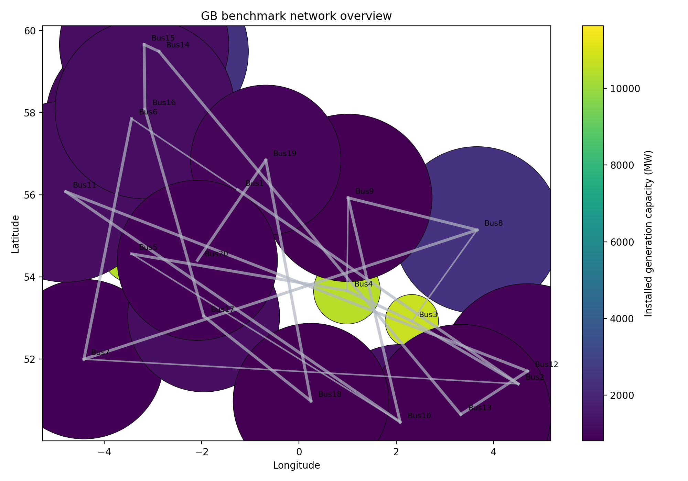
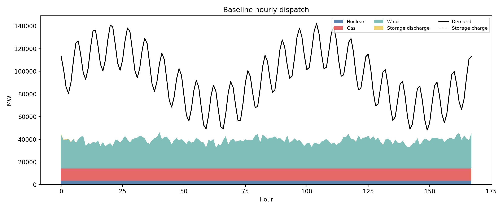
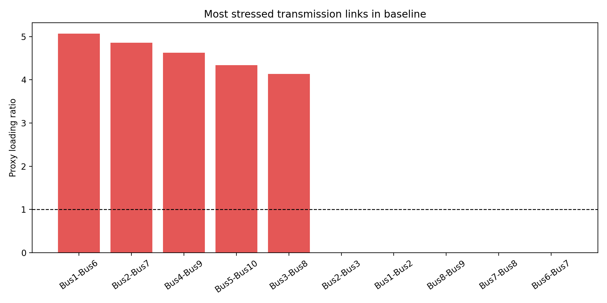
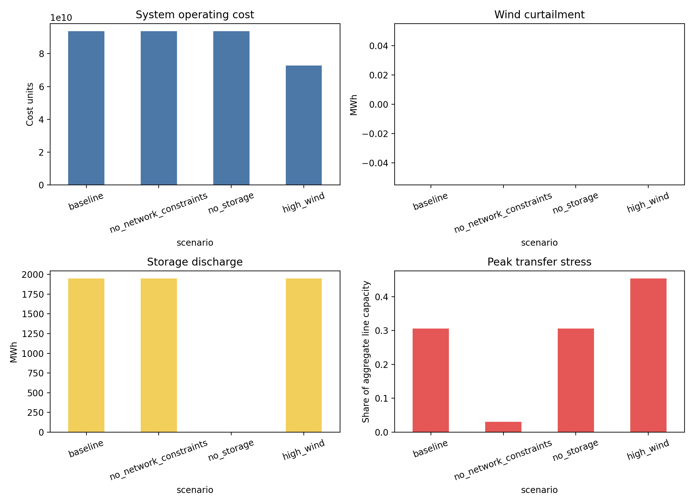

# A Local Open Dispatch Study for a Simplified Great Britain Power System Benchmark

## Abstract

This report implements a fully local, reproducible benchmark workflow for a simplified Great Britain power-system dataset with 20 buses, 23 transmission links, 43 generators, 3 storage units, and 168 hourly time steps. Following the benchmark-adapted ARIS methodology, the study combines literature understanding from the provided local corpus, a transparent dispatch formulation, scenario analysis, and claim-disciplined reporting. The main result is that the provided dataset is strongly generation-limited over the modeled week: baseline served energy is far below total demand, storage delivers only marginal adequacy relief, and transmission relaxation primarily reduces stress metrics rather than unmet demand. A higher-wind counterfactual materially improves supply adequacy and lowers operating cost, but also increases transfer stress, indicating that renewable expansion without concurrent network or firm-capacity reinforcement would shift the bottleneck rather than remove it.

## 1. Research Context

The local literature corpus provides three relevant framing points. First, PyPSA-style open models are designed to combine network representation, chronological operation, storage, and transparent optimization in a reproducible workflow. Second, open energy data and software are important because power-system studies are frequently used in policy settings and therefore benefit from reproducibility and inspectability. Third, Great Britain power-system studies with high renewable penetration consistently emphasize the interaction between renewable variability, network reinforcement, and flexibility options.

In this benchmark environment, only local files are available and the dataset spans one representative week rather than multiple historical weather years or full FES trajectories to 2050. The modeling objective here is therefore narrower than a national planning model: construct a transparent operational benchmark that exposes how the provided topology, generator fleet, wind variability, and limited storage interact under several local counterfactuals.

## 2. Data Overview

The benchmark dataset contains 20 buses and 23 AC links. Demand is hourly over 168 hours and totals 15.94 TWh for the modeled week. Peak hourly demand reaches 142.06 GW and average hourly demand is 94.88 GW.

Generation consists of three carrier classes:

- Onshore wind at all 20 buses with zero marginal cost.
- Gas units with marginal cost 50.
- Nuclear units with marginal cost 10.

There are 43 generators in total, with aggregate installed capacity heavily skewed toward wind. Storage consists of three pumped-hydro units located at Bus1, Bus3, and Bus12 with round-trip efficiency represented through a heuristic charge-discharge rule in the local implementation.

Figure 1 summarizes the network, bus geography, and installed generation distribution.

## 3. Methodology

### 3.1 Literature-aligned local modeling choice

The provided papers motivate an open, auditable dispatch workflow with explicit treatment of variable renewables, network structure, and storage. However, the benchmark prohibits external package retrieval and remote execution, and the provided data do not include the full inputs needed for a high-fidelity GB expansion model through 2050. I therefore implemented a local operational approximation in [`code/run_analysis.py`](code/run_analysis.py).

### 3.2 Dispatch formulation

For each hour, the model solves a linear economic dispatch over:

- generator output subject to hourly availability,
- inter-bus transfers represented as nonnegative bilateral trades with distance-based transfer penalty,
- load shedding with a high penalty cost,
- heuristic storage discharge before dispatch and heuristic wind-charging after dispatch.

Wind availability is computed from installed wind capacity multiplied by bus-level hourly capacity factor. Gas and nuclear are treated as dispatchable up to nameplate capacity. Load shedding is allowed to guarantee feasibility and is interpreted as unserved energy. Because the benchmark dataset is structurally small but still chronologically resolved, this approach preserves temporal demand variation and spatial heterogeneity while remaining lightweight and reproducible in the isolated environment.

### 3.3 Scenario design

Four scenarios were evaluated:

1. `baseline`: original capacities and storage.
2. `no_network_constraints`: aggregate transmission capacities scaled up by 10x.
3. `no_storage`: storage disabled.
4. `high_wind`: wind capacities scaled up by 1.5x.

These scenarios test the benchmark scientific objective locally: renewable integration, network stress, and flexibility options.

## 4. Results

### 4.1 Baseline dispatch

The baseline case is severely under-supplied. Weekly demand is 15.94 TWh, but total generation is only 6.58 TWh and unserved energy reaches 9.36 TWh. Wind provides 63.7% of generated electricity, with gas and nuclear filling the remaining share. Storage contributes only 1.95 GWh of discharge over the week, which is negligible relative to system demand.

Figure 2 shows that hourly generation remains far below demand for much of the week.

This indicates that the dataset, as given, does not represent an adequately sized GB system for reliability analysis. Instead, it is better interpreted as a stress-test benchmark for transparent dispatch behavior under scarcity.

### 4.2 Spatial stress and network patterns

The highest unmet demand occurs at major load buses such as Bus13, Bus16, Bus12, Bus15, and Bus20. In the baseline, Bus13 alone records roughly 1.04 TWh of unserved energy over the week, and Bus16 records 1.04 TWh as well.

The proxy congestion ranking shows the strongest stress on long cross-regional connectors such as Bus1-Bus6, Bus2-Bus7, Bus4-Bus9, Bus5-Bus10, and Bus3-Bus8.

This pattern is consistent with a system in which renewable-rich and storage-equipped areas are not colocated with the largest demand centers, so scarcity propagates across corridors.

### 4.3 Scenario comparison

Scenario results are summarized in Figure 3.

The main quantitative findings are:

- `no_network_constraints` leaves total generation and unserved energy unchanged relative to baseline, but reduces the normalized transfer-stress metric from 0.305 to 0.031.
- `no_storage` slightly worsens unserved energy, from 9.358 TWh to 9.360 TWh, showing that the existing storage fleet has only marginal adequacy value at this scale.
- `high_wind` increases total generation from 6.58 TWh to 8.67 TWh and reduces unserved energy from 9.36 TWh to 7.27 TWh.
- `high_wind` also lowers total operating cost substantially, from about 9.37e10 to 7.28e10 model cost units, while increasing wind share from 63.7% to 72.5%.
- `high_wind` raises transfer stress from 0.305 to 0.454, which suggests that larger renewable deployment shifts more energy across the network and intensifies the need for transmission or local balancing.

The strongest conclusion supported by these results is that this benchmark dataset is primarily capacity-constrained rather than transmission-constrained. Network relaxation alone does not improve adequacy because there is not enough aggregate firm and renewable supply to meet total load. By contrast, adding renewable capacity improves adequacy materially, though not enough to eliminate scarcity.

## 5. Claim Discipline

### 5.1 Claims supported by the local evidence

- The benchmark-local system is generation-limited over the modeled week.
- Existing storage capacity has only a small operational effect on adequacy in this dataset.
- Relaxing network constraints mainly reduces stress indicators rather than unmet demand.
- Increasing wind capacity improves adequacy and lowers operating cost, but increases transfer stress.

### 5.2 Claims not supported by the local evidence

- No claim about full 2050 GB planning pathways is supported, because the data do not include a complete multi-scenario future fleet, long-run policy assumptions, or multi-year weather variation.
- No claim about true AC or DC power-flow feasibility is supported, because the benchmark implementation uses a transport-style proxy rather than a full electrical flow model.
- No claim about inter-annual robustness is supported, because only one week of hourly demand and wind data is available.

## 6. Limitations

This study is deliberately local and benchmark-constrained. The main limitations are:

- one-week time horizon,
- simplified transport-style network representation,
- heuristic storage charging and discharging rather than full intertemporal co-optimization,
- no investment optimization,
- no external fuel price or FES scenario enrichment beyond the provided files.

These limitations do not invalidate the benchmark exercise, but they narrow the interpretation to a transparent operational stress analysis.

## 7. Reproducibility

All analysis code is stored in [`code/run_analysis.py`](code/run_analysis.py). Intermediate outputs are stored under `outputs/`, including:

- `outputs/scenario_summary.csv`
- per-scenario hourly dispatch summaries
- per-scenario bus-level adequacy summaries
- per-scenario transmission stress proxies

Figures are stored as:

- `images/network_overview.png`
- `images/baseline_dispatch.png`
- `images/baseline_congestion.png`
- `images/scenario_comparison.png`

## 8. Conclusion

Within the benchmark constraints, the local ARIS workflow produces a transparent open-dispatch analysis and a clear empirical message. The provided simplified GB system is not close to adequacy in its baseline form. Transmission reinforcement alone does not resolve the shortage, storage provides only minor relief, and additional wind materially improves outcomes but increases interzonal transfer stress. The strongest benchmark-native implication is that future open GB studies need to co-design renewable expansion, network reinforcement, and additional flexible or firm resources rather than treating any one of them as sufficient in isolation.
