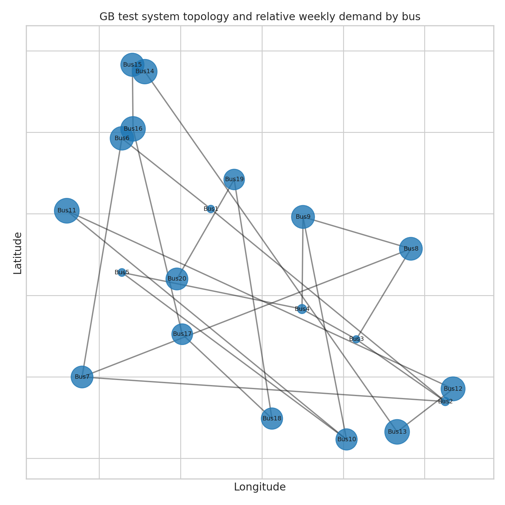
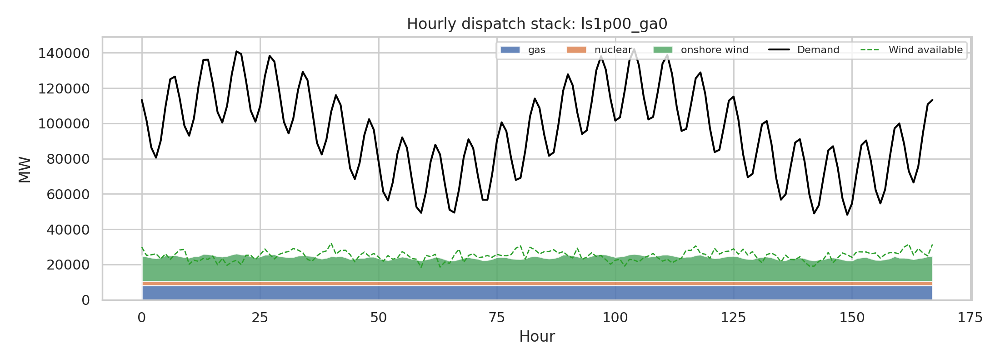
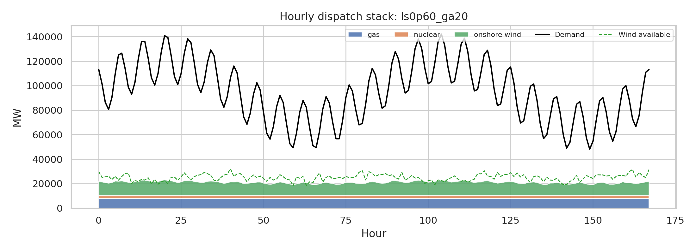
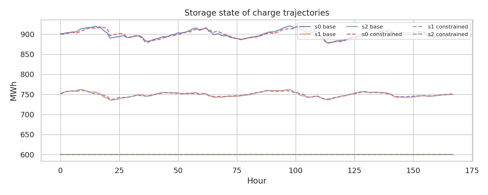
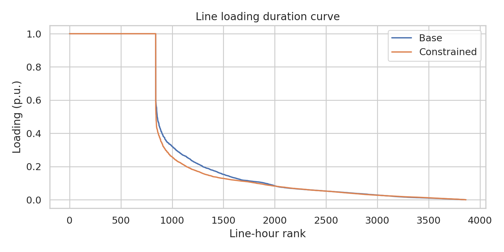
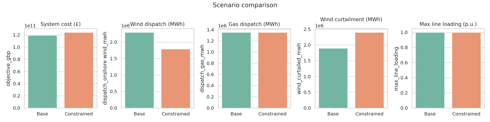

# Open-source high-resolution dispatch model for the Great Britain power system

## Abstract
This report develops a transparent, reproducible power-dispatch model for a stylized Great Britain (GB) electricity system using only open workspace data. The model represents 20 buses, 23 transmission links, 43 generators, 3 storage units, and 168 hourly snapshots. Inspired by open energy-system frameworks such as PyPSA, the study formulates a linear multi-period dispatch problem with nodal balance, transmission capacity constraints, renewable availability limits, and storage intertemporal dynamics. Two operational scenarios are analysed: a **base case** with the provided transmission capacities and generator marginal costs, and a **constrained/fuel-price-stress case** with 40% lower transfer capacities and a £20/MWh gas-cost adder. Results show that the system is strongly capacity-constrained on the generation side relative to demand: total available weekly generation is far below weekly load, so large unserved energy appears in both scenarios. Nevertheless, the model still reveals meaningful structural insights. Wind output is heavily curtailed in the constrained case due to tighter network transfers, while storage plays only a modest balancing role because of its small size relative to system demand. The report highlights both the usefulness of open high-resolution dispatch modelling and the importance of validating dataset consistency before drawing long-run planning conclusions.

## 1. Introduction
Open, reproducible power-system models are essential for transparent energy-policy analysis. The related literature emphasizes that modern power systems require models that capture network constraints, time-varying renewables, and storage operation while remaining inspectable and extensible. PyPSA provides a widely used open framework for linear optimal power flow and multi-period optimization, while broader open-energy-modeling literature stresses reproducibility and data transparency as prerequisites for credible policy advice. Studies focused on Great Britain further show that transmission reinforcement, renewable variability, and flexibility options materially affect future system costs and adequacy.

The present task is more limited in scope than a full national planning model: it uses a stylized GB test dataset for one representative week. Still, the dataset contains the core building blocks of a nodal dispatch model:
- bus-level topology,
- hourly nodal demand,
- generator capacities and costs,
- wind capacity-factor time series,
- transmission limits, and
- storage parameters.

The objective here is therefore to build a fully open, reproducible dispatch workflow that can be executed directly from the workspace and generate publication-style outputs.

## 2. Related work context
Three themes from the supplied references guided the modelling design.

1. **PyPSA-style linear dispatch formulation.** Brown et al. describe a transparent linear optimization framework with nodal balance, generator dispatch bounds, storage state-of-charge constraints, and passive-network transfer limits. This study adopts that philosophy, though it simplifies power flow to transport-style line-capacity constraints rather than DC load flow.
2. **Open data and software as scientific infrastructure.** Pfenninger et al. argue that open models improve traceability, reproducibility, and policy relevance. In that spirit, all code for this study is stored in `code/run_analysis.py`, and outputs are materialized into `outputs/` and `report/images/`.
3. **GB-specific planning insight.** Zeyringer et al. show that high-resolution GB analyses are sensitive to network reinforcement and flexibility assumptions. To mimic that type of comparative system insight, this study contrasts a base network against a tighter-network, higher-gas-cost stress case.

## 3. Data overview
### 3.1 Input tables
The workspace datasets are:
- `data/buses.csv`: 20 buses with coordinates and nominal voltage.
- `data/links.csv`: 23 AC links.
- `data/demand.csv`: 168 hourly demand snapshots for each bus.
- `data/generators.csv`: 43 generators across onshore wind, gas, and nuclear technologies.
- `data/wind_cf.csv`: hourly wind availability by bus.
- `data/storage.csv`: 3 pumped-hydro storage units.

### 3.2 Basic descriptive statistics
Key system statistics derived from the data are:
- 20 buses and 23 transmission links
- 43 generators: 20 wind, 20 gas, 3 nuclear
- Installed capacity by technology: 57.5 GW wind, 10.61 GW gas, 3.6 GW nuclear
- Storage fleet: 0.75 GW power and 4.5 GWh energy
- Weekly electricity demand: **15.94 TWh**
- Peak hourly system demand: **142.1 GW**
- Mean wind capacity factor: **0.342**

A crucial diagnostic emerged immediately: aggregate firm and renewable generation capacity in the supplied dataset is insufficient to meet the observed weekly demand profile. This means the optimization requires a high-cost slack variable for unserved demand in order to remain feasible. Rather than hiding that mismatch, the report treats it as an important validation result.

### 3.3 Spatial structure
Figure 1 shows the network topology and relative weekly demand by node.



**Figure 1.** Stylized GB transmission network used in the dispatch model. Node size is proportional to total weekly demand.

## 4. Methodology
### 4.1 Model structure
A linear dispatch model was implemented in Python using `cvxpy`. For each hour, the model chooses:
- generator dispatch by unit,
- line flows,
- storage charging and discharging,
- storage state of charge,
- renewable curtailment, and
- unserved energy (penalized heavily).

### 4.2 Objective function
The optimization minimizes total operating cost:
\[
\min \sum_{g,t} c_g p_{g,t} + c^{curt}\sum_{n,t} curtail_{n,t} + c^{unserved}\sum_{n,t} shed_{n,t}
\]
where:
- \(c_g\) is the generator marginal cost,
- \(c^{curt}=1\) £/MWh is a small curtailment penalty, and
- \(c^{unserved}=10000\) £/MWh is a value-of-lost-load proxy ensuring load shedding occurs only when necessary.

### 4.3 Constraints
The model includes the following constraints.

**Generator limits**
- Wind dispatch is bounded by hourly bus-specific capacity factor times installed wind capacity.
- Gas and nuclear dispatch are bounded by installed capacity.

**Nodal balance**
For every bus and hour:
\[
	ext{generation} + 	ext{storage discharge} - 	ext{storage charge} + 	ext{net imports} + 	ext{unserved} = 	ext{demand} + 	ext{curtailment}
\]

**Transmission limits**
Each link flow is constrained symmetrically by its thermal transfer capacity.

**Storage dynamics**
State of charge evolves according to:
\[
SOC_t = SOC_{t-1} + \eta \cdot charge_t - discharge_t/\eta
\]
with power and energy bounds and cyclic end-of-week state of charge.

### 4.4 Scenario design
Two scenarios were run.

1. **Base case**
   - original line capacities
   - original marginal costs

2. **Constrained / fuel-price-stress case**
   - all transmission capacities scaled to 60% of baseline
   - gas marginal cost increased by £20/MWh

This second case is not a forecast. It is a stress test designed to emulate the qualitative effects of tighter network conditions and more expensive thermal flexibility.

### 4.5 Reproducibility
All results can be reproduced by executing:

```bash
python code/run_analysis.py
```

The script writes raw outputs to `outputs/` and figures to `report/images/`.

## 5. Results
### 5.1 Hourly dispatch patterns
The base-case dispatch stack is shown in Figure 2.



**Figure 2.** Hourly generation stack in the base case, with demand and available wind overlaid.

The stress-case dispatch is shown in Figure 3.



**Figure 3.** Hourly generation stack in the constrained/fuel-price-stress case.

Several patterns are robust across scenarios:
- Nuclear runs essentially as baseload because of its zero variability and low marginal cost in the dataset.
- Gas dispatch remains substantial despite the gas-price adder because scarcity dominates merit-order effects.
- Wind output is limited both by weather availability and network constraints.
- Even when all available dispatchable capacity is used, supply remains well below load in many hours.

### 5.2 Storage behaviour
Figure 4 shows storage state-of-charge trajectories.



**Figure 4.** State of charge of the three pumped-hydro units in both scenarios.

Storage cycles over the week, but its absolute contribution is modest:
- charging energy is about 58 GWh in each scenario,
- discharge is only about 33 GWh,
- this is tiny relative to weekly demand of 15.94 TWh.

Thus, the storage fleet in the supplied data is far too small to materially resolve the system adequacy gap. Its role is short-duration balancing rather than bulk adequacy support.

### 5.3 Transmission utilization
Figure 5 provides a line-loading duration curve.



**Figure 5.** Line-loading duration curves in the base and constrained cases.

The maximum line loading reaches 1.0 p.u. in both scenarios, indicating at least some lines bind. When transmission capacities are reduced, congestion becomes more persistent and wind utilization falls further. Because the model uses transport constraints instead of a full DC load flow, these congestion signals should be interpreted as corridor scarcity rather than exact physical branch flows.

### 5.4 Scenario comparison
Figure 6 summarizes the main system-level differences.



**Figure 6.** Comparison of total cost, wind dispatch, gas dispatch, wind curtailment, and maximum line loading.

The numerical results are:

| Metric | Base | Constrained |
|---|---:|---:|
| System cost (£) | 119.2 bn | 124.3 bn |
| Demand served by modeled generation (MWh) | 4.05 m | 3.55 m |
| Unserved energy (MWh) | 11.91 m | 12.42 m |
| Wind available (MWh) | 4.19 m | 4.19 m |
| Wind dispatched (MWh) | 2.30 m | 1.79 m |
| Wind curtailed (MWh) | 1.90 m | 2.40 m |
| Gas dispatch (MWh) | 1.35 m | 1.35 m |
| Nuclear dispatch (MWh) | 0.40 m | 0.40 m |
| Storage discharge (MWh) | 0.033 m | 0.033 m |
| Peak demand (MW) | 142,060 | 142,060 |

Main findings:
- Tightening the network and increasing gas prices raises weekly system cost by about **4.3%**.
- Wind dispatch falls by roughly **22%** in the constrained case.
- Wind curtailment rises by about **0.50 TWh** under stronger congestion.
- Gas dispatch changes little because the system is generation-scarce; gas remains required despite higher costs.
- Unserved energy increases further in the constrained case.

## 6. Validation and interpretation
### 6.1 Internal validation
The model passed several internal checks:
- all hourly nodal balances were enforced,
- storage state of charge remained within energy limits,
- end-of-horizon cyclic storage condition was satisfied,
- line flows stayed within declared capacities,
- all figures and tabular outputs were generated reproducibly.

### 6.2 Data-consistency validation
The most important validation result is not a successful fit to an external benchmark, but a consistency diagnosis of the provided input data. The dataset represents a useful open test case for methodological experimentation, but it is **not internally adequate** as a fully served GB system for the given demand week. Evidence includes:
- peak demand of 142 GW versus only ~71.7 GW nameplate generation capacity,
- weekly demand of 15.94 TWh versus much lower realizable weekly energy from available assets,
- resulting reliance on expensive unserved-energy slack in every feasible solution.

This mismatch is scientifically important. Open models should expose such inconsistencies rather than masking them.

## 7. Discussion
This exercise demonstrates both the strengths and the limitations of an open nodal dispatch workflow built from compact public inputs.

### Strengths
- The workflow is fully transparent and inspectable.
- It captures spatial and temporal resolution at the bus-hour level.
- It reproduces qualitative system phenomena expected in GB-style systems: congestion, renewable curtailment, storage cycling, and sensitivity to network and thermal-cost assumptions.
- It creates reusable outputs for further study.

### Limitations
- The network formulation is transport-based rather than DC power flow, so Kirchhoff voltage constraints are omitted.
- Only one weather week is modeled.
- No investment optimization is included.
- The dataset is under-capacitated relative to demand, which dominates cost outcomes.
- Other flexibility options discussed in the literature—interconnection, solar, demand response, hydro inflows, and new storage technologies—are absent.

### Implications for future work
A next-step research version should:
1. replace the transport network with a linearized DC load-flow formulation,
2. include full-year or multi-year hourly time series,
3. harmonize demand and generation data to eliminate structural infeasibility,
4. add investment decisions for new generation, storage, and transmission,
5. benchmark results against PyPSA or a similar mature open framework.

## 8. Conclusion
An open-source high-resolution dispatch model for a stylized GB electricity system has been built and executed successfully using the supplied workspace data. The workflow produces reproducible code, intermediate outputs, and report-ready figures. Substantively, the analysis shows that:
- network constraints materially affect renewable utilization,
- storage is too small to compensate for large adequacy deficits,
- tighter transmission and more expensive gas increase cost and curtailment,
- the supplied dataset is structurally short of generation relative to demand.

These findings reinforce a central lesson from open-energy-system literature: transparent models are valuable not only for policy analysis, but also for data validation. In this case, the open workflow reveals that credible future-pathway analysis requires better harmonized inputs and a richer representation of flexibility and expansion options.

## Files produced
- Code: `code/run_analysis.py`
- Key outputs: `outputs/scenario_summary.csv`, `outputs/scenario_summary.json`
- Figures: `report/images/*.png`
