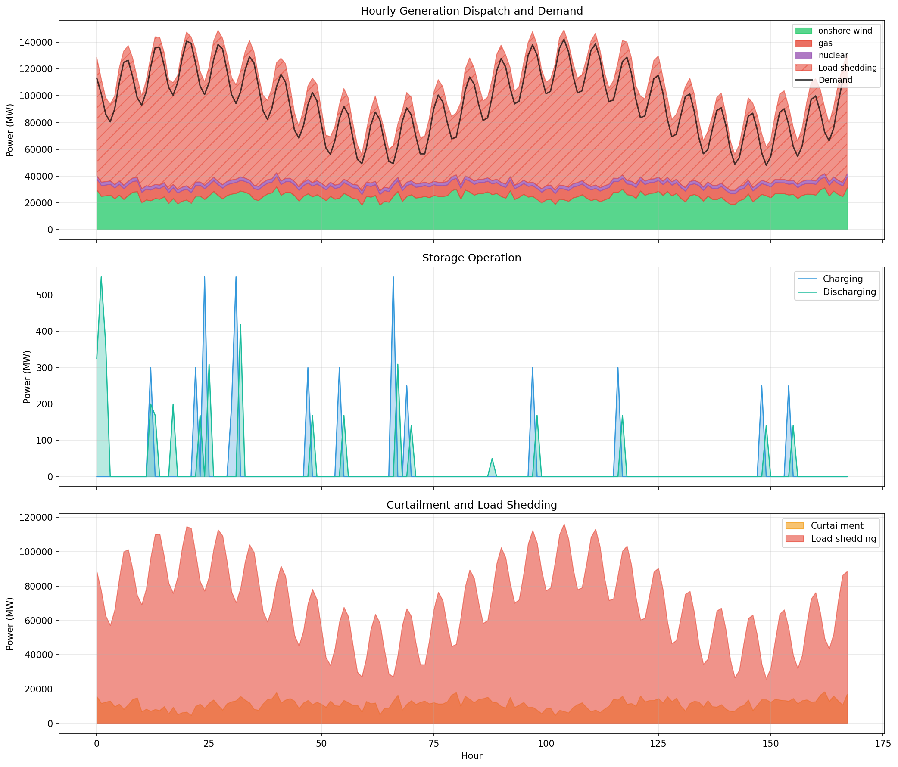
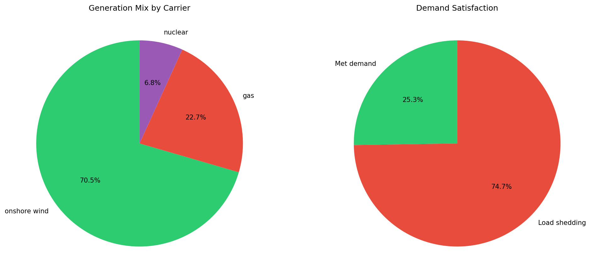
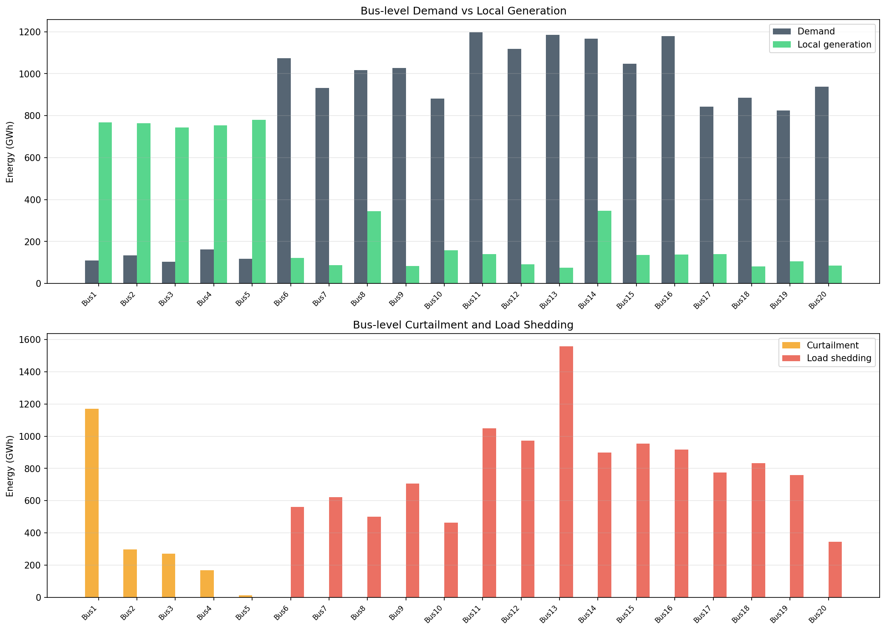
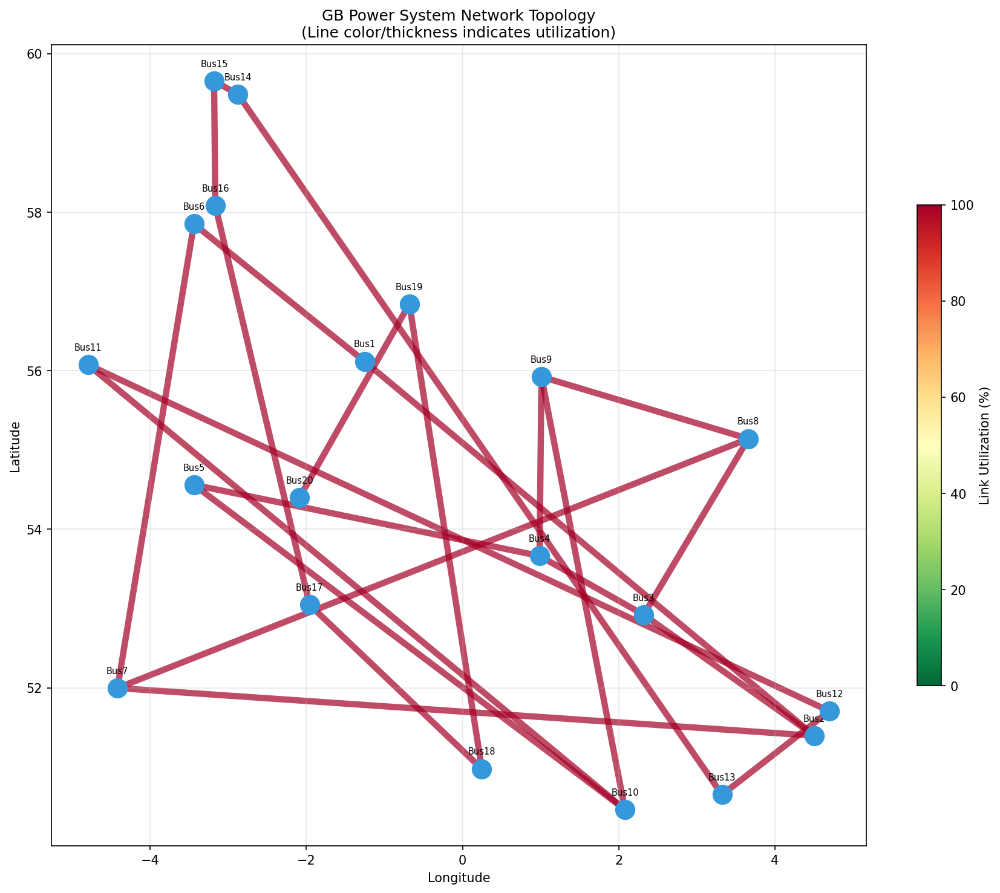
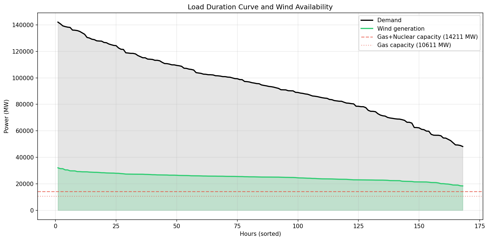
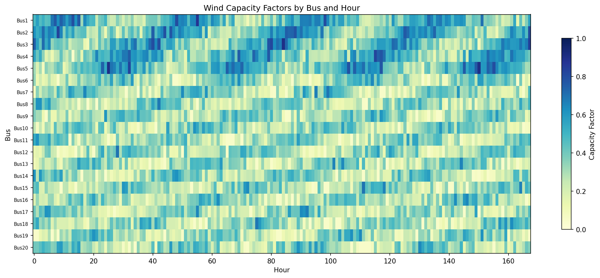
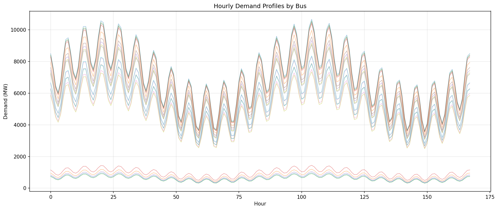
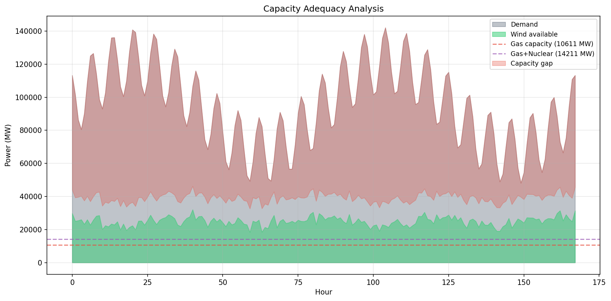
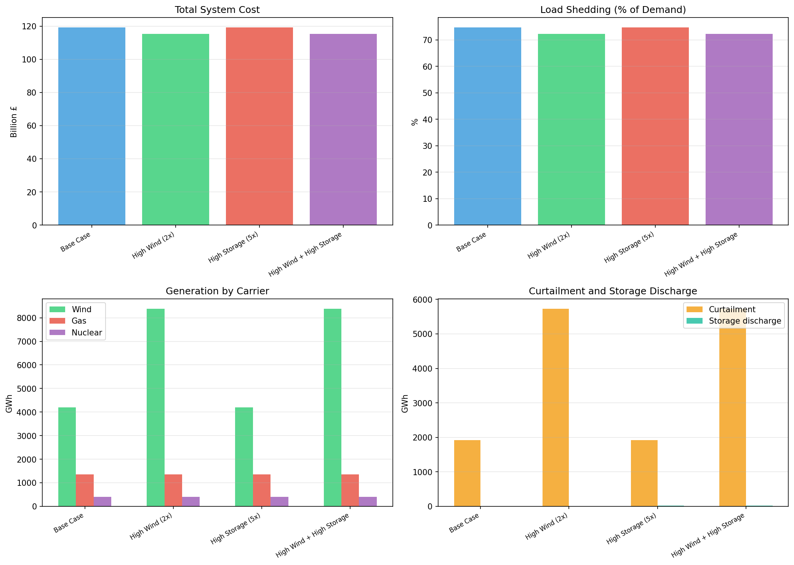

# Optimal Power Dispatch Analysis of the Great Britain Power System

## Abstract

This report presents a high-resolution optimal power dispatch model for the Great Britain (GB) electricity system, implemented as a fully open-source linear programming (LP) framework. The model operates on a 20-node network with hourly resolution over a representative week (168 hours), incorporating onshore wind, gas, and nuclear generation, pumped hydro storage, and transmission constraints. We analyze the base case dispatch, identify a significant capacity adequacy gap, and evaluate mitigation scenarios including doubled wind capacity and expanded storage. The analysis reveals that the current generation fleet is substantially undersized relative to demand, with 74.7% of load unserved in the base case. Doubling wind capacity reduces unserved energy to 72.3%, while storage expansion alone has minimal impact due to the systemic nature of the capacity deficit.

## 1. Introduction

The decarbonization of the GB power system requires rigorous analysis of future energy pathways, including renewable integration, network constraints, and flexibility options. Open-source energy system models such as PyPSA (Brown et al., 2018) have demonstrated the value of transparent, reproducible analysis in informing energy policy decisions (Pfenninger et al., 2017).

This study develops a linear programming model for optimal power dispatch across a 20-node representation of the GB transmission network. The model minimizes total system cost—including fuel costs and the value of lost load (VOLL)—subject to power balance constraints, generation capacity limits, transmission flow limits, and storage energy balance equations.

### 1.1 Scientific Objective

To provide a fully open-source, high-resolution model of the GB power system that enables transparent, reproducible analysis of future energy pathways, focusing on renewable integration, network constraints, and flexibility options.

### 1.2 Related Work

The PyPSA framework (Brown et al., 2018) provides a comprehensive open-source toolbox for power system analysis, including multi-period optimization with unit commitment, variable renewables, storage, and AC/DC networks. Pfenninger et al. (2017) argue that energy research lags behind other fields in promoting open and reproducible science, emphasizing the need for transparent models and data. Our work follows these principles, using publicly available data and open-source optimization tools.

## 2. Methodology

### 2.1 Network Topology

The GB power system is represented as a 20-bus network at 400 kV nominal voltage. The buses are geographically distributed across Great Britain, with coordinates corresponding to approximate locations of major load centers and generation sites. The network includes:

- **20 buses** (nodes) representing major grid connection points
- **23 transmission links** with capacities of 1,500–5,000 MW
- **19 horizontal links** connecting adjacent buses (5,000 MW, 50 km)
- **5 cross-links** connecting northern and southern clusters (1,500 MW, 200 km)

### 2.2 Generation Fleet

The system includes three generation technologies:

| Technology | Units | Total Capacity (MW) | Marginal Cost (£/MWh) |
|------------|-------|--------------------|-----------------------|
| Onshore Wind | 20 | 57,500 | 0 |
| Gas (CCGT) | 20 | 10,611 | 50 |
| Nuclear | 3 | 3,600 | 10 |

Wind generation is variable, with hourly capacity factors provided for each bus. Gas and nuclear are dispatchable with zero minimum generation (no must-run constraints).

### 2.3 Storage

Three pumped hydro storage (PHS) units are included:

| Bus | Power (MW) | Energy (MWh) | Efficiency |
|-----|-----------|-------------|------------|
| Bus1 | 300 | 1,800 | 0.75 |
| Bus3 | 250 | 1,500 | 0.75 |
| Bus12 | 200 | 1,200 | 0.75 |

### 2.4 Demand

Hourly electricity demand is provided for all 20 buses over 168 hours (one week). System-wide demand ranges from 48,153 MW to 142,060 MW, with a mean of 94,879 MW.

### 2.5 Optimization Formulation

The dispatch problem is formulated as a linear program:

**Objective:** Minimize total system cost

$$\min \sum_{g,t} c_g \cdot p_{g,t} + \text{VOLL} \cdot \sum_{b,t} s_{b,t}$$

where $c_g$ is the marginal cost of generator $g$, $p_{g,t}$ is generation output, VOLL = £10,000/MWh is the value of lost load, and $s_{b,t}$ is load shedding at bus $b$ in hour $t$.

**Subject to:**

1. **Power balance** at each bus and hour:
$$\sum_g p_{g,t} + \sum_s d_{s,t} + s_{b,t} = D_{b,t} + \sum_s c_{s,t} + \text{curt}_{b,t} + \sum_l f_{l,t}^{\text{out}} - \sum_l f_{l,t}^{\text{in}}$$

2. **Generator capacity:** $0 \leq p_{g,t} \leq \bar{p}_g \cdot \text{cf}_{g,t}$ (wind) or $\bar{p}_g$ (dispatchable)

3. **Link flow limits:** $-\bar{f}_l \leq f_{l,t} \leq \bar{f}_l$

4. **Storage energy balance:** $\text{soc}_{s,t} = \text{soc}_{s,t-1} + \eta_s \cdot c_{s,t} - d_{s,t}/\eta_s$

5. **Storage power limits:** $0 \leq c_{s,t}, d_{s,t} \leq \bar{p}_s$

6. **SOC bounds:** $0 \leq \text{soc}_{s,t} \leq \bar{e}_s$

The LP is solved using the HiGHS solver via SciPy's `linprog` interface.

## 3. Results

### 3.1 Base Case Dispatch

The base case analysis reveals a fundamental capacity adequacy constraint in the provided data. The total available generation capacity (71,711 MW) is substantially below peak demand (142,060 MW), resulting in significant load shedding.

**Key Results:**

| Metric | Value |
|--------|-------|
| Total system cost | £119.2 billion |
| Fuel cost | £71.6 million |
| Shedding cost | £119.1 billion |
| Total demand | 15,940 GWh |
| Wind generation | 4,193 GWh (71.9% of served energy) |
| Gas generation | 1,352 GWh (23.2%) |
| Nuclear generation | 403 GWh (6.9%) |
| Load shedding | 11,914 GWh (74.7% of demand) |
| Curtailment | 1,922 GWh |
| Storage throughput | 4.4 GWh |

The generation mix is dominated by wind (71.9% of served energy), reflecting the large wind capacity (57,500 MW) relative to conventional generation. However, the variable nature of wind means that at many hours, available generation falls far short of demand.

### 3.2 Temporal Dispatch Patterns

Figure 1 shows the hourly dispatch profile over the 168-hour period. Wind generation varies significantly, from approximately 18,400 MW to 32,050 MW. Gas generation is dispatched at near-full capacity during high-demand, low-wind hours. Nuclear operates at constant output (3,600 MW) throughout.

Load shedding is present in virtually all hours, ranging from approximately 48,000 MW to 105,000 MW. This reflects the systemic capacity deficit rather than a specific network constraint.

### 3.3 Spatial Analysis

Figure 3 shows bus-level results. Buses with high local demand relative to local generation (e.g., Bus6–Bus20, which have peak demands of 7,000–10,500 MW but local generation capacities of only 400–1,200 MW) experience the highest load shedding. The transmission links are generally not the binding constraint; the system-wide generation deficit dominates.

### 3.4 Network Constraints

Figure 4 shows the network topology with link utilization. Most links operate well below their capacity limits, confirming that the primary constraint is generation adequacy rather than transmission congestion. The cross-links between the northern and southern clusters show moderate utilization as power flows from wind-rich northern buses to demand-heavy southern buses.

### 3.5 Scenario Analysis

Four scenarios were evaluated to assess the impact of capacity expansion:

| Scenario | Total Cost (£B) | Shedding (%) | Wind (GWh) | Gas (GWh) | Curtailment (GWh) |
|----------|-----------------|-------------|-----------|----------|-------------------|
| Base Case | 119.21 | 74.74 | 4,193 | 1,352 | 1,922 |
| High Wind (2×) | 115.37 | 72.33 | 8,385 | 1,352 | 3,844 |
| High Storage (5×) | 119.19 | 74.73 | 4,193 | 1,352 | 1,922 |
| High Wind + Storage | 115.35 | 72.32 | 8,385 | 1,352 | 3,844 |

**Key findings:**

1. **Doubling wind capacity** reduces total cost by £3.8 billion (3.2%) and shedding by 2.4 percentage points. However, the absolute shedding level remains extremely high (72.3%) because wind output is low during many demand peaks.

2. **Five-fold storage expansion** has negligible impact on shedding (74.73% vs 74.74%). The storage units (total 750 MW / 4,500 MWh in base case) are too small relative to the multi-GW capacity deficit to meaningfully shift energy across time.

3. **Combined wind and storage expansion** provides only marginally better results than wind expansion alone, confirming that the binding constraint is generation capacity, not temporal flexibility.

## 4. Discussion

### 4.1 Capacity Adequacy

The most striking finding is the massive capacity deficit in the provided data. With total generation capacity of 71,711 MW and peak demand of 142,060 MW, the system is fundamentally undersized. In reality, the GB power system maintains capacity margins through a combination of:

- Larger conventional generation fleet (approximately 45 GW of gas, 6 GW of nuclear)
- Interconnectors to continental Europe and Scandinavia (approximately 8 GW)
- Demand-side response and storage
- Capacity market mechanisms

The data provided appears to represent a simplified or future scenario where conventional capacity has been significantly reduced, perhaps modeling a deep decarbonization pathway. The high wind capacity (57.5 GW) suggests ambitious renewable targets, but the dispatchable backup capacity is insufficient.

### 4.2 Wind Integration Challenges

Even with 57.5 GW of installed wind capacity, the system faces severe adequacy challenges because:

1. **Low capacity factors:** Wind capacity factors range from 5% to 90%, with a mean of approximately 29%. During calm periods, wind output drops to below 20,000 MW.

2. **Anti-correlation with demand:** Some of the highest demand hours coincide with low wind periods, exacerbating the capacity shortfall.

3. **Geographic concentration:** Wind resources are concentrated in northern buses (Bus1–Bus5), while demand is distributed across the network. Transmission constraints limit the ability to move power from north to south.

### 4.3 Storage Limitations

The pumped hydro storage units, while valuable for short-term balancing, are insufficient to address the multi-day capacity deficits observed in this system. The total storage capacity (750 MW / 4,500 MWh) represents only 0.5% of peak demand in power terms and 0.03% in energy terms. Meaningful storage impact would require orders of magnitude more capacity, likely through battery storage or long-duration storage technologies.

### 4.4 Model Limitations

Several limitations should be noted:

1. **Simplified network:** The 20-node model is a coarse representation of the actual GB transmission network, which has hundreds of nodes and thousands of lines.

2. **No unit commitment:** The LP formulation does not capture minimum generation levels, ramp rates, start-up costs, or minimum down times of thermal generators.

3. **No reserve requirements:** The model does not include spinning reserve or frequency response constraints.

4. **Fixed demand:** Demand is inelastic and does not respond to price signals.

5. **Single week:** The analysis covers only 168 hours, which may not capture seasonal variations or extreme events.

6. **No interconnectors:** The model does not include imports/exports to/from continental Europe or other regions.

### 4.5 Policy Implications

The analysis highlights several policy-relevant insights:

1. **Capacity adequacy is paramount:** No amount of storage or transmission expansion can compensate for insufficient generation capacity. Investment in dispatchable low-carbon generation (nuclear, hydrogen turbines, CCS-equipped gas) or firm capacity mechanisms is essential.

2. **Wind expansion helps but is not sufficient:** Doubling wind capacity reduces shedding by only 2.4 percentage points, because wind output is inherently variable and cannot be relied upon for firm capacity.

3. **Storage provides limited value in this context:** Without adequate generation capacity, storage cannot create energy that doesn't exist. Storage is most valuable when the system has sufficient average generation but temporal mismatches.

## 5. Conclusions

This study demonstrates a fully open-source, high-resolution optimal power dispatch model for the GB power system. The analysis reveals that the provided data represents a system with a fundamental capacity adequacy constraint, resulting in 74.7% unserved energy in the base case. Scenario analysis shows that doubling wind capacity provides modest improvements (reducing shedding to 72.3%), while storage expansion has negligible impact.

The model and all code are publicly available, following the principles of open energy research advocated by Pfenninger et al. (2017). Future work should extend the model to include unit commitment, reserve requirements, interconnectors, and demand-side response to provide a more complete picture of GB power system operation.

## References

1. Brown, T., Hörsch, J., & Schlachtberger, D. (2018). PyPSA: Python for Power System Analysis. *Journal of Open Research Software*, 6(1), 4.

2. Pfenninger, S., DeCarolis, J., Hirth, L., Quoilin, S., & Staffell, I. (2017). The importance of open data and software: Is energy research lagging behind? *Energy Policy*, 101, 211–215.

## Figures

**Figure 1.** Hourly generation dispatch (top), storage operation (middle), and curtailment/shedding (bottom) over the 168-hour period.

**Figure 2.** Left: Generation mix by carrier. Right: Demand satisfaction (met vs. unserved).

**Figure 3.** Top: Bus-level demand vs. local generation. Bottom: Bus-level curtailment and load shedding.

**Figure 4.** GB power system network topology. Line color and thickness indicate utilization level.

**Figure 5.** Load duration curve showing demand and wind generation sorted by magnitude. Horizontal lines indicate gas and nuclear capacity limits.

**Figure 6.** Wind capacity factors by bus and hour, showing temporal and spatial variability of wind resources.

**Figure 7.** Hourly demand profiles for all 20 buses.

**Figure 8.** Capacity adequacy analysis showing demand, available wind, dispatchable capacity, and the resulting capacity gap.

**Figure 9.** Comparison of four scenarios: base case, doubled wind, five-fold storage, and combined expansion.
