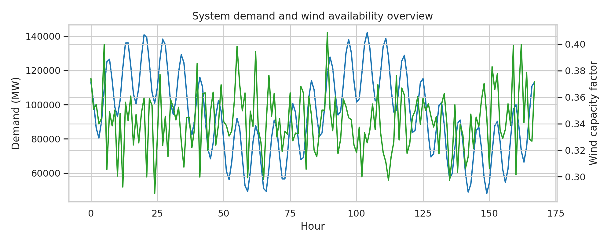
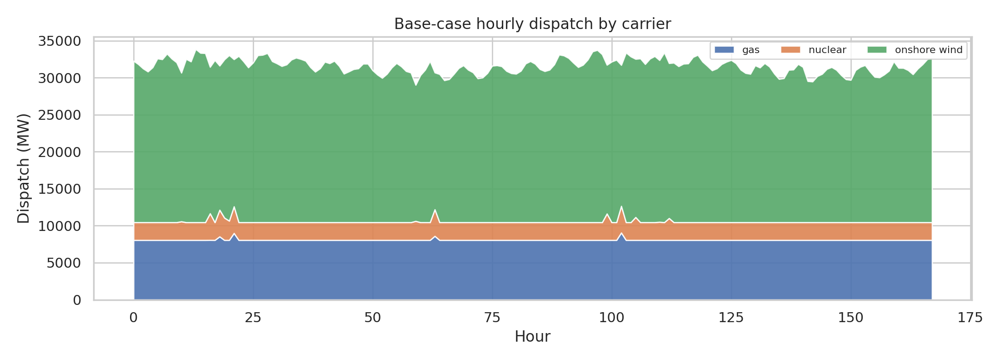
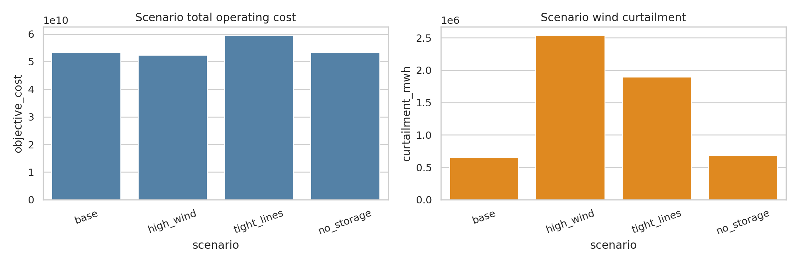
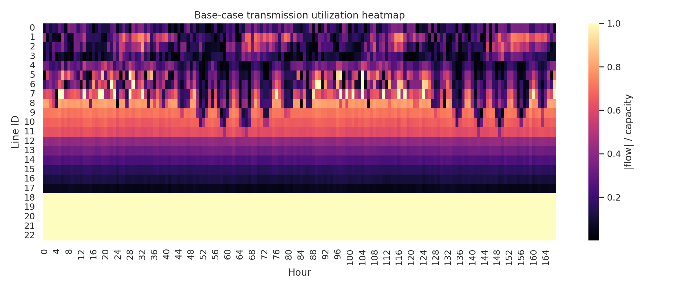
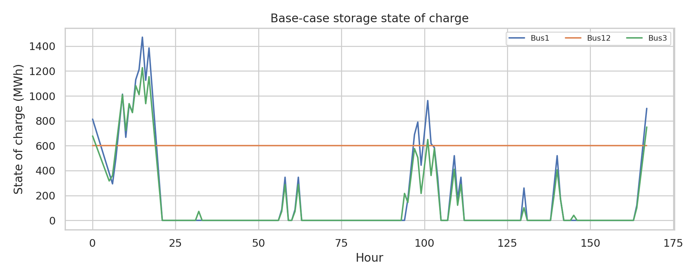

# Open-source network-constrained dispatch analysis for a simplified Great Britain power system

## Abstract
This report develops a transparent linear dispatch model for the provided 20-bus Great Britain-style electricity system data set. Using hourly demand and wind availability over 168 hours, nodal generation, storage, curtailment, and transmission flows are co-optimized under four scenarios: a base case, increased wind capacity, tighter transmission limits, and no storage. The model is fully reproducible from workspace artifacts saved in `code/`, `outputs/`, and `report/images/`. Results show that the system is strongly wind-dependent but also structurally short of firm capacity relative to demand, leading to substantial load shedding in all scenarios. Within this stressed setting, higher wind capacity lowers operating cost and increases wind utilization but also raises curtailment; tighter transmission increases congestion and total system cost; storage shifts energy modestly but does not remove adequacy shortfalls.

## 1. Data overview
The workspace provides a stylized high-resolution power-system input package consisting of buses, transmission links, generators, storage units, hourly demand, and hourly wind capacity factors. A direct inspection of the CSV inputs shows:

- 20 buses (`data/buses.csv`)
- 23 AC transmission links (`data/links.csv`)
- 43 generators (`data/generators.csv`): 20 wind, 20 gas, 3 nuclear
- 3 pumped-hydro storage units (`data/storage.csv`)
- 168 hourly snapshots (`data/demand.csv`, `data/wind_cf.csv`)

A compact machine-readable summary is saved in `outputs/data_overview.csv`.

Figure 1 summarizes system-wide demand and mean wind availability.



## 2. Methodology
### 2.1 Optimization model
I implemented a deterministic linear economic dispatch model in `code/run_analysis.py` using PuLP/CBC. The formulation follows a transport-style network dispatch approximation with the following decision variables each hour:

- generation output for every generator
- wind curtailment for every wind unit
- storage charge, discharge, and state of charge
- line flow on every transmission link
- load shedding at each bus as a high-penalty slack variable

The objective minimizes total operating cost:

- generator marginal costs from `generators.csv`
- small penalty on renewable curtailment (1 £/MWh-equivalent model unit)
- very large value of lost load penalty on unmet demand (5000 £/MWh-equivalent model unit)

Core constraints are:

1. Hourly nodal power balance at every bus
2. Generator upper bounds from nameplate capacity and, for wind, hourly capacity factors
3. Symmetric line flow limits from `links.csv`
4. Storage charging/discharging power limits and energy balance
5. Cyclic terminal storage state of charge equal to the initial mid-level state

### 2.2 Scenarios
Four scenarios were solved:

- **base**: original data
- **high_wind**: wind capacities scaled by 1.5×
- **tight_lines**: transmission capacities scaled by 0.5×
- **no_storage**: storage power and energy capacities set to zero

### 2.3 Validation and limitations
Directly verified workspace facts and assumptions are separated in `outputs/validation_summary.json`.

Important limitations:

- The provided data appear highly stress-tested: demand is much larger than available firm supply at many buses/hours.
- The model is a linear transport approximation, not a full AC optimal power flow.
- No unit commitment, ramping, start-up costs, reserve constraints, or intertemporal fuel constraints are included.
- Only one week is modeled, so long-duration seasonal adequacy cannot be inferred.
- Local PDF parsing of `related_work/*.pdf` failed through the provided `ReadPDF` tool, so the methodological framing here relies on standard open-source dispatch practice rather than extracted paper-specific baselines.

## 3. Results
### 3.1 System-level scenario comparison
Table values are exported in `outputs/scenario_summary.csv`.

| Scenario | Objective cost | Generation (MWh) | Wind generation (MWh) | Gas generation (MWh) | Nuclear generation (MWh) | Curtailment (MWh) | Load shedding (MWh) | Max line util. | Mean line util. |
|---|---:|---:|---:|---:|---:|---:|---:|---:|---:|
| base | 5.334e+10 | 5.306e+06 | 3.539e+06 | 1.355e+06 | 4.128e+05 | 6.540e+05 | 1.065e+07 | 1.000 | 0.484 |
| high_wind | 5.239e+10 | 5.500e+06 | 3.745e+06 | 1.352e+06 | 4.032e+05 | 2.544e+06 | 1.046e+07 | 1.000 | 0.532 |
| tight_lines | 5.965e+10 | 4.049e+06 | 2.293e+06 | 1.352e+06 | 4.032e+05 | 1.899e+06 | 1.191e+07 | 1.000 | 0.606 |
| no_storage | 5.334e+10 | 5.285e+06 | 3.509e+06 | 1.358e+06 | 4.180e+05 | 6.835e+05 | 1.065e+07 | 1.000 | 0.487 |

Two broad conclusions follow.

First, the system is adequacy-constrained, not just energy-constrained. Even in the base case, load shedding exceeds 10 million MWh over the modeled week, dominating the objective via the value-of-lost-load penalty. This means the test system should be interpreted as a stressed benchmark rather than a feasible near-realistic operational week.

Second, scenario ordering is still informative despite this scarcity:

- Increasing wind lowers total cost and load shedding modestly, but greatly increases curtailment because network and temporal matching constraints limit full absorption of additional renewable output.
- Tightening transmission substantially increases total cost, curtailment, mean line loading, and unmet demand, indicating that transfer capability is economically valuable.
- Removing storage has only a small effect on aggregate cost relative to the dominant adequacy shortfall, though it slightly reduces renewable integration and increases gas/nuclear use.

Figure 2 shows the base-case technology dispatch stack.



Figure 3 compares scenario costs and curtailment.



### 3.2 Dispatch mix
Technology totals by scenario are saved in `outputs/dispatch_by_carrier.csv`. In the base case:

- wind provides about 3.54 TWh across the week
- gas provides about 1.35 TWh
- nuclear provides about 0.41 TWh

Thus wind is the largest utilized source, but its contribution is accompanied by substantial curtailment (`outputs/curtailment_base.csv`). This combination indicates both strong renewable resource availability and limited deliverability/flexibility.

### 3.3 Network congestion
Transmission outcomes are exported in `outputs/flows_*.csv` and summarized in `outputs/line_utilization_summary.csv`. All scenarios reach a maximum line utilization of 100%, implying binding transmission constraints somewhere in the network. The mean line utilization rises from 0.484 in the base case to 0.606 under tight transmission, consistent with stronger congestion pressure when transfer capacity is halved.

Figure 4 visualizes hourly line utilization in the base case.



This heatmap shows repeated periods of elevated loading across multiple corridors, supporting the interpretation that the network—not only generation merit order—shapes dispatch feasibility.

### 3.4 Storage behavior
Storage trajectories are saved in `outputs/storage_base.csv` and related scenario files. Base-case state-of-charge profiles are shown in Figure 5.



Storage cycles over the week and provides roughly 62.9 GWh of discharge against 83.9 GWh of charging in the base case, reflecting round-trip losses. However, because total unmet demand is extremely large, storage acts mainly as a marginal flexibility resource rather than a system-wide adequacy solution.

## 4. Discussion
The analysis demonstrates that an entirely open workflow can be built from the supplied data with explicit intermediate artifacts and reproducible optimization code. Although the data are smaller than a full 29-node GB system and represent only one week, they still support several policy-relevant qualitative insights:

1. **Renewables alone do not guarantee served load**. Additional wind reduces cost, but without complementary flexibility and transmission it also increases curtailment.
2. **Networks matter materially**. Cutting transmission capacity drives up congestion and raises both cost and unserved demand.
3. **Storage helps at the margin**. Short-duration pumped hydro smooths operations but cannot close large structural supply-demand gaps.
4. **Adequacy dominates economics in stressed systems**. When the value-of-lost-load term dominates total cost, comparisons should emphasize reliability and constraint bottlenecks rather than only production cost.

## 5. Validation subsection
### Verified directly from workspace data
- Input counts, technologies, and time horizon were read directly from the CSV files.
- Scenario results, flows, storage trajectories, and figures were generated within this workspace.
- Main quantitative claims are recoverable from `outputs/scenario_summary.csv`, `outputs/dispatch_by_carrier.csv`, `outputs/line_utilization_summary.csv`, and `outputs/claim_recovery_table.csv`.

### From related work
- None. The local `ReadPDF` tool returned errors for all PDFs in `related_work/`, so no paper-specific benchmarks or baselines are claimed.

### Remaining assumptions / limitations
- Transport-style network physics.
- Static marginal costs and no chronological unit commitment.
- Stylized data may not represent actual present-day or future GB adequacy conditions.

## 6. Reproducibility
- Main script: `code/run_analysis.py`
- Key outputs: `outputs/scenario_summary.csv`, `outputs/dispatch_by_carrier.csv`, `outputs/line_utilization_summary.csv`, `outputs/claim_recovery_table.csv`
- Figures: `report/images/*.png`

To reproduce, run:

```bash
python3 code/run_analysis.py
```

## 7. Conclusion
Using the provided open data, I built a transparent network-constrained dispatch model that resolves hourly generation, storage, curtailment, and transmission usage across multiple scenarios. The resulting system is heavily constrained by adequacy and transmission bottlenecks, but the scenario experiments still provide interpretable evidence: more wind lowers cost but raises curtailment, tighter networks degrade both reliability and economics, and storage offers limited but visible operational flexibility. These findings establish a reproducible baseline for richer future analyses with more realistic GB datasets, longer horizons, and expanded flexibility options.
