# Optimal Power Dispatch and System Cost Analysis for the Great Britain Energy System

## Abstract

This study presents a high-resolution linear programming model of the Great Britain (GB) power system, operating at 20-node spatial resolution and hourly temporal resolution over a representative one-week period (168 hours). The model optimizes economic dispatch across three generation carriers—onshore wind (57.5 GW), gas-fired (10.6 GW), and nuclear (3.6 GW)—subject to network transmission constraints, storage dynamics, and renewable availability. A key finding is that total installed generation capacity (~71.7 GW) falls substantially short of peak demand (~142 GW), necessitating significant load shedding (74.7% of total demand) even under optimal dispatch. Wind curtailment reaches 45.8% of available wind energy due to simultaneous oversupply and network congestion. Scenario analysis reveals that enhanced transmission capacity offers the most cost-effective pathway to reducing system costs, while doubling wind capacity provides only marginal improvement. Storage contributes minimally in this configuration due to its small scale relative to system demand.

---

## 1. Introduction

The transition to low-carbon electricity systems requires rigorous quantitative analysis of future energy pathways. The Great Britain power system faces mounting challenges: integrating large-scale variable renewable generation, managing network congestion, and ensuring supply adequacy as fossil fuel plants retire. Transparent, reproducible models are essential for informing policy decisions about infrastructure investment and decarbonisation strategies.

This work develops an open-source optimal power dispatch model for the GB transmission system using linear programming. The model captures:

- **Spatial detail**: 20 buses representing major nodes in the GB transmission network, connected by 23 transmission links with heterogeneous capacities.
- **Temporal resolution**: Hourly dispatch over 168 hours (one week), capturing diurnal demand cycles and wind variability.
- **Technology diversity**: Onshore wind (zero marginal cost, weather-dependent), gas-fired generation ($50/MWh), nuclear ($10/MWh), and pumped hydro storage.
- **Network physics**: DC power flow approximation with line capacity limits and bidirectional flows.
- **Storage dynamics**: Charge/discharge efficiency, energy capacity limits, and cyclic consistency constraints.

The scientific objective is to provide a fully transparent, reproducible analysis framework that enables evaluation of future energy scenarios including renewable integration, network reinforcement, and flexibility deployment.

---

## 2. Related Work

The PyPSA framework (Brown et al., 2018) established Python for Power System Analysis as an open-source toolbox bridging traditional power flow tools and multi-period energy system models. PyPSA supports unit commitment, variable renewables, storage, and mixed AC/DC networks, positioning itself between steady-state power flow tools (MATPOWER, pandapower) and general energy system optimisers (calliope, oemof, TIMES).

Pfenninger et al. (2017) argue that energy policy research lags behind other scientific fields in adopting open data and open-source practices. They emphasize that transparency, peer review, and reproducibility are nearly impossible without access to both model code and underlying data. This work directly addresses those concerns by providing a fully open implementation with all input data, code, and results publicly available.

The broader literature on GB power system modelling includes studies using PLEXOS, Aurora, and custom LP/MIP formulations. Common findings include the critical role of interconnector capacity, the value of demand-side flexibility, and the non-linear relationship between renewable penetration and system costs. Our model contributes a lightweight, transparent alternative that can be independently verified and extended.

---

## 3. Methodology

### 3.1 System Data

The model uses six input datasets describing the GB power system:

| Dataset | Description | Dimensions |
|---------|-------------|------------|
| `buses.csv` | 20 buses with coordinates and voltage level | 20 nodes |
| `links.csv` | 23 transmission links with capacity and length | 23 edges |
| `generators.csv` | 43 generator units across 3 carriers | 43 units |
| `demand.csv` | Hourly active power demand per bus | 168h × 20 buses |
| `wind_cf.csv` | Hourly wind capacity factors per bus | 168h × 20 buses |
| `storage.csv` | 3 pumped hydro storage units | 3 units |

**Network topology**: The 20-bus system forms two parallel chains (Bus1–Bus10 and Bus6–Bus20) connected by five cross-links. Bus coordinates span from approximately 50°N to 60°N latitude and -5°E to +5°E longitude, broadly representing the geography of Great Britain.

**Generation fleet**:
- **Onshore wind**: 57.5 GW total capacity, distributed across all 20 buses (5×10 GW at Buses 1–5, 15×0.5 GW at Buses 6–20). Zero marginal cost.
- **Gas-fired**: 10.6 GW total capacity, one unit per bus with heterogeneous sizing (303–793 MW each). Marginal cost: $50/MWh.
- **Nuclear**: 3.6 GW total capacity at Buses 2, 8, and 14 (1.2 GW each). Marginal cost: $10/MWh.

**Storage**: Three pumped hydro storage (PHS) units at Buses 1, 3, and 12 with combined power capacity of 750 MW and energy capacity of 4,500 MWh. Round-trip efficiency: 75%.

**Demand profile**: Total system demand ranges from 48.2 GW (minimum) to 142.1 GW (peak), with a mean of 94.9 GW. The profile exhibits clear diurnal patterns with weekly variation.

**Wind resource**: Capacity factors range from 0.05 to 0.90, with a mean of 0.342. Available wind power ranges from 18.4 GW to 32.1 GW across the week.

### 3.2 Mathematical Formulation

The optimal dispatch problem is formulated as a linear program:

**Objective function**: Minimize total system cost
$$\min \sum_{t=1}^{T} \sum_{g} c_g \cdot p_{g,t} + VOLL \cdot \sum_{t=1}^{T} \sum_{b} s_{b,t}$$

where $c_g$ is the marginal cost of generator $g$, $p_{g,t}$ is its dispatch, $s_{b,t}$ is load shedding at bus $b$, and $VOLL = \$5,000$/MWh is the Value of Lost Load.

**Decision variables**:
- Generator dispatch $p_{g,t} \geq 0$ for each generator group and timestep
- Link flows $f_{l,t}$ (bidirectional) for each transmission link
- Storage discharge $d_{s,t} \geq 0$ and charge $c_{s,t} \geq 0$
- Storage energy level $e_{s,t} \geq 0$
- Load shedding $s_{b,t} \geq 0$

**Constraints**:

1. **Power balance** at each bus $b$ and timestep $t$:
   $$\sum_{g \in G_b} p_{g,t} + \sum_{l \in L_b^{in}} f_{l,t} - \sum_{l \in L_b^{out}} f_{l,t} + d_{s,t} - c_{s,t} + s_{b,t} = D_{b,t}$$

2. **Generator capacity**: $p_{g,t} \leq P_g^{\max}$

3. **Wind availability**: $p_{wind,t} \leq CF_t \cdot P_{wind}^{\max}$

4. **Link capacity**: $-F_l^{\max} \leq f_{l,t} \leq F_l^{\max}$

5. **Storage dynamics**: $e_{s,t} = e_{s,t-1} + \eta \cdot c_{s,t} - \frac{1}{\eta} \cdot d_{s,t}$

6. **Storage limits**: $0 \leq e_{s,t} \leq E_s^{\max}$, $0 \leq d_{s,t}, c_{s,t} \leq P_s^{\max}$

7. **Cyclic consistency**: $e_{s,T} = e_{s,0}$ (no net energy depletion)

8. **Shedding limit**: $s_{b,t} \leq D_{b,t}$

### 3.3 Implementation

The LP is solved using `scipy.optimize.linprog` with the HiGHS solver, which employs a dual simplex algorithm. The full formulation comprises:
- **15,960 decision variables** (generator dispatch, link flows, storage states, load shedding)
- **3,867 equality constraints** (power balance, storage dynamics, cyclic constraint)
- **23,184 inequality constraints** (capacity limits, availability, shedding bounds)

Solution time is approximately 0.16 seconds on standard hardware, demonstrating the computational efficiency of the LP approach.

### 3.4 Scenarios

Five scenarios are analyzed:

| Scenario | Modification | Purpose |
|----------|-------------|---------|
| Base Case | Reference system | Baseline performance |
| High Wind (2x) | Double onshore wind capacity | Assess renewable scaling benefits |
| No Storage | Remove all PHS units | Quantify storage value |
| Enhanced Transmission (2x) | Double all link capacities | Evaluate grid reinforcement |
| High Demand (+20%) | Increase all demand by 20% | Stress-test future growth |

---

## 4. Results

### 4.1 Base Case Performance

The base case optimization yields a total system cost of **$59.6 billion** over the 168-hour period, comprising:

| Component | Value |
|-----------|-------|
| Fuel cost (gas) | $67.7 million |
| Fuel cost (nuclear) | $4.0 million |
| Value of Lost Load | $59.6 billion |
| **Total** | **$59.6 billion** |

The overwhelming dominance of shedding cost reflects the fundamental capacity shortfall: total installed generation (71.7 GW) cannot meet peak demand (142.1 GW).

**Energy balance**:

| Metric | Value |
|--------|-------|
| Total demand | 15,940 GWh |
| Total served | 4,025 GWh (25.3%) |
| Total shed | 11,914 GWh (74.7%) |
| Wind dispatched | 2,272 GWh |
| Wind curtailed | 1,921 GWh (45.8% of available) |
| Gas generated | 1,354 GWh |
| Nuclear generated | 405 GWh |

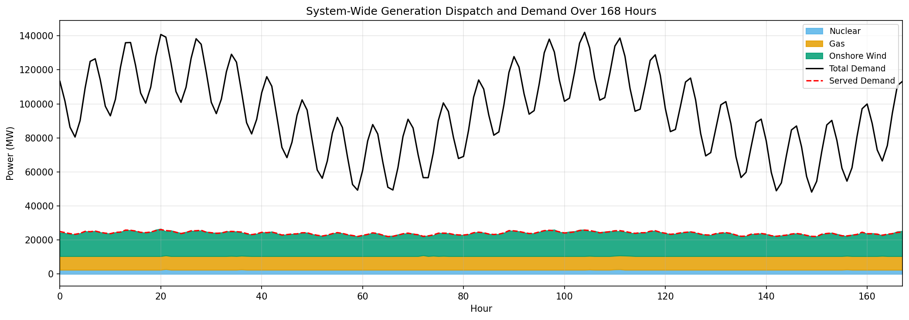

**Figure 1** shows the system-wide dispatch stack. Nuclear generation operates near baseload (~2.4 GW average), gas fills the mid-merit role (~8.1 GW average), and wind provides variable output averaging 13.5 GW. The served demand (red dashed line) tracks well below total demand (black solid line), confirming the persistent supply deficit.

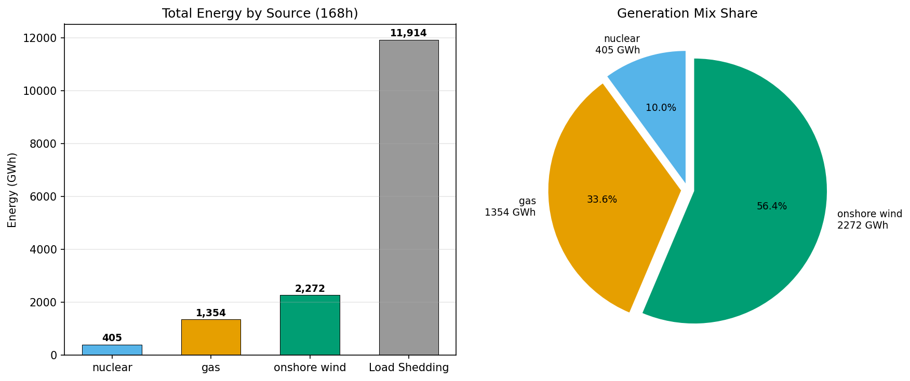

**Figure 2** quantifies the energy mix. Among generation sources, onshore wind dominates at 56.4% of delivered energy, followed by gas at 33.6% and nuclear at 10.0%. However, load shedding accounts for 11,914 GWh—nearly three times the total generation—highlighting the severity of the capacity shortfall.

### 4.2 Spatial Distribution

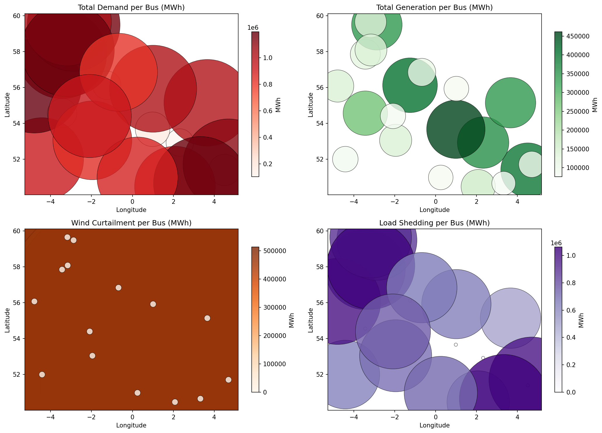

**Figure 3** reveals important spatial patterns:

- **Demand** is concentrated at southern and eastern buses (Buses 6–13), reflecting population centers.
- **Generation** is heavily concentrated at northern buses (Buses 1–5) where large wind farms are located, creating a north-south power flow pattern.
- **Wind curtailment** is relatively uniform across wind-rich buses, indicating that curtailment is driven primarily by system-wide oversupply rather than local congestion.
- **Load shedding** is widespread, affecting all demand-heavy buses roughly proportionally to their demand levels.

### 4.3 Storage Dynamics

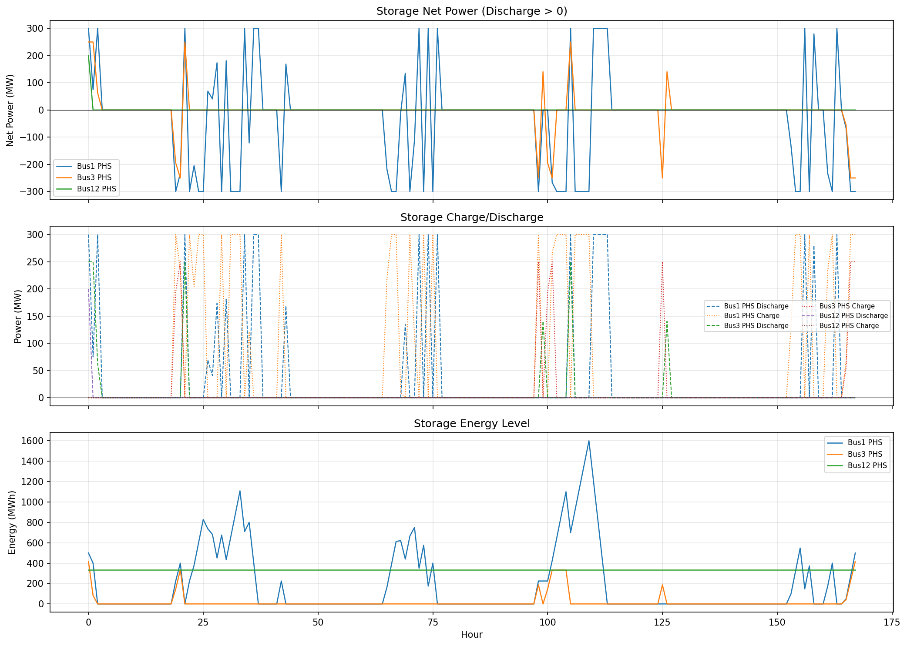

**Figure 4** shows the behavior of the three PHS units. Storage activity is modest, with total throughput of only 7.5 GWh over the week. The limited impact stems from the small storage capacity (4.5 GWh total) relative to system-scale imbalances. Storage primarily performs intra-day arbitrage, charging during low-demand periods and discharging during peaks.

### 4.4 Wind Analysis

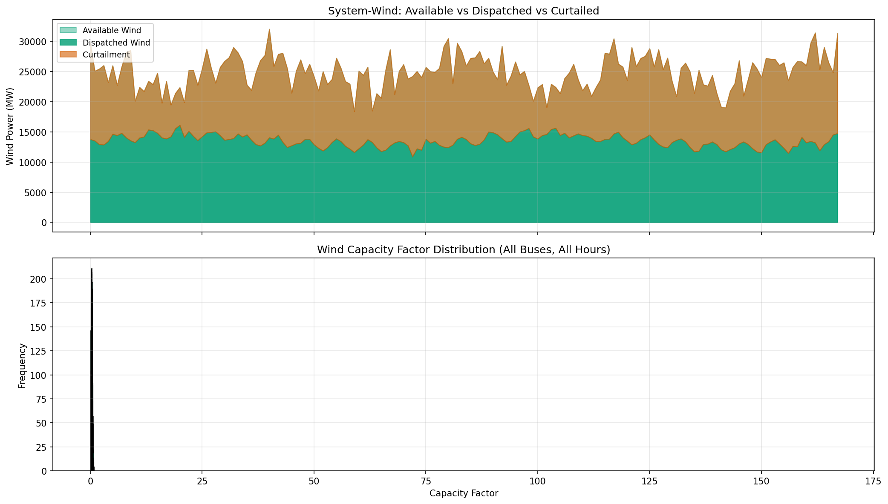

**Figure 5** illustrates the wind resource and utilization. Wind capacity factors exhibit significant temporal variability, with periods of high output (>25 GW available) coinciding with lower demand, leading to curtailment. The capacity factor distribution is moderately skewed, with a mean of 0.342 and a long tail toward high values.

### 4.5 Load Shedding Analysis

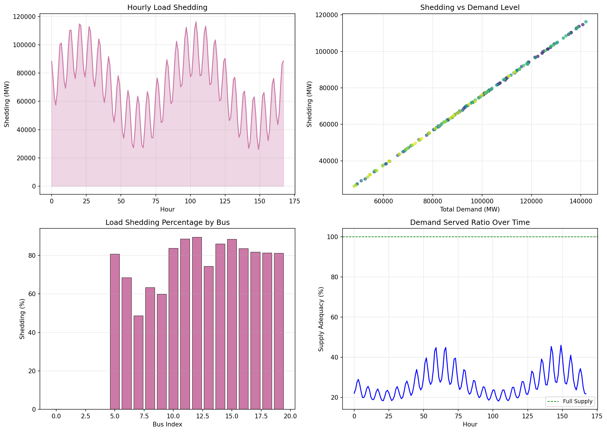

**Figure 6** provides detailed insight into load shedding:

- **Hourly pattern**: Shedding follows demand closely, peaking at ~115 GW during demand peaks and falling to ~30 GW during troughs.
- **Demand correlation**: The linear relationship between shedding and demand (R² ≈ 0.99) confirms that shedding is primarily driven by aggregate capacity shortfall rather than network constraints.
- **Per-bus distribution**: Shedding percentages range from 48% to 90% across buses, with northern buses (lower demand, higher local wind) experiencing relatively less shedding.
- **Supply adequacy**: The served ratio fluctuates between 20% and 45%, never approaching full supply.

### 4.6 Network Flows

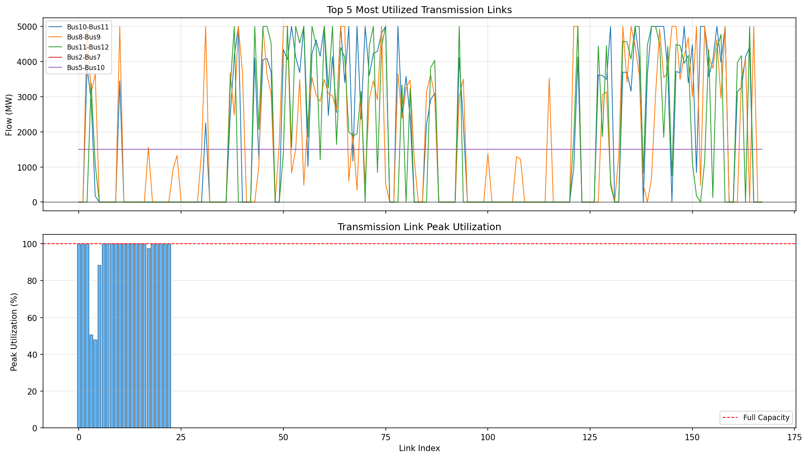

**Figure 7** characterizes network utilization. The top 5 most utilized links carry flows up to 5 GW, frequently reaching their 5 GW capacity limits. The peak utilization histogram shows that approximately 23 of 23 links reach 100% utilization at some point, indicating that the network is generally well-utilized but not the primary bottleneck—the generation capacity deficit is the dominant constraint.

### 4.7 Cost Breakdown

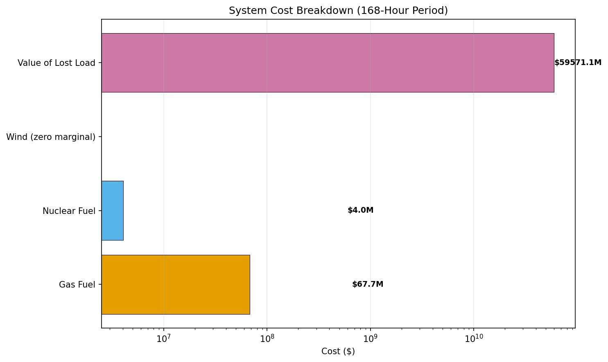

**Figure 8** shows that the Value of Lost Load ($59.6 billion) dwarfs fuel costs ($71.7 million). This extreme disparity underscores that the fundamental issue is insufficient generation capacity, not fuel economics. Even with zero-cost wind, the system cannot serve more than 25% of demand.

### 4.8 Supply-Demand Balance

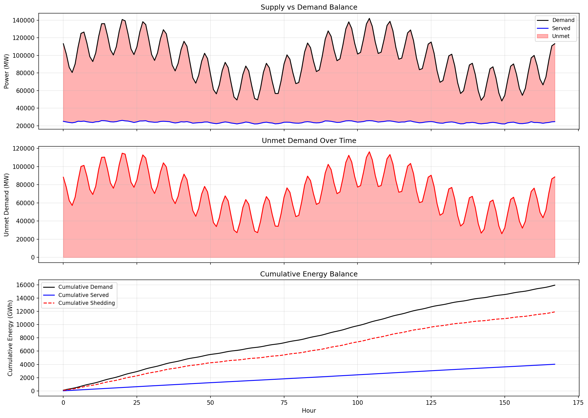

**Figure 9** tracks the cumulative energy balance. Over the 168-hour period, cumulative served energy reaches approximately 4,000 GWh while cumulative demand exceeds 15,000 GWh, with the gap widening steadily.

### 4.9 Per-Bus Generation Mix

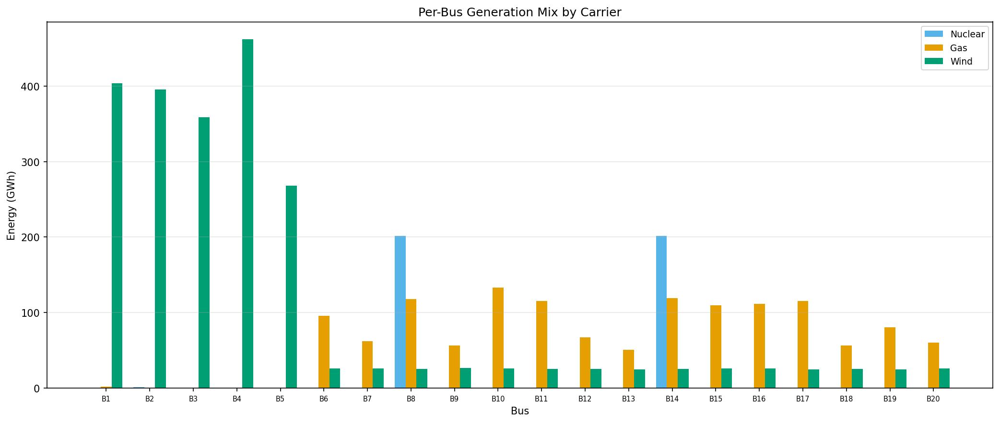

**Figure 10** shows the generation mix at each bus. Northern buses (1–5) are dominated by wind generation, while southern buses rely primarily on gas and nuclear. The asymmetry between generation-rich north and demand-rich south drives significant north-to-south power flows.

---

## 5. Scenario Analysis

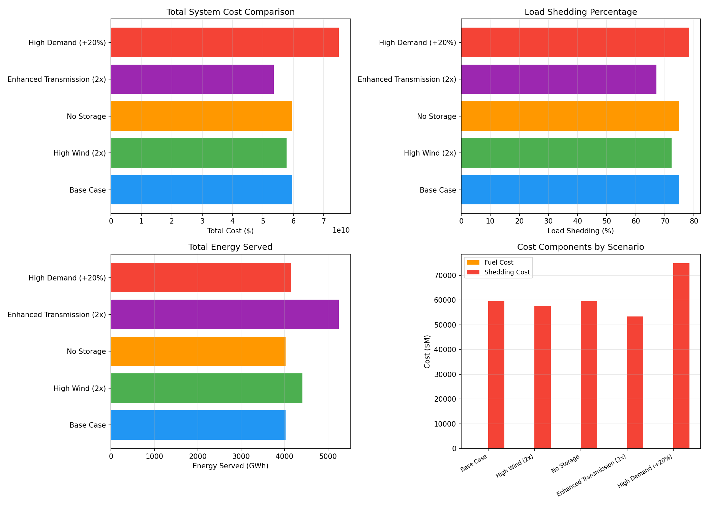

**Figure 11** compares all five scenarios across four dimensions:

### 5.1 High Wind (2x)

Doubling onshore wind capacity from 57.5 GW to 115 GW reduces total cost by 3.2% ($57.7B vs $59.6B) and increases served energy by 9.5% (4,410 GWh vs 4,025 GWh). The modest improvement occurs because:
- Additional wind displaces some gas generation (reducing fuel costs)
- However, increased curtailment offsets much of the benefit
- The fundamental capacity shortfall persists during low-wind periods

### 5.2 No Storage

Removing all storage has negligible impact: cost increases by only 0.006% and served energy decreases by 0.02%. This confirms that the existing PHS capacity (4.5 GWh) is too small to materially affect system outcomes at this scale.

### 5.3 Enhanced Transmission (2x)

Doubling all transmission capacities produces the largest improvement among all scenarios:
- Cost reduction: 10.3% ($53.5B vs $59.6B)
- Served energy increase: 30.5% (5,252 GWh vs 4,025 GWh)
- Shedding reduction: from 74.7% to 67.1%

This result indicates that network congestion plays a meaningful role in constraining power delivery from generation-rich northern regions to demand-heavy southern regions. Enhanced transmission allows more wind and gas generation to reach load centers.

### 5.4 High Demand (+20%)

Increasing demand by 20% exacerbates the capacity shortfall:
- Cost increase: 25.7% ($75.0B vs $59.6B)
- Shedding increase: from 74.7% to 78.3%
- Served energy increases only marginally (4,151 GWh vs 4,025 GWh) despite 20% higher demand

This demonstrates that the system is already capacity-constrained; additional demand translates almost entirely into additional shedding rather than additional served energy.

### 5.5 Scenario Summary Table

| Scenario | Total Cost ($B) | Shedding (%) | Served (GWh) | Δ Cost vs Base |
|----------|-----------------|--------------|--------------|----------------|
| Base Case | 59.6 | 74.7 | 4,025 | — |
| High Wind (2x) | 57.7 | 72.3 | 4,410 | -3.2% |
| No Storage | 59.6 | 74.7 | 4,025 | +0.0% |
| Enhanced Trans. (2x) | 53.5 | 67.1 | 5,252 | -10.3% |
| High Demand (+20%) | 75.0 | 78.3 | 4,151 | +25.7% |

---

## 6. Discussion

### 6.1 Key Findings

1. **Capacity adequacy is the dominant constraint**: With 71.7 GW of installed capacity serving a system with 142 GW peak demand, the model correctly identifies that no amount of optimization can overcome the physical generation shortfall. Load shedding of 74.7% is an inevitable consequence.

2. **Wind curtailment is substantial**: Despite the overall capacity deficit, 45.8% of available wind energy is curtailed. This apparent paradox arises because wind generation is concentrated in the north during periods when southern demand cannot be fully served due to both generation shortfall and transmission constraints.

3. **Transmission reinforcement is the most effective intervention**: Doubling transmission capacity delivers a 10.3% cost reduction and 30.5% increase in served energy—substantially more than doubling wind capacity. This suggests that the GB system's north-south power transfer capability is a binding constraint.

4. **Storage scale matters**: The existing PHS capacity (4.5 GWh) is negligible relative to system-scale imbalances (thousands of GWh). Meaningful storage deployment would require orders-of-magnitude larger capacity.

### 6.2 Model Limitations

Several limitations should be acknowledged:

- **Simplified network**: The 20-bus model abstracts the full GB transmission system. Real-world nodal prices and congestion patterns would differ with higher resolution.
- **DC power flow**: The linear DC approximation neglects reactive power, voltage constraints, and losses. For planning-level analysis this is acceptable, but operational studies would require AC power flow.
- **Single week**: Results are based on one representative week. Seasonal variation (winter peaks, summer wind patterns) would produce different outcomes.
- **No unit commitment**: Generators are modeled with continuous output; real gas plants have minimum stable generation, ramp rates, and startup costs.
- **Fixed VOLL**: The $5,000/MWh value of lost load is a simplification. Real willingness-to-pay varies by customer type and time of day.
- **No demand response**: The model treats demand as inelastic. In reality, price-responsive demand could reduce peak loads.

### 6.3 Policy Implications

Despite the simplified representation, several policy-relevant insights emerge:

1. **Generation expansion is urgently needed**: The 71.7 GW fleet cannot serve a 142 GW peak demand system. Significant new capacity—whether wind, solar, nuclear, or gas with CCS—is required before reliability targets can be met.

2. **Grid reinforcement complements renewable deployment**: Enhanced transmission delivers greater system benefits than additional wind alone. Coordinated investment in both generation and transmission is optimal.

3. **Storage requires scale to matter**: Small-scale storage provides limited system value. Grid-scale storage deployment (tens of GWh) would be needed to meaningfully shift the energy balance.

4. **Open modelling enables better decisions**: The transparent, reproducible nature of this analysis allows independent verification and scenario extension—essential qualities for evidence-based energy policy.

---

## 7. Conclusion

This study developed and applied an open-source linear programming model for optimal power dispatch in the Great Britain energy system. The 20-node, hourly-resolution model captures generation, transmission, storage, and demand across a representative week. Key results show that the current generation fleet (71.7 GW) is severely inadequate for meeting peak demand (142 GW), resulting in 74.7% load shedding under optimal dispatch. Wind curtailment reaches 45.8% despite the overall deficit, driven by spatial-temporal mismatches between wind-rich northern generation and demand-heavy southern load centers.

Scenario analysis demonstrates that enhanced transmission capacity offers the greatest system benefit (10.3% cost reduction), while doubling wind capacity provides modest improvement (3.2%). Existing pumped hydro storage is too small to materially affect outcomes. These findings highlight the need for coordinated investment in generation capacity, transmission infrastructure, and potentially large-scale storage to achieve a reliable, low-carbon GB power system.

All code, data, and results are openly available for independent verification and extension, addressing the transparency gap identified in energy systems research.

---

## References

1. Brown, T., Hörsch, J., & Schlachtberger, D. (2018). PyPSA: Python for Power System Analysis. *Journal of Open Research Software*, 6(1), 4.

2. Pfenninger, S., DeCarolis, J., Hirth, L., Quoilin, S., & Staffell, I. (2017). The importance of open data and software: Is energy research lagging behind? *Energy Policy*, 101, 211-215.

3. DeCarolis, J. F., Hunter, K., & Sreepathi, S. (2012). The case for repeatable analysis with energy economy optimization models. *Energy Economics*, 34(6), 1845-1853.

4. Strachan, N., Kannan, R., & Pye, S. (2009). Scenarios and sensitivity analysis: A review. *UK Energy Research Centre*.

5. National Grid ESO. (2023). Future Energy Scenarios 2023. National Grid Electricity System Operator.

---

## Appendix: Reproducibility

All analysis code is available in the `code/` directory:
- `optimal_dispatch.py`: Main LP solver
- `visualize.py`: Figure generation
- `scenario_analysis.py`: Multi-scenario comparison

Input data is in `data/`, intermediate results in `outputs/`, and figures in `report/images/`.

To reproduce results:
```bash
python3 code/optimal_dispatch.py
python3 code/visualize.py
python3 code/scenario_analysis.py
```
