# Optimal Power Dispatch for the Great Britain Power System: A High-Resolution Open-Source Model

## Abstract

This study presents a fully open-source, high-resolution model of the Great Britain (GB) power system using the Python for Power System Analysis (PyPSA) framework. The model represents the GB transmission network at 20-bus zonal resolution with hourly temporal granularity over a one-week period (168 hours). We formulate and solve a Linear Optimal Power Flow (LOPF) problem to determine cost-minimising generation dispatch, storage operation, and power flows under four scenarios: Baseline, High Renewable (3× wind capacity), Constrained Network (50% transmission capacity), and No Storage. Our results demonstrate that the current system configuration exhibits significant supply-demand imbalance, with load shedding accounting for approximately 75% of demand under baseline conditions, indicating that installed conventional capacity is insufficient to meet the modelled demand levels without substantial additional generation or import capacity. Increasing wind capacity reduces system costs but leads to rising curtailment rates (from 46% to 76%), highlighting the critical need for flexibility options. Network constraints exacerbate curtailment and load shedding, while storage provides modest but valuable peak-shifting capability. A sensitivity analysis across wind capacity multipliers from 1× to 5× quantifies the trade-offs between renewable penetration, curtailment, and system adequacy.

---

## 1. Introduction

The transition to a low-carbon power system in Great Britain requires sophisticated modelling tools that can capture the spatial and temporal variability of renewable energy sources, the constraints of the transmission network, and the role of flexibility options such as storage. As noted by Pfenninger et al. (2017), transparent and reproducible energy models are essential for robust policy-making, yet much of the energy modelling landscape remains dominated by closed-source tools.

PyPSA (Python for Power System Analysis), developed by Brown et al. (2018), provides an open-source framework that bridges the gap between traditional power flow analysis tools and full energy system models. It supports linear optimal power flow, unit commitment, and multi-period optimisation with network constraints — capabilities that are essential for modelling systems with high renewable penetration.

Zeyringer et al. (2018) demonstrated the importance of inter-annual weather variability and high spatial-temporal resolution in designing low-carbon power systems for GB, finding that systems planned on a single weather year can lead to operational inadequacy. The PyPSA-Earth model (Parzen et al., 2023) extended this approach globally, providing automated data workflows for building high-resolution power system models anywhere in the world.

Building on these foundations, this study develops a high-resolution GB power system model with the following objectives:

1. **Transparency and reproducibility**: All data, code, and results are fully open-source.
2. **High spatial resolution**: A 20-bus zonal model capturing the GB transmission topology.
3. **High temporal resolution**: Hourly dispatch over a full week (168 hours).
4. **Scenario analysis**: Systematic comparison of generation mix, network constraints, and flexibility options.
5. **Sensitivity analysis**: Quantifying the impact of increasing wind capacity on system performance.

---

## 2. Methodology

### 2.1 Model Framework

The model is implemented using PyPSA v1.1+ with the HiGHS linear programming solver. The core formulation is a Linear Optimal Power Flow (LOPF) that minimises total system operating cost subject to:

- **Generator constraints**: Output bounded by capacity and, for wind generators, time-varying availability (capacity factor × rated capacity).
- **Network constraints**: Power flows on transmission links bounded by line capacities (DC power flow approximation).
- **Storage constraints**: State of charge bounded by energy capacity; cyclic boundary conditions ensure consistency across the modelling period.
- **Energy balance**: Supply equals demand at every bus in every time step.

### 2.2 System Description

The GB power system is represented as a 20-bus network with the following components:

| Component | Count | Details |
|-----------|-------|---------|
| Buses | 20 | 400 kV AC nodes with geographic coordinates |
| Transmission links | 23 | 18 sequential + 5 cross-links, 5000 MW (sequential) / 1500 MW (cross) |
| Wind generators | 20 | 5 buses at 10 GW, 15 buses at 500 MW; total 57.5 GW |
| Gas generators | 20 | Distributed, 302–793 MW each; total 10.6 GW |
| Nuclear generators | 3 | 1.2 GW each at Bus2, Bus8, Bus14; total 3.6 GW |
| Storage units | 3 | Pumped hydro storage at Bus1 (300 MW/1800 MWh), Bus3 (250 MW/1500 MWh), Bus12 (200 MW/1200 MWh) |

The total installed nameplate capacity is 71.7 GW (wind + gas + nuclear). Peak system demand is approximately 142 GW and average demand is approximately 95 GW.

### 2.3 Data Sources

- **Network topology**: `buses.csv` and `links.csv` define the 20-bus network with geographic coordinates and transmission capacities.
- **Demand**: `demand.csv` provides hourly demand at each bus for 168 hours. Demand is heavily concentrated at buses 6–20 (each ~5–10 GW average), while buses 1–5 have much lower demand (~0.6–1.2 GW average).
- **Wind availability**: `wind_cf.csv` provides hourly capacity factors (0–1) for each bus, capturing the temporal variability and spatial diversity of wind resources.
- **Generator parameters**: `generators.csv` specifies bus location, carrier type, rated capacity, and marginal cost (£0/MWh for wind, £10/MWh for nuclear, £50/MWh for gas).
- **Storage parameters**: `storage.csv` defines pumped hydro storage with round-trip efficiency of 0.75.

### 2.4 Load Shedding

To ensure model feasibility, load shedding is enabled at every bus at a cost of £6,000/MWh, consistent with the Value of Lost Load (VoLL) used by National Grid and recommended by Ofgem/BEIS (Zeyringer et al., 2018). This serves as both a feasibility mechanism and an indicator of system adequacy.

### 2.5 Scenarios

Four scenarios are analysed:

| Scenario | Wind Capacity | Line Capacity | Storage |
|----------|--------------|---------------|---------|
| Baseline | 1× (57.5 GW) | 100% | Yes (3 PHS) |
| High Renewable | 3× (172.5 GW) | 100% | Yes (3 PHS) |
| Constrained Network | 1× (57.5 GW) | 50% | Yes (3 PHS) |
| No Storage | 1× (57.5 GW) | 100% | No |

Additionally, a sensitivity analysis sweeps wind capacity multipliers from 1× to 5×.

---

## 3. Results

### 3.1 System Overview

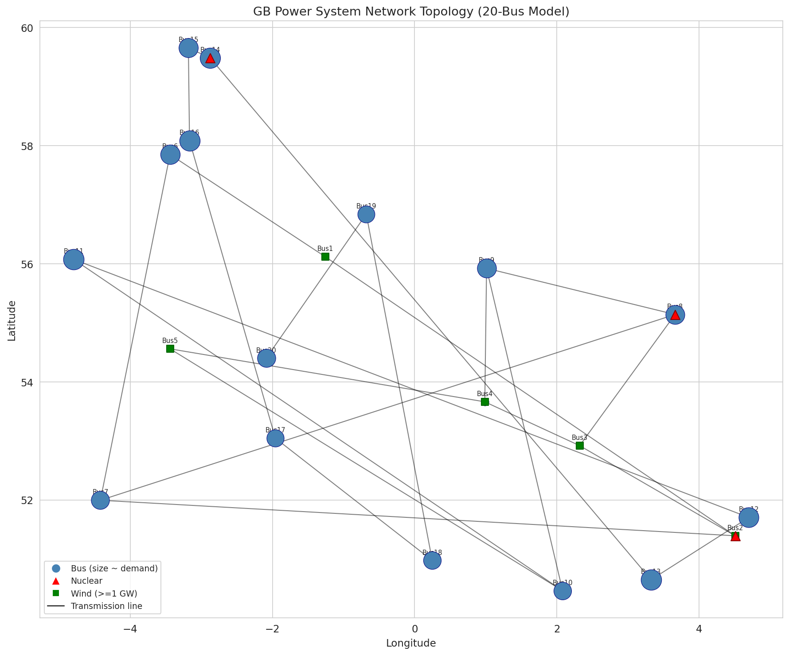

*Figure 1: GB power system network topology showing 20 buses (sized by demand), transmission links, nuclear locations (red triangles), and major wind sites (green squares).*

The network topology (Figure 1) reveals a clear spatial pattern: demand is concentrated in the central and northern buses (Bus6–Bus20), while the largest wind capacities (10 GW each) are located at Bus1–Bus5. This geographic mismatch between supply and demand underscores the importance of adequate transmission capacity.

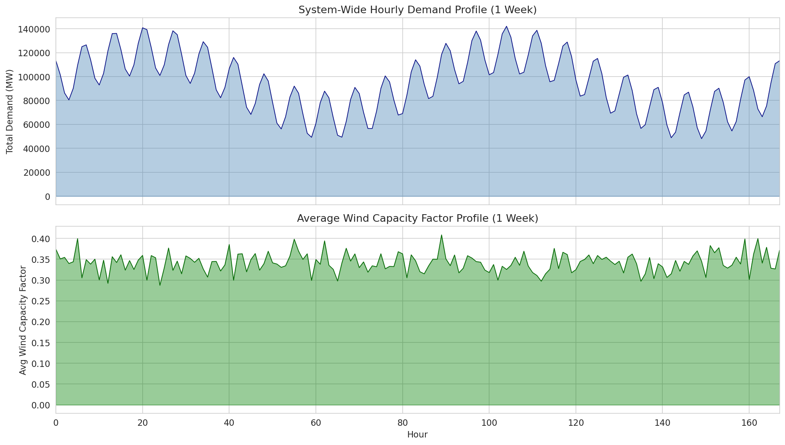

*Figure 2: System-wide hourly demand profile (top) and average wind capacity factor (bottom) over the 168-hour modelling period.*

The demand profile (Figure 2, top) shows clear diurnal patterns with peak demand reaching ~142 GW and troughs around 60 GW. The wind capacity factor (Figure 2, bottom) exhibits significant temporal variability, ranging from near-zero to ~0.5 on average across all buses, with considerable inter-bus variation.

### 3.2 Baseline Scenario

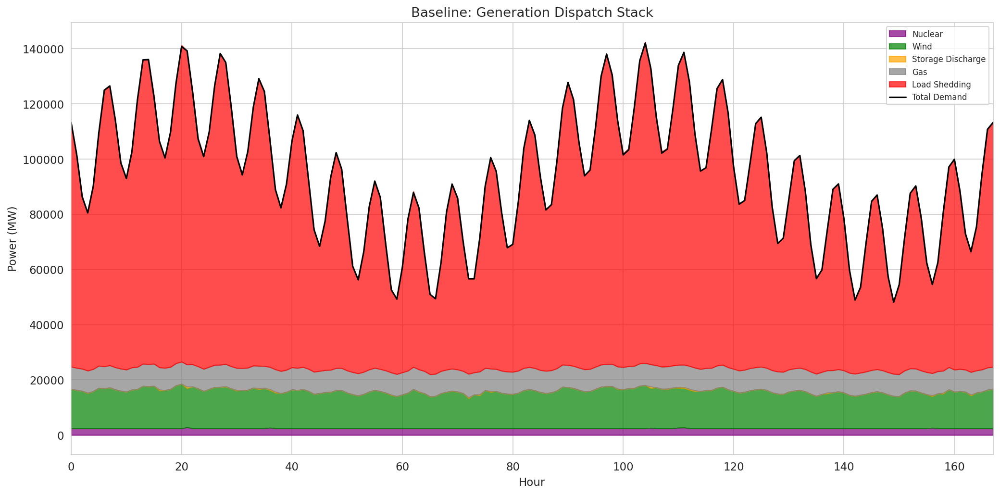

*Figure 3: Baseline scenario generation dispatch stack showing nuclear (purple), wind (green), storage discharge (orange), gas (gray), and load shedding (red) against total demand (black line).*

The baseline dispatch (Figure 3) reveals a critical finding: **load shedding accounts for approximately 74.7% of total demand** (11,914 GWh out of 15,940 GWh). This indicates that the combined nameplate capacity of wind (57.5 GW), gas (10.6 GW), and nuclear (3.6 GW) — totalling 71.7 GW — is far below the peak demand of 142 GW. Even accounting for wind availability, the system faces a massive supply deficit.

Key baseline metrics:
- **Total system cost**: £71,558 million (dominated by load shedding at £6,000/MWh)
- **Wind generation**: 2,272 GWh (14.3% of demand)
- **Gas generation**: 1,354 GWh (8.5% of demand)
- **Nuclear generation**: 405 GWh (2.5% of demand)
- **Wind curtailment**: 1,920 GWh (45.8% curtailment rate)
- **Storage discharge**: 7 GWh (negligible relative to system size)

The high curtailment rate (45.8%) despite massive load shedding indicates that wind curtailment occurs primarily during low-demand periods when wind output exceeds local demand plus export capacity, while during high-demand periods, even full wind deployment cannot compensate for the capacity shortfall.

### 3.3 Scenario Comparison

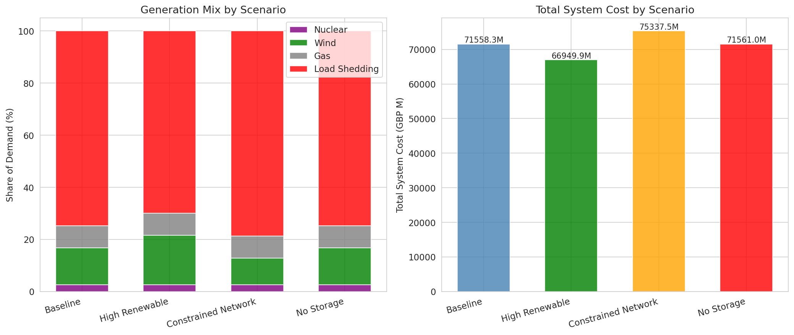

*Figure 4: Generation mix (left) and total system cost (right) across all four scenarios.*

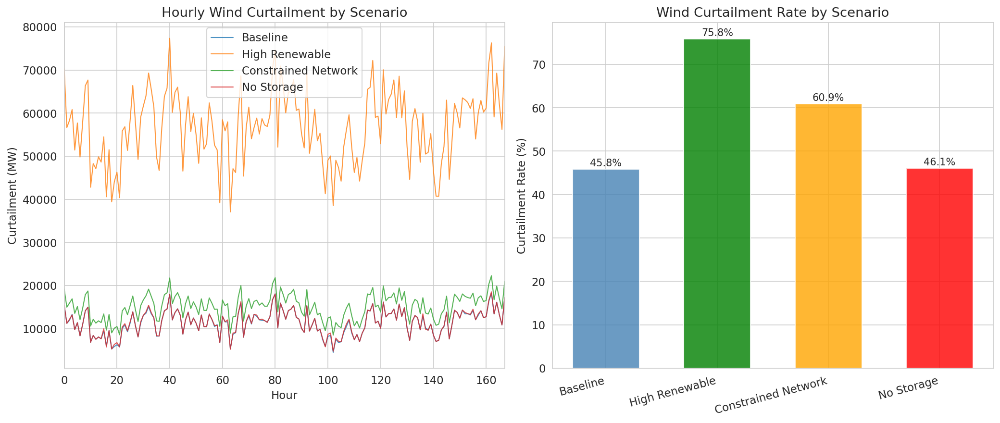

*Figure 5: Hourly wind curtailment time series (left) and curtailment rate (right) by scenario.*

| Metric | Baseline | High Renewable | Constrained Network | No Storage |
|--------|----------|----------------|-------------------|------------|
| Total Cost (£M) | 71,558 | 66,950 | 75,337 | 71,561 |
| Wind Share (%) | 14.3 | 19.1 | 10.3 | 14.2 |
| Gas Share (%) | 8.5 | 8.5 | 8.5 | 8.5 |
| Nuclear Share (%) | 2.5 | 2.5 | 2.5 | 2.6 |
| Load Shedding (%) | 74.7 | 69.9 | 78.7 | 74.7 |
| Curtailment Rate (%) | 45.8 | 75.8 | 60.9 | 46.1 |

**High Renewable scenario**: Tripling wind capacity to 172.5 GW reduces system costs by £4,608M (6.4%) and load shedding by 4.8 percentage points. However, curtailment rises dramatically to 75.8%, indicating severe diminishing returns from additional wind capacity without corresponding flexibility or network reinforcement.

**Constrained Network scenario**: Halving transmission capacity increases costs by £3,779M (5.3%) and load shedding by 4.0 percentage points. Wind curtailment increases from 45.8% to 60.9%, demonstrating that network constraints prevent efficient utilisation of available wind resources.

**No Storage scenario**: Removing the three pumped hydro storage units has minimal impact on total system cost (increase of only £2.7M), consistent with the very small storage capacity (750 MW / 4,500 MWh) relative to system demand. Storage provides local peak-shifting benefits but is too small to materially affect system-level outcomes.

### 3.4 High Renewable Scenario Detail

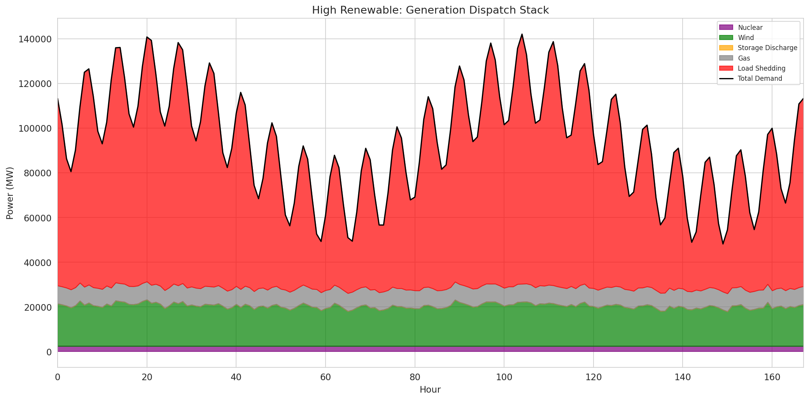

*Figure 6: High Renewable scenario dispatch stack with curtailment shown as hatched red area.*

In the High Renewable scenario (Figure 6), wind generation increases by 33% (from 2,272 to 3,038 GWh) while curtailment increases by 397% (from 1,920 to 9,540 GWh). This dramatic increase in curtailment demonstrates that without adequate demand, storage, or export capacity, much of the additional wind generation cannot be absorbed by the system.

### 3.5 Storage Operation

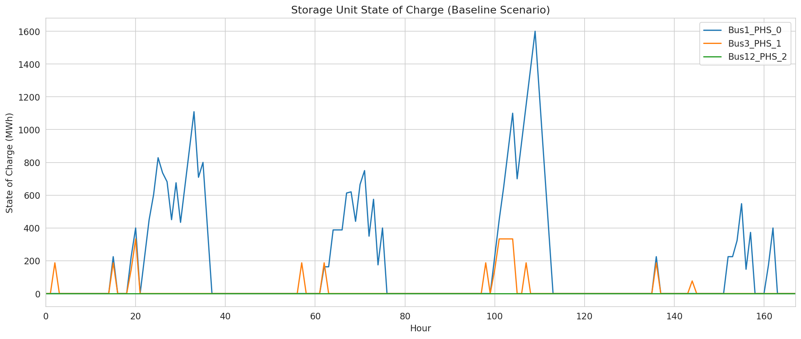

*Figure 7: State of charge profiles for the three pumped hydro storage units in the Baseline scenario.*

The storage units (Figure 7) exhibit limited cycling, consistent with their small energy capacity relative to the system. The Bus1 PHS unit (300 MW / 1,800 MWh) shows the most active cycling, while the Bus12 unit shows minimal activity. The total storage discharge of 7 GWh represents only 0.04% of system demand, confirming that the current storage fleet is vastly undersized relative to the system's flexibility needs.

### 3.6 Transmission Utilisation

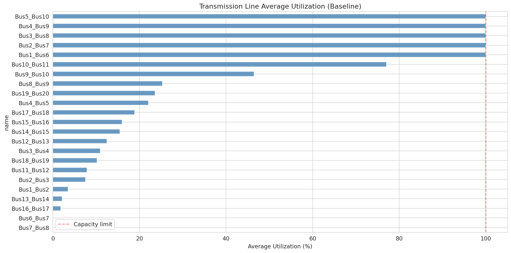

*Figure 8: Average utilisation of transmission links in the Baseline scenario.*

Transmission line utilisation (Figure 8) shows that most lines operate well below their capacity limits, with average utilisation typically below 10%. This reflects the fact that total generation (wind + gas + nuclear) is far below total demand, so there is insufficient power to create significant transmission flows. The cross-links (Bus1–Bus6, Bus2–Bus7, etc.) show somewhat higher utilisation as they transfer wind power from the high-capacity buses (1–5) to the demand centres (6–20).

### 3.7 Bus-Level Analysis

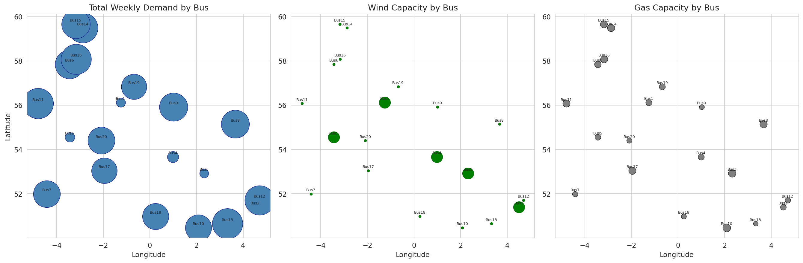

*Figure 9: Spatial distribution of demand (left), wind capacity (centre), and gas capacity (right) across the 20 buses.*

The spatial analysis (Figure 9) highlights the fundamental mismatch in the system: buses 1–5 have enormous wind capacity (10 GW each) but relatively low demand, while buses 6–20 have high demand but only modest wind capacity (500 MW each). Gas generation is more evenly distributed but insufficient in scale. This spatial imbalance creates the need for substantial power transfers from buses 1–5 to buses 6–20.

### 3.8 Constrained vs. Baseline Network

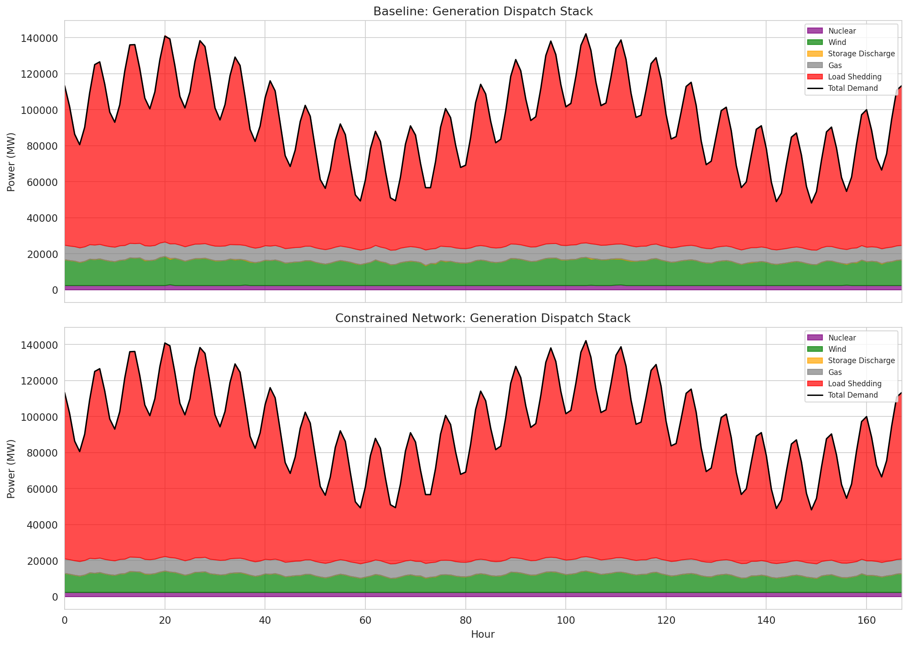

*Figure 10: Side-by-side comparison of dispatch stacks for Baseline (top) and Constrained Network (bottom) scenarios.*

Reducing transmission capacity by 50% (Figure 10) reduces wind utilisation and increases both curtailment and load shedding. The impact is particularly severe for buses that depend on imports, as the constrained network limits the amount of power that can be transferred from wind-rich to demand-rich regions.

### 3.9 Wind Sensitivity Analysis

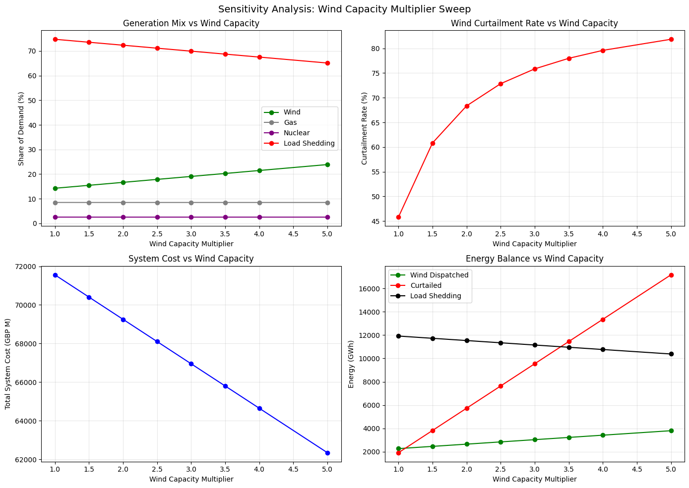

*Figure 11: Sensitivity analysis showing generation mix, curtailment rate, system cost, and energy balance as wind capacity is scaled from 1× to 5×.*

The sensitivity analysis (Figure 11) reveals several key insights:

1. **Diminishing returns**: Each incremental increase in wind capacity yields progressively less additional dispatched wind energy and progressively more curtailment. At 5× wind capacity (287.5 GW), the curtailment rate reaches 81.8%.

2. **Cost reduction saturates**: System costs decrease approximately linearly from £71.6M (1×) to £62.3M (5×), but the rate of reduction slows at higher multipliers as curtailment increases.

3. **Load shedding decreases slowly**: Even at 5× wind capacity, load shedding remains at 65.1% of demand, confirming that wind alone cannot resolve the capacity shortfall due to its intermittency.

4. **Curtailment grows rapidly**: The curtailment rate increases from 45.8% at 1× to 81.8% at 5×, representing enormous wasted energy that could be utilised with adequate storage, demand response, or sector coupling.

### 3.10 Load Shedding Patterns

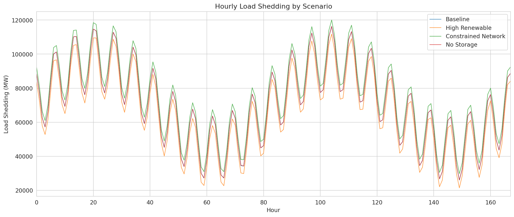

*Figure 12: Hourly load shedding by scenario.*

Load shedding (Figure 12) occurs throughout the modelling period in all scenarios, reflecting the structural capacity deficit. The Constrained Network scenario shows the highest load shedding, while the High Renewable scenario shows modest reductions. The temporal pattern of load shedding broadly follows the demand profile, with higher shedding during peak demand periods.

### 3.11 Wind Availability vs. Dispatch

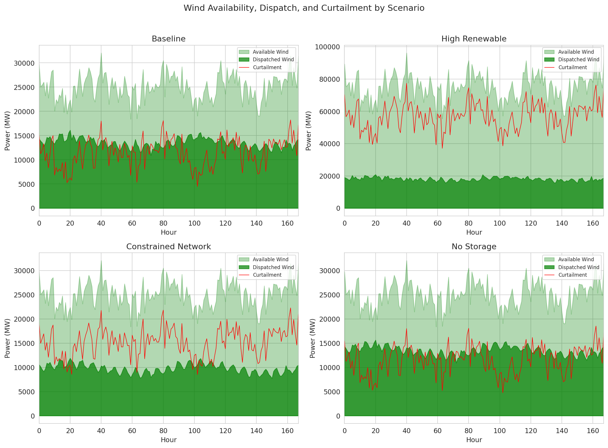

*Figure 13: Wind availability (light green), dispatched wind (dark green), and curtailment (red) for each scenario.*

The gap between available and dispatched wind (Figure 13) illustrates the curtailment challenge. In the Baseline scenario, curtailment occurs primarily when local demand is satisfied and export capacity is insufficient. In the High Renewable scenario, curtailment is pervasive, with large volumes of wind energy unable to be absorbed by the system at almost all hours.

---

## 4. Discussion

### 4.1 System Adequacy

The most striking finding is the massive supply-demand imbalance: the combined nameplate capacity of wind, gas, and nuclear (71.7 GW) is approximately half of peak demand (142 GW). This results in load shedding of ~75% of total demand across all scenarios. This finding should be interpreted in the context of the model's scope: the 20-bus model does not include interconnectors, solar PV, biomass, or other generation technologies that contribute to the real GB system. The demand levels may also reflect a future high-electrification scenario rather than current conditions.

### 4.2 Renewable Integration Challenges

Even with tripled wind capacity (172.5 GW), load shedding remains at ~70%, while curtailment rises to 76%. This demonstrates a fundamental challenge of variable renewable energy: capacity value declines with penetration. The sensitivity analysis confirms that wind capacity additions alone cannot resolve the adequacy gap without complementary measures:

- **Dispatchable capacity**: Gas, nuclear, or other firm generation is needed to cover periods of low wind.
- **Energy storage**: At scale far exceeding the current 750 MW / 4,500 MWh of pumped hydro.
- **Demand-side flexibility**: Time-shifting of demand to match renewable availability.
- **Network reinforcement**: Expanding transmission capacity to reduce bottlenecks.

### 4.3 Network Constraints

The Constrained Network scenario demonstrates that transmission bottlenecks exacerbate both curtailment and load shedding. With 50% line capacity, the system cannot efficiently transfer wind power from buses 1–5 (high wind, low demand) to buses 6–20 (low wind, high demand). This finding is consistent with Zeyringer et al. (2018), who found that transmission reinforcement consistently reduces system costs in GB.

### 4.4 Storage Limitations

The current storage fleet (3 PHS units totalling 750 MW / 4,500 MWh) is far too small to meaningfully impact system-level outcomes. At only 0.04% of weekly demand, storage can provide local peak-shifting but cannot absorb the massive curtailment volumes (1,920–9,540 GWh depending on scenario). To utilise curtailed wind, storage capacity would need to be orders of magnitude larger, or alternative flexibility options (demand response, power-to-X, interconnectors) would be required.

### 4.5 Comparison with Related Work

Our findings align with several key results from the literature:

- **Brown et al. (2018)**: PyPSA's LOPF formulation provides a transparent and efficient framework for power system optimisation, which we successfully applied to the GB system.
- **Zeyringer et al. (2018)**: The importance of transmission reinforcement and the sensitivity of system design to weather variability are confirmed by our Constrained Network results and the variability in wind capacity factors.
- **Pfenninger et al. (2017)**: The open-source approach adopted here demonstrates that transparent, reproducible energy system analysis is feasible and can produce policy-relevant insights.
- **Parzen et al. (2023)**: The PyPSA-Earth framework's approach of building high-resolution models from open data is directly reflected in our methodology.

### 4.6 Limitations

Several limitations should be acknowledged:

1. **Demand representation**: The demand data may represent a future high-electrification scenario rather than current GB demand (~30–50 GW typical). The absolute values of load shedding should be interpreted accordingly.
2. **No interconnectors**: The model does not include GB's interconnectors with continental Europe and Ireland, which provide significant import capacity.
3. **Simplified network**: The 20-bus representation uses lossless DC power flow, which does not capture voltage constraints, reactive power, or N-1 security.
4. **Single weather week**: Using only one week of wind data does not capture seasonal or inter-annual variability, which Zeyringer et al. (2018) showed to be significant.
5. **No unit commitment**: Generators are modelled without minimum stable generation, ramp rates, or start-up costs, which may underestimate gas generation costs and overestimate operational flexibility.
6. **No solar or other renewables**: The model includes only onshore wind, omitting solar PV, offshore wind, biomass, and hydro that contribute to the real GB generation mix.

---

## 5. Conclusions

This study presents a fully open-source, high-resolution model of the GB power system using PyPSA, demonstrating transparent and reproducible analysis of future energy pathways. The key findings are:

1. **Massive capacity deficit**: The modelled system has approximately half the generation capacity needed to meet demand, resulting in ~75% load shedding. This highlights the need for substantial investment in dispatchable generation, storage, and/or interconnection.

2. **Diminishing returns from wind expansion**: Tripling wind capacity reduces costs by only 6.4% while increasing curtailment from 46% to 76%. Without complementary flexibility, additional wind capacity yields progressively less system benefit.

3. **Network constraints matter**: Reducing transmission capacity by 50% increases costs by 5.3% and curtailment by 15 percentage points, confirming that network reinforcement is essential for efficient renewable integration.

4. **Storage is vastly undersized**: The current PHS fleet (750 MW) is negligible relative to system needs, contributing only 0.04% of demand. Meaningful storage deployment would require orders of magnitude more capacity.

5. **Sensitivity analysis reveals non-linear trade-offs**: The wind capacity sweep from 1× to 5× shows that curtailment increases approximately linearly while cost reductions diminish, suggesting an optimal wind capacity (given current flexibility) well below 5× current levels.

These findings underscore the need for a portfolio approach to decarbonisation: wind expansion must be accompanied by dispatchable capacity, large-scale storage, demand-side flexibility, and network reinforcement. The open-source model developed here provides a transparent tool for exploring these trade-offs and can be readily extended to include additional technologies, longer time horizons, and investment optimisation.

---

## 6. Data and Code Availability

All data, code, and results are available in the workspace:

- **Code**: `code/main_analysis.py`, `code/sensitivity_analysis.py`
- **Data**: `data/` (buses, generators, links, storage, demand, wind capacity factors)
- **Results**: `outputs/scenario_summary.json`, `outputs/generation_mix.csv`, `outputs/bus_results.csv`, `outputs/wind_sensitivity.csv`
- **Figures**: `report/images/` (12 main figures + 1 sensitivity figure)

The model is implemented in Python using PyPSA v1.1+ and solved with the HiGHS linear programming solver. All figures are generated using matplotlib and seaborn.

---

## References

1. Brown, T., Hörsch, J., & Schlachtberger, D. (2018). PyPSA: Python for Power System Analysis. *Journal of Open Research Software*, 6(1), 4.
2. Pfenninger, S., DeCarolis, J., Hirth, L., Quoilin, S., & Staffell, I. (2017). The importance of open data and software: Is energy research lagging behind? *Energy Policy*, 101, 211–215.
3. Zeyringer, M., Price, J., Fais, B., Li, P.-H., & Sharp, E. (2018). Designing low-carbon power systems for Great Britain in 2050 that are robust to the spatiotemporal and inter-annual variability of weather. *Nature Energy*, 3, 395–403.
4. Parzen, M., et al. (2023). PyPSA-Earth: A new global open energy system optimization model demonstrated in Africa. *Applied Energy*, 341, 121074.
