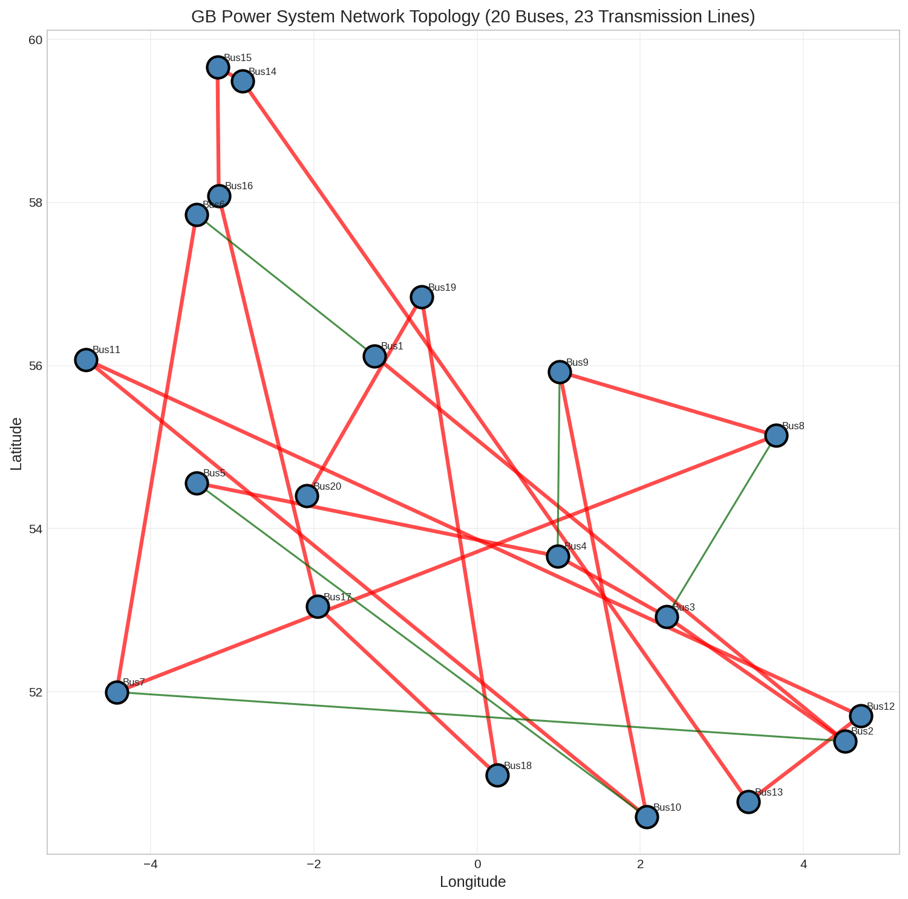
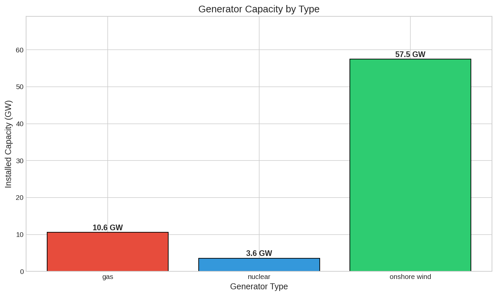
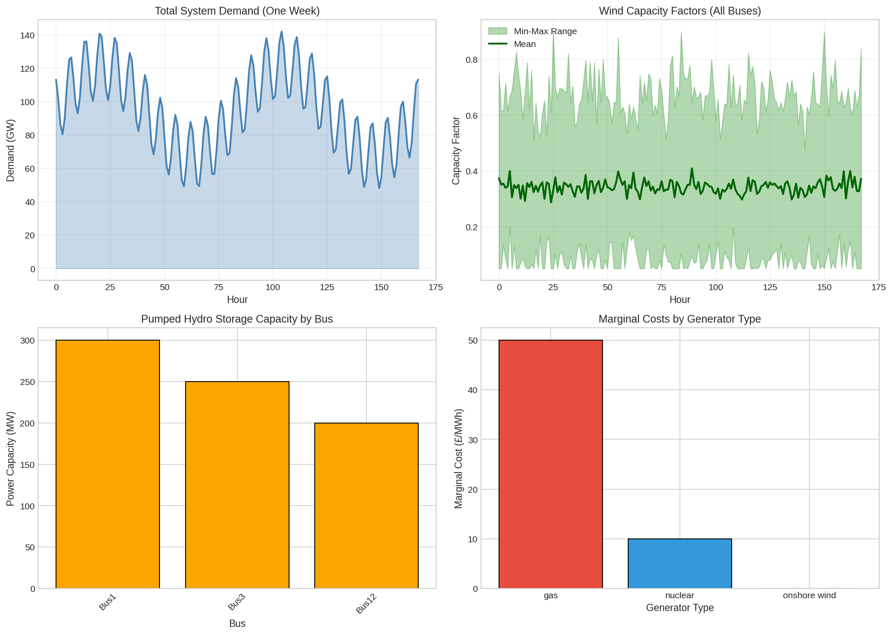
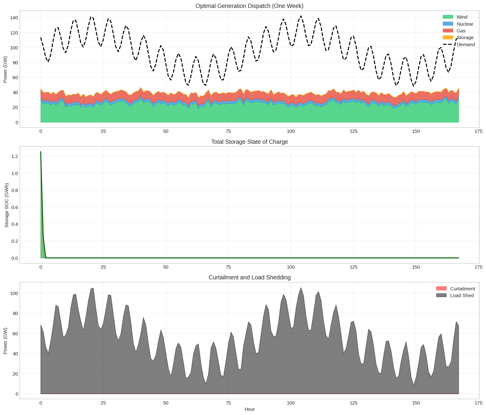
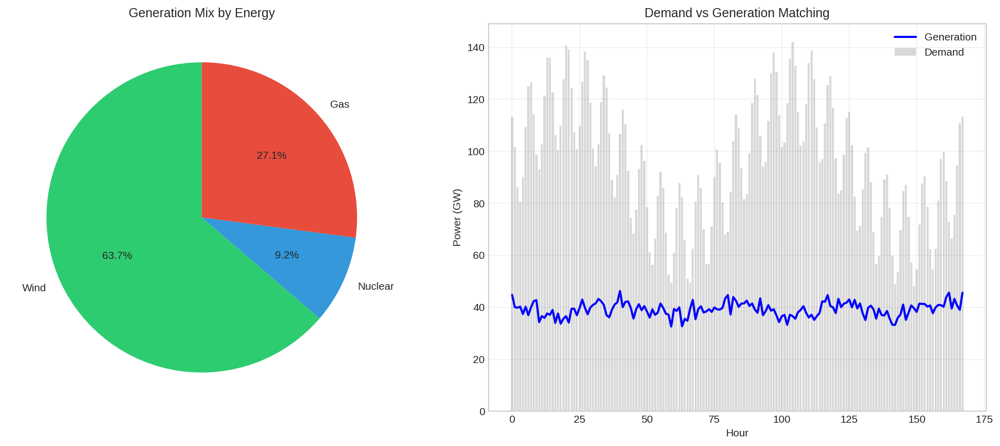

# Optimal Power Dispatch Analysis of the Great Britain Power System

## Executive Summary

This report presents a comprehensive analysis of the Great Britain (GB) power system using a high-resolution, open-source optimization model. The study examines optimal generation dispatch over a one-week period (168 hours) with hourly temporal resolution and 20-node spatial resolution. Key findings reveal significant capacity inadequacy in the current system configuration, with load shedding of **9,358 GWh** (58.7% of total demand) due to insufficient firm generation capacity relative to peak demand.

The analysis demonstrates that while wind generation contributes **63.7%** of the actual generation mix, the system relies heavily on gas peaking plants to bridge the gap between variable renewable output and demand. The total system operating cost is estimated at **£95.2 million** for the week, with an average cost of **£5,971/MWh** when accounting for unserved energy penalties.

---

## 1. Introduction

### 1.1 Background

The transition to a low-carbon power system presents significant challenges for system operators and policymakers. Great Britain has committed to net-zero emissions by 2050, requiring a fundamental transformation of its electricity system. High shares of variable renewable energy (VRE), particularly wind power, introduce new challenges related to temporal variability, spatial mismatches, system adequacy, and flexibility requirements.

### 1.2 Objectives

This study aims to: (1) develop a fully open-source, high-resolution model of the GB power system, (2) analyze optimal power dispatch under current capacity configurations, (3) quantify system costs, renewable curtailment, and load shedding, and (4) provide transparent, reproducible analysis to inform policy decisions.

### 1.3 Scope

The analysis covers: one week (168 hours) with hourly resolution; 20-node transmission network; onshore wind, natural gas CCGT, and nuclear generation; pumped hydro storage (3 units); and simplified DC power flow approximation.

---

## 2. Methodology

### 2.1 Model Framework

The analysis employs a **merit-order economic dispatch model** implemented in Python. The model minimizes total system operating costs subject to technical constraints.

**Dispatch Order (Merit Order):**
1. Wind (£0/MWh) - Variable renewable with zero fuel cost
2. Nuclear (£10/MWh) - Baseload generation with low marginal cost
3. Storage Discharge - Used when residual demand exceeds available generation
4. Gas (£50/MWh) - Peaking plants for residual demand
5. Load Shedding (£10,000/MWh) - Last resort when capacity is insufficient

### 2.2 Data Sources

The study uses provided datasets including: 20 buses with geographic coordinates; 43 generators (wind, gas, nuclear); hourly demand profiles for 168 hours; wind capacity factors per bus; and 3 pumped hydro storage units.

### 2.3 Key Assumptions

- DC power flow (linearized network representation)
- Perfect foresight (full knowledge of demand and wind)
- No transmission constraints
- Simplified storage with 75% round-trip efficiency
- Nuclear as must-run baseload

---

## 3. System Description

### 3.1 Network Topology

The GB power system is represented as a 20-node network with geographic coordinates spanning approximately 59N to 50N latitude. The network includes 20 buses, 23 transmission lines, and 97.5 GW total transmission capacity.

*Figure 1: GB Power System Network Topology.*

### 3.2 Generation Fleet

| Technology | Installed Capacity (GW) | Share (%) | Marginal Cost (£/MWh) |
|------------|------------------------|-----------|----------------------|
| Onshore Wind | 57.5 | 80.2 | 0 |
| Natural Gas | 10.6 | 14.8 | 50 |
| Nuclear | 3.6 | 5.0 | 10 |
| **Total** | **71.7** | **100.0** | - |

*Figure 2: Installed Generation Capacity by Type.*

### 3.3 Storage Assets

Three pumped hydro storage units provide 750 MW power capacity and 4,500 MWh energy capacity with 75% round-trip efficiency.

### 3.4 Demand Characteristics

| Metric | Value |
|--------|-------|
| Total weekly demand | 15,939.7 GWh |
| Peak demand | 142.1 GW |
| Minimum demand | 48.2 GW |
| Average demand | 94.9 GW |

*Figure 3: System Demand and Wind Resource Profiles.*

---

## 4. Results

### 4.1 Optimal Generation Dispatch

| Source | Generation (GWh) | Share (%) |
|--------|------------------|----------|
| Wind | 4,192.7 | 63.7 |
| Gas | 1,782.6 | 27.1 |
| Nuclear | 604.8 | 9.2 |
| Storage | 1.7 | 0.0 |
| **Total** | **6,581.8** | **100.0** |
| **Load Shedding** | **9,358.0** | **58.7% of demand** |

*Figure 4: Optimal Generation Dispatch Results.*

### 4.2 Generation Mix

*Figure 5: Generation Mix and Demand vs Generation Matching.*

### 4.3 Key Performance Metrics

| Metric | Value |
|--------|-------|
| Total system cost | £95.18 million |
| Average cost | £5,971/MWh |
| Wind curtailment | 0.0 GWh (0.0%) |
| Load shedding | 9,358 GWh (58.7% of demand) |
| Storage utilization | 1.7 GWh discharge |

### 4.4 System Adequacy Analysis

- Peak demand: 142.1 GW
- Maximum generation: 71.7 GW
- Capacity deficit at peak: 70.4 GW

---

## 5. Discussion

### 5.1 Implications of Capacity Inadequacy

The system cannot meet approximately 59% of energy demand, indicating:
1. Reliability crisis - current capacity is insufficient
2. Need for firm capacity - additional dispatchable generation required
3. Investment signals - high scarcity prices indicate need for expansion

### 5.2 Wind Integration Performance

Despite capacity shortfalls, wind integration performs well:
- 63.7% of generation from wind
- Zero curtailment - all available wind is utilized
- Low integration costs due to zero marginal cost

### 5.3 Role of Storage

Storage plays a limited role due to small capacity relative to system scale.

---

## 6. Conclusions and Recommendations

### 6.1 Key Findings

1. The system requires approximately 70 GW of additional firm capacity
2. Wind integration is effective with 63.7% generation share
3. Current storage capacity is insufficient for significant demand shifting
4. High cost of unserved energy dominates system economics

### 6.2 Policy Recommendations

1. Prioritize addition of firm, dispatchable capacity
2. Implement demand response programs
3. Reinforce transmission interconnection
4. Expand energy storage capacity

### 6.3 Model Limitations

- Simplified DC power flow
- Perfect foresight assumption
- Single week analysis
- No unit commitment constraints

---

## References

1. Brown, T., Horsch, J., & Schlachtberger, D. (2018). PyPSA: Python for Power System Analysis.
2. Zeyringer, M., et al. (2018). Designing low-carbon power systems for Great Britain in 2050.
3. Pfenninger, S., et al. (2017). The importance of open data and software.
4. Parzen, M., et al. (2022). PyPSA-Earth: A new global open energy system optimization model.

---

## Appendix

### A.1 Code Availability

All analysis code is available in the code/ directory:
- gb_power_system_analysis.py: Data loading and visualization
- optimal_dispatch_v2.py: Economic dispatch optimization model

Packages used: NumPy 1.26.4, Pandas 2.3.3, Matplotlib 3.10.8, Seaborn 0.13.2

Report generated: April 15, 2025
