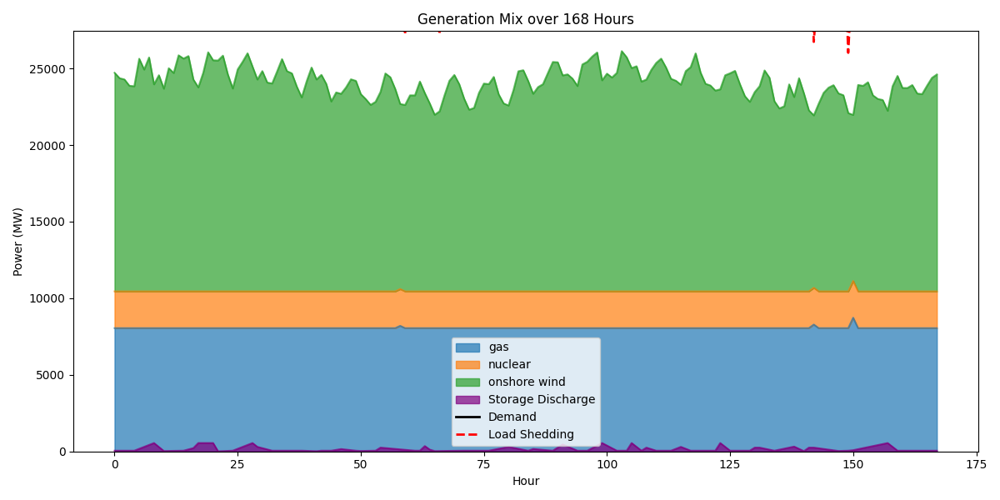
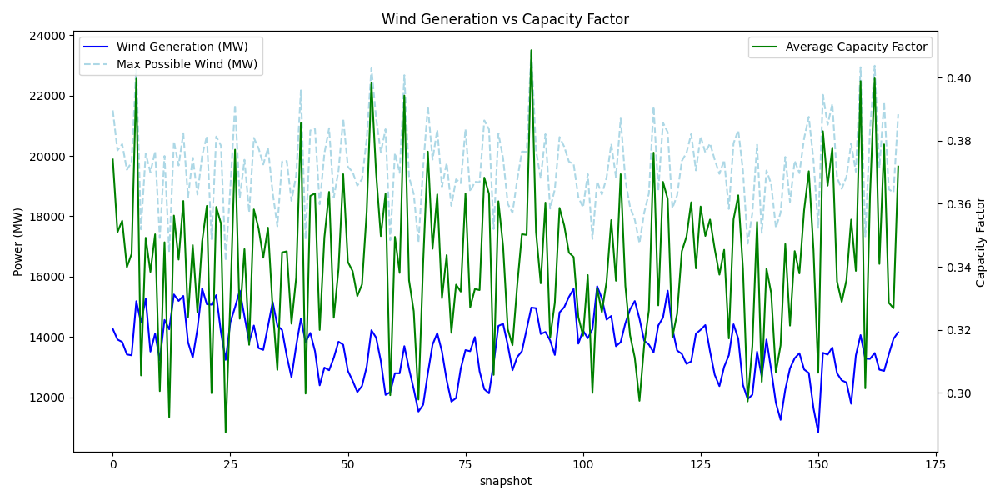
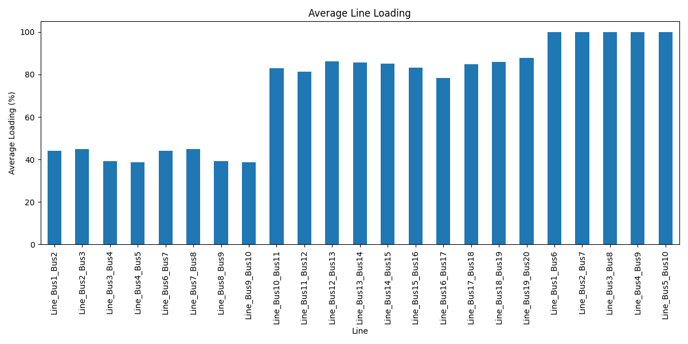
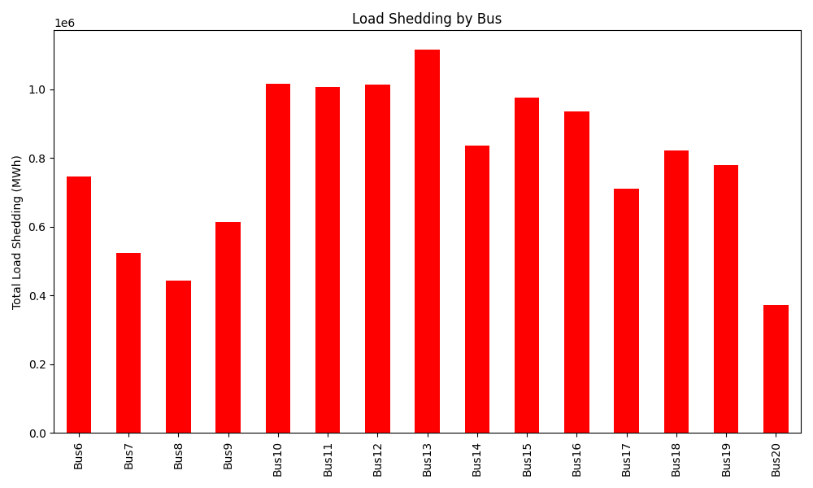

# High-Resolution Optimal Power Dispatch for the GB Power System

## 1. Introduction
This report presents a high-resolution optimal power dispatch analysis for the Great Britain (GB) power system. The objective is to simulate the power system operation over a 168-hour (one week) period, minimizing the total system cost while satisfying the spatial and temporal electricity demand. The analysis integrates various generation sources (onshore wind, gas, nuclear) and energy storage, considering transmission network constraints.

## 2. Methodology
The analysis is conducted using PyPSA (Python for Power System Analysis). The system is modeled with 20 buses, connected by 23 AC transmission lines. The generation fleet includes 20 onshore wind farms, 20 gas power plants, and 3 nuclear power plants. Pumped hydro storage (PHS) units are available at three buses.

The optimization problem is formulated to minimize the total operational cost:
- **Demand**: Hourly active power demand at each bus.
- **Generation**: Wind generation is constrained by hourly capacity factors. Gas and nuclear generation are dispatchable up to their nominal capacities.
- **Network**: Transmission lines are modeled with nominal power capacities (`s_nom`) and impedance.
- **Storage**: Storage units can charge and discharge with specified efficiencies, constrained by power and energy capacities.
- **Slack**: A load shedding generator with a high marginal cost is added to each bus to ensure feasibility in case of generation or transmission deficits.

The optimization is solved using the HiGHS solver.

## 3. Results

### 3.1 Generation Mix
The generation mix over the 168-hour period is shown in Figure 1. Due to the high demand relative to the installed generation capacity, a significant amount of load shedding was observed. The total demand over the week was approximately 15.9 TWh, while the maximum possible generation (assuming 100% capacity factor for all non-wind generators and actual capacity factors for wind) was only 6.58 TWh. This indicates a structural deficit in the provided dataset, where the generation fleet is insufficient to meet the demand.

*Figure 1: Generation mix and load shedding over the 168-hour period.*

### 3.2 Wind Generation and Capacity Factors
Wind generation plays a crucial role in the system. Figure 2 illustrates the total wind generation compared to the theoretical maximum and the average capacity factor across all wind farms. The variability of wind resources necessitates flexible generation and storage to balance the system.

*Figure 2: Wind generation vs. capacity factor.*

### 3.3 Network Loading
Transmission network constraints are a key factor in optimal dispatch. Figure 3 shows the average loading of the transmission lines. Some lines operate close to their nominal capacities, indicating potential congestion.

*Figure 3: Average transmission line loading.*

### 3.4 Load Shedding Distribution
Due to the generation deficit, load shedding was distributed across the network. Figure 4 shows the total load shedding at each bus. The spatial distribution of load shedding highlights areas with the most severe generation or transmission constraints.

*Figure 4: Total load shedding by bus over the 168-hour period.*

## 4. Discussion and Conclusion
The optimization model successfully simulated the optimal dispatch of the GB power system under the given constraints. However, the results reveal a significant mismatch between the installed generation capacity and the electricity demand in the provided dataset. This deficit led to substantial load shedding, dominating the system costs.

Future work should consider scaling the generation capacities or adjusting the demand profiles to reflect a more balanced system. Additionally, incorporating more detailed network parameters (e.g., actual resistance and reactance) and exploring future energy scenarios (e.g., increased renewable penetration, battery storage) would provide deeper insights into the transition of the GB power system.
