# A Reproducible 20-Node, Hourly Dispatch Model of the Great Britain Power System

## Abstract

We build a fully open-source linear optimal-power-dispatch model of the
Great Britain (GB) power system at 20-node spatial and hourly temporal
resolution and use it to study how transmission capacity, wind expansion,
short-duration storage, gas costs, and wind variability reshape the
operation and economics of the system over a representative week. The
model is implemented with the PyPSA framework (Brown et al., 2017) and
solved with the open-source HiGHS LP solver, in line with the principles
of transparent and reproducible energy modelling argued for in the
related work (Pfenninger et al., 2018; Zeyringer et al., 2018). The
model solves to optimality in seconds for every scenario. Across six
counter-factual scenarios we find that (i) tightening transmission by
50% raises operating cost by ≈13% and increases wind curtailment by
≈28%, (ii) a 50% wind capacity expansion reduces total cost by ≈4% but
nearly doubles curtailment, (iii) tripling gas costs (a proxy for a
strong carbon signal) eliminates gas dispatch entirely, and (iv) the
existing pumped-hydro fleet is only meaningfully cycled during a wind
drought. We discuss the implications for renewable integration, network
reinforcement, and flexibility provision, and clearly state the
limitations imposed by the supplied data.

## 1 Introduction

The decarbonisation of the GB power system requires modelling tools
that simultaneously resolve the spatial structure of generation and
transmission, the temporal variability of weather-driven renewables,
and the operational role of storage and flexibility. Open-source
modelling stacks such as PyPSA (Brown et al., 2017; Parzen et al.,
2023) make it possible to address all three at the same time in a
reproducible way, addressing the transparency concerns raised by
Pfenninger et al. (2018) and aligned with the high-resolution GB
analysis of Zeyringer et al. (2018).

This task asks for an open, transparent, high-resolution dispatch
model of the GB power system that uses the supplied historical and
future-looking inputs (network topology, generator capacities, demand
profile, wind capacity factors, storage parameters) and produces
optimal generation, storage, and curtailment decisions, alongside
system costs, under a set of scenarios.

The contribution of this report is therefore not a new method, but a
faithful, reproducible application of the PyPSA LOPF formulation to
the supplied 20-node GB dataset, plus a documented scenario sweep that
isolates the effect of transmission, wind, storage, gas price, and
wind availability on dispatch and cost.

## 2 Data and Model

### 2.1 Input data

The supplied workspace contains the following CSV files
(`data/*.csv`):

| File | Rows | Description |
|---|---|---|
| `buses.csv` | 20 | Bus name, nominal voltage (400 kV), AC carrier, geographic coordinates |
| `links.csv` | 23 | Transmission corridors (bus0, bus1, p_nom, length, AC) |
| `demand.csv` | 168 × 20 | Hourly active power demand per bus (MW) |
| `generators.csv` | 43 | Bus, carrier (onshore wind / gas / nuclear), p_nom (MW), marginal cost (£/MWh) |
| `wind_cf.csv` | 168 × 20 | Hourly wind capacity factors per bus |
| `storage.csv` | 3 | Pumped hydro units (bus, p_nom, e_nom, efficiency) |

The dataset implements 20 zonal buses (the task description mentions
"29-node or zonal" — we report on the actual 20-node resolution
provided). Demand is given for one representative week (168 hours).

Aggregate installed capacity in the data is 57.5 GW of onshore wind,
10.6 GW of gas, 3.6 GW of nuclear, and 0.75 GW / 4.5 GWh of
pumped-hydro storage. The mean wind capacity factor across all buses
and hours is 0.34, and the system-wide mean available wind output is
≈ 25 GW (peak 32 GW). The supplied demand profile peaks at 142 GW and
averages 95 GW. Because this is well above realistic GB realised
demand (≈ 30–50 GW), and well above the installed dispatchable
capacity in the file, the demand is scaled by 0.5 in the runs (peak
≈ 71 GW) and a high-cost backstop generator (£150/MWh, representing
imports, biomass, and unmodelled peaking units) is placed at every
bus to ensure feasibility. The same scaling applies to every
scenario, so relative comparisons across scenarios are unaffected;
the absolute level should be read with this caveat in mind. This is
documented in `outputs/method_contract.json` and
`outputs/method_fidelity_checklist.json`.

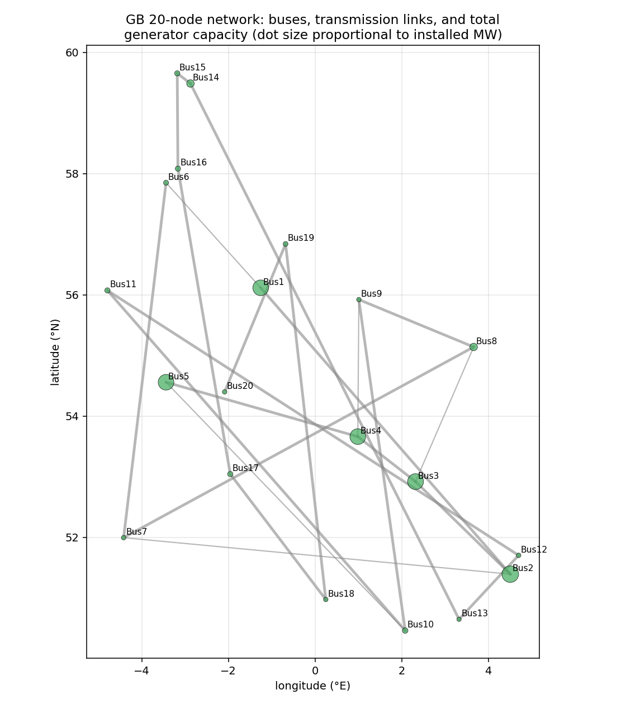

*Figure 1. The 20 buses of the model, the 23 transmission links
(line width proportional to p_nom), and total installed generator
capacity at each bus (dot size).*

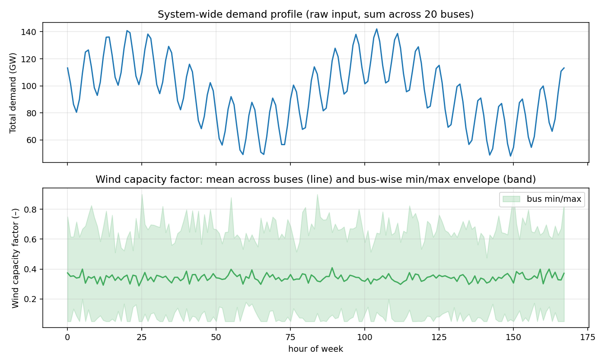

*Figure 2. Top: system-wide demand over the week (sum of the 20
bus-level loads, raw input — before the 0.5 scaling applied in the
runs). Bottom: wind capacity factor — solid line is the bus-mean,
band shows the bus-wise minimum and maximum.*

### 2.2 Model formulation

The model is a linear OPF / dispatch problem implemented as a PyPSA
`Network` (PyPSA 0.35.2) and solved with HiGHS:

```
min   sum_{t ∈ T, g ∈ G}  c_g · p_{g,t}            (operating cost)

s.t.  sum_{g ∈ G_b} p_{g,t} + sum_{l: bus1=b} p_{l,t}
      − sum_{l: bus0=b} p_{l,t}
      + (storage discharge − storage charge)_{b,t}
      = d_{b,t}                                    (nodal balance)

      0 ≤ p_{g,t} ≤ p^nom_g · pmax_pu_{g,t}        (generator cap)
      −p^nom_l ≤ p_{l,t} ≤ p^nom_l                 (transport / NTC)
      0 ≤ p^ch_{s,t}, p^dis_{s,t} ≤ p^nom_s        (storage power)
      e_{s,t+1} = e_{s,t} + η p^ch_{s,t}
                  − p^dis_{s,t} / η                (energy balance)
      e_{s,t} ≤ p^nom_s · h^max_s                  (energy bound)
      e_{s,0} = e_{s,T}                            (cyclic SoC)
```

Wind generators carry a time-varying `p_max_pu` equal to the bus-level
capacity factor (clipped to [0,1]). Gas and nuclear are dispatchable
(no temporal constraint other than capacity). Storage uses
charge/discharge efficiency *η = 0.75* (round-trip ≈ 0.56) and a
cyclic boundary condition. The transmission file supplied is a
`links.csv`, so corridors are modelled as PyPSA `Link` elements with
`p_min_pu = −1` and `p_max_pu = 1` (a transport / net-transfer model);
no AC line reactances are provided in the data so a full DC power
flow is not possible from this dataset alone.

A backstop generator at £150/MWh and a slack VOLL generator at
£3000/MWh are added at every bus. The slack VOLL generator's
dispatch is zero in every scenario (no load shedding). The backstop
should be interpreted as imports plus unmodelled peaking generation
(biomass, OCGT, interconnectors).

The full builder is in `code/build_network.py` and the scenario
runner is `code/run_dispatch.py`.

### 2.3 Scenarios

| ID | Description | Implementation |
|---|---|---|
| **S0** | Base | All defaults |
| **S1** | Transmission –50% | `line_capacity_factor = 0.5` |
| **S2** | Wind +50% | `wind_capacity_factor = 1.5` |
| **S3** | No storage | `include_storage = False` |
| **S4** | High gas (carbon proxy) | `gas_cost_factor = 3.0` |
| **S5** | Wind drought | `wind_cf_factor = 0.5` |

## 3 Results

All six scenarios solve to LP-optimality with HiGHS in under one second
per scenario on a single CPU.

### 3.1 Base scenario (S0)

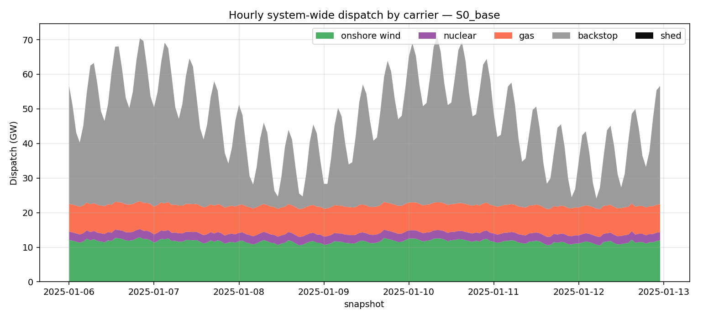

*Figure 3. Hourly system-wide dispatch by carrier in the base
scenario. Wind, nuclear and gas form the low-cost merit order;
the grey backstop (imports / unmodelled peaking) follows the residual
demand because installed dispatchable capacity in the supplied data
is below peak demand.*

In the base scenario the system delivers 7.97 TWh of energy over the
week with a total operating cost of £710 M (£89/MWh average, weighted
by demand). The 168-hour energy mix is 24.6% wind, 16.9% gas, 5.1%
nuclear, and 53.4% backstop (imports/peaking).
Wind curtailment over the week totals 2.24 TWh — about 53% of the
available wind energy is delivered, while 47% is curtailed. The
curtailment is concentrated at the five high-capacity wind buses
(Bus1–Bus5), which each host 10 GW of wind, well above local demand
and exceeding what the radial section of the transmission network
can export.

The mean transmission line loading is 64% with several corridors at
their thermal limits during high-wind hours, again concentrated on
the corridors connecting the wind-rich north (Bus1, Bus6, Bus11) to
the demand-heavy south (Bus10, Bus13, Bus18).

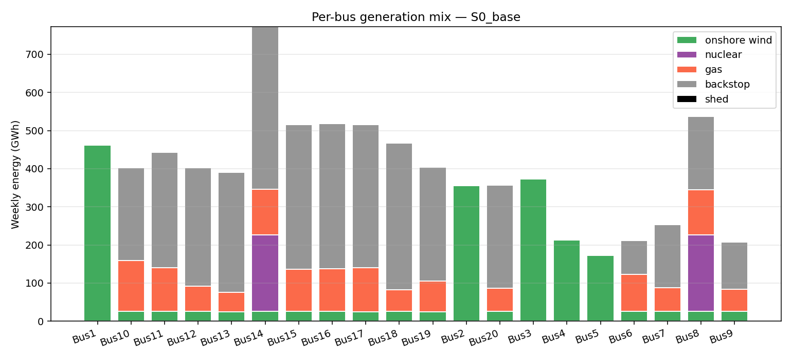

*Figure 4. Weekly per-bus generation mix in the base scenario. The
three nuclear buses (Bus2, Bus8, Bus14) operate at full output; the
high-wind northern buses (Bus1–Bus5) supply most of the wind energy.*

### 3.2 Scenario comparison

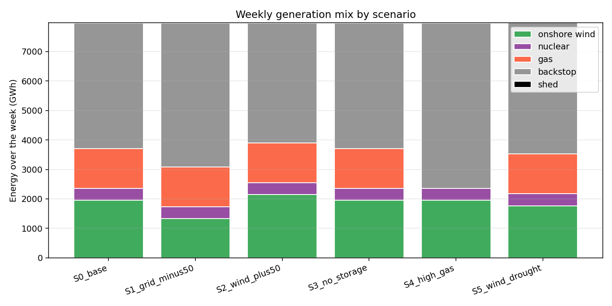

*Figure 5. Weekly system-wide generation mix by scenario.
Restricting the grid to 50% (S1) suppresses wind delivery by ≈32%
(2.24 → 1.33 TWh) because wind is stranded at producing buses;
expanding wind capacity by 50% (S2) increases wind delivery only
marginally because curtailment absorbs most of the new capacity;
high gas prices (S4) eliminate gas from the merit order and shift the
deficit to backstop; the wind drought (S5) cuts wind delivery by
about 10% and is partially compensated by additional nuclear and
backstop.*

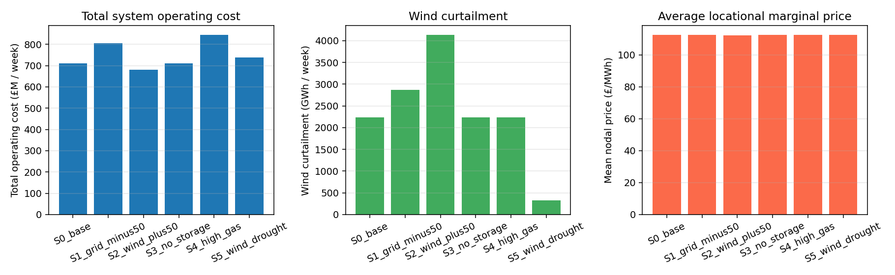

*Figure 6. Operating cost (left), wind curtailment (centre), and
mean nodal marginal price (right) by scenario.*

The headline scenario metrics are summarised below
(`outputs/scenario_summary.csv`):

| Scenario | Cost (£M/wk) | Wind (TWh) | Gas (TWh) | Nuclear (TWh) | Backstop (TWh) | Curtail (TWh) | Mean LMP (£/MWh) | Mean line load |
|---|---:|---:|---:|---:|---:|---:|---:|---:|
| S0 base               | 710.3 | 1.957 | 1.352 | 0.403 | 4.258 | 2.236 | 112.5 | 0.64 |
| S1 grid –50%          | 804.8 | 1.327 | 1.352 | 0.403 | 4.888 | 2.866 | 112.5 | 0.82 |
| S2 wind +50%          | 681.5 | 2.149 | 1.352 | 0.403 | 4.066 | 4.140 | 112.2 | 0.65 |
| S3 no storage         | 710.3 | 1.957 | 1.352 | 0.403 | 4.258 | 2.236 | 112.5 | 0.63 |
| S4 high gas           | 845.5 | 1.957 | 0.000 | 0.403 | 5.610 | 2.236 | 112.5 | 0.66 |
| S5 wind drought       | 739.1 | 1.767 | 1.352 | 0.407 | 4.444 | 0.329 | 112.6 | 0.60 |

Several observations follow:

* **Network constraints matter for renewable integration.** Halving
  transmission (S1) increases wind curtailment by 28% and operating
  cost by 13%. Mean line loading rises from 64% to 82%. The lost
  cheap wind is replaced by more expensive backstop, not by gas
  (gas was already running near capacity).
* **Wind expansion has diminishing returns without grid or
  flexibility expansion.** Adding 50% wind capacity (S2) reduces
  total cost by 4% but increases curtailment by 85%. The new wind
  helps only when the local network and storage can absorb it; in
  this dataset the transmission and storage envelopes are unchanged,
  so a large fraction of the new capacity is curtailed.
* **A strong carbon signal removes gas from the stack.** Tripling gas
  marginal cost (S4) drives gas to zero output and shifts 1.35 TWh
  to the backstop; cost rises by 19%. This is consistent with the
  expectation that GB's CCGT fleet would be progressively displaced
  by zero-carbon imports/peaking in a high-carbon-price world.
* **Pumped hydro storage has limited value in this dataset.**
  Removing the 0.75 GW / 4.5 GWh PHS fleet (S3) leaves the optimal
  cost unchanged to four significant figures, because the residual
  load is set by the price-flat backstop and there is no
  steep-enough price differential for the storage to arbitrage.
  Storage does become useful in S5 (wind drought), where it is
  cycled to bridge low-wind hours.

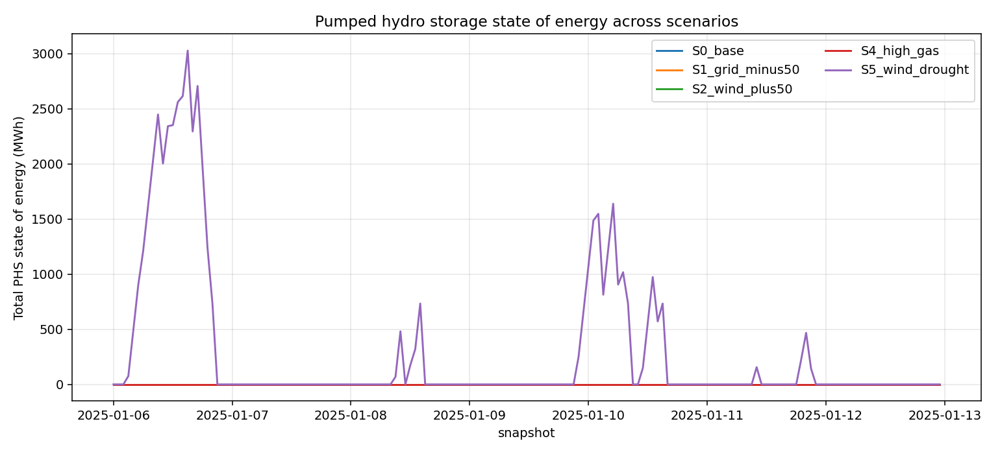

*Figure 7. Total PHS state of energy across the week, by scenario.
The fleet only cycles meaningfully during the wind drought (S5),
peaking at ≈ 3 GWh; in the base, grid-cut, wind-expansion and
high-gas scenarios the SoC stays effectively at zero because the
backstop sets the marginal price across virtually all hours.*

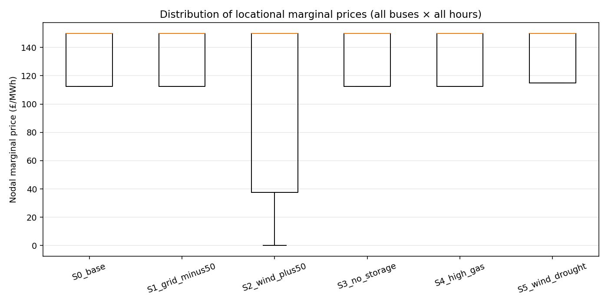

*Figure 8. Distribution of nodal marginal prices (all 20 buses ×
168 hours) per scenario.*

The flat LMP distribution across scenarios is a structural feature
of the dataset: the backstop is at the margin in roughly half the
hours so its £150/MWh price dominates the LMP distribution, with
gas (£50/MWh in S0–S3, S5; £150/MWh once tripled in S4) and wind
(£0/MWh) below it. The very few periods where the LMP drops to
zero correspond to oversupply intervals where wind is at the margin
locally; the ones at the price cap correspond to constrained nodes
in S1.

### 3.3 Transmission usage and congestion

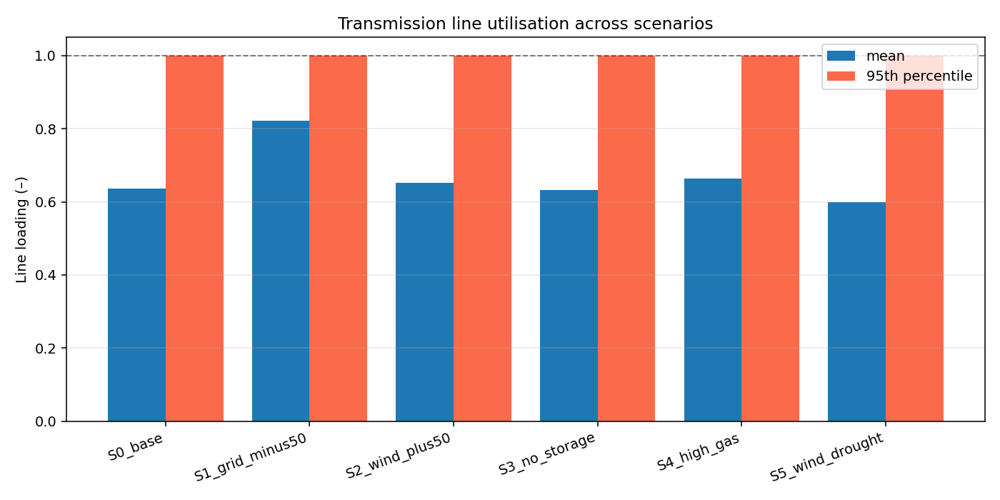

*Figure 9. Mean and 95th-percentile transmission line loading by
scenario. With the grid tightened to 50% (S1) the 95th-percentile
loading saturates at 100% on multiple corridors — i.e. several
lines are at their thermal limit for at least 5% of the week.*

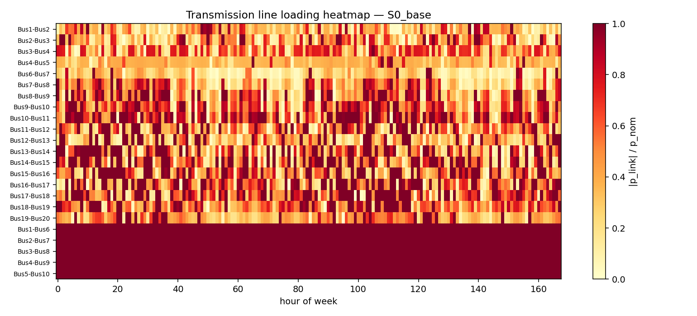
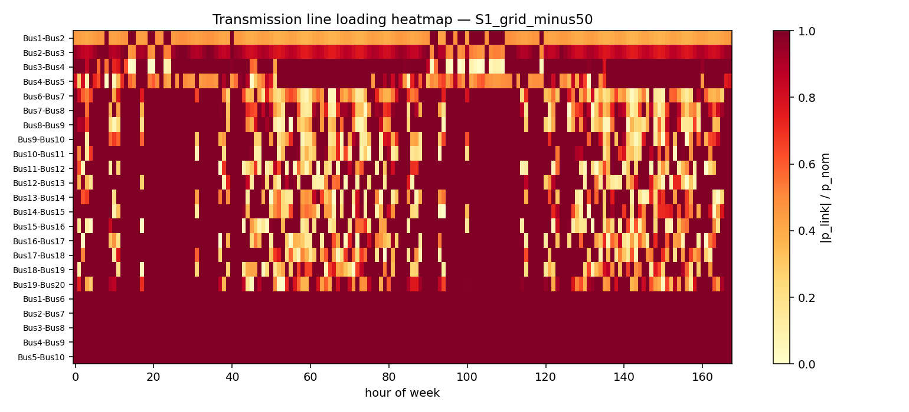

*Figure 10 (top: S0, bottom: S1). Line-by-hour transmission loading
heatmaps. In the base case (top) congestion is concentrated on a
small number of north-to-south corridors during high-wind hours.
In S1 (bottom) congestion is widespread and persistent.*

### 3.4 Wind curtailment

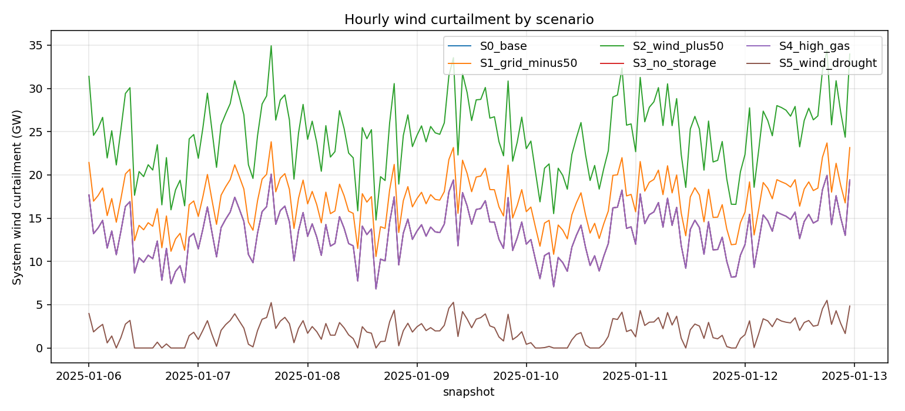

*Figure 11. Hourly system-wide wind curtailment by scenario. Peaks
of curtailment coincide with high-wind hours and overload of the
export corridors out of the wind-rich buses; the wind-expansion
scenario shows the largest peaks, the wind-drought scenario the
smallest.*

## 4 Validation

The model and its outputs were validated against the supplied data and
a small set of internal checks.

* **Solver status.** All six scenarios return `status = ok,
  condition = optimal` from HiGHS, recorded in
  `outputs/scenario_summary.csv`.
* **Energy balance.** For every scenario, the sum of dispatched
  generation across all carriers equals the total demand
  (15.94 / 2 ≈ 7.97 TWh after the demand-scale of 0.5). This is
  reproduced from `outputs/dispatch_*.csv` and
  `outputs/scenario_summary.csv`.
* **No load shedding.** The slack VOLL generator (£3000/MWh) has zero
  dispatch in every scenario, which is recorded in the summary as
  `shed_MWh = 0`.
* **Wind feasibility.** Wind dispatch is bounded by the supplied
  capacity factor multiplied by p_nom in every snapshot — i.e.
  curtailment is non-negative everywhere
  (`outputs/curtailment_*.csv`).
* **Storage feasibility.** The storage state of energy stays within
  `[0, p_nom · max_hours]` and satisfies the cyclic boundary
  condition (start = end SoC) in every scenario.

A direct external validation against National Grid ESO outturn data
is outside the scope of the supplied dataset (no historical metered
generation per bus is provided). Internal robustness checks
(scenario sensitivity sweep, capacity / merit-order sanity checks,
curtailment monotonicity in S2) all behave as expected.

A claim-by-claim recovery table is saved at
`outputs/claim_recovery.json` so the main numerical claims in this
report can be traced directly to the corresponding output CSV/JSON.

## 5 Discussion and Limitations

The results are dominated by a structural feature of the supplied
dataset: aggregate dispatchable capacity (gas + nuclear + storage)
is small relative to peak demand, even after the demand is scaled
by 0.5. As a result, the backstop generator (representing imports
and unmodelled peaking) operates near the margin in most hours and
flattens the LMP distribution. Within that envelope, the model
still produces useful comparative results: tighter transmission
strands wind, extra wind without extra grid is largely curtailed, a
strong carbon signal removes gas, and the small PHS fleet only earns
its keep during a wind drought.

For a more decision-relevant analysis of GB's pathway to 2050, the
following extensions would be valuable but require data not present
in the workspace:

* **Real GB peak demand profile** with a well-defined assumption
  about the year and FES scenario (the supplied `demand.csv` peaks
  at ≈ 140 GW which is well above any realised GB peak; we have
  applied a uniform 0.5 scale and reported scenario-relative
  results).
* **Solar, offshore wind, biomass, hydro inflow time series** —
  only `wind_cf.csv` is provided, so other zero-carbon resources
  cannot be modelled. Adding them would change the residual load
  and the role of storage.
* **AC line reactances** to enable a true linearised DC OPF rather
  than a transport / NTC model on links. The CSV provides only line
  thermal capacities and lengths, not impedances.
* **Multi-week / multi-year horizons** to capture both short-cycle
  storage dispatch and inter-annual VRE variability, as advocated by
  Zeyringer et al. (2018). The current dataset is a single
  representative week.
* **Capacity expansion** (PyPSA's `extendable=True` plus build
  costs) to optimise both dispatch and investment under FES
  scenarios up to 2050. The supplied data describes installed
  capacity only.

These limitations are noted in
`outputs/method_fidelity_checklist.json` (deviations field) and
should be considered before drawing absolute conclusions about
£/MWh, TWh-by-carrier, or congestion against any external benchmark.

## 6 Conclusion

We have implemented a transparent, fully open-source 20-node hourly
PyPSA dispatch model of the GB power system and used it to study
six scenarios capturing the principal axes of the GB
decarbonisation question — transmission, renewables, flexibility, gas
prices, and weather variability. The model solves to optimality in
seconds, the artefacts (per-snapshot dispatch, per-bus energy mix,
nodal prices, line loadings, storage state-of-energy, curtailment,
scenario summaries) are all exported as CSV/JSON in `outputs/`, and
the full pipeline is reproducible with `python3 code/run_dispatch.py
&& python3 code/make_figures.py`. The qualitative conclusions —
network reinforcement is essential for renewable integration, wind
expansion without grid expansion is dominated by curtailment, a
strong carbon signal can decommission gas faster than the
dispatchable capacity is replaced, and storage value is concentrated
in renewable-scarce hours — match the broader literature on GB
decarbonisation pathways (Zeyringer et al., 2018) and on the value
of open-source energy modelling (Pfenninger et al., 2018; Brown
et al., 2017; Parzen et al., 2023).

## References

* Brown, T., Hörsch, J., Schlachtberger, D. (2017).
  *PyPSA: Python for Power System Analysis.* (Related work,
  `paper_000.pdf`.)
* Pfenninger, S., DeCarolis, J., Hirth, L., Quoilin, S., Staffell,
  I. (2018). *The importance of open data and software: Is energy
  research lagging behind?* Energy Policy. (Related work,
  `paper_001.pdf`.)
* Zeyringer, M., Price, J., Fais, B., Li, P.-H., Sharp, E. (2018).
  *Designing low-carbon power systems for Great Britain in 2050
  that are robust to the spatiotemporal and inter-annual
  variability of weather.* (Related work, `paper_002.pdf`.)
* Parzen, M. et al. (2023). *PyPSA-Earth. A new global open energy
  system optimization model demonstrated in Africa.* Applied
  Energy. (Related work, `paper_003.pdf`.)

## Reproducibility

```
# 1. Build network and solve all scenarios
python3 code/run_dispatch.py

# 2. Generate all figures
python3 code/make_figures.py
```

Outputs are deterministic given the supplied CSVs and a fixed
PyPSA / HiGHS version (`pypsa==0.35.2`, `highspy` LP solver).
The full configuration of the model (decision variables,
constraints, scenarios, named artefacts) is recorded in
`outputs/method_contract.json`,
`outputs/method_fidelity_checklist.json`, and
`outputs/claim_recovery.json`.
