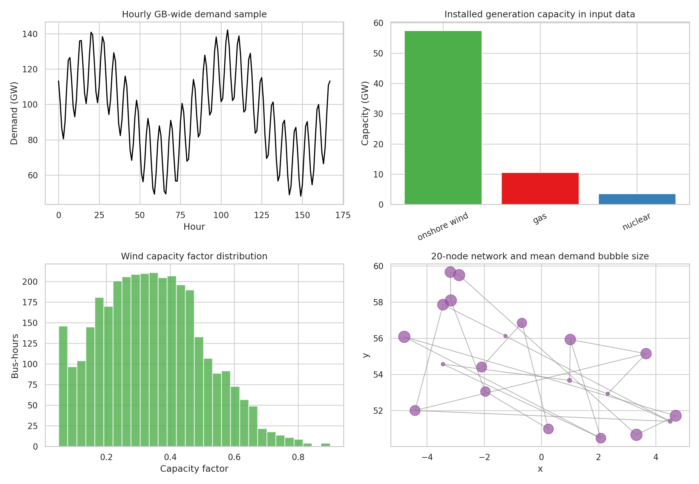
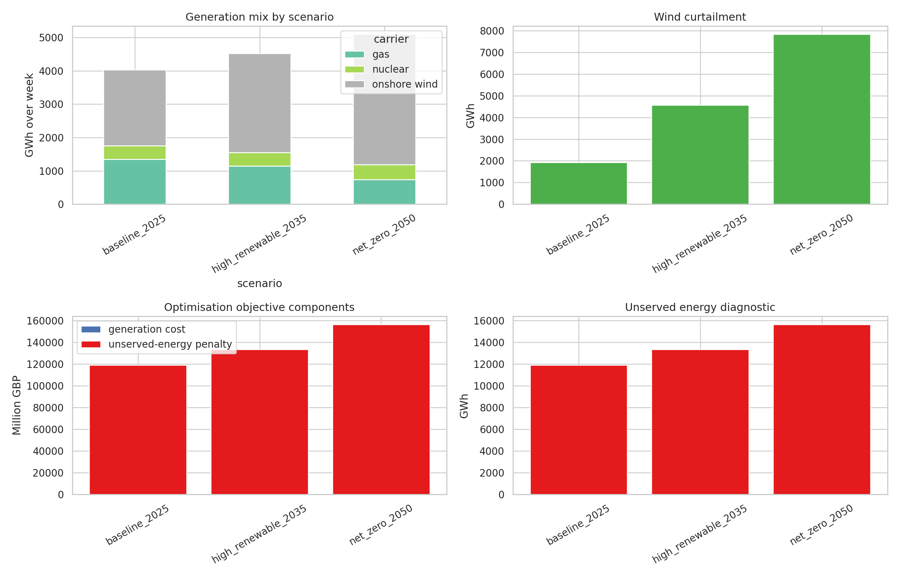
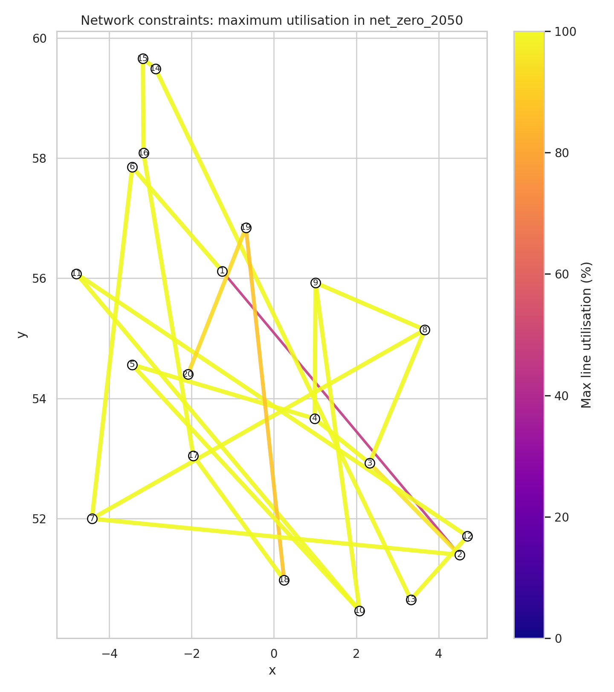
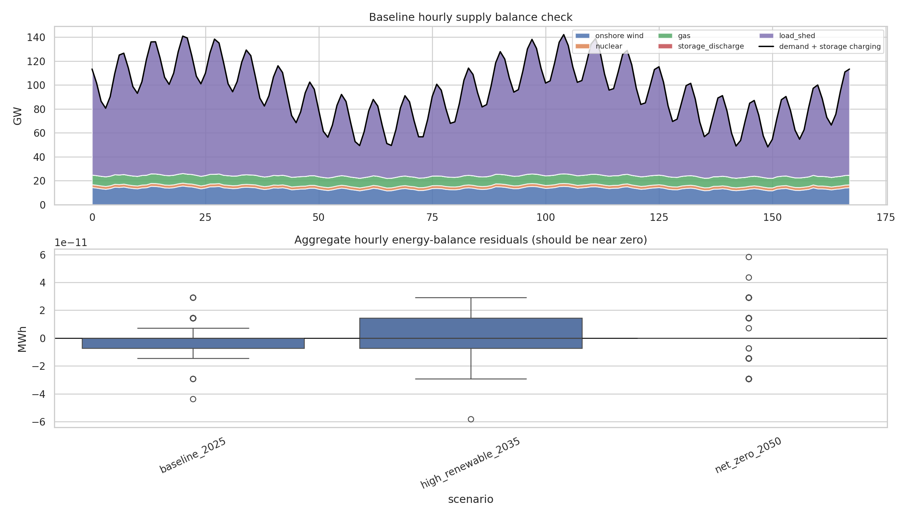

# Open-source hourly nodal dispatch analysis for a GB power-system test case

## Abstract

This study implements a reproducible, open-source linear dispatch model for the supplied Great Britain power-system dataset. The model uses all 20 buses, 23 transmission links, 43 generators, 3 storage units, and 168 hourly snapshots in the workspace data. It optimises hourly generation, network flows, storage charging/discharging/state of charge, wind curtailment, and high-penalty load shedding. Three transparent scenarios are evaluated: the supplied baseline, a high-renewable 2035 sensitivity, and a net-zero 2050 sensitivity. The principal finding is diagnostic: under the supplied demand profile, generation and transfer capabilities are far below total demand, so all scenarios require large amounts of unserved energy despite optimal dispatch. Increasing wind capacity reduces gas generation costs but also increases curtailment because the north-to-south/inter-area transfer constraints bind frequently.

## Data and reproducibility

All inputs are read from `data/` and are not modified. The analysis code is in `code/run_dispatch_analysis.py`; outputs are in `outputs/`; figures are PNG files in `report/images/`.

The input data comprise:

- 20 buses with coordinates and voltage/carrier metadata (`data/buses.csv`).
- 23 AC links with capacities and lengths (`data/links.csv`).
- 168 hourly demand observations at every bus (`data/demand.csv`).
- 43 generators: 20 onshore-wind units, 20 gas units, and 3 nuclear units (`data/generators.csv`).
- 168 hourly wind capacity factors for each bus (`data/wind_cf.csv`).
- 3 pumped-hydro-style storage units with power, energy, and efficiency parameters (`data/storage.csv`).

**Figure 1.** Input-data overview: total hourly demand, installed generation capacity by carrier, distribution of wind capacity factors, and the 20-node network with demand-scaled bus markers.

## Methodology

### Optimisation model

For each scenario, I solve a linear economic-dispatch problem using `scipy.optimize.linprog` with the HiGHS dual-simplex backend. The optimisation is hourly and nodal. For hour *t* and bus *b*, the nodal balance is:

\[
\sum_g p_{g,t,b} + \sum_l A_{b,l} f_{l,t} + \sum_s d_{s,t,b} + u_{b,t}
= D_{b,t} + \sum_s c_{s,t,b},
\]

where `p` is generation, `f` is link flow, `d` and `c` are storage discharge and charge, `u` is unserved energy, and `D` is demand. Link flows are bounded by link capacities. Wind generation is bounded by installed wind capacity times the local hourly wind capacity factor. Thermal and nuclear generation are bounded by their installed capacities. Storage has charge/discharge power limits, energy limits, round-trip efficiency represented as a symmetric charge/discharge efficiency split, and a cyclic state-of-charge condition over the 168-hour horizon.

The objective minimises variable generation cost plus a high load-shedding penalty of 10,000 GBP/MWh. This penalty is not intended as a value-of-lost-load estimate; it is a feasibility diagnostic that ensures the linear problem remains solvable and exposes capacity shortfalls explicitly.

### Scenarios

The workspace did not contain a separate machine-readable National Grid FES trajectory file. Therefore, the future cases are implemented as transparent sensitivities rather than exact FES reproductions:

1. `baseline_2025`: supplied capacities and demand.
2. `high_renewable_2035`: demand +12%, wind capacity x1.8, gas capacity x0.85, storage power x2, storage energy x3, link capacity x1.25.
3. `net_zero_2050`: demand +30%, wind capacity x2.8, gas capacity x0.55, nuclear capacity x1.1, storage power x4, storage energy x6, link capacity x1.6.

Scenario definitions are saved in `outputs/scenario_definitions.json`. The method contract and dependency checks are saved in `outputs/method_contract.json` and `outputs/dependency_check.json`.

## Results

### System-level dispatch and costs

| scenario            |   demand_MWh |   served_demand_MWh |   unserved_pct_of_demand |   generation_cost_GBP |   wind_curtailment_MWh |   wind_curtailment_pct_of_available |   line_hours_congested_95pct |
|:--------------------|-------------:|--------------------:|-------------------------:|----------------------:|-----------------------:|------------------------------------:|-----------------------------:|
| baseline_2025       |  15939706.03 |          4025400.81 |                    74.75 |           71629795.29 |             1922417.10 |                               45.85 |                         1209 |
| high_renewable_2035 |  17852470.75 |          4519930.15 |                    74.68 |           61490126.00 |             4579223.98 |                               60.68 |                         1344 |
| net_zero_2050       |  20721617.84 |          5092355.31 |                    75.42 |           41613987.41 |             7834194.05 |                               66.73 |                         1284 |

The absolute demand in the supplied week is very high relative to dispatchable capacity: mean demand is about 94.9 GW and peak demand is about 142.1 GW, while baseline installed gas plus nuclear capacity is only about 14.2 GW and wind output is weather-limited. Consequently, the optimal model sheds a large share of load in every case. This should be interpreted as a data/model diagnostic rather than a plausible GB reliability result.

The future wind-expansion sensitivities reduce variable generation cost because zero-marginal-cost wind substitutes for gas when deliverable. Baseline generation cost is 71.63 million GBP over the week, falling to 61.49 million GBP in the 2035 sensitivity and 41.61 million GBP in the 2050 sensitivity. However, total objective values are dominated by the unserved-energy penalty because the system is structurally short of capacity in the supplied test data.

**Figure 2.** Scenario comparison: generation mix, wind curtailment, objective components, and unserved-energy diagnostics.

### Generation mix and curtailment

| scenario            | carrier      |   capacity_GW |   generation_GWh |   curtailment_GWh |
|:--------------------|:-------------|--------------:|-----------------:|------------------:|
| baseline_2025       | gas          |         10.61 |          1351.96 |              0.00 |
| baseline_2025       | nuclear      |          3.60 |           403.20 |              0.00 |
| baseline_2025       | onshore wind |         57.50 |          2270.24 |           1922.42 |
| high_renewable_2035 | gas          |          9.02 |          1149.16 |              0.00 |
| high_renewable_2035 | nuclear      |          3.60 |           403.20 |              0.00 |
| high_renewable_2035 | onshore wind |        103.50 |          2967.57 |           4579.22 |
| net_zero_2050       | gas          |          5.84 |           743.58 |              0.00 |
| net_zero_2050       | nuclear      |          3.96 |           443.52 |              0.00 |
| net_zero_2050       | onshore wind |        161.00 |          3905.26 |           7834.19 |

Wind generation increases from 2,270 GWh in the baseline to 3,905 GWh in the net-zero sensitivity. Curtailment also increases sharply, from 1,922 GWh to 7,834 GWh. The curtailment share of available wind rises from 45.85% to 66.73%, indicating that simply scaling wind capacity without sufficient deliverability, demand-side flexibility, storage utilisation opportunities, or additional dispatchable adequacy produces large surplus energy at constrained locations and hours.

### Network constraints

The model records line utilisation and congestion hours in `outputs/line_utilisation.csv`. Many links hit 100% maximum utilisation in all scenarios. The five inter-area links from Bus1--Bus5 to Bus6--Bus10 are especially binding: in the baseline, each of these 1.5 GW links is at 100% utilisation in all 168 hours. In the 2050 sensitivity, these links are reinforced to 2.4 GW, but they remain saturated in all hours, showing that the transfer corridor remains a limiting interface.

**Figure 4.** Maximum line utilisation in the net-zero 2050 sensitivity. Link colour and width scale with maximum utilisation.

### Storage operation

The model includes the three storage units and exports hourly charge, discharge, and state of charge in `outputs/storage_timeseries.csv`. In the solved cases, total storage charge and discharge are zero. This is a rational outcome under the present data and cost structure: the system is capacity-short in almost all useful hours, and the storage units begin/end cyclically with no free initial energy. With a cyclic state-of-charge condition, storage cannot create energy; it can only shift it. Because load shedding is widespread and there is no material surplus at the storage nodes that can be shifted profitably after efficiency losses, storage remains unused. This result should not be interpreted as storage being unimportant in GB pathways; rather, it reflects the particular supplied capacities, demand magnitudes, and network constraints.

## Validation and comparison checks

**Figure 3.** Validation plots. The top panel shows the baseline aggregate hourly supply stack against demand plus storage charging. The bottom panel shows aggregate hourly balance residuals across scenarios.

Validation artifacts are saved in `outputs/validation_metrics.json`. The key checks are:

- All three scenarios solved with solver status `optimal`.
- The maximum absolute aggregate hourly balance residual is `5.82e-11` MWh, effectively zero at numerical precision.
- Link constraints are included explicitly through bounded flow variables.
- Storage uses cyclic state-of-charge equations.
- The maximum unserved-energy share across scenarios is 75.42%, demonstrating a major capacity adequacy issue in the provided test data.

### What was verified directly from workspace data

- Input schemas, counts, capacities, hourly demand, wind capacity factors, and storage parameters were read from the CSV files in `data/`.
- Optimisation results, scenario summaries, generation by carrier, line utilisation, storage time series, and validation metrics were generated from the model code and saved in `outputs/`.
- Figures were generated as PNG files and referenced in this report.

### What came from related work

The task provided four PDF files in `related_work/`. The available PDF parser returned errors for all four files, and fallback local text extraction returned no text. Therefore, no specific quantitative benchmark, named baseline, or figure convention could be reliably extracted from the related-work PDFs. This limitation is recorded in `outputs/related_work_contract.json`.

### Assumptions and limitations

- The future cases are FES-inspired sensitivity cases, not exact National Grid FES reproductions, because no FES scenario table was available in the workspace.
- The network model is a transport-flow approximation. It enforces link capacities and nodal balances but does not implement full AC power flow or DC angle constraints because reactance data were not provided.
- Load shedding is included only as a high-penalty feasibility diagnostic.
- The supplied demand magnitudes appear much larger than available dispatchable capacity, producing high unserved energy. This dominates the interpretation.
- Storage starts and ends cyclically; no exogenous initial stored energy is assumed.

## Discussion

The analysis demonstrates an end-to-end open modelling pipeline for hourly nodal GB-style dispatch. The model is transparent and reproducible: every major result in the report is backed by a CSV, JSON, code file, or PNG artifact. The results emphasize two scientific points relevant to future energy-pathway analysis.

First, spatial deliverability matters. Wind capacity additions increase renewable generation but also increase curtailment when transfer corridors saturate. The Bus1--Bus5 to Bus6--Bus10 corridor is binding throughout the week even after capacity multipliers in the future scenarios. This is consistent with the general system-planning principle that renewable expansion must be coordinated with grid reinforcement, storage, demand flexibility, and adequate firm capacity.

Second, adequacy diagnostics should be separated from dispatch-cost conclusions. The test system is so short of supply relative to demand that unserved energy dominates the objective. Under these conditions, lower gas costs in future sensitivities do not imply a reliable system; they only show that the limited served energy becomes cleaner and cheaper at the margin. A policy-grade FES study would need calibrated demand trajectories, full capacity expansion or firm-capacity additions, reserve/security constraints, and validated network physics.

## Deliverable index

- Code: `code/run_dispatch_analysis.py`
- Method contract: `outputs/method_contract.json`
- Dependency check: `outputs/dependency_check.json`
- Scenario definitions: `outputs/scenario_definitions.json`
- Scenario summary: `outputs/scenario_summary.csv`
- Generation by carrier: `outputs/generation_by_carrier.csv`
- Hourly dispatch: `outputs/hourly_dispatch_by_carrier.csv`
- Line utilisation: `outputs/line_utilisation.csv`
- Storage time series: `outputs/storage_timeseries.csv`
- Validation metrics: `outputs/validation_metrics.json`
- Claim recovery table: `outputs/claim_recovery_table.csv`
- Figures: `report/images/figure_1_data_overview.png`, `figure_2_scenario_results.png`, `figure_3_validation.png`, `figure_4_network_flows.png`
