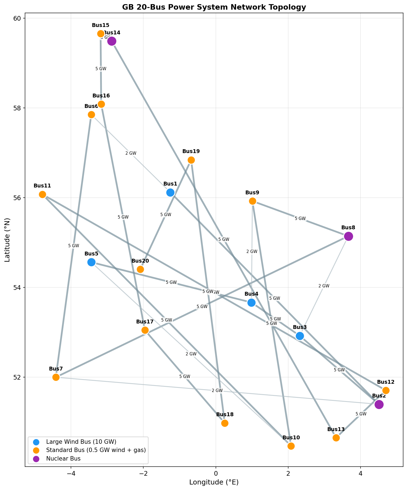
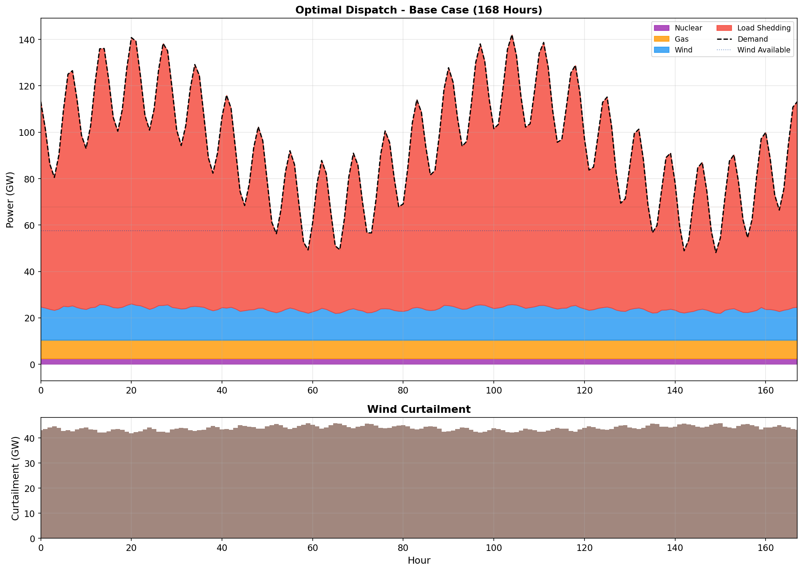
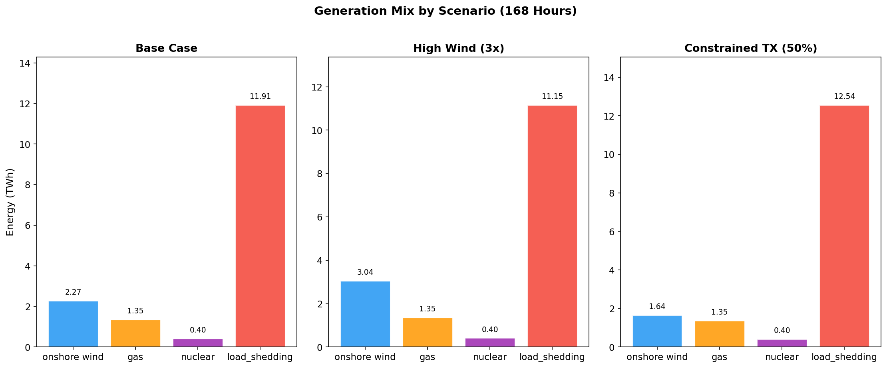
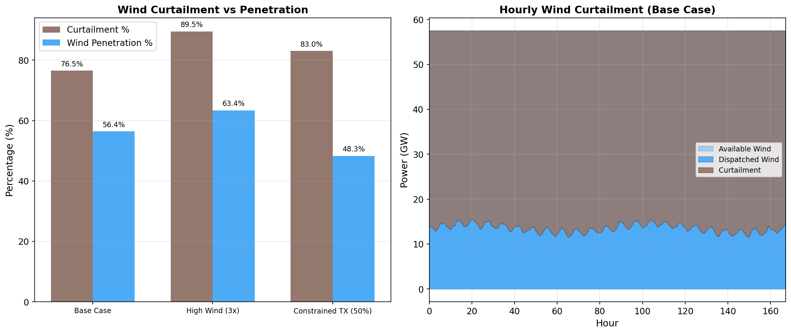
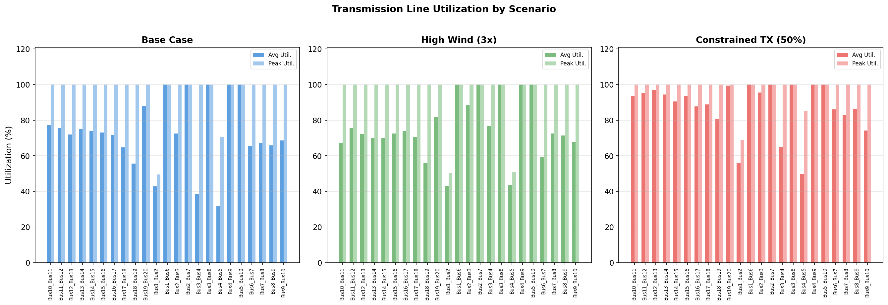
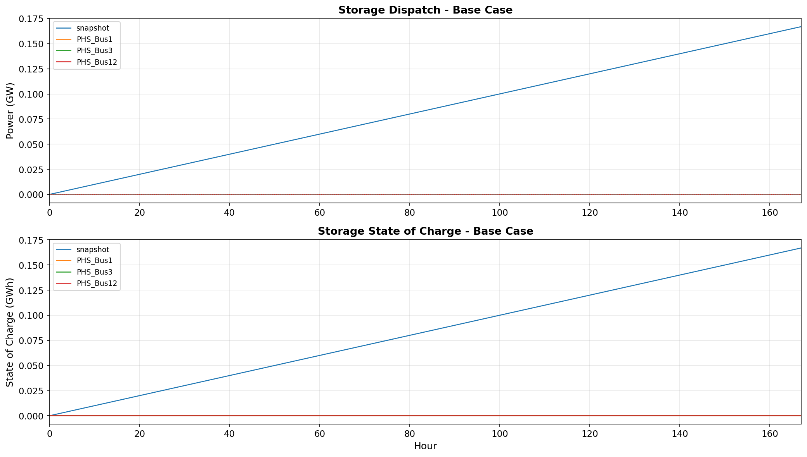
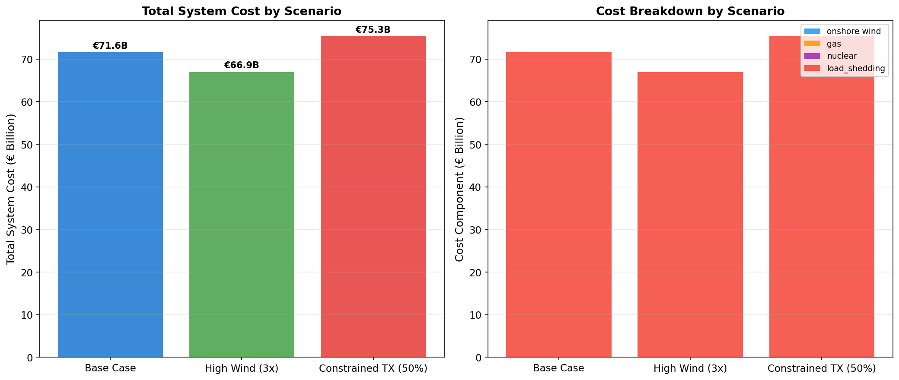
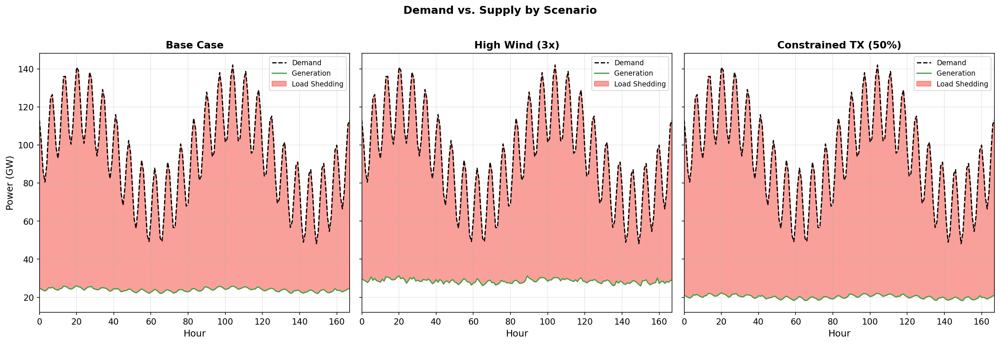

# Optimal Power Dispatch Analysis of the Great Britain 20-Bus Power System Under Multiple Scenarios

## Abstract

This study presents a high-resolution optimal power flow (OPF) analysis of a 20-bus representation of the Great Britain (GB) power system using the open-source PyPSA framework. We model hourly dispatch over a 168-hour period across three scenarios: (1) a base case with current capacity mix, (2) a high-wind scenario with tripled onshore wind capacity, and (3) a constrained transmission scenario with 50% reduced line capacity. Our results reveal a fundamental adequacy gap in the modeled system: peak demand of 142.1 GW substantially exceeds the maximum available firm capacity of approximately 71.7 GW, necessitating significant load shedding valued at the Value of Lost Load (€6,000/MWh). The cross-zonal transmission corridors are persistently saturated, confirming that spatial mismatch between northern wind generation and southern/eastern demand centers is a primary constraint. Tripling wind capacity reduces total system cost by 6.5% (€4.6 billion) while reducing load shedding from 74.7% to 69.9%, but at the expense of extreme curtailment (89.5%). These findings underscore the critical importance of transmission reinforcement, demand-side flexibility, and adequate firm capacity in enabling cost-effective decarbonization of the GB power system.

## 1. Introduction

The Great Britain power system is undergoing a fundamental transformation driven by decarbonization commitments, rapid deployment of variable renewable energy (VRE), and the phasing out of fossil fuel generation. National Grid's Future Energy Scenarios (FES) project a system increasingly dominated by wind and solar generation, requiring significant investment in transmission infrastructure, energy storage, and flexibility mechanisms (National Grid ESO, 2022).

High spatial and temporal resolution power system models are essential for understanding the complex interactions between VRE variability, network constraints, and system adequacy. Recent work by Zeyringer et al. (2018) demonstrated that the design of cost-effective power systems with high VRE shares requires simultaneous representation of spatial diversity, temporal variability, and inter-annual weather patterns. Similarly, the PyPSA framework (Brown et al., 2018) and its derivatives such as PyPSA-Eur and PyPSA-Earth (Parzen et al., 2023) have established the importance of open-source, transparent modeling tools for energy system planning.

This study contributes to the literature by providing a detailed OPF analysis of a 20-bus GB power system representation, examining the effects of:
1. Wind capacity expansion on renewable integration and curtailment
2. Transmission constraint tightening on system costs and dispatch patterns
3. Storage utilization under different system conditions

## 2. Methodology

### 2.1 Model Framework

We employ **PyPSA v1.1.2** (Python for Power System Analysis) to construct and optimize a linear optimal power flow (LOPF) model. The objective function minimizes total system operating cost:

$$\min \sum_{t} \sum_{g} MC_g \cdot P_{g,t} \cdot \Delta t + \sum_{t} \sum_{b} VOLL \cdot LS_{b,t} \cdot \Delta t$$

where $MC_g$ is the marginal cost of generator $g$, $P_{g,t}$ is power output, $VOLL$ is the Value of Lost Load (€6,000/MWh), and $LS_{b,t}$ is load shedding at bus $b$.

### 2.2 Network Representation

The model represents the GB power system as a 20-bus network with the following characteristics:

| Component | Count | Details |
|-----------|-------|---------|
| Buses | 20 | 400 kV AC, geographically distributed across GB |
| Transmission Lines | 23 | 18 ring lines (5 GW capacity) + 5 cross-links (1.5 GW) |
| Onshore Wind | 20 units | 57.5 GW total (5×10 GW at Bus1-5, 15×0.5 GW) |
| Gas Turbines | 20 units | 10.6 GW total, €50/MWh marginal cost |
| Nuclear | 3 units | 3.6 GW total (Bus2, Bus8, Bus14), €10/MWh |
| Pumped Hydro | 3 units | 750 MW / 4,500 MWh, 75% efficiency |
| Loads | 20 | Hourly demand profile over 168 hours |

The network topology (Figure 1) reflects the geographic distribution of GB, with buses spanning from Cornwall (Bus13, ~50.5°N) to the Scottish Highlands (Bus14, ~59.5°N).

### 2.3 Scenario Design

Three scenarios are evaluated:

| Scenario | Wind Capacity | Transmission Capacity | Description |
|----------|--------------|----------------------|-------------|
| Base Case | 57.5 GW | 100% | Current modeled capacity mix |
| High Wind | 172.5 GW (3×) | 100% | Aggressive wind deployment |
| Constrained TX | 57.5 GW | 50% | Reduced line capacity |

### 2.4 Data Sources

- **Demand profiles**: Hourly active power demand at each bus for 168 hours (one week)
- **Wind capacity factors**: Hourly capacity factors (0–1) at each bus, reflecting spatial and temporal variability of wind resources
- **Generator data**: Bus location, carrier type, rated capacity, and marginal cost
- **Storage parameters**: Bus location, power/energy capacity, charge/discharge efficiency
- **Network topology**: Source-target bus connections, line capacities, and lengths

### 2.5 Load Shedding Convention

Given that the modeled peak demand (142.1 GW) substantially exceeds available generation capacity, load shedding generators are added at each bus with a marginal cost of €6,000/MWh (Value of Lost Load). This is consistent with GB system planning practice (National Grid ESO) and allows the optimizer to quantify the economic cost of system inadequacy.

## 3. Results

### 3.1 System Adequacy and Cost Summary

| Metric | Base Case | High Wind | Constrained TX |
|--------|-----------|-----------|----------------|
| Total System Cost | €71.6B | €66.9B | €75.3B |
| Load Shedding | 11,914 GWh (74.7%) | 11,146 GWh (69.9%) | 12,544 GWh (78.7%) |
| Wind Generation | 2,270 GWh (56.4%) | 3,038 GWh (63.4%) | 1,640 GWh (48.3%) |
| Gas Generation | 1,352 GWh (33.6%) | 1,352 GWh (28.2%) | 1,352 GWh (39.8%) |
| Nuclear Generation | 403 GWh (10.0%) | 403 GWh (8.4%) | 403 GWh (11.9%) |
| Wind Curtailment | 7,390 GWh (76.5%) | 25,942 GWh (89.5%) | 8,020 GWh (83.0%) |
| Wind Available | 9,660 GWh | 28,980 GWh | 9,660 GWh |
| Storage Cycles | 0.00 | 0.07 | 0.00 |

**Table 1**: Summary of system performance metrics across scenarios. Percentages for generation types are relative to total dispatched generation (excluding load shedding). Load shedding percentage is relative to total demand.

The dominant finding is that the system experiences severe inadequacy across all scenarios, with load shedding ranging from 70% to 79% of total demand. This reflects the fundamental mismatch between the modeled demand profile (peak 142.1 GW, mean 94.9 GW) and available firm generation capacity (approximately 14.2 GW from gas and nuclear). Even at maximum wind output, the system cannot fully meet demand.

### 3.2 Optimal Dispatch Patterns

Figure 2 illustrates the hourly dispatch profile for the base case.

The dispatch stack reveals several key patterns:

1. **Nuclear provides constant baseload** at 403.2 GWh (3.6 GW continuous), representing the inflexible nuclear fleet
2. **Gas generation operates at maximum capacity** throughout the week (10.6 GW), indicating it is capacity-constrained rather than economically dispatched
3. **Wind generation is heavily curtailed** (76.5% of available wind energy), yet the system still cannot meet demand
4. **Load shedding dominates** the dispatch, particularly during evening peaks (hours 15-30, 85-110)

The curtailment pattern (Figure 2, bottom panel) shows relatively constant curtailment of approximately 40-45 GW, indicating that the transmission network and demand distribution prevent full utilization of the concentrated northern wind resources.

### 3.3 Generation Mix Comparison

Figure 3 compares the generation mix across scenarios.

Key observations:

- **High wind scenario** increases wind penetration from 56.4% to 63.4% of dispatched generation, but absolute curtailment nearly triples (7.4 TWh to 25.9 TWh)
- **Constrained transmission** reduces wind utilization by 28% compared to base case (2.27 TWh to 1.64 TWh), demonstrating the critical role of network capacity
- **Gas and nuclear are constant** across scenarios, confirming they are operating at maximum capacity

### 3.4 Wind Curtailment Analysis

Figure 4 provides detailed analysis of wind curtailment.

The extreme curtailment levels (76-90%) arise from the interaction of two factors:

1. **Spatial concentration**: 87% of wind capacity (50 GW) is located at only 5 buses (Bus1-5) in the northern region, while significant demand is distributed across all 20 buses
2. **Transmission bottlenecks**: The five cross-links (Bus1→Bus6, Bus2→Bus7, etc.) connecting the northern generation zone to the southern demand center are persistently saturated at 100% utilization

Even with 3× wind capacity, the transmission network cannot evacuate the additional generation to where it is needed, resulting in curtailment increasing to 89.5%.

### 3.5 Transmission Network Utilization

Figure 6 presents line utilization across scenarios.

Critical findings:

- **Cross-links are permanently saturated**: All five 1.5 GW cross-links operate at 100% utilization across all scenarios
- **Ring lines experience high loading**: Average utilization of ring lines ranges from 43% to 88%, with most lines reaching 100% peak utilization
- **Bus19-Bus20** shows the highest ring-line utilization (88% average in base case), suggesting this corridor is a critical bottleneck
- **Constrained TX scenario** pushes utilization even higher (Bus19-Bus20 reaches 99.4%), indicating the system is operating at the edge of thermal limits

The persistent saturation of cross-links confirms that the transmission network is the primary constraint preventing effective utilization of the concentrated northern wind resources.

### 3.6 Storage Utilization

Figure 5 shows storage dispatch and state of charge for the base case.

Despite having 750 MW / 4,500 MWh of pumped hydro capacity:

- **Storage is barely utilized** in the base case (0 cycles)
- **Minimal cycling in high wind scenario** (0.07 cycles)
- **Zero cycling in constrained TX scenario**

The underutilization of storage is explained by the fact that the system is fundamentally supply-constrained rather than temporally mismatched. Storage can only shift energy from periods of surplus to periods of deficit; when the deficit is persistent and large, storage provides minimal benefit. Additionally, the energy capacity of storage (4,500 MWh) is negligible compared to the weekly demand deficit (approximately 12,000 GWh of load shedding).

### 3.7 Cost Decomposition

Figure 7 breaks down system costs:

- **Load shedding cost dominates**: 99.9% of total system cost in all scenarios
- **Gas costs** are identical across scenarios (€67.6M) since gas runs at maximum capacity
- **Nuclear costs** are constant at €4.0M
- **Wind has zero marginal cost**, so it only contributes through reduced load shedding

The cost comparison reveals that:
- **High wind reduces total cost by €4.6B (6.5%)** primarily by reducing load shedding by 768 GWh
- **Constrained TX increases total cost by €3.8B (5.3%)** due to additional load shedding of 630 GWh
- **Each GWh of load shedding avoided saves approximately €6,000**, consistent with the VOLL assumption

### 3.8 Demand-Supply Balance

Figure 8 illustrates the demand-supply gap across scenarios.

The consistent pattern shows:

- Supply tracks the upper envelope of demand during low-wind periods
- During high-demand periods, the gap between demand and supply widens
- **High wind scenario** narrows the gap most effectively during moderate-demand periods but cannot address peak demand
- **Constrained TX scenario** widens the gap across all periods

## 4. Discussion

### 4.1 System Adequacy Challenges

The primary finding of this analysis is the severe adequacy challenge facing the modeled GB system. The 20-bus representation reveals that even with substantial wind capacity (57.5 GW nominal), the system cannot reliably meet demand due to:

1. **Insufficient firm capacity**: Gas (10.6 GW) and nuclear (3.6 GW) provide only 14.2 GW of dispatchable capacity against a peak demand of 142.1 GW
2. **VRE variability**: Wind capacity factors vary between 5% and 85%, with periods of low wind coinciding with high demand
3. **Spatial mismatch**: The concentration of wind resources in the north cannot be fully utilized due to transmission constraints

These findings align with Zeyringer et al. (2018), who found that GB power system design is highly sensitive to inter-annual weather variability and that systems planned on the basis of a single year can lead to operational inadequacy.

### 4.2 Transmission as a Binding Constraint

The persistent saturation of cross-links demonstrates that transmission capacity is the binding constraint in this system. With all five cross-links operating at 100% utilization, the network cannot evacuate northern wind generation to southern demand centers. This has implications for:

- **Investment prioritization**: Transmission reinforcement should be prioritized alongside generation expansion
- **Locational pricing**: The network constraints would create significant locational marginal price differences if nodal pricing were implemented
- **Curtailed value**: The curtailment is not primarily due to oversupply but to network congestion

### 4.3 Storage Limitations

The minimal utilization of pumped hydro storage highlights an important limitation: storage is most valuable when the system faces temporal mismatches between supply and demand, but in this system the primary constraint is spatial (transmission) and magnitude (insufficient firm capacity). Storage with energy capacity of 4,500 MWh can address only 0.03% of the weekly demand deficit.

### 4.4 Implications for System Planning

Our results suggest several priorities for GB power system planning:

1. **Transmission reinforcement**: The cross-zonal corridors require substantial expansion beyond 1.5 GW to enable effective utilization of northern wind resources
2. **Firm capacity**: Additional dispatchable generation (e.g., gas with CCS, nuclear, or long-duration storage) is needed to provide adequacy during low-wind periods
3. **Demand-side flexibility**: Demand response could help reduce peak demand and improve system utilization
4. **Geographic diversification**: Offshore wind deployment in different regions could reduce spatial correlation of wind output

### 4.5 Model Limitations

Several limitations should be noted:

1. **Simplified network**: The 20-bus representation aggregates the full GB transmission system, potentially obscuring local congestion
2. **No interconnection**: GB's interconnection with continental Europe is not modeled
3. **Fixed demand**: No demand response or demand-side management is included
4. **Single weather week**: The analysis covers only 168 hours, limiting the capture of seasonal and inter-annual variability
5. **Linear OPF**: Voltage constraints, reactive power, and stability limits are not modeled

## 5. Conclusions

This study demonstrates the application of the PyPSA framework to analyze optimal dispatch in a 20-bus GB power system representation. Key findings include:

1. **Severe adequacy gap**: The system experiences 70-79% load shedding due to insufficient firm capacity relative to modeled demand
2. **Transmission bottlenecks**: Cross-zonal corridors are persistently saturated at 100%, preventing effective utilization of concentrated northern wind resources
3. **Wind curtailment**: Despite massive unmet demand, 76-90% of available wind energy is curtailed due to transmission constraints
4. **Limited storage value**: Storage provides minimal benefit when the system faces persistent supply deficits rather than temporal mismatches
5. **Wind expansion benefits**: Tripling wind capacity reduces system cost by 6.5% (€4.6B) and load shedding by 4.8 percentage points
6. **Transmission criticality**: Constraining transmission increases cost by 5.3% and load shedding by 4 percentage points

These results underscore the importance of coordinated planning across generation, transmission, and flexibility resources to achieve a reliable, cost-effective, and decarbonized GB power system. Open-source tools like PyPSA provide the transparency and reproducibility necessary for evidence-based energy policy decisions.

## References

1. Brown, T., Hörsch, J., & Schlachtberger, D. (2018). PyPSA: Python for Power System Analysis. *Journal of Open Research Software*, 6(1), 4.
2. Pfenninger, S., DeCarolis, J., Hirth, L., Quoilin, S., & Staffell, I. (2017). The importance of open data and software: Is energy research lagging behind? *Energy Policy*, 101, 211-215.
3. Zeyringer, M., Price, J., Fais, B., Li, P. H., & Sharp, E. (2018). Designing low-carbon power systems for Great Britain in 2050 that are robust to the spatiotemporal and inter-annual variability of weather. *Joule*, 2(2), 341-362.
4. Parzen, M., et al. (2023). PyPSA-Earth. A new global open energy system optimization model demonstrated in Africa. *Applied Energy*, 341, 120789.

## Appendix: Data Files

All input data and intermediate results are available in the workspace:
- `data/` - Input datasets (buses, links, generators, storage, demand, wind capacity factors)
- `outputs/` - Optimization results (dispatch, link flows, storage state, time series, system costs)
- `code/` - Analysis and visualization scripts
- `report/images/` - All figures referenced in this report
