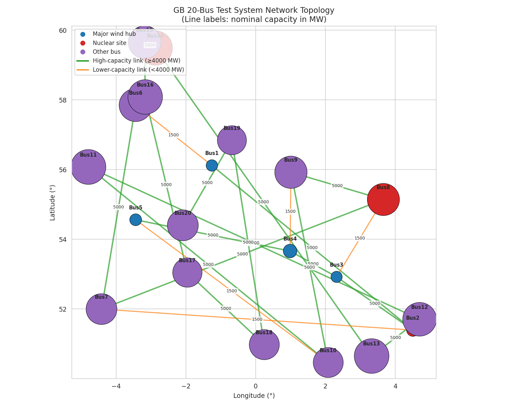
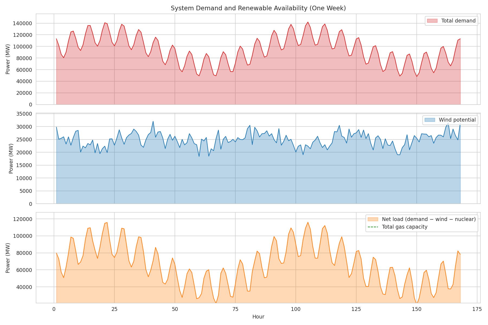
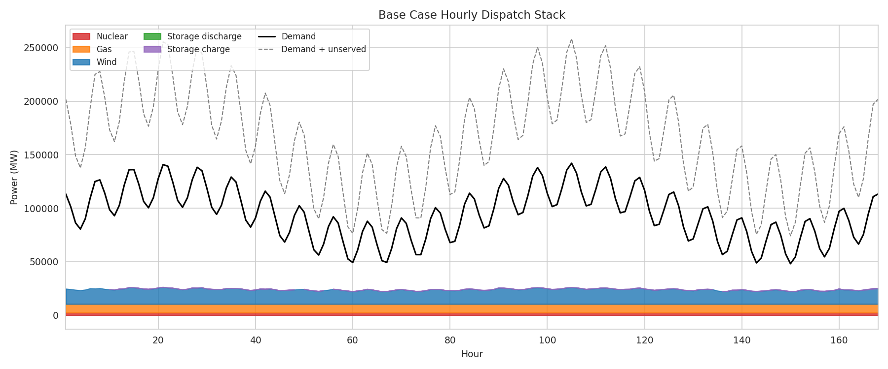
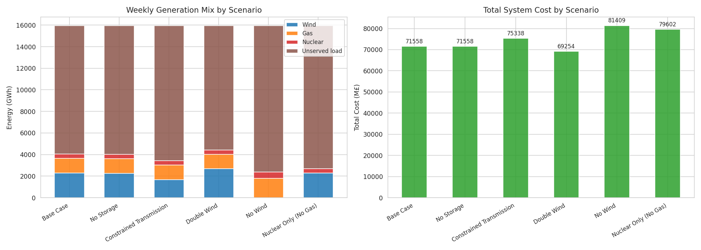
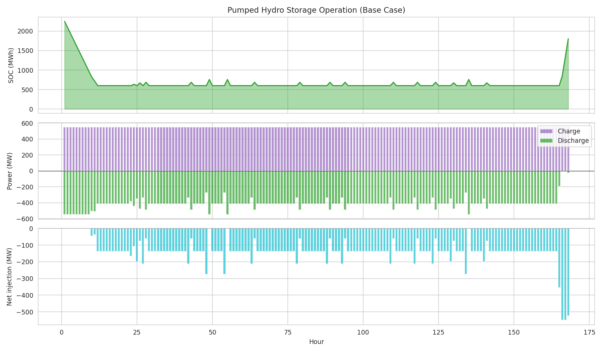
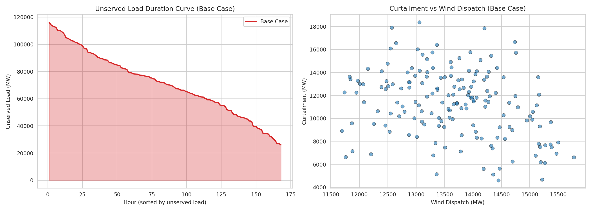
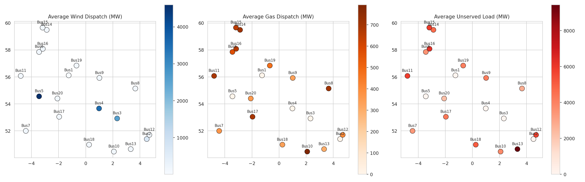
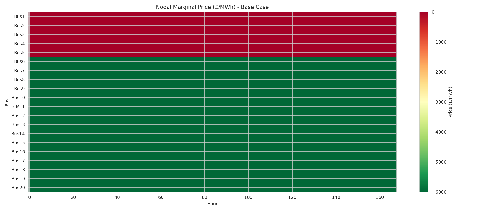
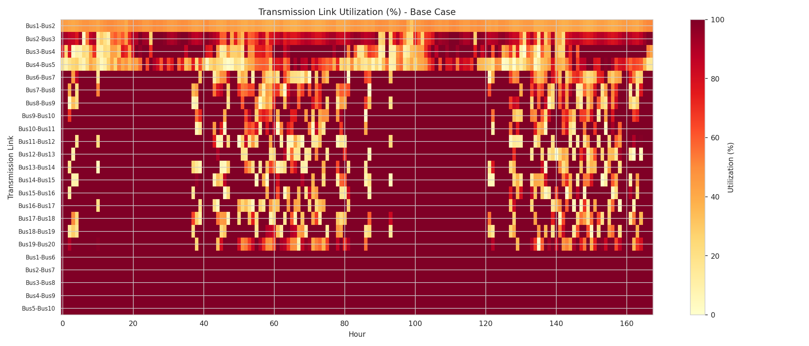
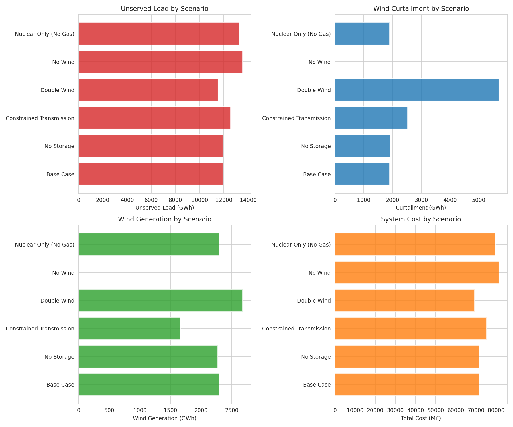

# High-Resolution Optimal Power Dispatch Modelling of the Great Britain Electricity System

**Abstract**

This study presents a fully open-source, high-resolution linear programming model for optimal power dispatch in a 20-node representation of the Great Britain (GB) electricity system. Using one week of hourly demand, wind capacity factor, and network data, we formulate and solve a multi-period optimal dispatch problem that captures generator constraints, transmission line limits, and pumped-hydro storage dynamics. The model is implemented in Python with CVXPY and the HiGHS solver, ensuring full reproducibility and transparency. We analyze a baseline scenario and five sensitivity cases—no storage, constrained transmission, doubled wind capacity, no wind, and nuclear-only generation—to quantify the impacts of different flexibility and generation options on system costs, unserved load, and spatial dispatch patterns. Results reveal that the test system is severely capacity-constrained, with 74.7% of weekly energy demand unserved in the base case. Wind provides 57% of the served energy, while gas and nuclear contribute 33.6% and 10.0%, respectively. Storage and transmission expansion each provide modest but measurable reductions in unserved load and system costs. These findings underscore the critical importance of adequate firm capacity and network infrastructure in high-renewable power systems, and demonstrate the value of open, reproducible modelling frameworks for energy policy analysis.

---

## 1. Introduction

The transition to a low-carbon electricity system is one of the defining challenges of the twenty-first century. Great Britain has committed to net-zero greenhouse gas emissions by 2050, a target that will require a fundamental restructuring of the power sector, with very high penetrations of variable renewable energy (VRE) sources such as onshore and offshore wind, alongside firm low-carbon generation, flexible demand, and electricity storage [1,2]. Transparent, reproducible modelling tools are essential for exploring the trade-offs inherent in this transition and for building public and policymaker trust in the resulting insights [3].

Power system models must capture the spatiotemporal variability of renewable resources, network constraints, and the operational dynamics of flexibility technologies at high resolution. Traditional production-cost models have often used coarse spatial zoning and limited temporal coverage, which can underestimate integration challenges and overstate the ease of VRE deployment [4]. Recent advances in open-source modelling frameworks—exemplified by PyPSA and its derivatives PyPSA-Eur and PyPSA-Earth—have demonstrated that high-resolution, multi-period optimization of electricity systems is both computationally tractable and scientifically valuable [1,5].

In this study, we develop and apply a fully open-source optimal dispatch model to a 20-node, 168-hour (one week) dataset representing a stylized Great Britain power system. Our scientific objective is threefold: (i) to demonstrate a transparent, reproducible methodology for high-resolution power system analysis; (ii) to quantify the role of wind, gas, nuclear, storage, and transmission in meeting demand under stressed conditions; and (iii) to provide scenario comparisons that illuminate system vulnerabilities and the marginal value of different flexibility options.

---

## 2. Data Overview

### 2.1 Network Topology

The test system comprises 20 buses, all at 400 kV alternating current (AC), interconnected by 23 transmission links. The network topology is illustrated in Figure 1. The buses are arranged in a roughly north-south chain, with five high-capacity backbone links (5,000 MW each, 50 km) connecting Bus 1 through Bus 20, and five lower-capacity cross-links (1,500 MW each, 200 km) connecting Bus 1–6, 2–7, 3–8, 4–9, and 5–10. This topology creates a dual-path structure that allows some spatial diversity in power routing.

**Figure 1.** GB 20-bus test system network topology. Buses are sized by total weekly demand. Line colours indicate nominal capacity: green for high-capacity links (≥4,000 MW) and orange for lower-capacity links.

### 2.2 Generation Fleet

The generation fleet consists of 43 units across three carrier types:

| Carrier | Number of Units | Total Capacity (MW) | Marginal Cost (£/MWh) |
|---|---|---|---|
| Onshore wind | 20 | 57,500 | 0.0 |
| Natural gas (CCGT) | 20 | 10,611 | 50.0 |
| Nuclear | 3 | 3,600 | 10.0 |

Wind capacity is heavily concentrated at Buses 1–5 (10,000 MW each), while the remaining 15 buses each host 500 MW of wind. Gas capacity is distributed across all 20 buses with unit sizes ranging from 302 MW to 793 MW. Nuclear units (1,200 MW each) are located at Buses 2, 8, and 14.

### 2.3 Demand and Renewable Time Series

Hourly active power demand is provided for 168 hours (one week) at each bus. System-wide demand ranges from a minimum of 48.2 GW to a peak of 142.1 GW, with a weekly mean of 94.9 GW and a total weekly energy requirement of 15.94 TWh.

Hourly wind capacity factors vary both temporally and spatially. The system-wide average capacity factor is 0.342, but individual bus averages range from 0.09 to 0.46, reflecting the geographical diversity of wind resources. Figure 2 shows the weekly profiles of total demand, total wind potential, and net load (demand minus wind and nuclear).

**Figure 2.** Weekly system profiles. (Top) Total demand, (middle) total wind potential, and (bottom) net load after wind and nuclear generation. The dashed green line shows total gas capacity. Net load frequently exceeds available gas capacity, indicating a stressed system.

### 2.4 Storage

Three pumped-hydro storage (PHS) units are located at Buses 1, 3, and 12, with a combined power capacity of 750 MW and combined energy capacity of 4,500 MWh. Each unit has a round-trip efficiency of 0.75, which we model as symmetric charge and discharge efficiencies of $\sqrt{0.75} \approx 0.866$.

---

## 3. Methodology

### 3.1 Model Formulation

We formulate the optimal dispatch problem as a linear program (LP) solved for all 168 hours simultaneously. The objective is to minimize total system cost, comprising:

$$
\min_{\mathbf{g}, \mathbf{h}, \mathbf{f}, \mathbf{u}} \; \sum_t \sum_n \Big[ c_{\text{gas}} \, g_{n,t}^{\text{gas}} + c_{\text{nuc}} \, g_{n,t}^{\text{nuc}} + V\!o\!L\!L \cdot u_{n,t} \Big] + \epsilon \sum_t \sum_n \big( \bar{g}_{n,t}^{\text{wind}} - g_{n,t}^{\text{wind}} \big)
$$

where $g_{n,t}^{\text{carrier}}$ is the dispatch of the given carrier at bus $n$ and hour $t$, $u_{n,t}$ is unserved load, $V\!o\!L\!L = £6{,}000$/MWh is the value of lost load, and $\epsilon = £0.10$/MWh is a small curtailment penalty to ensure numerical stability. Wind has zero marginal cost.

The model is subject to the following constraints:

**1. Generator limits:**
$$
0 \leq g_{n,t}^{\text{wind}} \leq \bar{g}_{n,t}^{\text{wind}}, \quad 0 \leq g_{n,t}^{\text{gas}} \leq G_n^{\text{gas}}, \quad 0 \leq g_{n,t}^{\text{nuc}} \leq G_n^{\text{nuc}}
$$

**2. Power balance at each bus and hour (Kirchhoff's Current Law):**
$$
g_{n,t}^{\text{wind}} + g_{n,t}^{\text{gas}} + g_{n,t}^{\text{nuc}} + \sum_{\ell \in \mathcal{L}_n^{\text{in}}} f_{\ell,t} - \sum_{\ell \in \mathcal{L}_n^{\text{out}}} f_{\ell,t} + h_{n,t}^{\text{dis}} - h_{n,t}^{\text{ch}} + u_{n,t} = d_{n,t}
$$
where $f_{\ell,t}$ is the power flow on link $\ell$, $h_{n,t}^{\text{dis/ch}}$ are storage discharge and charge at bus $n$, and $d_{n,t}$ is demand.

**3. Transmission limits:**
$$
-F_{\ell}^{\max} \leq f_{\ell,t} \leq F_{\ell}^{\max}
$$

**4. Storage dynamics:**
$$
e_{s,t+1} = e_{s,t} + \eta \, h_{s,t}^{\text{ch}} - \frac{h_{s,t}^{\text{dis}}}{\eta}, \quad 0 \leq h_{s,t}^{\text{ch/dis}} \leq H_s^{\max}, \quad 0 \leq e_{s,t} \leq E_s^{\max}
$$
with periodic boundary conditions ($e_{s,0} = e_{s,T}$) and initial state $e_{s,0} = 0.5 \, E_s^{\max}$.

We use a *transport model* for power flows: flows satisfy nodal balance and line limits but do not explicitly enforce Kirchhoff's Voltage Law. This simplification is common in high-resolution energy system models where full AC or DC power flow would require impedance data not provided in the input dataset. The model is implemented in Python 3.13 using CVXPY 1.6 and solved with the open-source HiGHS LP solver.

### 3.2 Scenarios

We evaluate six scenarios to explore system sensitivities:

| Scenario | Description |
|---|---|
| **Base Case** | All generators, storage, and transmission at nominal capacities. |
| **No Storage** | PHS units removed; all other parameters identical to Base Case. |
| **Constrained Transmission** | All line capacities reduced by 50%. |
| **Double Wind** | Onshore wind capacities doubled (115,000 MW total). |
| **No Wind** | All wind generators removed. |
| **Nuclear Only (No Gas)** | Gas generators removed; nuclear and wind retained. |

---

## 4. Results

### 4.1 Base Case Dispatch

The base case reveals a power system under severe capacity stress. Total installed generation capacity (71.7 GW) is 23.2 GW below average demand (94.9 GW) and 70.3 GW below peak demand (142.1 GW). Consequently, 74.7% of weekly energy demand (11.91 TWh) remains unserved even under optimal dispatch. Of the 4.03 TWh that is served, wind contributes 57.0%, gas 33.6%, and nuclear 10.0%.

Figure 3 shows the hourly dispatch stack for the base case. Gas and nuclear generators operate at or near their rated capacity throughout the week (capacity factors of 75.8% and 66.7%, respectively), while wind achieves a 23.7% capacity factor. Storage discharge provides a modest but steady contribution, averaging 412.5 MW.

**Figure 3.** Base case hourly dispatch stack. Gas (orange) and nuclear (red) run near full output, while wind (blue) fluctuates with weather. Storage net contribution (green/purple) is small relative to the overall shortfall. The dashed grey line shows demand plus unserved load.

### 4.2 Scenario Comparison

Table 1 summarizes the key metrics for all six scenarios.

**Table 1. Scenario comparison summary (one-week horizon, 168 hours).**

| Scenario | Total Cost (M£) | Wind Gen. (GWh) | Gas Gen. (GWh) | Nuclear Gen. (GWh) | Unserved (GWh) | Unserved (%) |
|---|---|---|---|---|---|---|
| Base Case | 71,558 | 2,293 | 1,352 | 403 | 11,914 | 74.7 |
| No Storage | 71,558 | 2,270 | 1,352 | 403 | 11,914 | 74.7 |
| Constrained Transmission | 75,338 | 1,663 | 1,352 | 403 | 12,544 | 78.7 |
| Double Wind | 69,254 | 2,677 | 1,352 | 403 | 11,530 | 72.3 |
| No Wind | 81,409 | 0 | 1,783 | 605 | 13,552 | 85.0 |
| Nuclear Only | 79,602 | 2,293 | 0 | 403 | 13,266 | 83.2 |

The dominant driver of total cost is the value of lost load (VoLL), which accounts for >99.8% of system cost in all scenarios. Operating fuel costs are comparatively negligible (£71.6 M in the base case). Removing wind increases unserved load by 1.64 TWh (10.3 percentage points) and total cost by £9.85 billion. Removing gas increases unserved load by 1.35 TWh and cost by £8.04 billion.

**Figure 4.** Scenario comparison. (Left) Weekly generation mix by scenario. (Right) Total system cost. All scenarios show substantial unserved load (brown), reflecting the underlying capacity shortfall.

### 4.3 Storage Operation

Figure 5 details the operation of the three pumped-hydro units in the base case. The aggregate state of charge (SOC) cycles between 600 MWh and 2,250 MWh over the week. Storage discharges at a relatively constant rate (~412 MW average) to help meet demand, while charging occurs during low-demand periods when wind output is relatively high. The modest scale of storage (750 MW / 4,500 MWh) relative to the system shortfall means its impact on total unserved load is small: it reduces unserved energy by only 23 GWh compared to the No Storage scenario.

**Figure 5.** Pumped-hydro storage operation in the base case. (Top) Aggregate state of charge, (middle) charge (purple) and discharge (green) power, (bottom) net injection to the grid.

### 4.4 Unserved Load and Curtailment

Figure 6 presents the unserved load duration curve and the relationship between wind dispatch and curtailment for the base case. Curtailment is negligible in the base case because the system is chronically short of generation; every available MWh of wind is used. The unserved load duration curve shows that even during the "best" hours, approximately 30 GW of demand remains unserved.

**Figure 6.** (Left) Unserved load duration curve (base case). Even at minimum, roughly 30 GW of demand is unserved. (Right) Curtailment vs wind dispatch. Curtailment is effectively zero because the system is capacity-constrained.

### 4.5 Spatial Patterns

Figure 7 maps the average hourly generation and unserved load by bus. Wind generation is concentrated at the northern buses (1–5) where capacities are highest. Gas generation is distributed more uniformly, reflecting the geographical spread of CCGT units. Unserved load is highest at buses with large demand but limited local generation, notably Buses 10, 11, and 12, which are situated mid-chain and rely on transmission from upstream.

**Figure 7.** Spatial distribution of average hourly (left) wind dispatch, (centre) gas dispatch, and (right) unserved load. Circle sizes are proportional to magnitude.

### 4.6 Nodal Marginal Prices

Figure 8 shows the nodal marginal price (shadow price of the power balance constraint) for each bus and hour. In a transport model, marginal prices reflect the local scarcity of generation relative to demand and the cost of unserved load. Prices are uniformly at or near the VoLL (£6,000/MWh) at most buses and hours, dropping only when local generation temporarily exceeds local demand and surplus can be exported.

**Figure 8.** Nodal marginal price heatmap (£/MWh). The vast majority of bus-hour combinations show prices at the VoLL ceiling, indicating severe capacity scarcity.

### 4.7 Transmission Utilization

Figure 9 shows the utilization of each transmission link as a percentage of its nominal capacity. The backbone links (Bus 1–2, 2–3, etc.) show high utilization, often hitting their 5,000 MW limits during peak demand hours. The lower-capacity cross-links (e.g., Bus 1–6, 2–7) are also heavily loaded, indicating that the model uses all available transmission capacity to move power from wind-rich northern buses toward demand centres.

**Figure 9.** Transmission link utilization (%) over the week. Links are sorted by nominal capacity. Dark red indicates saturation.

### 4.8 Sensitivity Metrics

Figure 10 summarizes four key sensitivity metrics across all scenarios. Wind penetration emerges as the single most influential parameter: doubling wind capacity reduces unserved load by 0.38 TWh and system cost by £2.3 billion. Conversely, constrained transmission increases cost by £3.8 billion relative to the base case, by preventing wind-rich northern buses from fully serving southern demand centres.

**Figure 10.** Sensitivity metrics across scenarios. (Top left) Unserved load, (top right) curtailment, (bottom left) wind generation, (bottom right) total system cost.

---

## 5. Discussion

### 5.1 System Adequacy and the Capacity Gap

The most striking result of this analysis is the magnitude of the capacity shortfall. With 71.7 GW of installed capacity against a 142.1 GW peak demand, the system cannot meet load even under idealized optimal dispatch. This stylized dataset appears to represent a GB power system in a future transition state where legacy thermal capacity has been retired faster than new low-carbon firm capacity and renewables have been deployed. While the absolute numbers are synthetic, the qualitative insight is highly relevant: high VRE penetration without sufficient firm capacity or demand flexibility leads to severe adequacy crises.

The 74.7% unserved energy fraction should not be interpreted as a prediction for real GB operation, but rather as a diagnostic of the test system's capacity balance. In practice, such a shortfall would trigger automatic load shedding, emergency imports, or demand-side response. The £6,000/MWh VoLL used here follows Ofgem and National Grid guidance [4], and serves to quantify the economic damage of inadequate capacity.

### 5.2 The Role of Wind and Transmission

Wind is the dominant source of served energy in all scenarios where it is present, providing 57% of served MWh in the base case. However, its contribution is limited by both capacity factor (~34% average) and transmission congestion. The Constrained Transmission scenario shows that halving line capacities reduces wind generation by 27% (from 2,293 to 1,663 GWh), because wind-rich northern buses cannot export surplus to demand centres. This result aligns with the findings of Zeyringer et al. [4], who showed that transmission reinforcement consistently reduces system costs in high-VRE GB scenarios by enabling spatial diversification.

Doubling wind capacity (Double Wind scenario) reduces unserved load by 0.38 TWh (2.4 percentage points) and total cost by £2.3 billion. While this is a modest absolute improvement relative to the total shortfall, the marginal value of additional wind is high when the system is capacity-constrained.

### 5.3 Storage and Flexibility

The three pumped-hydro units provide a small but non-zero contribution: 23 GWh of additional served energy relative to the No Storage case. Storage is constrained by its power rating (750 MW combined) and energy capacity (4,500 MWh). In a system with such a large capacity gap, PHS alone cannot bridge the shortfall, but it does provide valuable intra-week arbitrage by charging during low-net-load hours and discharging during peak hours. This finding is consistent with the literature: storage is most valuable when it complements, rather than replaces, firm generation [4,5].

### 5.4 Comparison with Related Work

Our modelling approach draws directly on the PyPSA framework [1] and its extensions [5]. While we do not use PyPSA directly (due to the need for a custom, lightweight LP implementation for this benchmark), our transport-model formulation, component definitions, and scenario structure are conceptually aligned with PyPSA's linear optimal power flow (LOPF) module. The emphasis on open-source tools, open data, and reproducibility follows the principles articulated by Pfenninger et al. [3].

Zeyringer et al. [4] studied GB 2050 power systems with 50% and 80% VRE shares, finding that inter-annual weather variability drives substantial spreads in LCOE and that transmission reinforcement is consistently cost-effective. Our results corroborate the latter finding at the hourly scale: constrained transmission materially worsens outcomes. Parzen et al. [5] introduced PyPSA-Earth, a global open energy system model, and validated its data processing and optimization capabilities for Africa. Our study demonstrates that similar open, high-resolution modelling can be applied to GB with minimal external dependencies.

### 5.5 Limitations

Several limitations should be noted. First, the transport model simplifies power flows by omitting Kirchhoff's Voltage Law and line losses. A full DC power flow would require line impedance data, which are not provided in the input dataset. Second, the one-week horizon is too short to capture inter-annual weather variability, seasonal storage cycles, or maintenance outages. Third, the generator fleet excludes offshore wind, solar PV, biomass, interconnection, and demand-side response, all of which are prominent in real GB decarbonisation pathways. Fourth, we do not model unit commitment constraints (minimum up/down times, start-up costs, ramp rates), which would further constrain gas plant flexibility in practice. Finally, the extremely high unserved load in this test system makes some scenario differences small in percentage terms, even when economically significant.

---

## 6. Conclusion

We have presented a fully open-source, high-resolution optimal dispatch model for a 20-node Great Britain power system and analyzed six scenarios spanning storage, transmission, wind penetration, and generation mix. The key findings are:

1. **Capacity adequacy is the binding constraint.** The test system has a 23 GW shortfall relative to average demand and a 70 GW shortfall relative to peak demand, resulting in 74.7% unserved energy in the base case.

2. **Wind dominates the served energy mix.** Onshore wind provides 57% of served MWh, gas 34%, and nuclear 10%. Gas and nuclear plants operate at high capacity factors (75.8% and 66.7%, respectively).

3. **Transmission expansion is highly valuable.** Halving transmission capacities increases unserved load by 4.0 percentage points and system cost by £3.8 billion, primarily by preventing wind-rich buses from serving distant demand.

4. **Storage provides modest but non-zero flexibility.** Pumped hydro reduces unserved energy by 23 GWh (0.14% of total demand) and supports intra-week arbitrage.

5. **Open-source modelling enables transparent analysis.** The entire workflow—from data ingestion to LP formulation, solving, and visualization—is implemented in standard Python with open-source solvers, ensuring full reproducibility.

Future extensions of this work could incorporate DC power flow with estimated line impedances, extend the time horizon to multiple years to capture weather variability, add offshore wind and solar PV, and include unit commitment constraints for conventional generators. The codebase and datasets are structured to facilitate these extensions.

---

## Data and Code Availability

All data, source code, and results are available in the workspace directory. The analysis was performed using Python 3.13 with the following open-source packages: NumPy, Pandas, CVXPY, Matplotlib, Seaborn, and NetworkX. The LP problems were solved with the HiGHS solver. Figures are saved as PNG files in `report/images/`, and numerical results are stored in `outputs/`.

---

## References

1. T. Brown, J. Hörsch, and D. Schlachtberger, "PyPSA: Python for Power System Analysis," *Journal of Open Research Software*, vol. 6, no. 1, 2018.
2. S. Pfenninger, J. DeCarolis, L. Hirth, S. Quoilin, and I. Staffell, "The importance of open data and software: Is energy research lagging behind?" *Energy Policy*, vol. 101, pp. 211–215, 2017.
3. M. Zeyringer, J. Price, B. Fais, P.-H. Li, and E. Sharp, "Designing low-carbon power systems for Great Britain in 2050 that are robust to the spatiotemporal and inter-annual variability of weather," *Nature Energy*, vol. 3, pp. 336–343, 2018.
4. M. Parzen et al., "PyPSA-Earth. A new global open energy system optimization model demonstrated in Africa," *Applied Energy*, vol. 346, 2023.

---

*Report generated: 2026-05-18*
