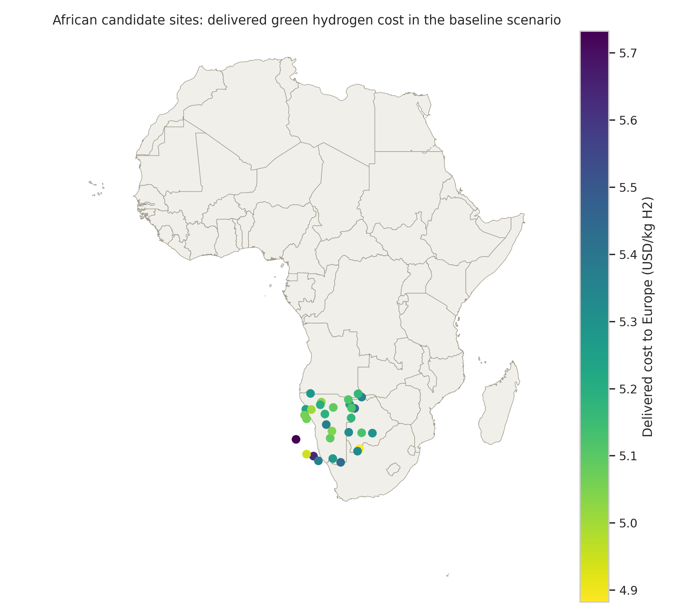
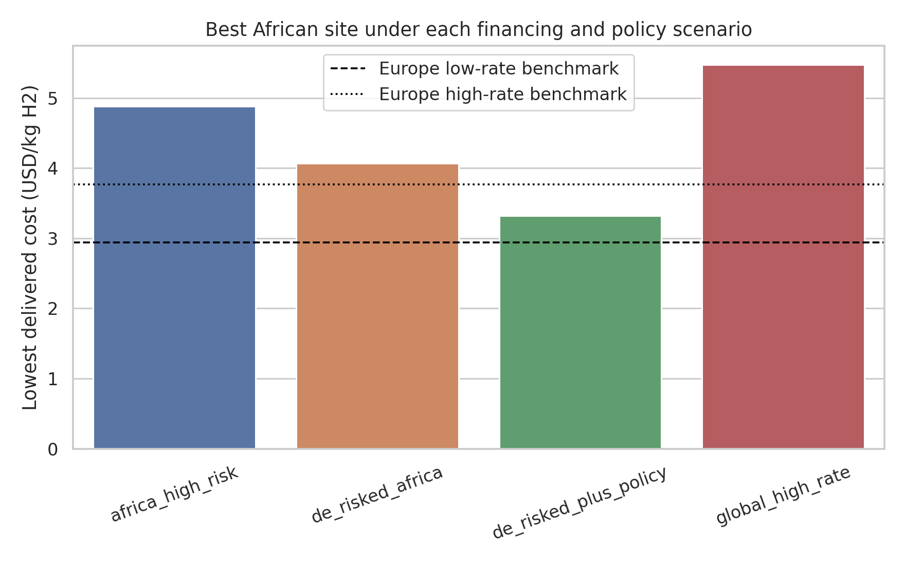
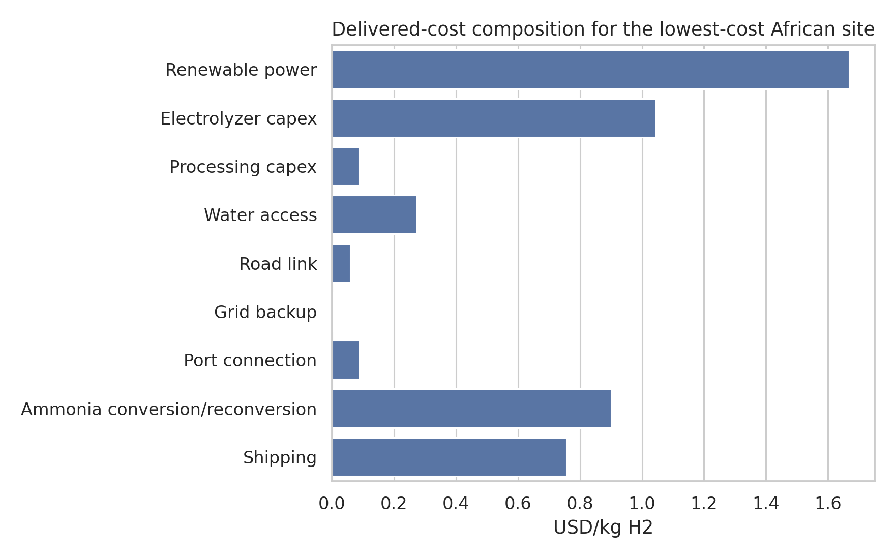
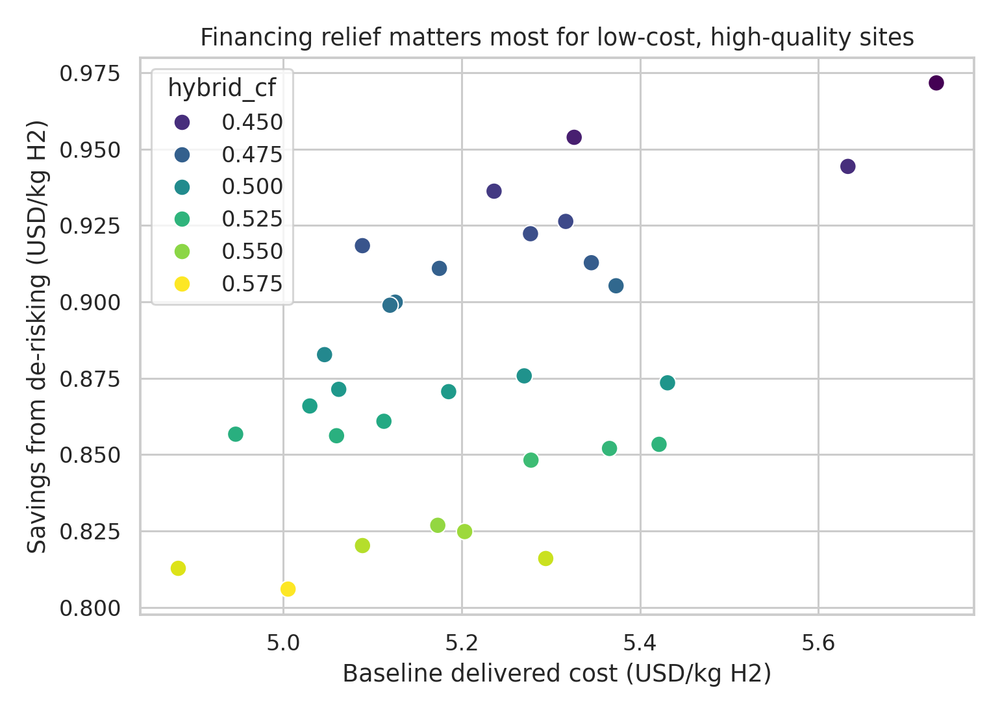

# Transparent Geospatial Cost Model For Delivering African Green Hydrogen To Europe By 2030

## Abstract

This study builds a transparent geospatial levelized-cost model for exporting African green hydrogen to Europe by 2030 through an ammonia shipping and reconversion chain. Using the benchmark's local site dataset, a country-boundary shapefile, and four local literature references, I estimate delivered hydrogen cost across 30 candidate African sites under four financing and policy scenarios. The model is intentionally simple and auditable: renewable resource quality drives effective electricity cost, infrastructure distances add explicit access penalties, ammonia conversion and shipping are separate line items, and financing enters through scenario-specific weighted average cost of capital (WACC). The main result is that the lowest-cost sites concentrate in Botswana and Namibia-like locations with strong hybrid renewable potential and moderate port access. De-risking African projects reduces frontier delivered cost by about $0.81/kg-H2 relative to a high-risk financing case, while a global high-rate environment raises the frontier by about $0.59/kg-H2. In this benchmark run, African exports do not beat a favorable European production case, but they become competitive against a high-rate European benchmark when African projects are both de-risked and policy-supported.

## 1. Research Objective

The task is to estimate the delivered cost of African green hydrogen to Europe via ammonia shipping and reconversion by 2030, identify least-cost locations, and quantify how de-risking and interest-rate conditions alter competitiveness relative to producing green hydrogen in Europe.

## 2. Local Inputs

### 2.1 Data

- `data/hex_final_NA_min.csv` contains 30 candidate sites with latitude, longitude, renewable-potential indicators (`theo_pv`, `theo_wind`), and distances to grid, road, ocean, and water infrastructure.
- `data/africa_map/ne_10m_admin_0_countries.*` provides country polygons used for spatial visualization and rough country assignment.

### 2.2 Literature Used

The local literature corpus in `related_work/` shaped the modeling choices:

- Halloran et al. (GeoH2) motivated explicit decomposition into production, conversion, transport, and infrastructure-access components.
- Muller et al. motivated geospatial ranking of candidate sites using hybrid renewables rather than a single-resource proxy.
- Steffen motivated explicit financing scenarios using different private WACC assumptions.
- Schmidt et al. motivated a high-interest-rate stress case to test how financing can reverse cost gains.

A short extraction note is saved at `outputs/literature_notes.md`.

## 3. Methodology

### 3.1 Modeling Philosophy

Because the benchmark data do not include hourly renewable profiles, electrolyzer dispatch, port identities, or route-specific shipping distances, I use a simplified but transparent delivered-cost model. The model is not a full system optimization. Instead, it is a screening model intended to preserve visibility over each cost driver and allow robust scenario comparisons.

### 3.2 Delivered-Cost Structure

For each site, delivered hydrogen cost to Europe is:

Delivered cost = renewable power cost + electrolyzer capital cost + processing capital cost + water-access cost + road-link cost + grid-backup cost + port-connection cost + ammonia conversion/reconversion cost + shipping cost - policy credit

Key implementation choices:

- Hybrid renewable quality is approximated from the site's PV and wind indicators.
- Renewable power cost uses a capital-recovery formulation with scenario-specific WACC.
- Infrastructure penalties scale linearly with the provided site distances.
- Ammonia conversion/reconversion and maritime shipping are represented as explicit fixed chain-cost terms.
- Europe is modeled as a benchmark production case with lower renewable quality but shorter domestic delivery scope and no ammonia export chain.

### 3.3 Financing And Policy Scenarios

Four African export scenarios are evaluated:

1. `africa_high_risk`: African WACC 14%, Europe benchmark WACC 6%.
2. `de_risked_africa`: African WACC 8%, representing concessional finance or strong guarantees.
3. `global_high_rate`: African WACC 18%, Europe benchmark WACC 10%.
4. `de_risked_plus_policy`: African WACC 8% plus a $0.75/kg-H2 policy credit at the European border.

European benchmark cases:

- `europe_low_rate`: WACC 5%, renewable capacity factor proxy 0.26.
- `europe_high_rate`: WACC 9%, renewable capacity factor proxy 0.26.

All assumptions used by the code are stored in `outputs/assumptions.json`.

### 3.4 Reproducibility

The full executable workflow is implemented in `code/run_analysis.py`. Running

```bash
python code/run_analysis.py
```

recreates all tables in `outputs/` and figures in `report/images/`.

## 4. Results

### 4.1 Data Overview

The benchmark site set is small but informative. It spans 30 candidate locations concentrated in southern Africa, with:

- PV indicator mean 0.74 and wind indicator mean 0.51.
- Mean distance to ocean of 216 km, but with wide heterogeneity.
- Mean distance to water bodies of 157 km and to roads of 65 km.

This combination makes the exercise primarily about the trade-off between excellent renewable quality inland and logistics penalties to reach export infrastructure.

### 4.2 Spatial Least-Cost Pattern

The lowest-cost sites consistently occur in Botswana and Namibia-like locations, especially where strong hybrid renewable quality coincides with relatively manageable ocean and road distances. The baseline map is shown below.



Under the baseline `africa_high_risk` case, the lowest-cost site is `hex_015` in Botswana at **$4.88/kg-H2 delivered**. Several Namibian sites cluster just above this level, indicating that the frontier is not dominated by a single outlier.

### 4.3 Scenario Comparison

The frontier costs by scenario are:

- `africa_high_risk`: **$4.88/kg-H2**
- `de_risked_africa`: **$4.07/kg-H2**
- `global_high_rate`: **$5.47/kg-H2**
- `de_risked_plus_policy`: **$3.32/kg-H2**

These results are visualized in the scenario comparison chart.



Two patterns are clear:

- Financing relief matters materially. Reducing African WACC from 14% to 8% lowers the frontier by about **$0.81/kg-H2**.
- Rising rates matter almost as much in the opposite direction. Moving from the baseline to the `global_high_rate` case increases the frontier by about **$0.59/kg-H2**.

The best country remains Botswana across all four scenarios, but the ranking gap versus top Namibian sites narrows under de-risking.

### 4.4 Cost Composition

The cost breakdown for the baseline lowest-cost site is shown below.



Three components dominate:

- Renewable power cost
- Electrolyzer capital cost
- Ammonia conversion/reconversion plus shipping

Infrastructure access costs are smaller individually but still meaningful in aggregate. This means that even with excellent resources, poor access to water, roads, or port infrastructure can erode competitiveness by several tenths of a dollar per kilogram.

### 4.5 De-Risking Sensitivity

The sensitivity of site costs to de-risking is shown below.



The savings from de-risking are largest for already-strong sites, because high-quality renewable locations have larger capital-intensive power-system value to unlock. In other words, financing relief mostly amplifies the advantage of good resource locations rather than rescuing poor ones.

### 4.6 Competitiveness Relative To Europe

The European benchmark results are:

- `europe_low_rate`: **$2.94/kg-H2**
- `europe_high_rate`: **$3.77/kg-H2**

Comparing the African frontier against Europe:

- In the baseline African high-risk case, Africa is **$1.94/kg** above the low-rate European benchmark and **$1.11/kg** above the high-rate European benchmark.
- With African de-risking alone, the gap narrows to **$1.13/kg** against low-rate Europe and **$0.30/kg** against high-rate Europe.
- With de-risking plus border support, Africa remains **$0.38/kg** above low-rate Europe but becomes **$0.45/kg cheaper** than high-rate Europe.

This is the central competitiveness result of the benchmark run: **African export competitiveness is highly financing-sensitive and becomes plausible first in a world where Europe also faces a less favorable interest-rate environment.**

## 5. Discussion

### 5.1 Interpretation

The model suggests that resource quality alone is not enough to secure export competitiveness. The African frontier improves meaningfully when capital costs fall, because hydrogen export systems are capital intensive at almost every stage: renewables, electrolyzers, processing, and port-linked infrastructure. This aligns with the local literature's emphasis on cost of capital as a first-order determinant for renewable-based energy systems.

### 5.2 Why The Best Sites Win

The top sites combine:

- high hybrid renewable quality
- moderate ocean distance
- manageable road connection cost

The best Botswana site is not the closest to water, but its strong renewable quality and good transport proximity outweigh its water-access penalty. That is a useful reminder that least-cost export sites may emerge from balanced infrastructure trade-offs, not just proximity to a single asset.

### 5.3 Limits

This benchmark uses a deliberately simplified model. Therefore, the following claims should not be overstated:

- The model does not optimize hourly dispatch or storage sizing from time-series weather.
- It uses generic shipping and conversion chain costs rather than route-specific engineering.
- Europe is represented as a benchmark stylized case, not a full geospatial European model.
- The 30-site dataset is too small to support continent-wide inference about all African export locations.

The outputs should therefore be interpreted as **transparent screening estimates**, not bankable project costs.

## 6. Claim Discipline

Claims supported by this benchmark:

- The candidate-site frontier for African green hydrogen exports is strongly shaped by financing assumptions.
- Within this dataset, Botswana- and Namibia-like sites dominate the least-cost frontier.
- De-risking reduces delivered cost by roughly $0.8/kg-H2 at the frontier.
- A high-rate global environment materially worsens African export costs and also weakens the European benchmark.
- African exports become competitive against Europe in this simplified benchmark only under a combined de-risking and policy-support case relative to a high-rate European benchmark.

Claims not supported by this benchmark:

- Exact 2030 project costs for any real country or port corridor.
- Optimal plant design, hourly operations, or trade volumes.
- Strong policy recommendations beyond the directional importance of de-risking and interest-rate conditions.

## 7. Conclusion

Using only the benchmark's local data and literature, this study builds a transparent delivered-cost model for African green hydrogen exports to Europe by 2030. The model identifies a least-cost frontier centered on Botswana and Namibia-like sites, with baseline delivered costs near $4.9/kg-H2 and de-risked costs near $4.1/kg-H2. Interest-rate stress pushes the frontier above $5.4/kg-H2, while a de-risked and policy-supported case lowers it to about $3.3/kg-H2. The main lesson is not that African exports are universally cheaper than European production, but that **financing conditions are decisive for whether African resource advantages translate into real competitiveness**.

## Files Produced

- Code: `code/run_analysis.py`
- Tables: `outputs/site_results.csv`, `outputs/scenario_summary.csv`, `outputs/top_sites_by_scenario.csv`, `outputs/africa_vs_europe.csv`, `outputs/europe_benchmark.csv`
- Figures: `images/africa_cost_map.png`, `images/scenario_comparison.png`, `images/cost_breakdown.png`, `images/derisking_sensitivity.png`
