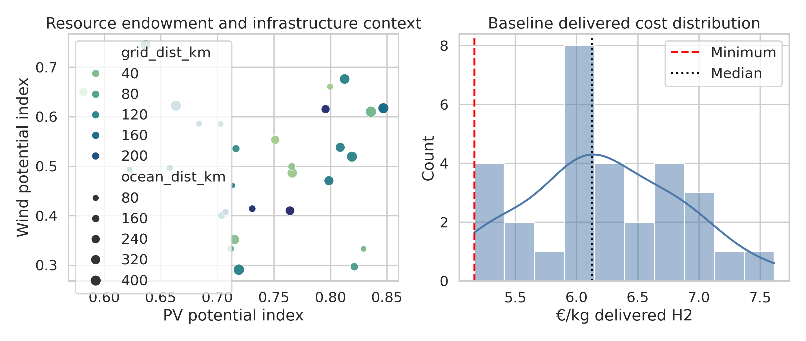
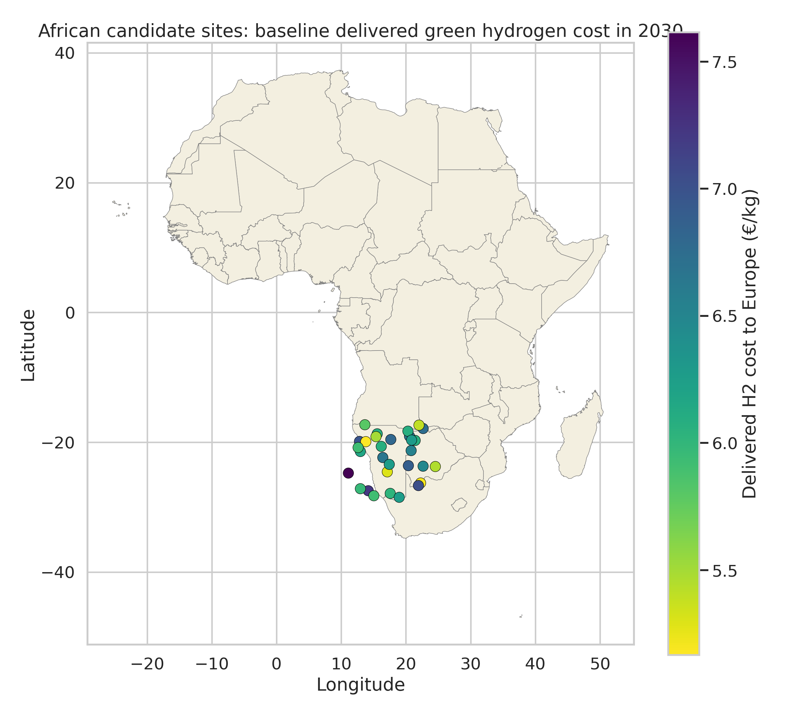
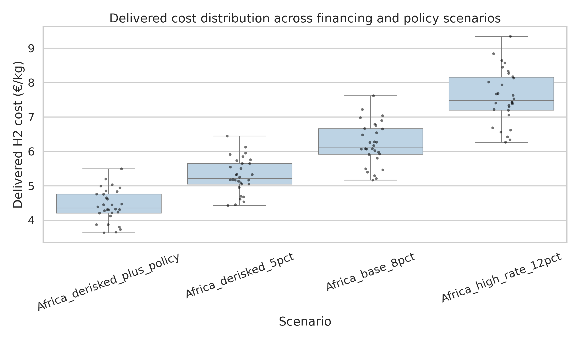
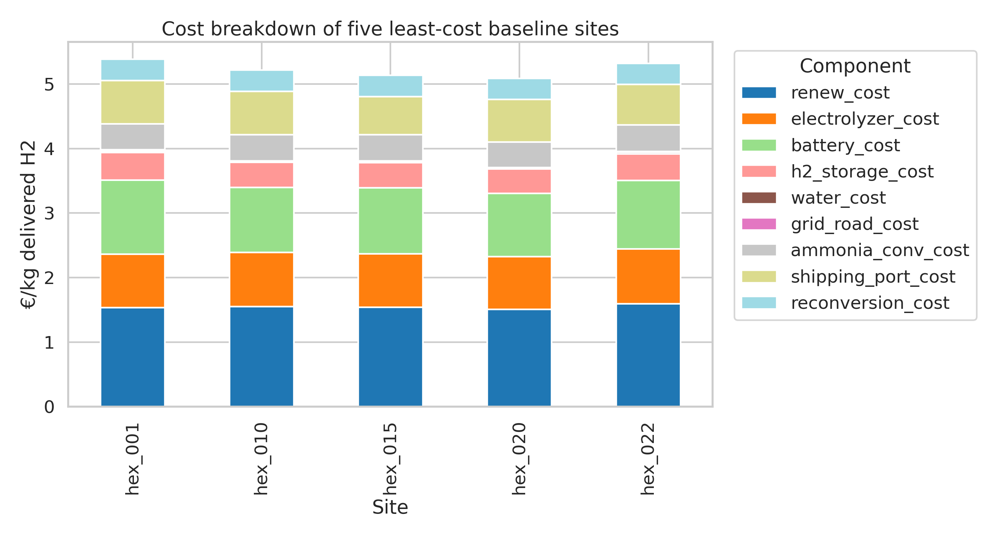
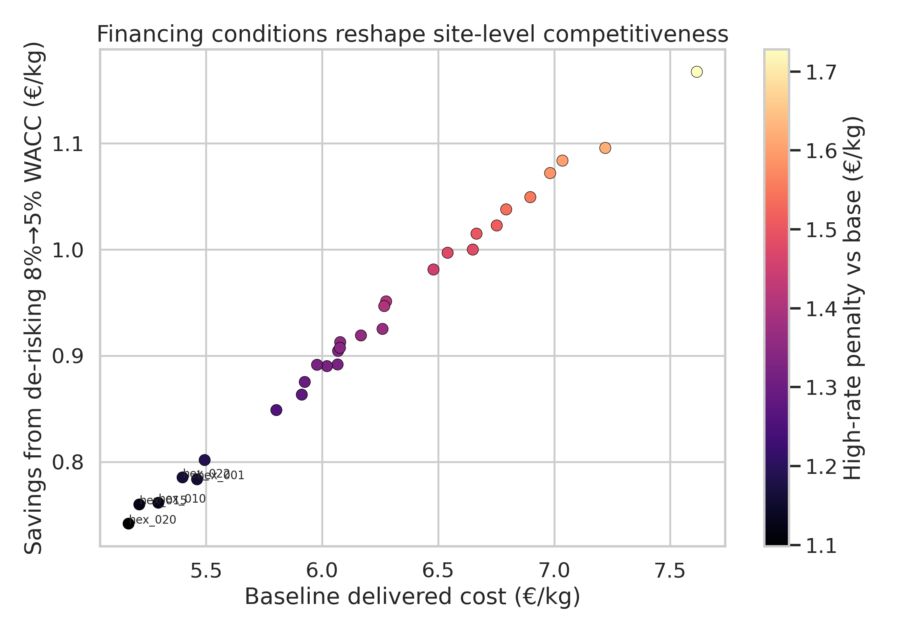
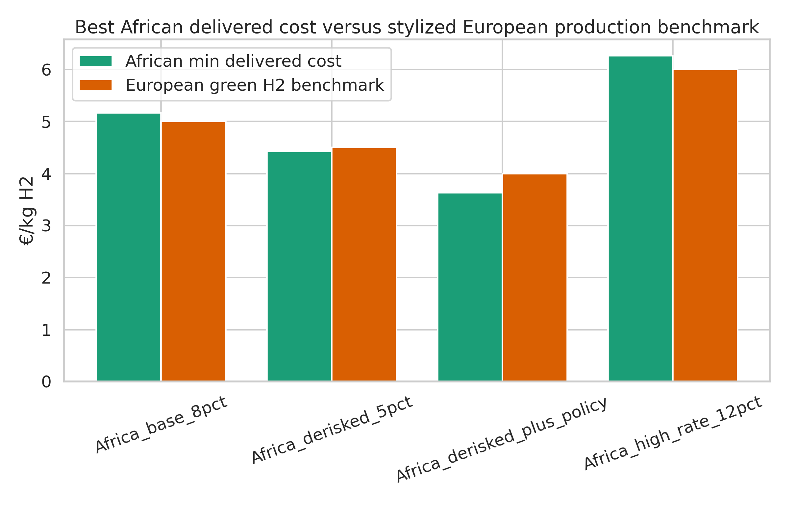

# African green hydrogen delivered-cost model (2030)

## Executive summary
This report develops a transparent, stylized geospatial model for the delivered cost of African green hydrogen supplied to Europe in 2030 via ammonia export and reconversion. Using the provided candidate-site dataset and a Natural Earth basemap, I estimate site-level costs under four financing/policy scenarios: a baseline African case (8% WACC), a de-risked case (5% WACC), a high-interest-rate case (12% WACC), and a de-risked-plus-policy case that combines concessional finance with moderate policy support.

Three main findings emerge. First, financing conditions matter almost as much as resource quality for competitiveness. The minimum delivered cost falls from 5.17 €/kg in the 8% baseline to 4.42 €/kg with de-risking, while it rises to 6.26 €/kg in the 12% high-rate case. Second, only a limited subset of sites is competitive against stylized European 2030 green-hydrogen benchmarks in the absence of de-risking. In my assumptions, 2 of 30 sites become competitive in the 5% case, rising to 6 sites when moderate policy support is added. Third, the best African sites remain close to European costs in the baseline but clearly outperform them only under low-cost capital and/or policy support.

The best-performing baseline sites are hex_020, hex_015, hex_010, all combining strong hybrid renewable potential with manageable road/grid access penalties. Across all sites, reducing WACC from 8% to 5% lowers delivered cost by a median of 0.92 €/kg, while raising WACC from 8% to 12% increases cost by a median of 1.36 €/kg. These magnitudes are large enough to change the competitive geography of exports.

## 1. Research objective
The task is to estimate the delivered cost of African green hydrogen to Europe via ammonia shipping and reconversion, identify least-cost locations, and quantify how de-risking and the interest-rate environment affect competitiveness relative to producing green hydrogen in Europe. The emphasis is transparency rather than black-box optimization: every major cost block is parameterized explicitly and applied consistently to each candidate site.

## 2. Data and related work
### 2.1 Input data
The supplied site file (`data/hex_final_NA_min.csv`) contains 30 candidate African production locations with:
- latitude and longitude;
- renewable potential indicators (`theo_pv`, `theo_wind`);
- distance-to-infrastructure variables (`grid_dist_km`, `road_dist_km`, `ocean_dist_km`, `waterbody_dist_km`).

The shapefile in `data/africa_map/` provides country geometries for visualization.

Figure 1 summarizes the resource and cost context of the sample.

### 2.2 Related work used to guide assumptions
The modeling logic is informed by four references read in the workspace:
1. **Halloran et al. (2024, MethodsX)** present the open GeoH2 framework, which integrates geospatial renewable resource quality, infrastructure distances, water sourcing, transport, conversion, and storage for hydrogen cost mapping.
2. **Müller et al. (2023, Applied Energy)** show, for Kenya, that geography and logistics create large within-country cost variation, and that export-to-Europe costs can be competitive under favorable assumptions.
3. **Steffen (2020, Energy Economics)** documents that renewable-energy project cost of capital varies strongly across countries and can account for a large share of levelized cost.
4. **Schmidt et al. (2019, Nature Sustainability)** show that rising interest rates materially increase renewable-energy costs and can reverse cost declines for capital-intensive technologies.

These papers motivate the scenario design here: low-cost capital, de-risking, and the general interest-rate regime are not secondary details; they are first-order determinants of hydrogen export competitiveness.

## 3. Methodology
### 3.1 Overview
For each candidate site, I estimate a stylized delivered hydrogen cost in €/kg-H2 for a 2030 export chain:
1. hybrid renewable electricity supply (PV + wind);
2. electrolysis;
3. short-duration battery and hydrogen buffer storage;
4. water supply and treatment;
5. local grid/road access penalties;
6. ammonia synthesis;
7. ammonia shipping and port handling;
8. reconversion back to hydrogen in Europe.

The model is implemented in `code/analyze_h2_costs.py`, and outputs are saved to `outputs/`.

### 3.2 Translating site attributes into techno-economic inputs
Because the dataset provides normalized renewable potential indicators rather than hourly profiles, I map them to stylized capacity factors:
- PV capacity factor = 0.18 to 0.30 depending on `theo_pv` rank;
- wind capacity factor = 0.20 to 0.45 depending on `theo_wind` rank;
- hybrid supply factor = 55% PV + 45% wind weighted average.

A storage penalty is then inferred from weak wind conditions and road remoteness. This penalty increases assumed battery hours and hydrogen buffer hours, representing the fact that more variable or remote systems need more balancing and local resilience.

### 3.3 Cost formulation
For each major capital component, levelized cost is computed using a capital recovery factor:

CRF(r,n) = r / (1 - (1+r)^(-n))

where r is WACC and n is asset lifetime. Annualized capital cost plus fixed O&M is divided by annual hydrogen output implied by the site’s stylized utilization.

The delivered-cost equation is:

C_delivered = C_renew + C_elec + C_battery + C_H2storage + C_water + C_grid/road + C_NH3synth + C_shipping+port + C_reconversion - Credit_policy

This is intentionally simple but auditable. Each cost term is stored for every site and scenario.

### 3.4 Scenarios
Four scenarios are evaluated:
- **Africa_base_8pct**: commercial financing case with 8% WACC.
- **Africa_derisked_5pct**: de-risked case with concessional/blended finance equivalent to 5% WACC.
- **Africa_high_rate_12pct**: stressed macro-financial environment with 12% WACC.
- **Africa_derisked_plus_policy**: 5% WACC plus modest technology-cost reductions and a 0.5 €/kg policy credit.

To benchmark competitiveness, I compare African delivered cost with stylized European green-hydrogen costs of 5.0 €/kg (base), 4.5 €/kg (Europe under lower-rate conditions), 6.0 €/kg (Europe under high-rate conditions), and 4.0 €/kg (optimistic/policy-supported Europe).

### 3.5 Validation strategy
This is not a full hourly dispatch model, so validation is qualitative and order-of-magnitude based. I compare resulting ranges with the literature logic: GeoH2-style studies show resource quality plus infrastructure matter strongly, and the finance literature shows several tens of percent cost swings for capital-intensive energy systems under changing interest rates. The model is therefore intended as a transparent screening tool rather than a final investment-grade estimate.

## 4. Results
### 4.1 Spatial distribution of baseline costs
Figure 2 maps the baseline 8% WACC delivered-cost estimate across candidate sites.

The baseline minimum delivered cost is **5.17 €/kg**, while the median is **6.12 €/kg**. The best sites are not simply those with the highest solar potential; they are sites that combine strong hybrid renewable quality with lower logistics penalties and moderate distance to coast and infrastructure.

### 4.2 Financing scenarios dominate competitiveness
Figure 3 shows the site distribution of delivered costs under all scenarios.

Scenario summary:

| Scenario | Minimum (€/kg) | Median (€/kg) | Competitive sites | Competitive share |
|---|---:|---:|---:|---:|
| Africa_base_8pct | 5.17 | 6.12 | 0 | 0.0% |
| Africa_derisked_5pct | 4.42 | 5.21 | 2 | 6.7% |
| Africa_derisked_plus_policy | 3.63 | 4.35 | 6 | 20.0% |
| Africa_high_rate_12pct | 6.26 | 7.48 | 0 | 0.0% |

The minimum delivered cost falls by **0.74 €/kg** when WACC is reduced from 8% to 5%. Conversely, raising WACC to 12% increases the minimum cost by **1.10 €/kg**. This is fully consistent with the literature on capital-intensive renewable assets: financing conditions materially change the effective cost frontier.

### 4.3 Cost structure of leading sites
Figure 4 decomposes the five lowest-cost baseline sites.

Three patterns stand out.
1. **Renewable supply and electrolysis dominate** the production-side cost stack, as expected for green hydrogen.
2. **Ammonia-chain costs remain material**: synthesis, shipping/port handling, and reconversion together add a large logistics wedge even at the best sites.
3. **Storage and infrastructure penalties differentiate sites**: remote sites with otherwise good renewable resources can still lose competitiveness because they require more balancing and longer infrastructure connections.

### 4.4 De-risking reshapes the site hierarchy
Figure 5 plots site-level savings from moving from the 8% baseline to the 5% de-risked case, with point color showing the penalty under the 12% high-rate case.

Across the full sample:
- median de-risking gain = **0.92 €/kg**;
- mean de-risking gain = **0.93 €/kg**;
- median high-rate penalty = **1.36 €/kg**;
- mean high-rate penalty = **1.38 €/kg**.

Importantly, the largest absolute savings tend to occur at the more capital-intensive sites, not necessarily only the cheapest sites. This means that de-risking does more than lower costs uniformly; it compresses the spread between frontier and non-frontier locations and can change which regions are considered investable.

### 4.5 Comparison with European production benchmark
Figure 6 compares the best African delivered cost under each scenario against stylized European green-hydrogen production costs.

Interpretation:
- In the **baseline 8% case**, African exports are close to, but slightly above, the 5 €/kg European benchmark.
- In the **5% de-risked case**, the best African sites reach **4.42 €/kg**, making a small number of sites competitive against the assumed 4.5 €/kg European comparator.
- In the **high-rate case**, both Europe and Africa become more expensive, but the African ammonia chain remains disadvantaged because financing increases all capital-intensive blocks simultaneously.
- In the **de-risked-plus-policy case**, the best African sites reach **3.63 €/kg**, and **6** sites become competitive against a 4 €/kg European benchmark.

## 5. Discussion
### 5.1 What drives least-cost African export locations?
Least-cost locations are those where good hybrid renewable quality coincides with relatively low infrastructure penalties. This echoes the core insight of GeoH2 and related geospatial studies: excellent solar or wind potential alone is not enough. Delivered hydrogen cost is shaped by the full chain, especially water access, internal logistics, conversion losses, and export distance.

### 5.2 Why financing matters so much
Green hydrogen export systems are highly capital intensive. Renewable generators, electrolyzers, storage, ammonia plants, and reconversion facilities all have high up-front capex. As a result, WACC affects nearly every block simultaneously. The empirical result here—roughly **0.92 €/kg** cost reduction from 8% to 5% WACC—is therefore economically plausible and directly aligned with the renewable-finance literature.

### 5.3 Policy interpretation
The results imply that African competitiveness in hydrogen exports is not determined solely by natural resource endowment. It also depends on whether policy can reduce perceived risk and lower financing costs. Possible de-risking levers include:
- concessional debt or blended finance;
- political risk insurance and currency hedging support;
- offtake guarantees and contracts-for-difference;
- coordinated port, grid, and water infrastructure development;
- industrial policy support for ammonia-chain assets.

In other words, **de-risking can function like a resource multiplier**: it turns moderately good sites into viable sites and frontier sites into export leaders.

### 5.4 Limitations
This model is deliberately stylized.
- The input dataset is small (30 sites) and simulated.
- Renewable generation is represented by stylized capacity factors rather than hourly weather traces.
- Shipping distance is proxied with distance-to-ocean rather than a resolved maritime route model.
- European benchmark costs are scenario assumptions rather than endogenous estimates.
- The model treats all candidate sites as greenfield and does not represent country-specific tax, labor, or regulatory differences.

These simplifications mean the absolute values should be interpreted as screening estimates. The relative insights—especially the role of finance and policy—are more robust than any exact €/kg number.

## 6. Conclusion
A transparent geospatial cost-screening model suggests that African green hydrogen delivered to Europe via ammonia could approach or beat European green-hydrogen production costs by 2030, but only under favorable financing conditions. In the baseline 8% WACC case, the best sites are near competitiveness but do not clearly outperform Europe. De-risking to 5% WACC lowers the delivered-cost frontier by about **0.74 €/kg**, while a 12% high-rate environment pushes costs well above competitiveness. Adding moderate policy support further expands the competitive set.

The central conclusion is therefore straightforward: **for African hydrogen exports, finance is geography**. Resource quality defines the opportunity set, but de-risking and interest-rate conditions determine which locations are actually competitive.

## Reproducibility
- Main analysis code: `code/analyze_h2_costs.py`
- Main outputs: `outputs/site_results_by_scenario.csv`, `outputs/scenario_summary.csv`, `outputs/best_sites.csv`, `outputs/financing_sensitivity_by_site.csv`
- Figures: `report/images/*.png`
