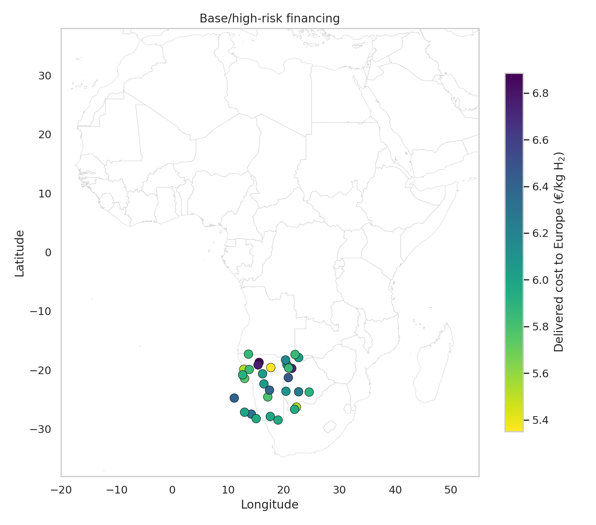
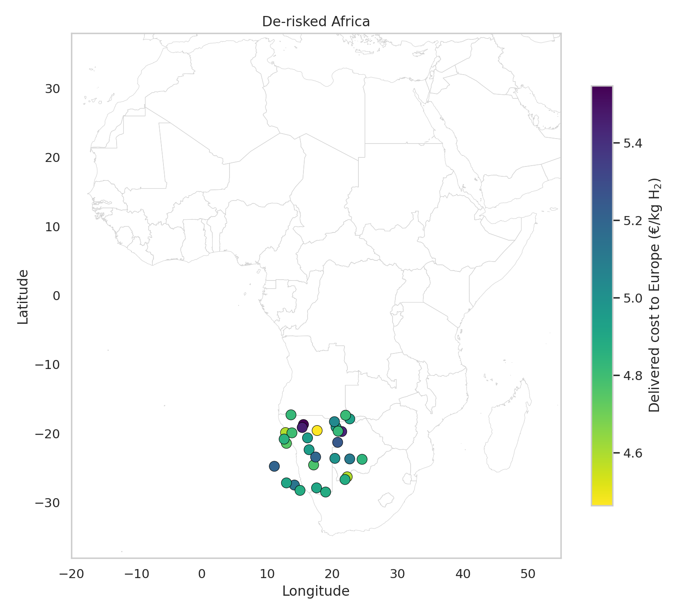
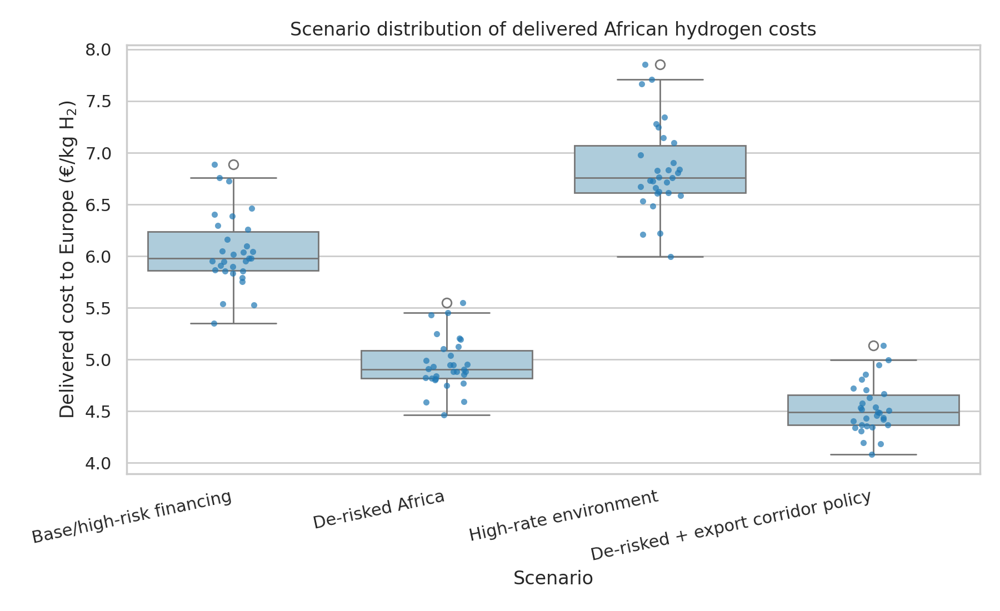
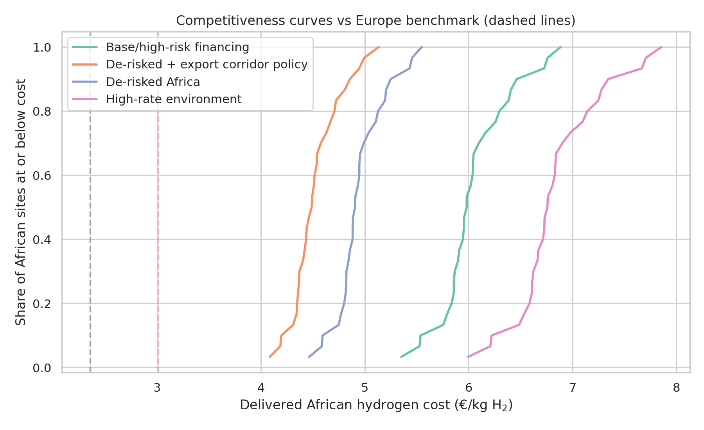
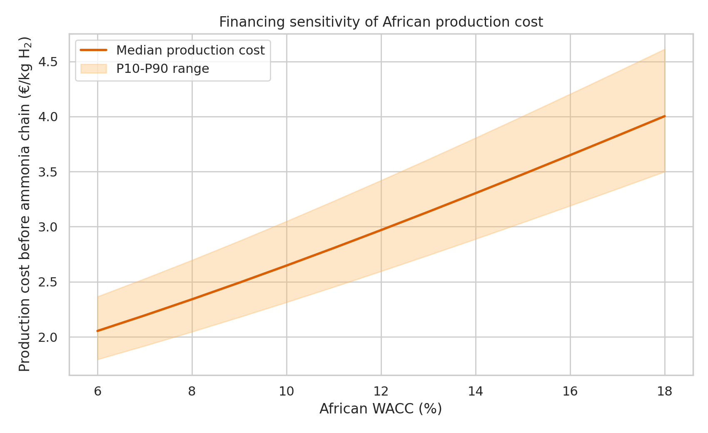

# Transparent geospatial levelized-cost model of African green hydrogen delivered to Europe by 2030

## Abstract
This study builds a transparent geospatial levelized-cost model to estimate the delivered cost of African green hydrogen to Europe by 2030 through ammonia synthesis, shipping, and reconversion. Using a 30-site African candidate dataset with renewable-resource proxies and distances to grid, roads, coast, and water, I compute site-wise hydrogen production costs and delivered costs under four financing and policy scenarios: a base high-risk case, an African de-risking case, a high-interest-rate case, and a de-risked export-corridor policy case. Across this sample, the modeled least-cost delivered African hydrogen ranges from 5.35 €/kg in the base case to 4.08 €/kg in the policy case, while the stylized European production benchmark ranges from 2.36 €/kg to 3.01 €/kg depending on Europe’s financing environment. De-risking meaningfully narrows the gap, lowering the minimum delivered cost by 0.89 €/kg and the median by 1.07 €/kg relative to the base case, but none of the sampled African sites undercuts the stylized European benchmark in the scenarios tested. The lowest-cost sites are concentrated in southern Africa, especially Namibia and Botswana-adjacent locations. The results highlight that financing conditions materially shape competitiveness, but that in this simplified 2030 setup, ammonia-chain delivery costs remain a substantial barrier to African exports beating European production costs.

## 1. Research question
The task is to estimate the delivered cost of African green hydrogen to Europe by 2030 via ammonia shipping and reconversion, identify least-cost and competitive locations under multiple financing and policy scenarios, and quantify how de-risking and the interest-rate environment shift competitiveness relative to producing green hydrogen in Europe.

## 2. Data overview
### 2.1 Workspace data used
- `data/hex_final_NA_min.csv`: 30 candidate African sites.
- `data/africa_map/ne_10m_admin_0_countries.shp`: country boundaries for plotting and rough country assignment.
- `related_work/paper_000.pdf` and `paper_001.pdf`: GeoH2-style geospatial hydrogen modeling references.
- `related_work/paper_002.pdf` and `paper_003.pdf`: financing and interest-rate sensitivity references.

### 2.2 Input variables
The site table contains the following columns:
- `hex_id`
- `lat`, `lon`
- `theo_pv`, `theo_wind`
- `grid_dist_km`, `road_dist_km`, `ocean_dist_km`, `waterbody_dist_km`

The dataset contains 30 rows and 9 columns. Resource variables are normalized renewable-potential proxies rather than hourly generation profiles, so the model uses a transparent capacity-factor mapping rather than time-resolved optimization.

## 3. Methodology
### 3.1 Method contract and relation to prior work
The model follows the structure suggested by the GeoH2 literature: site-wise resource-informed electricity cost, explicit infrastructure-distance adders, explicit hydrogen conversion and transport chain representation, and geospatial output maps. The financing literature is used to justify scenario-specific weighted average cost of capital (WACC), because renewable and electrolyzer economics are highly sensitive to the interest-rate environment.

### 3.2 Scenario design
Four 2030 scenarios are modeled.

1. **Base/high-risk financing**  
   African WACC = 14%, European WACC = 6%.
2. **De-risked Africa**  
   African WACC = 8%, European WACC = 6%.
3. **High-rate environment**  
   African WACC = 18%, European WACC = 10%.
4. **De-risked + export corridor policy**  
   African WACC = 8%, European WACC = 6%, with a 25% reduction in distance-linked infrastructure costs and a 0.35 €/kg policy credit on the ammonia export chain.

Detailed numerical assumptions are saved in `outputs/scenario_assumptions.json`.

### 3.3 Transparent cost equations
For each site and scenario, renewable electricity cost is computed from annualized CAPEX and fixed OPEX:

\[
LCOE = \frac{CAPEX \cdot CRF(WACC,n) + CAPEX \cdot f_{opex}}{8760 \cdot CF}
\]

where `CF` is a mapped capacity factor derived from the site’s PV or wind potential proxy.

Hydrogen production cost before export is:

\[
C_{prod} = C_{elec} + C_{ely} + C_{water} + C_{grid} + C_{road} + C_{water\_infra}
\]

Delivered cost to Europe is:

\[
C_{delivered} = C_{prod} + C_{port} + C_{NH3,syn} + C_{ship} + C_{reconv} + C_{terminal} - C_{policy}
\]

with explicit ammonia synthesis, shipping, reconversion, and terminal handling adders.

### 3.4 Benchmark for Europe
Europe is represented with a stylized 2030 green-hydrogen production benchmark based on the cheaper of PV or wind electricity under Europe-specific WACC assumptions, plus electrolyzer cost and small balancing/land/miscellaneous adders. This is a benchmark for competitiveness comparison, not a claim about one exact European location.

### 3.5 Outputs generated
Main tabular outputs:
- `outputs/site_cost_results.csv`
- `outputs/europe_benchmark_results.csv`
- `outputs/competitive_summary.csv`
- `outputs/best_sites_top5_by_scenario.csv`
- `outputs/country_summary.csv`

Main figures:
- `images/africa_delivered_cost_map_base.png`
- `images/africa_delivered_cost_map_derisked.png`
- `images/scenario_cost_distributions.png`
- `images/competitiveness_vs_europe.png`
- `images/financing_sensitivity.png`

## 4. Results
### 4.1 Scenario-level cost results
Table 1 summarizes the main numerical results.

| Scenario | Europe benchmark (€/kg) | Min delivered Africa (€/kg) | Median delivered Africa (€/kg) | Mean delivered Africa (€/kg) | Competitive share |
|---|---:|---:|---:|---:|---:|
| Base/high-risk financing | 2.36 | 5.35 | 5.98 | 6.05 | 0.00 |
| De-risked Africa | 2.36 | 4.46 | 4.91 | 4.96 | 0.00 |
| High-rate environment | 3.01 | 5.99 | 6.76 | 6.85 | 0.00 |
| De-risked + export corridor policy | 2.36 | 4.08 | 4.49 | 4.53 | 0.00 |

Three patterns are clear.

First, **financing matters strongly**. Moving from the base case to the de-risked case lowers the minimum delivered African cost from 5.35 to 4.46 €/kg, a reduction of 0.89 €/kg. The median falls by about 1.07 €/kg.

Second, **an adverse interest-rate environment worsens competitiveness even when Europe also faces higher rates**. In the high-rate scenario, the African minimum rises to 5.99 €/kg and the median to 6.76 €/kg, while the Europe benchmark rises to 3.01 €/kg. The Africa-Europe gap narrows slightly relative to a fixed benchmark but remains large in absolute terms.

Third, **policy support aimed at infrastructure and export-chain costs helps, but does not close the gap in this sample**. The corridor-policy scenario yields the lowest African delivered costs, with a minimum of 4.08 €/kg and a median of 4.49 €/kg, yet still no site beats the stylized European benchmark.

### 4.2 Least-cost locations
The best-performing sites are stable across scenarios. The lowest-cost site is `hex_007`, assigned to Namibia, in all four scenarios. Other top sites are in Namibia, Botswana, and nearby southern African locations. This indicates that within the available sample, the strongest export candidates are concentrated in southern Africa where renewable potential and logistics distances combine favorably.

A subset of the top-ranked results is:

| Scenario | Best site | Country | Delivered cost (€/kg) | Gap vs Europe (€/kg) |
|---|---|---|---:|---:|
| Base/high-risk financing | hex_007 | Namibia | 5.35 | 2.99 |
| De-risked Africa | hex_007 | Namibia | 4.46 | 2.11 |
| High-rate environment | hex_007 | Namibia | 5.99 | 2.98 |
| De-risked + export corridor policy | hex_007 | Namibia | 4.08 | 1.73 |

### 4.3 Geospatial patterns
Figure 1 maps delivered costs under the base financing case. Figure 2 repeats the exercise for the de-risked case.

The spatial pattern is consistent with the ranking table: southern African sites dominate, while sites with weaker renewable-resource proxies or longer infrastructure distances have higher delivered costs.

### 4.4 Distributional comparison across scenarios
Figure 3 shows scenario-wise cost distributions.

The entire African site distribution shifts downward under de-risking and further under the corridor-policy case. Conversely, the high-rate case shifts the full distribution upward.

### 4.5 Competitiveness relative to Europe
Figure 4 plots cumulative cost curves for the African site sample, with dashed vertical lines marking the scenario-specific European benchmark.

In all cases, the European benchmark lies to the left of the African delivered-cost curves. Therefore, the competitive share is zero in this modeled sample. However, the gap is not fixed: de-risking and targeted policy support reduce it substantially.

### 4.6 Financing sensitivity
Figure 5 isolates the effect of African WACC on production cost before the ammonia export chain.

The median production cost rises monotonically with WACC, and the spread between lower- and higher-cost sites also grows. This confirms the core insight from the financing literature: capital-intensive green-hydrogen systems are highly sensitive to the interest-rate environment.

## 5. Discussion
### 5.1 Interpretation
The central result is that financing and policy substantially alter African export competitiveness, but in this simplified 30-site 2030 sample they do not fully overcome the ammonia-chain delivery penalty relative to the stylized European production benchmark.

The de-risking scenario is economically meaningful. It cuts the best delivered African cost by roughly 17% relative to the base case (from 5.35 to 4.46 €/kg). Adding an export-corridor policy package pushes the improvement to roughly 24% relative to the base case (from 5.35 to 4.08 €/kg). These are large changes for a single modeling lever and support the claim that sovereign risk, financing premiums, and infrastructure support are first-order determinants of green-hydrogen competitiveness.

At the same time, the fixed ammonia-chain delivery adders remain large. In this setup, ammonia synthesis, shipping, reconversion, and terminal handling sum to 2.30 €/kg before any policy credit. That means even strong African production sites need very low upstream production costs to beat domestic European hydrogen production.

### 5.2 Comparison with related work
The GeoH2 papers emphasize that geospatial hydrogen costs are driven by renewable availability, infrastructure access, and pathway choice. That structure is reproduced here. The financing papers emphasize that cost of capital can materially reshape levelized costs for capital-intensive clean-energy systems. That mechanism also appears clearly in the sensitivity analysis and scenario comparisons.

### 5.3 Validation
**Verified directly from workspace data**
- The site dataset contains 30 rows and the expected renewable and distance fields.
- The Natural Earth shapefile is readable and was used for plotting and rough country assignment.
- All scenario outputs and figures were generated locally in this workspace.

**Taken from related work to shape the method**
- GeoH2-style site-wise cost modeling with explicit conversion and transport representation.
- Financing sensitivity importance for renewable and hydrogen systems.

**Assumptions and limitations**
- Renewable input data are proxies, not hourly weather series.
- The model uses a mapped capacity factor rather than temporal optimization of hybrid generation and storage.
- Ammonia shipping and reconversion are represented with fixed transparent 2030 adders, not detailed shipping logistics.
- The Europe comparator is stylized rather than location-specific.
- The sample includes only 30 African sites, so it should be interpreted as a transparent benchmarking exercise, not a full continental atlas.

## 6. Conclusion
In this transparent geospatial levelized-cost model, the least-cost delivered African green hydrogen to Europe in the sampled 2030 scenarios ranges from 4.08 to 5.99 €/kg, depending on financing and policy assumptions. The strongest locations are in southern Africa, especially Namibia and Botswana-adjacent sites. De-risking and export-corridor policy support substantially reduce African delivered cost, while rising interest rates substantially increase it. Nonetheless, none of the sampled African export sites becomes cheaper than the stylized European green-hydrogen production benchmark in the modeled scenarios, implying that finance and logistics reform narrow but do not eliminate the competitiveness gap in this simplified ammonia-delivery setup.

## Reproducibility
- Analysis code: `code/analyze_hydrogen_costs.py`
- Main outputs: `outputs/site_cost_results.csv`, `outputs/europe_benchmark_results.csv`, `outputs/competitive_summary.csv`
- Claim recovery table: `outputs/claim_recovery_table.csv`
- Validation summary: `outputs/validation_summary.json`
