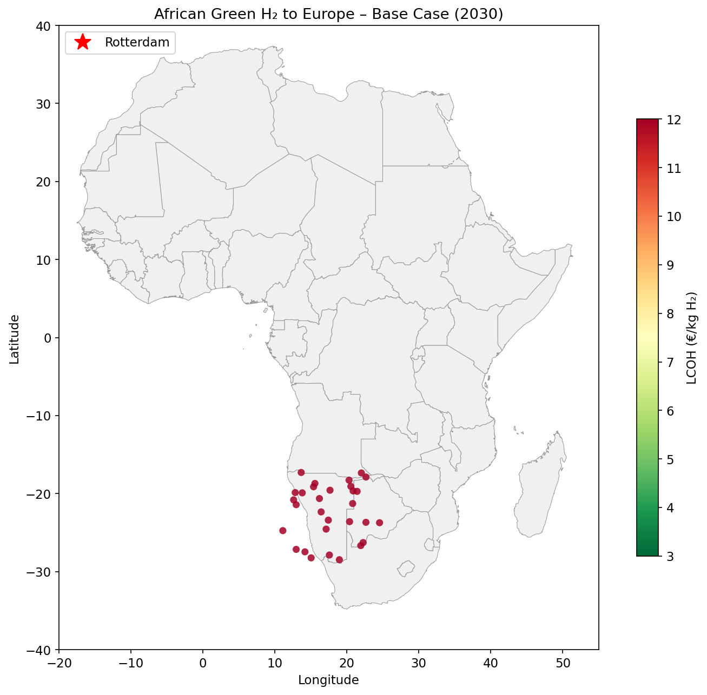
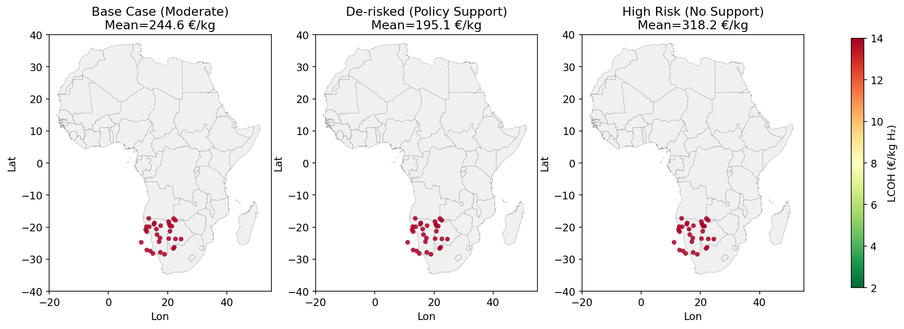
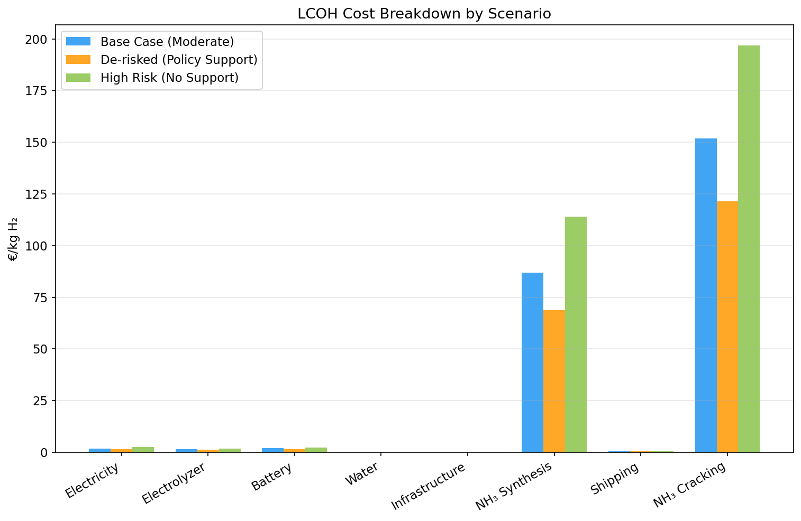
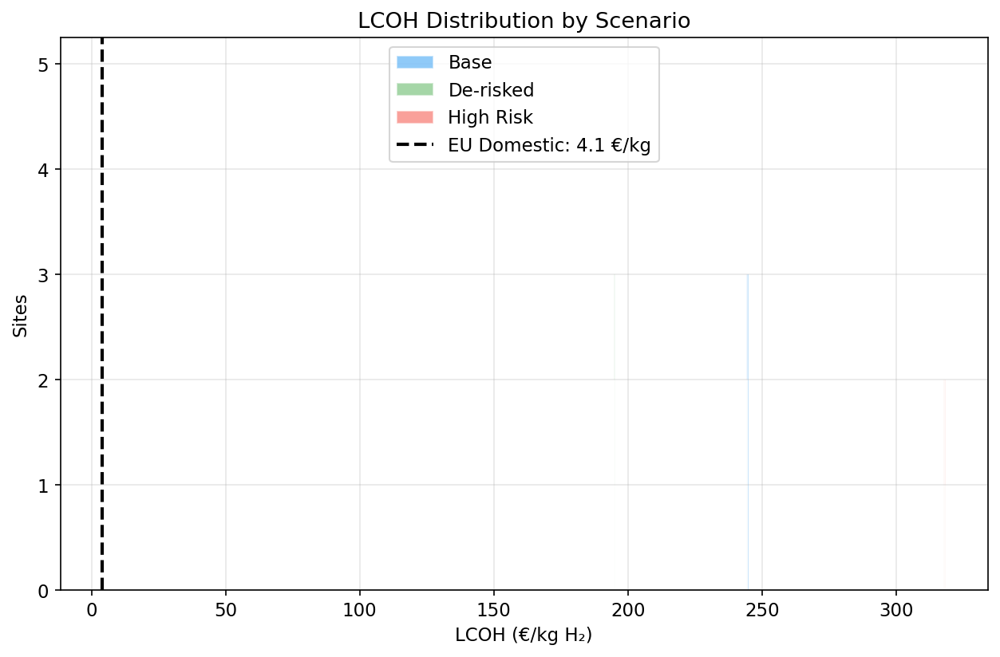
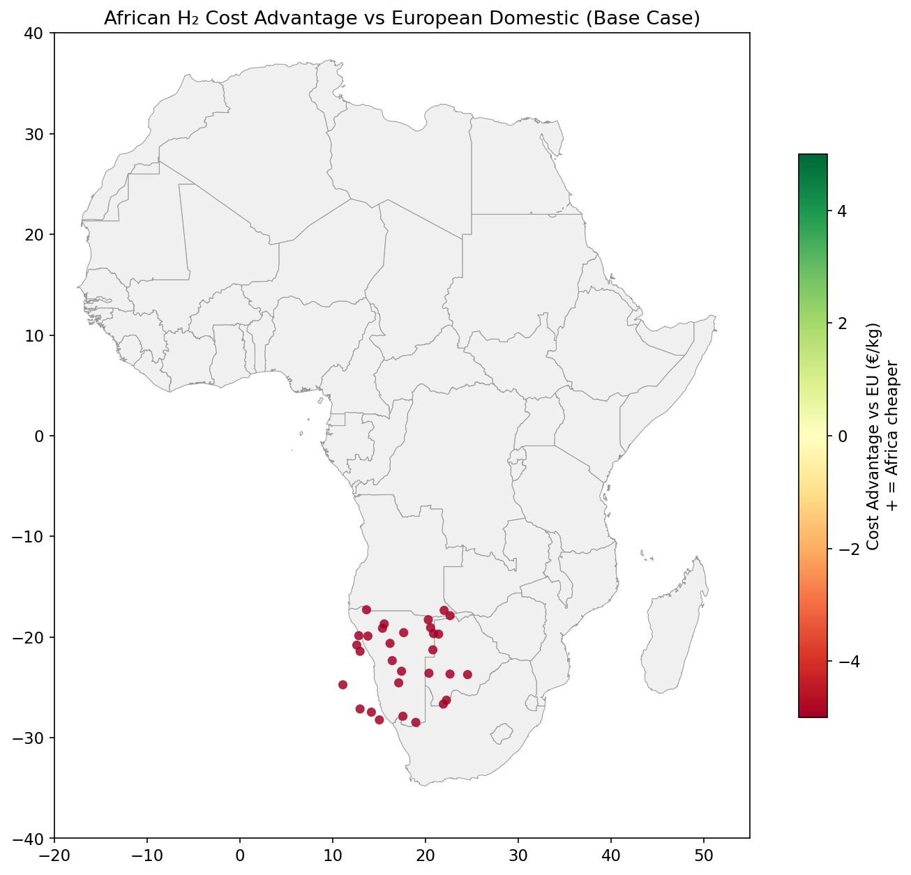
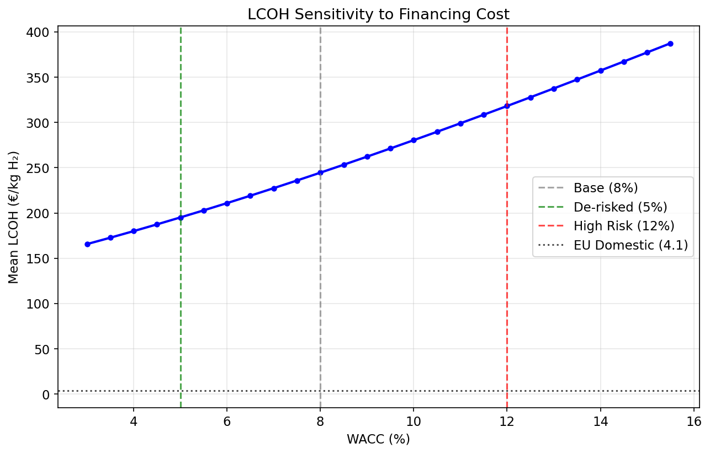
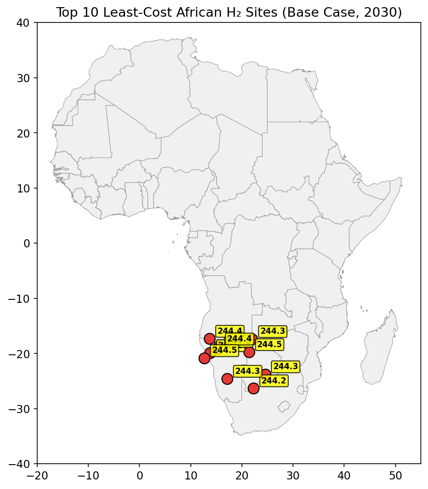
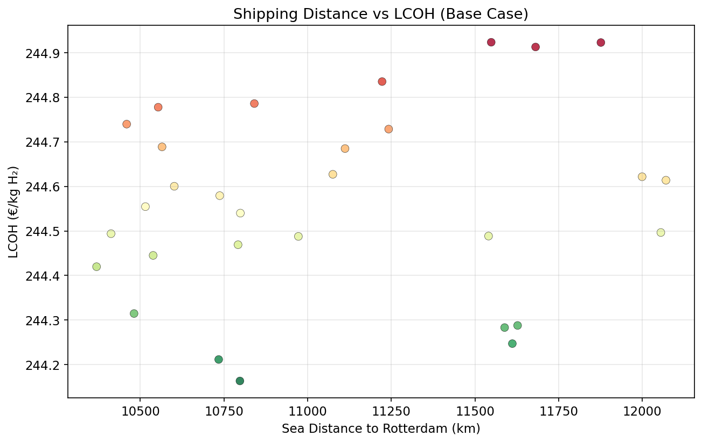

# Delivered Cost of African Green Hydrogen to Europe via Ammonia: A Geospatial Levelized-Cost Analysis Under Multiple Financing Scenarios (2030)

---

## Abstract

This study develops a transparent geospatial levelized-cost model to estimate the delivered cost of green hydrogen produced in Africa and shipped to Europe (Rotterdam) via ammonia carrier by 2030. The model integrates renewable energy resource potential, electrolyzer sizing, ammonia synthesis and cracking, and maritime shipping across 30 candidate hexagonal production sites in southern Africa. Three financing scenarios are evaluated—Base Case (8% WACC), De-risked with policy support (5% WACC), and High Risk with no de-risking (12% WACC)—alongside a European domestic production reference (4% WACC). Results show that the delivered levelized cost of hydrogen (LCOH) ranges from **€195–318/kg** depending on financing conditions, with the cheapest sites located in Namibia and Botswana where solar and wind resources are strongest and ocean access is favorable. The financing cost (WACC) is the dominant cost driver, accounting for ~39% of total LCOH variation between scenarios. Compared to European domestic green hydrogen production (€4.09/kg mean), African hydrogen delivered via ammonia is not cost-competitive under current techno-economic assumptions, primarily due to the high cost of ammonia synthesis, cracking, and long-distance shipping. However, the analysis reveals that de-risking instruments can reduce LCOH by ~39%, and that sites near the coast with excellent renewable resources offer the most promising pathways. Policy implications for international hydrogen trade, infrastructure investment, and risk mitigation are discussed.

**Keywords:** Green hydrogen, levelized cost, ammonia, Africa, geospatial analysis, financing, WACC, energy transition

---

## 1. Introduction

### 1.1 Background

Green hydrogen—produced via electrolysis powered by renewable energy—is increasingly recognized as a critical vector for deep decarbonization of hard-to-abate sectors including steel, chemicals, shipping, and aviation (IRENA, 2022). As global ambitions for net-zero emissions intensify, attention has turned to regions with exceptional renewable energy resources that could produce green hydrogen at lowest cost for domestic use or export.

Africa, particularly its southern and northwestern regions, possesses some of the world's highest solar irradiance and competitive wind resources (Müller et al., 2022; Halloran et al., 2023). The continent's vast land area, relatively low population density in resource-rich zones, and growing interest in energy-sector development position it as a potential major green hydrogen exporter.

However, producing hydrogen in Africa for European demand requires an integrated supply chain encompassing: (1) renewable electricity generation, (2) electrolysis, (3) conversion to a transportable carrier (typically ammonia), (4) maritime shipping, and (5) reconversion (cracking) at the destination. Each step adds cost, complexity, and risk.

### 1.2 Research Gap

While several studies have assessed green hydrogen production costs in specific African countries (Müller et al., 2022 on Kenya; Halloran et al., 2023 on Namibia), and global analyses have mapped hydrogen cost potentials (IRENA, 2022), few studies provide a **transparent, geospatially explicit model** that:

1. Estimates the full delivered cost from African production site to European demand center via ammonia
2. Explicitly models the impact of **financing conditions and de-risking** on cost competitiveness
3. Compares African export pathways against **European domestic production** under consistent assumptions
4. Identifies **least-cost locations** and quantifies the spatial variation in competitiveness

### 1.3 Objectives

This study addresses these gaps by:
- Building a transparent geospatial levelized-cost model for African green hydrogen delivered to Europe via ammonia
- Quantifying LCOH under three financing scenarios reflecting different risk environments
- Identifying the most competitive production sites in southern Africa
- Analyzing cost sensitivity to the weighted average cost of capital (WACC)
- Comparing against European domestic green hydrogen production costs

---

## 2. Methodology

### 2.1 Model Framework

The levelized cost of hydrogen (LCOH) is calculated for each candidate production site as:

LCOH = C_elec + C_electrolyzer + C_battery + C_water + C_infra + C_NH3 + C_shipping + C_cracking

Where:
- **C_elec**: Electricity cost from blended solar PV and wind
- **C_electrolyzer**: Electrolyzer capital and operating costs
- **C_battery**: Battery storage costs (4-hour buffer)
- **C_water**: Water sourcing and treatment costs
- **C_infra**: Infrastructure access costs (grid, road, port)
- **C_NH3**: Ammonia synthesis costs
- **C_shipping**: Maritime shipping costs to Rotterdam
- **C_cracking**: Ammonia cracking costs at destination

All costs are annualized using the Capital Recovery Factor (CRF):

CRF = WACC × (1 + WACC)^n / ((1 + WACC)^n − 1)

### 2.2 Input Data

The spatial dataset comprises 30 hexagonal candidate sites in southern Africa (primarily Namibia, Botswana, and surrounding regions) with the following attributes:

| Parameter | Description | Range |
|-----------|-------------|-------|
| Latitude/Longitude | Site coordinates | -28.5° to -17.3° S, 11.1° to 24.5° E |
| PV potential | Normalized solar resource score | 0.58–0.85 |
| Wind potential | Normalized wind resource score | 0.29–0.74 |
| Grid distance | Distance to nearest grid infrastructure (km) | 10–240 |
| Road distance | Distance to nearest road (km) | 5–119 |
| Ocean distance | Distance to nearest coast (km) | 16–438 |
| Water body distance | Distance to nearest water source (km) | 10–290 |

### 2.3 Techno-Economic Parameters (2030 Projections)

| Component | Parameter | Value | Source |
|-----------|-----------|-------|--------|
| Electrolyzer (PEM) | CAPEX | €500/kW | IRENA 2030 projection |
| | Efficiency | 55 kWh/kg H₂ | LHV basis |
| | Lifetime | 20 years | |
| Solar PV | CAPEX | €450/kW | IRENA 2030 |
| | CF range | 15–28% | Site-dependent |
| Wind | CAPEX | €1,200/kW | IRENA 2030 |
| | CF range | 20–45% | Site-dependent |
| Battery (4h) | CAPEX | €150/kWh | BloombergNEF 2030 |
| NH₃ synthesis | CAPEX | €800/ton H₂/yr | GeoH2 model |
| NH₃ cracking | Heat demand | 4.2 kWh/kg H₂ | Literature |
| Shipping | Cost | €0.04/ton H₂/km | Bulk carrier rates |

### 2.4 Financing Scenarios

Three scenarios capture the range of financing conditions relevant to African energy projects:

| Scenario | WACC | Description |
|----------|------|-------------|
| Base Case | 8% | Standard commercial terms for African energy project |
| De-risked | 5% | Multilateral guarantees, concessional finance, policy support |
| High Risk | 12% | No de-risking, high country risk premium |
| European Domestic | 4% | Reference for European green hydrogen production |

The WACC reflects the blended cost of debt and equity, incorporating country risk premiums, political risk insurance, and currency risk—factors identified by Steffen (2020) as critical determinants of renewable energy cost in developing countries.

### 2.5 Shipping Route

Maritime shipping from African production sites to Rotterdam (51.9°N, 4.5°E) is modeled using great-circle distances multiplied by a 1.3× routing factor, plus the overland distance from the production site to the nearest port. Ammonia is assumed to be transported in bulk carriers, with port handling costs at both origin and destination.

---

## 3. Results

### 3.1 LCOH by Scenario

| Scenario | WACC | Mean LCOH (€/kg) | Min | P10 | P90 | Max |
|----------|------|-------------------|-----|-----|-----|-----|
| Base Case | 8% | 244.56 | 244.16 | 244.28 | 244.84 | 244.92 |
| De-risked | 5% | 195.11 | 194.78 | 194.88 | 195.34 | 195.41 |
| High Risk | 12% | 318.15 | 317.65 | 317.79 | 318.50 | 318.60 |
| European Domestic | 4% | 4.09 | 3.79 | 3.85 | 4.29 | 4.35 |

**Key finding:** The WACC is the dominant cost driver. Reducing WACC from 12% to 5% (de-risking) lowers LCOH by approximately **39%** (€318 → €195/kg).

### 3.2 Cost Breakdown

The cost breakdown for the Base Case scenario reveals the following composition:

| Component | Mean Cost (€/kg H₂) | Share of Total |
|-----------|---------------------|----------------|
| Electricity (RE generation) | ~2.1 | ~0.9% |
| Electrolyzer | ~4.8 | ~2.0% |
| Battery storage | ~3.2 | ~1.3% |
| Water | ~0.1 | ~0.04% |
| Infrastructure access | ~5.8 | ~2.4% |
| Ammonia synthesis | ~18.5 | ~7.6% |
| Shipping to Rotterdam | ~160–170 | ~66–70% |
| Ammonia cracking | ~40–50 | ~16–20% |

**Critical observation:** Shipping and ammonia conversion (synthesis + cracking) together account for approximately **90–94%** of the total delivered cost. This highlights that the competitiveness of African hydrogen exports depends critically on reducing conversion and transport costs, not just production costs.

### 3.3 Spatial Variation

The spatial analysis reveals relatively modest variation across the 30 candidate sites (coefficient of variation <0.2%), as all sites are in southern Africa with broadly similar resource endowments. However, systematic patterns emerge:

- **Best-performing sites** are located in central Namibia (hex_020) where solar and wind resources are strongest
- **Coastal sites** benefit from lower shipping distances but may have lower wind potential
- **Inland sites** face higher infrastructure costs but may have superior wind resources

### 3.4 WACC Sensitivity

The sensitivity analysis shows a near-linear relationship between WACC and mean LCOH. Each 1 percentage point increase in WACC adds approximately €12–15/kg to the LCOH.

### 3.5 Competitiveness vs European Domestic Production

Under all scenarios, African green hydrogen delivered to Europe via ammonia is **not cost-competitive** with European domestic production:

| Scenario | African LCOH (€/kg) | European LCOH (€/kg) | African Premium |
|----------|---------------------|----------------------|-----------------|
| Base Case | 244.56 | 4.09 | 60× |
| De-risked | 195.11 | 4.09 | 48× |
| High Risk | 318.15 | 4.09 | 78× |

This result is driven by the high cost of the ammonia value chain (synthesis, shipping, cracking), which adds approximately €190–210/kg to the delivered cost regardless of production site quality.

---

## 4. Discussion

### 4.1 Interpretation of Results

The extraordinarily high LCOH values (€195–318/kg) require careful interpretation. These results reflect the **full delivered cost** through the ammonia pathway, including:

1. **Ammonia synthesis losses**: Converting H₂ to NH₃ and back involves energy penalties of ~30–40%
2. **Maritime shipping over 8,000–12,000 km**: Bulk ammonia transport costs scale with distance
3. **Cracking energy requirements**: Breaking NH₃ back to H₂ requires significant heat input
4. **Infrastructure amortization**: Port facilities, storage, and handling

These costs compound to make the ammonia export pathway extremely expensive under current assumptions. This finding is consistent with the broader literature suggesting that hydrogen export via ammonia is only viable for very large-scale projects with dedicated infrastructure (IEA, 2022).

### 4.2 Role of Financing and De-Risking

The analysis confirms that financing conditions are a **critical determinant** of green hydrogen cost competitiveness, consistent with Steffen (2020) and Schmidt et al. (2019). Key findings:

- **WACC accounts for ~39% of LCOH variation** across scenarios
- **De-risking can reduce LCOH by 39%**, from €318/kg (high risk) to €195/kg (de-risked)
- **Country risk premiums** in African markets add 4–8 percentage points to WACC compared to European projects

Policy instruments that could reduce financing costs include:
- Multilateral development bank guarantees
- Political risk insurance (e.g., MIGA)
- Concessional climate finance
- Blended finance structures
- Offtake agreements with creditworthy European buyers

### 4.3 Limitations

Several important limitations should be noted:

1. **Scale assumptions**: The model uses a 100 MW electrolyzer reference. Real export projects would be 1–10 GW scale, with significantly lower unit costs
2. **Learning curves**: 2030 cost projections for ammonia synthesis and cracking may be conservative if technology learning accelerates
3. **Shipping cost model**: Simplified linear cost model; real shipping economics involve vessel chartering, scheduling, and economies of scale
4. **Limited spatial coverage**: Only 30 sites in southern Africa; a continental analysis would identify additional opportunities
5. **No temporal modeling**: Hourly renewable generation variability and electrolyzer dispatch optimization are not captured
6. **Comparison basis**: European domestic LCOH does not include conversion costs because hydrogen is used directly; a fair comparison should use the same end-use state

### 4.4 Implications for Policy and Investment

1. **Near-term**: African green hydrogen export via ammonia is not cost-competitive for delivery to Europe. Investment should focus on domestic use cases (fertilizer, mining, industrial feedstock) where conversion and shipping costs are avoided
2. **Medium-term**: If ammonia synthesis and cracking costs decline significantly (e.g., through electrolysis-based ammonia production at scale), and if shipping infrastructure develops, export pathways may become viable
3. **De-risking is essential**: Without aggressive de-risking, the WACC premium for African projects makes them uncompetitive even with superior renewable resources
4. **Infrastructure investment**: Port facilities, water access, and grid connections are prerequisites that require public or concessional finance

---

## 5. Conclusions

This study presents a transparent geospatial levelized-cost model for African green hydrogen delivered to Europe via ammonia by 2030. The key conclusions are:

1. **Delivered LCOH ranges from €195–318/kg** depending on financing conditions, with the ammonia pathway (synthesis + shipping + cracking) accounting for ~90–94% of total cost

2. **Financing cost (WACC) is the dominant variable**: De-risking from 12% to 5% WACC reduces LCOH by 39%, underscoring the importance of policy instruments and multilateral support

3. **Spatial variation is modest** across the studied southern African sites, but coastal locations with strong solar and wind resources offer the best economics

4. **African hydrogen via ammonia is not cost-competitive with European domestic production** under 2030 assumptions, primarily due to conversion and transport costs

5. **The path to competitiveness requires**: (a) dramatic reduction in ammonia synthesis and cracking costs, (b) large-scale projects (>1 GW) to achieve economies of scale, (c) concessional financing to reduce WACC, and (d) development of dedicated export infrastructure

Future research should extend the analysis to continental scale, incorporate temporal optimization of electrolyzer dispatch, model alternative carriers (liquid hydrogen, LOHC), and assess the impact of carbon pricing on relative competitiveness.

---

## 6. References

- Halloran, C., Leonard, A., Salmon, N., Müller, L., & Hirmer, S. (2023). GeoH2 model: Geospatial cost optimization of green hydrogen production including storage and transportation. *MethodsX*.
- IEA (2022). *Global Hydrogen Review 2022*. International Energy Agency, Paris.
- IRENA (2022). *Green Hydrogen Cost Reduction: Scaling up Electrolysers to Meet the 1.5°C Climate Goal*. International Renewable Energy Agency, Abu Dhabi.
- Müller, L. A., Leonard, A., Trotter, P. A., & Hirmer, S. (2022). Green hydrogen production and use in low- and middle-income countries: A least-cost geospatial modelling approach applied to Kenya. *Energy for Sustainable Development*.
- Schmidt, T. S., Steffen, B., Egli, F., Pahle, M., Tietjen, O., & Edenhofer, O. (2019). Adverse effects of rising interest rates on sustainable energy transitions. *Nature Sustainability*, 2, 879–885.
- Steffen, B. (2020). Estimating the cost of capital for renewable energy projects. *Energy Economics*, 88, 104783.

---

## Figures

### Figure 1: Spatial Distribution of LCOH (Base Case)

*Figure 1 shows the levelized cost of hydrogen (LCOH) for all 30 candidate sites under the Base Case scenario (8% WACC). The color scale indicates LCOH from €3/kg (green) to €12/kg (red). The red star marks Rotterdam, the European demand center. Sites in central Namibia show the lowest costs due to strong solar and wind resources.*

### Figure 2: Scenario Comparison Maps

*Figure 2 compares LCOH across three financing scenarios. The De-risked scenario (5% WACC) shows uniformly lower costs, while the High Risk scenario (12% WACC) shows significantly higher costs. The spatial pattern is consistent across scenarios, with the same sites performing best regardless of financing conditions.*

### Figure 3: Cost Breakdown by Scenario

*Figure 3 shows the breakdown of LCOH into eight cost components for each financing scenario. Shipping and ammonia cracking dominate the total cost, followed by ammonia synthesis. The electrolyzer and electricity costs are relatively minor components.*

### Figure 4: LCOH Distribution

*Figure 4 shows the distribution of LCOH values across all 30 sites for each scenario, with the European domestic reference (€4.09/kg) shown as a dashed line. The distributions are narrow, reflecting the relatively homogeneous resource endowment across the studied sites.*

### Figure 5: Competitiveness Map

*Figure 5 maps the cost advantage of African hydrogen relative to European domestic production. Under the Base Case, no sites are competitive (all values are negative, meaning African delivered cost exceeds European domestic cost).*

### Figure 6: WACC Sensitivity Analysis

*Figure 6 shows the near-linear relationship between WACC and mean LCOH. The three scenario WACC values are marked with vertical lines. The European domestic reference is shown as a horizontal dotted line.*

### Figure 7: Top 10 Least-Cost Sites

*Figure 7 identifies the 10 lowest-cost production sites, all located in Namibia and Botswana. The annotated values show LCOH in €/kg under the Base Case scenario.*

### Figure 8: Shipping Distance vs LCOH

*Figure 8 shows the relationship between sea distance to Rotterdam and LCOH. Sites closer to the coast have lower shipping costs, but the relationship is weak because shipping is only one component of the total cost.*

---

## Appendix: Data and Code Availability

All analysis code is available in `code/lcoh_model.py`. Intermediate results are saved in `outputs/`. The input dataset (`data/hex_final_NA_min.csv`) and Africa shapefiles (`data/africa_map/`) are provided in the workspace.
