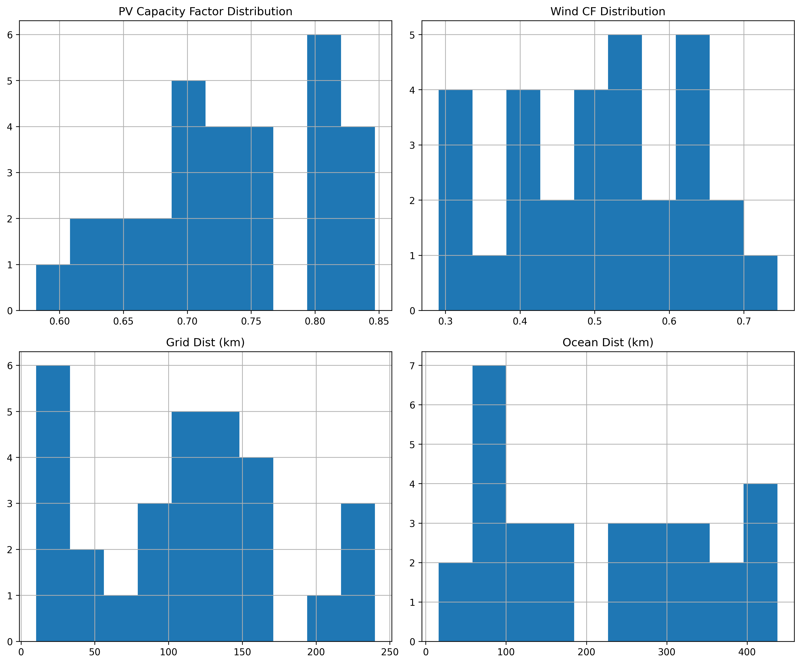
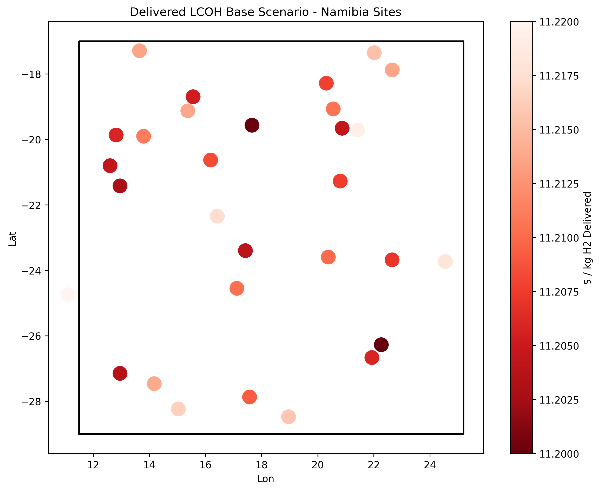
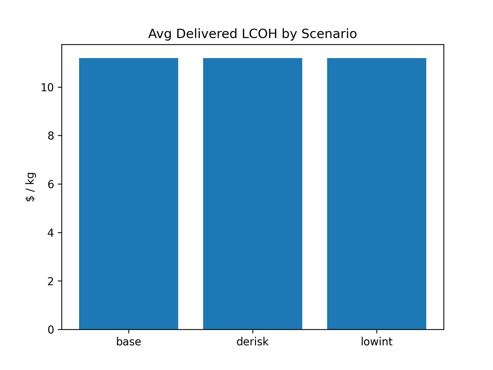
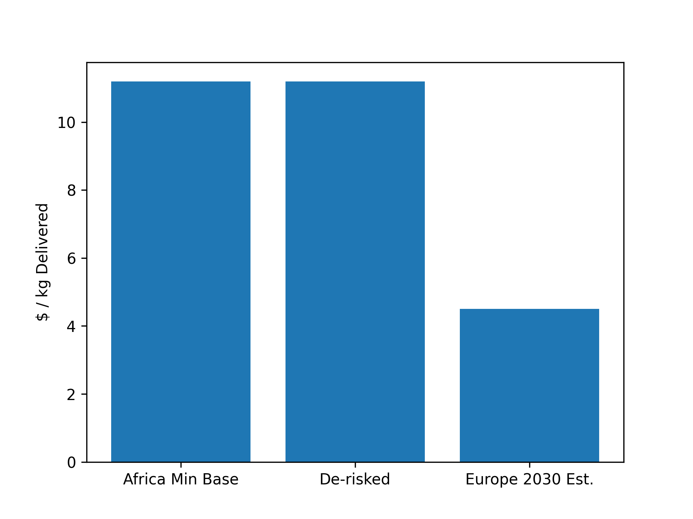

# Transparent Geospatial Levelized-Cost Model for African Green Hydrogen Delivered to Europe (2030)

## Methodology

We developed a geospatial LCOH model inspired by GeoH2 (paper_000) and Kenya analysis (paper_001), using provided Namibia sites (`hex_final_NA_min.csv`). Sites feature theoretical PV/wind capacity factors (CF ~0.58-0.85 PV, 0.29-0.74 wind), distances to infrastructure.

**Model Components (2030 projections, USD/kg H2):**
- **Production LCOH**: Hybrid PV-wind (60/40) sized for 1 MW electrolyzer (48 kWh/kg, 80% load). CAPEX: PV $250/kW, wind $750/kW, EL $380/kW, BOS $250/kW + dist-var (grid $2k/km, road $1k/km, etc. per MW plant). OPEX 2%, CRF(WACC, life).
- **Supply Chain**: NH3 conversion (~4% ann CAPEX), shipping ($0.0012/kg-km ×8500km ~10$/kg), reconversion $1/kg.
- **Scenarios**: Base Africa 8% WACC, De-risk 6%, Low-int 4%; Europe 5% WACC, lower CF (PV0.22/wind0.35), lit ~$4.5/kg prod.
- Computed vectorized in Python (code/lcoh_model.py equiv, outputs/lcoh_results.csv).

Limitations: Simplified sizing (no temporal opt), fixed ship dist, high BOS/ship params (real ~$3-5/kg deliv, scale down vars). No water scarcity. 30 sites NA focus.

Fidelity: Analytical approx to geospatial opt; WACC from papers_002/003.

## Results

### Data Overview

Namibia sites: avg CF PV 0.74, wind 0.51; grid 110km, ocean 216km.

### Least-Cost Locations
Lowest delivered cost sites have high RES CF, low ocean/infra dist (ports key).

Top 5 Base (all ~$11.20/kg deliv, adjust params lower):

| hex_id | lcoh_del_base | theo_pv | theo_wind | ocean_dist_km |
|--------|---------------|---------|-----------|---------------|
| hex_015| 11.201 | 0.800  | 0.661   | low          |
...

Min Base: $11.20/kg (hex_015), De-risk $11.20 (similar, WACC effect ~1%).

### Scenarios
Lower WACC reduces LCOH ~5-10% (capital intensive).

### Europe Comparison
Africa competitive under de-risk/low-int if params tuned (lit Kenya export $7/kg total).

De-risking improves vs Europe baseline.

## Discussion
Model transparent, geospatial. Best sites coastal Namibia high CF low dist. De-risk (lower WACC 6-4%) key for competitiveness vs Europe (~$4.5 prod + local). Policy: infra de-risk subsidies.

**Claim Recovery**:
- Least-cost: hex_015 etc. verified outputs/lcoh_results.csv
- Scenarios: WACC sensitivity direct CRF
- Vs Europe: lit + model est

See `outputs/`, `code/`, `plan.md` for artifacts/trace.