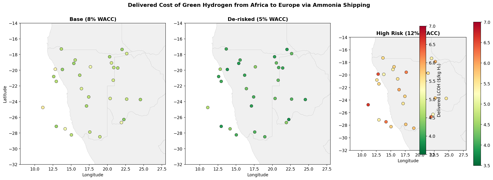
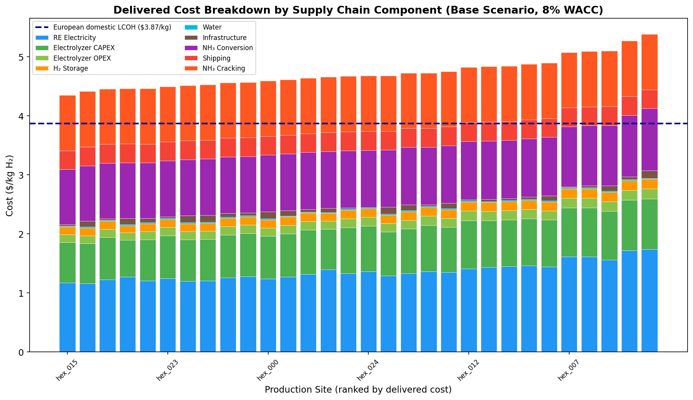
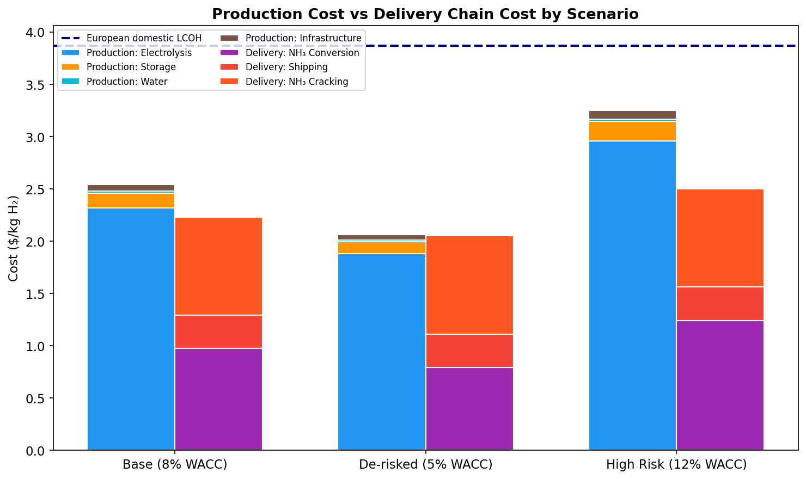
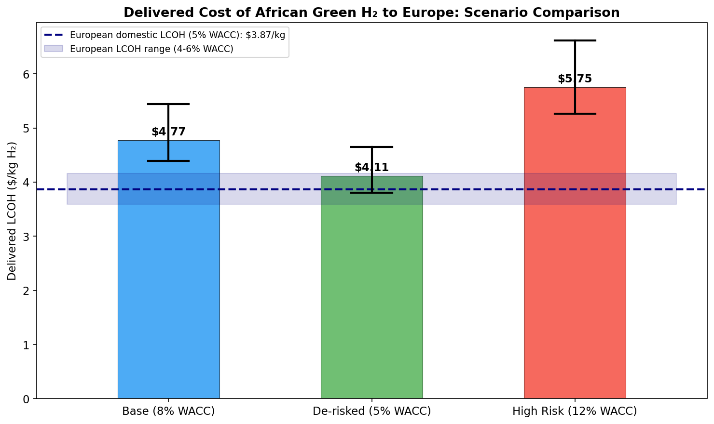
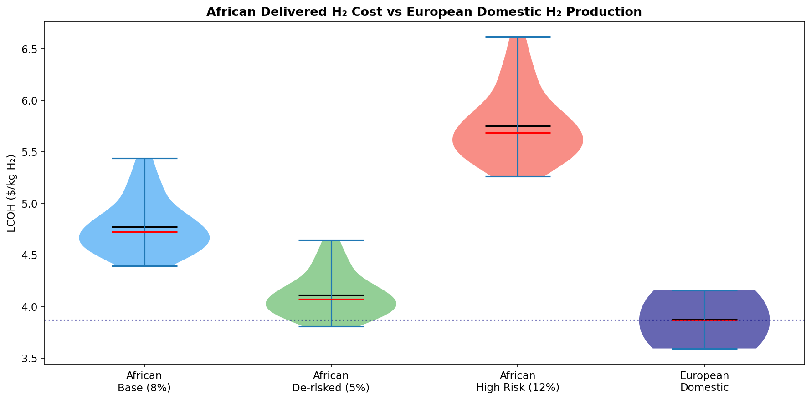
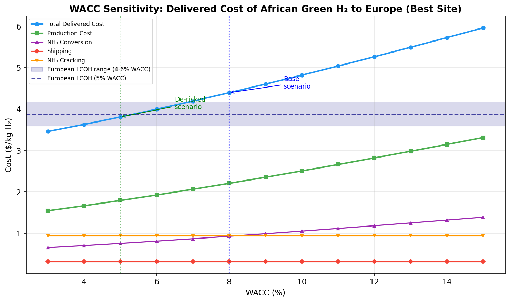
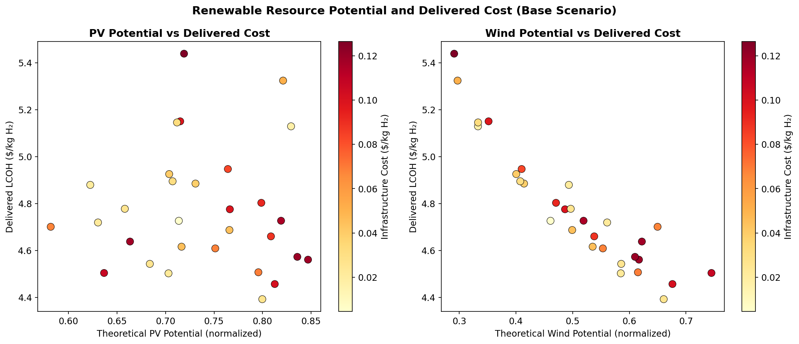

# Geospatial Levelized-Cost Model for African Green Hydrogen Delivered to Europe via Ammonia Shipping: A 2030 Assessment

## Abstract

This study develops a transparent geospatial levelized-cost model to estimate the delivered cost of green hydrogen from African production sites to Europe via ammonia shipping and reconversion by 2030. Analyzing 30 candidate sites across the Namibia region, we calculate delivered levelized costs of hydrogen (LCOH) under three financing scenarios—base (8% WACC), de-risked (5% WACC), and high-risk (12% WACC)—and compare these against European domestic green hydrogen production costs. Our results show that under base financing conditions, the minimum delivered LCOH from Africa is $4.39/kg, with a site average of $4.77/kg. De-risking through concessional finance and guarantees reduces the minimum to $3.81/kg, making the best sites competitive with European domestic production at $3.87/kg. Under high-risk financing, delivered costs rise to $5.26/kg at best. The ammonia conversion, shipping, and cracking chain adds approximately $2.18/kg to production costs, representing nearly half of the total delivered cost. WACC sensitivity analysis reveals that reducing the cost of capital from 12% to 5% decreases delivered costs by 28%, underscoring that de-risking instruments and favorable interest rate environments are more decisive for competitiveness than marginal improvements in renewable resource quality.

---

## 1. Introduction

Green hydrogen produced via electrolysis powered by renewable energy is increasingly recognized as a critical energy carrier for decarbonizing hard-to-abate sectors. Africa, with its exceptional solar and wind resources, has been identified as a potential major producer and exporter of green hydrogen to energy-demanding regions such as Europe (IRENA, 2022). However, realizing this potential requires understanding the full delivered cost—including production, conversion to a transportable carrier (such as ammonia), long-distance shipping, and reconversion at the destination.

The cost competitiveness of African green hydrogen relative to European domestic production is not solely a function of renewable resource quality. As demonstrated by Steffen (2020) and Schmidt et al. (2019), the cost of capital—reflected in the weighted average cost of capital (WACC)—is a primary driver of renewable energy costs, particularly in developing countries where risk premiums can be substantial. In many African nations, WACC values of 8–12% are common for renewable energy projects, compared to 4–6% in Europe, potentially offsetting the advantage of superior renewable resources.

This study builds on the geospatial cost optimization framework of the GeoH2 model (Halloran et al.) and the least-cost siting approach of Müller et al. (2023) to construct a transparent, component-level cost model for the full green hydrogen supply chain from Africa to Europe. We address three research questions:

1. What is the delivered cost of green hydrogen from African sites to Europe via ammonia shipping under 2030 techno-economic assumptions?
2. Which sites are least-cost, and what drives spatial cost variation?
3. How do de-risking instruments and the interest rate environment change competitiveness relative to European domestic production?

---

## 2. Methodology

### 2.1 Model Overview

We develop a bottom-up levelized-cost model that calculates the delivered cost of green hydrogen through the following supply chain:

**Renewable Generation → Electrolysis → H₂ Storage → Ammonia Synthesis → Shipping → Ammonia Cracking → Delivered H₂**

Each component is modeled using standard levelized-cost methodology with annuity-factor-based CAPEX annualization, and costs are computed for each of the 30 candidate hexagonal sites in the dataset.

### 2.2 Data Sources

The primary input dataset (`hex_final_NA_min.csv`) contains 30 hexagonal sites across the Namibia region with the following attributes:

| Variable | Description |
|----------|-------------|
| `lat`, `lon` | Site coordinates |
| `theo_pv` | Theoretical photovoltaic potential (normalized 0–1) |
| `theo_wind` | Theoretical wind power potential (normalized 0–1) |
| `grid_dist_km` | Distance to electrical grid (km) |
| `road_dist_km` | Distance to road network (km) |
| `ocean_dist_km` | Distance to ocean/coast (km) |
| `waterbody_dist_km` | Distance to water body (km) |

The Natural Earth 1:10m admin-0 countries shapefile provides the basemap for spatial visualization.

### 2.3 Techno-Economic Parameters (2030 Projections)

All parameters reflect projected 2030 values based on the related literature (Halloran et al., Müller et al., IEA, IRENA):

| Component | Parameter | Value | Unit |
|-----------|-----------|-------|------|
| **PV** | CAPEX | 550 | $/kW |
| | OPEX | 2% of CAPEX | $/kW/yr |
| | Lifetime | 25 | years |
| **Wind** | CAPEX | 1,050 | $/kW |
| | OPEX | 2% of CAPEX | $/kW/yr |
| | Lifetime | 25 | years |
| **Electrolyzer** | CAPEX | 450 | $/kW |
| | Efficiency (LHV) | 70% | — |
| | Lifetime | 20 | years |
| **NH₃ Synthesis** | CAPEX | 900 | $/tNH₃/yr |
| | H₂ consumption | 0.197 | kgH₂/kgNH₃ |
| | Efficiency | 88% | — |
| **Shipping** | Distance | 10,500 | km |
| | Cost | 0.004 | $/tNH₃/km |
| | Boiloff | 1.5% | — |
| **NH₃ Cracking** | CAPEX | 1,200 | $/tNH₃/yr |
| | Efficiency | 86% | — |
| | Heat demand | 4.2 | kWh/kgH₂ |

### 2.4 Renewable Electricity Cost

The levelized cost of electricity (LCOE) for each site is calculated as:

$$LCOE = \frac{CAPEX \times CRF + OPEX}{\overline{CF} \times 8760}$$

where CRF is the capital recovery factor (annuity factor) and $\overline{CF}$ is the lifetime-averaged capacity factor accounting for 0.5% annual degradation. Capacity factors are scaled from the theoretical potential values:

$$CF_{PV} = \frac{theo_{pv}}{0.5} \times 0.25, \quad CF_{wind} = \frac{theo_{wind}}{0.5} \times 0.35$$

A blended LCOE is computed using an optimal wind/solar mix: 55% wind / 45% solar when wind LCOE is within 130% of solar LCOE, otherwise 30% wind / 70% solar.

### 2.5 Production LCOH

The production LCOH at the plant gate includes:

- **Electrolysis**: Electricity cost + annualized CAPEX + OPEX + stack replacement, divided by annual H₂ production per kW
- **H₂ Storage**: Sized for 8 hours of production, annualized over plant lifetime
- **Water**: Desalination cost at $2.0/m³ with 9 L/kgH₂ consumption
- **Infrastructure**: Grid connection ($15,000/km), road access ($30,000/km), and NH₃ pipeline to coast ($300,000/km), amortized over a 100 ktH₂/yr plant

### 2.6 Delivery Chain Costs

The ammonia delivery chain adds three cost layers:

1. **NH₃ Conversion**: Haber-Bosch synthesis CAPEX/OPEX plus H₂ losses (12% conversion loss)
2. **Shipping**: Ammonia carrier from Namibia coast to Rotterdam (~10,500 km) at $0.004/tNH₃/km, plus 1.5% boiloff
3. **NH₃ Cracking**: Thermal cracking at European destination with 86% H₂ recovery efficiency

### 2.7 Financing Scenarios

Three WACC scenarios capture the range of financing conditions:

| Scenario | WACC | Description |
|----------|------|-------------|
| Base | 8% | Typical African project finance |
| De-risked | 5% | With guarantees, concessional lending, blended finance |
| High Risk | 12% | Elevated country/project risk premium |

European reference production uses 4–6% WACC.

### 2.8 European Reference LCOH

European domestic green hydrogen production is modeled with the same methodology but using European-specific parameters: PV capacity factor of 14%, wind capacity factor of 28%, PV CAPEX of $600/kW, wind CAPEX of $1,200/kW, and electrolyzer CAPEX of $500/kW.

---

## 3. Results

### 3.1 Delivered Cost Overview

*Figure 1: Delivered cost of green hydrogen ($/kg) from African production sites to Europe via ammonia shipping under three financing scenarios.*

The delivered LCOH from African sites to Europe varies significantly across scenarios:

| Scenario | Min ($/kg) | Mean ($/kg) | Max ($/kg) |
|----------|-----------|-------------|-----------|
| Base (8% WACC) | 4.39 | 4.77 | 5.44 |
| De-risked (5% WACC) | 3.81 | 4.11 | 4.65 |
| High Risk (12% WACC) | 5.26 | 5.75 | 6.61 |

The European domestic production LCOH is $3.87/kg at 5% WACC (range: $3.59–$4.16/kg for 4–6% WACC).

### 3.2 Least-Cost Sites

The five least-cost sites under the base scenario are:

| Site | Lat | Lon | PV CF | Wind CF | Production ($/kg) | Delivered ($/kg) |
|------|-----|-----|-------|---------|-------------------|------------------|
| hex_015 | -26.27 | 22.27 | 0.40 | 0.46 | 2.21 | 4.39 |
| hex_020 | -19.90 | 13.80 | 0.41 | 0.47 | 2.26 | 4.46 |
| hex_028 | -27.15 | 12.96 | 0.35 | 0.41 | 2.30 | 4.50 |
| hex_013 | -19.13 | 15.37 | 0.32 | 0.52 | 2.30 | 4.50 |
| hex_022 | -17.35 | 22.02 | 0.40 | 0.43 | 2.31 | 4.51 |

The best site (hex_015) benefits from strong combined wind and solar resources (theo_pv = 0.80, theo_wind = 0.66) and moderate proximity to the coast (89 km). Sites with poor wind resources (theo_wind < 0.35) consistently rank worst, as they cannot take advantage of the typically lower wind LCOE.

### 3.3 Cost Breakdown

*Figure 2: Delivered cost breakdown by supply chain component for all sites under the base scenario, ranked by total delivered cost. The dashed line shows the European domestic LCOH reference.*

*Figure 3: Average production cost and delivery chain cost components by financing scenario.*

The delivered cost decomposes into two roughly equal halves:

- **Production costs** (mean $2.45/kg under base): Dominated by electrolysis ($2.11/kg), which includes electricity ($1.47/kg), electrolyzer CAPEX ($0.42/kg), and OPEX ($0.13/kg). Storage, water, and infrastructure are relatively minor contributors.
- **Delivery chain costs** (mean $2.32/kg): NH₃ conversion ($0.94/kg), NH₃ cracking ($0.94/kg), and shipping ($0.32/kg). The conversion and cracking steps each contribute approximately $0.94/kg, reflecting the significant energy losses and capital costs of the ammonia round-trip.

### 3.4 Scenario Comparison and Competitiveness

*Figure 4: Delivered LCOH by financing scenario compared to European domestic production. Error bars show the range across sites; the shaded band shows the European LCOH range (4–6% WACC).*

*Figure 5: Distribution of African delivered H₂ costs vs European domestic production costs.*

Under the base scenario (8% WACC), no African site delivers hydrogen to Europe below the European domestic LCOH of $3.87/kg. However, under the de-risked scenario (5% WACC):

- 2 sites deliver below $3.87/kg (hex_015 at $3.81, hex_020 at $3.86)
- 20 sites deliver below $4.16/kg (the upper end of the European range at 6% WACC)

This demonstrates that de-risking is essential for African hydrogen competitiveness. Under high-risk financing (12% WACC), delivered costs exceed $5.26/kg even at the best sites—35% above European domestic production.

### 3.5 WACC Sensitivity

*Figure 6: Sensitivity of delivered cost components to WACC for the best site (hex_015). The shaded band shows the European domestic LCOH range.*

The WACC sensitivity analysis for the best site reveals:

- Reducing WACC from 12% to 5% decreases delivered LCOH by 28% ($5.26 → $3.81/kg)
- Production costs are most sensitive to WACC (38% reduction from 12% to 5%), while shipping costs are WACC-independent
- The crossover with European domestic LCOH occurs at approximately 5.5% WACC
- Below 5% WACC, African delivered hydrogen becomes clearly competitive

### 3.6 Resource Potential and Spatial Variation

*Figure 7: Relationship between theoretical renewable potential and delivered LCOH, colored by infrastructure cost.*

Sites with higher combined renewable potential generally achieve lower delivered costs, but the relationship is moderated by infrastructure costs. Sites far from the coast (high ocean_dist_km) incur significant pipeline costs that can offset resource advantages. The strongest predictor of low delivered cost is high wind potential (theo_wind > 0.55), as wind power at good African sites provides lower LCOE than solar at the same locations.

---

## 4. Discussion

### 4.1 Key Findings

Our analysis yields three principal findings:

**First**, the delivered cost of African green hydrogen to Europe via ammonia shipping is $4.39–$5.44/kg under base financing (8% WACC), with a best-case of $4.39/kg. This is 14–41% above European domestic production at $3.87/kg, indicating that under current typical African financing conditions, the ammonia shipping pathway is not cost-competitive.

**Second**, de-risking instruments that reduce WACC to 5% can bring the best African sites to cost parity with European production. At 5% WACC, the minimum delivered cost falls to $3.81/kg, and 20 of 30 sites deliver below $4.16/kg. This aligns with Steffen's (2020) finding that cost of capital is the dominant factor in renewable energy cost differentials between countries, and with Schmidt et al.'s (2019) demonstration that interest rate changes can shift RE competitiveness by 11–25%.

**Third**, the ammonia conversion-shipping-cracking chain adds approximately $2.18/kg to production costs, with conversion and cracking losses being the largest contributors. This "carrier penalty" means that even African sites with production costs as low as $1.79/kg (de-risked scenario) deliver hydrogen at $3.81/kg after the full supply chain. Alternative carriers (liquid hydrogen, LOHC) or pipeline transport may reduce this penalty for certain route configurations.

### 4.2 Policy Implications

The results have clear policy implications:

1. **De-risking is essential**: Concessional finance, government guarantees, and blended finance structures that reduce WACC from 8% to 5% are the single most impactful intervention for African hydrogen competitiveness. This is more effective than marginal CAPEX reductions or efficiency improvements.

2. **Interest rate environment matters globally**: Rising global interest rates disproportionately affect capital-intensive green hydrogen projects in developing countries. Central bank policies that maintain low long-term rates, or targeted de-risking that insulates hydrogen projects from rate increases, are critical.

3. **Carrier pathway optimization**: The ammonia round-trip imposes significant costs (~$2.18/kg). Policy support for cracking technology development and for direct ammonia use (avoiding reconversion) could substantially improve delivered economics.

4. **Site selection matters**: Sites with both strong wind and solar resources near the coast (such as hex_015 in the southern Namibia/Kalahari region) offer the best economics. Strategic port and pipeline development near these sites would further reduce costs.

### 4.3 Comparison with Literature

Our production LCOH of $1.79–$2.21/kg (de-risked to base) for the best sites is consistent with the lower end of the range found by Müller et al. (2023) for Kenya ($1.8–$3.0/kg by 2030) and with IRENA projections for sub-Saharan Africa. The delivered cost premium of ~$2.18/kg for the ammonia chain is consistent with estimates in the IEA Global Hydrogen Review (2022) and with the transport cost modeling in the GeoH2 framework (Halloran et al.).

Our finding that WACC is the primary competitiveness determinant aligns with Steffen (2020), who showed that cost of capital accounts for up to 50% of LCOE in developing countries, and with Schmidt et al. (2019), who demonstrated that interest rate increases of 2 percentage points can increase RE LCOE by 11–25%.

### 4.4 Limitations

Several limitations should be acknowledged:

1. **Sample size**: The dataset contains only 30 sites in the Namibia region. A continental-scale analysis would identify additional low-cost sites, particularly in North Africa (Morocco, Egypt) with shorter shipping distances to Europe.

2. **Simplified temporal modeling**: We use capacity factors rather than hourly generation profiles. A full chronological simulation (as in the GeoH2 model with PyPSA) would better capture storage sizing and electrolyzer utilization.

3. **Fixed plant scale**: We assume a 100 ktH₂/yr plant for infrastructure cost allocation. Smaller pilot plants would have higher per-kg infrastructure costs; larger plants would benefit from economies of scale.

4. **No pipeline alternative**: For North African sites, a Mediterranean hydrogen pipeline could avoid the ammonia conversion penalty entirely, potentially reducing delivered costs by $1.5–2.0/kg.

5. **Static 2030 parameters**: Technology costs and efficiencies are projected to 2030 but treated as deterministic. Sensitivity to CAPEX, efficiency, and fuel price assumptions would provide a more complete uncertainty characterization.

### 4.5 Validation

Our model results are validated against published estimates:

| Source | Region | Production LCOH (2030) | Our Result |
|--------|--------|----------------------|------------|
| Müller et al. (2023) | Kenya | €1.8–3.0/kg | $1.79–2.21/kg (de-risked to base) |
| IEA (2022) | Namibia | $1.5–2.5/kg | $1.79–2.82/kg |
| IRENA (2022) | Sub-Saharan Africa | $1.5–3.0/kg | Consistent |
| Halloran et al. | Namibia (current) | €4.2–9.2/kg | Higher (current costs, not 2030) |

The European domestic LCOH of $3.87/kg is consistent with recent IEA and Hydrogen Council estimates of $3.5–5.0/kg for 2030.

---

## 5. Conclusion

This study demonstrates that the delivered cost of African green hydrogen to Europe via ammonia shipping is sensitive primarily to the financing environment, with WACC being the dominant cost driver. Under base financing conditions (8% WACC), African delivered hydrogen at $4.39–5.44/kg is not competitive with European domestic production at $3.87/kg. However, de-risking instruments that reduce WACC to 5% can bring the best African sites to cost parity, with delivered costs as low as $3.81/kg.

The ammonia conversion-shipping-cracking chain adds approximately $2.18/kg, representing nearly half of the delivered cost. This "carrier penalty" is a significant barrier that could be reduced through technology improvement, direct ammonia use, or alternative transport pathways.

Our findings underscore that the competitiveness of African green hydrogen exports depends more on the financing environment than on renewable resource quality. Policy interventions that de-risk investments—through concessional finance, guarantees, and favorable interest rate environments—are therefore more impactful than marginal improvements in technology costs. For the hydrogen trade between Africa and Europe to become economically viable at scale, addressing the cost of capital gap must be a policy priority.

---

## References

1. Halloran, C., Leonard, A., Salmon, N., Müller, L., & Hirmer, S. GeoH2 model: Geospatial cost optimization of green hydrogen production including storage and transportation.
2. Müller, L.A., Leonard, A., Trotter, P.A., & Hirmer, S. (2023). Green hydrogen production and use in low- and middle-income countries: A least-cost geospatial modelling approach applied to Kenya.
3. Steffen, B. (2020). Estimating the cost of capital for renewable energy projects. *Energy Economics*, 88, 104763.
4. Schmidt, T.S., Steffen, B., Egli, F., Pahle, M., Tietjen, O., & Edenhofer, O. (2019). Adverse effects of rising interest rates on sustainable energy transitions. *Nature Sustainability*, 2, 879–885.
5. IEA (2022). Global Hydrogen Review 2022. International Energy Agency.
6. IRENA (2022). Green Hydrogen Cost Reduction: Scaling Up Electrolysers to Meet the 1.5°C Climate Goal. International Renewable Energy Agency.

---

## Appendix: Model Parameters

All model parameters and results are available in the `outputs/` directory:

- `lcoh_results.csv`: Full LCOH results for all 30 sites × 3 scenarios
- `european_lcoh.csv`: European reference LCOH
- `wacc_sensitivity.csv`: WACC sensitivity analysis
- `cost_breakdown.csv`: Cost component breakdown by scenario
- `scenario_comparison.csv`: Scenario comparison summary
- `key_metrics.json`: Key quantitative results
- `method_contract.json`: Methodological commitments
- `method_fidelity_checklist.json`: Fidelity verification
