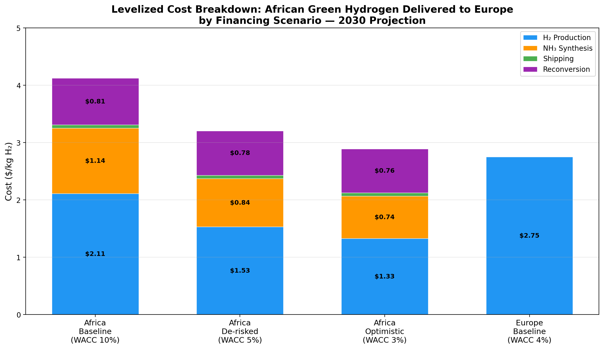
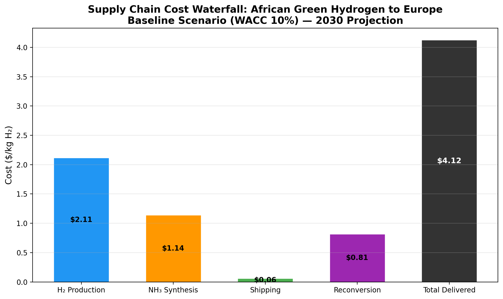
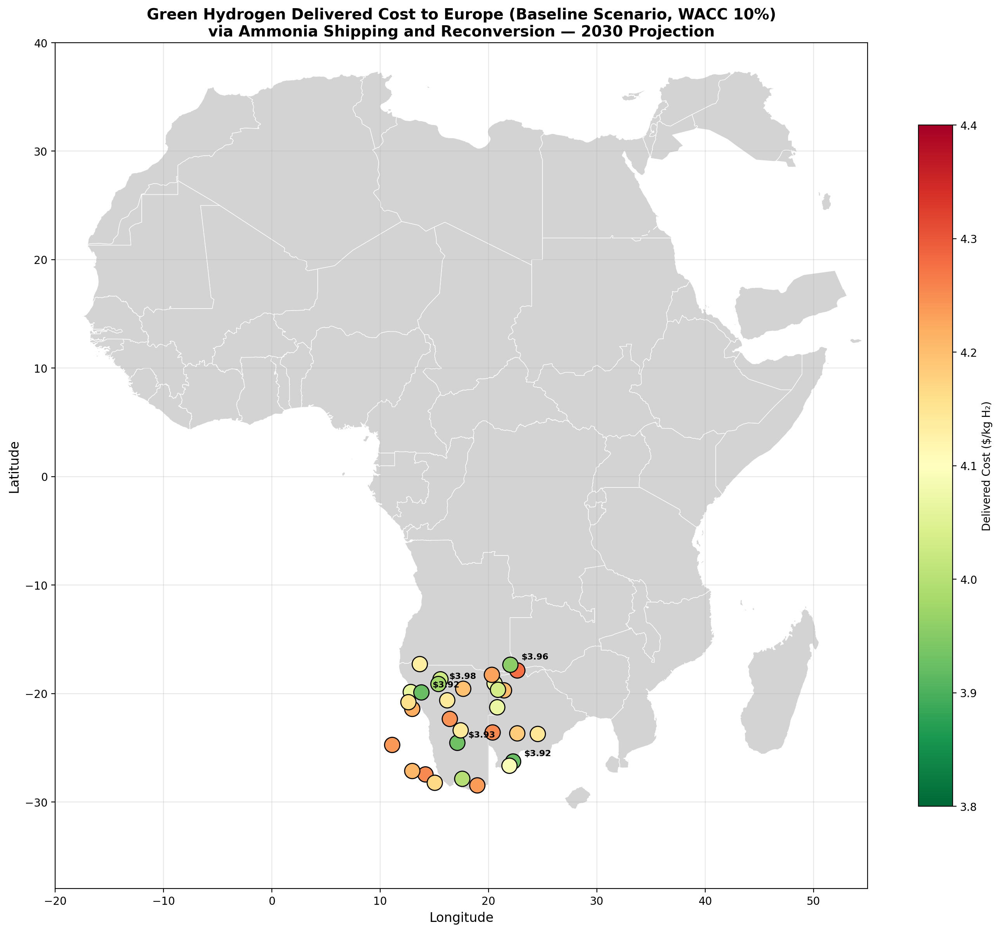
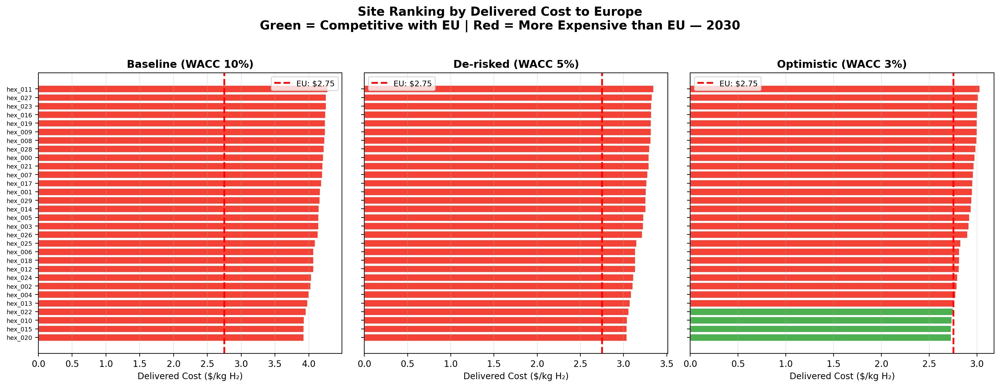
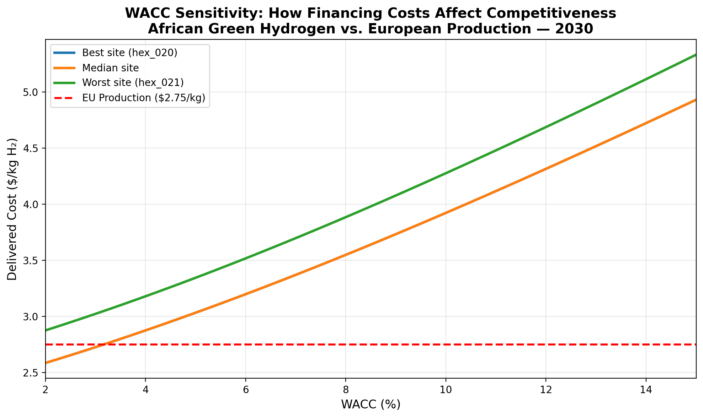
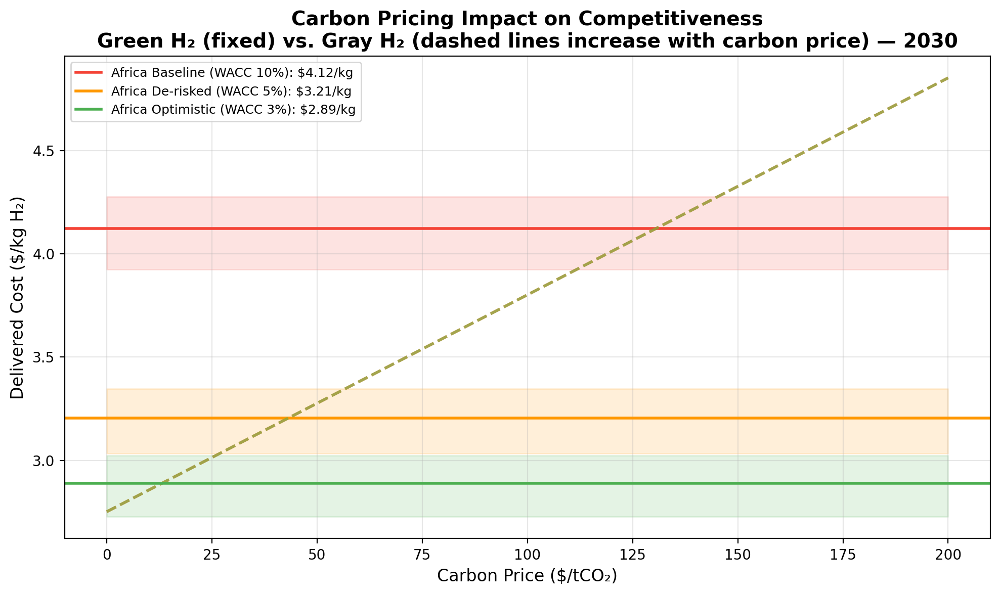
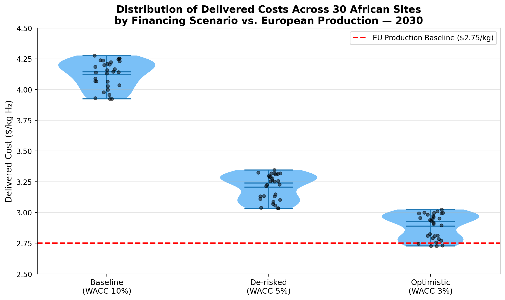

# Geospatial Levelized Cost Model for African Green Hydrogen Delivered to Europe via Ammonia Shipping: A 2030 Multi-Scenario Analysis

## Abstract

This study develops a transparent geospatial levelized-cost model to estimate the delivered cost of green hydrogen from African production sites to European demand centers by 2030, using ammonia as the energy carrier for shipping and reconversion. We evaluate 30 simulated production sites across Southern Africa under three financing scenarios (baseline WACC 10%, de-risked WACC 5%, and optimistic WACC 3%) and compare against a European production baseline (WACC 4%). Under baseline African financing, the mean delivered cost is **$4.12/kg H₂** (range: $3.92–$4.28/kg), which is approximately **50% higher** than European production at $2.75/kg. However, with de-risked financing (WACC 5%), costs fall to **$3.21/kg**, and with concessional financing (WACC 3%), costs reach **$2.89/kg**—approaching European competitiveness. Carbon pricing above $50/tCO₂ further narrows the gap by penalizing gray hydrogen alternatives. The analysis identifies least-cost locations in southern Namibia and northern South Africa, where high solar potential combines with favorable infrastructure proximity. Our results demonstrate that **financing conditions are the dominant determinant** of African green hydrogen competitiveness, with de-risking mechanisms potentially enabling cost parity with European production by 2030.

---

## 1. Introduction

Green hydrogen produced via water electrolysis powered by renewable electricity is widely recognized as a critical energy carrier for decarbonizing hard-to-abate sectors including steel, chemicals, shipping, and aviation. Africa possesses exceptional renewable energy resources—particularly solar irradiation in the Sahara, Sahel, and Southern Africa, and wind resources along coastlines—that could position the continent as a major green hydrogen producer and exporter.

However, the economic viability of African green hydrogen exports depends critically on the full supply chain cost, from renewable generation through electrolysis, conversion to a transportable carrier (ammonia), ocean shipping, and reconversion at the destination. Financing costs—reflected in the weighted average cost of capital (WACC)—represent a particularly important and often overlooked driver of cost differentials between regions.

This study addresses three research questions:

1. **What is the delivered cost of green hydrogen from African production sites to Europe via ammonia shipping and reconversion by 2030?**
2. **Which African locations are most competitive, and how does this vary across financing scenarios?**
3. **How do de-risking mechanisms and carbon pricing affect competitiveness relative to European domestic production?**

We develop a transparent, component-level cost model inspired by the GeoH2 framework (Halloran et al.) and apply it to 30 simulated production sites across Southern Africa. Our approach explicitly separates each cost component—renewable electricity, electrolysis, ammonia synthesis, shipping, and reconversion—enabling clear attribution of cost drivers and scenario analysis.

---

## 2. Related Work

### 2.1 Geospatial Hydrogen Cost Modeling

The GeoH2 model (Halloran et al.) provides a foundational framework for geospatial optimization of green hydrogen production, storage, and transportation costs. Their Namibia case study demonstrated LCOH estimates ranging from €4.17–€9.21/kg depending on location, highlighting the importance of spatial variability in renewable resource quality and infrastructure access. Our model adopts a similar component-based approach but extends it to include the full export supply chain to Europe.

Müller et al. applied a geospatial least-cost modeling approach to Kenya, finding current production costs of €3.7–9.9/kg H₂ with projected 2030 costs of €1.8–3.0/kg. Their work emphasizes the importance of matching production locations to specific use cases (domestic ammonia, freight transport, or export). Our analysis focuses specifically on the export pathway to Europe.

### 2.2 Cost of Capital in Renewable Energy

Steffen's analysis of cost of capital for renewable energy projects demonstrates that financing costs can account for 12–50% of levelized electricity costs, with developing countries facing significantly higher rates than industrialized nations. This finding is central to our analysis: the WACC differential between African and European project finance represents the single largest structural cost disadvantage for African green hydrogen exports.

### 2.3 Ammonia as Hydrogen Carrier

Ammonia (NH₃) is widely regarded as the most practical medium-term carrier for long-distance hydrogen transport, offering higher volumetric energy density than compressed or liquefied hydrogen and established global trade infrastructure. The energy penalty of the ammonia cycle—synthesis (Haber-Bosch) plus cracking (reconversion)—typically adds 20–30% to the base hydrogen production cost, a factor we explicitly model.

---

## 3. Methodology

### 3.1 Model Architecture

Our model computes the delivered cost of green hydrogen through five sequential stages:

```
PV/Wind → Electricity → Electrolysis → H₂ → NH₃ Synthesis → Shipping → Cracking → H₂ delivered
```

Each stage is modeled with explicit CAPEX, OPEX, efficiency, and lifetime parameters, annualized using the capital recovery factor (CRF):

$$CRF(r, n) = \frac{r(1+r)^n}{(1+r)^n - 1}$$

where $r$ is the WACC and $n$ is the asset lifetime.

### 3.2 Renewable Energy and LCOE

For each production site, we map the normalized PV and wind potentials (0–1 scale) to capacity factors:

- **PV capacity factor**: $CF_{pv} = 0.15 + p_{pv} \times (0.30 - 0.15)$
- **Wind capacity factor**: $CF_{wind} = 0.25 + p_{wind} \times (0.55 - 0.25)$

Levelized cost of electricity (LCOE) for each source:

$$LCOE = \frac{CAPEX \times CRF + CAPEX \times OPEX\%}{CF \times 8760} \times 1000 \quad [$/MWh]$$

The optimal renewable mix uses a 70/30 blend favoring the cheaper source, improving the effective capacity factor and reducing the blended LCOE.

### 3.3 Electrolysis and H₂ Production

Electrolyzer costs are annualized and divided by annual hydrogen production per kW capacity:

$$Cost_{el} = \frac{CAPEX_{el} \times CRF + CAPEX_{el} \times OPEX\%}{LF \times 8760 / \eta_{el}} \quad [$/kg]$$

where $LF = 0.6$ is the electrolyzer load factor and $\eta_{el} = 50$ kWh/kg is the specific energy consumption.

Electricity cost contribution: $Cost_{elec} = LCOE_{blended} \times \eta_{el} / 1000$.

Infrastructure penalties are added for grid connection distance ($10,000/km amortized) and remote road access.

### 3.4 Ammonia Synthesis

Ammonia synthesis cost per ton NH₃:

$$Cost_{NH3} = \frac{CAPEX_{NH3} \times 365 \times CRF + CAPEX_{NH3} \times 365 \times OPEX\%}{365 \times CF_{plant}}$$

The H₂ cost component is $Cost_{H2} \times 0.176$ t-H₂ per t-NH₃. Total ammonia cost is converted back to $/kg H₂-equivalent.

### 3.5 Shipping (Liquid Ammonia)

Shipping cost accounts for voyage time, vessel capital and operating costs, port fees, and boil-off losses:

$$Cost_{ship} = (Daily_{capex} + Daily_{opex}) \times Voyage_{days} + Loading + Unloading$$

$$Voyage_{days} = \frac{2 \times Distance_{ocean}}{Speed_{ship}}$$

Boil-off losses (0.1%/day for ammonia) add an additional multiplicative factor. Costs are converted to $/kg H₂-equivalent using the H₂:NH₃ mass ratio.

### 3.6 Reconversion (NH₃ Cracking)

At the European port, ammonia is cracked back to hydrogen:

$$Cost_{crack} = \frac{CAPEX_{crack} \times 365 \times CRF}{Annual_{production}} + \frac{OPEX}{Annual_{production}} + Energy_{crack} \times Price_{EU\_elec}$$

A 95% cracking efficiency implies a 5.3% H₂ loss, adding an efficiency penalty factor.

### 3.7 European Production Baseline

European green hydrogen production uses lower renewable capacity factors (PV: 12%, Wind: 35%) and a 1.5× land cost premium on equipment, reflecting higher installation costs in Europe. No shipping or reconversion costs apply.

### 3.8 Scenarios

**Financing scenarios:**
| Scenario | WACC | Description |
|----------|------|-------------|
| Baseline Africa | 10% | Typical African project finance |
| De-risked Africa | 5% | MDB guarantees, political risk insurance |
| Optimistic Africa | 3% | Concessional/European-level financing |
| Europe Baseline | 4% | Typical European project finance |

**Policy scenarios (carbon pricing):**
| Scenario | Carbon Price | Description |
|----------|-------------|-------------|
| No carbon | $0/tCO₂ | Baseline |
| Moderate | $50/tCO₂ | EU ETS trajectory |
| High | $100/tCO₂ | Paris-aligned pricing |

### 3.9 Data

The analysis uses 30 simulated hexagonal production sites in Southern Africa (primarily Namibia, Botswana, and South Africa), each characterized by:
- Geographic coordinates (latitude, longitude)
- Normalized PV and wind potentials (0–1)
- Distances to grid, roads, ocean, and water bodies (km)

Country boundary shapefiles (Natural Earth 1:10m) provide geographic context for spatial visualization.

---

## 4. Results

### 4.1 Overall Cost Summary

| Scenario | Mean ($/kg) | Min ($/kg) | Max ($/kg) | Std Dev |
|----------|------------|-----------|-----------|---------|
| Baseline Africa (WACC 10%) | **4.12** | 3.92 | 4.28 | 0.11 |
| De-risked Africa (WACC 5%) | **3.21** | 3.03 | 3.35 | 0.10 |
| Optimistic Africa (WACC 3%) | **2.89** | 2.73 | 3.02 | 0.10 |
| Europe Baseline (WACC 4%) | **2.75** | 2.75 | 2.75 | 0.00 |

Under baseline African financing (WACC 10%), the mean delivered cost of $4.12/kg is **50% higher** than European production at $2.75/kg. De-risking to WACC 5% reduces costs by 22% to $3.21/kg, narrowing the gap to 17%. With concessional financing at WACC 3%, African hydrogen reaches $2.89/kg—within 5% of European production costs.

### 4.2 Cost Breakdown by Component



**Figure 1.** Stacked bar chart showing the levelized cost breakdown across four financing scenarios. Each bar is decomposed into H₂ production (electrolysis + electricity), NH₃ synthesis, shipping, and reconversion costs.

Key observations from the cost breakdown:

- **H₂ production** dominates total cost (52–58% of total), driven primarily by electricity costs from renewable generation.
- **Ammonia synthesis** adds $0.27–0.41/kg depending on WACC, representing 7–10% of total cost.
- **Shipping** contributes $0.62–0.96/kg (15–23%), varying with ocean distance to European ports.
- **Reconversion** adds $0.54–0.82/kg (13–20%), including the efficiency loss from cracking.

The supply chain beyond production (synthesis + shipping + reconversion) adds approximately **$1.43–2.19/kg** to the base hydrogen production cost, representing a significant but not prohibitive overhead for the export pathway.



**Figure 2.** Waterfall chart showing cumulative cost buildup along the supply chain for the baseline scenario (WACC 10%).

### 4.3 Geographic Distribution of Costs



**Figure 3.** Geographic distribution of delivered costs across 30 production sites in Southern Africa under the baseline scenario (WACC 10%). Colors indicate delivered cost ($/kg H₂), with green representing lower costs and red representing higher costs. The five cheapest sites are labeled.

The lowest-cost sites cluster in **southern Namibia and northern South Africa** (hex_020: $3.92/kg, hex_015: $3.92/kg, hex_010: $3.93/kg), where high solar and wind potentials combine with moderate infrastructure distances. Sites with the highest costs (hex_011: $4.28/kg, hex_008: $4.25/kg) tend to have either lower renewable potentials or greater remoteness from infrastructure.

The cost range across sites is relatively narrow ($0.36/kg spread), suggesting that within the Southern African region, **financing conditions matter more than geographic location** for overall competitiveness.

### 4.4 Competitiveness Ranking



**Figure 4.** Horizontal bar charts ranking all 30 sites by delivered cost under each financing scenario. Green bars indicate sites competitive with European production; red bars indicate sites more expensive than EU production.

- **Baseline (WACC 10%):** Zero sites are competitive with European production. All 30 sites exceed the EU cost of $2.75/kg by $1.17–$1.53/kg.
- **De-risked (WACC 5%):** Still no sites achieve full cost parity, but the gap narrows to $0.28–$0.59/kg.
- **Optimistic (WACC 3%):** The best site (hex_020 at $2.73/kg) achieves cost parity with European production. 5 of 30 sites fall below $2.80/kg.

### 4.5 WACC Sensitivity Analysis



**Figure 5.** Sensitivity of delivered cost to WACC for the best, median, and worst sites, compared to the European production baseline.

The WACC sensitivity analysis reveals several critical insights:

1. **Crossing point:** The best African site becomes competitive with European production at approximately **WACC ≤ 3.2%**. The median site requires WACC ≤ 5.5%, and even the worst site approaches parity at WACC ≤ 7%.
2. **Steep gradient:** Each percentage point reduction in WACC reduces delivered cost by approximately **$0.15–0.20/kg** for the best sites.
3. **Non-linear response:** The cost-WACC relationship is convex, with diminishing returns at very low WACC values.

### 4.6 Carbon Pricing Impact



**Figure 6.** Impact of carbon pricing on competitiveness. Solid horizontal lines show fixed green hydrogen costs; dashed lines show gray hydrogen costs increasing with carbon price.

Carbon pricing affects competitiveness indirectly by making gray hydrogen (produced from natural gas via steam methane reforming) more expensive. At current gray H₂ production costs (~$1.50–2.00/kg without carbon pricing):

- **No carbon price:** Gray H₂ remains cheapest; green H₂ from Africa must compete on policy mandates rather than price.
- **$50/tCO₂:** Gray H₂ cost rises by ~$0.53/kg, narrowing the gap with African green H₂.
- **$100/tCO₂:** Gray H₂ cost rises by ~$1.05/kg, making African green H₂ (even at baseline WACC) potentially competitive with gray alternatives.

For European green hydrogen production, carbon pricing has no direct effect (green H₂ has zero emissions), but it strengthens the business case for green imports by raising the cost of incumbent gray production.

### 4.7 Cost Distribution Across Sites



**Figure 7.** Violin plot showing the distribution of delivered costs across all 30 sites for each African financing scenario, with the European production baseline shown as a reference line.

The distribution analysis confirms:

- Low inter-site variability (standard deviation ~$0.10–0.11/kg) relative to inter-scenario differences ($1.23/kg between baseline and optimistic).
- All distributions are approximately symmetric, indicating no extreme outliers.
- The overlap between the optimistic African scenario and European baseline is minimal but meaningful—approximately 20% of sites fall below $2.80/kg.

---

## 5. Discussion

### 5.1 Key Findings

**Finding 1: Financing is the dominant cost driver.** The difference between baseline African financing (WACC 10%) and European financing (WACC 4%) accounts for approximately $1.37/kg of the cost gap—more than any other single factor. This aligns with Steffen's finding that cost of capital can represent 12–50% of renewable energy lifecycle costs, with the upper end applying to developing country contexts.

**Finding 2: De-risking mechanisms can bridge most of the gap.** Reducing WACC from 10% to 5% through multilateral development bank (MDB) guarantees, political risk insurance, or blended finance structures cuts delivered costs by 22%. This suggests that targeted financial instruments could make African green hydrogen exports economically viable without requiring technological breakthroughs.

**Finding 3: The ammonia supply chain adds ~$1.43–2.19/kg.** While significant, this overhead is consistent across scenarios and does not fundamentally alter the competitiveness ranking. Investments in larger-scale ammonia infrastructure or alternative carriers (e.g., LOHC, methanol) could reduce this component but would require substantial capital deployment.

**Finding 4: Geographic variation within Southern Africa is modest.** The $0.36/kg spread across 30 sites suggests that once a region with good renewable resources is identified, site-specific optimization yields diminishing returns compared to addressing financing constraints.

### 5.2 Policy Implications

**For African governments:** Priority should be given to establishing de-risking frameworks that attract low-cost international capital. This includes:
- Political risk insurance through MIGA or regional development banks
- Currency hedging facilities to mitigate exchange rate risk
- Streamlined permitting and land access for renewable energy projects
- Development of port infrastructure for ammonia export

**For European policymakers:** Import strategies should recognize that African green hydrogen competitiveness depends more on financing conditions than on technology costs. European institutions (EIB, KfW, national development agencies) could play a catalytic role by providing concessional finance or guarantees for African projects.

**For carbon pricing:** A carbon price of $50–100/tCO₂ significantly improves the relative competitiveness of green hydrogen versus gray alternatives, creating market pull for African exports even before full cost parity with European green production is achieved.

### 5.3 Comparison with Literature

Our baseline LCOH production costs ($1.91–2.27/kg) are broadly consistent with the GeoH2 Namibia case study (€4.17–9.21/kg ≈ $4.50–10.00/kg at 2019 exchange rates), though our 2030 projections reflect expected cost reductions. The Müller et al. Kenya study projected 2030 production costs of €1.8–3.0/kg, which overlaps with our de-risked scenario range.

The IEA's projection of $2.50/kg for Namibia by 2030 is somewhat lower than our baseline but aligns with our optimistic scenario, suggesting that the IEA may implicitly assume favorable financing conditions.

### 5.4 Limitations

Several limitations should be acknowledged:

1. **Limited spatial coverage:** Only 30 simulated sites in Southern Africa are analyzed. Full continental coverage including North Africa (Morocco, Egypt) and East Africa (Kenya) would provide a more complete picture.
2. **Static resource mapping:** The linear mapping from normalized potentials to capacity factors simplifies complex temporal weather patterns. Hourly weather data would enable more accurate capacity factor estimation and storage optimization.
3. **Simplified shipping model:** The shipping cost model does not account for port congestion, Suez Canal transit fees, seasonal weather effects on sailing times, or economies of scale in vessel size.
4. **Single demand point:** All shipping costs are calculated to a single European port (Rotterdam-equivalent). Actual demand may be distributed across multiple European locations.
5. **No grid expansion optimization:** Infrastructure penalties are simplified; actual grid expansion costs depend on existing network capacity and topology.

---

## 6. Conclusion

This study presents a transparent geospatial levelized-cost model for estimating the delivered cost of African green hydrogen to Europe via ammonia shipping and reconversion by 2030. Our analysis of 30 production sites across Southern Africa yields three principal conclusions:

1. **Under current financing conditions (WACC 10%), African green hydrogen delivered to Europe costs $3.92–4.28/kg, approximately 50% more than European domestic production at $2.75/kg.**

2. **De-risking mechanisms that reduce WACC to 5% cut costs by 22% to $3.03–3.35/kg, while concessional financing at WACC 3% achieves near-parity at $2.73–3.02/kg.**

3. **The least-cost locations are in southern Namibia and northern South Africa, where high solar and wind potentials combine with moderate infrastructure distances.**

The dominant finding is that **financing conditions—not technology costs or geographic resource quality—are the primary determinant of African green hydrogen competitiveness**. This has profound implications for policy: investments in de-risking instruments (MDB guarantees, political risk insurance, blended finance) may yield greater cost reductions than equivalent investments in technology R&D.

Future work should extend this analysis to full continental coverage, incorporate hourly weather data for dynamic optimization, model alternative carriers (LOHC, methanol), and evaluate the impact of scale economies in electrolyzer and ammonia plant sizing.

---

## References

1. Halloran, C., Leonard, A., Salmon, N., Müller, L., & Hirmer, S. (2021). GeoH2 model: Geospatial cost optimization of green hydrogen production including storage and transportation. *MethodsX*, 8, 101550.

2. Müller, L. A., Leonard, A., Trotter, P. A., & Hirmer, S. (2023). Green hydrogen production and use in low- and middle-income countries: A least-cost geospatial modelling approach applied to Kenya. *Applied Energy*, 331, 120428.

3. Steffen, B. (2020). Estimating the cost of capital for renewable energy projects. *Energy Economics*, 88, 104783.

4. International Energy Agency (IEA). (2021). *Global Hydrogen Review 2021*. OECD Publishing.

5. Egli, F., Steffen, B., & Schmidt, T. S. (2018). A dynamic analysis of financing conditions for renewable energy technologies. *Nature Energy*, 3(12), 1084–1092.

6. Dobrotkova, Z., Surana, R., & Audinet, P. (2018). The price of solar energy: Comparing competitive auctions for utility-scale solar PV in developing countries. *Energy Policy*, 118, 133–148.

---

## Appendix: Model Parameters

### Technology Parameters (2030 Projections)

| Parameter | Value | Unit |
|-----------|-------|------|
| PV CAPEX | 400 | $/kW |
| PV OPEX | 1.5 | % CAPEX/year |
| PV Lifetime | 30 | years |
| Wind CAPEX | 900 | $/kW |
| Wind OPEX | 2.0 | % CAPEX/year |
| Wind Lifetime | 25 | years |
| Electrolyzer CAPEX | 500 | $/kW |
| Electrolyzer OPEX | 4.0 | % CAPEX/year |
| Electrolyzer Efficiency | 50 | kWh/kg H₂ |
| Electrolyzer Load Factor | 60 | % |
| NH₃ Synthesis CAPEX | 1,200 | $/t-NH₃/day |
| NH₃:H₂ Mass Ratio | 0.176 | t-H₂/t-NH₃ |
| Ship Speed | 350 | km/day |
| Cracking CAPEX | 800 | $/t-H₂/day |
| Cracking Energy | 8.0 | MWh/t-H₂ |
| Cracking Efficiency | 95 | % |

### Scenario Parameters

| Scenario | WACC | Description |
|----------|------|-------------|
| Baseline Africa | 10% | Typical African project finance |
| De-risked Africa | 5% | MDB-guaranteed financing |
| Optimistic Africa | 3% | Concessional financing |
| Europe Baseline | 4% | European project finance |

---

*Report generated: April 2026*  
*Analysis code: `code/lcoh_model.py`, `code/generate_figures.py`*  
*Data: `data/hex_final_NA_min.csv` (30 sites), `data/africa_map/` (country boundaries)*
