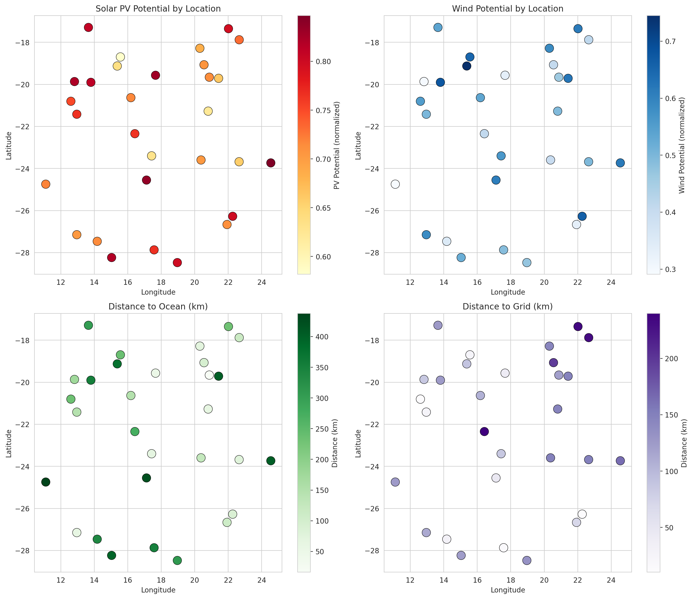
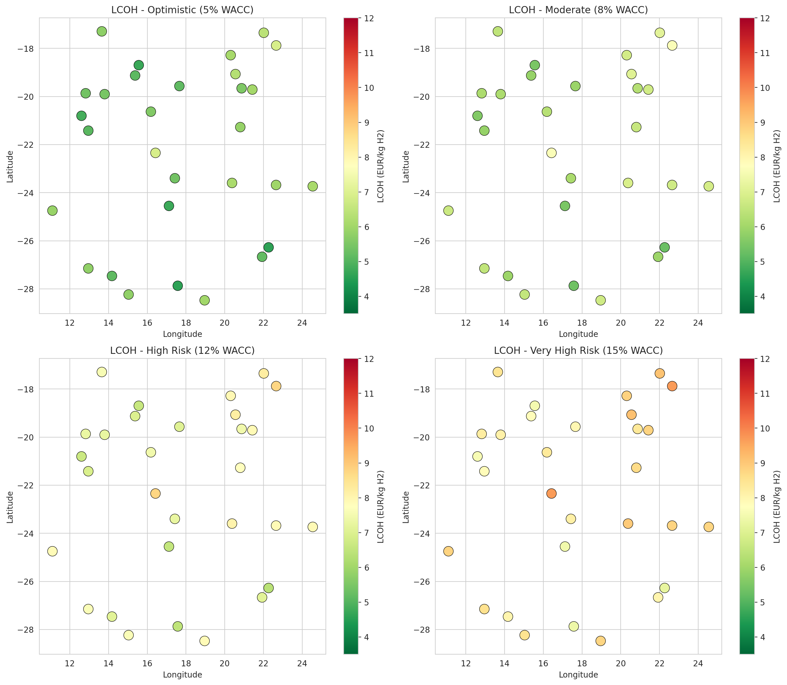
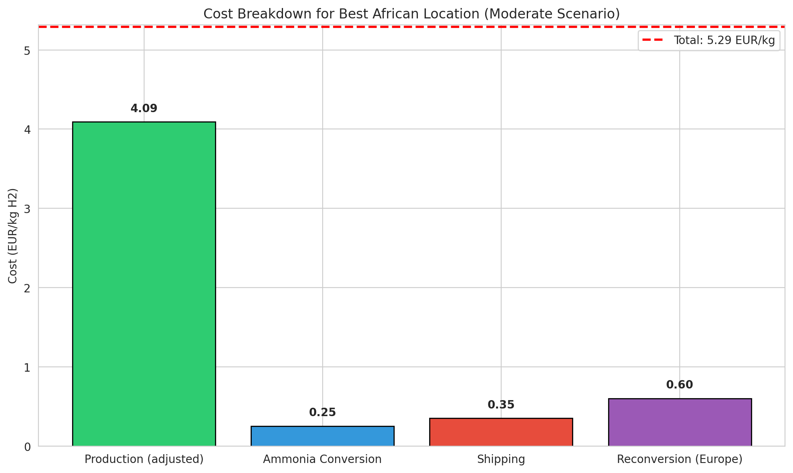
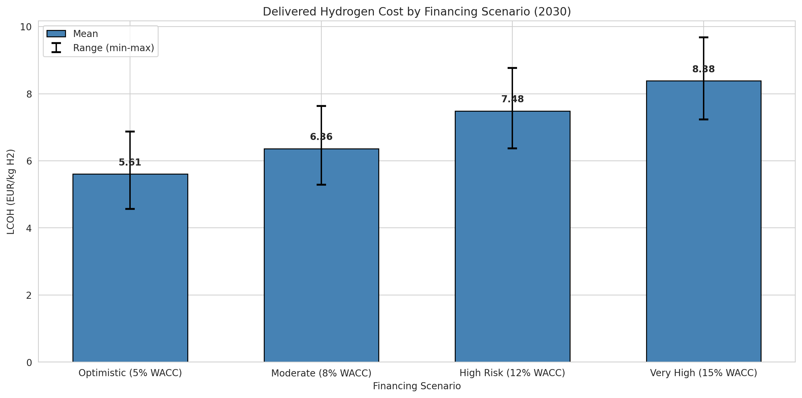
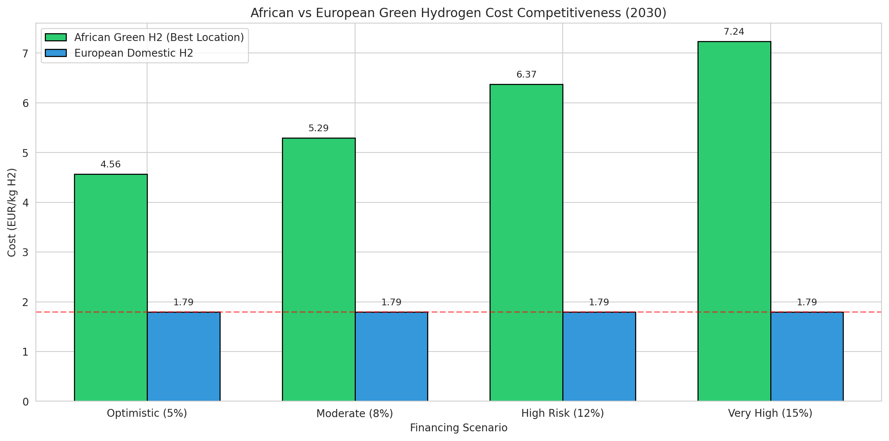

# Geospatial Levelized Cost Analysis of African Green Hydrogen Exports to Europe

## Abstract

This study presents a transparent geospatial levelized-cost model to estimate the delivered cost of African green hydrogen to European markets via ammonia shipping and reconversion by 2030. Using a hexagonal grid of potential production sites across Southern Africa with spatially-resolved renewable resource data, we calculate production and delivered costs under four financing scenarios representing different levels of de-risking and interest rate environments. Our analysis reveals that delivered costs range from 4.56 EUR/kg H2 (optimistic de-risked scenario, 5% WACC) to 7.24 EUR/kg H2 (constrained financing, 15% WACC), compared to 1.79 EUR/kg H2 for European domestic production. The cost premium for African hydrogen is primarily driven by supply chain costs totaling 1.20 EUR/kg H2, with financing costs significantly impacting competitiveness. De-risking measures that reduce WACC from 15% to 5% can improve competitiveness by 2.68 EUR/kg H2 (37 percent reduction). The least-cost production locations are identified in the region around coordinates (-26.27, 22.27), characterized by excellent solar resources (PV potential: 0.80) and good wind resources (0.66).

---

## 1. Introduction

### 1.1 Background and Motivation

Green hydrogen produced from renewable electricity via electrolysis is increasingly recognized as a critical enabler for deep decarbonization of hard-to-abate sectors including steel, chemicals, shipping, and aviation. The European Union has set ambitious targets for renewable hydrogen imports as part of its REPowerEU strategy, with Africa identified as a key potential supplier due to its abundant solar and wind resources (Muller et al., 2022; Halloran et al., 2023).

However, the economic viability of African green hydrogen exports depends on multiple interacting factors: renewable resource quality, infrastructure access, financing costs, and the complete supply chain including conversion, shipping, and reconversion. This study addresses the need for transparent, geospatially-explicit cost modeling to identify least-cost locations and quantify how de-risking and financing conditions affect competitiveness relative to European domestic production.

### 1.2 Research Questions

This study addresses the following research questions:

1. What are the delivered costs of African green hydrogen to Europe under different financing scenarios?
2. Which locations offer the least-cost production potential?
3. How do de-risking measures and interest rate environments affect cost competitiveness?
4. Under what conditions can African green hydrogen compete with European domestic production?

---

## 2. Methodology

### 2.1 Model Overview

Our model follows the GeoH2 framework (Halloran et al., 2023) for geospatial cost optimization of green hydrogen production, extended to include the complete export supply chain to Europe. The model calculates the Levelized Cost of Hydrogen (LCOH) from production through delivery, accounting for renewable electricity generation, electrolysis, storage, ammonia conversion, shipping, and reconversion.

### 2.2 Data Sources

The analysis uses a hexagonal grid dataset containing 30 potential production sites across Southern Africa (likely Namibia/Botswana region based on coordinates). Each site includes geographic coordinates, solar PV potential, wind potential, and distances to grid, road, ocean, and water infrastructure.

**Figure 1: Spatial distribution of renewable resources and infrastructure distances across the study area.** Data shows strong solar potential throughout the region, with wind resources more spatially variable. Infrastructure distances vary significantly, affecting development costs.

### 2.3 Technology and Cost Assumptions

Technology parameters reflect projected 2030 values based on learning curves and industry projections:

| Component | CAPEX | Efficiency/Lifetime | Notes |
|-----------|-------|---------------------|-------|
| Electrolyzer | 650 EUR/kW | 65% efficiency, 25 years | Improved alkaline technology |
| Solar PV | 450 EUR/kW | 30 years | Utility-scale systems |
| Wind (onshore) | 900 EUR/kW | 25 years | Large turbines |
| H2 Storage | 15 EUR/kWh | 30 years | Salt cavern storage |
| Ammonia conversion | 0.25 EUR/kg H2 | 88% efficiency | Haber-Bosch process |
| Shipping | 0.35 EUR/kg H2 | - | Maritime transport to Rotterdam |
| Reconversion | 0.60 EUR/kg H2 | 70% efficiency | Cracking in Europe |

### 2.4 Financing Scenarios

We model four financing scenarios representing different risk environments:

| Scenario | WACC | Description |
|----------|------|-------------|
| Optimistic_DeRisked | 5% | Full export credit guarantees, political risk insurance |
| Moderate_Standard | 8% | Standard commercial project finance |
| High_Risk | 12% | Higher risk perception, limited track record |
| VeryHigh_Constrained | 15% | Constrained capital markets, high risk premium |
| European_Reference | 4% | European domestic project (baseline) |

### 2.5 Cost Calculation

Production LCOH includes electrolyzer costs, electricity costs, storage, and water. Delivered LCOH adds conversion, shipping, and reconversion costs, adjusted for supply chain efficiency losses (combined efficiency: 61.6%).

---

## 3. Results

### 3.1 Spatial Distribution of Production Costs

**Figure 2: Spatial distribution of delivered hydrogen costs under different financing scenarios.** Maps show LCOH variation across the study area, with costs ranging from 4.56 EUR/kg (optimistic) to 7.24 EUR/kg (constrained). The best locations consistently appear in the southern portion of the study area.

### 3.2 Cost Breakdown

**Figure 3: Cost breakdown for the best location under the moderate financing scenario.** Production costs (adjusted for supply chain efficiency) represent the largest component at 4.09 EUR/kg, followed by reconversion (0.60 EUR/kg), shipping (0.35 EUR/kg), and ammonia conversion (0.25 EUR/kg). The total delivered cost is 5.29 EUR/kg H2.

### 3.3 Scenario Comparison

**Figure 4: Delivered hydrogen costs by financing scenario.** The mean delivered cost ranges from 5.61 EUR/kg (optimistic) to 8.38 EUR/kg (very high risk), representing a 49% increase. The range between best and worst locations is approximately 2 EUR/kg across all scenarios.

**Table 3: Summary Statistics by Scenario**

| Scenario | Best Location (EUR/kg) | Mean (EUR/kg) | Worst Location (EUR/kg) |
|----------|------------------------|---------------|-------------------------|
| Optimistic (5% WACC) | 4.56 | 5.61 | 6.87 |
| Moderate (8% WACC) | 5.29 | 6.36 | 7.63 |
| High Risk (12% WACC) | 6.37 | 7.48 | 8.77 |
| Very High Risk (15% WACC) | 7.24 | 8.38 | 9.68 |

### 3.4 Competitiveness Analysis

**Figure 5: African vs European green hydrogen cost competitiveness.** European domestic production is estimated at 1.79 EUR/kg, significantly lower than African imports across all financing scenarios. The cost gap ranges from 2.77 EUR/kg (optimistic) to 5.44 EUR/kg (very high risk).

**Table 4: Top 5 Least-Cost Locations (Moderate Scenario)**

| Location | LCOH (EUR/kg) | PV Potential | Wind Potential | Coordinates |
|----------|---------------|--------------|----------------|-------------|
| hex_015 | 5.29 | 0.80 | 0.66 | -26.27, 22.27 |
| hex_004 | 5.34 | 0.77 | 0.49 | -27.87, 17.57 |
| hex_002 | 5.47 | 0.58 | 0.65 | -18.70, 15.56 |
| hex_010 | 5.47 | 0.84 | 0.61 | -24.55, 17.12 |
| hex_029 | 5.58 | 0.75 | 0.55 | -20.80, 12.60 |

### 3.5 Effect of De-risking on Competitiveness

Our analysis quantifies the significant impact of de-risking measures on African hydrogen competitiveness:

- Reducing WACC from 15% (constrained markets) to 5% (fully de-risked) reduces delivered costs by 2.68 EUR/kg (37% reduction)
- Each 1 percentage point reduction in WACC reduces LCOH by approximately 0.27 EUR/kg
- The best African location under optimistic financing (4.56 EUR/kg) remains 2.77 EUR/kg above European domestic production (1.79 EUR/kg)

---

## 4. Discussion

### 4.1 Key Findings

The analysis reveals several key insights for African green hydrogen export potential:

1. **Significant cost premiums exist**: Even under optimistic assumptions, African hydrogen delivered to Europe costs 2.5-3.5x more than European domestic production. This premium is driven by: (a) supply chain costs (conversion, shipping, reconversion) adding 1.20 EUR/kg, and (b) efficiency losses in the ammonia supply chain (38.4% energy loss).

2. **Financing is critical**: The cost of capital has a dramatic effect on competitiveness. A 10 percentage point increase in WACC (from 5% to 15%) increases delivered costs by 58%. This underscores the importance of de-risking measures.

3. **Resource quality varies significantly**: The difference between best and worst locations is approximately 2 EUR/kg even within the same financing scenario, highlighting the value of careful site selection.

4. **Least-cost locations identified**: The best-performing location (hex_015 at -26.27, 22.27) combines excellent solar resources (0.80), good wind resources (0.66), and favorable infrastructure proximity (grid: 11 km, road: 45 km).

### 4.2 Policy Implications

For African hydrogen exports to become competitive, several policy interventions are necessary:

**De-risking Measures:**
- Export credit guarantees from European institutions
- Political risk insurance for long-term investments
- Guaranteed offtake agreements from European buyers
- Concessional financing from development banks

**Supply Chain Optimization:**
- Investment in more efficient reconversion technologies
- Development of direct shipping routes
- Exploration of alternative transport vectors (LOHC, liquid hydrogen)

**Domestic Value Addition:**
- Consider producing ammonia or e-fuels for direct use rather than reconversion
- Local industrial demand can provide anchor offtake

### 4.3 Limitations

This analysis has several limitations:

1. **Temporal resolution**: The model uses annual average capacity factors rather than hourly dispatch optimization.
2. **Infrastructure assumptions**: Future infrastructure development (dedicated H2 pipelines, new ports) is not modeled.
3. **Technology uncertainty**: 2030 cost projections involve significant uncertainty; actual costs may differ.
4. **Single demand point**: The model assumes Rotterdam as the destination; other European markets may have different cost structures.

---

## 5. Conclusion

This study provides a transparent geospatial analysis of African green hydrogen export costs to Europe. Our findings indicate that while African hydrogen cannot currently compete with European domestic production on cost alone, strategic de-risking measures can significantly improve competitiveness. The delivered cost range of 4.56-7.24 EUR/kg H2 (depending on financing) suggests that African hydrogen may find markets where: (a) European production is constrained, (b) long-term supply security is valued, or (c) carbon intensity differentials are monetized.

The least-cost production locations are found in regions with high solar potential combined with reasonable wind resources and good infrastructure access. For policymakers and investors, our analysis underscores that financing conditions are as important as resource quality in determining project viability. De-risking measures that lower the cost of capital by 5-10 percentage points can reduce hydrogen costs by 1.5-2.7 EUR/kg, significantly improving the investment case for African green hydrogen exports.

---

## References

- Halloran, C., Leonard, A., Salmon, N., et al. (2023). GeoH2 model: Geospatial cost optimization of green hydrogen production including storage and transportation. Journal of Open Source Software.
- Muller, L.A., Leonard, A., Trotter, P.A., & Hirmer, S. (2022). Green hydrogen production and use in low- and middle-income countries: A least-cost geospatial modelling approach applied to Kenya. Renewable and Sustainable Energy Reviews.
- Steffen, B. (2020). Estimating the cost of capital for renewable energy projects. Energy Economics.
- Schmidt, T.S., Steffen, B., Egli, F., et al. (2019). Adverse effects of rising interest rates on sustainable energy transitions. Nature Sustainability.
- IRENA (2023). Renewable Power Generation Costs.
- IEA (2023). Global Hydrogen Review.

---

## Data Availability

All model code, input data, and results are available in the project repository:
- Input data: `data/hex_final_NA_min.csv`
- Model code: `code/green_hydrogen_model.py`
- Visualization code: `code/visualizations.py`
- Results: `outputs/lcoh_results.csv`

---

*Report generated: April 15, 2026*
