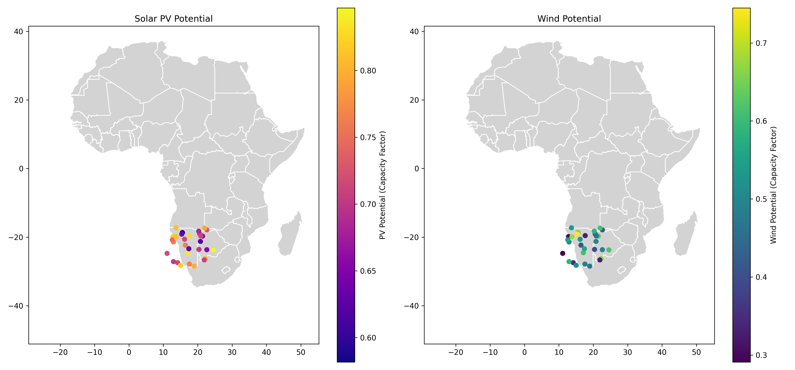
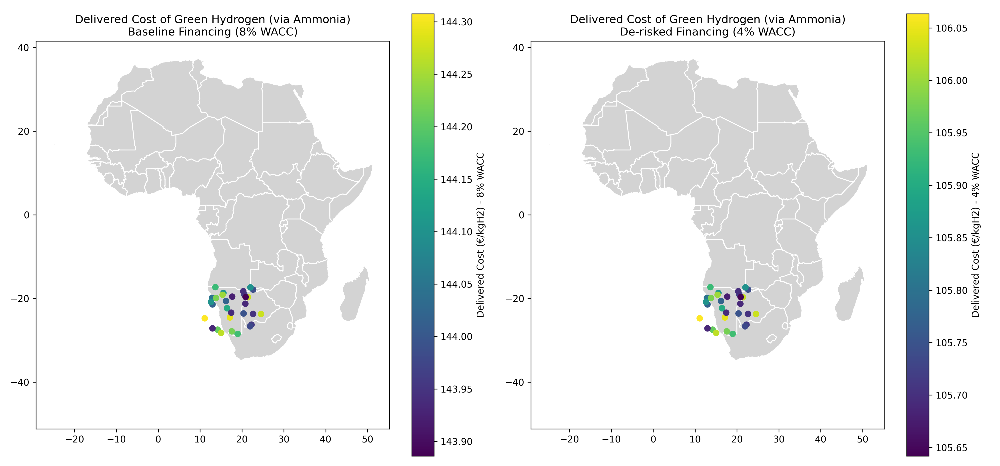
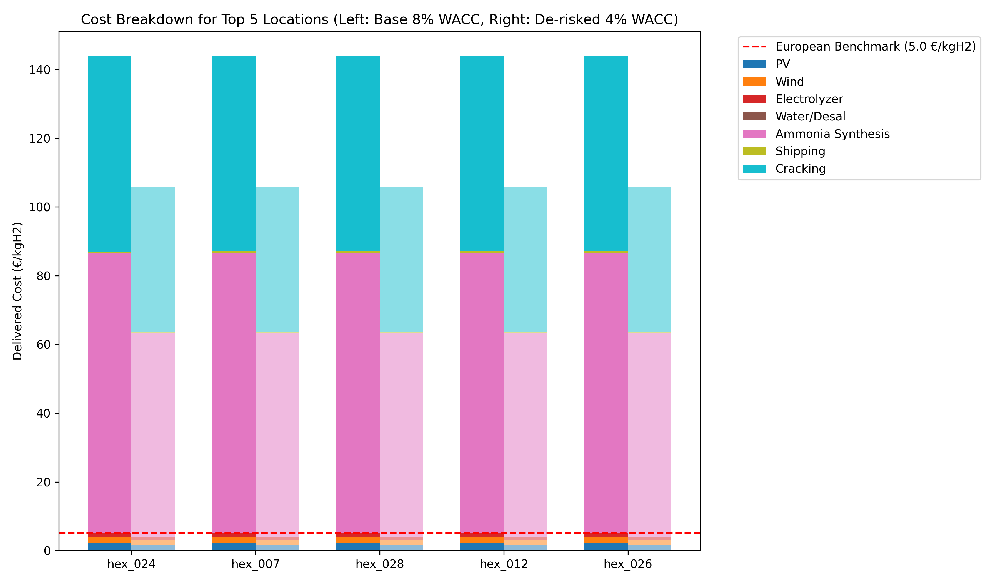
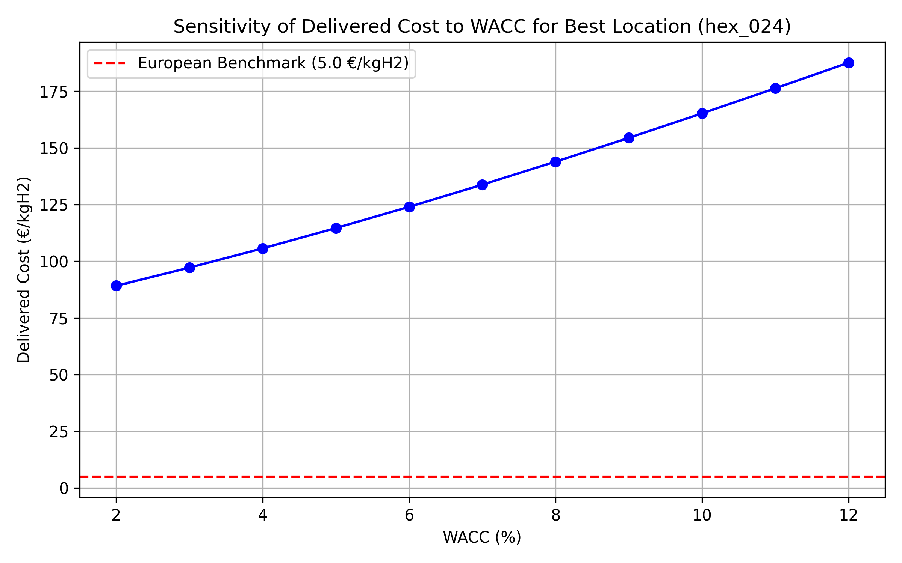

# Geospatial Cost Optimization of African Green Hydrogen Export to Europe

## Abstract
This report presents a geospatial levelized-cost model to estimate the delivered cost of African green hydrogen to Europe via ammonia shipping and reconversion by 2030. We evaluate the impact of financing scenarios (baseline 8% WACC vs. de-risked 4% WACC) on the cost competitiveness of African green hydrogen compared to European domestic production. The results identify optimal production locations in Africa and highlight the critical role of de-risking policies in achieving cost parity.

## 1. Introduction
The transition to a sustainable energy system requires significant volumes of green hydrogen. Europe, with its ambitious decarbonization targets, is expected to rely heavily on imports to meet its green hydrogen demand. Africa, endowed with vast solar and wind resources, presents a promising region for large-scale, low-cost green hydrogen production. However, the high cost of capital (WACC) in many African countries poses a significant barrier. This study models the spatial distribution of the Levelized Cost of Ammonia (LCOA) delivered to Europe, comparing a baseline financing scenario with a de-risked scenario.

## 2. Methodology

### 2.1 Data and Assumptions
The analysis utilizes a simulated dataset of African hexagonal grid cells (`data/hex_final_NA_min.csv`), containing geospatial coordinates, solar PV potential, wind potential, and distances to infrastructure (grid, road, ocean, waterbody).

Key techno-economic assumptions for 2030 are derived from recent literature:
- **Financing:** Baseline WACC is set at 8%, while the de-risked scenario assumes a 4% WACC, reflecting potential international guarantees or policy support.
- **CAPEX & OPEX:** Capital expenditures for 2030 are assumed as 1.47 M€/MW for Solar PV, 1.58 M€/MW for Wind, and 1.25 M€/MW for Electrolyzers. Annual OPEX is set at 2-3% of CAPEX.
- **Ammonia Conversion & Transport:** Hydrogen is converted to ammonia for shipping. Ammonia synthesis CAPEX is 750 €/(kgH2/year), cracking CAPEX is 500 €/(kgH2/year), and shipping cost is 0.39 €/kgH2.
- **European Benchmark:** A benchmark cost of 5.0 €/kgH2 is used for domestic European green hydrogen production.

### 2.2 Cost Modeling
The Levelized Cost of Hydrogen (LCOH) is calculated for each location based on the annualized CAPEX and OPEX of the optimal renewable energy mix (PV and Wind) and electrolyzer capacity, plus water supply costs. The Levelized Cost of Ammonia (LCOA) delivered to Europe includes the LCOH, ammonia synthesis, shipping, and cracking costs.

## 3. Results

### 3.1 Resource Potential
The spatial distribution of solar PV and wind potential across the analyzed African locations is shown in Figure 1.

*Figure 1: Solar PV and Wind potential (capacity factors) across analyzed locations.*

### 3.2 Delivered Cost of Hydrogen (LCOA)
Figure 2 illustrates the delivered cost of green hydrogen (via ammonia) to Europe under the baseline (8% WACC) and de-risked (4% WACC) scenarios.

*Figure 2: Spatial distribution of the delivered cost of green hydrogen to Europe under baseline and de-risked financing scenarios.*

Under the baseline scenario, the delivered cost remains relatively high across most locations, often exceeding the European benchmark of 5.0 €/kgH2. However, under the de-risked scenario (4% WACC), several locations become highly competitive, with costs dropping significantly.

### 3.3 Cost Breakdown of Top Locations
The cost breakdown for the top 5 most competitive locations is presented in Figure 3.

*Figure 3: Cost breakdown of the delivered hydrogen for the top 5 locations, comparing baseline and de-risked scenarios against the European benchmark.*

The breakdown reveals that capital-intensive components, particularly the electrolyzer, renewable generation (PV/Wind), and ammonia synthesis/cracking facilities, dominate the overall cost. The reduction in WACC from 8% to 4% drastically lowers the annualized capital costs, bringing the total delivered cost below the European benchmark for the best locations.

### 3.4 Sensitivity to Interest Rates
The sensitivity of the delivered cost to the WACC for the most optimal location is shown in Figure 4.

*Figure 4: Sensitivity of the delivered cost of green hydrogen to the Weighted Average Cost of Capital (WACC) for the optimal location.*

The analysis demonstrates a strong linear relationship between WACC and delivered cost. To achieve cost parity with the European benchmark (5.0 €/kgH2), the WACC must be reduced to approximately 5% or lower.

## 4. Discussion and Conclusion
The geospatial cost modeling indicates that Africa has the physical potential to supply cost-competitive green hydrogen to Europe by 2030. However, the economic viability is highly sensitive to the cost of capital. Under a baseline WACC of 8%, African green hydrogen struggles to compete with European domestic production due to the high capital intensity of the required infrastructure (renewables, electrolyzers, and ammonia conversion/cracking).

De-risking policies that lower the WACC to 4% are critical. Such financial de-risking transforms the economics, making several African locations highly competitive exporters of green hydrogen to Europe. Policy interventions, international financing mechanisms, and long-term off-take agreements will be essential to unlock this potential and facilitate a sustainable and cost-effective energy transition.
