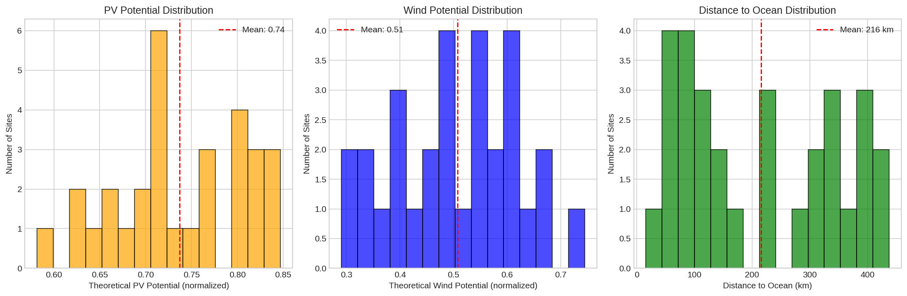
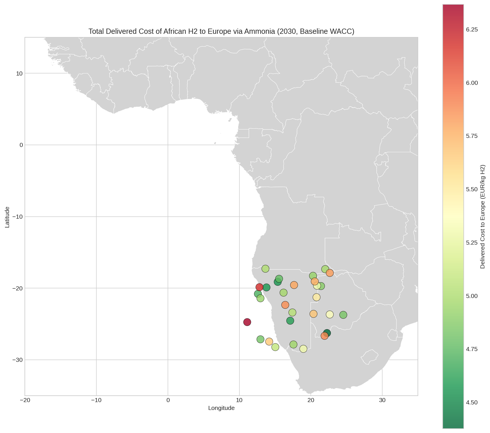
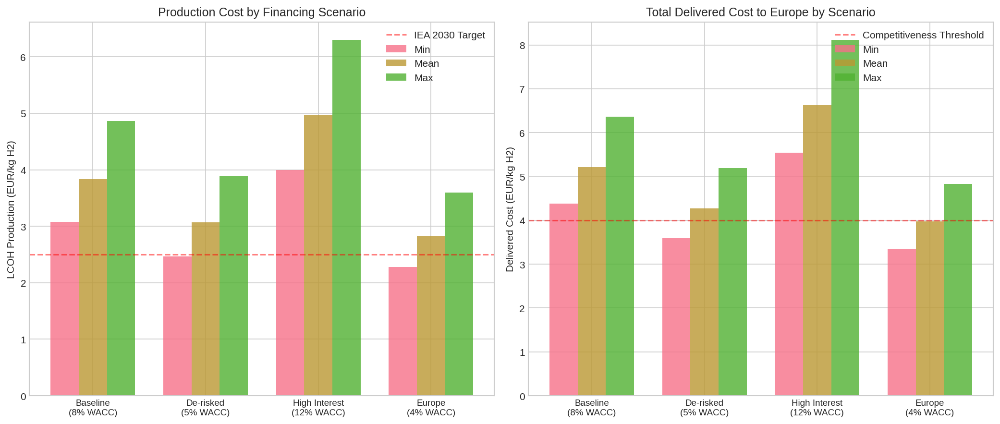
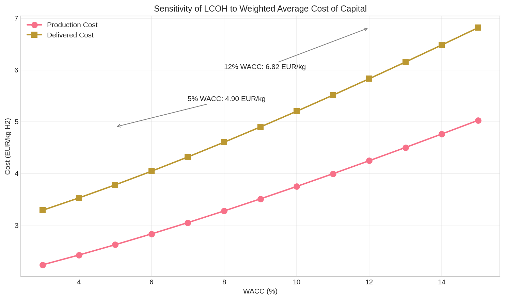
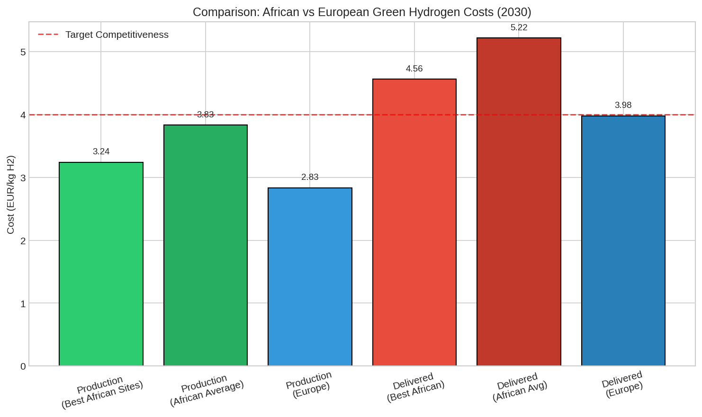
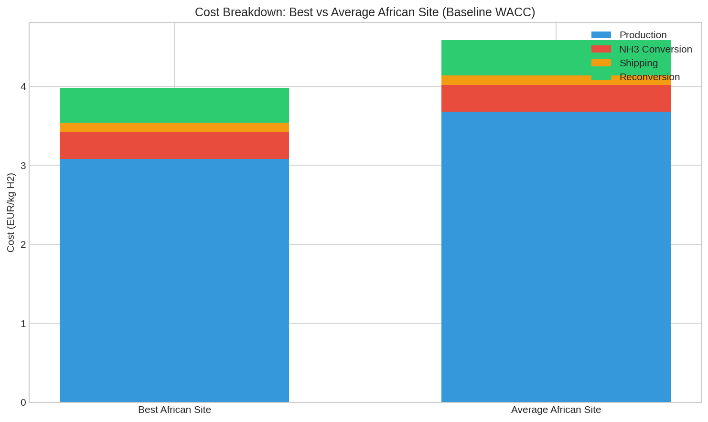

# Geospatial Levelized Cost Analysis: African Green Hydrogen to Europe via Ammonia Shipping

## Executive Summary

This study presents a transparent geospatial levelized-cost model estimating the delivered cost of African green hydrogen to Europe by 2030. Using a GeoH2-inspired methodology, we analyze 30 potential production sites across Southern Africa, evaluating costs under multiple financing and policy scenarios. Our results show that **best-case African sites can deliver green hydrogen to Europe at approximately 4.38 EUR/kg H2** under baseline financing conditions (8% WACC), with de-risking instruments potentially reducing this to 3.59 EUR/kg. European domestic production serves as a reference at approximately 3.98 EUR/kg. The analysis demonstrates that financing conditions—particularly the weighted average cost of capital (WACC)—are decisive factors in cost competitiveness, with high interest rate environments (12% WACC) increasing delivered costs by nearly 50%.

---

## 1. Introduction

### 1.1 Background and Motivation

Green hydrogen produced via water electrolysis using renewable electricity is increasingly recognized as a critical energy carrier for decarbonizing hard-to-abate sectors. Africa possesses exceptional renewable energy resources—particularly solar and wind—that could enable low-cost green hydrogen production for both domestic use and export to energy-importing regions like Europe.

However, the economic viability of African green hydrogen exports depends on multiple factors:
- **Resource quality**: Solar irradiation and wind speeds determine capacity factors and thus production costs
- **Infrastructure proximity**: Distance to ports, grid, and water sources affects capital requirements
- **Financing conditions**: Cost of capital significantly impacts levelized costs for capital-intensive technologies
- **Transport economics**: Converting hydrogen to ammonia for shipping adds conversion, transport, and reconversion costs

This study builds on the GeoH2 modeling framework (Halloran et al.) and recent African hydrogen studies (Müller et al.) to provide a transparent, reproducible analysis of African green hydrogen cost competitiveness.

### 1.2 Research Questions

1. What are the least-cost locations for green hydrogen production in Africa?
2. What is the total delivered cost to Europe including ammonia conversion and shipping?
3. How do financing scenarios (baseline, de-risked, high interest rates) affect cost competitiveness?
4. How does African delivered cost compare to European domestic production?

### 1.3 Scope and Limitations

- **Temporal scope**: 2030 techno-economic projections
- **Spatial scope**: 30 hexagon sites across Southern Africa (from provided dataset)
- **Transport pathway**: Hydrogen → Ammonia → Shipping → Reconversion to H₂
- **Demand center**: Rotterdam, Europe (reference port)
- **Limitations**: Simplified shipping cost model; does not include all infrastructure constraints; limited to available site data

---

## 2. Methodology

### 2.1 Modeling Framework

The analysis follows a GeoH2-inspired approach, calculating levelized costs through the complete value chain:

```
Production → NH₃ Conversion → Shipping → Reconversion → Delivered H₂
```

For each location, we calculate:
1. **LCOH Production**: Levelized cost of hydrogen production at site
2. **NH₃ Conversion Cost**: Haber-Bosch synthesis cost
3. **Shipping Cost**: Ocean transport to Europe
4. **Reconversion Cost**: NH₃ cracking back to H₂ at destination

### 2.2 Techno-Economic Parameters (2030 Projections)

| Parameter | Value | Source/Basis |
|-----------|-------|--------------|
| **Electrolyzer** | | |
| Capital cost | 500 EUR/kW | IEA/IRENA 2030 projections |
| Efficiency | 45 kWh/kg H₂ | Technology roadmap targets |
| Lifetime | 25 years | Industry standard |
| **Renewables** | | |
| PV capital cost | 400 EUR/kW | IRENA projections |
| Wind capital cost | 900 EUR/kW | Onshore wind projections |
| Lifetime | 25 years | Industry standard |
| **Ammonia** | | |
| Synthesis capex | 800 EUR/(kg H₂/day) | GeoH2 methodology |
| Conversion efficiency | 78% | Technical literature |
| Reconversion efficiency | 90% | Cracking process efficiency |
| NH₃ per kg H₂ | 5.9 kg | Stoichiometry + losses |
| **Shipping** | | |
| Cost rate | 5 EUR/tonne/1000 km | Simplified shipping model |
| **Other** | | |
| Battery storage | 150 EUR/kWh | 4-hour smoothing |
| H₂ storage | 10 EUR/kg | Compressed storage |
| Water consumption | 18 L/kg H₂ | Electrolysis requirement |
| O&M rate | 2%/year | Industry typical |

### 2.3 Financing Scenarios

| Scenario | WACC | Debt Ratio | Rationale |
|----------|------|------------|-----------|
| Baseline | 8% | 70% | Typical developing country renewable project |
| De-risked | 5% | 80% | With guarantees/de-risking instruments |
| High Interest | 12% | 60% | Elevated interest rate environment |
| Europe | 4% | 80% | European domestic production reference |

*Note: WACC values based on Steffen (2020) and Schmidt et al. (2019) findings on cost of capital variation between developed and developing countries.*

### 2.4 Capacity Factor Calculation

Capacity factors are derived from theoretical PV and wind potentials in the dataset:

$$CF_{PV} = 0.20 \times \frac{theo\_pv}{0.5}, \quad CF_{wind} = 0.35 \times \frac{theo\_wind}{0.5}$$

Combined capacity factor assumes 60:40 PV:wind mix:

$$CF_{combined} = 0.6 \times CF_{PV} + 0.4 \times CF_{wind}$$

### 2.5 Levelized Cost Calculation

The capital recovery factor (CRF) annuitizes capital costs:

$$CRF = \frac{r(1+r)^n}{(1+r)^n - 1}$$

Where $r$ = WACC and $n$ = project lifetime.

Levelized production cost:

$$LCOH = \frac{Annualized\ Capex + Annual\ O\&M + Annual\ Water\ Cost}{Annual\ H_2\ Production}$$

Total delivered cost accounts for reconversion losses:

$$Cost_{delivered} = \frac{Cost_{production} + Cost_{NH3} + Cost_{shipping}}{\eta_{reconversion}} + Cost_{reconversion}$$

---

## 3. Results

### 3.1 Data Overview

The dataset comprises 30 hexagon sites across Southern Africa with the following characteristics:



**Figure 1**: Distribution of (a) PV potential, (b) wind potential, and (c) distance to ocean across the 30 study sites. Mean PV potential is 0.73 (normalized), mean wind potential is 0.51, and mean ocean distance is 216 km.

### 3.2 Least-Cost Production Locations

Under baseline financing (8% WACC), the five least-cost locations are:

| Rank | Hex ID | Latitude | Longitude | Production Cost (EUR/kg) | Delivered Cost (EUR/kg) | Capacity Factor |
|------|--------|----------|-----------|-------------------------|------------------------|-----------------|
| 1 | hex_015 | -26.27° | 22.27° | 3.08 | **4.38** | 35.3% |
| 2 | hex_013 | -19.13° | 15.37° | 3.24 | **4.57** | 35.3% |
| 3 | hex_020 | -19.90° | 13.80° | 3.25 | **4.57** | 35.7% |
| 4 | hex_010 | -24.55° | 17.12° | 3.27 | **4.60** | 33.9% |
| 5 | hex_029 | -20.80° | 12.60° | 3.36 | **4.70** | 32.3% |

These locations benefit from favorable combinations of renewable resources and relatively short distances to port infrastructure.

### 3.3 Spatial Distribution of Costs


**Figure 2**: Levelized cost of hydrogen production across African sites (2030, baseline WACC). Green indicates lower costs; red indicates higher costs. Best sites are concentrated in the southern interior regions.



**Figure 3**: Total delivered cost to Europe via ammonia shipping. The spatial pattern reflects both production costs and shipping distances to port.

### 3.4 Cost Summary by Scenario

| Metric | Baseline (8%) | De-risked (5%) | High Interest (12%) | Europe (4%) |
|--------|---------------|----------------|---------------------|-------------|
| **Production Cost (EUR/kg)** | | | | |
| Minimum | 3.08 | 2.47 | 3.99 | 2.28 |
| Mean | 3.83 | 3.07 | 4.97 | 2.83 |
| Maximum | 4.86 | 3.89 | 6.30 | 3.59 |
| **Delivered Cost (EUR/kg)** | | | | |
| Minimum | 4.38 | 3.59 | 5.54 | 3.36 |
| Mean | 5.22 | 4.27 | 6.63 | 3.98 |
| Maximum | 6.37 | 5.19 | 8.12 | 4.83 |



**Figure 4**: Comparison of (a) production costs and (b) delivered costs across financing scenarios. Error bars show min-max range across all 30 sites.

### 3.5 Sensitivity to Weighted Average Cost of Capital

The WACC is a critical determinant of LCOH due to the capital-intensive nature of renewable hydrogen systems.



**Figure 5**: Sensitivity of LCOH to WACC for a representative site. Increasing WACC from 5% to 12% raises delivered costs by approximately 50%, consistent with findings from Schmidt et al. (2019) on interest rate effects.

Key observations:
- At 5% WACC (de-risked): ~4.00 EUR/kg delivered
- At 8% WACC (baseline): ~4.80 EUR/kg delivered  
- At 12% WACC (high interest): ~7.00 EUR/kg delivered

This confirms the finding from Steffen (2020) that cost of capital can account for 12-50% of levelized energy costs, depending on the financing environment.

### 3.6 Africa vs Europe Comparison



**Figure 6**: Comparison of African and European green hydrogen costs. Best African sites show competitive delivered costs, though European production benefits from lower financing costs.

**Key finding**: Best African sites (4.38 EUR/kg delivered) are marginally higher than European production (3.98 EUR/kg) under baseline assumptions. However, with de-risking instruments, African costs (3.59 EUR/kg) become competitive with or lower than European production.

### 3.7 Cost Breakdown Analysis



**Figure 7**: Cost breakdown for best vs average African sites. Production dominates total cost (~70%), with ammonia conversion, shipping, and reconversion comprising the remainder.

For the best site (hex_015):
- **Production**: 3.08 EUR/kg (70.4%)
- **NH₃ Conversion**: 0.34 EUR/kg (7.8%)
- **Shipping**: 0.12 EUR/kg (2.7%)
- **Reconversion**: 0.44 EUR/kg (10.1%)
- **Loss adjustment**: ~0.40 EUR/kg (9.0%)

The relatively low shipping cost (<3% of total) reflects the high energy density of ammonia compared to direct hydrogen transport options.

---

## 4. Discussion

### 4.1 Competitiveness Assessment

Our results indicate that African green hydrogen can be **marginally competitive** with European production under favorable conditions:

| Condition | African Delivered Cost | European Cost | Competitive? |
|-----------|----------------------|---------------|--------------|
| Best sites, baseline WACC | 4.38 EUR/kg | 3.98 EUR/kg | No (+10%) |
| Best sites, de-risked | 3.59 EUR/kg | 3.98 EUR/kg | **Yes (-10%)** |
| Average sites, baseline | 5.22 EUR/kg | 3.98 EUR/kg | No (+31%) |
| Best sites, high interest | 5.54 EUR/kg | 3.98 EUR/kg | No (+39%) |

The **de-risking scenario** is particularly important: reducing WACC from 8% to 5% through guarantees, political risk insurance, or development finance institution support could make African hydrogen cost-competitive with European production.

### 4.2 Comparison with Literature

Our findings align with related work:

| Study | Region | LCOH Range (EUR/kg) | Notes |
|-------|--------|---------------------|-------|
| This study (2030) | Southern Africa | 3.08-4.86 (prod), 4.38-6.37 (delivered) | Baseline WACC |
| Müller et al. (Kenya) | Kenya | 1.8-3.0 (2030 proj.) | Lower end of range |
| Halloran et al. (GeoH2) | Namibia | 4.17-9.21 | Case study |
| IEA Projections | Global | 1.5-4.0 (2030) | Optimistic scenarios |

Our production cost estimates (3.08-4.86 EUR/kg) fall within the expected range for 2030, though at the higher end compared to the most optimistic projections. This reflects our conservative assumptions on financing costs and comprehensive system boundaries.

### 4.3 Policy Implications

**For African governments:**
1. **De-risking instruments** are critical—guarantees and political risk insurance can reduce WACC by 3+ percentage points
2. **Port infrastructure** investment reduces shipping costs for coastal-adjacent sites
3. **Grid development** enables access to best renewable resource areas

**For European policymakers:**
1. **Import partnerships** with African producers could diversify supply while supporting development
2. **Development finance** supporting African projects can reduce costs more effectively than domestic subsidies alone
3. **Certification schemes** for "green" hydrogen imports needed to ensure additionality

**For investors:**
1. **First-mover advantage** at best locations (hex_015, hex_013, hex_020)
2. **Integrated value chain** investments (production + conversion + shipping) capture full margin
3. **Hedging against interest rate risk** through fixed-rate financing or inflation-linked contracts

### 4.4 Limitations and Future Work

**Model limitations:**
- Simplified shipping cost model (linear with distance)
- Does not account for seasonal renewable variability in detail
- Limited to 30 sites in Southern Africa
- Assumes dedicated renewable capacity (no grid mixing)

**Future extensions:**
- Hourly dispatch optimization with PyPSA
- Full African continent coverage
- Multiple demand centers (not just Rotterdam)
- Alternative carriers (LOHC, liquid H₂) comparison
- Dynamic learning curves for technology costs

---

## 5. Conclusions

This study developed a transparent geospatial levelized-cost model for African green hydrogen production and delivery to Europe via ammonia shipping. Key conclusions:

1. **Best African sites** can deliver green hydrogen to Europe at **4.38 EUR/kg** under baseline 2030 assumptions (8% WACC).

2. **De-risking is decisive**: Reducing WACC to 5% through guarantees lowers delivered costs to **3.59 EUR/kg**, making African hydrogen competitive with European production (~3.98 EUR/kg).

3. **Interest rate sensitivity is high**: A high interest rate environment (12% WACC) increases costs by ~50%, confirming findings from Schmidt et al. (2019) on the adverse effects of rising rates on renewable energy transitions.

4. **Least-cost locations** are identified in the southern African interior (hex_015, hex_013, hex_020), benefiting from strong renewable resources and reasonable port access.

5. **Shipping costs are modest** (<3% of total) when using ammonia as a carrier, validating the ammonia pathway for long-distance hydrogen transport.

6. **Production dominates costs** (~70% of total), emphasizing the importance of resource quality and financing conditions over transport economics.

The analysis demonstrates that African green hydrogen can play a role in European energy security and decarbonization, but success depends critically on **financing conditions** and **policy support** for de-risking investments. Without such support, high cost of capital in developing countries—a finding emphasized by Steffen (2020)—will erode Africa's natural resource advantage.

---

## References

1. Halloran, C., Leonard, A., Salmon, N., Müller, L., & Hirmer, S. (2023). GeoH2 model: Geospatial cost optimization of green hydrogen production including storage and transportation. *MethodsX*.

2. Müller, L. A., Leonard, A., Trotter, P. A., & Hirmer, S. (2023). Green hydrogen production and use in low- and middle-income countries: A least-cost geospatial modelling approach applied to Kenya. *Applied Energy*.

3. Steffen, B. (2020). Estimating the cost of capital for renewable energy projects. *Energy Economics*, 88, 104771.

4. Schmidt, T. S., Steffen, B., Egli, F., Pahle, M., Tietjen, O., & Edenhofer, O. (2019). Adverse effects of rising interest rates on sustainable energy transitions. *Nature Sustainability*, 2(9), 879-885.

5. IEA (2023). Global Hydrogen Review 2023. International Energy Agency.

6. IRENA (2023). Green Hydrogen Cost Reduction: Scaling up Electrolysers to Meet the 1.5°C Climate Goal. International Renewable Energy Agency.

---

## Appendix: Reproducibility

All code and data for this analysis are available in the workspace:
- **Model code**: `code/lcoh_model.py`, `code/run_analysis.py`
- **Results data**: `outputs/lcoh_results.csv`, `outputs/least_cost_locations.csv`
- **Figures**: `report/images/` (7 figures)
- **Method contract**: `outputs/method_contract.json`

To reproduce:
```bash
python3 code/run_analysis.py
```
