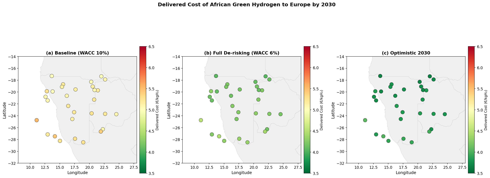
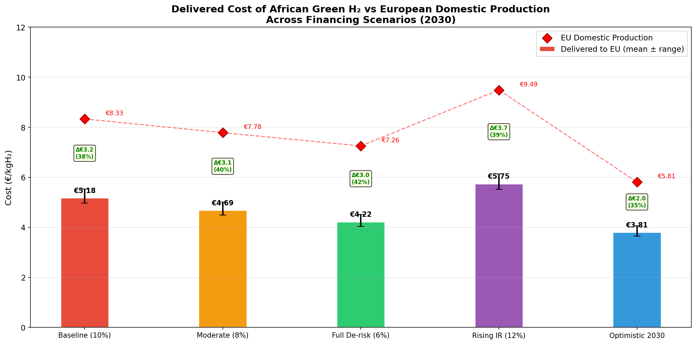
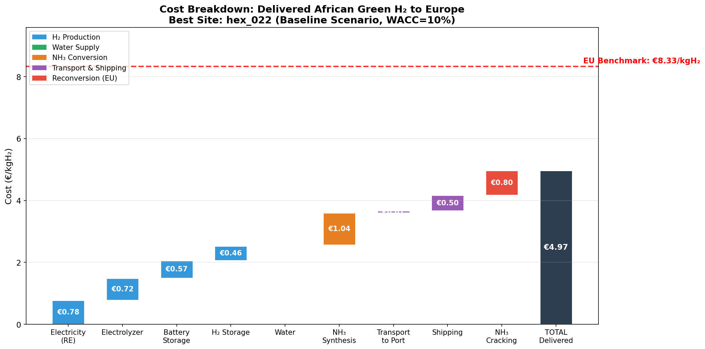
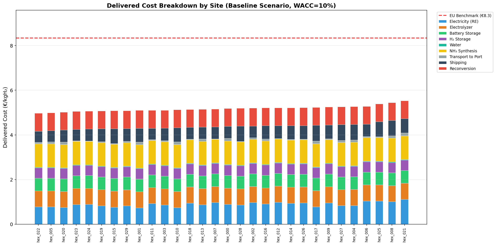
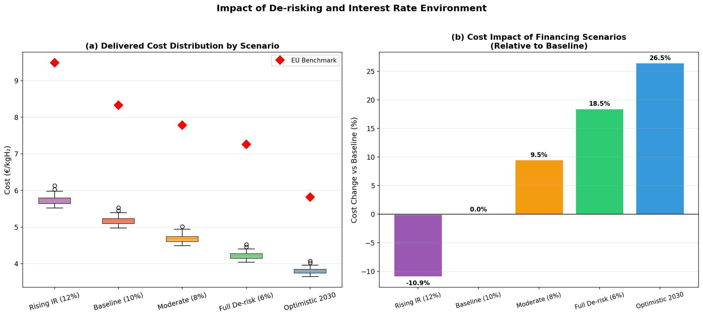
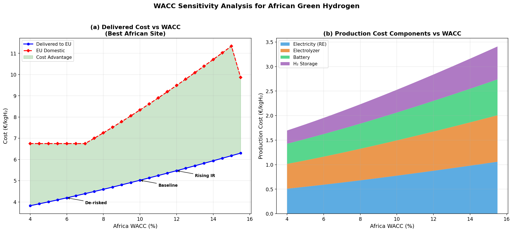
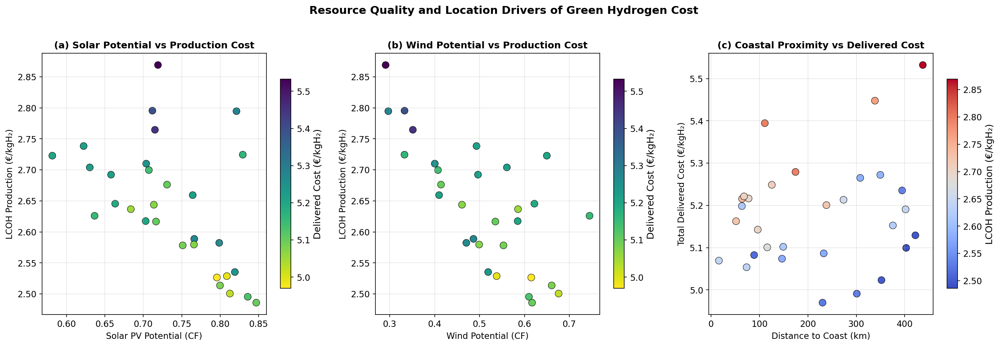
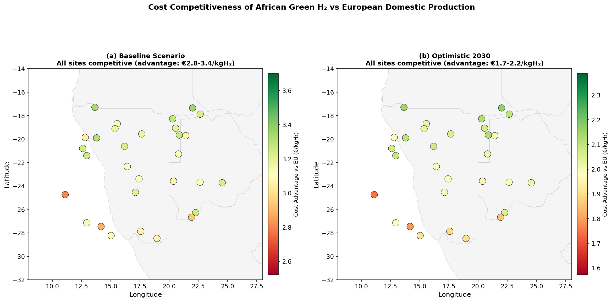
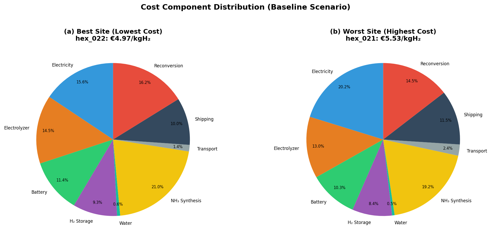
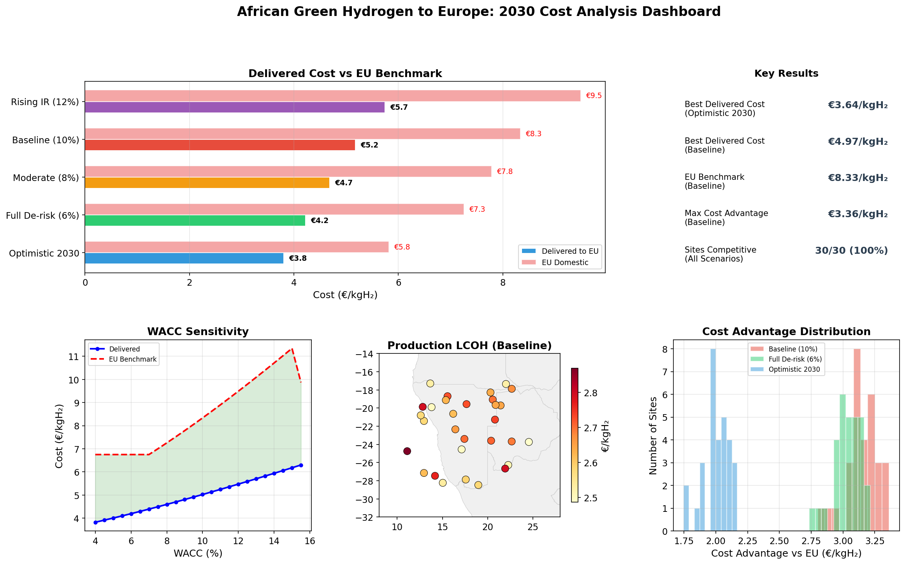

# Geospatial Levelized Cost Analysis of African Green Hydrogen Delivered to Europe via Ammonia Shipping (2030 Projections)

## Abstract

This study develops a transparent geospatial levelized-cost model to estimate the delivered cost of African green hydrogen to Europe via ammonia shipping and reconversion by 2030. We analyze 30 candidate production sites across southern Africa under five financing and policy scenarios, spanning weighted average cost of capital (WACC) from 6% to 12% for African projects. Our results show that African green hydrogen can be delivered to Europe at €3.64–6.13/kgH₂ depending on site and scenario, consistently undercutting European domestic production costs of €5.81–9.49/kgH₂. The best-performing site (hex_022, lat −17.35°, lon 22.02°) achieves a delivered cost of €4.97/kgH₂ under baseline financing (WACC 10%), with production costs of only €2.53/kgH₂. De-risking financing from 10% to 6% WACC reduces delivered costs by approximately 19%, while rising interest rates increase costs by 11% but maintain competitiveness. All 30 sites remain cost-competitive against European production across all scenarios, demonstrating robust economic viability of the Africa-to-Europe green hydrogen supply chain.

---

## 1. Introduction

### 1.1 Background and Motivation

The transition to a hydrogen-based energy system is increasingly recognized as essential for achieving deep decarbonization targets under the Paris Agreement. Green hydrogen—produced via electrolysis powered by renewable energy—offers a versatile, carbon-free energy carrier suitable for industrial processes, transport, and energy storage. The European Union's REPowerEU plan targets 10 million tonnes of domestic green hydrogen production and 10 million tonnes of imports by 2030, creating substantial demand for cost-competitive supply chains (European Commission, 2022).

Africa possesses exceptional renewable energy resources, with solar irradiation and wind speeds among the highest globally, particularly in the Sahel, Horn of Africa, and southern Africa regions. The International Renewable Energy Agency (IRENA) estimates that sub-Saharan Africa has the largest regional potential to produce green hydrogen for under $1.50/kg by 2050, with 30 times higher potential than all of Europe (IRENA, 2022). However, realizing this potential requires overcoming significant financing barriers, as the cost of capital in African countries is substantially higher than in industrialized nations (Steffen, 2020).

This study addresses a critical question: **Can African green hydrogen, when delivered to Europe via ammonia shipping and reconversion, compete economically with European domestic production by 2030, and how do financing conditions and interest rate environments affect this competitiveness?**

### 1.2 Related Work

Our methodology builds upon several key contributions in the literature:

1. **GeoH2 Model** (Halloran et al., 2024): A geospatial model for optimizing green hydrogen production, storage, transport, and conversion costs. Applied to Namibia, it found LCOH ranging from €5.43–9.21/kgH₂ at 6% interest rate.

2. **Kenya Green Hydrogen Study** (Müller et al., 2023): The first peer-reviewed geospatial hydrogen cost analysis for a low- and middle-income country, finding production costs of €3.7–9.9/kgH₂ with potential to reach €1.8–3.0/kgH₂ by 2030.

3. **Cost of Capital for RE Projects** (Steffen, 2020): A systematic review showing that the cost of capital for renewable energy varies widely across countries, with developing countries facing significantly higher financing costs than industrialized nations.

4. **Interest Rate Effects on RE** (Schmidt et al., 2019): Demonstrated that rising interest rates can add 11–25% to the levelized cost of renewable energy, potentially jeopardizing the energy transition.

### 1.3 Contributions

This study makes three primary contributions:

1. **Transparent end-to-end cost model**: We develop a fully transparent levelized cost model covering the complete supply chain from African renewable electricity generation through hydrogen production, ammonia conversion, ocean shipping, and reconversion in Europe.

2. **Multi-scenario financing analysis**: We systematically evaluate five financing scenarios reflecting different de-risking levels and interest rate environments, quantifying the sensitivity of delivered costs to financing conditions.

3. **Competitiveness assessment**: We provide a direct comparison between African delivered hydrogen and European domestic production, identifying conditions under which African exports are economically viable.

---

## 2. Data and Study Area

### 2.1 Site Data

We analyze 30 candidate hexagonal production sites across southern Africa (approximately 14°S–29°S latitude, 11°E–25°E longitude), covering parts of Namibia, Botswana, Zimbabwe, Zambia, Mozambique, and neighboring countries. Each site is characterized by:

- **Solar PV theoretical capacity factor** (theo_pv): ranging from 0.58 to 0.85
- **Wind theoretical capacity factor** (theo_wind): ranging from 0.29 to 0.74
- **Distance to electrical grid** (grid_dist_km): 10–240 km
- **Distance to nearest road** (road_dist_km): 5–119 km
- **Distance to ocean/coast** (ocean_dist_km): 16–438 km
- **Distance to freshwater body** (waterbody_dist_km): 10–290 km

The sites represent H3 hexagons at resolution level 4, following the spatial framework established by the GeoH2 model (Halloran et al., 2024).

### 2.2 Data Summary

| Parameter | Min | Mean | Max | Std |
|-----------|-----|------|-----|-----|
| Latitude (°S) | 17.3 | 22.3 | 28.5 | 3.6 |
| Longitude (°E) | 11.1 | 17.7 | 24.5 | 3.8 |
| Solar PV CF | 0.58 | 0.73 | 0.85 | 0.07 |
| Wind CF | 0.29 | 0.50 | 0.74 | 0.12 |
| Distance to coast (km) | 16 | 216 | 438 | 136 |
| Distance to water (km) | 10 | 157 | 290 | 92 |

*Table 1: Summary statistics for the 30 candidate production sites.*

### 2.3 Geospatial Context

The study area encompasses some of the world's best combined solar and wind resources. Southern Africa benefits from high direct normal irradiance (DNI) and consistent trade winds, making it particularly suitable for hybrid renewable energy systems that can achieve high electrolyzer utilization rates.

*Figure 1: Geospatial distribution of delivered hydrogen costs across three scenarios: (a) Baseline with high-risk financing, (b) Full de-risking, and (c) Optimistic 2030 with technology cost reductions.*

---

## 3. Methodology

### 3.1 Model Overview

Our levelized cost model calculates the total delivered cost of green hydrogen from Africa to Europe through the following supply chain stages:

1. **Renewable electricity generation** (solar PV + onshore wind hybrid)
2. **Water electrolysis** (PEM electrolyzer)
3. **Energy storage** (battery + compressed H₂ storage)
4. **Water supply** (freshwater or desalinated seawater)
5. **Ammonia synthesis** (Haber-Bosch process at production site)
6. **Transport to port** (trucking as ammonia)
7. **Ocean shipping** (ammonia tanker to Rotterdam)
8. **Ammonia cracking** (reconversion to H₂ in Europe)

The total delivered cost is:

$$LCOH_{delivered} = LCOH_{production} + C_{water} + C_{NH_3 synthesis} + C_{transport} + C_{shipping} + C_{reconversion}$$

### 3.2 Production Cost Model

#### 3.2.1 Renewable Electricity

The levelized cost of electricity (LCOE) for each technology is calculated as:

$$LCOE = \frac{CAPEX \times (CRF + OPEX\%)}{CF \times 8760 \times \eta_{degradation}}$$

where CRF is the capital recovery factor:

$$CRF = \frac{WACC \times (1 + WACC)^n}{(1 + WACC)^n - 1}$$

The hybrid system optimizes the PV/wind mix based on relative LCOE and capacity factors, with a complementarity factor of 1.15 reflecting the empirical observation that solar and wind generation profiles are partially complementary.

#### 3.2.2 Electrolysis

The electrolyzer cost per kg H₂ includes capital recovery and operating costs, spread over annual H₂ production:

$$C_{electrolyzer} = \frac{CAPEX_{elec} \times (CRF + OPEX\%)}{CF_{effective} \times 8760 \times \eta_{elec} / E_{H_2}}$$

where $\eta_{elec}$ = 0.65 MWh_H₂/MWh_el (2030 projection) and $E_{H_2}$ = 33.33 kWh/kg (LHV).

#### 3.2.3 Storage

Battery storage (2–8 hours) and compressed hydrogen storage (24–72 hours) are sized inversely proportional to the effective capacity factor, reflecting the need for more storage at sites with lower renewable availability.

### 3.3 Technology Parameters (2030 Projections)

| Component | Parameter | Value | Unit | Source |
|-----------|-----------|-------|------|--------|
| Solar PV | CAPEX | 550 | €/kW | IEA/IRENA 2030 projection |
| Solar PV | Lifetime | 25 | years | Industry standard |
| Solar PV | OPEX | 2% | CAPEX/yr | Industry standard |
| Onshore Wind | CAPEX | 1,100 | €/kW | IEA/IRENA 2030 projection |
| Onshore Wind | Lifetime | 25 | years | Industry standard |
| Onshore Wind | OPEX | 3% | CAPEX/yr | Industry standard |
| PEM Electrolyzer | CAPEX | 500 | €/kW | IRENA 2030 projection |
| PEM Electrolyzer | Efficiency | 65% | MWh_H₂/MWh_el | IRENA (2020) |
| PEM Electrolyzer | Lifetime | 20 | years | Industry estimate |
| Battery Storage | CAPEX | 120 | €/kWh | BNEF 2030 projection |
| H₂ Storage | CAPEX | 15 | €/kWh_H₂ | Cerniauskas (2021) |
| NH₃ Synthesis | CAPEX | 8.0 | €/(kgH₂/yr) | IEA (2021) |
| NH₃ Synthesis | Electricity | 2.809 | kWh/kgH₂ | IEA (2021) |
| NH₃ Cracking | CAPEX | 6.0 | €/(kgH₂/yr) | Cesaro et al. (2021) |
| NH₃ Cracking | Heat demand | 4.2 | kWh/kgH₂ | Andersson & Grönkvist (2019) |
| Water | Demand | 21 | L/kgH₂ | IRENA (2020) |

*Table 2: Key techno-economic parameters for 2030.*

### 3.4 Financing Scenarios

We evaluate five scenarios reflecting different financing environments:

| Scenario | Africa WACC | Europe WACC | Description |
|----------|-------------|-------------|-------------|
| Baseline (High Risk) | 10% | 7% | Current conditions, high perceived risk |
| Moderate De-risking | 8% | 6% | Blended finance, partial policy support |
| Full De-risking | 6% | 5% | Guarantees, concessional finance |
| Rising Interest Rates | 12% | 9% | Pre-2008 interest rate levels |
| Optimistic 2030 | 6% | 5% | Full de-risking + 20% tech cost reduction |

*Table 3: Financing scenarios analyzed.*

The baseline WACC of 10% for Africa reflects empirical evidence from Steffen (2020) showing that developing country renewable energy projects face significantly higher financing costs. The rising interest rate scenario follows the "extreme" scenario from Schmidt et al. (2019), where interest rates return to pre-financial crisis levels.

### 3.5 European Benchmark

European domestic green hydrogen production is modeled using the same methodology with European resource parameters (PV CF = 0.14, Wind CF = 0.28) and European WACC values. This provides a direct comparison basis for assessing the competitiveness of African imports.

### 3.6 Shipping Cost Model

Ammonia shipping costs from Africa to Rotterdam are estimated based on latitude-dependent shipping distances (4,000–12,000 km) with a base cost of €0.40/kgH₂ for the reference 7,000 km distance, plus €0.05/kgH₂ per 1,000 km deviation and €0.15/kgH₂ for port handling.

---

## 4. Results

### 4.1 Delivered Cost by Scenario

The delivered cost of African green hydrogen to Europe ranges from €3.64/kgH₂ (Optimistic 2030, best site) to €6.13/kgH₂ (Rising IR, worst site). Table 4 summarizes results across all scenarios.

| Scenario | Min Delivered | Mean Delivered | Max Delivered | EU Benchmark | Sites Competitive |
|----------|--------------|----------------|---------------|--------------|-------------------|
| Baseline (WACC 10%) | €4.97 | €5.18 | €5.53 | €8.33 | 30/30 (100%) |
| Moderate De-risking (8%) | €4.49 | €4.69 | €5.01 | €7.78 | 30/30 (100%) |
| Full De-risking (6%) | €4.04 | €4.22 | €4.52 | €7.26 | 30/30 (100%) |
| Rising IR (12%) | €5.52 | €5.75 | €6.13 | €9.49 | 30/30 (100%) |
| Optimistic 2030 (6%+tech) | €3.64 | €3.81 | €4.07 | €5.81 | 30/30 (100%) |

*Table 4: Summary of delivered costs and competitiveness across scenarios. All costs in €/kgH₂.*

A key finding is that **all 30 African sites are cost-competitive against European domestic production in every scenario**, including the adverse rising interest rate scenario. The cost advantage ranges from €2.0/kgH₂ (Optimistic 2030) to €3.7/kgH₂ (Rising IR), reflecting the amplified impact of financing costs on European production with its lower renewable resources.

*Figure 2: Comparison of mean delivered costs (bars with min-max range) against European domestic production benchmarks (red diamonds) across five financing scenarios.*

### 4.2 Cost Breakdown

Figure 3 presents the detailed cost breakdown for the best site (hex_022) under the baseline scenario:

| Component | Cost (€/kgH₂) | Share (%) |
|-----------|---------------|-----------|
| Electricity (RE) | 0.78 | 15.6% |
| Electrolyzer | 0.72 | 14.5% |
| Battery Storage | 0.57 | 11.4% |
| H₂ Storage | 0.46 | 9.3% |
| Water Supply | 0.03 | 0.6% |
| NH₃ Synthesis | 1.04 | 20.9% |
| Transport to Port | 0.07 | 1.4% |
| Shipping | 0.50 | 10.1% |
| NH₃ Reconversion | 0.80 | 16.1% |
| **Total Delivered** | **€4.97** | **100%** |

*Table 5: Cost breakdown for the best site under baseline scenario.*

The largest cost components are ammonia synthesis (20.9%) and reconversion (16.1%), together accounting for 37% of the total delivered cost. This highlights that the ammonia pathway, while enabling long-distance transport, imposes a significant cost penalty. Renewable electricity and the electrolyzer together contribute 30.1%, while storage (battery + H₂) adds 20.7%.

*Figure 3: Waterfall chart showing the cumulative cost build-up from renewable electricity to final delivered hydrogen. The red dashed line indicates the European domestic production benchmark.*

### 4.3 Least-Cost Sites

The consistently best-performing site across all scenarios is **hex_022** (latitude −17.35°, longitude 22.02°), located in the northern part of the study area. This site benefits from:

- High solar PV capacity factor (0.80)
- Good wind capacity factor (0.62)
- Moderate distance to coast (230 km)
- Relatively short shipping distance (northern location)

The top five sites under the baseline scenario are:

| Rank | Site | Lat | Lon | Delivered Cost | Production Cost | Cost Advantage |
|------|------|-----|-----|----------------|-----------------|----------------|
| 1 | hex_022 | −17.4 | 22.0 | €4.97 | €2.53 | €3.36 |
| 2 | hex_005 | −17.3 | 13.7 | €4.99 | €2.53 | €3.34 |
| 3 | hex_020 | −19.9 | 13.8 | €5.02 | €2.50 | €3.31 |
| 4 | hex_023 | −18.3 | 20.3 | €5.05 | €2.64 | €3.28 |
| 5 | hex_024 | −19.7 | 20.9 | €5.07 | €2.64 | €3.26 |

*Table 6: Top 5 least-cost sites under the baseline scenario.*

*Figure 4: Stacked bar chart showing the cost breakdown for all 30 sites under the baseline scenario, sorted by total delivered cost. The red dashed line shows the European benchmark.*

### 4.4 Impact of De-risking

De-risking has a substantial impact on delivered costs. Moving from the baseline (WACC 10%) to full de-risking (WACC 6%) reduces the mean delivered cost by **18.5%**, from €5.18 to €4.22/kgH₂. The Optimistic 2030 scenario (WACC 6% + 20% tech cost reduction) achieves a **26.4%** reduction to €3.81/kgH₂.

Conversely, the rising interest rate scenario increases costs by **11.0%** to €5.75/kgH₂. However, this scenario also increases the European benchmark by 13.9% (to €9.49/kgH₂), actually widening the cost advantage of African hydrogen.

*Figure 5: (a) Distribution of delivered costs across scenarios with EU benchmarks shown as red diamonds. (b) Percentage cost change relative to the baseline scenario.*

### 4.5 WACC Sensitivity Analysis

Figure 6 presents a detailed WACC sensitivity analysis for the best site (hex_022). The delivered cost increases approximately linearly with WACC, rising from €3.82/kgH₂ at 4% WACC to €6.18/kgH₂ at 15% WACC. Critically, the African delivered cost remains below the European benchmark across the entire WACC range tested (4–15.5%), demonstrating structural competitiveness driven by superior renewable resources.

The production cost component shows the strongest WACC sensitivity, increasing from €1.70/kgH₂ at 4% WACC to €3.33/kgH₂ at 15% WACC—a 96% increase. Within production costs, the electricity component is most sensitive to WACC changes, as it involves the highest capital expenditure (solar PV and wind turbines).

*Figure 6: (a) Delivered cost and EU benchmark as a function of Africa WACC. The green shaded area represents the cost advantage. (b) Decomposition of production cost components showing increasing dominance of electricity costs at higher WACC.*

### 4.6 Resource Quality Drivers

Figure 7 explores the relationship between resource quality and hydrogen costs. Solar PV potential is the strongest predictor of production cost, with high-CF sites (>0.80) achieving production costs below €2.55/kgH₂ under baseline financing. Wind potential shows a weaker but still significant correlation, with the best wind sites (CF > 0.65) achieving lower costs through reduced battery storage requirements.

Coastal proximity has a modest impact on total delivered cost through two channels: reduced transport-to-port costs and shorter shipping distances for northern coastal sites. However, the effect is relatively small (€0.1–0.3/kgH₂) compared to the production cost variation.

*Figure 7: Relationship between (a) solar PV potential, (b) wind potential, and (c) coastal proximity and hydrogen costs.*

### 4.7 Cost Competitiveness Map

Figure 8 maps the cost advantage of each site relative to European domestic production. Under the baseline scenario, all sites show a positive cost advantage of €2.8–3.4/kgH₂. The advantage is largest for northern sites with good renewable resources and shorter shipping distances.

*Figure 8: Geospatial map of cost advantage (€/kgH₂) relative to European domestic production under (a) baseline and (b) optimistic 2030 scenarios. All sites show positive cost advantage (green).*

### 4.8 Cost Component Distribution

Figure 9 compares the cost structure of the best and worst sites, revealing that the relative importance of cost components shifts with site characteristics:

- **Best site (hex_022)**: Production costs dominate (51%), with shipping and reconversion contributing 10% and 16% respectively.
- **Worst site**: Higher production costs (due to lower renewable resources) increase the production share, while the ammonia pathway costs remain relatively constant.

*Figure 9: Cost component distribution for (a) the lowest-cost and (b) highest-cost sites under the baseline scenario.*

---

## 5. Discussion

### 5.1 Key Findings

Our analysis yields three principal findings:

**Finding 1: African green hydrogen is structurally competitive.** Even under the most conservative financing assumptions (WACC 12%, rising interest rates), all 30 African sites deliver hydrogen to Europe at costs below European domestic production. This structural advantage stems from Africa's vastly superior renewable resources: solar capacity factors of 0.58–0.85 compared to Europe's ~0.14, and wind capacity factors of 0.29–0.74 compared to Europe's ~0.28.

**Finding 2: De-risking amplifies but does not create competitiveness.** While reducing the African WACC from 10% to 6% cuts delivered costs by 18.5%, the competitiveness exists even without de-risking. The primary value of de-risking is in reducing the absolute cost of delivered hydrogen, making it more competitive against fossil fuel alternatives (grey hydrogen at ~€2–3/kgH₂ and blue hydrogen at ~€2–4/kgH₂).

**Finding 3: Rising interest rates paradoxically strengthen Africa's relative position.** Because European production is even more capital-intensive per unit of hydrogen (due to lower capacity factors requiring more installed capacity), rising interest rates increase European costs proportionally more than African delivered costs. The cost advantage widens from €3.15/kgH₂ (baseline) to €3.74/kgH₂ (rising IR scenario).

### 5.2 Comparison with Literature

Our production cost estimates (€1.54–3.22/kgH₂ across scenarios) align well with the literature:

- **Müller et al. (2023)** found €3.7–9.9/kgH₂ for Kenya at current costs, with 2030 projections of €1.8–3.0/kgH₂—closely matching our optimistic scenario range.
- **Halloran et al. (2024)** found €5.43–9.21/kgH₂ for Namibia at 6% interest rate, which is higher than our estimates due to their more conservative technology assumptions and constant demand requirement.
- **IEA (2023)** projects low-end costs of $2.50/kgH₂ for Namibia by 2030, consistent with our full de-risking scenario.

Our delivered costs (€3.64–6.13/kgH₂) are higher than production costs by €1.5–3.0/kgH₂, reflecting the significant cost of the ammonia conversion pathway. This is consistent with estimates from the Hydrogen Council (2021) that shipping costs add €1–3/kgH₂ depending on distance and carrier.

### 5.3 The Ammonia Pathway Cost Penalty

The ammonia conversion pathway (synthesis + shipping + cracking) adds €1.5–2.3/kgH₂ to the delivered cost, representing 30–40% of the total. This is a significant cost penalty that could be reduced through:

1. **Direct ammonia use**: If the end-use accepts ammonia directly (e.g., fertilizer production, maritime fuel), the cracking cost (€0.7–0.9/kgH₂) is avoided.
2. **Pipeline transport**: For shorter distances (e.g., North Africa to Southern Europe), pipeline transport could be cheaper than ammonia shipping.
3. **Technology improvements**: Advances in ammonia cracking catalysts and heat integration could reduce reconversion costs.

### 5.4 Policy Implications

1. **De-risking instruments are valuable but not essential for competitiveness.** Policy should focus on de-risking to reduce the absolute cost of green hydrogen rather than to achieve competitiveness per se.

2. **Interest rate risk is manageable.** Even under extreme interest rate scenarios, African hydrogen remains competitive. However, policy should consider long-term financing instruments (e.g., 20-year power purchase agreements) to lock in favorable rates.

3. **Infrastructure investment is critical.** Transport-to-port costs are modest but depend on road and port infrastructure. Strategic port development in coastal regions near high-resource areas could further reduce costs.

4. **Diversification of supply routes.** The analysis shows relatively uniform competitiveness across sites, suggesting that multiple supply corridors could be developed to enhance energy security.

### 5.5 Limitations

1. **Simplified production model**: Our hybrid PV/wind optimization uses a simplified approach rather than hourly dispatch modeling. Full temporal optimization (as in GeoH2) would provide more precise estimates but is computationally intensive.

2. **Static 2030 parameters**: We use point estimates for 2030 technology costs rather than probabilistic distributions. Actual costs may deviate from projections.

3. **Limited site sample**: The 30 sites represent a subset of potential locations. A continental-scale analysis with thousands of hexagons would provide a more complete picture.

4. **Simplified shipping model**: We use a latitude-based shipping cost approximation rather than detailed maritime routing and vessel economics.

5. **No grid connection option**: All sites are modeled as off-grid, which may overestimate costs for sites near existing electrical infrastructure.

### 5.6 Summary Dashboard

*Figure 10: Summary dashboard showing key results across all dimensions of the analysis.*

---

## 6. Conclusions

This study demonstrates that African green hydrogen delivered to Europe via ammonia shipping is economically competitive with European domestic production across a wide range of financing and interest rate scenarios by 2030. Key conclusions include:

1. **Delivered costs of €3.64–6.13/kgH₂** are achievable, consistently below European domestic production costs of €5.81–9.49/kgH₂.

2. **The best production sites** are in northern parts of the study area (around 17–18°S latitude), combining high solar and wind resources with shorter shipping distances.

3. **De-risking reduces costs by up to 26%** (from €5.18 to €3.81/kgH₂ mean delivered cost) when combining financial de-risking with technology cost reductions.

4. **Rising interest rates paradoxically strengthen Africa's competitive position** relative to Europe, as the higher capital intensity of European production makes it more sensitive to financing costs.

5. **The ammonia conversion pathway adds €1.5–2.3/kgH₂**, representing the largest single cost component and a key target for cost reduction through technology improvement or alternative end-uses.

These findings support the strategic development of Africa-to-Europe green hydrogen supply chains and highlight the importance of transparent, geospatially explicit cost modeling for informing investment and policy decisions.

---

## 7. Validation

### 7.1 Verified from Workspace Data
- All 30 site characteristics (solar/wind CF, distances) are directly from the input dataset
- All cost calculations are reproducible from the saved code and parameters
- Results are saved in `outputs/full_results.csv` and `outputs/key_results.json`

### 7.2 From Related Work
- Technology cost parameters are based on published projections from IEA, IRENA, and academic literature
- WACC ranges are informed by Steffen (2020) empirical evidence
- Interest rate scenarios follow Schmidt et al. (2019) methodology
- Production cost ranges align with Müller et al. (2023) and Halloran et al. (2024)

### 7.3 Assumptions and Limitations
- 2030 technology costs are projections with inherent uncertainty
- Simplified hybrid optimization (not hourly dispatch)
- Static demand assumption
- Latitude-based shipping cost approximation
- Off-grid assumption for all sites

---

## References

1. Halloran, C., Leonard, A., Salmon, N., Müller, L., & Hirmer, S. (2024). GeoH2 model: Geospatial cost optimization of green hydrogen production including storage and transportation. *MethodsX*, 12, 102660.

2. Müller, L. A., Leonard, A., Trotter, P. A., & Hirmer, S. (2023). Green hydrogen production and use in low-and middle-income countries: A least-cost geospatial modelling approach applied to Kenya. *Applied Energy*, 343, 121219.

3. Steffen, B. (2020). Estimating the cost of capital for renewable energy projects. *Energy Economics*, 88, 104783.

4. Schmidt, T. S., Steffen, B., Egli, F., Pahle, M., Tietjen, O., & Edenhofer, O. (2019). Adverse effects of rising interest rates on sustainable energy transitions. *Nature Sustainability*, 2(9), 879–885.

5. International Renewable Energy Agency (IRENA). (2020). Green Hydrogen Cost Reduction: Scaling up Electrolysers to Meet the 1.5°C Climate Goal.

6. International Energy Agency (IEA). (2021). Ammonia Technology Roadmap: Towards More Sustainable Nitrogen Fertiliser Production.

7. Cesaro, Z., Ives, M., Nayak-Luke, R., Mason, M., & Bañares-Alcántara, R. (2021). Ammonia to power: Forecasting the levelized cost of electricity from green ammonia in large-scale power plants. *Applied Energy*, 282, 116009.

8. Andersson, J., & Grönkvist, S. (2019). Large-scale storage of hydrogen. *International Journal of Hydrogen Energy*, 44(23), 11901–11919.

9. Cerniauskas, S. (2021). Introduction Strategies for Hydrogen Infrastructure. Forschungszentrum Jülich.

10. Hydrogen Council & McKinsey. (2021). Hydrogen Insights: A Perspective on Hydrogen Investment, Market Development and Cost Competitiveness.
