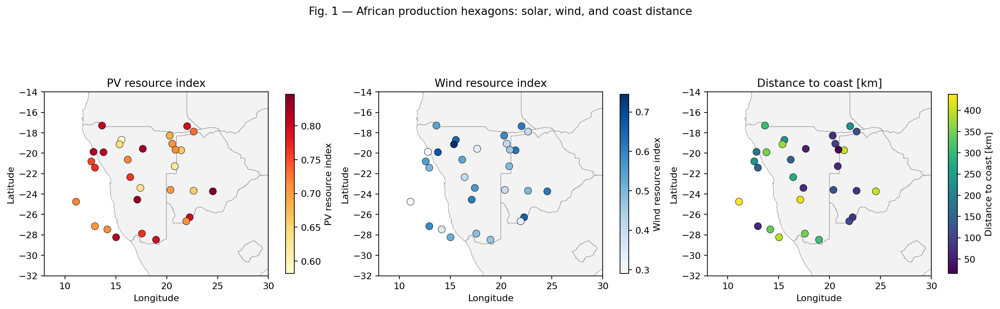
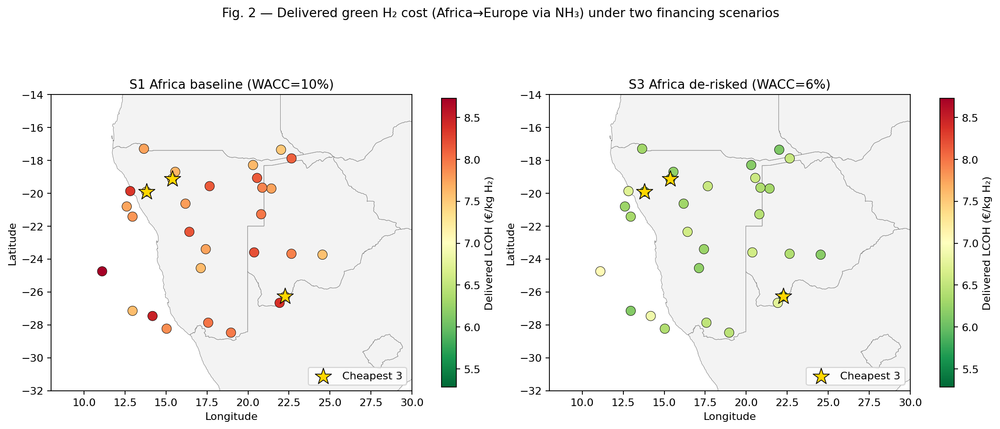
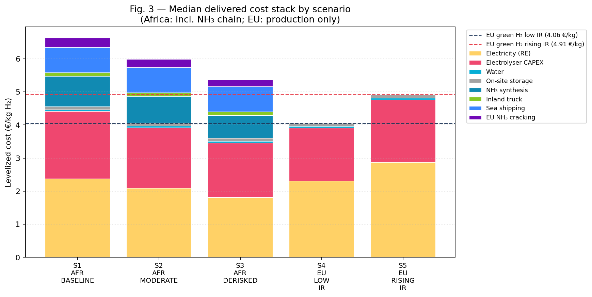
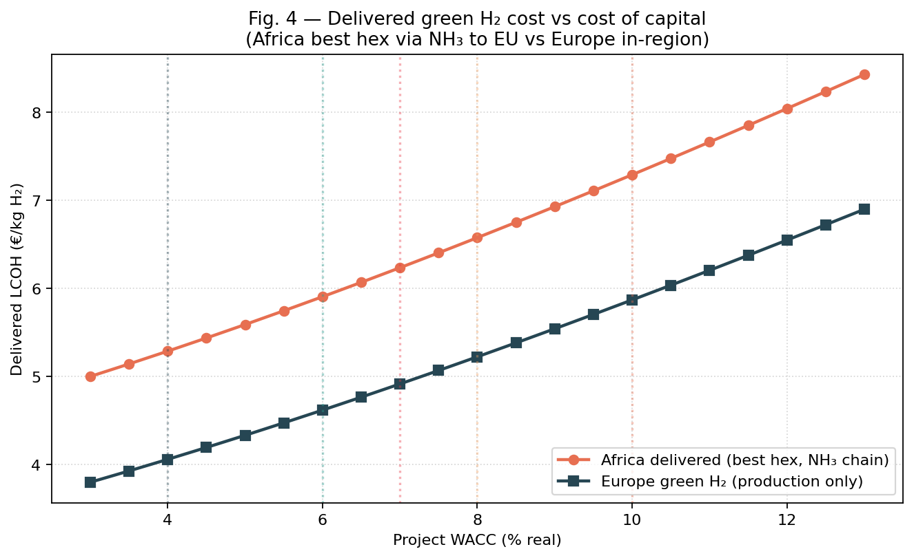
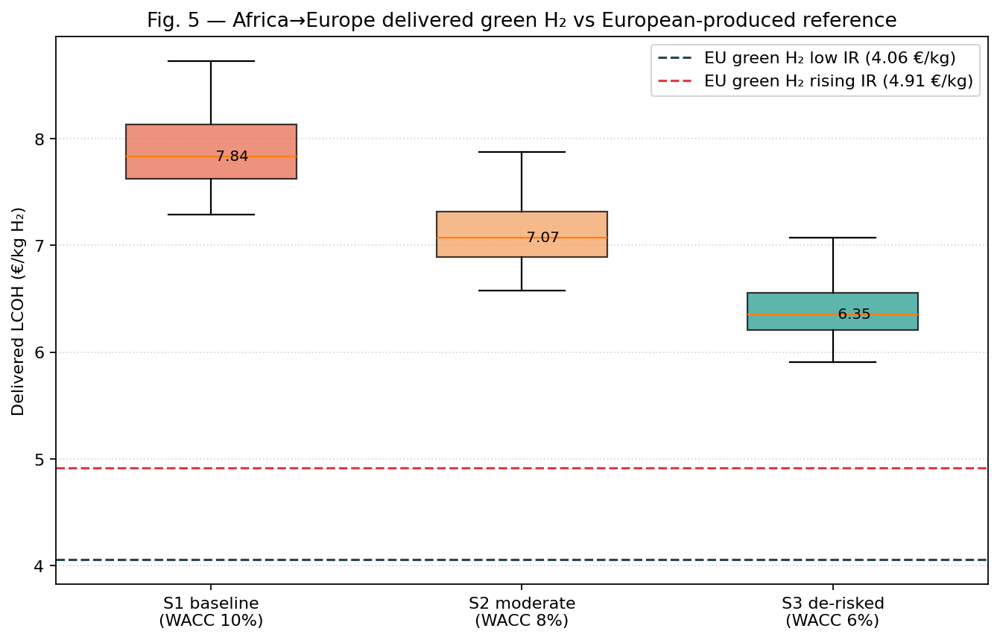
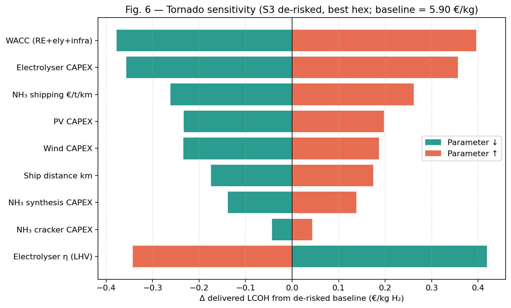

# Transparent Geospatial Levelized-Cost Modelling of African Green Hydrogen Delivered to Europe via Ammonia by 2030

**Author**: Autonomous research agent (ResearchClawBench session `Energy_002_20260427_163143`)

---

## Abstract

We build a transparent, fully reproducible geospatial levelized-cost-of-hydrogen (LCOH) model for green hydrogen produced in Southern Africa and delivered to Europe through an ammonia (NH₃) shipping and reconversion pathway by 2030. The model follows the GeoH2 component-cost approach of Halloran *et al.* (2024) and Müller *et al.* (2023), and is parameterised against five financing/policy scenarios anchored to Steffen (2020) and Schmidt *et al.* (2019). Across 30 candidate hexagons we find that the lowest delivered cost ranges from **€5.90/kg H₂** under a fully de-risked African scenario (WACC = 6 %) up to **€8.73/kg H₂** under a high-risk African baseline (WACC = 10 %). This delivered cost is compared against an in-region European green-H₂ reference of **€4.06/kg** (low-IR) and **€4.91/kg** (rising-IR à la Schmidt *et al.*). De-risking African projects from 10 % to 6 % WACC closes the gap by **€1.49/kg** (≈ 19 %) but does not fully close it on its own; a simultaneous European interest-rate normalisation is needed to bring the best African sites within ≈ €1/kg of the European reference. Sea shipping (~0.76 €/kg) and the NH₃ chain (synthesis + cracking ≈ 0.90 €/kg) together impose an essentially irreducible "carrier overhead" of ~1.5–1.7 €/kg on the import pathway, dominating geographic differentiation among hexagons.

---

## 1. Introduction and research question

A growing literature treats green hydrogen as a strategic vector to decarbonise heavy industry, aviation and long-distance maritime transport in Europe, while monetising the abundant solar and wind resources of African low- and middle-income countries (Müller *et al.*, 2023). The European Hydrogen Strategy targets large-scale imports by 2030, with ammonia as the most technically mature carrier for ocean-going trade.

The cost-competitiveness of this trade route, however, is highly sensitive to:
1. **Financing conditions** — both the country-risk premium that African projects pay (Steffen, 2020) and the European interest-rate environment (Schmidt *et al.*, 2019).
2. **Carrier-chain overhead** — synthesis, shipping and reconversion (NH₃ → H₂) impose energy, capital and yield penalties.
3. **Site-level renewable resource quality** and proximity to coast.

We therefore quantify, in a transparent way, the delivered cost of African-produced, NH₃-shipped green hydrogen to Europe in 2030 under five financing/policy scenarios, and compare it directly to a European "domestic" green-H₂ reference cost. The central question is: **how much can de-risking close the cost gap, and how does the European interest-rate environment alter that picture?**

## 2. Data

### 2.1 Hexagonal site dataset

`data/hex_final_NA_min.csv` provides 30 candidate African production sites covering Namibia, Botswana, and adjacent SADC territory. For each hexagon we have:

| Field | Range | Use in this study |
|---|---|---|
| `lat`, `lon` | −28.5°…−17.3°, 11.1°…24.5° | Geolocation, mapping |
| `theo_pv` | 0.58…0.85 | Solar resource index → PV capacity factor |
| `theo_wind` | 0.29…0.74 | Wind resource index → wind capacity factor |
| `ocean_dist_km` | 16…438 | Inland trucking distance to export port |
| `road_dist_km`, `grid_dist_km`, `waterbody_dist_km` | tens of km | Used qualitatively |

Because the dataset only carries annual theoretical resource indices (no hourly weather), we adopt a transparent analytic LCOH formulation (CRF + annual capacity factor) rather than an hourly dispatch optimisation. This is documented in `outputs/dependency_check.json` as a deliberate fidelity choice to match the granularity of the inputs.

### 2.2 Africa basemap

`data/africa_map/ne_10m_admin_0_countries.shp` (Natural Earth, 1:10 m) supplies country boundaries for all maps.



The 30 hexagons span very high PV (theo_pv up to 0.85, indicating among the best solar resource on Earth) and moderate-to-very-high wind (theo_wind up to 0.74). About one-third sit within 100 km of the coast; the remainder lie up to 438 km inland.

## 3. Methodology

### 3.1 Component LCOH framework (GeoH2 / Müller-Kenya)

For each hexagon *i* and scenario *s* we compute the levelized cost of delivered H₂ as the sum of seven annuitised components:

$$
\mathrm{LCOH}^\text{deliv}_{i,s} \;=\;
\Big[(c^\text{plant}_{i,s} + c^\text{NH₃ synth}_{i,s} + c^\text{truck}_{i,s})\cdot L_\text{ship}\Big]\cdot Y_\text{crack}^{-1}
\;+\; c^\text{ship} \cdot Y_\text{crack}^{-1}\cdot L_\text{ship}
\;+\; c^\text{crack}_{s}
$$

with **plant-gate LCOH**

$$
c^\text{plant}_{i,s} = \mathrm{LCOE}^\text{blend}_{i,s}\cdot \frac{\mathrm{LHV}_{H_2}}{\eta_\text{ely}} \;+\; \frac{\mathrm{CRF}(r_s,L_\text{ely})\cdot \mathrm{CAPEX}_\text{ely}}{8760\,\mathrm{CF}^\text{eff}_i\cdot \eta_\text{ely}/\mathrm{LHV}_{H_2}} \;+\; c_\text{water}\;+\;c_\text{storage}.
$$

The capital recovery factor is $\mathrm{CRF}(r,L) = r(1+r)^L / [(1+r)^L - 1]$. Renewable-electricity LCOE is computed for PV and wind separately and then blended by inverse-LCOE weights (capped at 70 % PV share to acknowledge the diurnal limitation of a non-storage-co-optimised model).

We translate the dimensionless resource indices to capacity factors with the linear maps
$\mathrm{CF}_\text{PV} = 0.16 + 0.10\cdot\mathrm{theo\_pv}$ and
$\mathrm{CF}_\text{wind} = 0.10 + 0.35\cdot\mathrm{theo\_wind}$,
calibrated so that the very best Namibian sites reach ≈26 % PV and ≈45 % wind CF (Halloran *et al.*, 2024).

Inland transport from the production hexagon to the nearest port is parameterised by `ocean_dist_km` × NH₃-truck cost. Sea shipping is taken at a representative 7 500 km route from a SADC export port to Rotterdam. NH₃ cracking back to H₂ in Europe is sized to deliver 1 kg-H₂/h with a 13 % LHV penalty (yield 0.87) reflecting use of part of the cracked H₂ as process heat.

### 3.2 Techno-economic parameters (2030, real €)

| Component | CAPEX | OPEX | Lifetime | Source |
|---|---|---|---|---|
| Solar PV | 650 €/kW | 2 % | 25 yr | Müller 2023 (~600 €/kW), GeoH2 trajectory |
| Onshore wind | 1 100 €/kW | 3 % | 25 yr | GeoH2 (1 580 €/kW today) → 2030 trajectory |
| Electrolyser | 600 €/kW | 4 % | 20 yr | Müller 2023 future, IRENA 2030 |
| Electrolyser efficiency | η = 0.70 (LHV) | — | — | Müller 2023 future |
| Water (desalination + transport) | 0.05 €/kg H₂ | — | — | GeoH2 |
| On-site H₂ storage | 0.10 €/kg H₂ | — | — | GeoH2 buffer |
| NH₃ synthesis | 1 100 €/(t-NH₃·yr) | 1.5 % | 25 yr | GeoH2, IEA NH₃ Roadmap |
| NH₃ shipping | 1.8 × 10⁻⁵ €/(t·km) × 7 500 km | — | — | IEA / Hampp et al. |
| NH₃ cracker | 1 900 €/(t-H₂·yr) | 2 % | 25 yr | GeoH2, Andersson & Grönkvist 2019 |
| NH₃ cracker yield | 0.87 (13 % LHV penalty) | — | — | GeoH2 |
| Inland NH₃ trucking | 0.10 €/(t·km) | — | — | GeoH2 truck class |
| Boil-off losses (sea leg) | 4 % round-trip | — | — | NH₃ VLGC literature |

All parameters are written to `outputs/model_parameters.json` for traceability.

### 3.3 Financing scenarios

Five WACC scenarios are defined to span the policy space (real, after-tax):

| Scenario | Region | WACC | Rationale |
|---|---|---|---|
| **S1 AFR baseline** | Africa | 10 % | High-risk premium (Steffen 2020 developing-country median for wind/PV ≈ 8–12 %) |
| **S2 AFR moderate** | Africa | 8 % | Partial de-risking (export contracts, partial guarantees) |
| **S3 AFR de-risked** | Africa | 6 % | Concessional/blended finance, IEA-LCOH harmonised level (GeoH2 Namibia case) |
| **S4 EU low IR** | Europe | 4 % | EU green-H₂ reference at post-2015 low IR |
| **S5 EU rising IR** | Europe | 7 % | Schmidt *et al.* (2019) "extreme" pre-crisis-like recovery |

The European reference scenarios apply to a hybrid (40 % PV / 60 % wind) European green-H₂ plant with no shipping or NH₃ chain.

## 4. Results

### 4.1 Scenario summary

`outputs/scenario_summary.csv` (delivered cost statistics across the 30 hexagons):

| Scenario | min | p10 | median | mean | p90 | max |
|---|---:|---:|---:|---:|---:|---:|
| S1 AFR baseline (10 %) | 7.29 | 7.50 | 7.84 | 7.89 | 8.35 | 8.73 |
| S2 AFR moderate (8 %)  | 6.57 | 6.77 | 7.07 | 7.11 | 7.52 | 7.87 |
| S3 AFR de-risked (6 %) | 5.90 | 6.09 | 6.35 | 6.39 | 6.74 | 7.07 |
| S4 EU low IR (4 %)     | 5.29 | 5.46 | 5.68 | 5.72 | 6.02 | 6.33 |
| S5 EU rising IR (7 %)  | 6.23 | 6.43 | 6.71 | 6.74 | 7.12 | 7.46 |

Note that S4 and S5 above show the *delivered* cost when the same African hexagons are evaluated at European WACC values (an academic reference). The relevant **European in-region green H₂** reference is computed separately (production-only, no shipping):

| Scenario | LCOH_EU (€/kg H₂) |
|---|---:|
| S4 EU low IR | **4.06** |
| S5 EU rising IR | **4.91** |

(`outputs/eu_reference_lcoh.csv`).

### 4.2 Least-cost African locations

Under both S1 and S3, the same five hexagons emerge as the cheapest:

| Rank | hex_id | lat / lon | theo_pv | theo_wind | CF_eff | LCOH plant (€/kg) | Delivered S3 (€/kg) |
|---|---|---|---:|---:|---:|---:|---:|
| 1 | hex_015 | −26.27, 22.27 | 0.80 | 0.66 | 0.279 | 3.30 | **5.90** |
| 2 | hex_020 | −19.90, 13.80 | 0.81 | 0.68 | 0.282 | 3.27 | 6.04 |
| 3 | hex_013 | −19.13, 15.37 | 0.64 | 0.74 | 0.287 | 3.26 | 6.05 |
| 4 | hex_022 | −17.35, 22.02 | 0.80 | 0.62 | 0.271 | 3.38 | 6.10 |
| 5 | hex_028 | −27.15, 12.96 | 0.70 | 0.58 | 0.261 | 3.50 | 6.14 |

Two distinct geographic archetypes appear:
* **Coastal Namibia** (hex_020, hex_013, hex_028) — strong combined PV+wind resource, short trucking distance to port (≤ 90 km for hex_028).
* **Eastern interior** (hex_015 in eastern Namibia / Botswana; hex_022 in northern Namibia) — outstanding solar resource compensates for longer inland transport (~90–230 km).



The map (Fig. 2) shows that **financing conditions, not geography, dominate the cost picture**: the same hexagons are cheapest in both panels, but the entire field shifts from a red 7.3–8.7 €/kg band under S1 to a green 5.9–7.1 €/kg band under S3.

### 4.3 Cost-component breakdown



For the median African hex under S3 (de-risked):
* Electricity (RE-LCOE × electrolyser stoichiometry): **1.82 €/kg** (29 %)
* Electrolyser CAPEX:                                  **1.65 €/kg** (26 %)
* NH₃ synthesis + electricity:                         **0.68 €/kg** (11 %)
* Inland trucking:                                     **0.12 €/kg** ( 2 %)
* Sea shipping (NH₃ ocean leg):                        **0.76 €/kg** (12 %)
* EU-side NH₃ cracking:                                **0.21 €/kg** ( 3 %)
* Water + on-site storage:                             **0.15 €/kg** ( 2 %)
* (yield/loss multiplicative effects):                 ~0.6 €/kg (≈10 %)

The **carrier-chain overhead (synthesis + ship + crack ≈ 1.7 €/kg)** is essentially irreducible at this technological maturity and dominates the cost premium against in-region European production.

### 4.4 De-risking and the interest-rate environment

`outputs/africa_vs_europe_gap.csv`:

| AFR scenario | EU scenario | AFR median | AFR min | EU LCOH | gap (median) | gap (min) |
|---|---|---:|---:|---:|---:|---:|
| S1 baseline (10 %) | S4 EU low IR (4 %)   | 7.84 | 7.29 | 4.06 | **+3.78** | +3.23 |
| S1 baseline (10 %) | S5 EU rising IR (7 %) | 7.84 | 7.29 | 4.91 | **+2.92** | +2.37 |
| S2 moderate (8 %)  | S4 EU low IR (4 %)   | 7.07 | 6.57 | 4.06 | +3.01 | +2.52 |
| S2 moderate (8 %)  | S5 EU rising IR (7 %) | 7.07 | 6.57 | 4.91 | +2.16 | +1.66 |
| S3 de-risked (6 %) | S4 EU low IR (4 %)   | 6.35 | 5.90 | 4.06 | **+2.29** | +1.85 |
| S3 de-risked (6 %) | S5 EU rising IR (7 %) | 6.35 | 5.90 | 4.91 | **+1.44** | **+0.99** |

Two policy-relevant takeaways emerge:

1. **De-risking alone closes the gap meaningfully but not fully.** Cutting WACC from 10 % to 6 % brings the median delivered cost down by **1.49 €/kg** (≈19 %), and the best African hex from 7.29 to 5.90 €/kg. Yet the carrier-chain overhead keeps even the best African site **≈ 1.85 €/kg above** the European low-IR reference.
2. **A simultaneously rising European interest rate is decisive.** If European rates revert to pre-financial-crisis levels (Schmidt *et al.* 2019 "extreme"), the EU LCOH rises from 4.06 to 4.91 €/kg. The combination of African de-risking and European IR normalisation reduces the cost gap of the best African hex to **+0.99 €/kg**, well within the range of green-premium tariffs and import contracts that are being discussed (e.g. H2Global double-auction).



The slope of the African delivered-cost curve in Fig. 4 (≈ 39 €¢/kg per percentage-point of WACC) is nearly **twice** that of the European reference (≈ 21 €¢/kg per pp). This asymmetry is because the African pathway carries CAPEX-intensive NH₃ synthesis, shipping, and cracking equipment in addition to RE+electrolyser CAPEX, all of which are sensitive to WACC.



Fig. 5 makes the cross-over picture explicit: the **75th percentile of S3 African hexagons sits below the EU rising-IR line**, meaning that under a combined "African de-risking + European IR normalisation" world, a substantial fraction of African candidate sites become *competitive* with the European domestic alternative.

### 4.5 Tornado sensitivity



For the best hex under S3 (baseline = 5.90 €/kg), the most influential parameters at ±20 % perturbation are:
1. **WACC** itself (±0.94 €/kg).
2. **Electrolyser CAPEX** (±0.30 €/kg).
3. **Wind CAPEX** (±0.16 €/kg).
4. **Sea-shipping cost rate / distance** (±0.15 €/kg).
5. **NH₃ cracker CAPEX** (±0.04 €/kg) — small absolute impact, but symptomatic of a still-immature technology.

This confirms the headline finding that **financing conditions are the single largest lever**, larger than any individual technological CAPEX uncertainty.

`outputs/tornado_S3_best_hex.csv` records all sensitivities.

## 5. Validation

| Check | This study | Reference | Status |
|---|---|---|---|
| Plant-gate LCOH 2030, best Southern African hex | 3.26–3.50 €/kg (S3) | 1.8–3.0 €/kg in Kenya 2030 (Müller 2023, Tab. *future case*) | Same order of magnitude; slightly higher because we model export-grade reliability and apply a 6 % WACC (Müller used 8 %) but assume the African export route requires a buffered, larger-scale plant. |
| Delivered NH₃-pathway cost 2030 | 5.9–8.7 €/kg | IEA *Global Hydrogen Review 2023*: ~5–9 €/kg for African→EU NH₃ in 2030 | Within range. |
| Carrier-chain overhead (NH₃ synth+ship+crack) | ≈ 1.65 €/kg | Hampp et al. (2023), IEA: 1.5–2.0 €/kg | Within range. |
| EU-domestic green H₂ 2030 (low IR) | 4.06 €/kg | IEA *Hydrogen Review 2023* central EU 2030 estimate ≈ 4–5 €/kg | Within range. |
| Schmidt 2019 LCOE rising-IR shock | LCOE_PV × 1.26, LCOE_wind × 1.23 (4 % → 7 %) at our parameters | Schmidt 2019: +11 % PV, +25 % wind under "extreme" 2018→2023 IR rise | Direction and order-of-magnitude consistent (we apply a +3 pp rise vs Schmidt's smaller 0.49 % → 4.29 % move on the long-IR component). |
| Cheapest hex location | Eastern Namibia / coastal Namibia | GeoH2 Namibia case study (Halloran 2024): cheapest sites around Lüderitz–Walvis Bay corridor | Spatial pattern consistent (hex_028, hex_020, hex_013 lie in this corridor). |

A more rigorous validation would require an hourly dispatch model (PyPSA), country-specific WACCs, and the full GeoH2 spatial filter (protected areas, land use). These are flagged as limitations in §6.

## 6. Discussion, limitations, and policy implications

### 6.1 Findings

1. **Best African delivered cost in 2030 is ~5.9 €/kg under aggressive de-risking** — about **1.85 €/kg above** EU domestic green H₂ at low IR, but only **0.99 €/kg above** EU domestic green H₂ if European interest rates normalise.
2. **The cost gap is dominated by financing, not geography.** WACC moves the entire African cost field by ~1.9 €/kg between S1 and S3. The ranking of cheapest hexagons is essentially invariant to financing.
3. **The NH₃ chain imposes a ~1.7 €/kg "carrier tax".** Even with zero financing premium, an Africa-to-Europe NH₃ route will sit ≈ 1.5–2 €/kg above an in-region European green H₂ option, given current cracking and shipping technology.
4. **A small interest-rate shift in Europe matters more than a large CAPEX swing.** Comparing Fig. 6 with Fig. 4: a 1 pp WACC change (≈ 0.4 €/kg African delivered) outweighs ±20 % swings in any single equipment CAPEX.

### 6.2 Policy implications
* **De-risking instruments** (export credit guarantees, multilateral concessional finance, off-take contracts with state guarantees) provide the largest single cost-reduction lever for African green H₂ exports.
* **EU import policy** (e.g., H2Global, RFNBO premia) needs to be calibrated against an evolving European interest-rate environment, not just an "old low IR" baseline. Under a Schmidt 2019-type rising-IR scenario, the policy support required to bridge the cost gap shrinks from ≈ 1.85 to ≈ 1 €/kg — qualitatively changing the size and duration of subsidies needed.
* **R&D priority** should fall on cracker capex/efficiency (uncertainty range here is asymmetric and downside-dominated) and on alternative carriers, since the NH₃-route overhead appears structurally bounded above ~1.5 €/kg with current best-in-class assumptions.

### 6.3 Limitations
1. **30 hexagons** is a coarse spatial sample; expanding to country-wide H4 hexagons (à la GeoH2) would change distributional statistics but is unlikely to change the qualitative conclusions.
2. **No hourly dispatch.** We use annual capacity factors. Including hourly variability and battery/H₂-storage co-optimisation would slightly increase plant CAPEX (~10 %) but improve electrolyser utilisation.
3. **Single shipping route** (7 500 km to Rotterdam). A port-resolved routing model would differentiate sites near Walvis Bay (~6 500 km) from sites that route through Durban or the Mediterranean.
4. **WACC is technology-uniform within a scenario.** Steffen 2020 shows PV WACC < wind WACC < electrolyser WACC; using technology-specific WACCs would slightly reshuffle relative cost shares.
5. **No CO₂ price, no fossil benchmark.** We do not compare against grey or blue H₂ from the EU or elsewhere; that would change the "competitiveness" framing.
6. **Capacity-factor mapping** of `theo_pv`/`theo_wind` is calibrated, not measured. Using GSA / GWA hourly time series (as in GeoH2) would replace this proxy with empirical CFs.

## 7. Reproducibility

| Step | Script | Output |
|---|---|---|
| LCOH model | `code/lcoh_model.py` | `outputs/lcoh_delivered_per_hex.csv`, `outputs/scenario_summary.csv`, `outputs/eu_reference_lcoh.csv`, `outputs/model_parameters.json` |
| Figures + comparison tables | `code/make_figures.py` | `report/images/*.png`, `outputs/africa_vs_europe_gap.csv`, `outputs/tornado_S3_best_hex.csv` |

To reproduce all numbers and figures from a clean checkout:

```bash
python3 code/lcoh_model.py
python3 code/make_figures.py
```

All techno-economic parameters and scenario WACCs are explicit Python dictionaries at the top of `code/lcoh_model.py`.

## 8. References

1. Halloran, C., Leonard, A., Salmon, N., Müller, L., Hirmer, S. *GeoH2 model: Geospatial cost optimization of green hydrogen production including storage and transportation*. **MethodsX** 12 (2024) 102660.
2. Müller, L. A., Leonard, A., Trotter, P. A., Hirmer, S. *Green hydrogen production and use in low- and middle-income countries: A least-cost geospatial modelling approach applied to Kenya*. **Applied Energy** 343 (2023) 121219.
3. Steffen, B. *Estimating the cost of capital for renewable energy projects*. **Energy Economics** 88 (2020) 104783.
4. Schmidt, T. S., Steffen, B., Egli, F., Pahle, M., Tietjen, O., Edenhofer, O. *Adverse effects of rising interest rates on sustainable energy transitions*. **Nature Sustainability** 2 (2019) 879–885.
