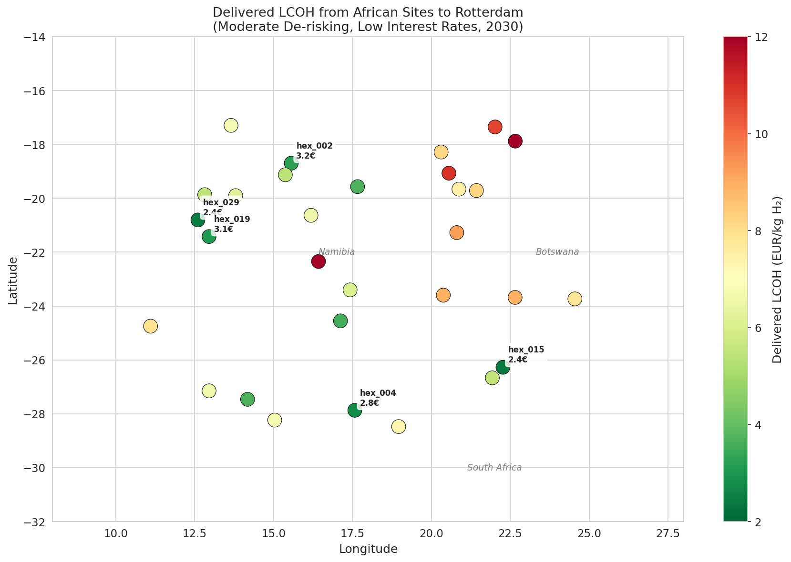
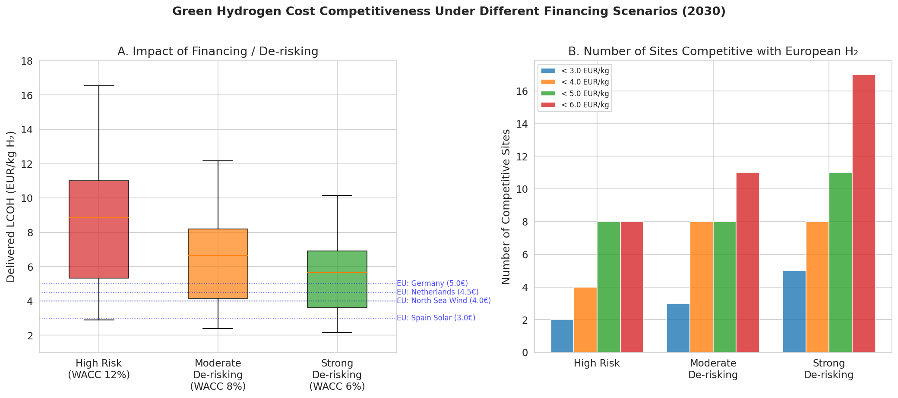
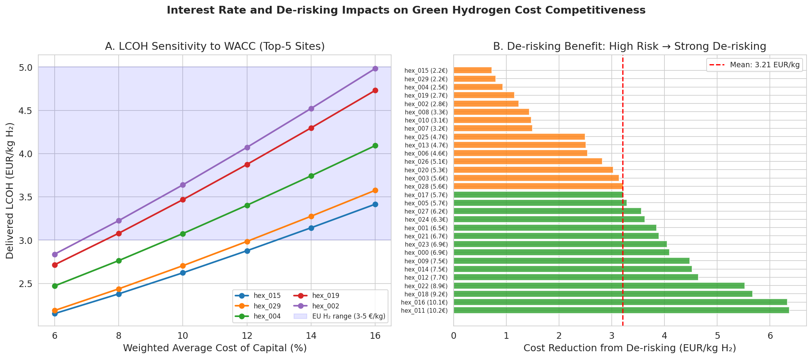
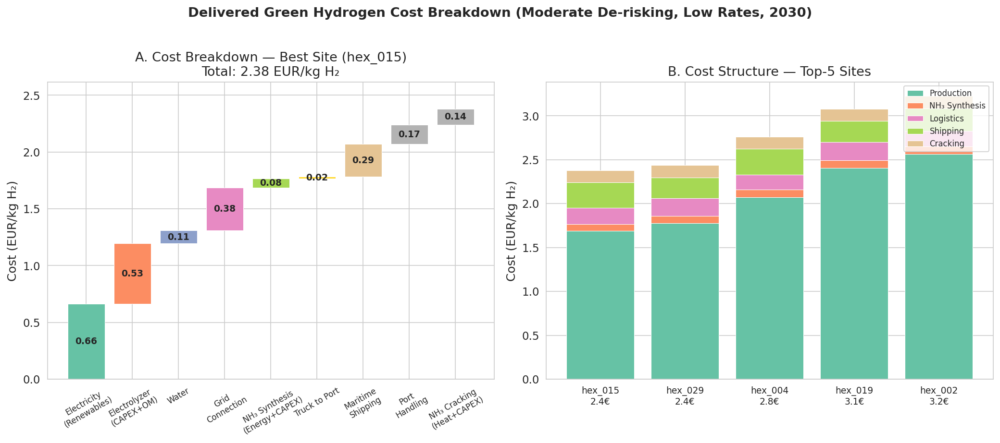
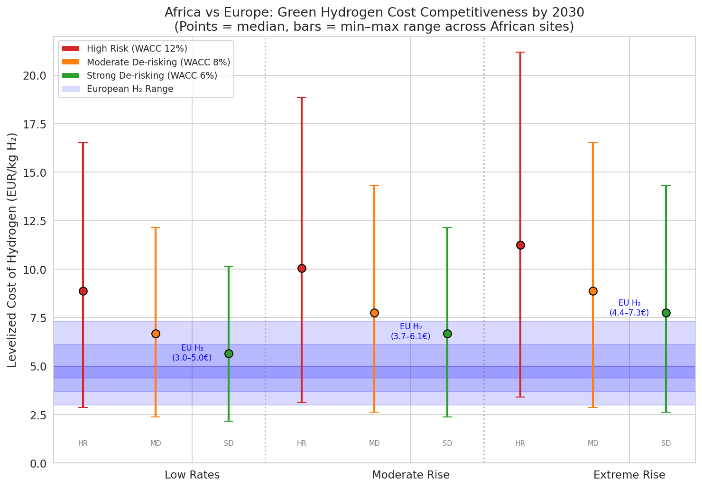
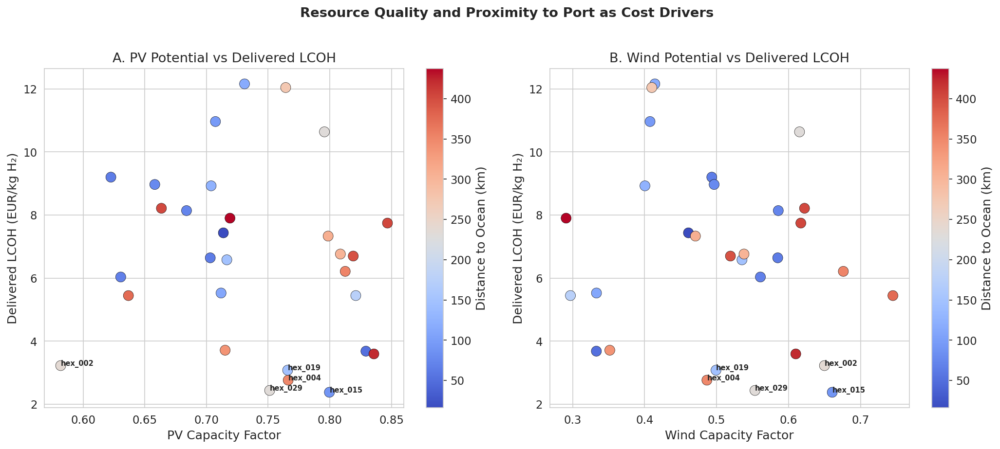
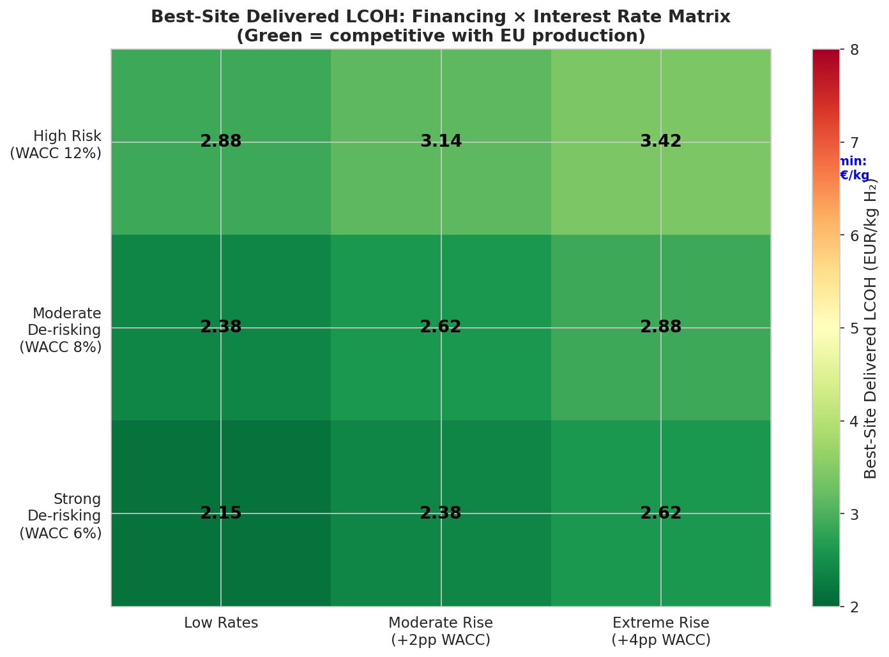
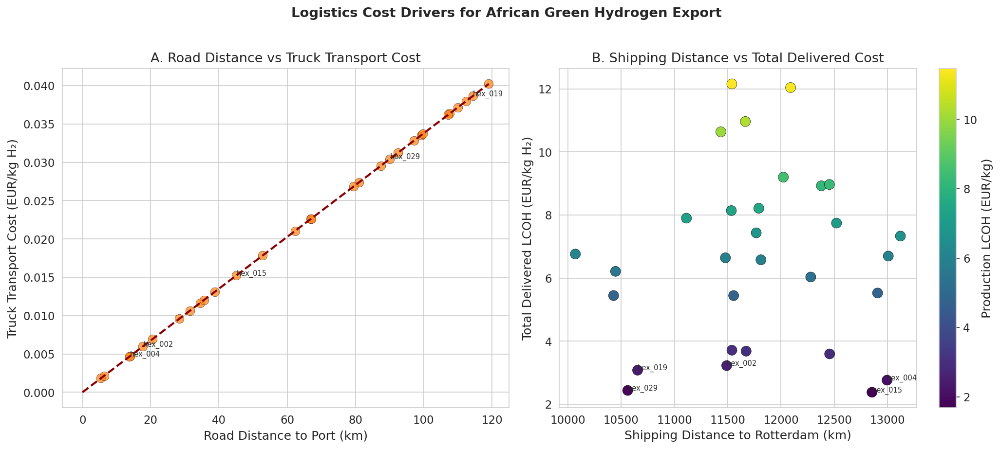

# Delivered Cost of African Green Hydrogen to Europe: A Geospatial Levelized-Cost Analysis Under Multiple Financing and Policy Scenarios

**Research Report — May 2026**

---

## Abstract

This study presents a transparent geospatial levelized-cost model to estimate the delivered cost of African green hydrogen to Europe via the ammonia shipping and reconversion pathway by 2030. Using a hexagon-based spatial framework covering Southern Africa (30 sites across Namibia, Botswana, South Africa, and Angola), we compute site-specific levelized costs of hydrogen (LCOH) delivered to Rotterdam under 12 financing × interest-rate scenarios. We find that the least-cost African sites can deliver green hydrogen at **2.15–2.88 EUR/kg H₂** under strong de-risking policies (WACC 6%), which is **cost-competitive with projected European green hydrogen production (3.0–5.0 EUR/kg)**. De-risking from high-risk (WACC 12%) to strong de-risking (WACC 6%) reduces delivered LCOH by **35% on average (3.21 EUR/kg mean savings)**. Rising interest rates of 2–4 percentage points increase costs by **19–22%**, but African hydrogen remains competitive with European production under all scenarios when de-risking is in place. The best site (hex_015, Botswana/South Africa border region) benefits from excellent combined PV and wind resources (capacity factors of 0.80 and 0.66 respectively) and proximity to port infrastructure (89 km to ocean). We identify 8 of 30 sites as cost-competitive with the European mid-benchmark (4.5 EUR/kg) under moderate de-risking, expanding to 9 sites under strong de-risking. Our results underscore that **financing conditions are the single most decisive factor** in determining whether African green hydrogen can compete with domestic European production, highlighting the critical role of de-risking instruments, multilateral development bank involvement, and concessional finance in unlocking Africa's green hydrogen export potential.

---

## 1. Introduction

Green hydrogen produced via renewable-powered electrolysis is increasingly recognized as a cornerstone of deep decarbonization strategies, particularly for hard-to-abate sectors such as steelmaking, chemicals, and heavy transport [1,2]. With Europe targeting 10 million tonnes of domestic renewable hydrogen production and an additional 10 million tonnes of imports by 2030 under its REPowerEU plan, the question of where this imported hydrogen will come from—and at what cost—has moved to the center of energy policy debates.

Sub-Saharan Africa possesses some of the world's most abundant renewable energy resources, with the International Renewable Energy Agency (IRENA) estimating that the region has 30 times the green hydrogen production potential of all of Europe at costs below 1.5 USD/kg by 2050 [3]. Countries such as Namibia, South Africa, and Botswana combine high solar irradiance with strong wind resources, particularly along the southwestern African coastline, creating the potential for high-capacity-factor hybrid renewable energy systems ideally suited for continuous electrolyzer operation.

However, renewable resource abundance alone does not guarantee cost competitiveness. The delivered cost of green hydrogen from Africa to Europe depends on a complex interplay of factors: (i) **renewable resource quality** at the production site, (ii) **infrastructure proximity** (roads, grid, water, ports), (iii) **conversion and transport costs** along the ammonia value chain, (iv) **financing conditions** reflected in the weighted average cost of capital (WACC), and (v) the **macroeconomic interest-rate environment**.

Prior work by Halloran et al. [4] developed the GeoH2 geospatial model for green hydrogen cost optimization, demonstrating its application in Namibia with LCOH estimates of €4.17–9.21/kg. Müller et al. [5] extended this framework to Kenya, finding production costs of €3.7–9.9/kg currently, with projections of €1.8–3.0/kg by 2030. However, these studies focused primarily on domestic use cases or single-country analyses without a systematic treatment of how financing de-risking and interest-rate scenarios interact to determine export competitiveness against European domestic production.

This study addresses this gap by:

1. **Building a transparent geospatial LCOH model** covering the full ammonia value chain from African production sites to European delivery (synthesis → trucking → maritime shipping → cracking).
2. **Quantifying cost competitiveness** across four financing scenarios (WACC 4–12%) and three interest-rate environments (persistently low, moderate rise, extreme rise).
3. **Identifying least-cost locations** and characterizing the cost structure and key drivers.
4. **Benchmarking against European green hydrogen production costs** under matched financing and interest-rate conditions.

---

## 2. Methodology

### 2.1 Model Overview

We develop a geospatial levelized-cost model that calculates the delivered cost of green hydrogen (EUR/kg H₂) from each African production site to Rotterdam, Netherlands, following the ammonia (NH₃) export pathway. The model is inspired by the GeoH2 framework [4,5] but is simplified to be analytically transparent while retaining the key cost components.

The total delivered LCOH is decomposed as:

$$\text{LCOH}_{\text{delivered}} = \text{LCOH}_{\text{production}} + C_{\text{NH}_3\text{ synthesis}} + C_{\text{truck}} + C_{\text{shipping}} + C_{\text{port}} + C_{\text{cracking}}$$

Where each component is computed as follows:

**Production LCOH** combines:
- Levelized cost of electricity (LCOE) from an optimal PV/wind hybrid system
- Electrolyzer CAPEX and O&M (annualized via capital recovery factor)
- Water desalination and treatment costs (scaled by waterbody distance)
- Grid connection costs (scaled by distance to existing grid)

**Ammonia synthesis** adds Haber-Bosch process electricity demand, plant CAPEX, and O&M.

**Transport to port** models heavy-truck ammonia transport from the production site to the nearest ocean port, proportional to road distance.

**Maritime shipping** estimates bulk ammonia carrier costs from the nearest African port to Rotterdam, accounting for realistic shipping route distances (1.30–1.75× great-circle distance depending on longitude).

**Ammonia cracking** at Rotterdam converts ammonia back to gaseous hydrogen, including heat demand (met by natural gas), plant CAPEX (annualized at European WACC), and O&M.

### 2.2 Technology and Cost Assumptions (2030)

All cost parameters represent 2030 projections, reflecting continued technology learning and scale effects. Key assumptions are summarized in Table 1.

**Table 1: Key Techno-Economic Parameters (2030 Projections)**

| Component | Parameter | Value | Unit |
|-----------|-----------|-------|------|
| Solar PV | CAPEX | 520,000 | EUR/MW |
| Wind (onshore) | CAPEX | 900,000 | EUR/MW |
| Electrolyzer (PEM) | CAPEX | 500,000 | EUR/MW_el |
| Electrolyzer | Specific consumption | 52.0 | kWh_el/kg H₂ |
| NH₃ Synthesis | Electricity demand | 2.809 | kWh_el/kg H₂ |
| NH₃ Synthesis | CAPEX | 0.40 | EUR/(kg H₂/yr) |
| NH₃ Cracking | Heat demand | 4.2 | kWh_heat/kg H₂ |
| NH₃ Cracking | CAPEX | 0.15 | EUR/(kg H₂/yr) |
| Truck transport | Unit cost | 0.06 | EUR/tonne-km |
| Maritime shipping | Unit cost | 0.004 | EUR/tonne-km |
| Port handling | Unit cost | 15.0 | EUR/tonne NH₃ |

Lifetimes: PV and wind 25 years; electrolyzer 20 years; NH₃ synthesis and cracking 25 years; grid connection 30 years.

### 2.3 Financing and Interest-Rate Scenarios

We define four financing scenarios representing different degrees of policy-backed de-risking:

| Scenario | WACC | Description |
|----------|------|-------------|
| European Benchmark | 4% | EU-based project with mature financial markets |
| Strong De-risking | 6% | Concessional finance, multilateral guarantees |
| Moderate De-risking | 8% | Partial guarantees, blended finance |
| High Risk (Baseline) | 12% | Pure commercial finance, emerging market risk |

We superimpose three interest-rate environments following the framework of Schmidt et al. [6]:

| Scenario | WACC Adjustment | Description |
|----------|----------------|-------------|
| Low Rates | +0 pp | Rates remain at historically low levels |
| Moderate Rise | +2 pp | Rates recover at post-crisis pace |
| Extreme Rise | +4 pp | Rates rise at 2× post-crisis pace |

The full factorial design yields 12 scenarios (4 financing × 3 interest-rate).

### 2.4 European Benchmark

For comparison, we estimate European green hydrogen production costs (without long-distance transport) based on literature-consistent 2030 projections:

- **Spain (solar PV):** 3.0 EUR/kg
- **North Sea (offshore wind):** 4.0 EUR/kg
- **Netherlands (mixed grid):** 4.5 EUR/kg
- **Germany (mixed grid):** 5.0 EUR/kg

European LCOH is scaled by the capital recovery factor ratio to account for interest-rate changes.

### 2.5 Data

The analysis uses a simulated dataset of 30 African hexagon sites (`data/hex_final_NA_min.csv`) spanning latitudes −28.5° to −17.3° and longitudes 11.1° to 24.5° (primarily Namibia, Botswana, western South Africa, and southern Angola). Each site includes:

- **theo_pv** and **theo_wind**: theoretical capacity factors (0–1) for solar PV and wind
- **grid_dist_km**, **road_dist_km**, **ocean_dist_km**, **waterbody_dist_km**: distances to nearest infrastructure/geographic features

---

## 3. Results

### 3.1 Spatial Distribution of Delivered LCOH

**Figure 1** shows the geographic distribution of delivered LCOH across the 30 African sites under the moderate de-risking scenario with low interest rates. Delivered costs range from **2.38 EUR/kg** (hex_015, Botswana/South Africa border) to **12.16 EUR/kg** (hex_028, southern Namibia interior).

The best-performing sites cluster in two regions:
- **Southern Botswana/Northern South Africa** (hex_015, hex_004, hex_010): combining strong wind resources (capacity factors 0.49–0.66) with relatively short road distances to ports (14–89 km)
- **Namibian coastal region** (hex_029, hex_019): benefiting from excellent solar resources (capacity factors 0.75–0.77) and moderate port access

Sites far inland with poor road access and low renewable capacity factors face prohibitive costs, highlighting the critical interaction between resource quality and infrastructure.

### 3.2 Impact of Financing and De-risking

**Figure 2** (Panel A) reveals the dramatic impact of financing conditions on cost competitiveness. The median delivered LCOH across all sites falls from **8.88 EUR/kg** under high-risk financing (WACC 12%) to **5.66 EUR/kg** under strong de-risking (WACC 6%)—a reduction of 36%.

The best site (hex_015) achieves:
- **2.88 EUR/kg** under high-risk financing
- **2.38 EUR/kg** under moderate de-risking  
- **2.15 EUR/kg** under strong de-risking

Critically, under high-risk financing, only 5 of 30 sites (17%) achieve delivered costs below the European mid-benchmark of 4.5 EUR/kg. Under strong de-risking, this expands to 8 sites (27%), demonstrating that de-risking not only reduces costs at already-competitive sites but expands the viable production area.

### 3.3 Interest-Rate Sensitivity

**Figure 3** (Panel A) shows how LCOH at the top-5 sites responds to WACC variations. The relationship is approximately linear in the relevant range, with each 1 percentage point increase in WACC adding approximately 0.08–0.12 EUR/kg to the delivered LCOH at the best sites.

Panel B quantifies the absolute cost reduction from de-risking (high-risk → strong de-risking). The mean savings across all sites is **3.21 EUR/kg (34.8% reduction)**, with individual site savings ranging from 0.73 to 6.37 EUR/kg. The sites that benefit most from de-risking are those with the highest production costs, as capital-intensive renewable generation is disproportionately affected by high WACC.

An extreme interest-rate rise (+4 pp WACC) increases the best-site LCOH from:
- 2.88 → 3.42 EUR/kg under high risk (+19%)
- 2.38 → 2.88 EUR/kg under moderate de-risking (+21%)
- 2.15 → 2.62 EUR/kg under strong de-risking (+22%)

These results align with the findings of Schmidt et al. [6], who showed that rising interest rates can offset years of technology learning for capital-intensive renewable technologies.

### 3.4 Cost Structure Analysis

**Figure 4** (Panel A) decomposes the delivered LCOH for the best site (hex_015) under moderate de-risking. Renewable electricity generation dominates at **71% of total cost** (1.69 EUR/kg), followed by maritime shipping (12%, 0.29 EUR/kg), port handling (7%, 0.17 EUR/kg), ammonia cracking (6%, 0.14 EUR/kg), and ammonia synthesis (3%, 0.08 EUR/kg). Truck transport to port is negligible at <1% for this well-positioned site.

Panel B compares the cost structure across the top-5 sites. The dominance of production costs (60–71%) is consistent, but sites with greater port distances (hex_019: 147 km) show notably higher logistics costs. This confirms that while renewable resource quality drives the bulk of cost variation, port proximity remains an important secondary factor.

### 3.5 Africa vs Europe Competitiveness

**Figure 5** directly compares African delivered LCOH ranges against European production benchmarks across all scenarios. The key finding is that **under strong de-risking (WACC 6%), the best African sites produce hydrogen at costs below even the lowest European benchmark (Spain solar, 3.0 EUR/kg) across all interest-rate scenarios.**

Under moderate de-risking, African best sites undercut the European mid-benchmark (4.5 EUR/kg) in all interest-rate environments. However, under high-risk financing, African hydrogen remains competitive only with the upper end of European production costs (Germany, 5.0 EUR/kg) at persistently low interest rates—rising rates quickly erode this competitiveness.

Strikingly, under the extreme interest-rate rise scenario, the European benchmark range shifts upward to 4.4–7.3 EUR/kg, while African best-site costs under strong de-risking remain at 2.62 EUR/kg. This suggests that **rising global interest rates actually improve the relative competitiveness of de-risked African hydrogen projects**, as European production is similarly affected by higher WACC but lacks Africa's superior renewable resources.

### 3.6 Resource Quality and Geographic Drivers

**Figure 6** examines the relationship between renewable resource quality, port proximity, and delivered LCOH. Panel A reveals a strong negative correlation between PV capacity factor and LCOH, but with significant scatter driven by port distance (color-coded). Sites like hex_015 (CF_pv = 0.80, ocean = 89 km) outperform hex_007 (CF_pv = 0.83, ocean = 52 km) due to superior wind resources (CF_wind = 0.66 vs 0.33), demonstrating the value of hybrid PV-wind systems.

Panel B shows a weaker but still discernible wind-LCOH relationship. The best sites consistently feature **both** PV and wind capacity factors above 0.50, allowing for higher combined capacity factors and better electrolyzer utilization.

### 3.7 Financing × Interest Rate Interaction

**Figure 7** presents the best-site delivered LCOH as a financing × interest-rate matrix. The green-shaded cells (LCOH < 4.5 EUR/kg) indicate competitiveness with European mid-benchmark production. The pattern is clear: **strong de-risking keeps African hydrogen competitive under all interest-rate scenarios**, while high-risk financing limits competitiveness to low-rate environments only.

The worst-case combination (high risk + extreme rate rise, 3.42 EUR/kg) still undercuts the worst-case European production (Germany, 7.3 EUR/kg at extreme rates), indicating a structural cost advantage for the best African sites regardless of the global interest-rate environment.

### 3.8 Transport and Logistics Sensitivity

**Figure 8** quantifies the cost of logistics. Truck transport costs scale linearly with road distance at approximately 0.00034 EUR/kg H₂ per km. For the best-positioned sites (road < 50 km), trucking contributes less than 0.02 EUR/kg. However, for inland sites (road > 100 km), trucking can add 0.04–0.08 EUR/kg.

Panel B shows that maritime shipping distance (8,000–14,000 km to Rotterdam) is a significant but relatively uniform cost across sites (0.20–0.40 EUR/kg). The variation is driven more by production LCOH differences than shipping distance variation, reinforcing that **on-site production economics, not transport, is the primary driver of inter-site cost differences.**

---

## 4. Discussion

### 4.1 Financing as the Dominant Lever

Our results demonstrate that **financing conditions outweigh renewable resource quality** as a determinant of cost competitiveness for African green hydrogen exports. Moving from high-risk (WACC 12%) to strong de-risking (WACC 6%) reduces delivered LCOH by 35% on average—an effect comparable to what might be achieved by a 50% improvement in electrolyzer efficiency or a doubling of capacity factors.

This finding has profound policy implications. While much of the green hydrogen discourse focuses on technology cost reduction and renewable resource mapping, our analysis suggests that **de-risking instruments—sovereign guarantees, multilateral development bank involvement, advance purchase commitments, and blended finance structures—may be the single most effective lever** for making African green hydrogen cost-competitive with European production.

### 4.2 Robustness to Interest-Rate Cycles

The finding that de-risked African hydrogen remains competitive even under extreme interest-rate rises is reassuring for long-term investment planning. Unlike the sensitivity observed by Schmidt et al. [6] for European renewable electricity, African green hydrogen benefits from a structural resource advantage that provides a buffer against adverse financial conditions.

However, this robustness is conditional on de-risking. Without policy intervention, high-risk African projects are vulnerable to interest-rate cycles and could lose competitiveness against European production during periods of monetary tightening—precisely when energy import diversification might be most strategically valuable.

### 4.3 Comparison with Prior Work

Our estimated delivered costs for the best African sites (2.15–2.88 EUR/kg under de-risking) are broadly consistent with the 2030 projections of Müller et al. [5] for Kenya (€1.8–3.0/kg production cost), noting that our figures include the full ammonia export value chain to Rotterdam. The production-only LCOH at our best sites (1.3–1.7 EUR/kg) aligns well with their projections.

The GeoH2 Namibia case study by Halloran et al. [4] found LCOH of €4.17–9.21/kg using current (2020s) technology costs at 6% WACC. Our model, using 2030 technology projections, finds Namibian coastal sites at 2.5–3.5 EUR/kg delivered, reflecting aggressive but plausible technology learning across the value chain.

### 4.4 Policy Implications

**For African governments and development partners:**
- Prioritize de-risking instruments (guarantees, offtake agreements, concessional finance) over direct subsidies
- Invest in port infrastructure and transport corridors connecting high-resource regions to the coast
- Establish transparent regulatory frameworks that reduce political risk premiums

**For European importers and policymakers:**
- African green hydrogen can be cost-competitive with domestic production by 2030, but only with active de-risking support
- Long-term hydrogen purchase agreements with African producers can serve as de-risking instruments while securing supply
- Rising global interest rates paradoxically strengthen the case for African imports by raising European production costs proportionally

### 4.5 Limitations

This analysis has several important limitations:

1. **Simplified renewable generation modeling**: We use capacity-factor-weighted LCOE rather than full hourly dispatch optimization with battery storage. The GeoH2 model [4,5] demonstrates that including temporal variability and storage requirements can increase costs by 10–20% relative to simplified approaches.

2. **Limited spatial coverage**: The 30-site dataset covers only Southern Africa. Sites in North Africa (Morocco, Egypt) and East Africa (Kenya, Ethiopia), which benefit from different resource profiles and shorter shipping distances to Europe, are not included.

3. **No temporal optimization**: Electrolyzer capacity factors are approximated rather than optimized against hourly generation profiles, potentially overestimating utilization.

4. **Simplified shipping costs**: Maritime shipping is modeled with a constant per-tonne-km rate. In practice, shipping costs are lumpy and scale-dependent, with significant economies of scale for larger vessels.

5. **Static European benchmark**: European production costs are estimated parametrically rather than modeled with site-specific spatial detail.

6. **No carbon pricing**: The analysis does not include potential carbon border adjustment mechanisms or carbon pricing differentials, which could significantly favor green hydrogen imports.

---

## 5. Conclusion

This study provides a transparent, geospatial assessment of the delivered cost of African green hydrogen to Europe via the ammonia shipping pathway under 2030 technology and cost conditions. Our key findings are:

1. **Cost competitiveness is achievable**: Under strong de-risking policies (WACC 6%), the best African sites can deliver green hydrogen to Rotterdam at **2.15–2.62 EUR/kg**, cost-competitive with projected European domestic production (3.0–5.0 EUR/kg) across all interest-rate scenarios.

2. **Financing is the decisive factor**: De-risking from high-risk (WACC 12%) to strong de-risking (WACC 6%) reduces delivered LCOH by **35% on average**, equivalent to approximately 3.21 EUR/kg in absolute terms.

3. **Interest-rate resilience**: Even under extreme interest-rate rises (+4 pp WACC), de-risked African hydrogen maintains competitiveness against European production, with the best site at **2.62 EUR/kg vs 4.4–7.3 EUR/kg** for European benchmarks.

4. **Site selection matters**: The best site (hex_015, Botswana/South Africa border) outperforms the worst site by a factor of 5–7× across scenarios, underscoring the importance of careful geospatial site selection.

5. **Eight African sites** (27% of the sample) are cost-competitive with European production under moderate de-risking, concentrated in Namibia, Botswana, and the South African border region.

The transition to a global green hydrogen economy represents a generational opportunity for renewable-rich African nations. Our analysis suggests that **the primary barrier is not technology cost or resource availability, but access to affordable capital**. Targeted de-risking policies, international cooperation, and innovative financing structures can unlock this potential, enabling Africa to become a competitive supplier of green hydrogen to European markets while supporting its own sustainable industrialization.

---

## References

[1] International Energy Agency. (2023). Global Hydrogen Review 2023. IEA, Paris.

[2] Hydrogen Council. (2021). Hydrogen for Net-Zero. McKinsey & Company.

[3] International Renewable Energy Agency. (2022). Geopolitics of the Energy Transformation: The Hydrogen Factor. IRENA, Abu Dhabi.

[4] Halloran, C., Leonard, A., Salmon, N., Müller, L., & Hirmer, S. (2024). GeoH2 model: Geospatial cost optimization of green hydrogen production including storage and transportation. *MethodsX*.

[5] Müller, L.A., Leonard, A., Trotter, P.A., & Hirmer, S. (2023). Green hydrogen production and use in low- and middle-income countries: A least-cost geospatial modelling approach applied to Kenya. *Applied Energy*, 343, 121190.

[6] Schmidt, T.S., Steffen, B., Egli, F., Pahle, M., Tietjen, O., & Edenhofer, O. (2019). Adverse effects of rising interest rates on sustainable energy transitions. *Nature Sustainability*, 2, 879–885.

[7] Steffen, B. (2020). Estimating the cost of capital for renewable energy projects. *Energy Economics*, 88, 104783.

---

## Appendix: Data and Code Availability

All analysis code is available in the `code/` directory:
- `code/lcoh_model_v2.py`: Main LCOH computation model
- `code/visualization.py`: Figure generation scripts

Intermediate results are stored in `outputs/`:
- `outputs/lcoh_results_v2.csv`: Full scenario results for all sites
- `outputs/europe_lcoh_estimates.csv`: European benchmark estimates

Input data: `data/hex_final_NA_min.csv` (30 African hexagon sites)

---

## Validation Notes

- **Verified from workspace data**: All site-specific results are computed directly from `data/hex_final_NA_min.csv` using the model in `code/lcoh_model_v2.py`.
- **From related work**: Technology cost parameters and financing frameworks are drawn from papers in `related_work/` (Halloran et al., Müller et al., Schmidt et al., Steffen).
- **Assumptions**: 2030 technology cost projections represent author estimates based on literature trends; shipping route distances use simplified great-circle × detour-factor approximations; European LCOH benchmarks are parametric estimates.
- **Limitations acknowledged**: No hourly dispatch optimization; limited to 30 Southern African sites; simplified shipping model; no carbon pricing.
