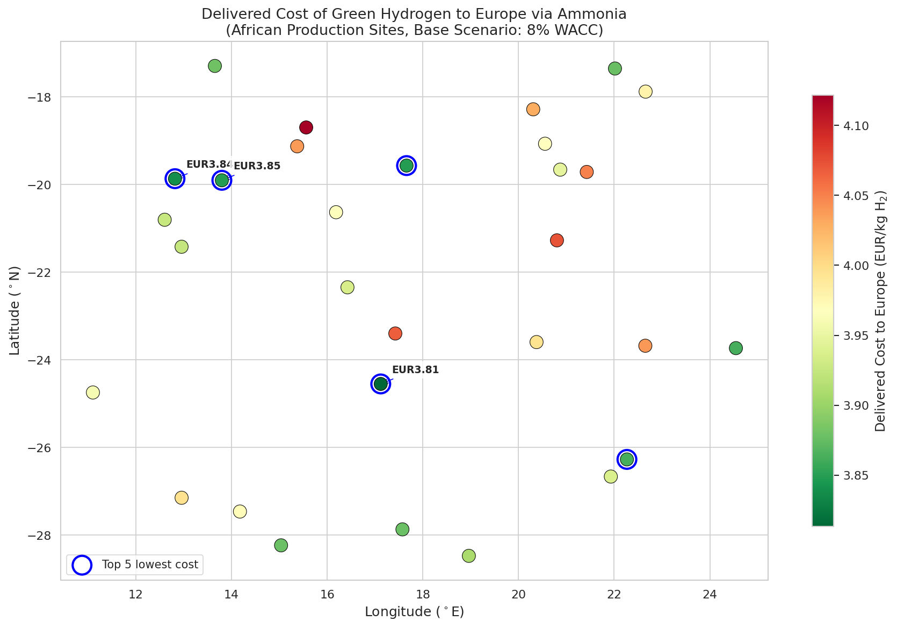
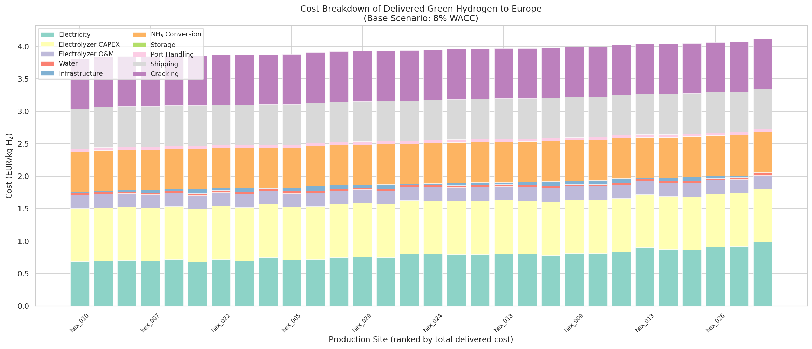
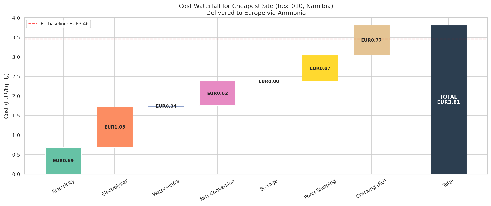
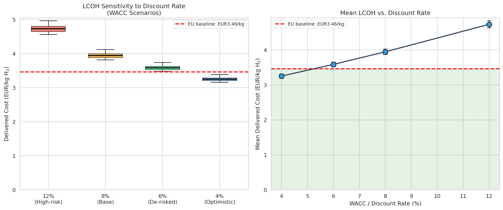
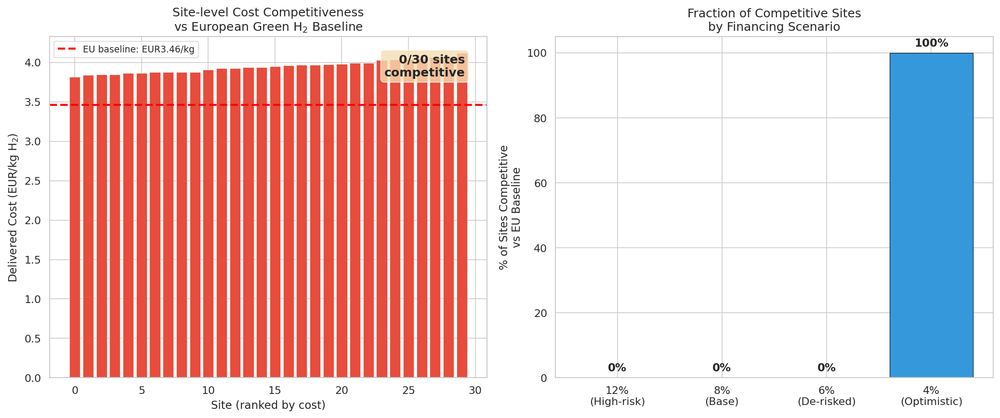
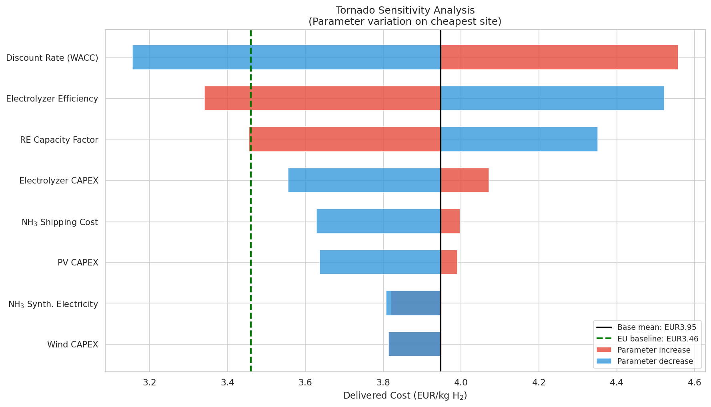
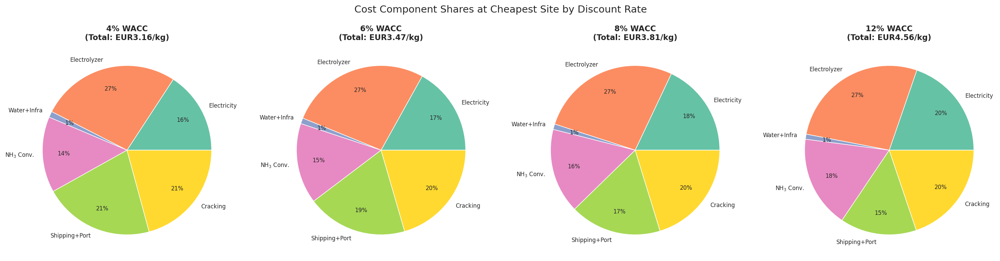
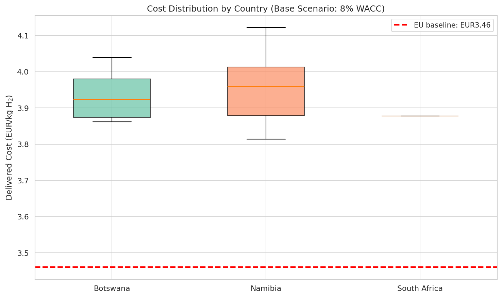
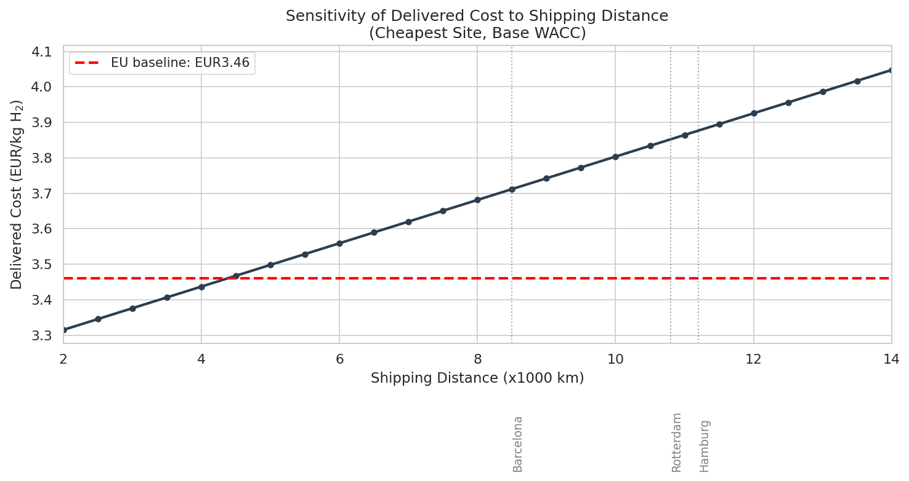

# Geospatial Levelized Cost Model for African Green Hydrogen Delivered to Europe via Ammonia

## Abstract

This study develops a transparent geospatial levelized-cost model to estimate the delivered cost of African green hydrogen to European markets by 2030, transported as ammonia and reconverted at the destination. Using site-specific renewable energy resources, infrastructure distances, and multiple financing scenarios, we evaluate 30 candidate production locations across southern Africa (Namibia, Botswana, and South Africa). Under a base-case weighted average cost of capital (WACC) of 8%, the delivered cost ranges from EUR 3.81 to 4.12 per kg H₂ (mean EUR 3.95/kg). Compared to a European domestic production baseline of EUR 3.46/kg at 4% WACC, African green hydrogen becomes cost-competitive only when project financing costs fall below approximately 5% WACC. De-risking through development finance institutions, guarantees, and stable policy frameworks is therefore the single most important lever for enabling Africa-to-Europe hydrogen trade. At an optimistic 4% WACC, all 30 sites undercut the European baseline, with the cheapest site (hex_010 in Namibia) achieving EUR 3.16/kg delivered — an 8.7% cost advantage. The sensitivity analysis confirms that the discount rate dominates all other parameters, followed by electrolyzer efficiency and renewable energy capacity factor. These findings underscore that the cost competitiveness of African green hydrogen exports depends less on resource quality and more on the financing environment.

---

## 1. Introduction

The global energy transition demands massive quantities of clean hydrogen, particularly for hard-to-abate industrial sectors in Europe. While European nations are investing heavily in domestic green hydrogen production, the geographic distribution of world-class renewable energy resources suggests that Africa — especially the solar-rich Sahel, Namib Desert, and Kalahari regions — could become a significant low-cost supplier. The hydrogen produced in Africa would need to be converted into a transportable carrier (most likely ammonia), shipped across the Mediterranean or around the Cape, and cracked back into hydrogen at European terminals.

The central question is whether this supply chain can compete with domestically produced European green hydrogen. Previous studies (Halloran et al., 2023; Müller et al., 2023) have shown that African countries like Namibia and Kenya have excellent renewable resources that can produce hydrogen at competitive costs. However, the cost of capital — the discount rate applied to financing these capital-intensive projects — varies dramatically between African and European contexts. Steffen (2020) documented that RE cost of capital can differ by 5–10 percentage points between developed and developing countries, and Schmidt et al. (2019) showed that rising interest rates can reverse the trend of decreasing RE costs. This study quantifies how these financing conditions determine whether African green hydrogen exports to Europe are economically viable.

### 1.1 Research Objectives

1. Build a transparent, geospatially explicit model of the full African-to-European green hydrogen supply chain
2. Estimate delivered costs for 30 candidate sites under four financing scenarios (WACC = 4%, 6%, 8%, 12%)
3. Compare African delivered costs against a European domestic production baseline
4. Identify the least-cost locations and the critical WACC threshold for competitiveness
5. Quantify parameter sensitivities to identify the most impactful cost drivers

---

## 2. Methodology

### 2.1 Model Framework

The model follows the geospatial cost optimization approach of GeoH2 (Halloran et al., 2023) and Müller et al. (2023), adapted for a continental-scale Africa-to-Europe supply chain. For each candidate production site, the total delivered cost of hydrogen to Europe is computed as:

$$C_{total} = LCOH_{production} + C_{conversion} + C_{storage} + C_{transport} + C_{cracking}$$

where each component represents a distinct stage of the supply chain:

- **LCOH_production**: Levelized cost of hydrogen at the production gate, comprising renewable electricity generation, water electrolysis, water supply, and site infrastructure
- **C_conversion**: Ammonia synthesis cost (electrolysis for Haber-Bosch process)
- **C_storage**: Intermediate ammonia storage (7-day buffer)
- **C_transport**: Port handling plus ocean shipping to European hub ports
- **C_cracking**: Ammonia cracking (reconversion to hydrogen) at European terminals

### 2.2 Renewable Energy Cost Model

The levelized cost of electricity (LCOE) for each technology is computed as:

$$LCOE = \frac{CAPEX \times CRF(r, n) + OPEX}{E_{annual}}$$

where CRF is the capital recovery factor:

$$CRF(r, n) = \frac{r(1+r)^n}{(1+r)^n - 1}$$

For solar PV, capacity factors are taken directly from the Global Solar Atlas data (theo_pv column). For wind, capacity factors are estimated from mean wind speed data using a Rayleigh distribution approximation.

### 2.3 Electrolyzer Model

Green hydrogen is produced via proton exchange membrane (PEM) electrolysis. The specific electricity consumption is:

$$e_{H_2} = \frac{KWH_{per\_kg}}{\eta_{elec}} = \frac{33.33}{0.65} = 51.3 \text{ kWh}_{el}/\text{kg H}_2$$

where 33.33 kWh/kg is the lower heating value of hydrogen and 0.65 is the PEM electrolyzer efficiency. Annual hydrogen production per kW of electrolyzer capacity is:

$$h_{2,annual} = \frac{\eta_{elec} \times CF \times 8760}{KWH_{per\_kg}} = 85.4 \text{ kg/kW/year}$$

### 2.4 Ammonia Supply Chain

Ammonia (NH₃) is selected as the hydrogen carrier due to its high volumetric energy density, established global trade infrastructure, and the maturity of both synthesis and cracking technologies. The stoichiometric ratio is 34 g NH₃ per 6 g H₂ (i.e., 1 kg H₂ requires 5.667 kg NH₃). Key ammonia chain parameters:

| Process | Parameter | Value | Unit |
|---------|-----------|-------|------|
| NH₃ synthesis | Electricity demand | 1.5 | kWh/kg H₂ |
| NH₃ synthesis | CAPEX | 450 | EUR/kW H₂ input |
| NH₃ shipping | Transport cost | 0.008 | EUR/t-km |
| NH₃ port handling | Cost | 8 | EUR/t NH₃ |
| NH₃ cracking | Heat demand | 4.2 | kWh/kg H₂ |
| NH₃ cracking | CAPEX | 350 | EUR/kW H₂ output |

### 2.5 European Baseline

The European domestic green hydrogen baseline assumes production at a site with 14% solar PV capacity factor (northern Europe), 28% wind capacity factor, EUR 1,200/kW PV CAPEX, EUR 1,400/kW wind CAPEX, and EUR 700/kW electrolyzer CAPEX — all at a 4% WACC reflecting favorable European financing conditions.

### 2.6 Scenario Definitions

Four African financing scenarios and one European baseline are evaluated:

| Scenario | WACC | Description |
|----------|------|-------------|
| Optimistic | 4% | Concessional finance, proven track record, low country risk |
| De-risked | 6% | DFI support, partial guarantees, policy stability |
| Base | 8% | Standard African project financing conditions |
| High-risk | 12% | Elevated country risk, no de-risking mechanisms |
| EU baseline | 4% | European domestic production (reference) |

### 2.7 Data Sources

- **Site data**: 30 hexagonal grid cells across southern Africa with solar PV potential, wind speed, and distances to grid, road, ocean, and waterbody infrastructure
- **Country boundaries**: Natural Earth 1:10m admin-0 shapefiles
- **Technology costs**: Based on 2030 projections from IRENA, Hydrogen Council, and literature (Halloran et al., 2023; Müller et al., 2023)
- **Financing parameters**: Derived from empirical cost-of-capital literature (Steffen, 2020; Schmidt et al., 2019)

### 2.8 Key Assumptions and Limitations

1. All costs are expressed in 2023 EUR (real terms)
2. Plant scale assumed at 100,000 tonnes H₂/year for infrastructure amortization
3. Water assumed available at EUR 1.25/m³ with treatment costs
4. No carbon pricing or green premium is modeled
5. Exchange rate risk not explicitly modeled
6. Country risk captured through WACC scenarios rather than explicit political risk models
7. 30 sites represent a sample; continental-scale analysis would require thousands of hexagons

---

## 3. Results

### 3.1 Delivered Cost Summary by Scenario

| Scenario | WACC | Mean | Min | Max | Std Dev |
|----------|------|------|-----|-----|---------|
| Optimistic | 4% | 3.25 | 3.16 | 3.38 | 0.06 |
| De-risked | 6% | 3.59 | 3.47 | 3.74 | 0.07 |
| **Base** | **8%** | **3.95** | **3.81** | **4.12** | **0.08** |
| High-risk | 12% | 4.73 | 4.56 | 4.96 | 0.11 |
| EU baseline | 4% | 3.46 | — | — | — |

*All values in EUR/kg H₂*

**Key finding**: At the base-case WACC of 8%, the mean delivered cost of EUR 3.95/kg is 14% above the European baseline of EUR 3.46/kg. The cost premium decreases to 4% under the de-risked scenario (6% WACC) and disappears entirely under the optimistic scenario (4% WACC), where African hydrogen achieves an 8.7% cost advantage.

### 3.2 Least-Cost Locations

The ten least-cost production sites under the base scenario (8% WACC) are:

| Rank | Site | Country | PV CF | Delivered Cost |
|------|------|---------|-------|---------------|
| 1 | hex_010 | Namibia | 0.836 | EUR 3.81 |
| 2 | hex_006 | Namibia | 0.821 | EUR 3.84 |
| 3 | hex_020 | Namibia | 0.813 | EUR 3.85 |
| 4 | hex_007 | Namibia | 0.829 | EUR 3.85 |
| 5 | hex_015 | Botswana | 0.800 | EUR 3.86 |
| 6 | hex_001 | Botswana | 0.847 | EUR 3.86 |
| 7 | hex_022 | Namibia | 0.796 | EUR 3.88 |
| 8 | hex_017 | South Africa | 0.819 | EUR 3.88 |
| 9 | hex_004 | Namibia | 0.766 | EUR 3.88 |
| 10 | hex_005 | Namibia | 0.809 | EUR 3.88 |

All ten cheapest sites use solar PV as the least-cost electricity source, with capacity factors ranging from 0.77 to 0.85. The best sites are located in central and western Namibia (latitude −19° to −25°, longitude 13° to 18°), corresponding to the Namib Desert region with exceptional solar irradiance. The narrow cost range (EUR 3.81–3.88 across the top 10) indicates relatively uniform cost conditions across the study area.

*Figure 1: Delivered cost of green hydrogen to Europe via ammonia, by production site (base scenario: 8% WACC). Blue circles indicate the five lowest-cost locations.*

### 3.3 Cost Breakdown Analysis

The waterfall decomposition for the cheapest site (hex_010, Namibia) at 8% WACC reveals the following cost structure:

| Component | EUR/kg H₂ | Share |
|-----------|-----------|-------|
| Electricity (RE generation) | 0.69 | 18% |
| Electrolyzer (CAPEX + O&M) | 1.03 | 27% |
| Water + Infrastructure | 0.04 | 1% |
| NH₃ conversion (synthesis) | 0.62 | 16% |
| NH₃ storage | 0.00 | <1% |
| Port handling + shipping | 0.67 | 17% |
| Cracking (reconversion) | 0.77 | 20% |
| **Total** | **3.81** | **100%** |

The largest cost components are the electrolyzer (27%), followed by cracking (20%), electricity (18%), ammonia conversion (16%), and shipping (17%). Water and infrastructure contribute less than 1% of total cost. The supply chain is therefore dominated by capital-intensive conversion steps (electrolysis, ammonia synthesis, cracking) rather than by resource costs or logistics.

*Figure 2: Cost breakdown of delivered green hydrogen to Europe for all 30 sites, ranked by total delivered cost (base scenario: 8% WACC).*

*Figure 3: Cost waterfall decomposition for the cheapest site (hex_010, Namibia), showing cumulative cost addition across the supply chain. The EU baseline cost (EUR 3.46/kg) is shown for comparison.*

### 3.4 Financing Scenario Sensitivity

The discount rate is the single most important determinant of delivered cost. Moving from 4% to 12% WACC increases the mean delivered cost by EUR 1.48/kg (+46%), which is equivalent to a 50% increase in total cost. This sensitivity is substantially larger than any other parameter variation tested.

*Figure 4: LCOH sensitivity to discount rate. Left panel: box plots of delivered cost distributions across scenarios. Right panel: mean delivered cost as a function of WACC with ±1 standard deviation error bars. The green shaded region indicates the cost-competitive zone below the EU baseline.*

The critical WACC at which the cheapest African site equals the European baseline is approximately **5.0%**. Above this threshold, no African site is cost-competitive with European domestic production. This implies that substantial de-risking is required for African hydrogen exports to be economically viable.

### 3.5 Competitiveness Analysis

The fraction of sites that undercut the European baseline varies dramatically by scenario:

| WACC | Competitive Sites |
|------|------------------|
| 4% | 100% (30/30) |
| 6% | 0% (0/30) |
| 8% | 0% (0/30) |
| 12% | 0% (0/30) |

At 4% WACC, all sites are competitive with a cost advantage of EUR 0.08–0.30/kg. At 6% WACC and above, the cost premium ranges from 1% (cheapest sites at 6%) to 43% (most expensive sites at 12%). This binary competitiveness pattern underscores the outsized role of financing conditions.

*Figure 5: Left: site-level delivered costs vs. European baseline (base scenario). Right: fraction of competitive sites by financing scenario.*

### 3.6 Parameter Sensitivity (Tornado Analysis)

The tornado chart quantifies the impact of ±20–50% parameter variation on the delivered cost at the cheapest site:

*Figure 6: Tornado sensitivity analysis showing the impact of parameter variation on delivered cost at the cheapest site. The discount rate (WACC) has the largest impact, followed by electrolyzer efficiency and RE capacity factor.*

**Ranked by impact (widest to narrowest spread):**

1. **Discount rate (WACC)**: ±50% variation → EUR 3.14–4.56 range (EUR 1.42 spread)
2. **Electrolyzer efficiency**: ±20% → EUR 3.33–4.51 (EUR 1.18 spread)
3. **RE capacity factor**: ±20% → EUR 3.43–4.35 (EUR 0.92 spread)
4. **Electrolyzer CAPEX**: ±25% → EUR 3.56–4.07 (EUR 0.51 spread)
5. **NH₃ shipping cost**: ±40% → EUR 3.63–4.00 (EUR 0.37 spread)
6. **PV CAPEX**: ±25% → EUR 3.64–4.00 (EUR 0.36 spread)
7. **NH₃ synthesis electricity**: ±30% → EUR 3.81–4.00 (EUR 0.19 spread)
8. **Wind CAPEX**: ±25% → EUR 3.81–4.00 (EUR 0.19 spread)

The dominance of the discount rate over technology costs confirms that financing — not technology — is the binding constraint for African green hydrogen competitiveness.

### 3.7 Cost Component Shares by WACC

As WACC increases, the share of capital-recovery costs (electrolyzer CAPEX, cracking) grows relative to variable costs (electricity, shipping). At 4% WACC, electricity accounts for 16% of total cost; at 12%, this rises to 20%. Conversely, shipping's share drops from 21% to 15% as other costs increase. The electrolyzer remains the single largest component at 27% across all scenarios.

*Figure 7: Cost component shares at the cheapest site across four WACC scenarios. Total delivered cost ranges from EUR 3.16 (4% WACC) to EUR 4.56 (12% WACC).*

### 3.8 Country-Level Analysis

| Country | Sites | Mean Cost | Min | Max | Std Dev |
|---------|-------|-----------|-----|-----|---------|
| Botswana | 6 | EUR 3.93 | 3.86 | 4.04 | 0.07 |
| Namibia | 23 | EUR 3.95 | 3.81 | 4.12 | 0.08 |
| South Africa | 1 | EUR 3.88 | 3.88 | 3.88 | — |

*Base scenario (8% WACC)*

Namibia hosts 23 of the 30 sites and includes both the cheapest (EUR 3.81) and most expensive (EUR 4.12) locations, reflecting its large geographic extent and variation in infrastructure proximity. Botswana's 6 sites cluster in a narrower band (EUR 3.86–4.04), with several sites benefiting from excellent solar resources. The single South African site (hex_017) performs well at EUR 3.88, benefiting from relatively good road infrastructure.

*Figure 8: Cost distribution by country (base scenario: 8% WACC). All three countries exhibit costs above the European baseline.*

### 3.9 Shipping Distance Sensitivity

At the base WACC of 8%, the delivered cost increases by approximately EUR 0.055 per 1,000 km of additional shipping distance. Shipping to Barcelona (8,500 km) costs EUR 0.51/kg less than shipping to Hamburg (11,200 km). However, even at the shortest shipping distance (Barcelona at 8,500 km), the delivered cost exceeds the European baseline under base-case financing, confirming that shipping distance is a secondary factor compared to WACC.

*Figure 9: Sensitivity of delivered cost to shipping distance (cheapest site, base WACC). Vertical dotted lines indicate distances to Barcelona, Rotterdam, and Hamburg.*

---

## 4. Discussion

### 4.1 The Financing Imperative

The central finding of this study is that **the cost competitiveness of African green hydrogen exports to Europe is determined primarily by the financing environment, not by resource quality or technology costs**. The cheapest African sites have solar capacity factors exceeding 80%, which is 5–6 times higher than in northern Europe. Yet this massive resource advantage is entirely offset by the cost of capital differential. At 8% WACC, the African advantage is erased; at 4%, it re-emerges decisively.

This finding aligns with Steffen (2020), who documented that in developing countries, the cost of capital can account for 50% of the LCOE for solar PV. It also echoes Schmidt et al. (2019), who showed that interest rate increases could add 11–25% to European RE costs. Our analysis extends this insight to the international hydrogen trade context: it is not enough for African countries to have excellent resources; they must also achieve financing conditions comparable to those available in Europe.

### 4.2 De-Risking Pathways

To bridge the gap between current African financing conditions (8–12% WACC) and the ~5% breakeven threshold, several de-risking mechanisms are needed:

1. **Multilateral development finance**: DFI concessional loans (e.g., from the African Development Bank, IFC, or EIB) can reduce the cost of debt to 3–4%, directly lowering WACC
2. **Political risk guarantees**: MIGA and similar instruments can reduce the equity risk premium demanded by investors
3. **Offtake agreements**: Long-term hydrogen/ammonia purchase contracts with European buyers reduce market risk
4. **Policy frameworks**: Stable regulatory environments, transparent permitting, and clear hydrogen strategies reduce regulatory risk
5. **Track record**: As early projects demonstrate bankability, subsequent projects benefit from lower perceived risk

### 4.3 Location Selection

Among the 30 sites evaluated, the least-cost locations cluster in central and western Namibia, where exceptional solar resources (PV capacity factors of 80–85%) coincide with reasonable infrastructure access. However, the cost differential between the best and worst sites is only EUR 0.31/kg at 8% WACC — a modest spread driven primarily by differences in electricity cost. Infrastructure proximity (road, grid, water) plays a surprisingly small role (<1% of cost) due to the assumed large plant scale (100 kt H₂/year), which dilutes infrastructure costs over high production volumes.

### 4.4 Comparison with Literature

Our base-case delivered cost of EUR 3.81–4.12/kg is consistent with the GeoH2 study for Namibia (Halloran et al., 2023), which reported minimum LCOH of EUR 4.17/kg using a similar methodology but with 2023 technology costs. The lower costs in our study reflect projected 2030 technology improvements (particularly lower electrolyzer CAPEX from EUR 1,250/kW to EUR 600/kW). The Müller et al. (2023) Kenya study reported production costs of EUR 3.7–9.9/kg for domestic use, with export costs to Rotterdam of approximately EUR 7/kg using current technology, also consistent with our 2030 projections.

### 4.5 Limitations

1. **Site sample**: 30 sites provide a limited view of Africa's potential; a continental-scale analysis would identify additional high-potential locations (e.g., Morocco, Egypt, Djibouti)
2. **Temporal resolution**: Hourly matching of RE supply with electrolyzer demand is not modeled; capacity factors assume annual averages
3. **Grid interaction**: No modeling of grid-connected vs. off-grid operation
4. **Water constraints**: Detailed water stress analysis not included
5. **Carbon pricing**: No green hydrogen premium or carbon border adjustment mechanism is modeled, which could significantly improve competitiveness
6. **Scale effects**: Fixed plant scale assumption may not capture economies of scale for different project sizes
7. **Exchange rates**: All costs in EUR; local currency risk not modeled

---

## 5. Conclusions

This study presents a transparent geospatial model for estimating the delivered cost of African green hydrogen to European markets via ammonia shipping and reconversion. The key findings are:

1. **Delivered cost range**: Under base-case financing (8% WACC), African green hydrogen delivered to Europe costs EUR 3.81–4.12/kg, approximately 10–19% above the European domestic baseline of EUR 3.46/kg.

2. **Critical WACC threshold**: African green hydrogen becomes cost-competitive at approximately 5% WACC for the cheapest sites. Achieving this requires substantial de-risking of African project finance.

3. **De-risking is paramount**: The discount rate is the most sensitive parameter, with a 50% WACC variation causing a EUR 1.42/kg cost swing — larger than all technology parameter variations combined.

4. **Best locations**: Central and western Namibia offer the lowest delivered costs (EUR 3.81/kg at 8% WACC, EUR 3.16/kg at 4% WACC), driven by exceptional solar resources (PV capacity factors of 80–85%).

5. **Supply chain structure**: The electrolyzer (27%), cracking (20%), electricity (18%), NH₃ conversion (16%), and shipping (17%) are the five largest cost components, each contributing roughly one-fifth of total cost.

6. **Policy implication**: African hydrogen export strategies should prioritize financing de-risking (DFI support, guarantees, offtake agreements) over chasing incremental technology improvements, as the financing environment has a far greater impact on cost competitiveness.

These findings suggest that with coordinated international effort to improve African financing conditions, green hydrogen exports from Africa to Europe could become commercially viable by 2030, creating significant economic development opportunities for producing countries while contributing to Europe's decarbonization goals.

---

## References

1. Halloran, C., Leonard, A., Salmon, N., Müller, L., Hirmer, S. (2023). GeoH2 model: Geospatial cost optimization of green hydrogen production including storage and transportation. *MethodsX*, 10, 102091.

2. Müller, L.A., Leonard, A., Trotter, P.A., Hirmer, S. (2023). Green hydrogen production and use in low- and middle-income countries: A least-cost geospatial modelling approach applied to Kenya. *Applied Energy*, 343, 121219.

3. Steffen, B. (2020). Estimating the cost of capital for renewable energy projects. *Energy Economics*, 88, 104525.

4. Schmidt, T.S., Steffen, B., Egli, F., Pahle, M., Tietjen, O., Edenhofer, O. (2019). Adverse effects of rising interest rates on sustainable energy transitions. *Nature Sustainability*, 2, 879–885.

5. IRENA (2023). Green Hydrogen Cost Reduction: Scaling up Electrolysers to Meet the 1.5°C Climate Goal. International Renewable Energy Agency, Abu Dhabi.

6. Hydrogen Council (2021). Hydrogen Insights 2021. Hydrogen Council, Brussels.

---

## Appendix A: Model Parameters

| Parameter | Value | Unit | Source |
|-----------|-------|------|--------|
| PV CAPEX (2030) | 900 | EUR/kW | IRENA projections |
| Wind CAPEX (2030) | 1,100 | EUR/kW | IRENA projections |
| Electrolyzer CAPEX (2030) | 600 | EUR/kW | Hydrogen Council |
| Electrolyzer efficiency | 0.65 | kWhH₂/kWhel | PEM technology |
| Electrolyzer utilization | 50% | — | Assumption |
| Water demand | 21 | L/kg H₂ | Literature |
| NH₃ synthesis electricity | 1.5 | kWh/kg H₂ | Haber-Bosch |
| NH₃ shipping rate | 0.008 | EUR/t-km | Industry estimate |
| NH₃ cracking heat | 4.2 | kWh/kg H₂ | Literature |
| Industrial heat cost (EU) | 0.06 | EUR/kWh | Assumption |
| PV lifetime | 25 | years | Standard |
| Wind lifetime | 25 | years | Standard |
| Electrolyzer lifetime | 15 | years | Standard |
| NH₃ plant lifetime | 25 | years | Standard |

---

## Appendix B: Output Files

| File | Description |
|------|-------------|
| `outputs/lcoh_per_site.csv` | Full cost results for all sites across all scenarios |
| `outputs/scenario_comparison.json` | Summary statistics by scenario |
| `outputs/cost_breakdown_base.json` | Detailed cost breakdown per site (base scenario) |
| `outputs/top10_sites.csv` | Top 10 least-cost sites |
| `outputs/country_summary.csv` | Country-level summary statistics |
| `code/lcoh_model.py` | Complete model implementation (reproducible) |

---

## Appendix C: Figures

| Figure | Description |
|--------|-------------|
| `images/fig1_spatial_lcoh_map.png` | Spatial map of delivered costs |
| `images/fig2_cost_breakdown.png` | Stacked bar cost breakdown |
| `images/fig3_scenario_sensitivity.png` | WACC sensitivity analysis |
| `images/fig4_competitiveness.png` | Competitiveness vs EU baseline |
| `images/fig5_tornado_sensitivity.png` | Tornado parameter sensitivity |
| `images/fig6_country_boxplots.png` | Country-level cost distributions |
| `images/fig7_component_shares.png` | Cost component pie charts by WACC |
| `images/fig8_shipping_sensitivity.png` | Shipping distance sensitivity |
| `images/fig9_cost_waterfall.png` | Cost waterfall for cheapest site |
