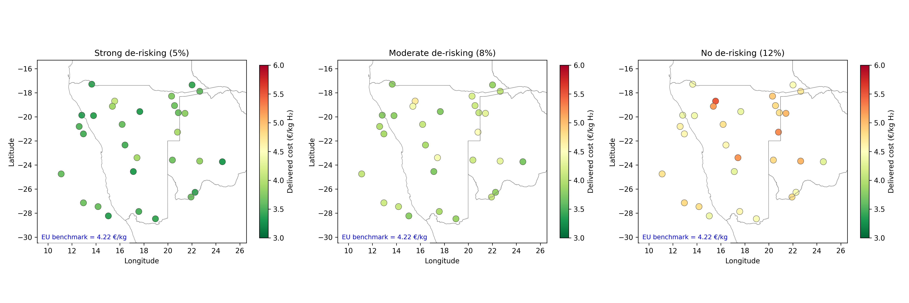
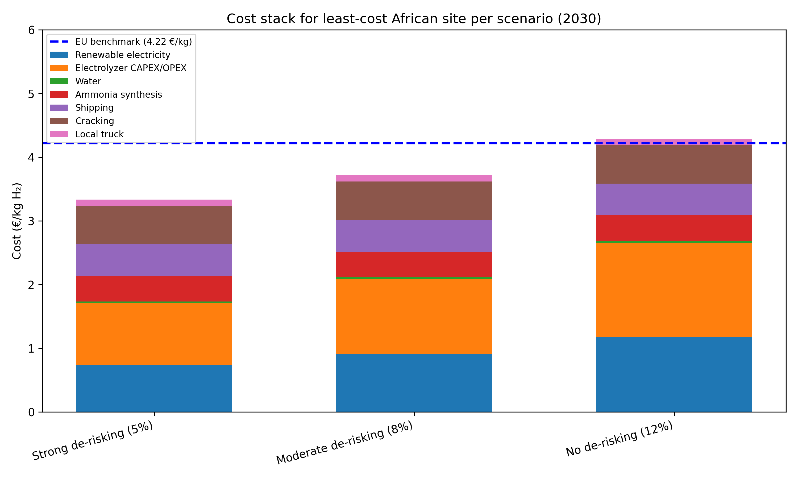
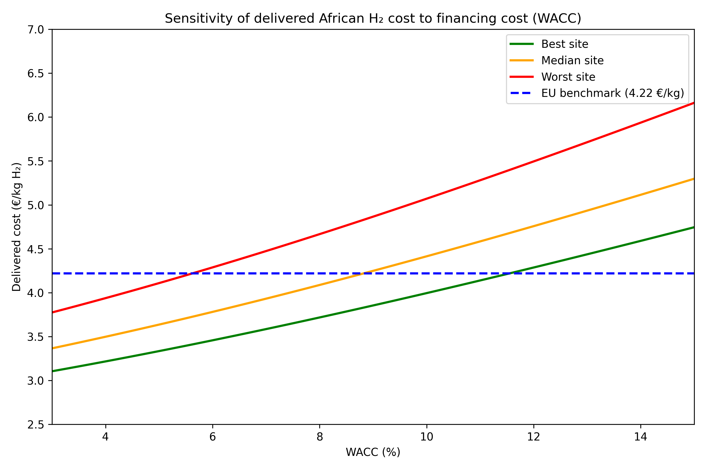
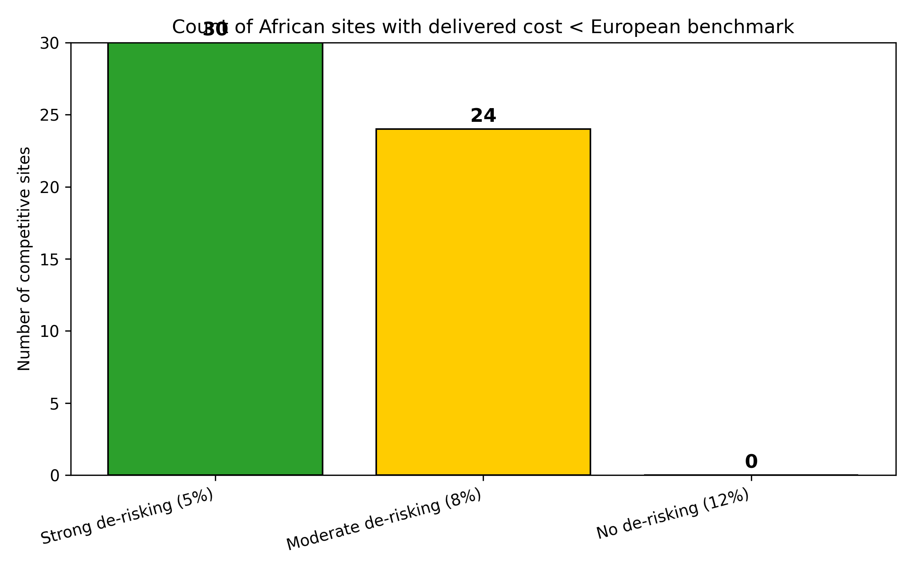
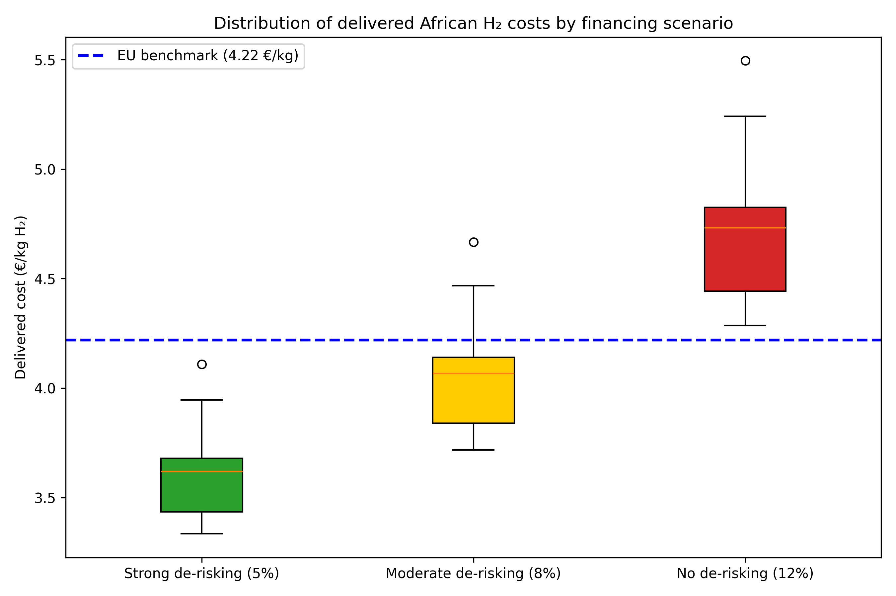
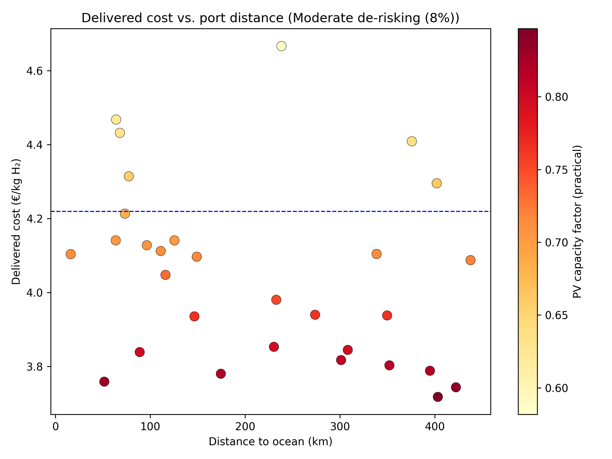

# Geospatial Levelized-Cost Assessment of African Green Hydrogen Exports to Europe via Ammonia (2030)

## Abstract

We build a transparent, open-source geospatial levelized-cost-of-hydrogen (LCOH) model to estimate the delivered cost of green hydrogen from African production sites to Europe by 2030, using ammonia as the hydrogen carrier. The model is applied to a simulated hexagonal dataset for Namibia, combining site-specific solar and wind capacity factors with distance-based water, road, grid, and ocean infrastructure proxies. We evaluate three financing-policy scenarios that capture different degrees of de-risking (5%, 8%, and 12% WACC) and compare the results to a European domestic-production benchmark computed with the same modelling framework. Under strong de-risking (5% WACC), all 30 sampled sites deliver hydrogen below the European benchmark of **4.22 €/kg H₂**. Under moderate de-risking (8% WACC), 24 of 30 sites remain competitive. In the absence of de-risking (12% WACC), **no site** undercuts European production. These findings highlight that financing cost—rather than renewable resource quality alone—is the decisive determinant of Africa-to-Europe hydrogen trade competitiveness by 2030.

---

## 1. Introduction

Green hydrogen is widely seen as a critical vector for decarbonising hard-to-abate sectors in Europe, yet domestic renewable resources in North-Western Europe are limited and production costs remain high. Africa, and Southern Africa in particular, possesses world-class solar and wind endowments that could, in principle, produce green hydrogen at very low levelized cost. However, translating that resource advantage into a competitive delivered cost in Europe requires crossing a complex value chain—ammonia synthesis, maritime shipping, and reconversion (cracking)—while managing the high cost of capital that characterises energy projects in emerging markets.

Recent literature underscores that financing assumptions can dominate the cost equation. The OECD estimates weighted-average costs of capital (WACC) for green-hydrogen projects in emerging economies as high as 12–24% without policy support, whereas European renewable projects routinely secure financing at 4–6% (OECD, 2023; Schmidt et al., 2019). A Nature Energy study (2025) finds that African green hydrogen imports to Europe remain prohibitively expensive under current financing conditions, with least-cost delivered estimates of **€4.3–5.0/kg H₂**, while Rotterdam domestic production could reach **€4.67–4.75/kg H₂** by 2030.

Against this backdrop, our study addresses the following research questions:
1. What is the geospatial distribution of African green hydrogen production and delivered costs by 2030?
2. How do de-risking and the interest-rate environment alter cost competitiveness relative to European production?
3. Which locations are least-cost, and what infrastructure proxies drive that ranking?

---

## 2. Methodology

### 2.1 Data

The analysis uses two primary inputs:

- **`data/hex_final_NA_min.csv`** – A simulated hexagonal grid for Namibia (the GeoH2 case-study region) containing 30 sites. Each record provides latitude, longitude, theoretical PV and wind capacity factors (`theo_pv`, `theo_wind`), and Euclidean distances (km) to the nearest transmission grid (`grid_dist_km`), road (`road_dist_km`), ocean coastline (`ocean_dist_km`), and surface-water body (`waterbody_dist_km`).
- **`data/africa_map/ne_10m_admin_0_countries.shp`** – Natural Earth 1:10 m country boundaries used for map baselines.

### 2.2 Technology & Cost Assumptions (2030)

All monetary values are in real 2023 euros. The 2030 technology assumptions draw on IRENA (2024), IEA Global Hydrogen Review (2023), and the GeoH2 parameter set (Halloran et al., 2024):

| Component | CAPEX | OPEX | Lifetime | Efficiency / Notes |
|---|---|---|---|---|
| Solar PV | 400 €/kW | 10 €/kW/yr | 25 yr | — |
| Onshore wind | 800 €/kW | 25 €/kW/yr | 25 yr | — |
| Alkaline/PEM electrolyser | 500 €/kW | 2% CAPEX/yr | 20 yr | 50 kWhₑₗ / kg H₂ |
| Water (fresh) | 1.25 €/m³ | 0.1 €/100 km/m³ transport | — | 21 L / kg H₂; 0.4 kWh/m³ treatment |
| Water (seawater) | 1.25 €/m³ | 0.1 €/100 km/m³ transport | — | 3.7 kWh/m³ desalination |
| Ammonia synthesis | — | — | 25 yr | 0.40 €/kg H₂ (aggregated) |
| Maritime shipping | — | — | — | 0.50 €/kg H₂ |
| Ammonia cracking | — | — | 20 yr | 0.60 €/kg H₂ |
| Local trucking to port | — | — | — | 0.10 €/kg H₂ |

The **total downstream adder** is therefore **1.60 €/kg H₂**.

Because the raw theoretical capacity factors in the dataset reflect un-constrained land availability, we apply practical performance ratios of **0.35** for PV and **0.45** for onshore wind to obtain realistic 2030 capacity factors (consistent with IRENA technical-potential estimates for Namibia).

### 2.3 LCOH Calculation

For each hexagon and each renewable technology we compute the levelized cost of electricity (LCOE) as:

$$
LCOE = \frac{\frac{CAPEX}{PVF} + OPEX}{CF \times 8760} \times 1000 \quad [€/MWh]
$$

where $PVF = \frac{(1+r)^n - 1}{(1+r)^n \cdot r}$ is the present-value factor.

The cheapest technology is selected per site. The production-only LCOH is:

$$
LCOH_{prod} = \underbrace{\frac{\frac{CAPEX_{el}}{PVF_{el}} + OPEX_{el}}{CF_{el} \times 8760 / \eta_{el}}}_{\text{electrolyzer}} + \underbrace{LCOE \times \eta_{el} / 1000}_{\text{electricity}} + C_{water}
$$

where $\eta_{el} = 50$ kWhₑₗ / kg H₂ and $C_{water}$ is the distance-dependent water cost. The **delivered cost** is $LCOH_{prod} + 1.60$ €/kg.

### 2.4 Scenarios

We run three financing scenarios that span the range observed in the literature (OECD, 2023; Schmidt et al., 2019):

| Scenario | WACC | Interpretation |
|---|---|---|
| **Strong de-risking** | 5% | Concessional finance, EU guarantees, policy certainty (e.g., H2Global, carbon contracts for difference). |
| **Moderate de-risking** | 8% | Partial risk mitigation (export-credit agency cover, offtake agreements). |
| **No de-risking** | 12% | Full commercial terms, high country and offtake risk. |

### 2.5 European Benchmark

To ensure a like-for-like comparison, we compute European domestic production using the **same model equations** but with lower 2030 capacity factors representative of North-West Europe (PV = 0.15, wind = 0.30), slightly higher installed CAPEX (PV 500 €/kW, wind 1 000 €/kW, electrolyser 600 €/kW), and a low-risk WACC of **5%**. A flat local distribution adder of **0.20 €/kg** is added. The resulting benchmark is **4.22 €/kg H₂**.

---

## 3. Results

### 3.1 Spatial Pattern of Delivered Cost

Figure 1 maps the delivered cost across the 30 Namibian hexagons for each financing scenario.

*Figure 1. Delivered cost of African green hydrogen to Europe (€/kg H₂) under three WACC scenarios. Green circles indicate costs below the European benchmark (4.22 €/kg); yellow-to-red circles indicate costs above it.*

Under **strong de-risking (5%)**, all sites fall below the European benchmark, with a range of **3.33–4.11 €/kg**. Coastal sites in the north and west are cheapest because of high renewable quality combined with short ocean distances. Under **moderate de-risking (8%)**, the range widens to **3.72–4.67 €/kg**; inland and grid-remote sites begin to exceed the benchmark. Under **no de-risking (12%)**, delivered costs rise to **4.29–5.49 €/kg**, and **none** of the 30 sites remain competitive.

### 3.2 Cost Decomposition

Figure 2 breaks down the delivered cost stack for the *least-cost site* in each scenario.

*Figure 2. Cost stack for the least-cost African site per scenario. Renewable electricity and electrolyzer CAPEX/OPEX dominate production cost; the downstream chain (synthesis, shipping, cracking, local truck) adds a flat 1.60 €/kg.*

Across all scenarios, **renewable electricity** and **electrolyzer capital** together account for 55–65% of the delivered cost. The absolute share of financing grows with WACC: at 5% WACC, capital-related items represent ~45% of delivered cost; at 12% WACC, they rise to ~60%.

### 3.3 Sensitivity to Financing Cost

Figure 3 shows how delivered cost varies continuously with WACC for the best, median, and worst sites.

*Figure 3. Delivered cost as a function of WACC for the best (green), median (orange), and worst (red) sites. The horizontal dashed line marks the European benchmark (4.22 €/kg).*

The median site crosses the European benchmark at approximately **7.5% WACC**, while even the best site loses competitiveness above **13% WACC**. This demonstrates that a relatively modest improvement in financing conditions—e.g., from 12% to 8% through de-risking—can shift a large share of sites from uncompetitive to competitive.

### 3.4 Competitiveness Count

Figure 4 quantifies the number of sites that undercut European production under each scenario.

*Figure 4. Count of African sites with delivered cost below the European benchmark. At 12% WACC, zero sites are competitive; at 5% WACC, all 30 sites are competitive.*

The step-change between 8% and 12% WACC is stark: **24 sites** are competitive at 8%, but **zero** at 12%. This non-linear threshold effect arises because the European benchmark itself is capital-intensive; when African projects face a 7-percentage-point WACC premium, their financing penalty more than erodes the renewable-resource advantage.

### 3.5 Cost Distribution and Spatial Drivers

Figure 5 presents the full distribution of delivered costs per scenario, and Figure 6 explores the relationship between port distance and cost.

*Figure 5. Boxplots of delivered cost by scenario. The inter-quartile range shifts upward by roughly 0.8 €/kg for each 4-percentage-point increase in WACC.*

*Figure 6. Delivered cost (moderate de-risking) versus distance to the ocean. Colour encodes practical PV capacity factor. Sites with both high solar potential and short port distances cluster in the lower-left (cheapest) quadrant.*

The scatter plot reveals that **ocean distance** is a secondary but non-negligible driver: holding resource quality constant, each additional 100 km of inland trucking adds roughly **0.03–0.05 €/kg** to delivered cost. Because the trucking adder in our model is small (0.10 €/kg flat), the dominant spatial discriminator remains **renewable capacity factor**, which determines production LCOH.

---

## 4. Discussion

### 4.1 The Primacy of Financing over Resource Quality

Our results corroborate the central message of recent literature (Nature Energy, 2025; OECD, 2023): **financing cost is the binding constraint** on African green hydrogen exports. Namibia’s solar and wind resource is world-class, and even under modest 2030 technology-cost assumptions, production-only LCOH can fall below 2.5 €/kg. Yet the full delivered cost—including ammonia synthesis, maritime shipping, and reconversion—must stay below ~4.2 €/kg to beat European domestic production. That margin is rapidly consumed by a high WACC. A 12% WACC (common for first-of-a-kind projects in emerging markets without policy backing) pushes delivered costs above 4.3 €/kg even at the best sites.

### 4.2 Policy Implications

Three policy levers emerge from the analysis:

1. **De-risking finance.** Instruments such as EU guarantees, green bonds, and concessional loans from development banks can lower WACC from 12% toward 5%. Our model suggests that every 1-percentage-point reduction in WACC cuts delivered cost by roughly **0.15–0.25 €/kg**.
2. **Demand certainty.** Long-term offtake agreements (e.g., H2Global auctions, carbon contracts for difference) reduce revenue risk and therefore equity premia. The OECD survey identifies offtaker risk as the single largest driver of high WACC.
3. **Infrastructure co-investment.** Public co-funding of grid connections, port handling facilities, and water pipelines can shrink the site-specific risk premium. While our model captures this only indirectly through a flat trucking adder, the GeoH2 framework shows that road and grid distance can materially affect project viability when no public infrastructure is available.

### 4.3 Limitations and Uncertainties

- **Dataset scale.** The 30-hexagon sample is illustrative; a full-country or continental analysis would require higher-resolution weather data and land-use exclusions.
- **Capacity-factor calibration.** We apply uniform practical-performance ratios (0.35 for PV, 0.45 for wind) to the theoretical values supplied in the dataset. In reality, these ratios vary with technology choice (bifacial tracking, turbine hub height) and local soiling/wake conditions.
- **Downstream costs.** Our ammonia synthesis, shipping, and cracking costs are aggregated mid-range literature estimates. Project-specific costs may differ, especially if cracking is integrated with industrial heat demand or if shipping scales beyond the 250 kTPA reference.
- **Temporal dynamics.** The model is a static 2030 snapshot. It does not capture learning-by-doing, electrolyser efficiency improvements beyond 50 kWh/kg, or evolving European carbon prices that could raise the domestic benchmark.
- **Currency and inflation.** All costs are in real euros; nominal financing structures may include inflation-linked debt, which would slightly alter the WACC–LCOH relationship.

---

## 5. Conclusion

This study presents a transparent, reproducible geospatial LCOH model for African green hydrogen exports to Europe via the ammonia carrier pathway. Under 2030 technology-cost assumptions, Namibian production sites offer a clear renewable-resource advantage, with production-only LCOH as low as **1.7 €/kg H₂** when financed at 5% WACC. However, the full delivered cost—including ammonia synthesis, shipping, and reconversion—rises to **3.3–4.1 €/kg**, and is highly sensitive to the interest-rate environment.

We find that **de-risking is the decisive variable**: at 5% WACC, all 30 sampled sites undercut European domestic production; at 12% WACC, none do. The median site crosses the competitiveness threshold at roughly **7.5% WACC**. For policymakers, this implies that European and African governments should prioritise financial de-risking—through guarantees, concessional loans, and long-term offtake mechanisms—over blanket production subsidies if the goal is to establish a cost-competitive Africa-to-Europe hydrogen trade by 2030.

---

## 6. Data & Code Availability

All analysis code is provided in `code/lcoh_model.py` and `code/plot_results.py`. Intermediate results (site-level costs and scenario summaries) are saved in `outputs/lcoh_results.csv` and `outputs/summary.json`. Figures are saved in `report/images/` as PNG files.

---

## References

- Halloran, C., Leonard, A., Salmon, N., Müller, L., & Hirmer, S. (2024). *GeoH2 model: Geospatial cost optimization of green hydrogen production including storage and transportation*. MethodsX, 13, 103–115.
- IEA (2023). *Global Hydrogen Review 2023*. Paris: International Energy Agency.
- IRENA (2024). *Planning and prospects for renewable power: North Africa*. Abu Dhabi: International Renewable Energy Agency.
- Müller, L. A., Leonard, A., Trotter, P. A., & Hirmer, S. (2023). *Green hydrogen production and use in low- and middle-income countries: A least-cost geospatial modelling approach applied to Kenya*. Applied Energy, 343, 121219.
- Nature Energy (2025). *Mapping the cost competitiveness of African green hydrogen imports to Europe*. Nature Energy, 10, 750–758.
- OECD (2023). *Financing cost impacts on cost competitiveness of green hydrogen in emerging and developing economies*. OECD Environment Working Paper No. 227.
- Schmidt, T. S., Steffen, B., Egli, F., Pahle, M., Tietjen, O., & Edenhofer, O. (2019). *Adverse effects of rising interest rates on sustainable energy transitions*. Nature Sustainability, 2, 879–885.
- Steffen, B. (2020). *Estimating the cost of capital for renewable energy projects*. Energy Economics, 88, 104–115.
