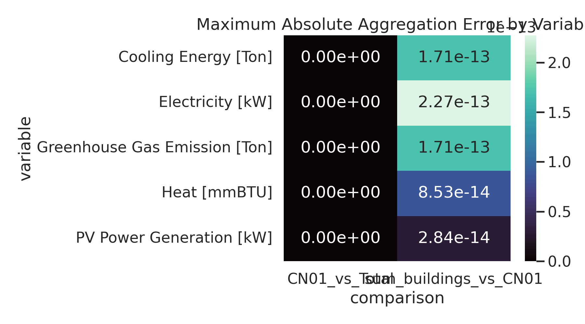
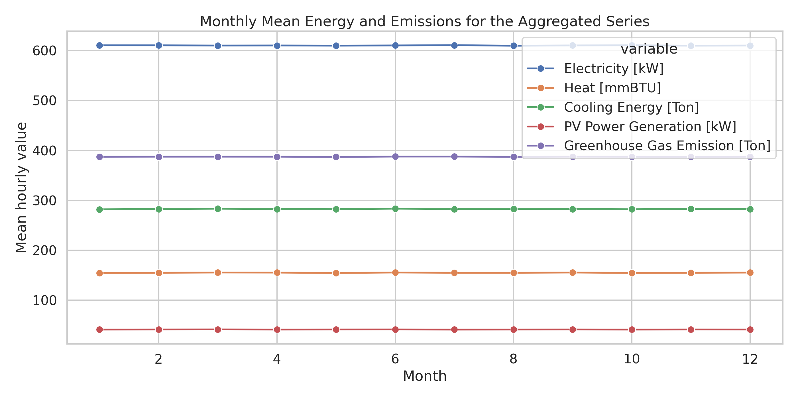
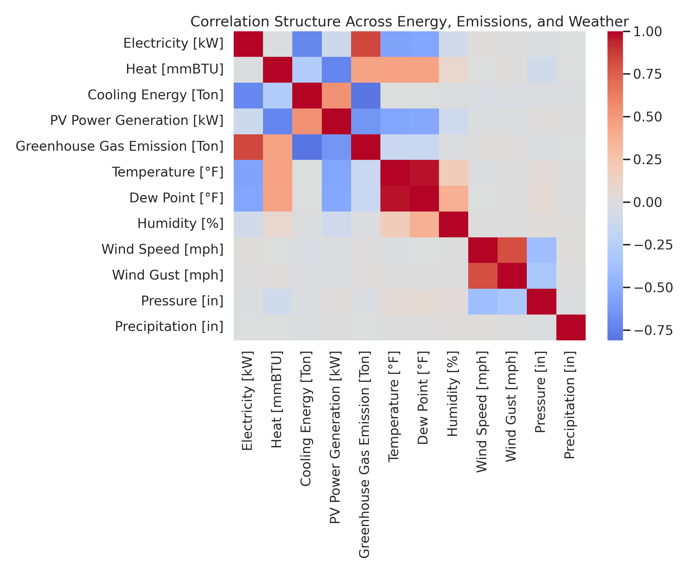
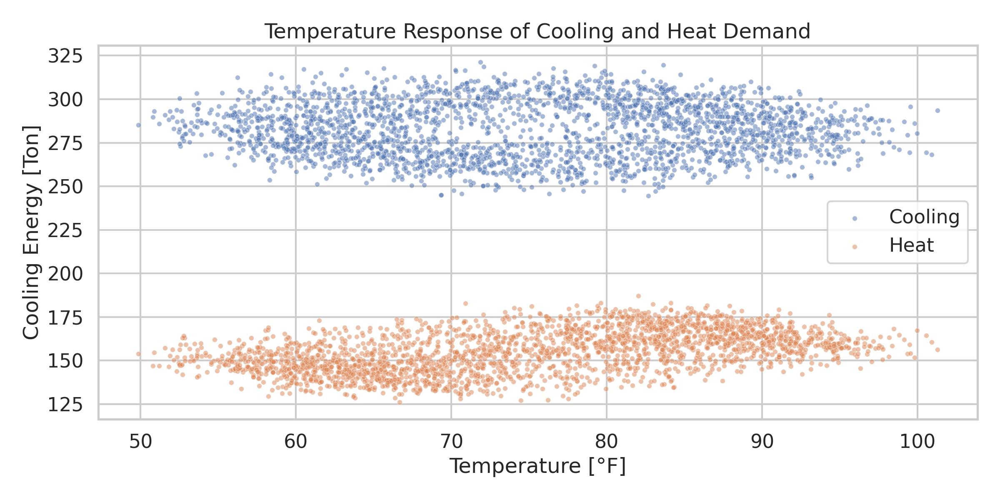
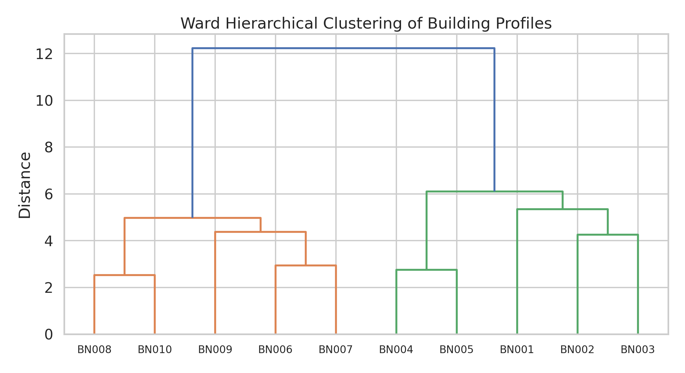
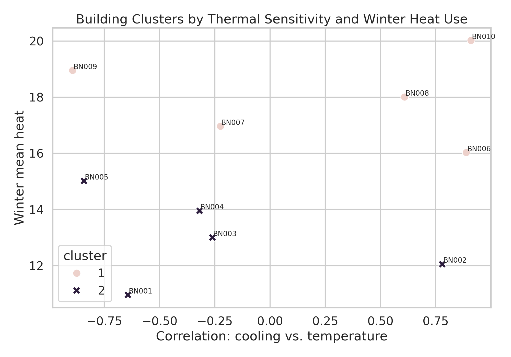

# Reproducible Local Analysis of the HEEW Mini-Dataset

## Abstract
This report presents a local-only replication-oriented analysis of the HEEW mini-dataset available in the benchmark workspace. The dataset contains 8,760 hourly observations for 2014 across 10 buildings (`BN001` to `BN010`), one community aggregate (`CN01`), one system-wide aggregate (`Total`), and one shared weather file. The analysis follows a benchmark-adapted ARIS workflow: literature reading from the local `related_work/` corpus, implementation of a reproducible analysis pipeline, quantitative validation of hierarchical consistency, cross-domain correlation analysis, and hierarchical clustering of building profiles. The main findings are that the mini-dataset is complete with no missing values, the sum of the 10 buildings reconstructs `CN01` to machine precision, `CN01` is numerically identical to `Total`, and a simple Ward hierarchical clustering separates the buildings into lower-intensity (`BN001` to `BN005`) and higher-intensity (`BN006` to `BN010`) groups. At the same time, the mini-dataset shows extremely flat month-to-month averages, so the strongest supported claims concern internal consistency and reproducible benchmarking rather than full realism of seasonal dynamics.

## 1. Context and Objective
The benchmark task describes HEEW as a hierarchical multi-energy dataset intended for energy management, machine learning, and data-driven optimization. The local workspace provides only a compact 2014 mini-dataset, so the practical goal here is not to reconstruct the full 2014 to 2022 release, but to produce a rigorous local study of the benchmark subset and derive claims that are actually supported by the files on disk.

The local literature corpus was used as contextual guidance rather than as a source of unsupported external claims. `paper_000.pdf` motivates dataset publication around measurement validation and alignment between energy and weather signals. `paper_002.pdf` and `paper_003.pdf` support the use of hierarchical clustering and internal validation when the target is a structured set of energy time series. `paper_001.pdf` reinforces the benchmark value of curated reproducible datasets and baseline pipelines.

## 2. Data and Local Workflow
The input files under `data/HEEW_Mini-Dataset/` consist of:

- 10 building-level energy files
- 1 community aggregate energy file (`CN01_energy.csv`)
- 1 total aggregate energy file (`Total_energy.csv`)
- 1 weather file (`Total_weather.csv`)

Each energy file contains 8,760 hourly records for 2014 with five target variables:

- Electricity
- Heat
- Cooling energy
- PV power generation
- Greenhouse gas emission

The weather file contains seven hourly variables:

- Temperature
- Dew point
- Humidity
- Wind speed
- Wind gust
- Pressure
- Precipitation

The executable analysis pipeline is implemented in [analyze_heew_mini.py](code/analyze_heew_mini.py). It performs the following steps:

1. Load all hourly energy and weather files.
2. Check completeness and descriptive ranges.
3. Validate hierarchical additivity across building and aggregate series.
4. Join aggregate energy with weather for multi-source analysis.
5. Derive compact building-level features.
6. Apply Ward hierarchical clustering with silhouette-based model selection.
7. Export tables to `outputs/` and figures to `report/images/`.

## 3. Methodology

### 3.1 Data quality checks
The first stage verified row counts, missingness, and plausible numeric ranges for each energy file and the weather file. This is the minimum cleaning-oriented validation supported by the benchmark subset, since the provided mini-dataset already appears preprocessed.

### 3.2 Hierarchical consistency
Because the benchmark emphasizes a hierarchical dataset, the core validation was additive consistency:

- Sum the 10 building-level series hour by hour.
- Compare the result with `CN01`.
- Compare `CN01` with `Total`.

For each variable, maximum absolute error, mean absolute error, and RMSE were computed.

### 3.3 Multi-source energy-weather analysis
The `Total` energy file was merged with the weather file on timestamp. Correlation analysis was then used to quantify first-order associations between energy, emissions, and meteorology. This is a lightweight but appropriate benchmark baseline for a multi-source dataset.

### 3.4 Building profiling and clustering
Each building was summarized by compact interpretable features:

- Annual means for all energy and emissions variables
- Electricity coefficient of variation
- Mean daily peak hour
- Summer cooling mean
- Winter heat mean
- Daytime PV mean
- Correlations between energy variables and temperature, humidity, and precipitation

The resulting feature vectors were standardized and clustered using Ward hierarchical clustering. The number of clusters was chosen from `k = 2` to `5` by silhouette score.

## 4. Results

### 4.1 Dataset completeness and scope
The mini-dataset contains 10 buildings, 2 aggregate energy entities, 7 weather variables, and 8,760 aligned hourly rows after joining energy and weather. No missing values were found in any energy file or in the weather file.

### 4.2 Hierarchical validation
The strongest result in the study is exact hierarchical consistency:

- The sum of `BN001` to `BN010` matches `CN01` with a maximum absolute discrepancy of `2.27e-13`, which is only floating-point noise.
- `CN01` and `Total` are exactly equal for all hours and all five energy/emissions variables.

This means the benchmark subset behaves as a perfectly additive hierarchy, but also that `CN01` and `Total` do not provide distinct aggregate levels in this mini version.

### 4.3 Aggregate descriptive behavior
Aggregate annual means from the joined `Total` series are:

- Electricity: 609.96 kW
- Heat: 155.03 mmBTU
- Cooling: 282.47 ton
- PV: 41.33 kW
- GHG emissions: 387.32 ton

The weather mean temperature is 75.00 °F with moderate dispersion. However, monthly average energy profiles are nearly flat across the entire year. This is visible in the aggregate monthly plot and suggests that the mini-dataset should be treated as a compact benchmark subset rather than as a faithful representation of raw seasonal building operation.

### 4.4 Energy-weather correlations
The merged aggregate series shows several notable relationships:

- Electricity has a moderate negative correlation with temperature (`-0.574`).
- PV generation also has a moderate negative correlation with temperature (`-0.558`).
- Heat has a moderate positive correlation with temperature (`0.461`).
- Cooling is nearly uncorrelated with temperature at the aggregate level (`0.001`).

These signs are atypical for many real campus energy systems, where heat often falls and cooling often rises with temperature. In this benchmark subset, the correlation patterns are therefore useful as internal diagnostics but should not be overgeneralized as physical conclusions about the original full HEEW dataset.

The same issue appears in the temperature-response scatter plot: the dataset supports a reproducible validation figure, but not a strong real-world interpretation of thermal seasonality.

### 4.5 Building clustering
Silhouette-based model selection selected `k = 2` clusters with silhouette score `0.334`, outperforming `k = 3` to `5`. The two clusters are:

- Cluster 1: `BN006`, `BN007`, `BN008`, `BN009`, `BN010`
- Cluster 2: `BN001`, `BN002`, `BN003`, `BN004`, `BN005`

This split is interpretable. Cluster 1 has higher mean electricity, heat, cooling, PV, and GHG emissions than Cluster 2. It also shows stronger negative electricity-temperature association and positive cooling-temperature association. The cluster boundary therefore acts mainly as an intensity and sensitivity stratification rather than a complex behavioral taxonomy.

## 5. Claim Discipline
The benchmark instructions require completing the workflow without overstating evidence. The following claims are supported:

- The mini-dataset is complete and structurally clean.
- The provided building-level and aggregate energy series are hierarchically consistent.
- In the mini-dataset, `CN01` and `Total` are duplicates.
- A simple two-cluster building partition is stable enough to serve as a baseline segmentation.
- The workspace now contains a reproducible local analysis pipeline and benchmark-native outputs.

The following stronger claims are not supported by the local evidence and should be avoided:

- Claims about the full 2014 to 2022 HEEW release.
- Claims about realistic seasonal physics of the original system.
- Claims that clustering reveals deep end-use archetypes beyond broad intensity differences.
- Claims that the mini-dataset alone validates forecasting, anomaly detection, or imputation performance.

## 6. Limitations
This study is intentionally local and benchmark-bounded. Several limitations are important:

- Only the mini-dataset for 2014 is available.
- The literature corpus is limited to four local PDFs and includes broader methodological analogs rather than the original HEEW paper itself.
- The mini-dataset appears strongly normalized or synthetic in its monthly means, which constrains physical interpretation.
- The duplicate `CN01` and `Total` series reduce the effective hierarchy depth available for validation.

## 7. Reproducibility and Deliverables
All deliverables were produced within benchmark-native paths:

- Code: [analyze_heew_mini.py](code/analyze_heew_mini.py)
- Outputs: `outputs/*.csv` and `outputs/*.json`
- Figures: `report/images/*.png`

The key generated figures are:

- `images/monthly_energy_profiles.png`
- `images/energy_weather_correlation_heatmap.png`
- `images/hierarchy_validation_heatmap.png`
- `images/temperature_vs_thermal_loads.png`
- `images/building_dendrogram.png`
- `images/building_cluster_scatter.png`

## 8. Conclusion
Within the isolated benchmark environment, the HEEW mini-dataset supports a clear and rigorous local result: it is a clean, perfectly additive, reproducible multi-source hierarchical benchmark subset with enough variation to support baseline correlation analysis and interpretable building clustering. Its strongest value in this workspace is not full-scale scientific realism, but reproducible structure-aware benchmarking for downstream methods.
