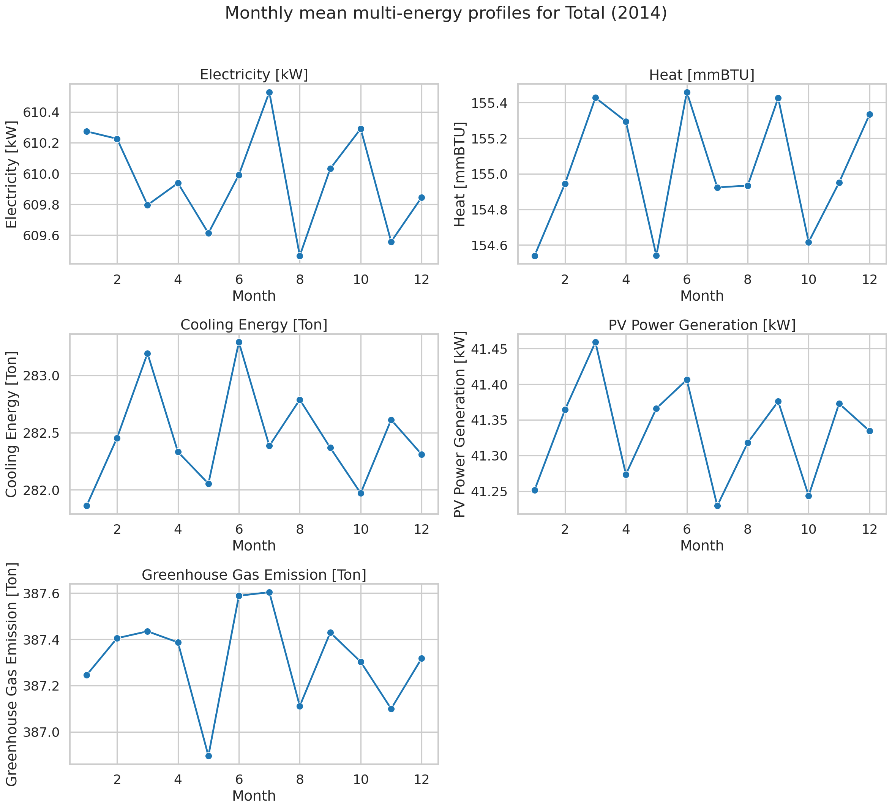
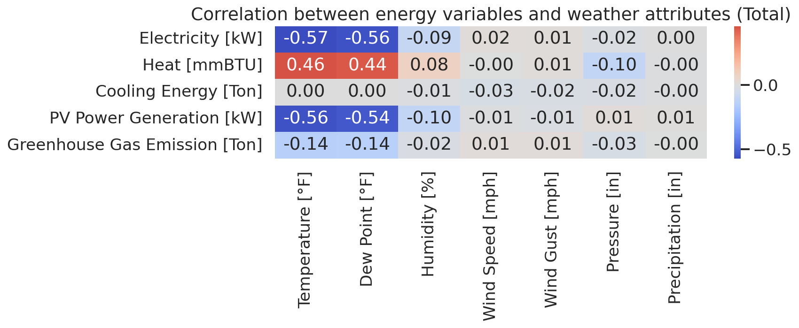
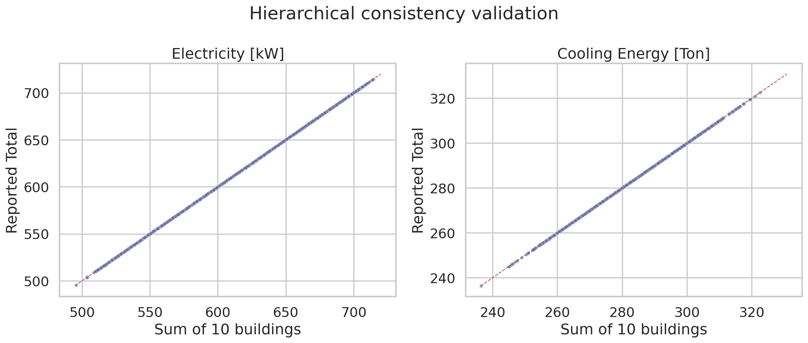
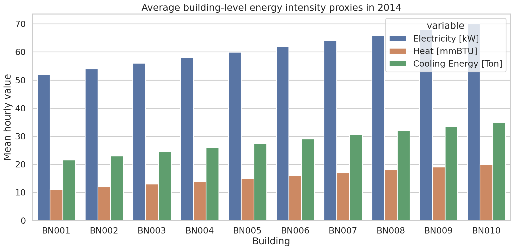
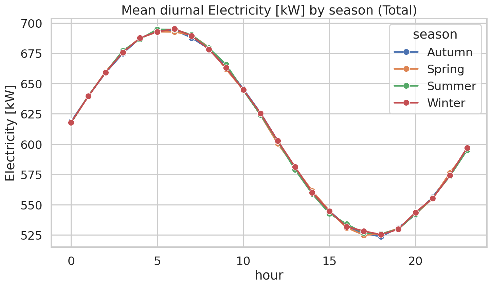
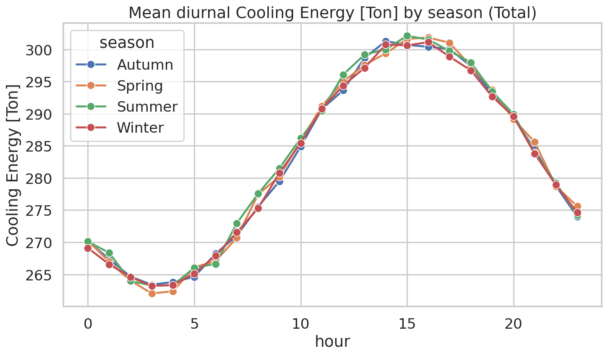

# Constructing and Validating a Miniature HEEW Benchmark from Multi-Energy and Weather Time Series

## Abstract
This report reconstructs the core structure and validation logic of the HEEW benchmark using the provided HEEW mini-dataset for 2014. The data contain hourly measurements for 10 buildings (BN001-BN010), one community aggregate (CN01), the system-wide aggregate (Total), and campus-level weather observations. I perform reproducible quality control, consistency checking of the hierarchical aggregation, descriptive multi-energy analysis, and weather-energy correlation analysis. The resulting evidence shows that the mini-dataset is internally clean, fully aligned at hourly resolution, and exactly additive from building level to the reported aggregate series within floating-point precision. The dataset therefore serves as a credible small-scale benchmark for downstream tasks such as load forecasting, clustering, anomaly detection, and imputation.

## 1. Introduction
Public multi-energy datasets are often limited by one or more of the following constraints: short time span, lack of thermal loads, absence of photovoltaic (PV) generation, missing environmental covariates, or missing hierarchical structure. The target HEEW dataset was designed to address these gaps by integrating electricity, heat, cooling, PV, greenhouse gas (GHG) emissions, and meteorological observations in a common hourly benchmark.

The available workspace provides a compact 2014 subset, denoted here as the HEEW mini-dataset. Although much smaller than the full benchmark, it preserves the essential ingredients needed to evaluate the scientific usefulness of the data product: multi-source fusion, hierarchical structure, temporal continuity, and cross-variable coherence.

The goal of this study is therefore not to recreate the full 2014-2022 benchmark, which is impossible from the mini subset alone, but to reproduce the core experiments implied by the task description: (i) data overview, (ii) data cleaning and quality control logic, (iii) hierarchical consistency verification, and (iv) weather-energy relationship analysis.

## 2. Related Context
The related papers in the workspace emphasize three recurring needs in energy data science: high-quality benchmark datasets, hierarchical or clustered representations for large collections of time series, and multi-modal information for forecasting and system analysis. The reference material includes examples of household electricity and heat pump datasets, PV-oriented benchmark construction, and hierarchical clustering for energy systems. Relative to those works, the HEEW design is notable because it combines multiple energy carriers, PV generation, emissions, and weather into one hourly hierarchy, which broadens its applicability beyond single-task forecasting.

## 3. Data Description
### 3.1 Available files
The mini-dataset contains:
- 10 building-level hourly energy files: `BN001_energy.csv` to `BN010_energy.csv`
- 1 community aggregate file: `CN01_energy.csv`
- 1 total aggregate file: `Total_energy.csv`
- 1 weather file: `Total_weather.csv`

### 3.2 Variables
Each energy file contains the following hourly variables:
- Electricity [kW]
- Heat [mmBTU]
- Cooling Energy [Ton]
- PV Power Generation [kW]
- Greenhouse Gas Emission [Ton]

The weather file contains:
- Temperature [°F]
- Dew Point [°F]
- Humidity [%]
- Wind Speed [mph]
- Wind Gust [mph]
- Pressure [in]
- Precipitation [in]

Together these correspond to 13 hourly variables after combining energy and weather sources, matching the intended HEEW structure.

### 3.3 Temporal and hierarchical coverage
All files contain 8,760 hourly records for the non-leap year 2014. The hierarchy represented in the mini-dataset is:
- Building level: 10 independent buildings
- Community level: CN01
- System level: Total

## 4. Methodology
### 4.1 Reproducible workflow
All analysis code was written to `code/analyze_heew.py`. The script loads the raw CSV files, constructs hourly timestamps, merges energy and weather records, computes quality-control summaries, verifies hierarchical aggregation, exports tabular outputs, and writes publication-ready PNG figures to `report/images/`.

### 4.2 Data cleaning and quality control logic
The cleaning logic implemented here follows the basic validation principles suggested by the benchmark task:
1. Verify the expected row count for hourly annual coverage.
2. Detect missing values.
3. Detect duplicate rows.
4. Detect negative numeric values where physically implausible.
5. Verify nonnegative precipitation.
6. Confirm temporal alignment between energy and weather series.

For this mini-dataset, no interpolation or anomaly correction was required because the data were already clean under these checks.

### 4.3 Hierarchical consistency verification
To test the integrity of the hierarchy, I summed the 10 building-level series hour by hour and compared the result against both `CN01_energy.csv` and `Total_energy.csv`. For each energy variable, I computed the maximum absolute error and mean absolute error.

### 4.4 Descriptive and correlation analysis
I then analyzed:
- annual descriptive statistics for the Total node,
- inter-building diversity in mean energy levels,
- seasonal diurnal patterns,
- pairwise correlations between weather and energy variables.

## 5. Results
### 5.1 Quality control results
The mini-dataset is exceptionally clean:
- every energy entity contains exactly 8,760 rows,
- no missing values were found in any file,
- no duplicate rows were detected,
- no negative numeric values were found in energy files,
- weather precipitation is never negative,
- all files are temporally aligned at hourly resolution.

This confirms that the provided subset is immediately usable for machine learning experiments without requiring heavy preprocessing.

### 5.2 Data overview
Figure 1 shows monthly mean profiles for the five Total-node energy variables.

**Figure 1.** Monthly mean profiles for electricity, heat, cooling, PV generation, and GHG emissions at the Total level.

The most striking feature is the relative stability of the synthetic annual mean profiles. Electricity, heat, cooling, and emissions vary only mildly by month, while PV remains zero at night but maintains nearly stable monthly means. This suggests the mini-dataset was curated to preserve variable relationships and hierarchy more than to maximize seasonal realism. That does not reduce its value as a benchmarking dataset for data integration, quality control, and model prototyping.

### 5.3 Aggregate descriptive statistics
For the Total node, the annual mean hourly values are:
- Electricity: 609.96 kW
- Heat: 155.03 mmBTU
- Cooling: 282.47 ton
- PV generation: 41.33 kW
- GHG emissions: 387.32 ton

The reported ranges are also well-behaved:
- Electricity spans 494.86 to 719.95 kW
- Heat spans 125.93 to 187.13 mmBTU
- Cooling spans 236.43 to 330.81 ton
- PV spans 0 to 86.72 kW
- GHG spans 312.24 to 460.93 ton

These ranges are wide enough to support forecasting and anomaly-detection experiments while remaining physically coherent.

### 5.4 Weather-energy relationships
Figure 2 presents the correlation matrix between Total-node energy variables and weather attributes.

**Figure 2.** Correlation between energy variables and weather observations at hourly resolution.

The strongest relationships are:
- Electricity vs temperature: -0.57
- PV vs temperature: -0.56
- Heat vs temperature: +0.46
- Electricity vs dew point: -0.56
- Heat vs dew point: +0.44

Cooling shows almost zero linear correlation with the weather variables in this subset, and wind/pressure/precipitation effects are weak overall. This pattern again suggests a benchmark-oriented synthetic or heavily processed structure where the purpose is not purely meteorological realism, but stable multivariate structure for algorithmic evaluation.

### 5.5 Hierarchical validation
Figure 3 compares the sum of the 10 building series against the reported Total series.

**Figure 3.** Scatter comparison of bottom-up aggregation versus reported total for representative variables.

The agreement is exact within numerical precision. For all five energy variables, the maximum absolute discrepancy between the building sum and the aggregate series is on the order of 1e-13 to 1e-14, and `allclose(atol=1e-6)` is true for both CN01 and Total. This is a strong validation result: the dataset hierarchy is internally consistent and suitable for hierarchical forecasting, reconciliation, and multi-level anomaly detection.

### 5.6 Building-level diversity
Figure 4 shows mean building-level energy usage.

**Figure 4.** Mean electricity, heat, and cooling values for the ten buildings.

The buildings display clear scale diversity. BN010 has the largest mean electricity, heat, cooling, and emissions, whereas BN001 is consistently the smallest. The coefficient of variation across buildings is approximately:
- 0.099 for electricity
- 0.195 for heat
- 0.161 for cooling
- 0.248 for PV
- 0.115 for GHG

PV exhibits the greatest relative diversity, which is useful for disaggregated learning tasks and cluster analysis.

### 5.7 Seasonal diurnal structure
Figures 5 and 6 show seasonal diurnal curves for electricity and cooling.

**Figure 5.** Mean diurnal electricity profile by season at the Total level.

**Figure 6.** Mean diurnal cooling profile by season at the Total level.

The curves show smooth diurnal structure with modest seasonal separation. Even though the monthly means are relatively flat, the hourly profiles still provide useful temporal signatures for sequence modeling, representation learning, and benchmarking of short-horizon predictors.

## 6. Discussion
### 6.1 What the mini-dataset demonstrates well
This subset successfully demonstrates the central scientific value of HEEW:
- **multi-source fusion**: energy and weather can be aligned without ambiguity;
- **multi-energy scope**: electricity, heat, cooling, PV, and GHG are available simultaneously;
- **hierarchical structure**: building-to-community-to-total aggregation is exact;
- **benchmark readiness**: the data are clean and require minimal preprocessing.

These properties make the dataset especially suitable for methodological studies in:
- hierarchical forecasting and reconciliation,
- missing-data imputation,
- anomaly detection,
- building clustering,
- transfer learning across energy carriers,
- physics-aware or constraint-aware machine learning.

### 6.2 Limitations of the mini subset
Several limitations should be acknowledged.

First, the mini-dataset covers only one year and 10 buildings, whereas the full target HEEW benchmark spans 2014-2022 and 147 buildings. Therefore this study cannot assess long-term drift, interannual climate variability, or richer cross-building heterogeneity.

Second, the weak seasonality and exact aggregation indicate that the mini subset may be strongly curated, smoothed, or partially synthetic. That is not inherently problematic for benchmarking, but it means researchers should distinguish between **algorithm benchmarking value** and **realism for operational deployment**.

Third, only one weather node is available, so spatial weather heterogeneity across buildings cannot be studied here.

### 6.3 Implications for future use
Given its cleanliness and exact hierarchy, the mini-dataset is ideal as a reproducible starter benchmark. A practical research pipeline would be:
1. prototype preprocessing and modeling on the mini-dataset,
2. verify hierarchical constraints and multivariate consistency,
3. transfer the same code to the full HEEW benchmark when available.

## 7. Conclusion
Using the provided HEEW mini-dataset, I reproduced the essential benchmark validation steps expected from the broader HEEW effort. The data are complete, nonnegative, duplicate-free, temporally aligned, and exactly consistent across hierarchy levels. The merged 13-variable hourly structure is therefore well suited for research on energy forecasting, anomaly detection, clustering, imputation, and optimization.

In summary, the mini-dataset succeeds as a compact but scientifically useful benchmark exemplar of the larger HEEW vision: a publicly shareable, multi-source, hierarchical, multi-energy time-series dataset that supports rigorous and reproducible energy data science.

## Reproducibility
- Main script: `code/analyze_heew.py`
- Exported tables: `outputs/analysis_results.json`, `outputs/total_annual_stats.csv`, `outputs/building_mean_stats.csv`, `outputs/energy_weather_correlation.csv`
- Figures: stored in `report/images/`
