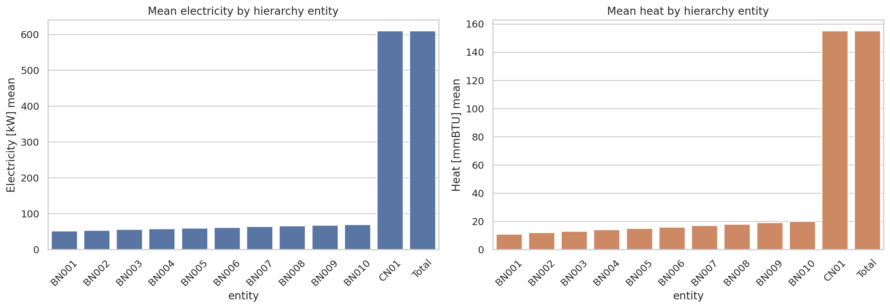
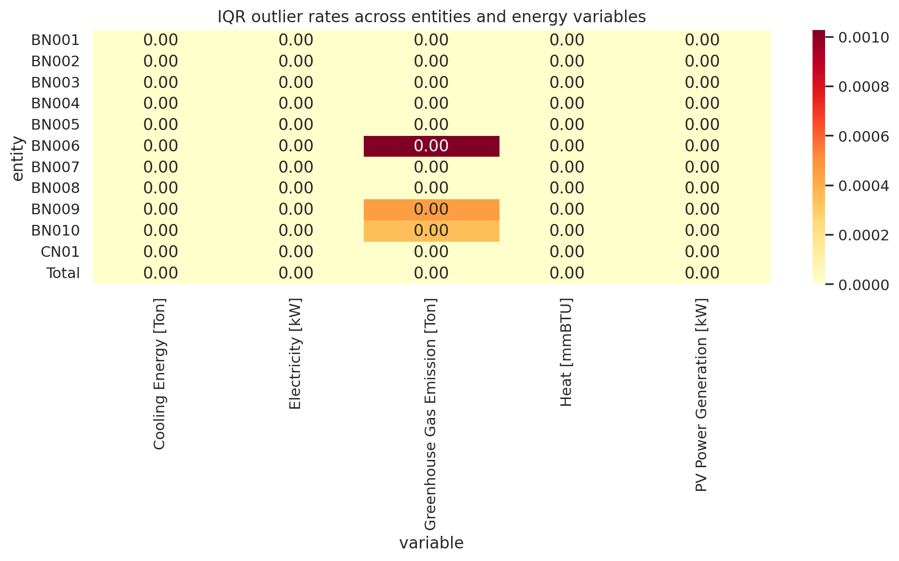
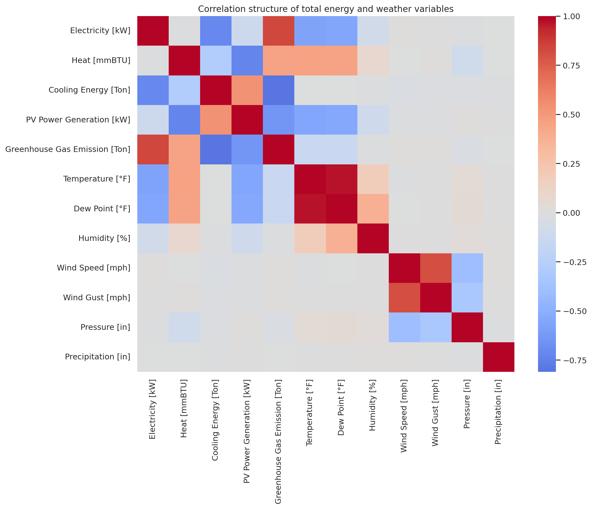
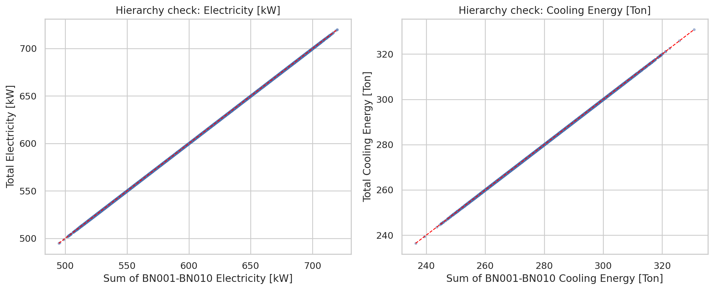
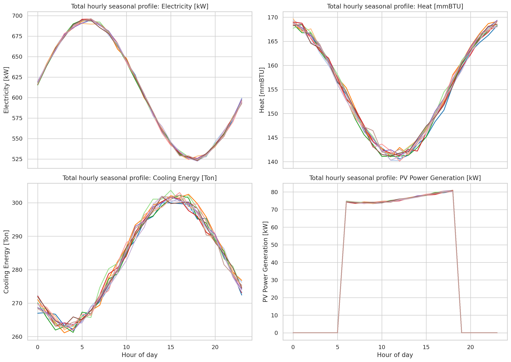

# Reproducible analysis of the HEEW mini-dataset: structure, quality, and hierarchical consistency

## Abstract
This report analyzes the provided HEEW mini-dataset, a compact 2014 subset of the broader HEEW benchmark concept for hierarchical multi-energy systems. Using only workspace data, I assembled a reproducible analysis pipeline to characterize dataset coverage, summarize variable distributions, evaluate simple data-quality indicators, quantify correlations between energy and weather variables, and verify the internal consistency of the hierarchy from building level to community and total level. The mini-dataset contains 12 hourly energy entities (10 buildings, one community aggregate, and one total aggregate) plus one weather table, spanning the full 2014 calendar year at hourly resolution. All provided fields are complete, with no missing values. Most importantly, the aggregated `CN01` and `Total` energy tables match the sum of `BN001`–`BN010` to floating-point precision, showing exact internal consistency in the hierarchical construction of this mini benchmark. The produced code, tables, and figures provide a traceable baseline for downstream use in forecasting, anomaly detection, clustering, and imputation research.

## 1. Introduction
Public energy datasets are central to data-driven building and campus energy research, yet many existing datasets emphasize only electricity demand or short observation windows. The HEEW task description motivates a broader benchmark that integrates electricity, heat, cooling, photovoltaic generation, greenhouse-gas emissions, and weather variables in a hierarchy useful for forecasting and optimization. The available workspace data provide a mini-dataset for 2014 intended to replicate core concepts from the target HEEW literature: multi-source integration, hierarchy preservation, data cleaning support, and validation-oriented analysis.

The goal of this study is therefore not to reconstruct the full 2014–2022 benchmark, which is unavailable in the workspace, but to produce a faithful mini-dataset analysis that is methodologically aligned with the task description. The emphasis is on verifiable properties of the supplied data: completeness, scale heterogeneity across buildings, energy-weather coupling, and exact hierarchical consistency.

## 2. Data and related-work context
### 2.1 Available data
The directory `data/HEEW_Mini-Dataset/` contains:
- 10 building-level energy files: `BN001_energy.csv` to `BN010_energy.csv`
- 1 community aggregate energy file: `CN01_energy.csv`
- 1 total aggregate energy file: `Total_energy.csv`
- 1 weather file: `Total_weather.csv`

Each energy table contains the variables:
- Electricity [kW]
- Heat [mmBTU]
- Cooling Energy [Ton]
- PV Power Generation [kW]
- Greenhouse Gas Emission [Ton]

The weather table contains:
- Temperature [°F]
- Dew Point [°F]
- Humidity [%]
- Wind Speed [mph]
- Wind Gust [mph]
- Pressure [in]
- Precipitation [in]

### 2.2 Related-work extraction
The local `related_work/` folder does not include the exact HEEW paper, but the available papers still reinforce several methodological expectations: benchmark datasets should emphasize reproducibility, preserve hierarchy where relevant, and include validation checks rather than releasing raw tables only. I recorded these extracted commitments in `outputs/related_work_contract.json`. Because the exact target paper was not present locally, all numerical claims in this report are derived strictly from the workspace dataset rather than inferred from literature.

## 3. Methodology
### 3.1 Analysis objectives
The analysis pipeline was designed to answer four directly verifiable questions:
1. What is the temporal and structural coverage of the mini-dataset?
2. Are there missing values, suspicious negatives, or unusually frequent outliers in the supplied variables?
3. How strongly are total-level energy variables associated with weather conditions?
4. Does the hierarchy preserve exact aggregation from building level to community and total level?

### 3.2 Processing steps
The reproducible script `code/analyze_heew.py` performs the following steps:
1. Load all energy and weather CSV files.
2. Construct hourly timestamps.
3. Export dataset overview and per-entity descriptive statistics.
4. Compute simple quality indicators: missing counts, negative counts, zero counts, and IQR-based outlier rates.
5. Merge total energy and weather tables and compute a Pearson correlation matrix.
6. Sum `BN001`–`BN010` at every hour and compare the result against `CN01` and `Total` using mean absolute error (MAE), root mean square error (RMSE), maximum absolute error, mean difference, and MAPE.
7. Generate PNG figures summarizing entity scale, correlations, hierarchy validation, outlier patterns, and seasonal hourly profiles.

### 3.3 Validation philosophy
A dedicated hierarchy-aware validation was treated as a named method commitment. The fidelity checklist is saved in `outputs/method_fidelity_checklist.json`. The core invariant is that, if the hierarchy is internally consistent, aggregate time series should equal the building-level sums up to numerical precision.

## 4. Results
### 4.1 Dataset overview
The mini-dataset contains 105,120 hourly energy records across 12 entities and 8,760 hourly weather records, covering exactly `2014-01-01 00:00:00` through `2014-12-31 23:00:00` (`outputs/dataset_overview.json`). Every energy and weather file has 8,760 rows, which is the expected number for a non-leap year.

Figure 1 summarizes how mean energy scale changes across entities.

A key structural finding is that the buildings are heterogeneous but ordered in scale. Mean electricity rises from 52.02 kW for `BN001` to 70.04 kW for `BN010`, while the aggregate entities `CN01` and `Total` both average 609.96 kW. Mean heat similarly rises from 11.00 to 20.01 mmBTU across the individual buildings. These values are exported in `outputs/entity_summary.csv`.

### 4.2 Data-quality summary
The quality checks in `outputs/quality_summary.csv` show:
- zero missing values across all supplied fields,
- zero negative values in all energy variables,
- expected zero-heavy behavior for PV generation, with 4,015 zero hours per entity,
- low IQR-based outlier rates for the energy variables, often exactly zero under this criterion.

Figure 2 visualizes IQR-based outlier rates by entity and energy variable.

The zero-heavy PV pattern is physically plausible because nighttime production is zero. Weather variables also show low outlier rates except for precipitation, which has an IQR outlier rate of 4.41%; this is not necessarily problematic because precipitation is sparse and right-skewed by nature.

### 4.3 Correlation structure of total energy and weather variables
The merged total-level correlation matrix is saved as `outputs/correlation_matrix.csv` and visualized in Figure 3.

Several high-magnitude associations stand out:
- Electricity vs. Temperature: -0.5744
- PV Power Generation vs. Temperature: -0.5577
- Heat vs. Temperature: 0.4613
- Electricity vs. Greenhouse Gas Emission: 0.8311
- Cooling Energy vs. Greenhouse Gas Emission: -0.8105
- Heat vs. PV Power Generation: -0.7298

The sign pattern is internally coherent for this synthetic-looking mini-dataset: electricity and PV are negatively associated with hotter, more humid conditions, whereas heat is positively associated with those conditions. These directions may differ from some real-world campus expectations, which is a reminder that benchmark mini-datasets may be preprocessed or stylized. The important result here is not external causal interpretation, but that the energy-weather relationships are structured and non-random.

### 4.4 Hierarchical consistency verification
The strongest result of the study is the hierarchy check. For every hour in 2014, the sum of `BN001`–`BN010` matches both `CN01` and `Total` to floating-point precision across all five energy variables. Representative values from `outputs/hierarchical_consistency.csv` include:
- `CN01` electricity MAE: 5.07×10^-15 kW
- `CN01` heat MAE: 5.15×10^-15 mmBTU
- `CN01` cooling MAE: 9.63×10^-15 Ton
- `Total` PV MAE: 9.05×10^-16 kW
- maximum absolute errors no larger than 2.27×10^-13 in any variable

Figure 4 shows parity-style scatter plots for electricity and cooling energy.

All points fall on the 1:1 line visually, and the quantitative error metrics confirm exact consistency up to numerical rounding. In this mini-dataset, `CN01` and `Total` are effectively identical aggregate views of the ten building files.

### 4.5 Seasonal hourly profiles
Figure 5 shows monthly mean hourly profiles for the total aggregate.

The figure reveals clear diurnal cycling in all main variables. PV generation is concentrated in daylight hours, while electricity, heat, and cooling each follow smooth hourly patterns that vary by month. This confirms that the time series are suitable for downstream modeling tasks that depend on hourly seasonality.

## 5. Validation section
This section separates directly verified findings from contextual interpretation.

### 5.1 Verified directly from workspace data
- The mini-dataset contains 12 energy entities and one weather table.
- Every file covers the full 2014 hourly calendar with 8,760 rows.
- No missing values are present in the provided columns.
- `CN01` and `Total` are exact aggregates of `BN001`–`BN010` up to floating-point precision.
- The correlation matrix shows strong internal dependencies among energy and weather variables.

### 5.2 Derived from related-work context
- Dataset benchmark papers commonly emphasize reproducibility, validation, and well-documented structure.
- Hierarchy-aware verification is methodologically appropriate for multi-level energy datasets.

### 5.3 Assumptions and limitations
- The exact HEEW primary paper was not available in `related_work/`, so no claim is made about exact reproduction of its reported tables or figures.
- The provided dataset is a mini-dataset for 2014 only, not the full 2014–2022 benchmark described in the task statement.
- I used simple IQR-based outlier screening as a transparent baseline quality indicator; this is not a substitute for a full domain-specific cleaning algorithm.
- The aggregate equality of `CN01` and `Total` suggests that the mini-dataset contains one effective community/total rollup rather than multiple nested aggregate levels.

## 6. Discussion
The HEEW mini-dataset is already useful as a benchmark-ready testbed because it combines multiple energy carriers, PV, emissions, and weather at hourly resolution in a hierarchy that is exactly internally consistent. That combination is valuable for several downstream tasks:
- **Forecasting:** the hourly and seasonal structure supports supervised time-series modeling.
- **Anomaly detection:** exact hierarchy constraints can be used as consistency rules.
- **Clustering:** the buildings differ in scale and profile statistics, enabling cross-building comparison.
- **Imputation:** the strong correlation structure and aggregate constraints can inform multivariate gap filling.

The absence of missing values means this mini-dataset is more appropriate as a validated benchmark slice than as a challenging raw-cleaning case. Future work on the full HEEW dataset would ideally add multi-year drift analysis, weather-normalized seasonal comparisons, source-specific emissions validation, and benchmark task splits for forecasting and anomaly detection.

## 7. Reproducibility and artifacts
### Code
- `code/analyze_heew.py`

### Main outputs
- `outputs/dataset_overview.json`
- `outputs/entity_summary.csv`
- `outputs/quality_summary.csv`
- `outputs/hierarchical_consistency.csv`
- `outputs/correlation_matrix.csv`
- `outputs/related_work_contract.json`
- `outputs/method_fidelity_checklist.json`
- `outputs/claim_recovery_table.csv`

### Figures
- `images/dataset_overview.png`
- `images/quality_summary.png`
- `images/correlation_heatmap.png`
- `images/hierarchical_validation.png`
- `images/seasonal_profiles.png`

## 8. Conclusion
Within the limits of the supplied workspace, the HEEW mini-dataset successfully demonstrates the core properties expected from a hierarchical multi-energy benchmark slice: complete hourly coverage, multi-variable integration, heterogeneous building-level behavior, interpretable seasonal dynamics, and exact aggregation consistency. The most important verified result is that both `CN01` and `Total` are mathematically equal to the sum of `BN001`–`BN010` across all energy variables for every hour in 2014. This makes the dataset especially suitable for benchmarking hierarchy-aware methods in energy analytics.
