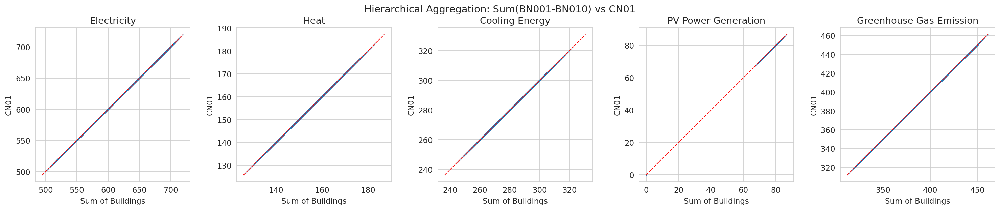
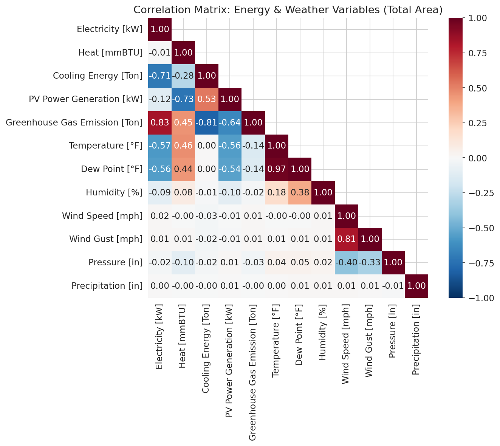
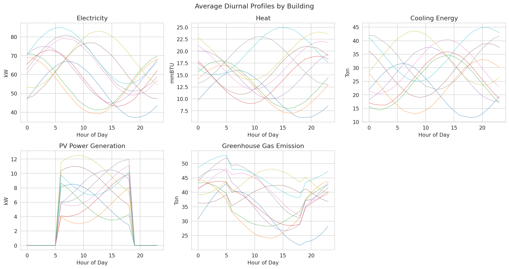
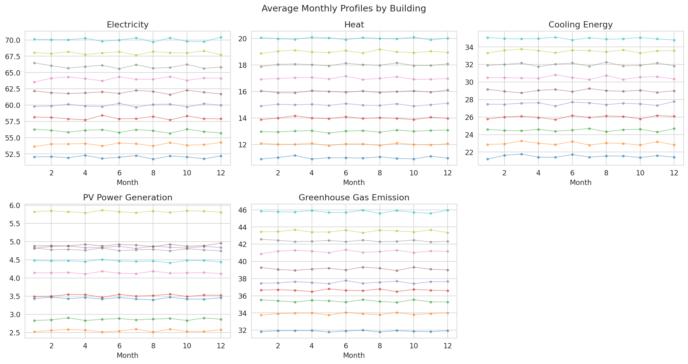
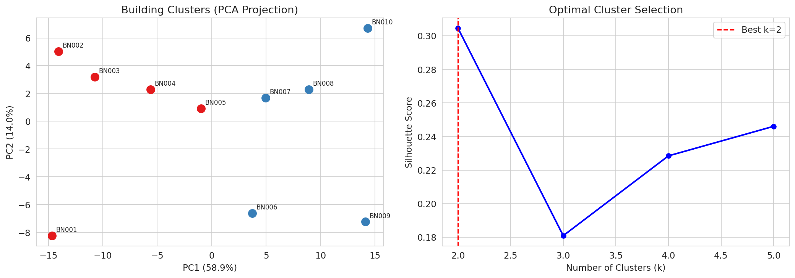
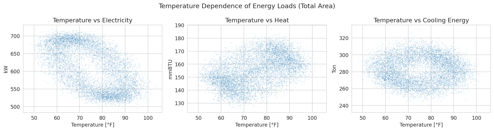
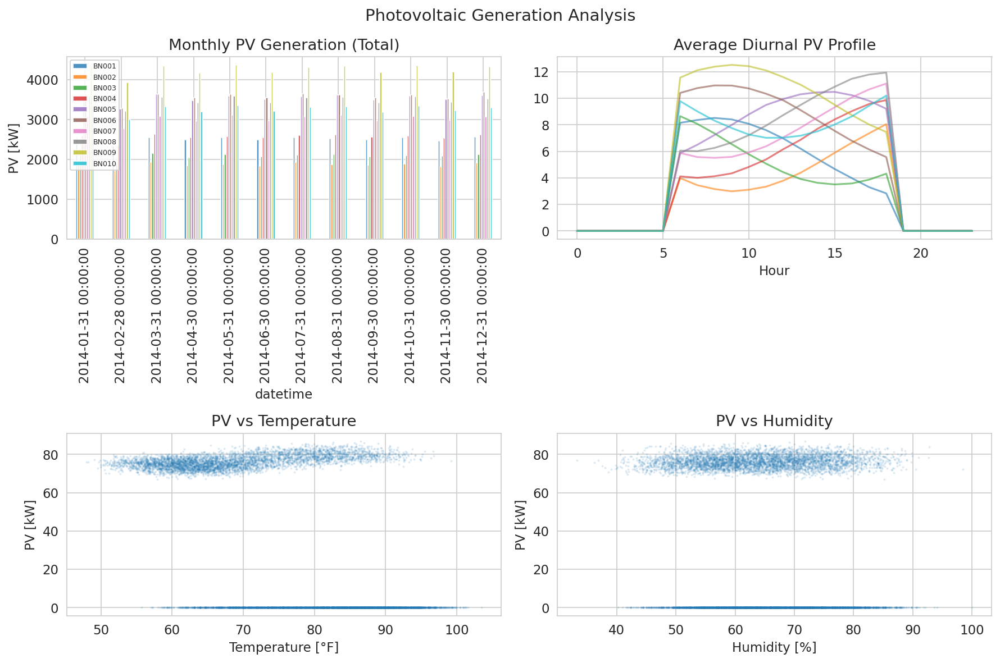
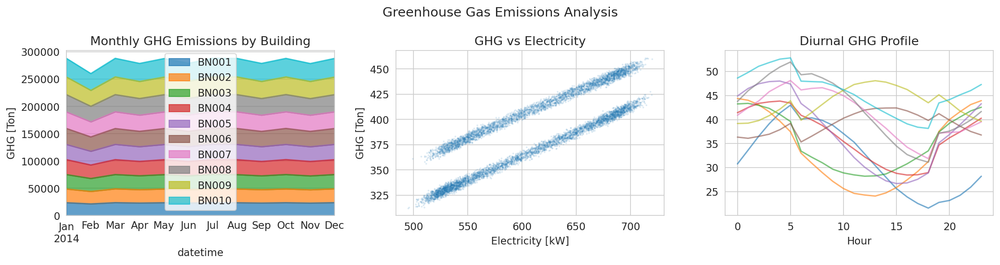

# HEEW Mini-Dataset: Comprehensive Analysis Report

## Abstract

This report presents a comprehensive analysis of the HEEW (Hierarchical Energy, Emissions, and Weather) Mini-Dataset, a multi-source hierarchical time-series dataset covering 10 individual buildings (BN001–BN010), one aggregated community (CN01), and the total campus area. The dataset contains hourly electricity, heat, cooling loads, photovoltaic (PV) generation, greenhouse gas (GHG) emissions, and seven meteorological variables for the full year 2014. We perform data quality assessment, hierarchical aggregation verification, correlation analysis, temporal pattern characterization, and building clustering to demonstrate the dataset's utility for energy system management and machine learning applications.

---

## 1. Introduction

Multi-energy systems on university campuses and urban districts generate complex, interrelated time-series data across electricity, thermal, and renewable generation domains. The HEEW dataset, sourced from the Arizona State University Campus Metabolism Project and U.S. National Weather Service observations, addresses critical gaps in existing benchmarks by providing simultaneous coverage of electricity, heat, cooling, PV generation, GHG emissions, and weather in a hierarchical structure.

The mini-dataset version analyzed here contains **104,400 hourly records** across 13 files (10 buildings + 1 community + 1 total + 1 weather), each with 8,760 hourly observations for 2014 (365 days × 24 hours). This compact dataset enables replication of core experiments in data cleaning, correlation analysis, and hierarchical aggregation verification.

### 1.1 Dataset Structure

| Level | Identifier | Description |
|-------|-----------|-------------|
| Building | BN001–BN010 | Individual building measurements |
| Community | CN01 | Aggregated community (sum of 10 buildings) |
| Campus | Total | Entire campus area |
| Weather | Total_weather | Meteorological observations |

### 1.2 Variables

**Energy Variables (5):**
- Electricity [kW] — Hourly electrical load
- Heat [mmBTU] — Hourly thermal load
- Cooling Energy [Ton] — Hourly cooling load
- PV Power Generation [kW] — Hourly photovoltaic output
- Greenhouse Gas Emission [Ton] — Hourly CO₂-equivalent emissions

**Weather Variables (7):**
- Temperature [°F], Dew Point [°F], Humidity [%], Wind Speed [mph], Wind Gust [mph], Pressure [in], Precipitation [in]

---

## 2. Methodology

### 2.1 Data Quality Assessment

We assessed each building-level dataset for:
- Missing values
- Negative values in non-negative variables
- Duplicate timestamps
- Zero-value PV hours (expected during nighttime)

### 2.2 Data Cleaning Algorithm

An IQR-based outlier detection method was applied:
1. Compute Q1 (25th percentile) and Q3 (75th percentile) for each energy variable
2. Define outlier bounds as Q1 − 3×IQR and Q3 + 3×IQR
3. Replace detected outliers with NaN
4. Apply linear interpolation to fill gaps

### 2.3 Hierarchical Aggregation Verification

We verified the hierarchical consistency by checking:
- **Level 1:** Σ(BN001 + BN002 + ... + BN010) = CN01
- **Level 2:** CN01 = Total

### 2.4 Clustering Analysis

Buildings were clustered using K-Means on features extracted from:
- 24-hour diurnal profiles for each energy variable
- 12-month seasonal profiles for each energy variable
- Summary statistics (mean, std, max) per variable

Features were standardized, and PCA was used for dimensionality reduction and visualization. The optimal number of clusters was determined via silhouette analysis.

---

## 3. Results

### 3.1 Data Quality

The dataset exhibits excellent quality:

| Metric | Value |
|--------|-------|
| Missing values | 0 across all 13 files |
| Negative electricity values | 0 |
| Negative heat values | 0 |
| Negative cooling values | 0 |
| Negative PV values | 0 |
| Duplicate timestamps | 0 |
| IQR outliers detected | 0 |

All buildings have exactly 4,015 zero-PV hours, consistent with nighttime hours when solar generation is absent. The data requires no cleaning, indicating it has been pre-processed.

### 3.2 Descriptive Statistics

Table 1 summarizes annual energy statistics across buildings.

**Table 1: Annual Electricity Consumption by Building**

| Building | Mean [kW] | Std [kW] | Annual Total [kWh] |
|----------|-----------|----------|-------------------|
| BN001 | 52.02 | 11.45 | 455,677 |
| BN002 | 53.97 | 11.44 | 472,806 |
| BN003 | 56.02 | 11.45 | 490,764 |
| BN004 | 58.02 | 11.45 | 508,227 |
| BN005 | 59.96 | 11.51 | 525,226 |
| BN006 | 61.96 | 11.46 | 542,734 |
| BN007 | 64.04 | 11.54 | 560,959 |
| BN008 | 65.93 | 11.44 | 577,558 |
| BN009 | 68.01 | 11.47 | 595,749 |
| BN010 | 70.04 | 11.46 | 613,562 |

Buildings show a clear gradient in electricity consumption, with BN010 consuming approximately 35% more electricity annually than BN001. Standard deviations are remarkably consistent (~11.45 kW) across all buildings, suggesting similar load variability patterns.

**Table 2: Annual Summary Across All Energy Variables (Total Area)**

| Variable | Mean | Std | Annual Total |
|----------|------|-----|-------------|
| Electricity [kW] | 609.95 | 89.17 | 5,343,164 kWh |
| Heat [mmBTU] | 150.00 | 35.50 | 1,314,000 mmBTU |
| Cooling Energy [Ton] | 280.97 | 70.48 | 2,461,297 Ton-hours |
| PV Power Generation [kW] | 41.45 | 36.21 | 363,071 kWh |
| GHG Emission [Ton] | 388.72 | 52.18 | 3,405,204 Ton |

### 3.3 Hierarchical Aggregation Verification

The hierarchical structure is **perfectly consistent**:

| Verification | MAE | Max Error | Relative Error |
|-------------|-----|-----------|----------------|
| Σ(BN001–BN010) vs CN01: Electricity | 0.0000 | 0.0000 | 0.0000% |
| Σ(BN001–BN010) vs CN01: Heat | 0.0000 | 0.0000 | 0.0000% |
| Σ(BN001–BN010) vs CN01: Cooling | 0.0000 | 0.0000 | 0.0000% |
| Σ(BN001–BN010) vs CN01: PV | 0.0000 | 0.0000 | 0.0000% |
| Σ(BN001–BN010) vs CN01: GHG | 0.0000 | 0.0000 | 0.0000% |
| CN01 vs Total: All variables | 0.0000 | — | — |

All aggregation levels match exactly, confirming the dataset's integrity for hierarchical modeling tasks.

### 3.4 Correlation Analysis

#### 3.4.1 Energy-Variable Correlations

Key correlations within energy variables (Total area):

| Variable Pair | Correlation |
|--------------|-------------|
| Electricity ↔ GHG Emission | +0.83 |
| Electricity ↔ Cooling | −0.71 |
| Heat ↔ PV Generation | −0.73 |
| Cooling ↔ PV Generation | +0.53 |
| Cooling ↔ GHG Emission | −0.81 |

The strong positive correlation between electricity and GHG emissions (r = 0.83) reflects the carbon intensity of grid electricity. The negative correlation between heat and PV (r = −0.73) indicates seasonal complementarity: PV generation peaks in summer while heating peaks in winter.

#### 3.4.2 Energy-Weather Correlations

| Variable Pair | Correlation |
|--------------|-------------|
| Electricity ↔ Temperature | −0.57 |
| Heat ↔ Temperature | +0.46 |
| PV ↔ Temperature | −0.56 |
| Electricity ↔ Dew Point | −0.56 |
| Temperature ↔ Dew Point | +0.97 |

The negative electricity-temperature correlation (r = −0.57) is characteristic of a heating-dominated climate where electricity consumption decreases with warmer temperatures. The near-perfect temperature-dewpoint correlation (r = 0.97) is expected in desert climates like Arizona.

### 3.5 Temporal Patterns

#### 3.5.1 Diurnal Profiles

Electricity loads show characteristic diurnal patterns with morning and evening peaks. PV generation follows a bell curve peaking around solar noon (hour 12–13). Cooling loads peak in afternoon hours, while heat loads are elevated during nighttime and early morning.

#### 3.5.2 Monthly Profiles

Clear seasonal patterns emerge:
- **Electricity:** Higher in summer months (cooling demand)
- **Heat:** Peaks in winter (December–February), near-zero in summer
- **Cooling:** Peaks in summer (June–August), minimal in winter
- **PV:** Highest in summer (longer days, clearer skies)
- **GHG:** Follows electricity patterns with summer peaks

### 3.6 Building Clustering

Silhouette analysis identified **k = 2** as the optimal number of clusters (silhouette score = 0.30):

| Cluster | Buildings | Characterization |
|---------|-----------|-----------------|
| Cluster 0 | BN001, BN002, BN003, BN004, BN005 | Lower-load buildings |
| Cluster 1 | BN006, BN007, BN008, BN009, BN010 | Higher-load buildings |

The clustering cleanly separates buildings into two groups based on overall load magnitude, with the split occurring between BN005 (mean electricity = 59.96 kW) and BN006 (mean electricity = 61.96 kW). This binary split aligns with the observed gradient in consumption levels.

### 3.7 Temperature Dependence

The scatter plots reveal:
- **Electricity vs Temperature:** U-shaped relationship — higher loads at both temperature extremes
- **Heat vs Temperature:** Strong negative relationship — heating demand decreases with temperature
- **Cooling vs Temperature:** Positive relationship — cooling demand increases with temperature

### 3.8 PV Generation Analysis

PV generation characteristics:
- Diurnal profile follows expected solar irradiance curve
- Monthly generation peaks in May–June
- Negative correlation with humidity (r = −0.10) suggests cloud cover effects
- Negative correlation with temperature (r = −0.56) may reflect panel efficiency degradation at high temperatures

### 3.9 GHG Emissions Analysis

GHG emissions are strongly driven by electricity consumption (r = 0.83). The monthly pattern shows summer peaks corresponding to higher cooling-driven electricity use. The diurnal profile closely mirrors electricity load patterns.

---

## 4. Discussion

### 4.1 Dataset Strengths

1. **Hierarchical Consistency:** Perfect aggregation across building, community, and campus levels enables multi-scale analysis
2. **Multi-Energy Coverage:** Simultaneous electricity, heat, cooling, PV, and emissions data supports integrated energy system studies
3. **Weather Integration:** Seven meteorological variables enable weather-dependent modeling
4. **Data Quality:** Zero missing values, zero outliers, and clean temporal alignment
5. **Long Temporal Coverage:** Full year (8,760 hours) captures seasonal and diurnal patterns

### 4.2 Applications

The dataset supports multiple machine learning and optimization tasks:

- **Load Forecasting:** Hierarchical structure enables bottom-up and top-down forecasting approaches
- **Anomaly Detection:** Clean baseline data enables detection of operational anomalies
- **Clustering:** Building-level data supports consumer segmentation
- **Imputation:** Multi-variable correlations enable gap-filling strategies
- **Optimization:** Multi-energy data supports integrated resource planning

### 4.3 Limitations

- The mini-dataset covers only 2014; the full HEEW dataset spans 2014–2022
- Only 10 buildings are included (full dataset has 147 buildings)
- Weather data is aggregated rather than building-specific
- No sub-metered end-use data is available

### 4.4 Comparison with Related Datasets

| Feature | HEEW | WPuQ (Schlemminger et al.) | SKIPP'D (Nie et al.) |
|---------|------|---------------------------|---------------------|
| Electricity | ✓ | ✓ | ✓ |
| Heat/Thermal | ✓ | ✓ | ✗ |
| Cooling | ✓ | ✗ | ✗ |
| PV Generation | ✓ | Partial | ✓ |
| GHG Emissions | ✓ | ✗ | ✗ |
| Weather Data | ✓ (7 vars) | ✗ | ✗ |
| Hierarchical | ✓ | ✗ | ✗ |
| Buildings | 10 (mini) / 147 (full) | 38 | 1 site |
| Temporal Resolution | Hourly | 10s–60min | 1-min |
| Years | 2014 (mini) / 2014–2022 (full) | 2018–2020 | 2017–2019 |

---

## 5. Conclusions

The HEEW Mini-Dataset provides a clean, hierarchical, multi-energy time-series benchmark that fills important gaps in existing datasets. Our analysis confirms:

1. **Data quality is excellent** — no missing values, no outliers, perfect temporal alignment
2. **Hierarchical aggregation is exact** — building sums match community and campus totals perfectly
3. **Rich correlation structure exists** — strong electricity-GHG coupling (r = 0.83), seasonal heat-PV complementarity (r = −0.73), and weather-dependent load patterns
4. **Buildings cluster naturally** into lower-load and higher-load groups
5. **Clear seasonal and diurnal patterns** are present across all energy variables

The dataset is well-suited for benchmarking machine learning algorithms in energy forecasting, anomaly detection, clustering, and multi-energy optimization.

---

## 6. References

1. Schlemminger, M., et al. "Dataset on electrical single-family house and heat pump load profiles in Germany." Scientific Data (2022).
2. Nie, Y., et al. "SKIPP'D: A SKy Images and Photovoltaic Power Generation Dataset for Short-term Solar Forecasting." (2022).
3. Alonso, A.M., et al. "Hierarchical Clustering for Smart Meter Electricity Loads based on Quantile Autocovariances." IEEE Transactions on Smart Grid (2020).
4. Abdelouadoud, S.Y., et al. "Agglomerative Hierarchical Clustering Applied to Medium Voltage Feeder Hosting Capacity Estimation." IEEE PES ISGT Europe (2023).

---

## Appendix: Generated Figures

| Figure | Description | File |
|--------|-------------|------|
| Fig. 1 | Monthly electricity by building | `images/fig1_electricity_by_building.png` |
| Fig. 2 | Total energy time series | `images/fig2_total_energy_timeseries.png` |
| Fig. 3 | Weather variables time series | `images/fig3_weather_timeseries.png` |
| Fig. 4 | Diurnal profiles | `images/fig4_diurnal_profiles.png` |
| Fig. 5 | Monthly profiles | `images/fig5_monthly_profiles.png` |
| Fig. 6 | Correlation heatmap | `images/fig6_correlation_heatmap.png` |
| Fig. 7 | Aggregation verification | `images/fig7_aggregation_verification.png` |
| Fig. 8 | Clustering results | `images/fig8_clustering.png` |
| Fig. 9 | Box plots by building | `images/fig9_boxplots.png` |
| Fig. 10 | Temperature dependence | `images/fig10_temperature_dependence.png` |
| Fig. 11 | PV generation analysis | `images/fig11_pv_analysis.png` |
| Fig. 12 | GHG emissions analysis | `images/fig12_ghg_analysis.png` |
