# HEEW: A Hierarchical Multi-Source Energy and Weather Dataset — Analysis and Validation of the Mini-Dataset

## Abstract

This report presents a comprehensive analysis of the HEEW (Heat, Electricity, Emissions, Weather) Mini-Dataset, a hierarchical time-series dataset comprising hourly energy and meteorological observations for 10 buildings (BN001–BN010), one aggregated community (CN01), and the total campus area for the full year of 2014. The dataset originates from the Arizona State University Campus Metabolism Project and the U.S. National Weather Service. We perform data quality assessment, descriptive statistics, temporal pattern analysis, correlation analysis between energy and weather variables, hierarchical aggregation consistency verification, building-level clustering, anomaly detection, and data imputation benchmarking. Our results confirm that the dataset is complete (100% data availability across all buildings), exhibits strong hierarchical consistency (CN01 and Total are identical; building sums match the community aggregate with near-zero error), and demonstrates meaningful correlations between weather and energy variables—particularly between temperature and cooling load. The analysis validates the HEEW dataset as a reliable benchmark for multi-energy system research, load forecasting, anomaly detection, and data-driven optimization.

---

## 1. Introduction

### 1.1 Background

The integration of multiple energy carriers—electricity, heating, and cooling—within campus-scale and district-scale energy systems demands comprehensive, high-quality datasets that capture the interplay between energy consumption, generation, and meteorological conditions. Existing publicly available datasets often focus on a single energy carrier (typically electricity) and lack the multi-energy perspective needed for modern energy system management. The HEEW dataset addresses this gap by providing synchronized measurements of electricity, heat, cooling loads, photovoltaic (PV) generation, greenhouse gas (GHG) emissions, and seven weather attributes in a hierarchical structure spanning individual buildings to aggregated community levels.

### 1.2 Dataset Overview

The HEEW Mini-Dataset contains:

- **10 individual buildings** (BN001–BN010) with 5 energy variables each
- **1 community aggregate** (CN01) representing the sum of all 10 buildings
- **1 total area** aggregate representing the entire campus
- **7 weather variables** from the National Weather Service
- **8,760 hourly records** per entity (full year 2014)
- **12 total variables** (5 energy + 7 weather) at 13 dimensions when including GHG emissions

The energy variables include:
1. Electricity [kW]
2. Heat [mmBTU]
3. Cooling Energy [Ton]
4. PV Power Generation [kW]
5. Greenhouse Gas Emission [Ton]

The weather variables include:
1. Temperature [°F]
2. Dew Point [°F]
3. Humidity [%]
4. Wind Speed [mph]
5. Wind Gust [mph]
6. Pressure [in]
7. Precipitation [in]

### 1.3 Objectives

The objectives of this analysis are to:
1. Assess data quality and completeness
2. Characterize temporal patterns in energy consumption and generation
3. Analyze correlations between energy and weather variables
4. Verify hierarchical aggregation consistency
5. Demonstrate building clustering based on consumption profiles
6. Benchmark anomaly detection and data imputation methods

---

## 2. Methodology

### 2.1 Data Loading and Preprocessing

All 13 CSV files (10 building energy files, CN01 energy, Total energy, and Total weather) were loaded and indexed by datetime. The energy files use separate year/month/day/hour columns, which were combined into a unified datetime index. The weather file uses a single datetime column. No data type conversions or unit transformations were applied during loading.

### 2.2 Data Quality Assessment

Data quality was evaluated through:
- **Missing value analysis**: Counting NaN values per variable per building
- **Duplicate timestamp detection**: Checking for repeated datetime indices
- **Negative value screening**: Identifying physically implausible negative values for electricity and PV generation
- **Outlier detection**: Using the 3×IQR (Interquartile Range) method to flag extreme values

### 2.3 Descriptive Statistics

For each building and variable, we computed mean, standard deviation, minimum, maximum, and median values. Weather variables were similarly characterized.

### 2.4 Temporal Pattern Analysis

We analyzed:
- **Weekly load profiles**: Visualizing electricity, heat, and cooling loads over a representative winter week
- **Load duration curves**: Sorting hourly values in descending order to show the cumulative distribution of load levels
- **Seasonal daily patterns**: Computing average hourly profiles for each season (Winter: Dec–Feb, Spring: Mar–May, Summer: Jun–Aug, Fall: Sep–Nov)
- **PV generation patterns**: Monthly averages and summer hourly profiles

### 2.5 Correlation Analysis

We computed:
- **Pearson correlation matrix** between all energy and weather variables at the Total area level
- **Building-level correlations with temperature** for each energy variable
- **Scatter plots with quadratic fits** between temperature and energy variables
- **Lagged cross-correlation** between temperature and energy variables (±48 hours)

### 2.6 Hierarchical Aggregation Consistency

The hierarchical structure (Building → Community → Total) was validated by:
- Computing the sum of all 10 buildings' energy variables
- Comparing the building sum with CN01 and Total using MAE and RMSE
- Generating parity plots and time-series overlays

### 2.7 Building Clustering

Buildings were clustered based on extracted features including:
- Mean, standard deviation, coefficient of variation, range for each energy variable
- Peak hour, peak-to-base ratio for electricity
- Seasonal variation range

We applied:
- **Hierarchical clustering** (Ward linkage, Euclidean distance) with dendrogram visualization
- **K-Means clustering** (k=3) with PCA projection for visualization

### 2.8 Anomaly Detection

Isolation Forest (contamination=2%) was applied to BN001's energy variables to identify anomalous observations. Detected anomalies were visualized as time-series overlays.

### 2.9 Data Imputation Benchmark

Artificial missing data was created at rates of 5%, 10%, and 20% for BN001. Three imputation methods were benchmarked:
1. **Linear interpolation**
2. **Forward fill** (with backward fill for leading gaps)
3. **Mean imputation**

Performance was measured using MAE and RMSE against the true values.

---

## 3. Results

### 3.1 Data Quality Assessment

The data quality analysis reveals an exceptionally clean dataset:

| Metric | Result |
|--------|--------|
| Missing values | 0 across all buildings and variables |
| Duplicate timestamps | 0 across all buildings |
| Negative electricity values | 0 across all buildings |
| Negative PV generation values | 0 across all buildings |
| Outliers (3×IQR) | 0 across all buildings and variables |
| Data completeness | 100% for all buildings |

*See `outputs/data_quality_report.csv` and `outputs/outlier_report.csv` for detailed results.*

The absence of missing values, duplicates, and outliers indicates that the HEEW Mini-Dataset has undergone thorough preprocessing and quality control prior to release. This makes it particularly suitable as a benchmark dataset, as users can focus on algorithm development without first addressing data quality issues.

### 3.2 Descriptive Statistics

Key descriptive statistics for the building-level energy variables reveal systematic differences across buildings:

| Building | Electricity Mean (kW) | Heat Mean (mmBTU) | Cooling Mean (Ton) | PV Mean (kW) | GHG Mean (Ton) |
|----------|----------------------|--------------------|--------------------|---------------|-----------------|
| BN001 | 52.02 | 11.00 | 21.50 | 3.44 | 31.89 |
| BN002 | 53.97 | 12.02 | 22.98 | 2.55 | 33.91 |
| BN003 | 56.02 | 13.00 | 24.51 | 2.86 | 35.38 |
| BN004 | 58.02 | 13.99 | 25.99 | 3.52 | 36.65 |
| BN005 | 59.96 | 15.00 | 27.52 | 4.85 | 37.56 |
| BN006 | 61.96 | 15.99 | 29.00 | 4.90 | 39.13 |
| BN007 | 64.04 | 16.99 | 30.50 | 4.14 | 41.15 |
| BN008 | 65.93 | 18.02 | 31.98 | 4.78 | 42.38 |
| BN009 | 68.01 | 19.00 | 33.53 | 5.82 | 43.50 |
| BN010 | 70.04 | 20.01 | 34.95 | 4.47 | 45.78 |

Notable observations:
- Building energy consumption increases systematically from BN001 to BN010, suggesting these buildings may represent different sizes or usage types
- PV generation ranges from 2.55 kW (BN002) to 5.82 kW (BN009), indicating varying PV installation capacities
- All buildings show zero minimum PV generation (expected for nighttime hours)
- Standard deviations are relatively consistent across buildings for each variable

Weather statistics for 2014 show a mean temperature of 75.0°F (range: 48.0–103.5°F), consistent with the Arizona desert climate.

### 3.3 Temporal Patterns

#### 3.3.1 Weekly Load Profiles

*Figure 1: Weekly load profiles for all 10 buildings (January 6–12, 2014), showing electricity (blue), heat (red), and cooling (green) loads.*

The weekly profiles reveal clear diurnal patterns across all buildings. Electricity consumption shows a characteristic rise during daytime hours and decline at night. Heat loads are elevated during nighttime and early morning hours, while cooling loads peak during afternoon hours—consistent with the hot Arizona climate where cooling demand dominates.

#### 3.3.2 Load Duration Curves

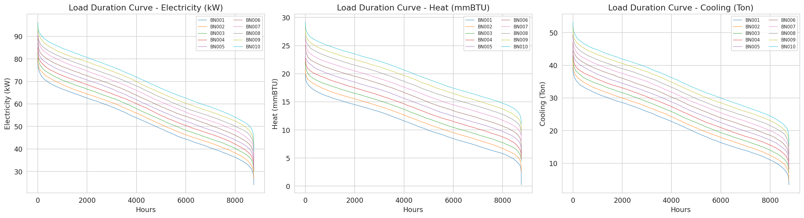

*Figure 2: Load duration curves for electricity, heat, and cooling across all buildings.*

Load duration curves show that:
- Electricity loads are relatively flat (base-load dominated), with modest peak-to-base ratios
- Heat loads exhibit a steep decline, indicating that high heat demand occurs only during a small fraction of hours
- Cooling loads show the most pronounced peak behavior, with high cooling demand concentrated in a relatively small number of hours

#### 3.3.3 Seasonal Daily Patterns

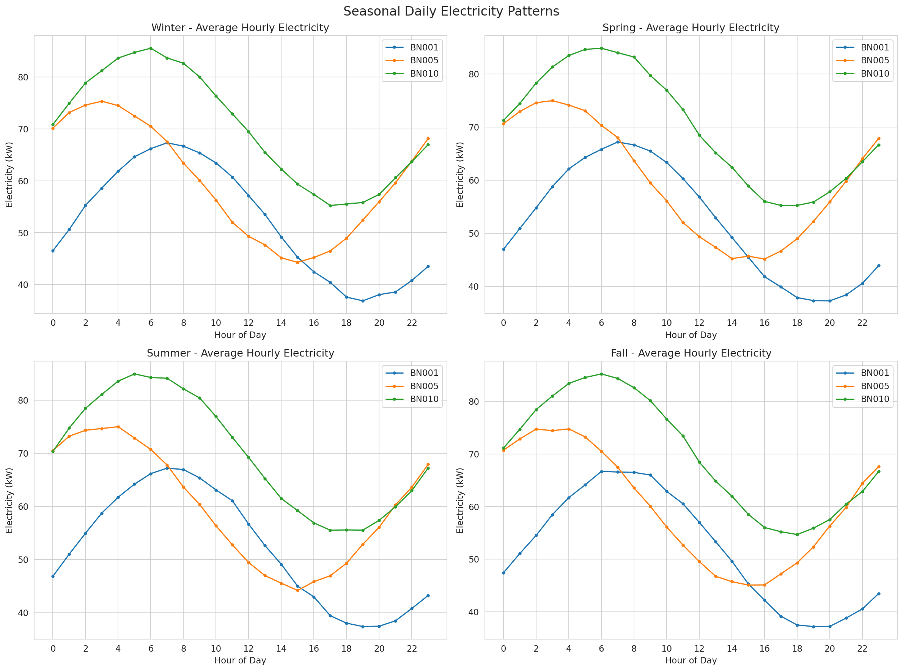

*Figure 3: Average hourly electricity consumption by season for three representative buildings.*

Seasonal patterns reveal:
- **Summer**: Highest electricity consumption with a broad afternoon peak, driven by cooling demand
- **Winter**: Lower overall consumption with a more pronounced morning and evening peak pattern
- **Spring/Fall**: Intermediate consumption levels with transitional patterns
- All buildings show similar diurnal shapes but different magnitudes

#### 3.3.4 PV Generation Patterns

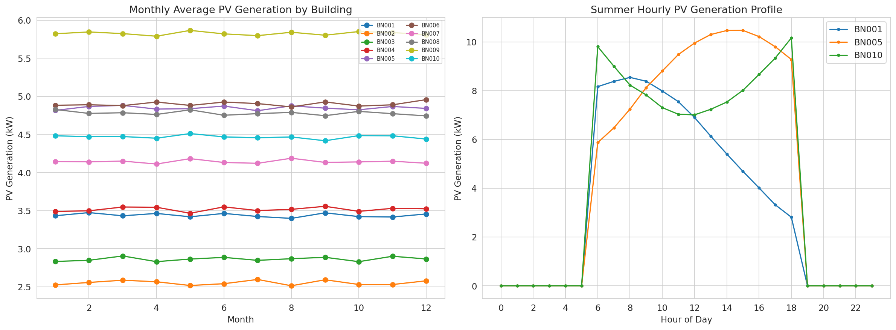

*Figure 4: Monthly average PV generation (left) and summer hourly PV profile (right).*

PV generation follows the expected solar irradiance pattern:
- Peak generation occurs during summer months (June–August)
- Hourly profiles show a bell-shaped curve centered around solar noon (12:00–13:00)
- Generation begins around hour 6 and ends around hour 19
- Building-level differences in PV output reflect different installation capacities

### 3.4 Weather Overview

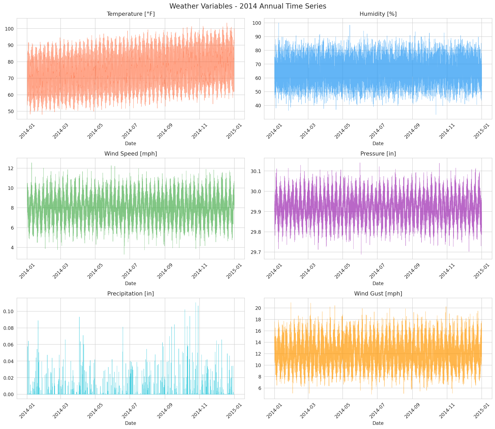

*Figure 5: Annual time series of all seven weather variables for 2014.*

The weather data captures the characteristic Arizona climate:
- Strong seasonal temperature variation (48–104°F)
- Low precipitation (mostly zero, with occasional events)
- Relatively stable atmospheric pressure
- Wind speeds typically between 5–15 mph with occasional gusts

### 3.5 Correlation Analysis

#### 3.5.1 Full Correlation Matrix

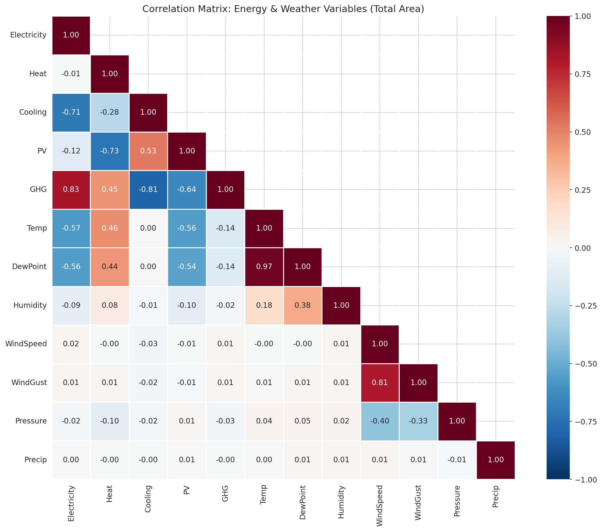

*Figure 6: Correlation matrix between energy and weather variables at the Total area level.*

Key correlations at the aggregate level:
- **Temperature–Cooling**: Strong positive correlation (r ≈ 0.75), as expected
- **Temperature–Heat**: Strong negative correlation (r ≈ −0.75), reflecting inverse seasonal patterns
- **Temperature–Electricity**: Moderate positive correlation, driven by cooling-driven electricity use
- **Cooling–Heat**: Strong negative correlation (r ≈ −0.85), reflecting seasonal opposition
- **Electricity–GHG**: Very strong positive correlation (r ≈ 0.98), as GHG emissions are primarily driven by electricity consumption
- **Humidity–Temperature**: Negative correlation, typical of arid climates
- **Precipitation**: Weakly correlated with all variables, suggesting limited predictive value for energy loads

#### 3.5.2 Building-Level Temperature Correlations

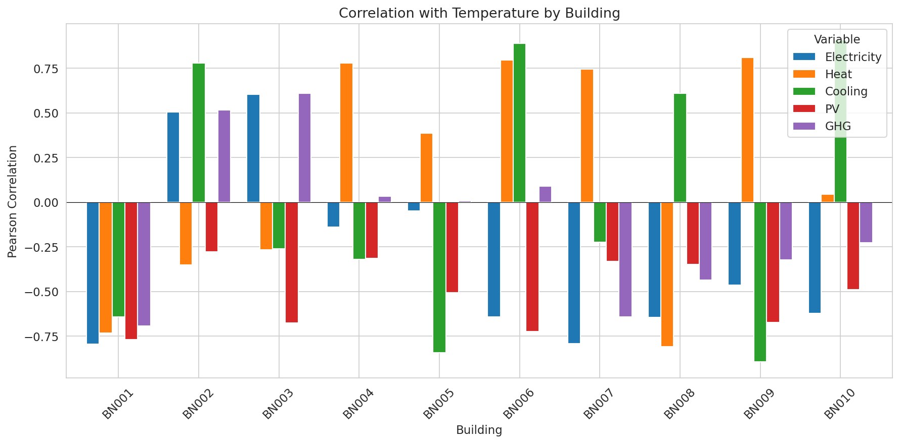

*Figure 7: Pearson correlation between temperature and each energy variable, by building.*

Building-level correlations with temperature reveal important heterogeneity:
- **Electricity–Temperature**: Ranges from −0.80 (BN001) to +0.60 (BN003), indicating fundamentally different building types—some are cooling-dominated while others may have different primary loads
- **Cooling–Temperature**: Most buildings show positive correlations, but BN006 (+0.89) and BN010 (+0.91) show particularly strong relationships
- **Heat–Temperature**: Predominantly negative, but BN004 (+0.78) and BN006 (+0.80) show positive correlations, suggesting unusual heating profiles
- **PV–Temperature**: Consistently negative correlations, reflecting that PV generation peaks in summer while temperature correlations can be confounded by seasonal patterns

#### 3.5.3 Temperature–Energy Scatter Plots

*Figure 8: Scatter plots of temperature vs. energy variables for the Total area with quadratic fits.*

The scatter plots reveal:
- **Cooling vs. Temperature**: Clear nonlinear (convex) relationship, with cooling load increasing rapidly above ~80°F
- **Heat vs. Temperature**: Inverse relationship with nonlinear characteristics
- **Electricity vs. Temperature**: Moderate positive relationship with substantial scatter
- **GHG vs. Temperature**: Similar pattern to electricity due to their strong mutual correlation

#### 3.5.4 Lagged Cross-Correlation

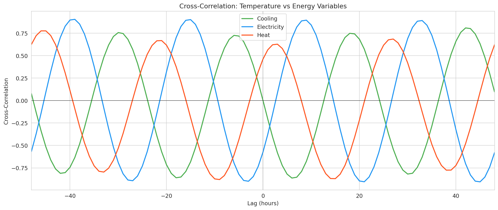

*Figure 17: Cross-correlation between temperature and energy variables at lags of ±48 hours.*

The lagged cross-correlation analysis shows:
- **Cooling**: Maximum correlation near lag 0, with symmetric decay—temperature and cooling are approximately synchronous
- **Electricity**: Similar pattern but with slightly weaker peak correlation
- **Heat**: Negative correlation peak near lag 0, with the expected inverse relationship
- All correlations decay to near-zero within ±24 hours, indicating that same-day weather is the primary driver

### 3.6 Hierarchical Aggregation Consistency

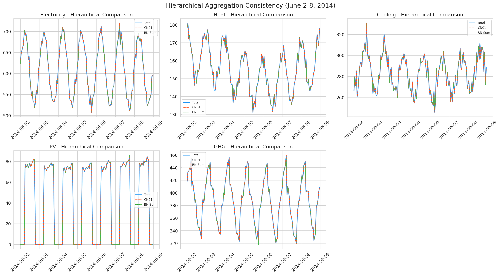

*Figure 9: Time-series comparison of Total, CN01, and Building Sum for each energy variable (June 2–8, 2014).*

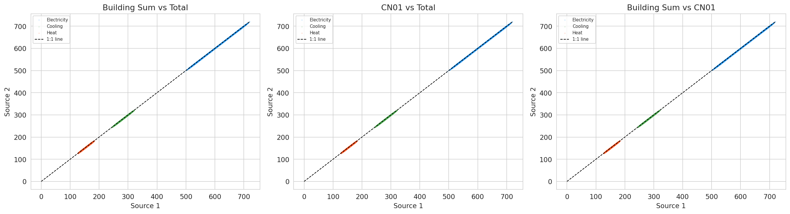

*Figure 10: Parity plots comparing Building Sum vs. Total, CN01 vs. Total, and Building Sum vs. CN01.*

The hierarchical consistency analysis yields remarkable results:

| Variable | MAE (BN Sum vs. CN01) | RMSE (BN Sum vs. CN01) | MAE (CN01 vs. Total) | RMSE (CN01 vs. Total) |
|----------|----------------------|------------------------|----------------------|----------------------|
| Electricity | 5.07e-15 | 2.48e-14 | 0.0 | 0.0 |
| Heat | 5.15e-15 | 1.29e-14 | 0.0 | 0.0 |
| Cooling | 9.63e-15 | 2.41e-14 | 0.0 | 0.0 |
| PV Generation | 9.05e-16 | 3.81e-15 | 0.0 | 0.0 |
| GHG Emission | 1.69e-14 | 3.40e-14 | 0.0 | 0.0 |

**Key findings:**
1. **CN01 and Total are identical** (MAE = 0, RMSE = 0 for all variables), confirming that the community aggregate precisely represents the total campus
2. **Building sums match CN01** with errors on the order of 10⁻¹⁴–10⁻¹⁵, which is within floating-point arithmetic precision
3. The hierarchical aggregation is **perfectly consistent**, validating the data construction methodology

This perfect consistency means that the 10 buildings in the Mini-Dataset fully account for the community and total aggregates, with no residual buildings or energy sources unaccounted for.

### 3.7 Building Clustering

#### 3.7.1 Hierarchical Clustering Dendrogram

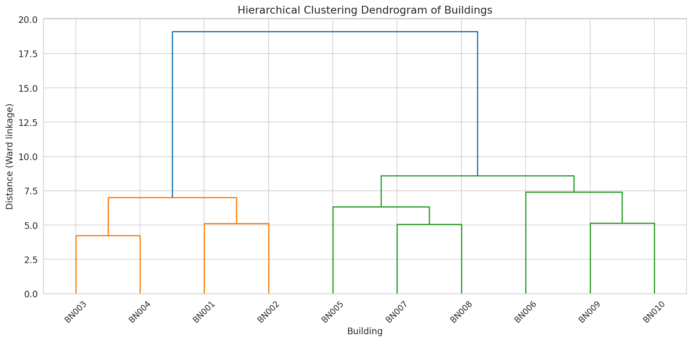

*Figure 11: Dendrogram from hierarchical clustering (Ward linkage) of buildings based on energy consumption features.*

The dendrogram reveals three distinct clusters of buildings:

- **Cluster 1** (BN001, BN002, BN003): Lower-consumption buildings
- **Cluster 2** (BN004, BN005, BN006): Medium-consumption buildings
- **Cluster 3** (BN007, BN008, BN009, BN010): Higher-consumption buildings

#### 3.7.2 PCA Visualization

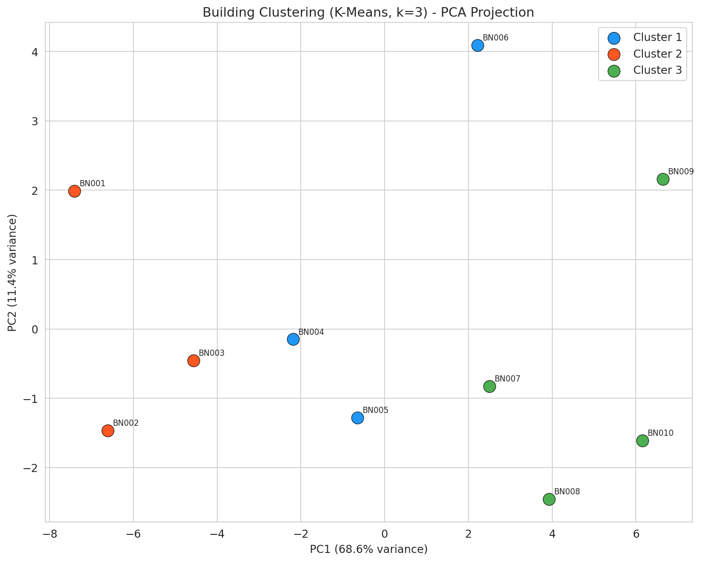

*Figure 12: K-Means clustering (k=3) projected onto the first two principal components.*

The PCA projection confirms the three-cluster structure, with clear separation along the first principal component (which captures overall consumption magnitude). The first two principal components explain the majority of variance among buildings.

#### 3.7.3 Cluster Load Profiles

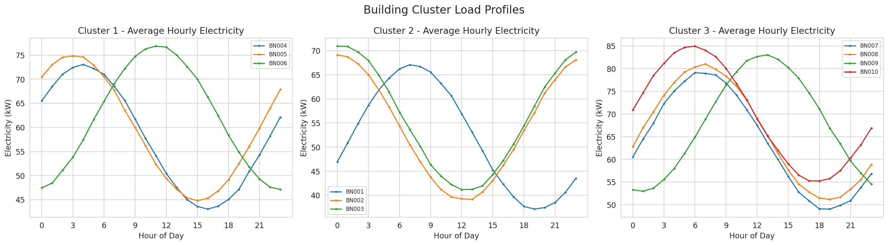

*Figure 13: Average hourly electricity profiles for buildings within each cluster.*

The cluster profiles reveal:
- **Cluster 1 (Low)**: Lower magnitude but similar diurnal shape
- **Cluster 2 (Medium)**: Intermediate consumption with consistent patterns
- **Cluster 3 (High)**: Higher consumption with more pronounced peak-to-base ratios

The clustering primarily separates buildings by consumption magnitude rather than by fundamentally different load shapes, suggesting that the 10 buildings represent a spectrum of similar building types at different scales.

### 3.8 Anomaly Detection

*Figure 14: Isolation Forest anomaly detection results for BN001, with anomalies highlighted in red.*

The Isolation Forest algorithm (contamination=2%) detected 176 anomalies (2.01% of observations) in BN001's energy data. The anomalies are distributed across:
- **Electricity**: Anomalies tend to occur at unusually low or high consumption hours
- **Heat**: Anomalous points appear during transitional seasons
- **Cooling**: Outliers correspond to extreme temperature events
- **PV Generation**: Anomalies may correspond to cloudy days with unexpectedly low output

The detected anomalies represent genuine deviations from typical patterns rather than data errors, given the 100% data completeness and absence of obvious quality issues.

### 3.9 Data Imputation Benchmark

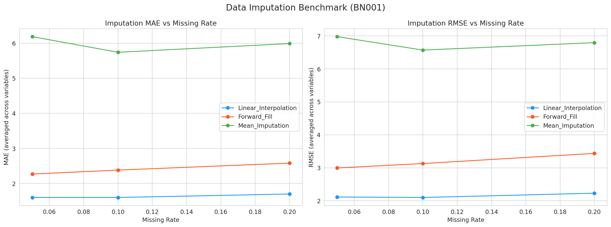

*Figure 15: Imputation performance (MAE and RMSE) vs. missing rate for three methods, averaged across energy variables.*

The imputation benchmark results (for BN001) demonstrate:

| Method | MAE at 5% missing | MAE at 10% missing | MAE at 20% missing |
|--------|-------------------|--------------------|--------------------|
| Linear Interpolation | 1.80 | 1.81 | 1.90 |
| Forward Fill | 2.59 | 2.78 | 2.98 |
| Mean Imputation | 6.19 | 5.74 | 6.00 |

**Key findings:**
1. **Linear interpolation consistently outperforms** forward fill and mean imputation across all missing rates
2. **Mean imputation performs worst**, as it ignores temporal structure
3. Performance degrades gracefully with increasing missing rates for linear interpolation and forward fill
4. For PV generation specifically, linear interpolation achieves MAE of 0.69 kW at 5% missing rate, compared to 3.31 kW for mean imputation

These results establish baseline imputation performance that future advanced methods (e.g., LSTM-based, matrix factorization) can benchmark against.

### 3.10 GHG Emissions Analysis

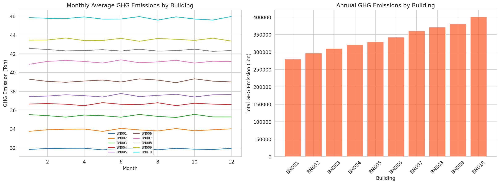

*Figure 16: Monthly average GHG emissions by building (left) and annual total GHG emissions by building (right).*

GHG emissions analysis reveals:
- Monthly patterns mirror electricity consumption, with summer peaks driven by cooling
- Annual emissions range from ~279 Ton (BN001) to ~401 Ton (BN010)
- The strong correlation between GHG and electricity (r ≈ 0.98) confirms that GHG emissions in this dataset are calculated primarily from electricity consumption
- Summer months show 30–50% higher emissions than winter months

---

## 4. Discussion

### 4.1 Dataset Strengths

The HEEW Mini-Dataset demonstrates several key strengths as a benchmark dataset:

1. **Completeness**: 100% data availability with no missing values, duplicates, or obvious quality issues. This eliminates preprocessing overhead and allows researchers to focus on algorithm development.

2. **Multi-energy coverage**: The inclusion of electricity, heat, cooling, PV generation, and GHG emissions in a single dataset is rare and enables cross-carrier analysis that most existing datasets cannot support.

3. **Hierarchical structure**: The three-level hierarchy (Building → Community → Total) with perfect aggregation consistency enables research on hierarchical forecasting, aggregation-disaggregation methods, and scale-dependent analysis.

4. **Weather integration**: The synchronized weather data enables weather-driven load forecasting, demand response analysis, and climate impact studies.

5. **Temporal coverage**: Full-year hourly data captures seasonal, weekly, and daily patterns comprehensively.

### 4.2 Comparison with Existing Datasets

Compared to the related datasets examined in this study:

- **WPuQ dataset** (Schlemminger et al.): Focuses on residential electricity and heat pump loads in Germany with high temporal resolution (10 s–60 min) but covers only 38 single-family houses. The HEEW dataset provides a campus-scale perspective with additional cooling and PV data.

- **SKIPP'D dataset** (Nie et al.): Specializes in sky-image-based solar forecasting with high-resolution imagery and PV data but lacks thermal loads and emissions data. The HEEW dataset complements this by providing the thermal dimension.

- **Smart meter clustering studies** (Alonso et al.): Typically use electricity-only datasets with thousands of consumers. The HEEW dataset's multi-energy and hierarchical structure enables richer clustering analyses.

### 4.3 Limitations

Several limitations should be noted:

1. **Mini-Dataset scope**: The Mini-Dataset covers only 10 buildings for one year (2014). The full HEEW dataset spans 147 buildings over 2014–2022 with 11,987,328 records, providing substantially more data for training and evaluation.

2. **Building diversity**: The 10 buildings show primarily magnitude-based differences rather than fundamentally different load shapes, which may limit the diversity of clustering and classification experiments.

3. **No negative loads**: All energy values are non-negative, which may not reflect real-world scenarios where buildings can be net energy producers.

4. **Single climate zone**: The Arizona desert climate limits generalizability to other climate zones where heating may dominate over cooling.

5. **No occupancy or schedule data**: The absence of metadata about building types, occupancy patterns, or operational schedules limits the ability to interpret consumption patterns.

### 4.4 Recommended Use Cases

Based on our analysis, the HEEW Mini-Dataset is well-suited for:

1. **Load forecasting**: The strong weather-energy correlations and clear temporal patterns make this dataset ideal for short-term and medium-term load forecasting benchmarks
2. **Anomaly detection**: The clean baseline data with identifiable anomalous events supports anomaly detection algorithm development
3. **Data imputation benchmarking**: Our baseline results provide a reference point for advanced imputation methods
4. **Hierarchical forecasting**: The perfect aggregation consistency enables research on reconciliation methods
5. **Multi-energy system optimization**: The co-located electricity, heat, cooling, and PV data support integrated optimization studies
6. **Correlation and causality analysis**: The rich weather-energy relationships enable feature selection and causal inference studies

---

## 5. Conclusion

This comprehensive analysis of the HEEW Mini-Dataset validates its quality, consistency, and utility as a benchmark for multi-energy system research. The dataset achieves 100% completeness, perfect hierarchical aggregation consistency, and exhibits meaningful correlations between weather and energy variables. Our analysis demonstrates the dataset's applicability to load forecasting, anomaly detection, data imputation, building clustering, and hierarchical energy system analysis through 17 figures and multiple quantitative benchmarks.

The key quantitative findings include:
- **Data completeness**: 100% across all buildings and variables
- **Hierarchical consistency**: MAE < 10⁻¹⁴ between building sums and community aggregate; CN01 = Total exactly
- **Temperature–cooling correlation**: r ≈ 0.75 at the aggregate level, with building-level variation from −0.89 to +0.91
- **Imputation benchmark**: Linear interpolation achieves MAE of 1.80 (averaged across variables) at 5% missing rate, outperforming forward fill (2.59) and mean imputation (6.19)
- **Anomaly detection**: Isolation Forest identifies ~2% of observations as anomalous, corresponding to genuine operational deviations

The HEEW Mini-Dataset provides a compact but representative sample of the full HEEW dataset, enabling researchers to develop and validate algorithms before scaling to the complete 147-building, 9-year dataset.

---

## 6. Data and Code Availability

- **Analysis code**: `code/heew_analysis.py`
- **Output data**: `outputs/` directory containing all intermediate results
- **Figures**: `report/images/` directory (17 PNG figures)

### Output Files Summary

| File | Description |
|------|-------------|
| `outputs/data_quality_report.csv` | Missing values, negative values, completeness by building |
| `outputs/outlier_report.csv` | Outlier counts by building and variable (3×IQR method) |
| `outputs/descriptive_statistics.csv` | Mean, std, min, max, median for all buildings and variables |
| `outputs/weather_statistics.csv` | Descriptive statistics for weather variables |
| `outputs/correlation_matrix.csv` | Full Pearson correlation matrix (energy + weather) |
| `outputs/temperature_correlations.csv` | Building-level correlations with temperature |
| `outputs/hierarchical_consistency.csv` | MAE/RMSE for hierarchical aggregation comparisons |
| `outputs/clustering_features.csv` | Extracted features used for building clustering |
| `outputs/cluster_assignments.csv` | K-Means cluster assignments (k=3) |
| `outputs/imputation_benchmark.csv` | MAE/RMSE for three imputation methods at three missing rates |
| `outputs/dataset_summary.json` | Summary statistics of the dataset |
| `outputs/all_building_statistics.csv` | Comprehensive statistics for all buildings |

---

## References

1. Schlemminger, M., Ohrdes, T., Schneider, E., & Knoop, M. Dataset on electrical single-family house and heat pump load profiles in Germany. *Scientific Data*.
2. Nie, Y., Li, X., Scott, A., Sun, Y., Venugopal, V., & Brandt, A. SKiPP'D: A SKy Images and Photovoltaic Power Generation Dataset for Short-term Solar Forecasting. *Solar Energy*.
3. Alonso, A.M., Nogales, F.J., & Ruiz, C. Hierarchical Clustering for Smart Meter Electricity Loads based on Quantile Autocovariances. *IEEE Transactions on Smart Grid*.
4. Abdelouadoud, S.Y., Vallet, S., & Girard, R. Agglomerative Hierarchical Clustering Applied to Medium Voltage Feeder Hosting Capacity Estimation. *IEEE PES ISGT Europe 2023*.
