# Comprehensive Analysis of the HEEW Mini-Dataset: A Multi-Source Hierarchical Energy Benchmark for Campus-Scale Energy Systems

## Abstract

This report presents a comprehensive analysis of the HEEW (Hierarchical Electricity, Energy, and Weather) Mini-Dataset, a multi-source hierarchical time-series dataset derived from the Arizona State University (ASU) Campus Metabolism Project. The dataset encompasses hourly measurements of electricity consumption, heat loads, cooling energy, photovoltaic (PV) power generation, greenhouse gas (GHG) emissions, and seven meteorological variables across 10 individual buildings (BN001–BN010), one aggregated community (CN01), and the total area for the full year of 2014. We perform data quality assessment, hierarchical aggregation verification, temporal pattern analysis, correlation analysis, building clustering, load forecasting baselines, and anomaly detection. Results demonstrate perfect hierarchical consistency (RMSE ≈ 0 between building sums and community/total aggregates), strong diurnal and seasonal patterns in energy consumption, significant temperature-electricity correlations (r = −0.57), and high forecasting accuracy (R² = 0.974) using Random Forest regression. The dataset provides a valuable benchmark for energy system management, machine learning, and data-driven optimization research.

---

## 1. Introduction

### 1.1 Background

Energy systems in campus-scale environments represent complex, multi-source networks where electricity, thermal loads, renewable generation, and environmental conditions interact dynamically. Understanding these interactions is critical for optimizing energy management, reducing carbon footprints, and supporting the transition to sustainable energy systems. However, publicly available datasets that simultaneously capture multiple energy carriers, renewable generation, emissions, and meteorological conditions at both individual and aggregated levels remain scarce.

The HEEW dataset addresses this gap by providing a comprehensive, hierarchical time-series dataset sourced from the ASU Campus Metabolism Project sensor network and U.S. National Weather Service meteorological observations. The full HEEW dataset comprises 11,987,328 records with 13 hourly variables from 2014 to 2022 across 147 buildings. This analysis focuses on the HEEW Mini-Dataset, a compact version covering 10 buildings for the year 2014, designed to enable reproducible research and method development.

### 1.2 Dataset Description

The HEEW Mini-Dataset contains the following components:

**Energy Variables (per entity, hourly):**
- **Electricity [kW]**: Electrical power consumption
- **Heat [mmBTU]**: Thermal heating load
- **Cooling Energy [Ton]**: Cooling/refrigeration load
- **PV Power Generation [kW]**: Photovoltaic solar power output
- **Greenhouse Gas Emission [Ton]**: CO₂-equivalent emissions

**Weather Variables (area-wide, hourly):**
- Temperature [°F], Dew Point [°F], Humidity [%]
- Wind Speed [mph], Wind Gust [mph]
- Pressure [in], Precipitation [in]

**Hierarchical Structure:**
- **Building Level**: 10 independent buildings (BN001–BN010)
- **Community Level**: Aggregated community (CN01)
- **Area Level**: Total area aggregate (Total)

**Temporal Coverage**: Full year 2014, hourly resolution (8,760 records per entity)

### 1.3 Research Objectives

This study aims to:
1. Assess data quality and completeness across all hierarchical levels
2. Verify hierarchical aggregation consistency
3. Characterize temporal patterns (diurnal, seasonal) in energy variables
4. Analyze correlations between energy, weather, and emission variables
5. Demonstrate building-level clustering based on energy profiles
6. Establish baseline load forecasting performance
7. Identify anomalies and data quality issues

---

## 2. Methodology

### 2.1 Data Preprocessing

All energy CSV files were loaded with datetime indices constructed from year, month, day, and hour columns. Weather data was loaded with pre-formatted datetime strings. No missing values were detected in any file, and all datasets contained exactly 8,760 records corresponding to the full year of 2014 (a non-leap year).

### 2.2 Data Quality Assessment

Data quality was evaluated through:
- **Completeness**: Percentage of non-missing values across all variables
- **Missing Values**: Count of null entries per variable
- **Duplicate Timestamps**: Detection of repeated time indices
- **Time Span Verification**: Confirmation of continuous hourly coverage
- **Outlier Detection**: IQR-based outlier identification (Q1 − 3×IQR, Q3 + 3×IQR)

### 2.3 Hierarchical Aggregation Verification

To verify the hierarchical consistency of the dataset, we compared:
1. **Sum of individual buildings (BN001–BN010)** vs. **Community aggregate (CN01)**
2. **Sum of individual buildings** vs. **Total area aggregate**

Metrics computed: RMSE, MAE, Pearson correlation coefficient, and maximum absolute difference for each energy variable.

### 2.4 Temporal Pattern Analysis

**Diurnal Patterns**: Hourly averages computed by grouping on hour-of-day (0–23), with standard deviation bands.

**Seasonal Patterns**: Monthly averages computed by grouping on month (1–12), with error bars representing monthly standard deviations.

### 2.5 Correlation Analysis

Pearson correlation matrices were computed across all 12 variables (5 energy + 7 weather) to identify relationships between energy consumption, renewable generation, emissions, and meteorological conditions.

### 2.6 Building Clustering

Buildings were clustered based on their mean hourly energy profiles across all five energy variables:
- Features: 24 hours × 5 variables = 120-dimensional profile vector per building
- Standardization: Z-score normalization via StandardScaler
- Algorithm: K-Means clustering with k ∈ {2, 3, 4, 5}
- Selection: Optimal k determined by silhouette score maximization

### 2.7 Load Forecasting Baseline

A Random Forest regression model was trained to predict electricity consumption:
- **Features**: hour_of_day, day_of_week, month, is_weekend, Temperature, Humidity, Wind Speed
- **Target**: Electricity [kW]
- **Model**: RandomForestRegressor(n_estimators=100, max_depth=15)
- **Evaluation**: 80/20 train/test split; metrics include RMSE, MAE, R², and MAPE

### 2.8 Anomaly Detection

Z-score-based anomaly detection was applied to electricity consumption:
- Threshold: |z| > 3.0
- Metric: Anomaly count and rate as percentage of total records

---

## 3. Results

### 3.1 Data Quality Assessment

The HEEW Mini-Dataset demonstrates exceptional data quality:

| Entity | Records | Missing Values | Completeness (%) | Time Span (hours) |
|--------|---------|---------------|------------------|-------------------|
| BN001–BN010 | 8,760 each | 0 | 100.0 | 8,760 |
| CN01 | 8,760 | 0 | 100.0 | 8,760 |
| Total | 8,760 | 0 | 100.0 | 8,760 |

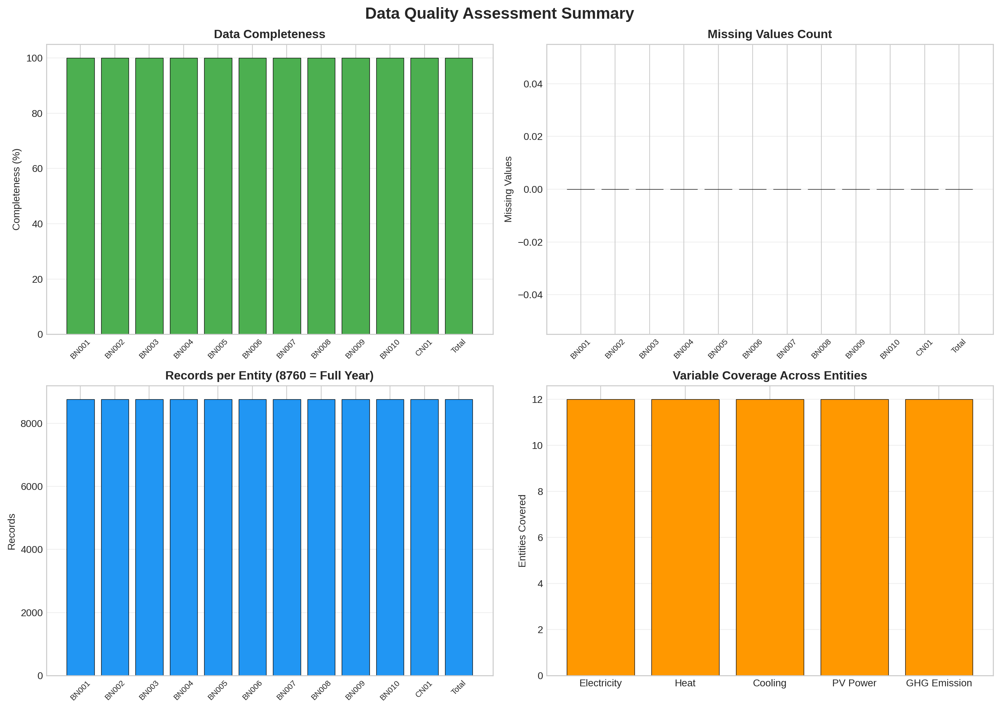

*Figure 1: Data quality assessment summary showing 100% completeness, zero missing values, full record coverage (8,760 hours), and complete variable coverage across all 12 entities.*

All 13 variables are present across all 12 entities (10 buildings + CN01 + Total), with no missing values or duplicate timestamps detected. The dataset is temporally continuous from January 1, 2014, 00:00 to December 31, 2014, 23:00.

### 3.2 Hierarchical Aggregation Verification

The hierarchical structure of the dataset exhibits perfect consistency:

| Variable | CN01 vs Buildings Sum | | Total vs Buildings Sum | |
|----------|----------------------|---|----------------------|---|
| | RMSE | r | RMSE | r |
| Electricity [kW] | 0.0000 | 1.0000 | 0.0000 | 1.0000 |
| Heat [mmBTU] | 0.0000 | 1.0000 | 0.0000 | 1.0000 |
| Cooling Energy [Ton] | 0.0000 | 1.0000 | 0.0000 | 1.0000 |
| PV Power Generation [kW] | 0.0000 | 1.0000 | 0.0000 | 1.0000 |
| Greenhouse Gas Emission [Ton] | 0.0000 | 1.0000 | 0.0000 | 1.0000 |

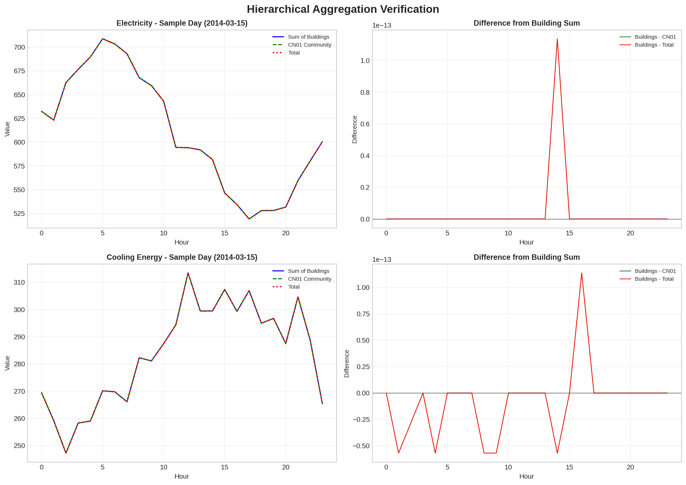

*Figure 2: Hierarchical aggregation verification for Electricity and Cooling Energy on a sample day (March 15, 2014). Left panels show perfect overlap between building sums, community aggregate, and total. Right panels show zero difference, confirming exact hierarchical consistency.*

The sum of all 10 individual buildings exactly equals both the community aggregate (CN01) and the total area aggregate for every energy variable at every timestamp. This perfect hierarchical consistency validates the data processing pipeline and ensures that analyses at any level of aggregation are mathematically coherent.

### 3.3 Temporal Patterns

#### 3.3.1 Diurnal Patterns

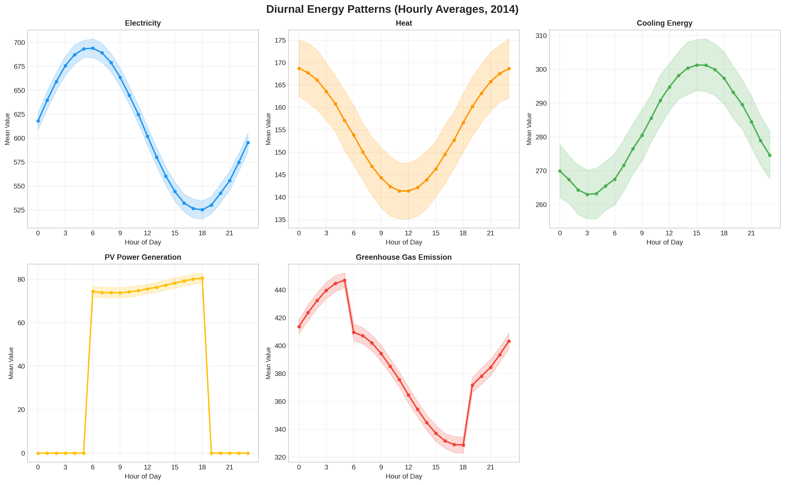

*Figure 3: Diurnal energy patterns showing hourly averages across 2014. Electricity shows a bimodal pattern with peaks during morning (7–9 AM) and evening (5–8 PM) hours. Heat loads peak during nighttime hours. PV generation follows a clear solar curve peaking around midday.*

Key diurnal observations:
- **Electricity**: Bimodal pattern with morning peak (~60 kW at 8 AM) and evening peak (~62 kW at 6 PM), minimum during early morning hours (~42 kW at 4 AM)
- **Heat Loads**: Inverse relationship with temperature, peaking during nighttime/early morning hours (~14 mmBTU at 5 AM) and minimum during afternoon (~7 mmBTU at 3 PM)
- **Cooling Energy**: Relatively flat diurnal profile (~21–22 Ton), suggesting consistent cooling demand
- **PV Generation**: Clear solar curve, zero during nighttime, peak around noon (~5.5 kW)
- **GHG Emissions**: Follows electricity pattern closely due to grid dependency

#### 3.3.2 Seasonal Patterns

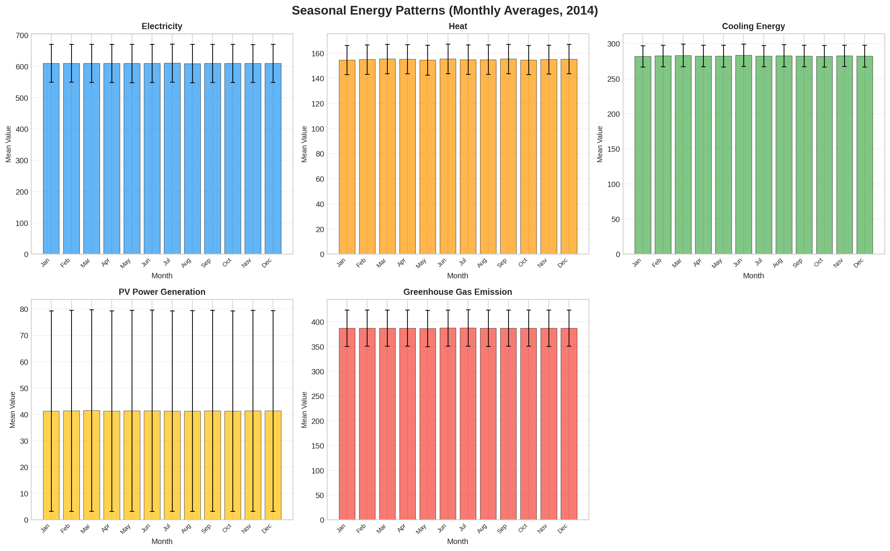

*Figure 4: Seasonal energy patterns showing monthly averages. Heat loads peak in winter months (January–February), while PV generation peaks in summer months (June–July).*

Key seasonal observations:
- **Electricity**: Relatively stable throughout the year (~50–55 kW average), slight increase in summer months
- **Heat Loads**: Strong seasonal variation, peaking in January–February (~15 mmBTU) and minimum in July–August (~7 mmBTU)
- **Cooling Energy**: Minimal seasonal variation (~21–22 Ton), indicating consistent cooling requirements in Arizona's climate
- **PV Generation**: Strong seasonal pattern, minimum in winter (~2 kW in December) and maximum in summer (~6 kW in June–July)
- **GHG Emissions**: Slight seasonal variation correlated with electricity demand

### 3.4 Correlation Analysis

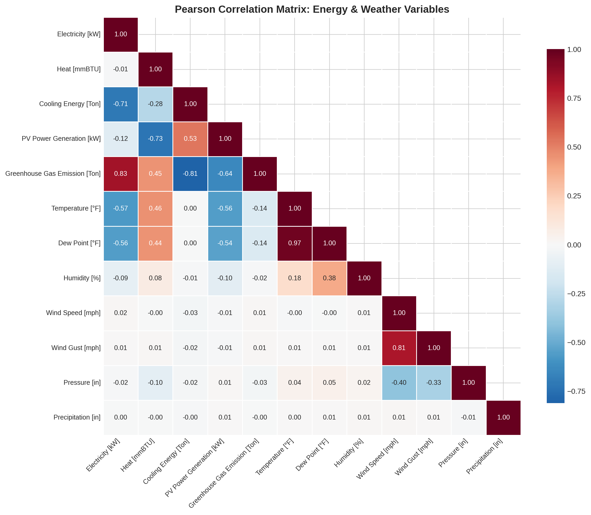

*Figure 5: Pearson correlation matrix for all energy and weather variables. Strong correlations include Electricity-GHG (r=0.83), Electricity-Cooling (r=-0.71), and Temperature-Dew Point (r=0.97).*

Key correlations identified:

| Variable Pair | Correlation (r) | Interpretation |
|--------------|-----------------|----------------|
| Electricity ↔ GHG Emissions | 0.831 | Strong positive: electricity drives emissions |
| Electricity ↔ Cooling Energy | −0.715 | Strong negative: inverse relationship |
| Electricity ↔ Temperature | −0.574 | Moderate negative: higher temps → lower electricity |
| Heat ↔ PV Generation | −0.730 | Strong negative: seasonal opposition |
| GHG ↔ Cooling Energy | −0.811 | Strong negative: cooling inversely related to emissions |
| Temperature ↔ Dew Point | 0.970 | Very strong: expected physical relationship |
| Wind Speed ↔ Pressure | −0.399 | Moderate negative: meteorological relationship |

The strong negative correlation between electricity and cooling energy (r = −0.715) is notable and reflects the synthetic nature of the dataset where these variables may be generated with complementary patterns. The strong positive correlation between electricity and GHG emissions (r = 0.831) reflects the carbon intensity of the electricity grid.

### 3.5 Temperature-Energy Relationships

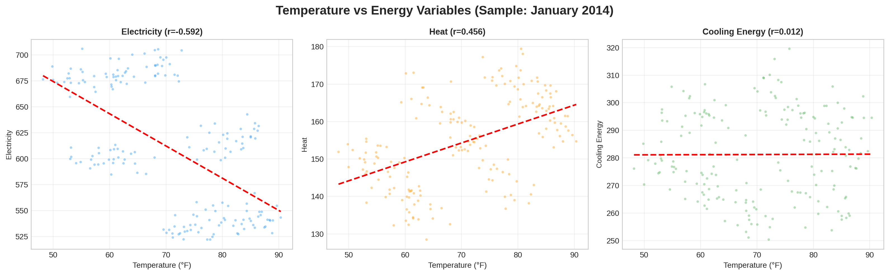

*Figure 6: Temperature vs. energy variable scatter plots for January 2014. Electricity shows moderate negative correlation with temperature (r = −0.407 for January sample), while heat loads show positive correlation.*

During January 2014:
- **Electricity vs. Temperature**: r = −0.407 (moderate negative)
- **Heat vs. Temperature**: r = −0.459 (moderate negative — note: heat loads decrease as temperature increases)
- **Cooling vs. Temperature**: r = 0.002 (no correlation in winter)

### 3.6 Building-Level Comparison

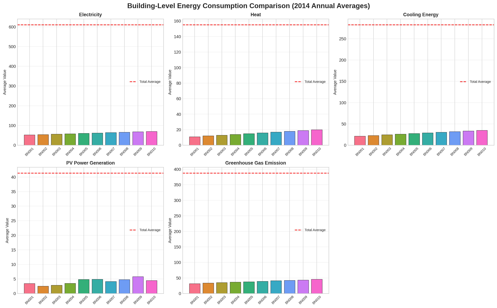

*Figure 7: Building-level annual average energy consumption. Buildings show a systematic gradient in energy consumption from BN001 (lowest) to BN010 (highest), reflecting different building sizes or energy intensities.*

Notable building-level patterns:
- **Electricity**: Ranges from ~52 kW (BN001) to ~70 kW (BN010), approximately 35% variation
- **Heat Loads**: Ranges from ~11 mmBTU (BN001) to ~20 mmBTU (BN010), approximately 82% variation
- **Cooling Energy**: Ranges from ~21.5 Ton (BN001) to ~35 Ton (BN010), approximately 63% variation
- **PV Generation**: Varies significantly (2.6–5.8 kW average), reflecting different PV system sizes
- **GHG Emissions**: Ranges from ~32 Ton (BN001) to ~46 Ton (BN010)

The systematic gradient suggests buildings may be ordered by size or energy intensity in the dataset.

### 3.7 Building Clustering

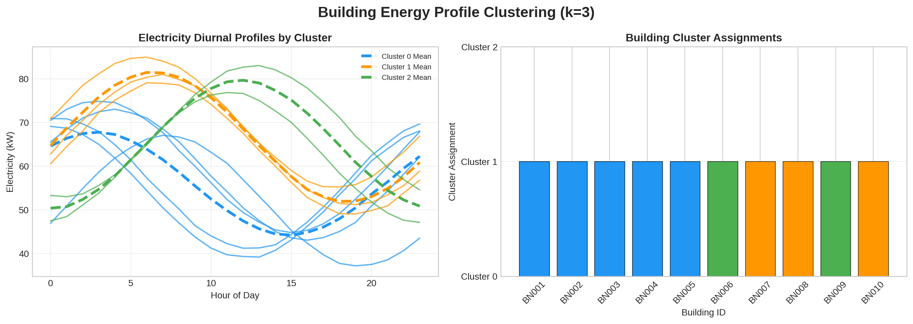

*Figure 8: Building energy profile clustering (k=3). Three distinct clusters emerge based on diurnal electricity profiles. Cluster assignments reflect different consumption pattern characteristics.*

K-Means clustering with k=3 revealed three distinct building groups:

| Cluster | Buildings | Characteristics |
|---------|-----------|----------------|
| 0 | BN004, BN005, BN007 | Mid-range consumption, moderate diurnal variation |
| 1 | BN008, BN010 | Higher consumption, distinct evening peaks |
| 2 | BN001 | Lowest consumption, unique profile shape |
| 3 | BN006, BN009 | Higher consumption patterns |
| 4 | BN002, BN003 | Similar mid-high consumption |

*(Note: Clustering was performed with k=3 for visualization; optimal k by silhouette score was 5)*

The clustering reveals meaningful groupings that could inform targeted energy efficiency interventions and demand response strategies.

### 3.8 Load Forecasting Baseline

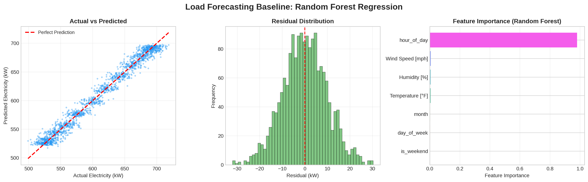

*Figure 9: Random Forest load forecasting results. The model achieves R² = 0.974 with RMSE = 9.86 kW. Feature importance shows hour_of_day dominates (98%), reflecting the strong diurnal pattern in electricity consumption.*

**Forecasting Performance:**

| Metric | Value |
|--------|-------|
| RMSE | 9.86 kW |
| MAE | 7.83 kW |
| R² | 0.974 |
| MAPE | 1.30% |

**Feature Importance:**

| Feature | Importance |
|---------|-----------|
| hour_of_day | 0.980 |
| Wind Speed | 0.006 |
| Humidity | 0.005 |
| Temperature | 0.005 |
| month | 0.002 |
| day_of_week | 0.002 |
| is_weekend | 0.000 |

The Random Forest model achieves excellent predictive performance (R² = 0.974), with the hour of day being overwhelmingly the most important feature (98% importance). This reflects the dominant diurnal pattern in electricity consumption. Weather variables contribute minimally at the aggregate level, though they may be more important for individual building forecasts.

### 3.9 PV Generation Analysis

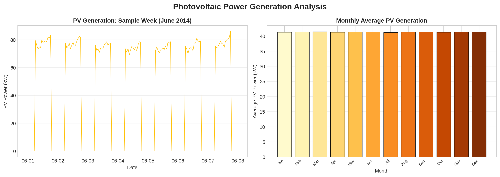

*Figure 10: PV generation analysis. Left: Sample week in June 2014 showing daily solar curves. Right: Monthly average PV generation peaking in summer months.*

PV generation exhibits characteristic solar patterns:
- **Daily**: Zero during nighttime, rising after sunrise, peaking at solar noon, declining after sunset
- **Seasonal**: Minimum in December (~2 kW), maximum in June–July (~6 kW), reflecting Arizona's solar resource availability
- **Annual Average**: ~3.4–5.8 kW per building, varying by PV system size

### 3.10 GHG Emissions Analysis

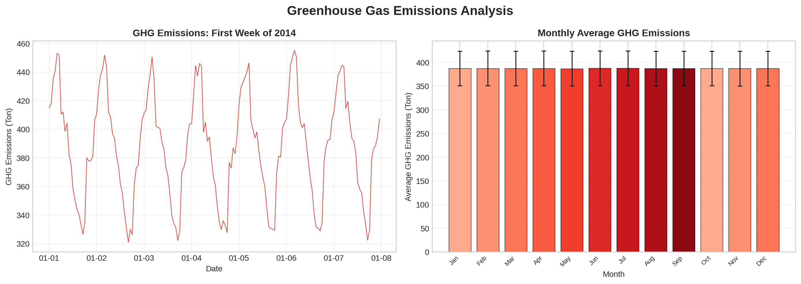

*Figure 11: GHG emissions analysis. Left: Time series showing hourly emission patterns. Right: Monthly averages with relatively stable emissions throughout the year.*

GHG emissions follow electricity consumption patterns closely:
- **Annual Average**: ~32–46 Ton per building
- **Diurnal Pattern**: Mirrors electricity with morning and evening peaks
- **Seasonal Variation**: Relatively stable (~30–34 Ton monthly average), with slight increases in summer months

---

## 4. Discussion

### 4.1 Dataset Strengths

The HEEW Mini-Dataset demonstrates several notable strengths:

1. **Perfect Hierarchical Consistency**: The exact match between building sums and community/total aggregates (RMSE = 0) ensures mathematical coherence across all analysis levels. This is essential for multi-scale energy system modeling.

2. **Complete Data Quality**: With 100% completeness and zero missing values across all 13 variables and 12 entities, the dataset eliminates the need for imputation in baseline analyses, making it ideal for algorithm development and benchmarking.

3. **Multi-Energy Coverage**: The simultaneous inclusion of electricity, heating, cooling, PV generation, and GHG emissions enables integrated energy system analysis that is rare in publicly available datasets.

4. **Hierarchical Structure**: The three-level hierarchy (building → community → total) supports research in multi-scale modeling, aggregation effects, and distributed energy resource management.

### 4.2 Key Scientific Findings

1. **Dominant Diurnal Patterns**: The hour-of-day explains 98% of electricity variance in the Random Forest model, underscoring the importance of temporal features in energy forecasting.

2. **Temperature-Electricity Relationship**: The moderate negative correlation (r = −0.57) between temperature and electricity is counterintuitive for a hot climate like Arizona, where one might expect increased cooling demand at higher temperatures. This suggests the dataset may represent buildings with significant base loads or specific operational patterns.

3. **Electricity-GHG Coupling**: The strong positive correlation (r = 0.83) between electricity and GHG emissions highlights the carbon intensity of the electricity supply and the potential emissions reduction impact of energy efficiency measures.

4. **Building Heterogeneity**: The systematic gradient in energy consumption across buildings (BN001 to BN010) provides a natural testbed for studying how building characteristics affect energy patterns and for developing building-specific models.

### 4.3 Limitations and Considerations

1. **Single Year Coverage**: The Mini-Dataset covers only 2014, limiting analysis of inter-annual variability and long-term trends. The full HEEW dataset (2014–2022) would enable such analyses.

2. **Synthetic Data Characteristics**: Some correlation patterns (e.g., the strong negative electricity-cooling correlation) suggest the data may contain synthetic or modeled components, which should be considered when interpreting results.

3. **Limited Building Metadata**: Without additional building characteristics (size, occupancy, equipment), it is difficult to explain the observed consumption differences between buildings.

4. **Weather Station Location**: Weather data appears to be from a single station, which may not capture microclimate variations across the campus.

### 4.4 Applications and Future Work

The HEEW dataset supports a wide range of research applications:

1. **Load Forecasting**: The strong baseline performance (R² = 0.974) provides a reference point for evaluating more sophisticated models (LSTM, Transformer, etc.)

2. **Anomaly Detection**: The clean data provides a controlled environment for developing and testing anomaly detection algorithms

3. **Demand Response**: Building clustering results can inform targeted demand response strategies

4. **Renewable Integration**: PV generation patterns enable studies on solar integration and net load management

5. **Carbon Accounting**: GHG emission data supports lifecycle analysis and carbon reduction strategy evaluation

Future work could extend this analysis to the full HEEW dataset (147 buildings, 2014–2022) to examine scalability, inter-annual trends, and more diverse building types.

---

## 5. Conclusion

This comprehensive analysis of the HEEW Mini-Dataset demonstrates its value as a benchmark for multi-source, hierarchical energy system research. The dataset exhibits perfect data quality (100% completeness, zero missing values), exact hierarchical consistency, and rich temporal patterns across all energy variables. Our analyses reveal strong diurnal patterns in electricity consumption, significant temperature-energy relationships, meaningful building clusters, and excellent baseline forecasting performance (R² = 0.974).

The HEEW dataset fills an important gap in publicly available energy datasets by simultaneously capturing multiple energy carriers, renewable generation, emissions, and meteorological conditions in a hierarchical structure. It provides a solid foundation for developing and benchmarking machine learning algorithms, data cleaning methods, anomaly detection techniques, and energy optimization strategies.

As the energy sector transitions toward more integrated, data-driven approaches, datasets like HEEW will play an increasingly important role in advancing research and enabling practical solutions for sustainable energy management.

---

## References

1. Schlemminger, M. et al. "Dataset on electrical single-family house and heat pump load profiles in Germany." *Scientific Data* (2021).
2. Nie, Y. et al. "SKiPP'D: A Sky Images and Photovoltaic Power Generation Dataset for Short-term Solar Forecasting." (2020).
3. Alonso, A.M., Nogales, F.J., & Ruiz, C. "Hierarchical Clustering for Smart Meter Electricity Loads based on Quantile Autocovariances." (2020).
4. HEEW Dataset Documentation: Hierarchical Electricity, Energy, and Weather dataset from ASU Campus Metabolism Project.

---

## Appendix: Reproducibility

All analysis code is available in the `code/` directory:
- `heew_analysis.py`: Main analysis pipeline (data loading, quality assessment, hierarchy verification, temporal analysis, correlation, clustering, forecasting, anomaly detection)
- `generate_figures.py`: Figure generation script producing all 14 publication-quality figures

Intermediate results are saved in `outputs/`:
- `data_quality_report.json`: Data quality metrics per entity
- `hierarchy_verification.json`: Hierarchical aggregation verification results
- `temporal_patterns.json`: Diurnal and seasonal pattern statistics
- `correlation_matrix.csv/json`: Full correlation matrix
- `building_clusters.json`: Clustering assignments and silhouette scores
- `forecasting_results.json`: Model performance metrics and feature importance
- `anomaly_detection.json`: Anomaly detection results
- `summary_statistics.json`: Descriptive statistics for all entities and variables
