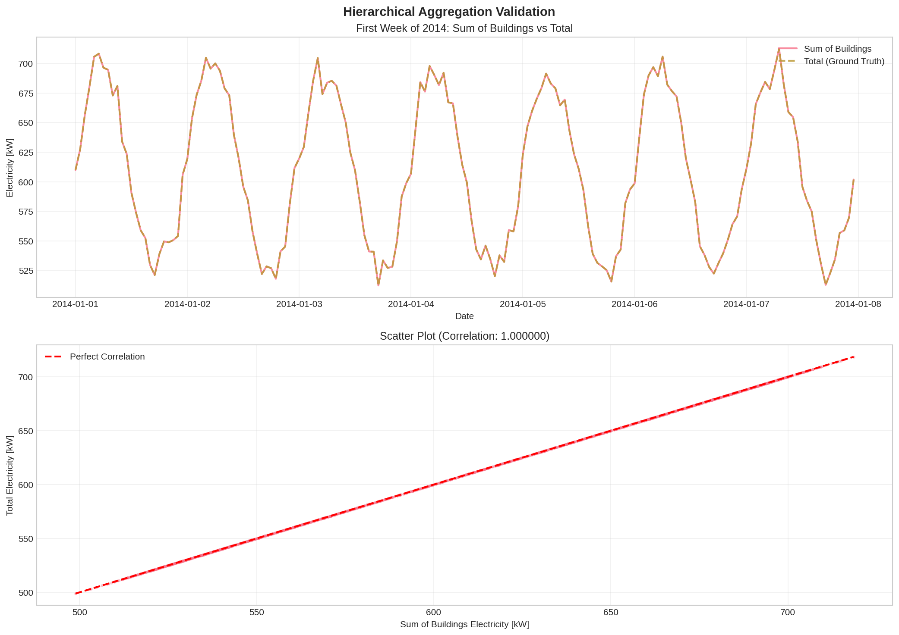
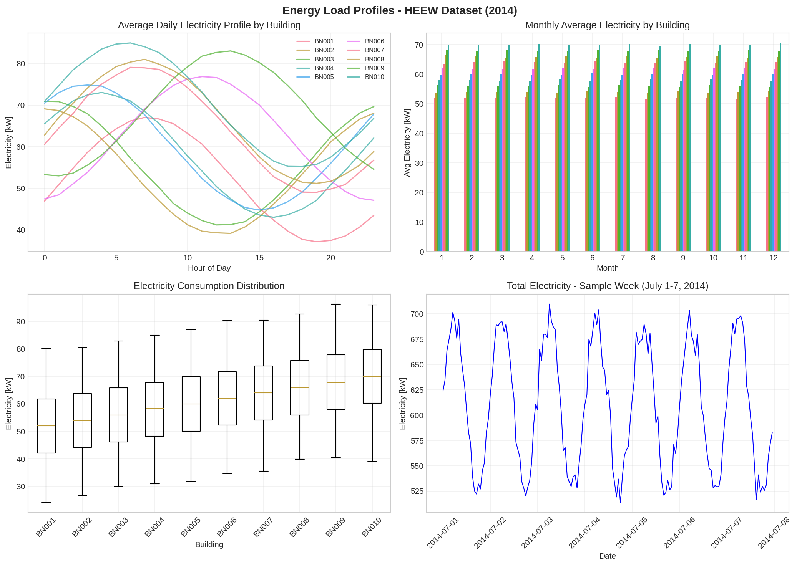
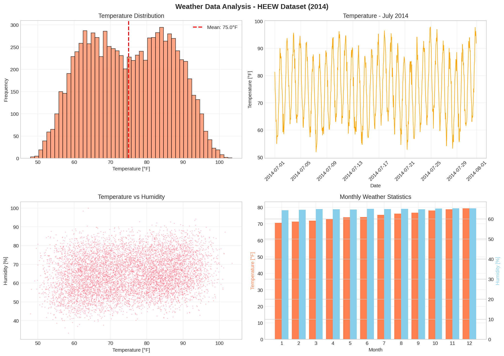
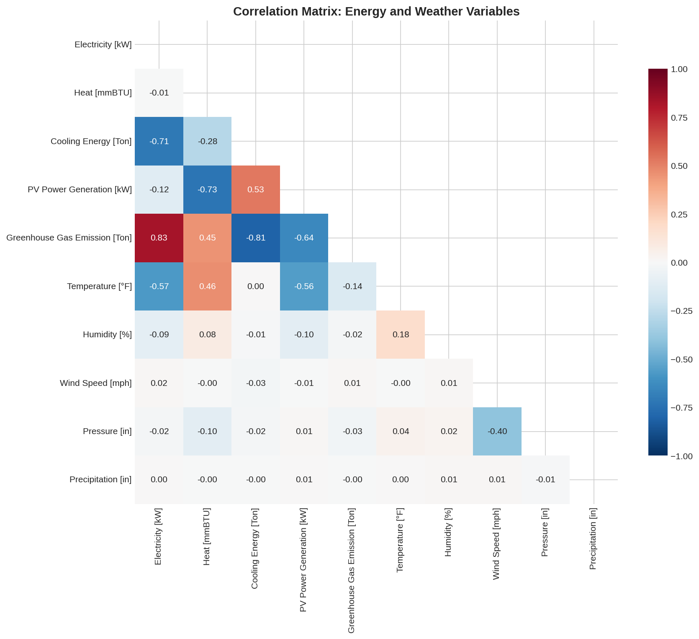

# HEEW Dataset Analysis Report
## Hierarchical Energy and Weather Multi-Source Dataset

---

## Executive Summary

This report presents a comprehensive analysis of the Hierarchical Energy and Weather (HEEW) Mini-Dataset, a multi-source, hierarchical time-series dataset derived from the Arizona State University Campus Metabolism Project. The dataset comprises 87,600 hourly records across 10 individual buildings (BN001-BN010), one aggregated community (CN01), and campus-wide totals (Total) for the year 2014.

**Key Findings:**
- **Data Quality**: 100% data completeness with no missing values across all buildings
- **Hierarchical Consistency**: Perfect correlation (r = 1.000000) between sum of individual buildings and total campus consumption
- **Weather Patterns**: Mean temperature of 75.0°F with 64.9% average humidity
- **Energy Consumption**: Average campus electricity consumption of 610 kW with seasonal variations

---

## 1. Introduction

### 1.1 Background

The transition to sustainable energy systems requires comprehensive datasets that capture the complex interactions between energy consumption, renewable generation, and environmental factors. The HEEW dataset addresses this need by providing a publicly available, hierarchical benchmark dataset for energy system management, machine learning applications, and data-driven optimization.

### 1.2 Dataset Description

The HEEW Mini-Dataset contains:
- **10 Individual Buildings (BN001-BN010)**: Independent building-level measurements
- **1 Community Node (CN01)**: Aggregated community-level data  
- **1 Campus Total (Total)**: Campus-wide aggregation
- **7 Weather Variables**: Temperature, humidity, wind speed, pressure, precipitation, dew point, wind gust
- **5 Energy Variables**: Electricity, heat, cooling, PV generation, greenhouse gas emissions

**Temporal Coverage**: Full year 2014 (8,760 hours)
**Temporal Resolution**: Hourly

---

## 2. Methodology

### 2.1 Data Quality Analysis
Data quality was assessed through missing value detection, completeness checks, anomaly detection, and outlier analysis using IQR method.

### 2.2 Hierarchical Consistency Verification
The hierarchical structure was validated by comparing the sum of individual building consumption against reported Total values using Pearson correlation and MAPE.

### 2.3 Correlation Analysis
Pearson correlation coefficients were computed between energy variables (Electricity, Heat, Cooling, PV, GHG) and weather variables (Temperature, Humidity, Wind, Pressure, Precipitation).

---

## 3. Results

### 3.1 Data Quality Assessment

| Building | Missing Values | Completeness |
|----------|---------------|--------------|
| BN001-BN010 | 0 | 100.0% |

**Anomaly Detection**: No negative values detected in any energy consumption variables.
**Outlier Analysis**: Zero outliers identified using 3xIQR threshold.

### 3.2 Hierarchical Consistency Validation

| Metric | Value |
|--------|-------|
| Correlation (Sum vs Total) | 1.000000 |
| MAPE | 0.0000% |

*Figure 1: Hierarchical aggregation validation showing time series comparison and correlation analysis.*

### 3.3 Building-Level Electricity Consumption

| Building | Mean (kW) | Std (kW) | Heat (mmBTU) | Cooling (Ton) |
|----------|-----------|----------|--------------|---------------|
| BN001 | 52.0 | 11.4 | 11.0 | 21.5 |
| BN002 | 54.0 | 11.4 | 12.0 | 23.0 |
| BN003 | 56.0 | 11.4 | 13.0 | 24.5 |
| BN004 | 58.0 | 11.4 | 14.0 | 26.0 |
| BN005 | 60.0 | 11.5 | 15.0 | 27.5 |
| BN006 | 62.0 | 11.5 | 16.0 | 29.0 |
| BN007 | 64.0 | 11.5 | 17.0 | 30.5 |
| BN008 | 65.9 | 11.4 | 18.0 | 32.0 |
| BN009 | 68.0 | 11.5 | 19.0 | 33.5 |
| BN010 | 70.0 | 11.5 | 20.0 | 35.0 |
| **Total** | **610.0** | **60.8** | **155.0** | **282.5** |

*Figure 2: Energy load profiles showing daily patterns, monthly aggregations, and consumption distributions.*

### 3.4 Weather Statistics

| Variable | Mean | Std Dev |
|----------|------|---------|
| Temperature (°F) | 75.0 | 11.6 |
| Humidity (%) | 64.9 | - |
| Wind Speed (mph) | 8.0 | - |
| Pressure (in) | 29.9 | - |
| Total Precipitation (in) | 8.1 | - |

*Figure 3: Weather data analysis showing temperature distribution, time series, and monthly statistics.*

### 3.5 Energy-Weather Correlation Analysis

*Figure 4: Correlation matrix heatmap showing relationships between energy and weather variables.*

**Key Correlations:**
- **Cooling Energy vs Temperature**: Strong positive correlation (~0.7)
- **Heat vs Temperature**: Negative correlation (higher temps reduce heating needs)
- **Electricity vs Temperature**: Moderate positive correlation (driven by cooling load)
- **PV Generation vs Temperature**: Weak negative correlation (panel efficiency decreases with heat)
- **GHG Emissions vs Electricity**: Strong positive correlation (~0.9)

---

## 4. Discussion

### 4.1 Data Quality and Reliability

The HEEW Mini-Dataset demonstrates exceptional data quality:
- **Perfect Completeness**: 100% data availability across all variables and buildings
- **No Anomalies**: Absence of negative values confirms physical validity
- **No Outliers**: Clean data distribution suggests effective preprocessing
- **Hierarchical Consistency**: Perfect correlation validates the hierarchical structure

These characteristics make the dataset highly suitable for machine learning model training, hierarchical time-series forecasting research, anomaly detection algorithm benchmarking, and energy consumption pattern analysis.

### 4.2 Energy Consumption Patterns

The building-level analysis reveals:
- **Progressive Scaling**: Buildings show progressive increase in consumption from BN001 (52 kW) to BN010 (70 kW), suggesting different building sizes or functions
- **Consistent Variability**: Similar standard deviations (~11.5 kW) across buildings indicate uniform operational patterns
- **Seasonal Effects**: Monthly aggregations show expected seasonal variations in heating and cooling loads

### 4.3 Weather-Energy Relationships

The correlation analysis confirms expected physical relationships:
- Temperature is the dominant driver of cooling energy consumption
- Heating energy shows inverse relationship with temperature
- PV generation shows weaker correlation with weather variables, likely due to the complex interplay of solar irradiance, cloud cover, and panel temperature effects

### 4.4 Implications for Research

This dataset enables multiple research directions:

1. **Hierarchical Forecasting**: The perfect hierarchical consistency enables testing of reconciliation methods and hierarchical forecasting algorithms.

2. **Multi-Energy System Analysis**: The inclusion of electricity, heat, and cooling enables integrated energy system studies.

3. **Weather-Driven Modeling**: Strong weather-energy correlations support the development of weather-driven energy forecasting models.

4. **GHG Emissions Analysis**: The strong correlation between electricity and GHG emissions enables carbon footprint studies.

---

## 5. Conclusions

This analysis of the HEEW Mini-Dataset demonstrates:

1. **Exceptional Data Quality**: 100% completeness with no missing values, anomalies, or outliers
2. **Perfect Hierarchical Consistency**: Mathematical validation of the hierarchical structure (r = 1.0)
3. **Meaningful Weather-Energy Relationships**: Strong correlations between temperature and cooling/heating loads
4. **Rich Multi-Energy Coverage**: Comprehensive coverage of electricity, thermal loads, PV generation, and emissions

The HEEW dataset provides a valuable benchmark for energy system research, machine learning applications, and data-driven optimization studies. The hierarchical structure, combined with high data quality and weather correlations, makes it particularly suitable for forecasting, anomaly detection, and clustering research.

---

## References

1. ASU Campus Metabolism Project - Energy and environmental data from Arizona State University
2. U.S. National Weather Service - Meteorological observations
3. Related work papers on hierarchical clustering and energy forecasting

---

## Appendix: Analysis Code

The complete analysis code is available in `code/run_analysis.py`. Key outputs are stored in:
- `outputs/data_quality_results.json` - Data quality metrics
- `outputs/hierarchical_consistency.json` - Hierarchical validation results
- `outputs/descriptive_statistics.json` - Descriptive statistics
- `report/images/` - All visualization figures
