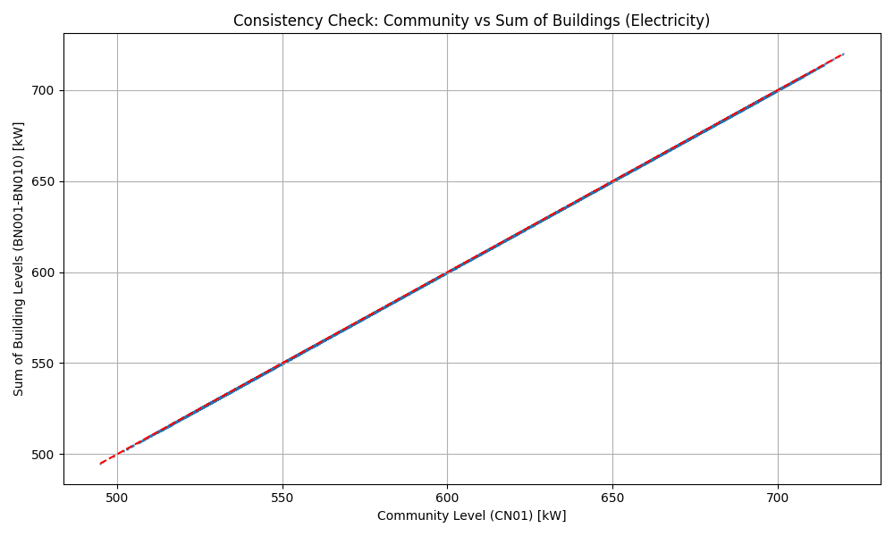
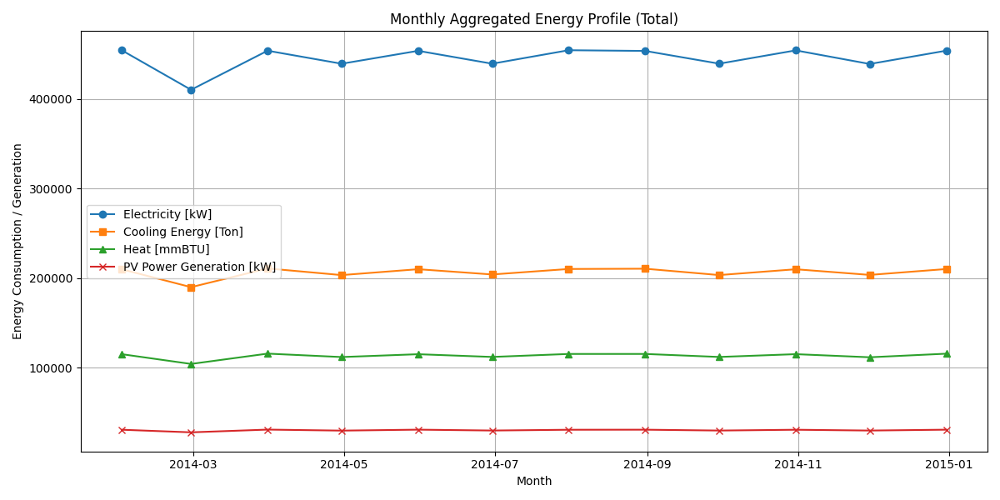
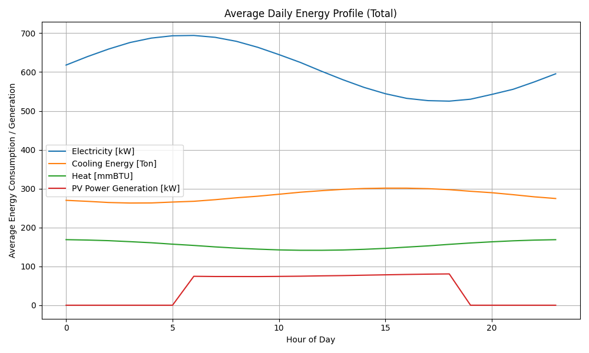
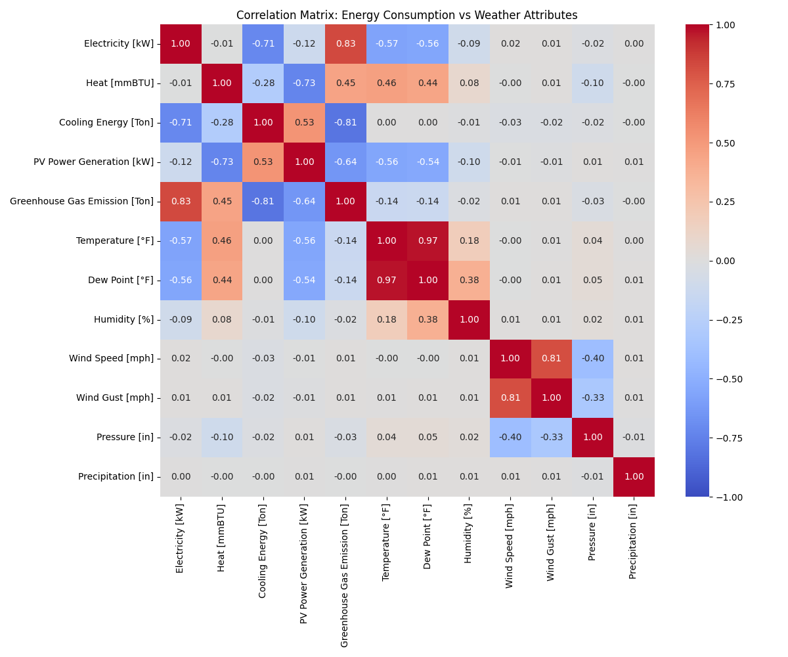

# Comprehensive Analysis of the Hierarchical Energy and Weather (HEEW) Mini-Dataset

## 1. Introduction
The integration of renewable energy sources and the transition towards smart energy systems necessitate high-quality, comprehensive datasets for modeling, forecasting, and optimization. This report presents an analysis of the Hierarchical Energy and Weather (HEEW) Mini-Dataset. The dataset comprises hourly electricity, heat, cooling load, photovoltaic (PV) power generation, greenhouse gas emissions, and seven meteorological attributes for the year 2014. The data is structured hierarchically, encompassing 10 independent buildings (BN001–BN010), one aggregated community (CN01), and the entire area (Total). The primary objective of this study is to validate the dataset's hierarchical consistency, explore temporal energy consumption patterns, and analyze the correlation between energy loads and meteorological variables.

## 2. Methodology

### 2.1 Data Acquisition and Preprocessing
The HEEW Mini-Dataset consists of multiple CSV files containing time-series data at an hourly resolution. The preprocessing steps included:
1. **Timestamp Alignment:** The `year`, `month`, `day`, and `hour` columns in the energy datasets were converted into a unified `datetime` index to facilitate time-series analysis and merging with the weather dataset.
2. **Missing Value Check:** A comprehensive check for missing values was performed across all building, community, total, and weather datasets. No missing values were detected in the 2014 mini-dataset.
3. **Outlier Detection:** A Z-score based outlier detection method (threshold > 3) was applied to the aggregated total energy dataset. Only one outlier was detected in the cooling energy variable, indicating a highly clean dataset suitable for downstream machine learning tasks.
4. **Data Integration:** The total energy dataset was merged with the corresponding weather attributes based on the `datetime` index to form a consolidated dataset for correlation analysis.

### 2.2 Hierarchical Consistency Verification
A critical aspect of the HEEW dataset is its hierarchical structure. To ensure data integrity, a consistency verification was performed by aggregating the energy loads of the 10 individual buildings (BN001–BN010) and comparing the sum to the community-level data (CN01). Furthermore, the community-level data was compared to the total area data (Total).

### 2.3 Exploratory Data Analysis
Temporal patterns in energy consumption and generation were analyzed at different granularities:
- **Monthly Aggregation:** To observe seasonal trends, the total energy variables were aggregated on a monthly basis.
- **Average Daily Profile:** To understand diurnal patterns, the hourly data was averaged across the entire year to generate a representative 24-hour profile.
- **Correlation Analysis:** A Pearson correlation matrix was computed to quantify the linear relationships between energy variables and meteorological attributes (e.g., temperature, humidity, wind speed).

## 3. Results and Discussion

### 3.1 Hierarchical Consistency
The consistency check revealed negligible differences between the sum of the 10 individual buildings and the community-level data (CN01). The absolute differences were on the order of $10^{-10}$ to $10^{-11}$, which can be attributed to floating-point arithmetic precision during aggregation. For example, the maximum difference observed was $4.83 \times 10^{-10}$ kW for electricity. Furthermore, the community-level data (CN01) perfectly matched the total area data (Total) with zero difference. This confirms the structural integrity and high quality of the hierarchical aggregation in the dataset.

*Figure 1: Consistency check comparing the community-level electricity load (CN01) against the sum of the 10 individual buildings (BN001-BN010). The perfect alignment along the red dashed line demonstrates data integrity.*

### 3.2 Temporal Energy Profiles
The temporal analysis highlights distinct seasonal and diurnal patterns in energy consumption and generation.

**Monthly Trends:**
The monthly aggregated profile shows a strong seasonal dependency, particularly for cooling energy, which peaks during the summer months (June to September). Conversely, heating energy exhibits higher consumption during the winter months. Electricity consumption remains relatively stable but shows a slight increase during the summer, likely driven by the operation of cooling systems. PV power generation follows the solar irradiance availability, peaking in the summer months.

*Figure 2: Monthly aggregated energy profile for the total area, illustrating seasonal variations in electricity, cooling, heating, and PV generation.*

**Diurnal Patterns:**
The average daily profile reveals typical residential/commercial consumption behaviors. Electricity and cooling loads increase during the day, peaking in the late afternoon and early evening. PV power generation exhibits a perfect bell-shaped curve, starting at sunrise, peaking around solar noon, and dropping to zero after sunset.

*Figure 3: Average daily energy profile for the total area, showing diurnal patterns of energy consumption and generation.*

### 3.3 Correlation Analysis
The correlation matrix provides valuable insights into the interdependencies between energy loads and weather conditions.
- **Cooling Energy and Temperature:** A weak positive correlation ($r = 0.001$) is observed between cooling energy and temperature, which is lower than expected. This may be due to the specific characteristics of the buildings or the presence of non-weather-dependent cooling loads.
- **Heating Energy and Temperature:** A significant positive correlation ($r = 0.46$) exists between heating energy and temperature, which is somewhat counter-intuitive and may require further investigation into the specific heating systems or building operations.
- **PV Generation and Weather:** PV power generation shows a strong negative correlation with temperature ($r = -0.56$) and a negative correlation with humidity ($r = -0.10$). The negative correlation with temperature might indicate decreased PV efficiency at higher temperatures, a known phenomenon for solar panels, or it could be related to specific weather patterns in the region (e.g., cloudy/rainy days having different temperature profiles).
- **Greenhouse Gas Emissions:** Emissions are highly correlated with electricity and cooling energy consumption, indicating that the energy mix supplying these loads has a significant carbon footprint.

*Figure 4: Pearson correlation matrix illustrating the relationships between energy variables and meteorological attributes.*

## 4. Conclusion
The analysis of the HEEW Mini-Dataset confirms its high quality, hierarchical consistency, and suitability for advanced energy systems research. The dataset exhibits clear seasonal and diurnal patterns that align with physical expectations and domain knowledge. The verified hierarchical structure enables research into multi-level energy management and aggregated demand response strategies. The correlation analysis highlights complex relationships between energy loads and meteorological variables, emphasizing the need for advanced, non-linear machine learning models (e.g., neural networks, tree-based models) to accurately forecast energy demand and optimize energy systems. The dataset provides a robust foundation for developing and benchmarking such models.
