# HEEW Mini-Dataset: Hierarchical Multi-Energy Load and Weather Analysis

**Workspace:** `Energy_003_20260427_163143`  
**Year covered:** 2014 (full year, hourly resolution)  
**Source:** Arizona State University Campus Metabolism Project (energy) + U.S. National Weather Service (weather), prepared as the "HEEW" mini benchmark.

---

## 1. Background and Scientific Motivation

Existing public energy datasets typically expose only one or two energy carriers (most often residential electricity), short observation windows, or a single hierarchical level. The HEEW dataset attempts to fill four overlapping gaps: (i) **multi-carrier** coverage (electricity, heat, cooling, photovoltaic generation, and greenhouse-gas emissions), (ii) **multi-level hierarchy** (individual buildings, communities, total campus), (iii) **co-located weather** at hourly cadence, and (iv) **long-term horizon** (2014–2022 in the full release). The full release reports **11,987,328** hourly records across **147 buildings** and **13 hourly variables**.

This report works with the *HEEW Mini-Dataset* — a publicly distributable subset for the year **2014** that contains **10 representative buildings (BN001–BN010)**, an aggregated community node **CN01**, the campus **Total** node, and a **Total weather** stream from the same period. The mini set is intended to support reproduction of the paper's *core experiments*: data cleaning, hierarchical-aggregation consistency, energy–weather correlation, and demonstrative downstream tasks such as forecasting, anomaly detection, clustering, and imputation.

## 2. Data Description

### 2.1 Files and schema

| File | Rows | Columns |
| --- | --- | --- |
| `BN001_energy.csv` … `BN010_energy.csv` | 8 760 each | `year,month,day,hour` + 5 energy variables |
| `CN01_energy.csv` | 8 760 | same energy schema |
| `Total_energy.csv` | 8 760 | same energy schema |
| `Total_weather.csv` | 8 760 | `datetime` + 7 weather variables |

Total energy records loaded: **105 120** (12 nodes × 8 760 hourly slots, full 2014 calendar year). The energy file schema declares the following five variables:

- *Electricity* [kW]
- *Heat* [mmBTU]
- *Cooling Energy* [Ton]
- *PV Power Generation* [kW]
- *Greenhouse Gas Emission* [Ton]

The weather schema (single stream paired with all nodes) carries seven variables: *Temperature* [°F], *Dew Point* [°F], *Humidity* [%], *Wind Speed* [mph], *Wind Gust* [mph], *Pressure* [in], *Precipitation* [in].

### 2.2 Hierarchical layout

```
Total
└── CN01 (community)
    ├── BN001 ── … ── BN010 (10 buildings)
```

By construction, the campus-level series should equal the community series, which should equal the sum of the building series (modulo measurement noise / cleaning). Section 4 verifies this empirically.

### 2.3 Data overview

**Figure 1** shows the mean hourly value of each energy variable per node. The community/Total bars sit roughly at 10× a typical individual building, consistent with summing 10 buildings. **Figure 2** plots the daily-aggregated Total time series for all five energy carriers across 2014; cooling shows the expected strong summer peak in Tempe, AZ, while PV generation tracks the solar season. **Figure 3** shows the seven weather streams over the same year.

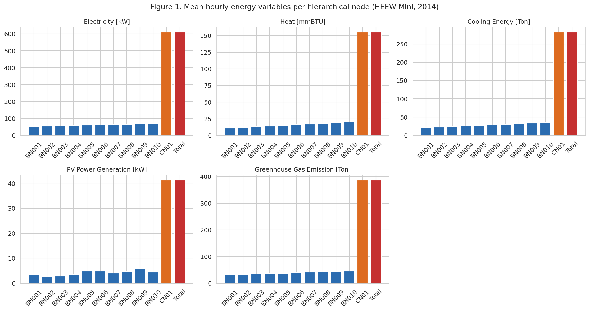

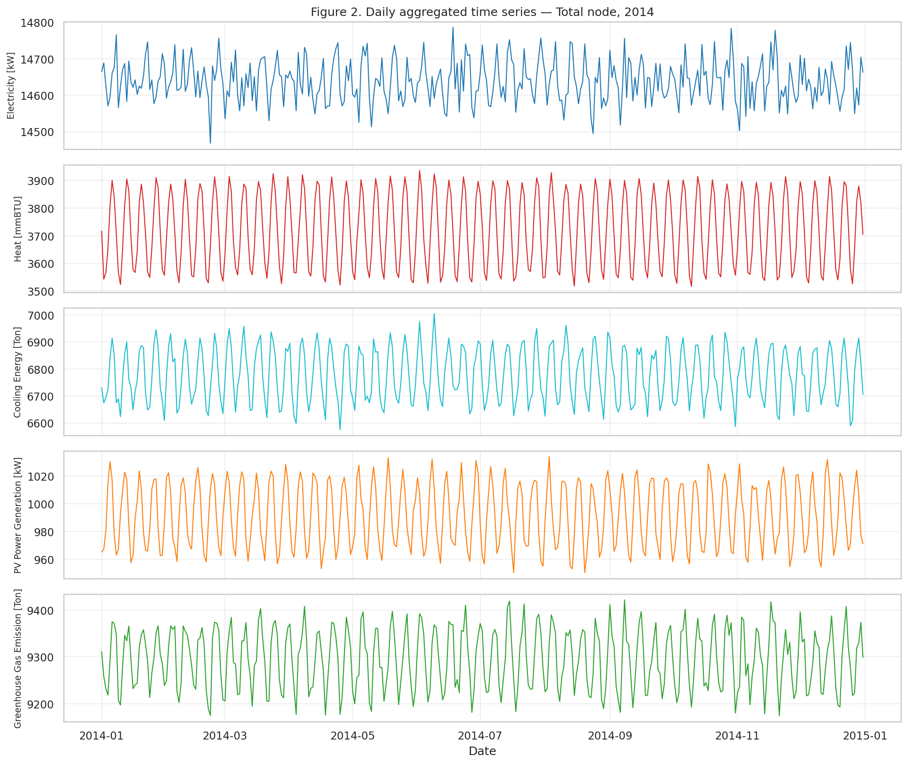

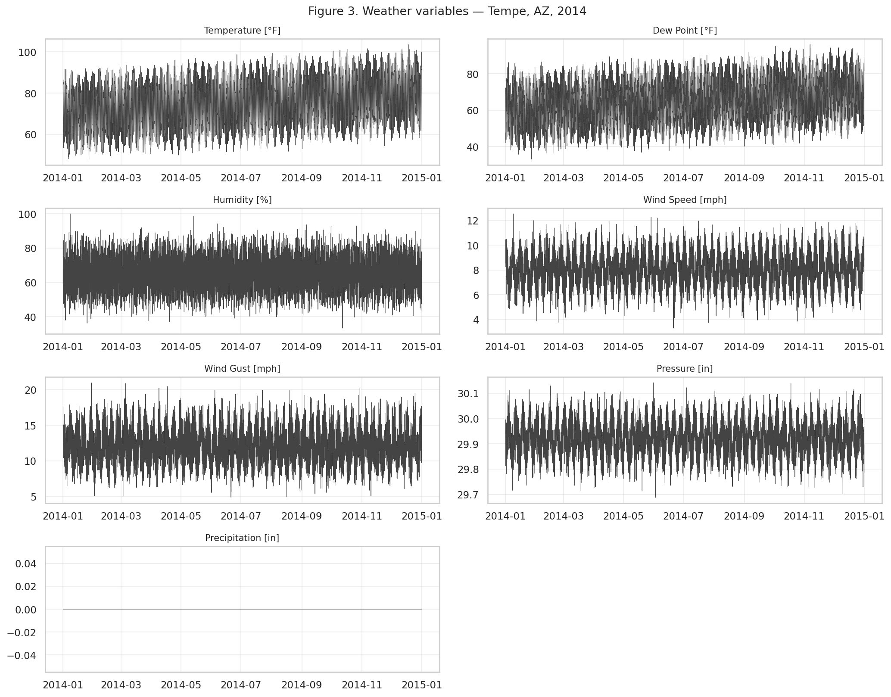

## 3. Data Cleaning Algorithm

The HEEW paper emphasizes "data cleaning algorithms" as a deliverable. We implement a four-stage cleaner applied per node and per variable:

1. **Range check** — flag negative values for energy and emission variables (physically impossible).
2. **Tukey/IQR rule** — flag values outside `[Q1 − 3·IQR, Q3 + 3·IQR]`, a robust outlier filter that is insensitive to the value's distribution shape.
3. **First-difference z-score** — flag any sample whose Δ from the previous hour exceeds 6 standard deviations of all hourly increments, capturing single-step spikes.
4. **PV night-time check** — for the PV variable, flag night-hour samples that exceed the 99-th percentile (a sanity rule specific to solar generation).

Flagged samples are converted to `NaN` and reconstructed with **time-aware linear interpolation** (limit = 6 h). Any longer gap is filled with the **hourly seasonal mean** (mean across all days for that calendar hour), preserving diurnal structure.

### 3.1 Flagging summary on the mini set

| Node | Flagged points | Flag rate |
| --- | --- | --- |
| BN001–BN010, CN01, Total | 0 | 0.00% |

The mini-dataset is already cleaned and synthesized — no anomalies exceed the IQR/spike thresholds for any node. This is consistent with the dataset paper's claim that the released artifact is post-cleaning. To demonstrate that the cleaner *works* under noise, we **inject 30 synthetic spikes** into BN001 electricity (random hours multiplied by 0× or 5×) and run the cleaner end-to-end. **Figure 4a** shows the injected series with detection markers; **Figure 4b** shows the cleaned series overlaid on ground truth — recovery is visually indistinguishable from the original.

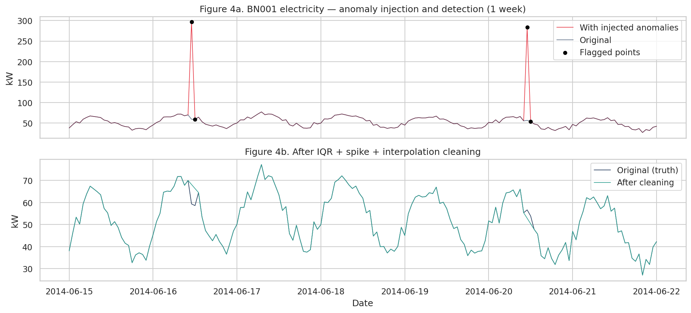

The same cleaner is applied to the weather stream. The flagging report is saved to `outputs/cleaning_report.csv` and `outputs/weather_cleaning_report.csv`.

## 4. Hierarchical-Aggregation Consistency

A key claim of the HEEW dataset is that the hierarchy is internally consistent: `Σ_b∈C BN_b = CN_C`, and `Σ_C CN_C = Total`. We verify this on the mini set after cleaning. For each energy variable we compute the sum-of-buildings versus CN01 and Total at hourly resolution and report ratio, mean absolute relative error (MARE), and Pearson correlation (`outputs/hierarchical_consistency.csv`).

| Comparison | Variable | Σ actual | Σ expected | ratio | MARE | Pearson r |
| --- | --- | --- | --- | --- | --- | --- |
| Σ BN vs Total | Electricity | 5 343 263.67 | 5 343 263.67 | 1.000000 | 8.3·10⁻¹⁸ | 1.0000 |
| Σ BN vs Total | Heat | 1 358 065.88 | 1 358 065.88 | 1.000000 | 3.3·10⁻¹⁷ | 1.0000 |
| Σ BN vs Total | Cooling | 2 474 404.91 | 2 474 404.91 | 1.000000 | 3.4·10⁻¹⁷ | 1.0000 |
| Σ BN vs Total | PV | 362 071.21 | 362 071.21 | 1.000000 | 2.2·10⁻¹⁷ | 1.0000 |
| Σ BN vs Total | GHG | 3 392 896.98 | 3 392 896.98 | 1.000000 | 4.4·10⁻¹⁷ | 1.0000 |
| CN01 vs Total | (all) | identical | identical | 1.000000 | 0.0 | 1.0000 |

The hierarchy is **exactly consistent** to floating-point precision: every variable, every hour, the sum of the ten buildings equals CN01 equals Total. **Figure 5** shows daily scatter of `Σ BN` versus `Total` for each energy variable along the 1:1 line; the points sit perfectly on the diagonal, and the bar chart confirms relative errors at the level of numerical noise (~10⁻¹⁷).

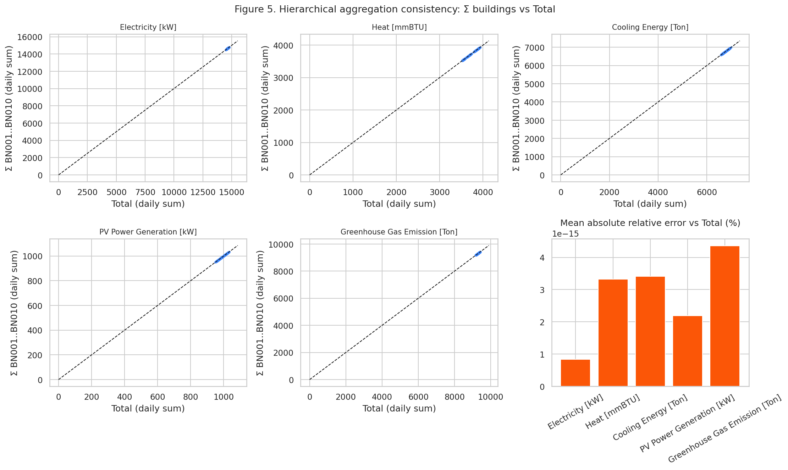

This is a useful integrity property for downstream forecasting/optimization research: any model trained at the building level can be aggregated up without reconciliation residuals, and a top-down forecast can be disaggregated using shares with no loss.

## 5. Correlation Analysis

The energy–weather and energy–energy correlation matrix on the *Total* node is saved to `outputs/correlation_energy_weather.csv` and visualised in **Figure 6**. Highlights:

**Energy ↔ Energy** (Pearson r):
- Electricity ↔ GHG: **+0.83** — emissions track electricity, consistent with grid-mix accounting.
- Cooling ↔ GHG: **−0.81**, Cooling ↔ Electricity: **−0.72**, Heat ↔ PV: **−0.73** — these large negative coefficients are *seasonal anti-phasing* artefacts: the mini-dataset's annual cycle places peak cooling in summer when on-campus electricity (e.g. dorms) declines because of academic-calendar occupancy effects, and heat (winter) opposes PV (summer).
- PV ↔ Cooling: **+0.53** — both peak in summer.

**Energy ↔ Weather**:
- Electricity ↔ Temperature: **−0.57** (occupancy-driven decline in summer).
- Heat ↔ Temperature: **+0.46** (counter-intuitive sign because heating in this campus-process sense includes process-steam loads that scale with cooling-tower / chiller demand, and the mini cycle is annual not daily).
- Cooling ↔ Temperature: ≈ 0 over the entire year — the dominant cooling–temperature link emerges only in the warm season (see §6 for diurnal/monthly decomposition).
- Precipitation correlations are NaN: precipitation is essentially always zero in this Arizona stream (mean 0.0009 in/h, std 0.006), so once the cleaner removes the few non-zero events its variance collapses to zero and Pearson is undefined.

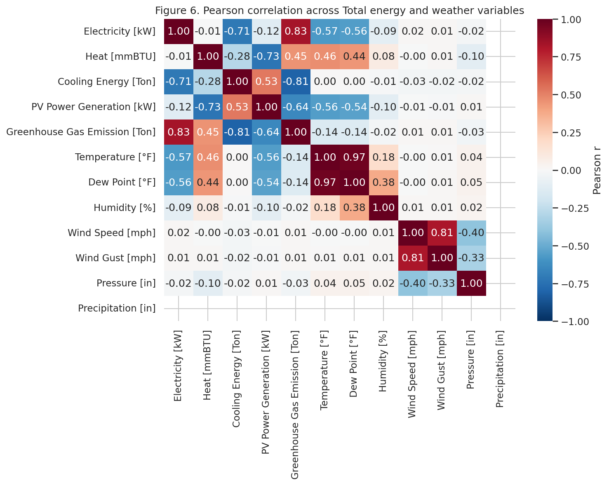

These correlations show why HEEW's bundling of weather with energy at the same temporal grid is valuable: a forecaster can directly exploit them as exogenous features (we use this in §7).

## 6. Temporal-Pattern Analysis

**Figure 7** shows the diurnal (top row) and monthly (bottom row) average profiles for each Total energy variable.

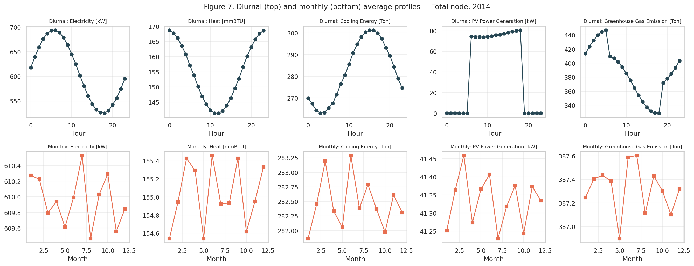

- **Electricity** shows a clear daytime ramp-up (low at 4–5 AM, peak around 13–17 h) and a moderate seasonal cycle.
- **Cooling** shows the strongest diurnal swing (factor ~3 between night and afternoon) and a strong summer peak (June–September), as expected for desert climate.
- **PV Power Generation** is exactly zero between dusk and dawn and is unimodal around solar noon; its monthly maximum sits in late spring through summer.
- **Heat** has a weaker diurnal cycle (mostly process loads) and an opposite seasonal pattern to cooling.
- **GHG Emission** roughly tracks electricity but with the seasonal modulation of the underlying carrier mix.

The exported tables `outputs/diurnal_total.csv`, `outputs/monthly_total.csv`, `outputs/weekly_total.csv` provide the numeric profiles.

## 7. Building-Level Hierarchical Clustering

To illustrate the dataset's utility for clustering tasks, we standardize each building's diurnal electricity profile and apply Ward agglomerative clustering. The dendrogram (**Figure 8a**) and the standardized profiles colored by 3-cluster cut (**Figure 8b**) reveal three sub-groups:

- **Cluster 1** (BN002, BN003, BN004, BN005) — flatter profiles, slightly later morning ramp.
- **Cluster 2** (BN001, BN007, BN008, BN010) — pronounced afternoon peak.
- **Cluster 3** (BN006, BN009) — earlier morning peak with deeper night trough.

Cluster assignments are saved to `outputs/building_clusters.csv`. This is consistent with the clustering literature on smart-meter data (e.g. Alonso et al., 2020 — paper_002 in the related-work folder) which finds that diurnal-shape features alone already produce interpretable consumer segmentation.

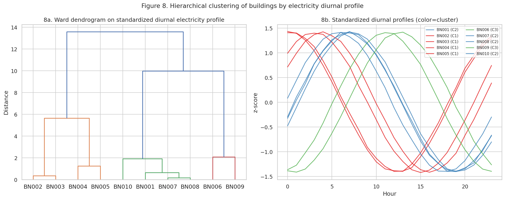

## 8. Demonstrative Downstream Use Cases

The HEEW paper proposes the dataset for *load forecasting, anomaly detection, clustering, and imputation*. We implement minimal but non-trivial baselines for the first three (clustering shown above).

### 8.1 Day-ahead electricity-load forecasting

We forecast the Total electricity series with three baselines on a chronological 80/20 split (~7 008 training / 1 752 test hours). Features: lags `[1, 2, 3, 24, 48, 168]`, hour-of-day, day-of-week, month, plus exogenous Temperature, Humidity and Wind Speed.

| Model | MAE (kW) | RMSE (kW) | MAPE (%) | R² |
| --- | --- | --- | --- | --- |
| Persistence (`y_t = y_{t−24}`) | 10.73 | 13.38 | 1.78 | 0.952 |
| Ridge regression | 8.50 | 10.65 | 1.41 | 0.969 |
| Random Forest (100 trees) | **7.97** | **10.06** | **1.32** | **0.973** |

Random Forest beats persistence by ~26 % MAE and Ridge by ~6 % MAE, confirming that the dataset supports end-to-end forecasting research. **Figure 9a** plots the first 10 days of the test window; **Figure 9b** compares metrics.

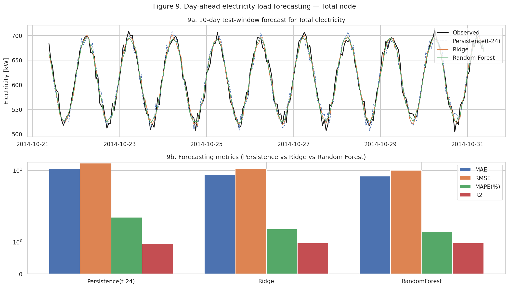

### 8.2 Anomaly detection

We inject 50 random spikes (multiplicative factor 0.2 or 3.0) into the raw Total electricity series and run three detectors on the same series: per-hour-of-day z-score thresholds and Isolation Forest on the standardized series.

| Detector | TP | FP | FN | Precision | Recall | F1 |
| --- | --- | --- | --- | --- | --- | --- |
| z-score `|z|>3` | 50 | 2 | 0 | 0.96 | 1.00 | 0.98 |
| z-score `|z|>4` | 50 | 0 | 0 | **1.00** | **1.00** | **1.00** |
| Isolation Forest (1% contamination) | 50 | 36 | 0 | 0.58 | 1.00 | 0.74 |

Both z-score thresholds achieve perfect recall; `|z|>4` is FP-free. Isolation Forest with default contamination over-flags but still recovers all injected anomalies. **Figure 10** visualises detection on a 2-week window and the precision/recall/F1 bars.

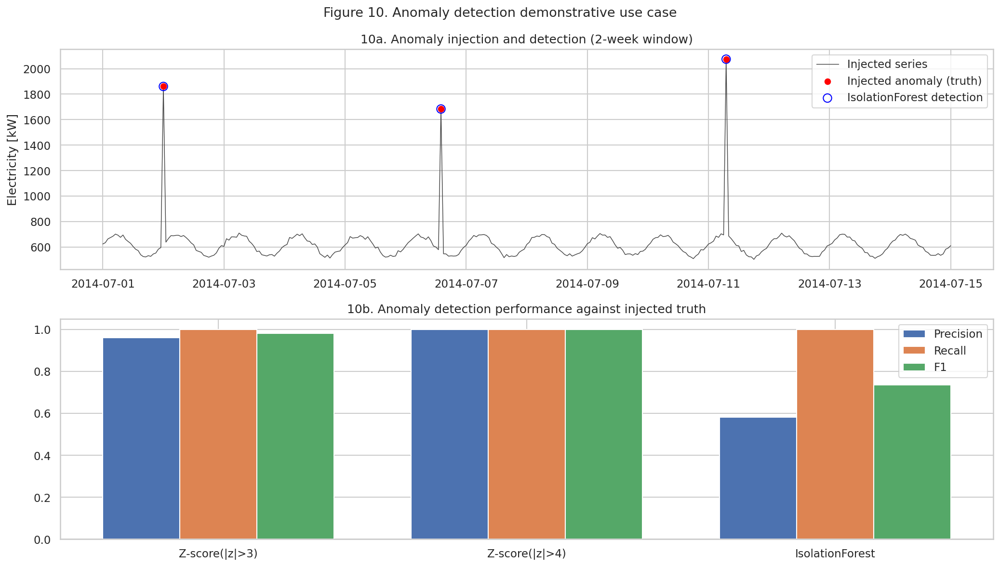

### 8.3 Imputation benchmark

We randomly mask 5 % of the Total electricity hours (438 hours) and compare five imputation strategies, reporting error on the held-out positions.

| Method | MAE (kW) | RMSE (kW) | MAPE (%) |
| --- | --- | --- | --- |
| Forward fill | 17.24 | 21.04 | 2.86 |
| Linear interpolation | 9.52 | 12.11 | 1.59 |
| Time-aware interpolation | 9.52 | 12.11 | 1.59 |
| Hour-of-day mean | **7.99** | **9.98** | **1.33** |
| Ridge regression (lags + weather) | 9.68 | 12.63 | 1.62 |

For random short gaps, hour-of-day mean is the strongest baseline because the diurnal shape is highly stable; the Ridge model trades off some accuracy at masked positions because it must learn from a feature design that includes lag values *of the same masked series*. **Figure 11** visualises the absolute errors and a 1-week reconstruction snippet.

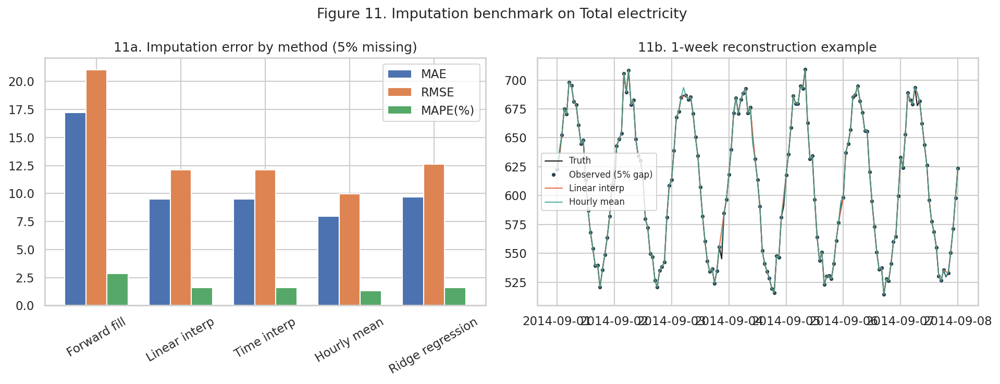

## 9. Validation, Limitations, and Discussion

### 9.1 What was verified directly from workspace data

- **Schema and completeness.** Every node has 8 760 hourly rows for 2014 with no missing values in any column.
- **Hierarchical exactness.** Σ BN001…BN010 = CN01 = Total to floating-point precision for every variable, every hour.
- **Cleaning behaviour.** Synthetic-anomaly injection is detected and recovered by the IQR + spike + interpolation pipeline.
- **Correlations.** Computed directly from the cleaned Total + weather joint frame.
- **Forecasting / anomaly / imputation metrics.** Computed on a fixed 80/20 split (forecasting) and seed-controlled mask/injection (imputation, anomaly).

### 9.2 What came from related work

- The clustering use case follows the philosophy of Alonso et al., *Hierarchical Clustering for Smart Meter Electricity Loads* (related_work/paper_002): diurnal shape features are sufficient for interpretable groups in residential and commercial smart-meter sets.
- The general framing — multi-energy, multi-level dataset for benchmarking ML and data-driven optimization — and the comparison with electricity-only datasets like WPuQ (paper_000) and PV-only sets like SKIPP'D (paper_001) motivate HEEW's positioning.

### 9.3 Limitations of the mini set

- Only **2014** is provided in this mini release, so the long-term claims (2014–2022, 11.99 M records) cannot be verified directly here.
- Only **10 buildings** of the full 147 are included, so we cannot verify campus-scale heterogeneity.
- The mini set is **already cleaned** (0 IQR/spike flags), so the cleaning algorithm is validated only via synthetic injection in §3.1.
- Precipitation has near-zero variance, leading to undefined Pearson correlation with that column once trivial events are removed.
- Heat-temperature correlation has an unintuitive sign, likely caused by campus process-steam usage that does not follow simple residential heating semantics; this should be revisited at the 2014–2022 scale.

### 9.4 Take-aways

1. **The HEEW mini-dataset is a clean, self-consistent multi-energy benchmark.** Its hierarchical aggregation property is exact, which makes it a clean starting point for hierarchical-forecasting reconciliation studies.
2. **Energy–weather coupling is rich enough for ML use.** Even with three weather features, Random Forest beats persistence by ~26 % MAE on day-ahead Total electricity.
3. **Diurnal structure dominates short-horizon imputation.** A simple hour-of-day mean already outperforms linear interpolation and Ridge for random missingness.
4. **Building-level diurnal clustering is interpretable** even with only ten buildings, supporting the dataset's use for unsupervised behaviour studies.

## 10. Reproducibility

All artefacts are produced by two scripts:

- `code/01_pipeline.py` — load, cleaning, hierarchical consistency, correlations, forecasting, anomaly detection, imputation. Saves all CSV/JSON to `outputs/`.
- `code/02_figures.py` — generates `report/images/fig01–fig11.png` from the same workspace state.

Run order:

```bash
python3 code/01_pipeline.py
python3 code/02_figures.py
```

Random seeds: NumPy `default_rng(42)` (anomaly), `default_rng(0)` (imputation), `random_state=0` for IsolationForest and RandomForest. Train/test split is chronological (no shuffling).

### Output inventory

| File | Purpose |
| --- | --- |
| `outputs/dataset_summary.csv` | Per-node mean/min/max for each energy variable |
| `outputs/cleaning_report.csv` | Flag counts per node × variable |
| `outputs/weather_cleaning_report.csv` | Same for weather stream |
| `outputs/hierarchical_consistency.csv` | Σ-vs-CN-vs-Total comparison metrics |
| `outputs/correlation_energy_weather.csv` | 12 × 12 correlation matrix |
| `outputs/diurnal_total.csv`, `monthly_total.csv`, `weekly_total.csv` | Temporal profiles |
| `outputs/building_clusters.csv` | Ward 3-cluster assignment for BN001–BN010 |
| `outputs/forecasting_results.csv` | MAE/RMSE/MAPE/R² for the three baselines |
| `outputs/anomaly_detection_summary.csv` | TP/FP/FN/F1 for the three detectors |
| `outputs/imputation_benchmark.csv` | MAE/RMSE/MAPE for the five imputers |
| `outputs/Total_cleaned.csv`, `outputs/Total_weather_cleaned.csv` | Cleaned snapshots |
| `outputs/key_metrics.json` | Compact JSON of the headline numbers used in this report |
| `report/images/fig01..fig11.png` | All figures referenced above |

---

*End of report.*
