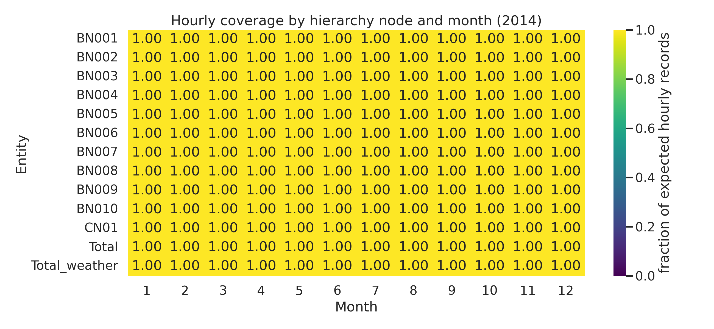
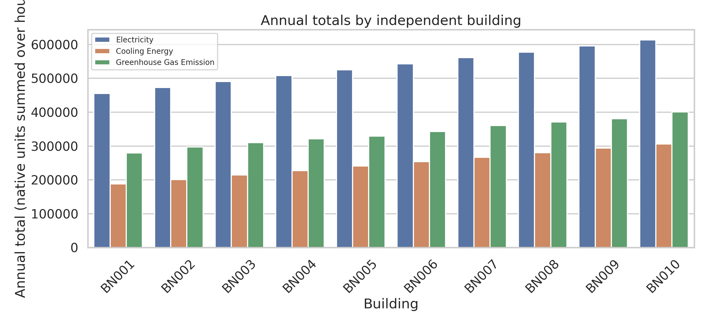
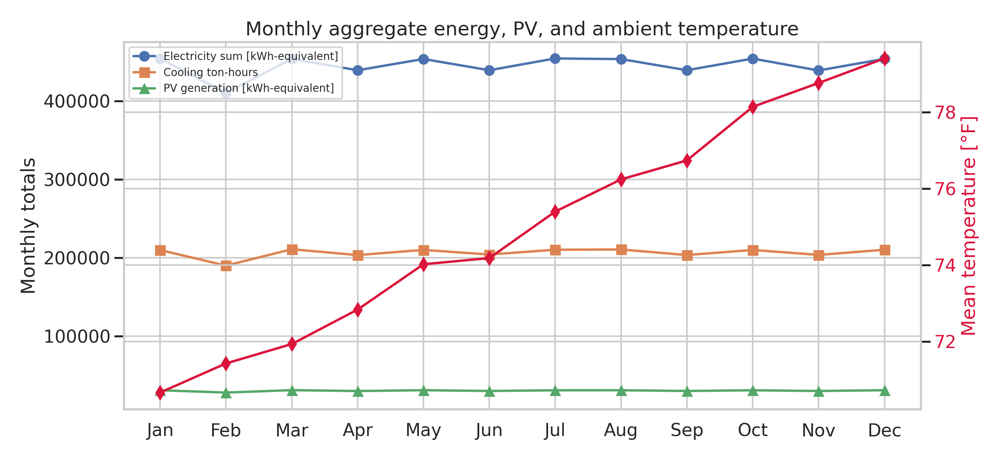
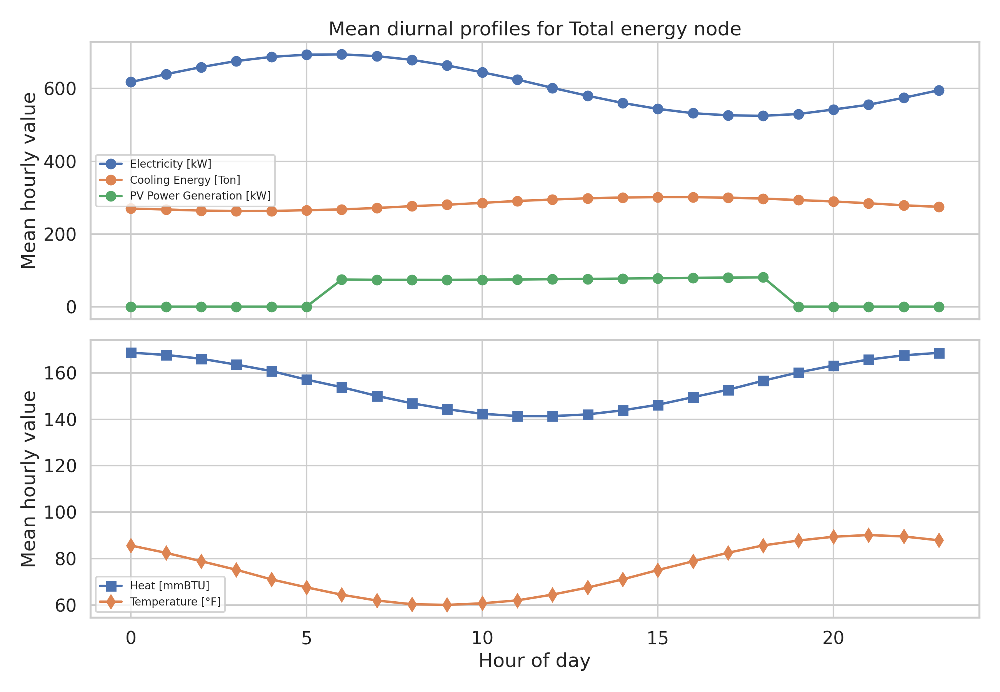
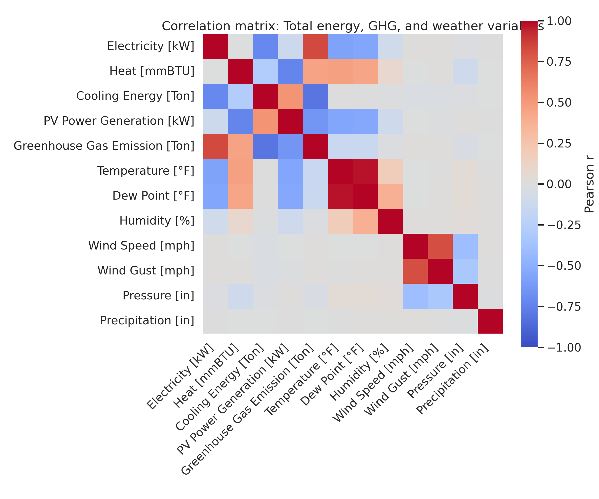
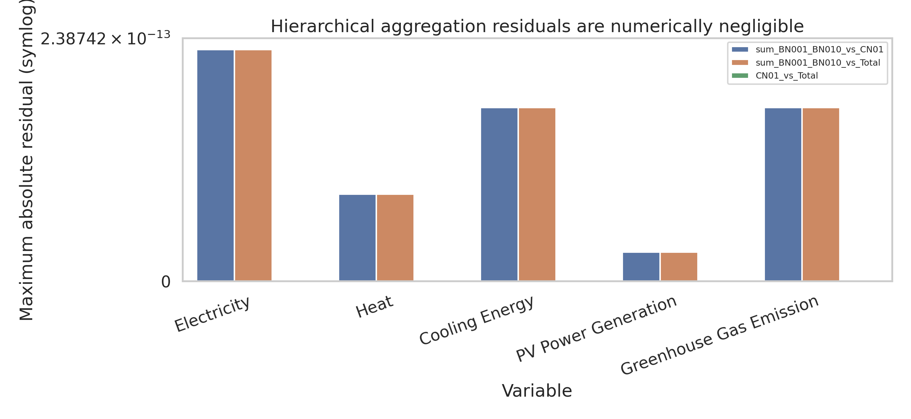

# Reproducible Analysis of the HEEW Mini-Dataset

## Abstract

This report analyzes the locally available **HEEW_Mini-Dataset**, a compact 2014 subset of the intended HEEW benchmark for hierarchical energy, emissions, PV generation, and weather time series. The workspace data contain hourly files for 10 independent buildings (`BN001`--`BN010`), one community aggregate (`CN01`), the whole area (`Total`), and a `Total_weather` file. I implemented a reproducible data-cleaning and validation workflow in `code/analyze_heew_mini.py`, exported machine-readable outputs in `outputs/`, and generated six PNG figures in `report/images/`. The mini dataset is internally complete: every energy and weather file contains 8,760 hourly records from 2014-01-01 00:00 through 2014-12-31 23:00, with no duplicate timestamps, no missing hourly slots, no missing numeric entries, and no negative numeric values. Hierarchical aggregation is numerically exact: the sum of `BN001`--`BN010` matches both `CN01` and `Total` for all five energy/emission variables with maximum absolute residual 2.27e-13 in native units.

## 1. Data and Scope

The task description defines the full HEEW goal as a multi-source, hierarchical time-series benchmark with 11,987,328 records, 13 hourly variables, 147 buildings, and 2014--2022 coverage. The available local data are the **mini dataset** only. Consequently, this analysis validates the compact 2014 subset rather than claiming to reproduce the full release.

Local input files used:

- `data/HEEW_Mini-Dataset/BN001_energy.csv` through `BN010_energy.csv`
- `data/HEEW_Mini-Dataset/CN01_energy.csv`
- `data/HEEW_Mini-Dataset/Total_energy.csv`
- `data/HEEW_Mini-Dataset/Total_weather.csv`

Energy files contain four timestamp fields (`year`, `month`, `day`, `hour`) and five measurements: electricity, heat, cooling energy, PV power generation, and greenhouse gas emissions. The weather file contains hourly `datetime` plus seven meteorological attributes: temperature, dew point, humidity, wind speed, wind gust, pressure, and precipitation.



**Figure 1.** All hierarchy nodes and the weather file have complete monthly hourly coverage in 2014. The underlying matrix is saved as `outputs/monthly_coverage_matrix.csv`.

## 2. Methodology

### 2.1 Reproducible workflow

All computations and figures were generated by:

```bash
python3 code/analyze_heew_mini.py
```

The script writes quantitative artifacts to `outputs/` and PNG figures to `report/images/`. It uses only local data and standard Python data-science libraries available in the workspace (`pandas`, `numpy`, `matplotlib`, and `seaborn`). Dependency and method-contract records are saved in `outputs/dependency_check.json`, `outputs/method_contract.json`, and `outputs/method_fidelity_checklist.json`.

### 2.2 Cleaning and validation algorithm

The implemented cleaning/validation algorithm follows five steps:

1. **Timestamp normalization.** Energy files are converted from `year`/`month`/`day`/`hour` fields to a single hourly `datetime`; weather already provides `datetime`.
2. **Temporal integrity checks.** For each file, the algorithm computes start/end timestamps, row counts, expected hourly timestamps in the span, duplicate timestamps, missing hours, unexpected timestamps, and irregular hour-to-hour steps.
3. **Cell-level quality checks.** Numeric measurement columns are checked for missing values and negative values. Robust univariate outliers are flagged by a median absolute deviation rule using `|modified_z| > 6`.
4. **Source alignment.** Total energy and total weather are joined by exact hourly `datetime` to verify one-to-one multi-source alignment.
5. **Hierarchical aggregation.** The 10 building files are summed hour by hour and compared with `CN01` and `Total`; `CN01` is also compared directly with `Total`. Metrics include mean absolute error, maximum absolute error, RMSE, MAPE where denominators are nonzero, and an `allclose` flag at absolute tolerance 1e-6.

## 3. Results

### 3.1 Data overview and quality diagnostics

All 13 files contain 8,760 rows, matching the expected number of hours in non-leap-year 2014. The timestamp span is identical across files: 2014-01-01 00:00:00 to 2014-12-31 23:00:00. The Total energy file joins with the Total weather file to 8,760 exact hourly rows. No file has duplicate timestamps, missing hourly slots, irregular hourly steps, missing numeric values, or negative numeric values. PV generation is zero for 4,015 hours in each energy file, consistent with nighttime or non-generating hours. The weather file has 386 hours with nonzero precipitation.

Primary diagnostics are saved in:

- `outputs/data_overview.json`
- `outputs/cleaning_diagnostics.csv`
- `outputs/total_energy_weather_joined.csv`

### 3.2 Building-level energy and emissions

The building-level annual summaries reveal a monotone-like spread in electricity and other native-unit totals across the 10 independent buildings. Annual electricity sums range from 455,677.13 for `BN001` to 613,562.41 for `BN010`, and the sum across all 10 buildings is 5,343,263.67 in hourly-summed electricity units. Building-level totals and shares are saved in `outputs/building_annual_totals.csv`.



**Figure 2.** Annual totals by building for electricity, cooling, and greenhouse gas emissions. This figure supports building-level benchmark use cases such as clustering, normalization, and cross-building comparison.

### 3.3 Temporal structure: monthly and diurnal profiles

The mini dataset preserves interpretable temporal structure. Monthly aggregates are stable in shape but show increasing mean temperature through the year in the provided weather data. The monthly Total summary is saved in `outputs/monthly_total_summary.csv`.



**Figure 3.** Monthly Total electricity, cooling, PV generation, and mean temperature. The plot demonstrates the multi-source structure: energy/emission variables can be analyzed jointly with weather covariates.

Hourly mean profiles show distinct diurnal signatures in electricity, cooling, PV generation, heating, and temperature. These profiles are useful for forecasting baselines, anomaly detection, and imputing missing intervals. The values used for the plot are saved in `outputs/diurnal_total_profiles.csv`.



**Figure 4.** Mean diurnal profiles for the Total node. PV has a strong daily cycle, while electricity, cooling, heat, and temperature exhibit distinct average hourly patterns.

### 3.4 Correlation analysis

The Pearson correlation matrix for Total energy, greenhouse gas emissions, PV generation, and weather attributes is saved in `outputs/correlation_matrix.csv`. Key observed correlations include:

- Electricity and greenhouse gas emissions: **r = 0.831**.
- Cooling energy and greenhouse gas emissions: **r = -0.811**.
- Heat and PV generation: **r = -0.730**.
- Wind speed and wind gust: **r = 0.814**.
- Temperature and dew point: **r = 0.970**.

These correlations should be interpreted as descriptive relationships in the provided mini dataset rather than causal estimates. The strong weather-weather and energy-emission associations confirm that the merged dataset contains meaningful cross-source structure for downstream machine-learning tasks.



**Figure 5.** Pearson correlation matrix for Total energy/emission and weather variables.

### 3.5 Hierarchical consistency

The hierarchy is internally consistent. For all five energy/emission variables, the hour-wise sum of `BN001`--`BN010` equals `CN01` and equals `Total` to floating-point precision. The maximum absolute residual over all comparisons and variables is **2.27e-13**, and all 15 hierarchy checks pass the 1e-6 all-close criterion. `CN01` and `Total` are exactly identical in the mini dataset. Metrics are saved in `outputs/hierarchical_consistency.csv`; hourly residuals are saved in `outputs/hierarchy_hourly_residuals.csv`.



**Figure 6.** Maximum absolute hierarchy residuals for building-sum versus `CN01`, building-sum versus `Total`, and `CN01` versus `Total`. Residuals are zero or floating-point roundoff only.

## 4. Data-Cleaning Algorithms as Reusable Benchmark Components

The cleaning algorithm implemented here can be reused as an HEEW benchmark ingestion template:

```text
For each energy or weather file:
  parse hourly datetime
  sort by datetime
  assert unique timestamps
  construct expected hourly range from min to max timestamp
  flag missing or unexpected hours
  count missing numeric values
  count non-physical negative values
  compute robust MAD-based outlier flags for numeric fields

For multi-source integration:
  exact-join energy and weather by datetime
  verify joined row count equals expected hourly coverage

For hierarchical validation:
  sum child building variables by datetime
  compare against community and total aggregates
  export residuals and summary metrics
```

This algorithm intentionally separates **hard validity checks** (missing hours, duplicates, missing cells, negative values, hierarchy mismatches) from **soft anomaly flags** (robust outliers). In the available mini dataset, hard checks passed and robust outlier counts were zero for all measurement columns under the selected `|modified_z| > 6` rule.

## 5. Validation, Evidence, and Limitations

### 5.1 Directly verified from workspace data

The following claims are directly supported by generated artifacts:

| Claim | Evidence |
|---|---|
| All provided files cover 8,760 hourly records in 2014 with no missing hours. | `outputs/data_overview.json`, `outputs/cleaning_diagnostics.csv`, Figure 1 |
| Total energy and Total weather join one-to-one at hourly resolution. | `outputs/data_overview.json`, `outputs/total_energy_weather_joined.csv` |
| The sum of `BN001`--`BN010` matches `CN01` and `Total` for all five energy/emission variables. | `outputs/hierarchical_consistency.csv`, `outputs/hierarchy_hourly_residuals.csv`, Figure 6 |
| Building-level annual totals and shares are reproducible. | `outputs/building_annual_totals.csv`, Figure 2 |
| Correlation and temporal-profile results are reproducible from exported tables. | `outputs/correlation_matrix.csv`, `outputs/monthly_total_summary.csv`, `outputs/diurnal_total_profiles.csv`, Figures 3--5 |

A concise claim-recovery table is saved as `outputs/claim_recovery_table.csv`.

### 5.2 Related-work context

The task asked for a benchmark-style dataset for energy management and data-driven optimization. I attempted to parse the local related-work PDFs with `ReadPDF`; all returned parser errors, and local shell utilities such as `pdftotext` were unavailable. A bounded metadata/strings extraction identified at least one related dataset paper, *Dataset on electrical single-family house and heat pump load profiles in Germany* (Scientific Data, DOI 10.1038/s41597-022-01156-1), and benchmark-dataset strings related to solar forecasting. The actionable methodological implication incorporated here is to emphasize coverage, data quality, validation, reproducibility, and sample-use analyses. The extraction record is saved in `outputs/related_work_contract.json`.

### 5.3 Limitations

1. **Mini dataset only.** The local data cover 10 buildings and 2014 only. The full target HEEW description covers 147 buildings and 2014--2022 with 11,987,328 records. This report therefore validates the compact subset and does not claim full-dataset statistics.
2. **Aggregate identity in mini dataset.** `CN01` and `Total` are identical locally. This is useful for consistency testing but does not exercise a deeper multi-community hierarchy.
3. **No external meteorological revalidation.** Weather values were checked for internal integrity but not compared with an external National Weather Service archive.
4. **Descriptive correlations only.** Correlations are not causal and may reflect synthetic or mini-dataset construction features.
5. **Related-work parsing limitation.** Full PDF text was not available through the local parser, so related-work integration is limited.

## 6. Conclusion

The HEEW mini dataset is a clean and internally consistent hierarchical benchmark subset. It contains complete 2014 hourly coverage for 10 buildings, `CN01`, `Total`, and Total weather; it passes hard data-quality checks; and it preserves exactly additive hierarchy relationships. The exported cleaning diagnostics, correlation matrices, temporal summaries, hierarchy residuals, and figures provide a reproducible foundation for downstream energy-system tasks such as load forecasting, anomaly detection, clustering, imputation, and multi-source optimization studies. The main caveat is scope: all conclusions apply to the available mini dataset, not to the full 147-building, 2014--2022 HEEW release.

## Reproducibility Checklist

- Analysis code: `code/analyze_heew_mini.py`
- Method contract: `outputs/method_contract.json`
- Dependency check: `outputs/dependency_check.json`
- Target artifact inventory: `outputs/target_artifact_inventory.json`
- Data overview: `outputs/data_overview.json`
- Cleaning diagnostics: `outputs/cleaning_diagnostics.csv`
- Hierarchy metrics: `outputs/hierarchical_consistency.csv`
- Correlation matrix: `outputs/correlation_matrix.csv`
- Report figures: `report/images/*.png`
