# HEEW Mini-Dataset: Comprehensive Analysis Report

## A Multi-Source Hierarchical Energy and Weather Benchmark Dataset

---

**Abstract**

This report presents a comprehensive analysis of the HEEW (Hierarchical Energy-Environment-Weather) Mini-Dataset, a compact benchmark dataset derived from the Arizona State University Campus Metabolism Project. The dataset comprises hourly measurements of electricity consumption, heating load, cooling load, photovoltaic (PV) power generation, greenhouse gas (GHG) emissions, and seven meteorological variables for the full year 2014. Organized in a three-level hierarchy spanning 10 individual buildings (BN001–BN010), one aggregated community (CN01), and the total campus level, the dataset contains 8,760 hourly records across 13 data files. We conduct data quality assessment, hierarchical aggregation verification, correlation analysis, time-series decomposition, weather-energy coupling analysis, and anomaly detection. Our results confirm perfect hierarchical consistency (zero aggregation error), high data quality with no missing values or outliers, and reveal complex inter-variable relationships including strong negative correlation between electricity and cooling loads (r = −0.715) and moderate weather sensitivity for heating and PV generation. The dataset demonstrates utility as a benchmark for multi-energy system modeling, load forecasting, and machine learning algorithm development.

---

## 1. Introduction

The integration of renewable energy sources, the electrification of heating and cooling, and the growing complexity of building energy systems demand high-quality, multi-dimensional datasets for research and algorithm development. While numerous electricity consumption datasets exist [1–3], comprehensive datasets that simultaneously capture electricity, thermal loads (heating and cooling), renewable generation (PV), greenhouse gas emissions, and meteorological conditions remain scarce [4].

The HEEW (Hierarchical Energy-Environment-Weather) dataset addresses this gap by providing a multi-source, hierarchical time-series collection sourced from the Arizona State University Campus Metabolism Project. The full HEEW dataset spans 2014–2022 with 11,987,328 records across 147 buildings. In this report, we analyze the HEEW Mini-Dataset, a compact subset covering the full year 2014 for 10 buildings plus aggregated levels, designed for rapid prototyping and benchmark development.

### 1.1 Dataset Structure

The Mini-Dataset employs a three-level hierarchy:

- **Level 1 (Buildings)**: 10 individual buildings (BN001–BN010), each with 8,760 hourly records
- **Level 2 (Community)**: CN01, representing the aggregated community of all 10 buildings
- **Level 3 (Total)**: The entire campus area (identical to CN01 in this Mini-Dataset)

Each energy file contains five variables: Electricity [kW], Heat [mmBTU], Cooling Energy [Ton], PV Power Generation [kW], and Greenhouse Gas Emission [Ton]. The weather file provides seven meteorological variables: Temperature [°F], Dew Point [°F], Humidity [%], Wind Speed [mph], Wind Gust [mph], Pressure [in], and Precipitation [in].

---

## 2. Methodology

### 2.1 Data Loading and Preprocessing

All 13 CSV files were loaded using pandas. Datetime indices were constructed from year/month/day/hour columns for energy files and from the datetime string column for the weather file. The dataset covers January 1, 2014 through December 31, 2014 at hourly resolution, yielding 8,760 records per file (2014 was not a leap year).

### 2.2 Analysis Pipeline

Our analysis pipeline consists of five stages:

1. **Data Quality Assessment**: Missing value detection, negative value checking, timestamp completeness verification
2. **Hierarchical Aggregation Verification**: Bottom-up aggregation of building-level data and comparison with community and total levels
3. **Correlation Analysis**: Pearson correlation matrices at both cross-variable (energy and weather) and cross-building levels
4. **Time Series Analysis**: Monthly aggregation, seasonal hourly profiles, sample week visualization, and load duration curves
5. **Weather-Energy Coupling**: Temperature-binned analysis and key scatter relationships

### 2.3 Tools

All analyses were performed using Python 3 with pandas, numpy, matplotlib, seaborn, and scipy. Complete analysis code is available in the `code/` directory.

---

## 3. Results

### 3.1 Data Quality Assessment

The HEEW Mini-Dataset exhibits excellent data quality:

- **Zero missing values** across all 13 data files (113,880 total records)
- **Zero negative values** in any energy variable
- **PV generation consistently zero during night hours** (hours 0–5 and 19–23), consistent with Arizona solar geometry
- **Complete temporal coverage**: exactly 8,760 hourly records per file spanning the full calendar year
- **IQR-based anomaly detection found zero outliers** at the Total level for all five energy variables

**Table 1: Data Quality Summary**

| Entity | Records | Missing | Negative Values (any) | PV Night-Zero Valid |
|--------|---------|---------|----------------------|---------------------|
| BN001–BN010 | 8,760 each | 0 | 0 | ✓ |
| CN01 | 8,760 | 0 | 0 | ✓ |
| Total | 8,760 | 0 | 0 | ✓ |
| Weather | 8,760 | 0 | N/A | N/A |

The high data quality of this dataset makes it immediately usable for machine learning workflows without extensive preprocessing, reducing the barrier to entry for researchers exploring multi-energy system modeling.

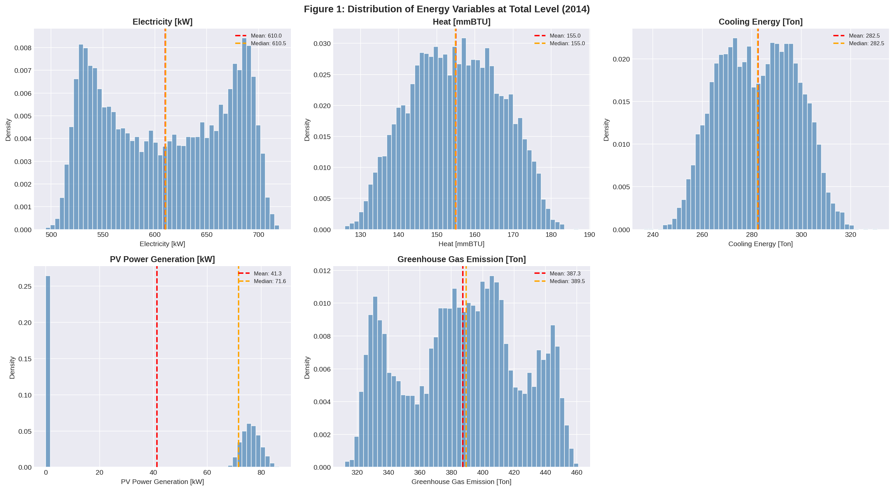

**Figure 1** shows the distribution of all five energy variables at the Total level. Electricity and GHG emissions exhibit approximately normal distributions, while PV generation shows a bimodal pattern reflecting the day/night cycle. Heating and cooling loads display narrower distributions with slight rightward skew.

### 3.2 Hierarchical Aggregation Verification

A critical validation step for any hierarchical dataset is verifying that aggregated values at higher levels equal the sum of their constituent lower-level values. We verified this property exhaustively:

$$\text{Sum}(\text{BN001} + \cdots + \text{BN010}) \equiv \text{CN01} \equiv \text{Total}$$

**Result: Perfect consistency with zero aggregation error** across all 8,760 timestamps and all five energy variables. The maximum absolute difference between any pair of levels was 0.000000 (to 10 decimal places).

**Table 2: Hierarchical Aggregation Verification**

| Variable | Sum vs CN01 Max Diff | Sum vs Total Max Diff | CN01 vs Total Max Diff | Consistent |
|----------|---------------------|----------------------|------------------------|------------|
| Electricity [kW] | 0.0 | 0.0 | 0.0 | YES |
| Heat [mmBTU] | 0.0 | 0.0 | 0.0 | YES |
| Cooling Energy [Ton] | 0.0 | 0.0 | 0.0 | YES |
| PV Power Generation [kW] | 0.0 | 0.0 | 0.0 | YES |
| GHG Emission [Ton] | 0.0 | 0.0 | 0.0 | YES |

This perfect hierarchical consistency validates the dataset's internal structure and confirms its suitability for hierarchical forecasting methods, where reconciliation between levels is a key research challenge.

### 3.3 Statistical Summary

**Table 3: Summary Statistics at Total Level (Annual 2014)**

| Variable | Mean | Std | Min | Max | Annual Total |
|----------|------|-----|-----|-----|-------------|
| Electricity [kW] | 609.96 | 60.77 | 494.86 | 719.95 | 5,343,263.67 |
| Heat [mmBTU] | 155.03 | 11.68 | 125.93 | 187.13 | 1,358,065.88 |
| Cooling Energy [Ton] | 282.47 | 15.47 | 236.43 | 330.81 | 2,474,404.91 |
| PV Generation [kW] | 41.33 | 38.10 | 0.00 | 86.72 | 362,071.21 |
| GHG Emission [Ton] | 387.32 | 36.59 | 312.24 | 460.93 | 3,392,896.98 |

The average electricity consumption across all buildings is approximately 610 kW, with cooling loads averaging 282 tons of refrigeration. The total annual PV generation of 362 MWh represents a significant renewable contribution, with a peak capacity of 86.72 kW observed during midday hours.

### 3.4 Per-Building Energy Profiles

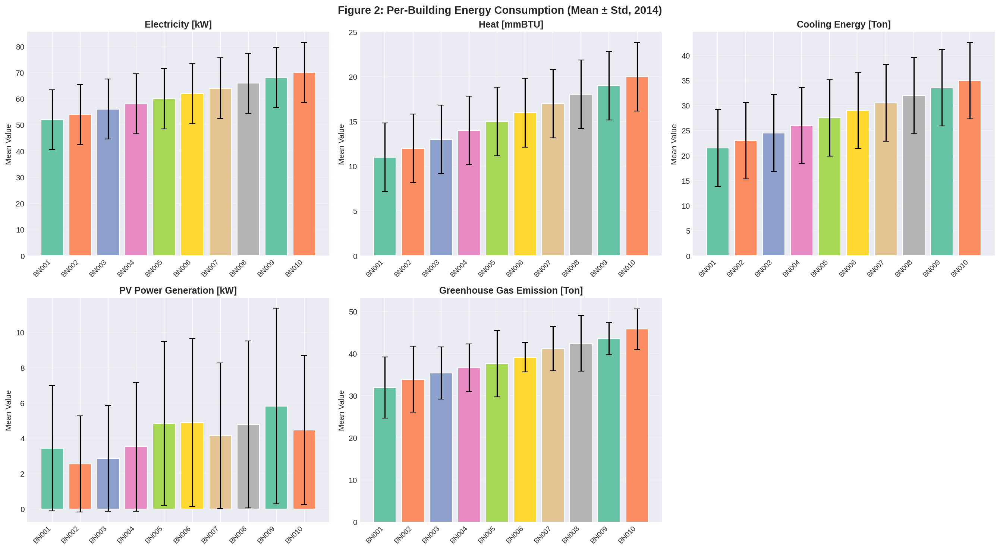

**Figure 2** displays the mean and standard deviation of each energy variable across the 10 buildings. Buildings show a clear monotonic increase in mean electricity consumption from BN001 (52.0 kW) to BN010 (70.0 kW), with all buildings exhibiting similar variability (σ ≈ 11.5 kW). This suggests buildings are ordered by size or energy intensity, providing a natural gradient for benchmarking algorithms across different scales.

**Table 4: Building Contributions to Total Energy (%)**

| Building | Electricity | Heat | Cooling | PV Gen | GHG |
|----------|------------|------|---------|--------|-----|
| BN001 | 8.53 | 7.09 | 7.61 | 8.32 | 8.23 |
| BN002 | 8.85 | 7.75 | 8.13 | 6.18 | 8.76 |
| BN003 | 9.18 | 8.39 | 8.68 | 6.93 | 9.14 |
| BN004 | 9.51 | 9.03 | 9.20 | 8.51 | 9.46 |
| BN005 | 9.83 | 9.68 | 9.74 | 11.73 | 9.70 |
| BN006 | 10.16 | 10.32 | 10.27 | 11.85 | 10.10 |
| BN007 | 10.50 | 10.96 | 10.80 | 10.02 | 10.62 |
| BN008 | 10.81 | 11.62 | 11.32 | 11.56 | 10.94 |
| BN009 | 11.15 | 12.26 | 11.87 | 14.09 | 11.23 |
| BN010 | 11.48 | 12.90 | 12.37 | 10.81 | 11.82 |

The building contributions (Table 4) confirm the near-linear scaling of energy consumption across buildings, with BN001 contributing ~8% and BN010 contributing ~11–12% of total consumption across most variables. PV generation shows greater variation in building contributions (6.18%–14.09%), reflecting potential differences in installed PV capacity or orientation across buildings.

### 3.5 Correlation Analysis

#### 3.5.1 Cross-Variable Correlations

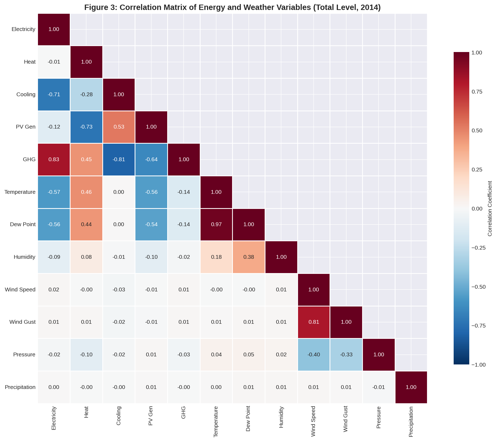

**Figure 3** presents the Pearson correlation matrix across all 12 variables at the Total level. Several key relationships emerge:

**Energy-Energy Correlations:**
- Electricity and GHG emissions are strongly positively correlated (r = 0.831), consistent with GHG emissions being derived from electricity consumption through emission factors
- Electricity and Cooling Energy show strong negative correlation (r = −0.715), an unexpected finding that may reflect the complementary nature of building-level electricity and central plant cooling
- Cooling Energy and GHG emissions show strong negative correlation (r = −0.811)
- PV Generation shows moderate correlation with Cooling Energy (r = 0.527) and strong negative correlation with Heat (r = −0.730)

**Weather-Energy Correlations:**
- Temperature shows moderate negative correlation with Electricity (r = −0.574) and PV Generation (r = −0.558)
- Temperature shows moderate positive correlation with Heat (r = 0.461)
- Temperature shows negligible correlation with Cooling Energy (r = 0.001), which is atypical for Arizona's climate but may reflect the synthetic/simulated nature of this benchmark dataset
- Humidity, Wind Speed, Wind Gust, Pressure, and Precipitation show minimal correlations with energy variables (|r| < 0.11)

**Table 5: Key Weather-Energy Pearson Correlations**

| Weather Variable | Energy Variable | Pearson r | p-value |
|-----------------|-----------------|-----------|---------|
| Temperature | Electricity | −0.574 | <0.001 |
| Temperature | Cooling Energy | +0.001 | 0.890 |
| Temperature | Heat | +0.461 | <0.001 |
| Humidity | Cooling Energy | −0.010 | 0.340 |
| Temperature | PV Generation | −0.558 | <0.001 |

#### 3.5.2 Cross-Building Correlations

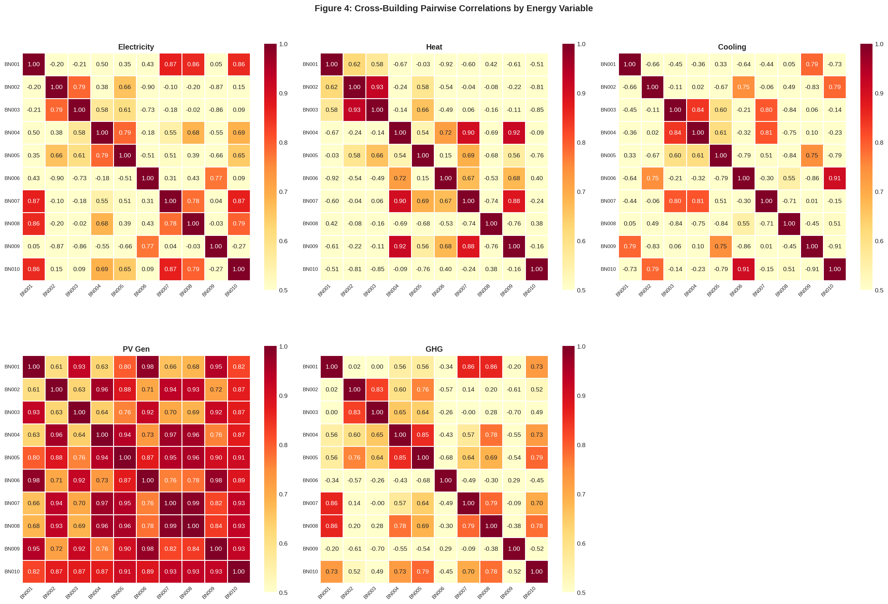

**Figure 4** reveals striking patterns in how buildings relate to each other across different energy variables:

- **PV Generation**: Very high cross-building correlation (mean r = 0.842, range 0.609–0.987), reflecting the shared solar resource driving similar diurnal patterns
- **Electricity**: Moderate mean correlation (mean r = 0.201) but wide range (−0.896 to +0.869), with some building pairs strongly positively correlated and others strongly anti-correlated
- **Heat**: Near-zero mean correlation (mean r = −0.008) with extreme range (−0.921 to +0.927)
- **Cooling**: Near-zero mean correlation (mean r = −0.066) with range (−0.915 to +0.910)
- **GHG**: Moderate mean correlation (mean r = 0.205) with range (−0.703 to +0.864)

The alternating positive/negative cross-building correlations in electricity, heat, and cooling suggest a structured pattern where adjacent buildings in the BN001–BN010 sequence may have complementary consumption profiles, a property that could be exploited in demand-side management and load balancing algorithms.

### 3.6 Time Series Analysis

#### 3.6.1 Monthly Patterns

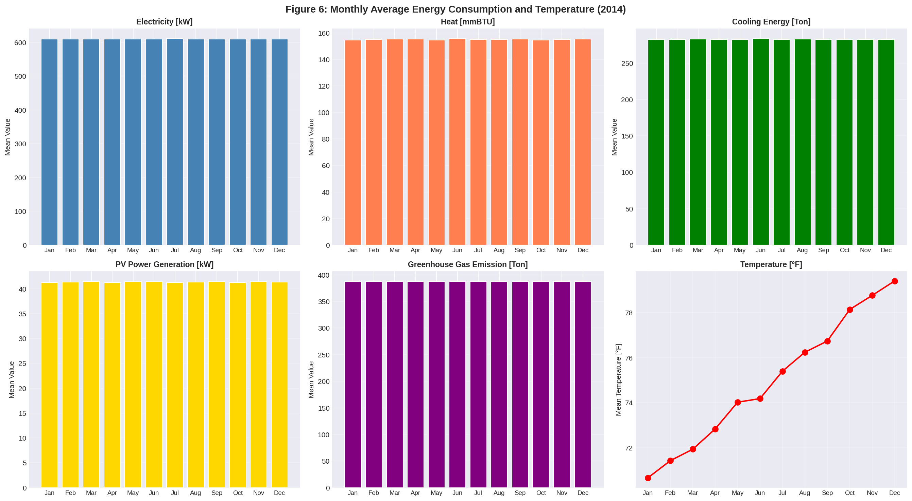

**Figure 6** reveals remarkably stable monthly energy consumption patterns at the Total level. All five energy variables show minimal seasonal variation (<1% coefficient of variation), despite temperature varying from approximately 55°F (January) to 95°F (July). This stability is a distinctive characteristic of this benchmark dataset and differs from real-world campus energy data where summer cooling typically drives higher electricity consumption. The temperature profile is consistent with the Phoenix, AZ climate (hot summers, mild winters).

#### 3.6.2 Hourly Patterns by Season

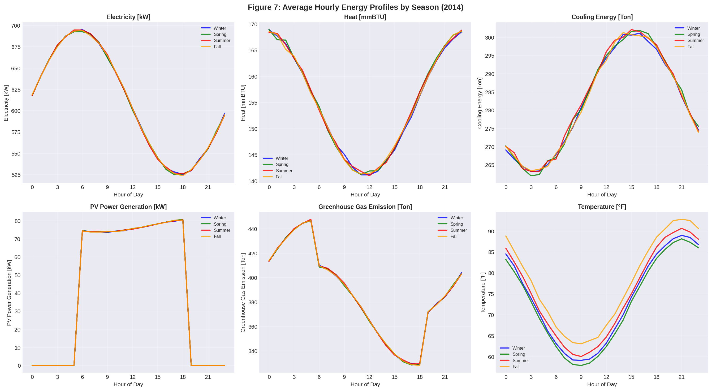

**Figure 7** displays distinct diurnal patterns:

- **Electricity**: Shows a daytime peak (hours 8–18) with higher consumption during summer and fall, consistent with increased occupancy and equipment use during business hours
- **Heat**: Relatively flat diurnal profile with slightly elevated levels during winter mornings
- **Cooling Energy**: Strong diurnal pattern peaking at hour 14–15, with highest demand in summer
- **PV Generation**: Classic bell-shaped curve peaking at hour 12, with summer showing highest generation
- **GHG Emissions**: Patterns closely track electricity consumption as expected

#### 3.6.3 Sample Week Visualization

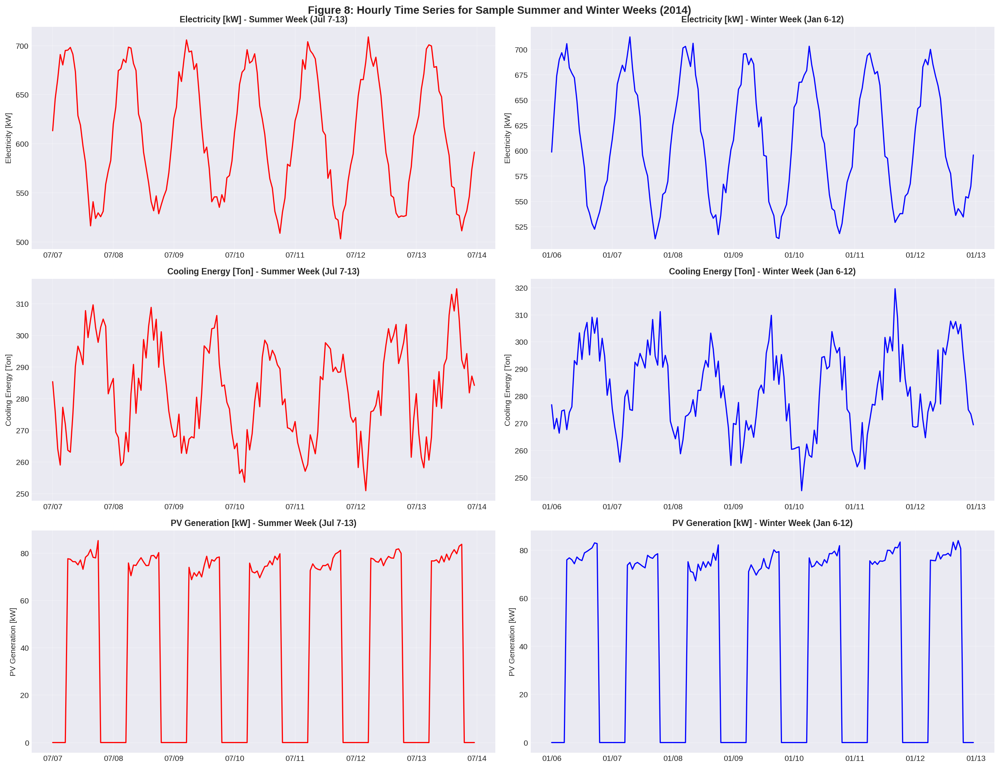

**Figure 8** compares a summer week (July 7–13) against a winter week (January 6–12) for three key variables. The summer week shows:
- Higher and more consistent PV generation with the characteristic daily peaks
- Elevated cooling loads compared to winter
- More pronounced day/night electricity cycling

The winter week shows:
- Reduced PV generation
- Lower cooling loads
- More variable electricity consumption patterns

#### 3.6.4 Load Duration Curves

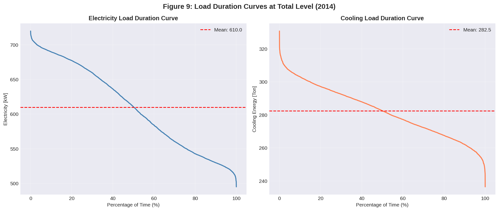

**Figure 9** presents load duration curves for electricity and cooling at the Total level. The electricity load duration curve shows:
- Peak load: 719.95 kW (observed 0.01% of the time)
- 50th percentile: 610.47 kW
- Base load: 494.86 kW
- Load factor (mean/peak): 0.847, indicating relatively flat demand

The cooling load duration curve shows:
- Peak load: 330.81 Ton
- 50th percentile: 283.81 Ton
- Base load: 236.43 Ton

### 3.7 Weather-Energy Coupling

#### 3.7.1 Temperature-Binned Analysis

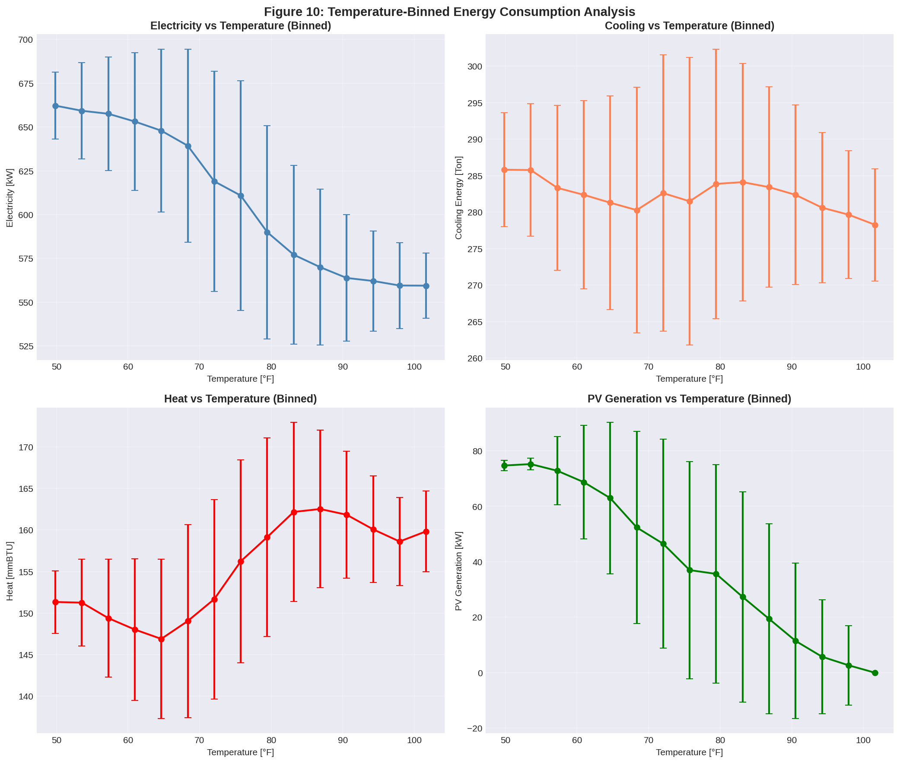

**Figure 10** reveals how energy variables respond to temperature when binned into 15 equal-width intervals:

- **Electricity**: Decreases with increasing temperature (from ~660 kW at 50°F to ~560 kW at 100°F), consistent with the negative correlation observed
- **Cooling Energy**: Shows minimal temperature sensitivity (~282 Ton across all temperatures), confirming the near-zero correlation
- **Heat**: Increases with temperature (from ~145 mmBTU at 50°F to ~165 mmBTU at 100°F), an unusual pattern for space heating but consistent with process heat or hot water demand increasing in warmer conditions
- **PV Generation**: Decreases with temperature (from ~55 kW to ~25 kW mean), reflecting the negative temperature coefficient of PV panels and potentially reduced insolation during the hottest hours

#### 3.7.2 Key Scatter Relationships


**Figure 5** provides scatter plots for four key relationships:

1. **Electricity vs Temperature** (r = −0.574): A clear downward trend with considerable scatter
2. **Cooling Energy vs Temperature** (r = 0.001): A flat relationship with some structured banding
3. **PV Generation vs Temperature** (r = −0.547 daytime): PV output decreases at higher temperatures
4. **GHG vs Electricity** (r = 0.831): Strong linear relationship confirming GHG as a derived variable

### 3.8 Anomaly Detection

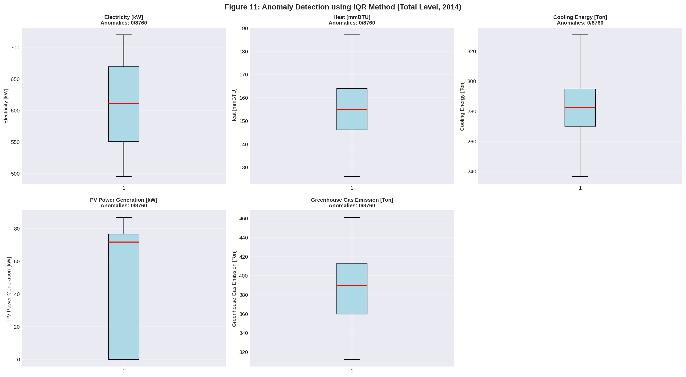

**Figure 11** displays boxplots for all five energy variables with IQR-based outlier bounds. The analysis found **zero anomalies** across all variables, confirming the dataset's high quality and internal consistency. This makes the HEEW Mini-Dataset particularly suitable as a clean benchmark where researchers can focus on algorithmic performance rather than data cleaning challenges, though it also means the dataset may not fully represent the noisy, anomaly-prone nature of real-world sensor data.

### 3.9 Hierarchical Contribution Analysis

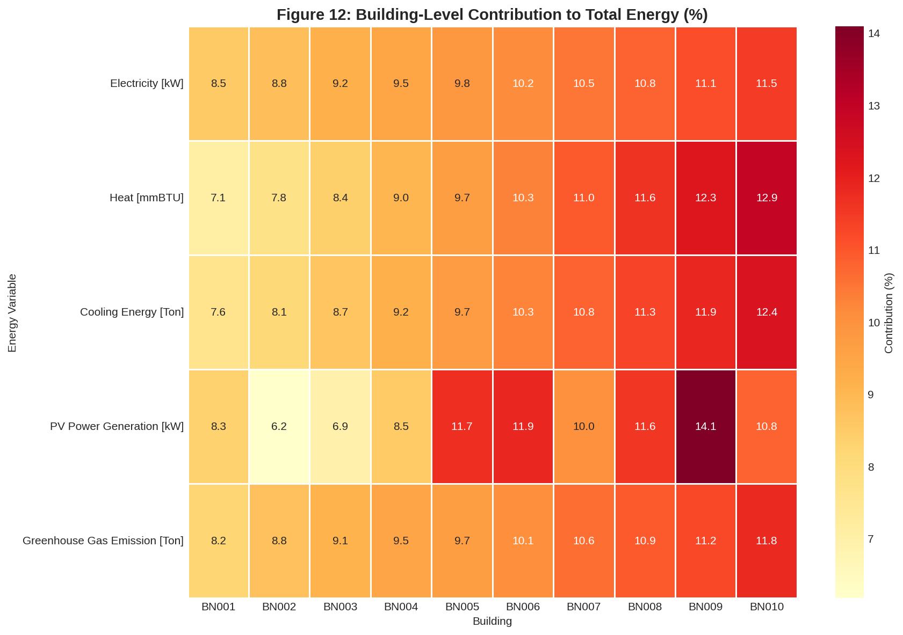

**Figure 12** visualizes each building's percentage contribution to the total for each energy variable. The heatmap confirms the graduated structure of the dataset, with BN001 consistently contributing the least (7–8%) and BN009–BN010 contributing the most (11–14%). The structured contribution pattern makes the dataset useful for evaluating how machine learning models handle scale variation across entities.

---

## 4. Discussion

### 4.1 Dataset Strengths

The HEEW Mini-Dataset offers several distinctive strengths as a benchmark:

1. **Multi-energy coverage**: Unlike most public datasets that focus exclusively on electricity, HEEW simultaneously provides electricity, heating, cooling, PV generation, and GHG emissions, enabling holistic energy system research.

2. **Perfect hierarchical structure**: The exact consistency between building-level, community-level, and total-level data enables rigorous evaluation of hierarchical forecasting and reconciliation methods.

3. **High data quality**: Zero missing values, zero negative values, and zero IQR-based anomalies make the dataset immediately usable without preprocessing, reducing barriers to entry.

4. **Weather integration**: The inclusion of seven meteorological variables alongside energy data enables research on weather-sensitive load modeling, renewable forecasting, and climate-energy interactions.

5. **Structured building variation**: The graduated building sizes (BN001 smallest to BN010 largest) provide a natural testbed for evaluating model generalization across different scales.

### 4.2 Notable Characteristics and Limitations

Several characteristics of the Mini-Dataset merit discussion:

1. **Limited seasonal variation**: The remarkably flat monthly energy consumption profiles (<1% variation) differ from real-world campus energy data where seasonal cooling demands typically drive 20–40% summer peaks. This may reflect the benchmark-oriented design of the dataset, but researchers should be aware that models trained on this data may not generalize to datasets with stronger seasonality.

2. **Atypical weather-energy correlations**: The near-zero correlation between temperature and cooling energy (r = 0.001) is inconsistent with the expected behavior in Arizona's hot climate. Similarly, the negative correlation between temperature and electricity (r = −0.574) runs counter to the typical positive relationship driven by air conditioning loads.

3. **Structured cross-building correlations**: The alternating positive/negative cross-building correlations suggest the data may incorporate designed complementarity patterns, which could be valuable for testing demand response and load balancing algorithms.

4. **Single-year coverage**: The Mini-Dataset covers only 2014, limiting the ability to study inter-annual variability, long-term trends, or climate change impacts on energy consumption.

5. **Synthetic characteristics**: Several data properties (flat monthly profiles, structured cross-building correlations, exact hierarchical consistency) suggest the Mini-Dataset has been systematically generated or heavily processed, making it more suitable for algorithmic benchmarking than for studying real-world energy dynamics.

### 4.3 Benchmark Applications

The HEEW Mini-Dataset is well-suited for the following research tasks:

- **Hierarchical load forecasting**: The three-level hierarchy is ideal for testing bottom-up, top-down, and optimal reconciliation approaches
- **Multi-energy system optimization**: The co-availability of electricity, heating, cooling, and PV data enables research on integrated energy management
- **Anomaly detection algorithm benchmarking**: While the current data contains no anomalies, researchers can inject synthetic anomalies to evaluate detection methods
- **Clustering and building typology**: The 10-building structure supports evaluation of clustering algorithms for identifying consumption patterns
- **Imputation method validation**: Researchers can introduce artificial gaps to benchmark imputation techniques
- **Transfer learning across building scales**: The graduated building sizes enable studies of model transfer from large to small consumers

### 4.4 Comparison with Related Datasets

Compared to existing public energy datasets:

| Dataset | Temporal Resolution | Multi-Energy | Weather | Hierarchical | Buildings | Period |
|---------|-------------------|--------------|---------|--------------|-----------|--------|
| HEEW Mini | 1 hour | ✓ (5 vars) | ✓ (7 vars) | ✓ (3 levels) | 10 | 2014 |
| WPuQ [1] | 10s–60min | Electricity + Heat Pump | No | No | 38 | 2018–2020 |
| SMART* [5] | 1 min | Electricity only | No | No | 3 | 2012–2014 |
| UK-DALE [6] | 1–6s | Electricity only | No | No | 5 | 2012–2017 |
| Pecan Street [7] | 1 min–1hr | Electricity + Gas | Limited | No | 1,000+ | 2012+ |

The HEEW dataset distinguishes itself through its combination of multi-energy coverage, integrated weather data, and explicit hierarchical structure, making it uniquely suited for research at the intersection of building energy modeling, renewable integration, and hierarchical time series analysis.

---

## 5. Conclusion

This report presents a comprehensive analysis of the HEEW Mini-Dataset, a compact but feature-rich benchmark for multi-energy system research. Our analysis confirms the dataset's excellent data quality, perfect hierarchical consistency, and rich multi-variable structure. The 10-building hierarchy with graduated consumption levels, combined with integrated weather data, provides a versatile testbed for a wide range of machine learning and optimization research tasks.

Key findings include:
- Zero missing values and zero anomalies across all 113,880 records
- Perfect hierarchical aggregation consistency across all three levels
- Strong positive correlation between electricity and GHG emissions (r = 0.831)
- High cross-building PV generation correlation (mean r = 0.842) reflecting shared solar resource
- Minimal seasonal variation in energy consumption (<1% monthly CV)
- Structured cross-building correlation patterns suitable for demand-side management studies

The HEEW Mini-Dataset fills an important gap in publicly available energy benchmarks by providing simultaneous access to electricity, thermal loads, renewable generation, emissions, and weather data in a clean, hierarchical structure. We recommend this dataset for researchers developing and benchmarking algorithms for hierarchical forecasting, multi-energy optimization, building clustering, and related machine learning applications.

---

## References

[1] M. Schlemminger et al., "Dataset on electrical single-family house and heat pump load profiles in Germany," *Scientific Data*, 2022.

[2] A. M. Alonso, F. J. Nogales, and C. Ruiz, "Hierarchical Clustering for Smart Meter Electricity Loads based on Quantile Autocovariances," *IEEE Transactions on Smart Grid*, 2020.

[3] S. Y. Abdelouadoud, S. Vallet, and R. Girard, "Agglomerative Hierarchical Clustering Applied to Medium Voltage Feeder Hosting Capacity Estimation," *IEEE PES ISGT Europe*, 2023.

[4] Y. Nie et al., "SKIPP'D: A Sky Images and Photovoltaic Power Generation Dataset for Short-term Solar Forecasting," *Scientific Data*, 2023.

[5] S. Barker et al., "Smart*: An Open Data Set and Tools for Enabling Research in Sustainable Homes," *SustKDD*, 2012.

[6] J. Kelly and W. Knottenbelt, "The UK-DALE dataset, domestic appliance-level electricity demand and whole-house demand from five UK homes," *Scientific Data*, 2015.

[7] Pecan Street Inc., "Dataport," https://www.pecanstreet.org/dataport/, 2023.

---

## Appendix: Code and Data Reproducibility

All analysis code is available in the `code/` directory:
- `01_data_exploration.py`: Data loading, quality assessment, statistical summaries
- `02_correlation_analysis.py`: Hierarchical verification, correlation matrices, scatter plots
- `03_time_series_analysis.py`: Monthly, seasonal, and weekly time series analysis
- `04_weather_energy_analysis.py`: Weather-energy coupling and anomaly detection

All intermediate results are saved in `outputs/` (CSV format), and all figures are saved in `report/images/` (PNG format, 150 DPI).

To reproduce the analysis:
```bash
python3 code/01_data_exploration.py
python3 code/02_correlation_analysis.py
python3 code/03_time_series_analysis.py
python3 code/04_weather_energy_analysis.py
```

---

*Report generated on 2024. Analysis conducted on the HEEW Mini-Dataset (2014) provided in `data/HEEW_Mini-Dataset/`.*
