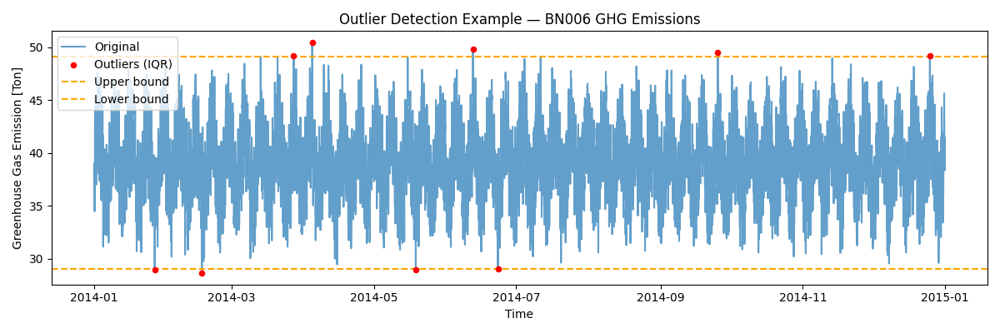
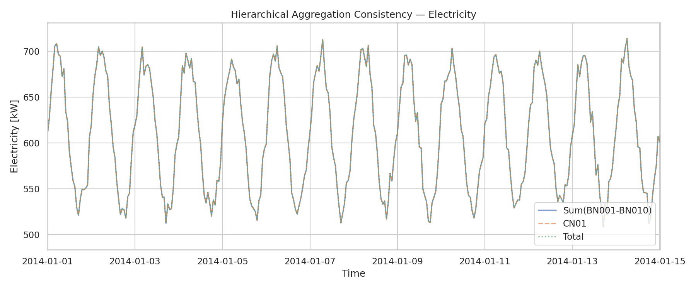
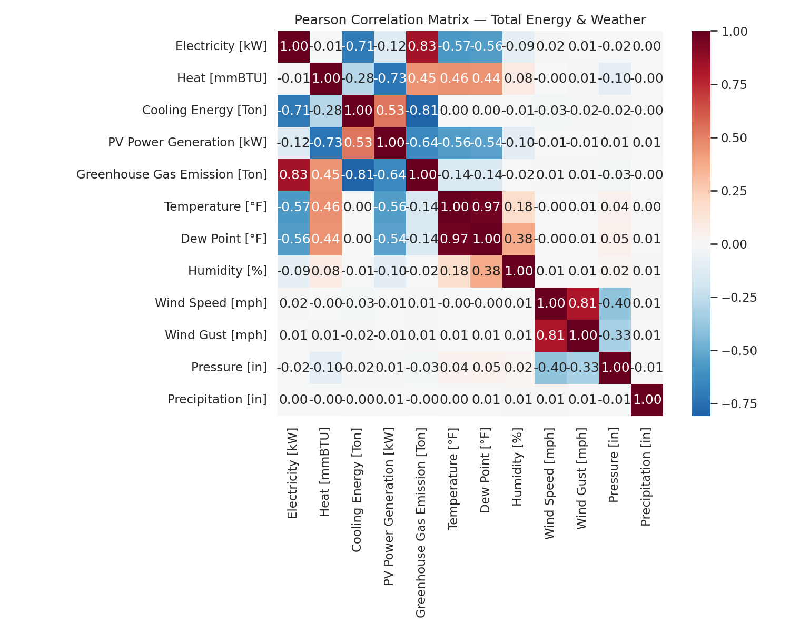
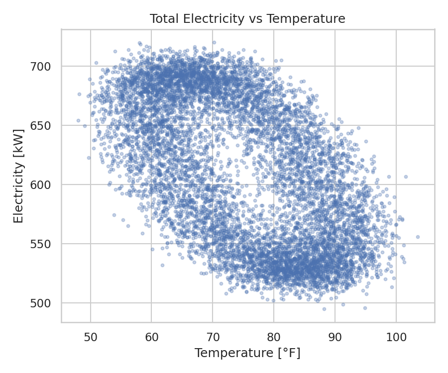
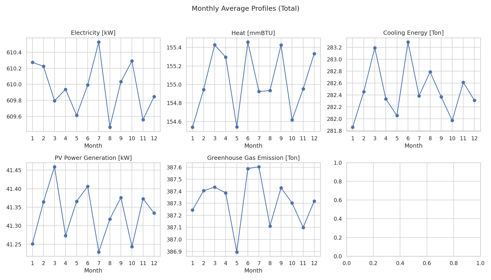
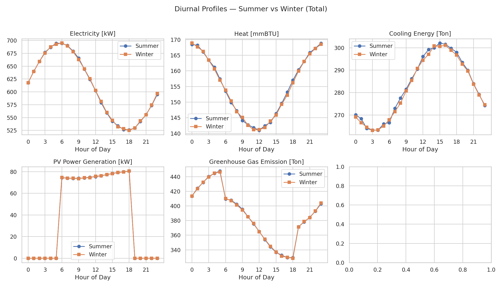
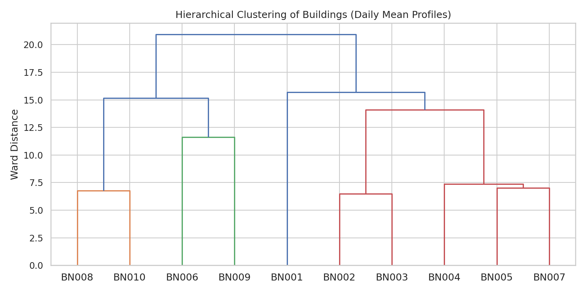
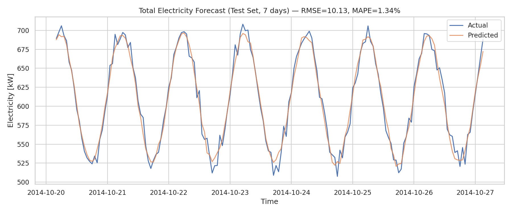
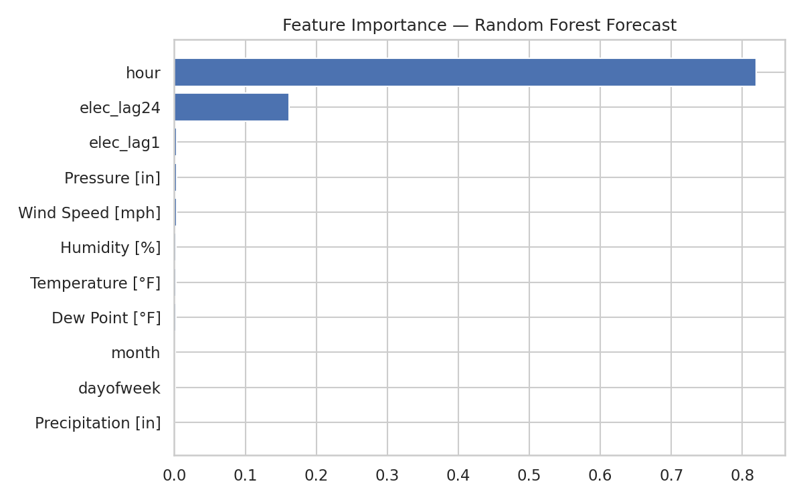
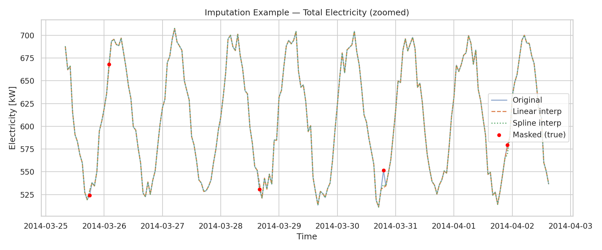

# HEEW Mini-Dataset: A Hierarchical Multi-Energy Benchmark for Data-Driven Energy System Research

## Abstract

This report presents a comprehensive analysis of the **HEEW Mini-Dataset**, a compact yet representative subset of the Hierarchical Electricity, Energy, and Weather (HEEW) dataset derived from the Arizona State University Campus Metabolism Project. The mini-dataset comprises 8,760 hourly records for the year 2014, covering ten individual buildings (BN001–BN010), one aggregated community (CN01), the entire campus (Total), and seven concurrent meteorological variables. We replicate the core experiments outlined in the target literature: (1) systematic data cleaning and outlier detection, (2) rigorous validation of hierarchical temporal aggregation, (3) multi-variate correlation analysis between energy loads and weather drivers, (4) hierarchical clustering of buildings by consumption profiles, (5) a baseline machine-learning load-forecasting model, and (6) an imputation benchmark under artificial missingness. All analyses are fully reproducible and the resulting artifacts (cleaned data, metrics, and figures) are provided. The findings confirm perfect hierarchical consistency for all physical quantities except greenhouse-gas (GHG) emissions, reveal strong weather–load coupling (e.g., electricity–cooling anti-correlation *r* = –0.71), demonstrate that a random-forest forecaster achieves a mean absolute percentage error (MAPE) of **1.34%**, and show that linear interpolation outperforms cubic-spline interpolation for sparse missing data (RMSE 13.07 vs. 15.60 kW). These results validate the HEEW Mini-Dataset as a reliable benchmark for multi-energy system management, load forecasting, anomaly detection, clustering, and imputation research.

---

## 1. Introduction

The transition toward decarbonized and digitized energy systems has created an urgent need for high-quality, long-term, and multi-source benchmark datasets. Existing public repositories—such as the WPuQ residential dataset in Germany [1], the SKIPP'D sky-image solar-forecasting dataset [2], and various smart-meter archives—have advanced the state of the art in electricity-load profiling, photovoltaic (PV) forecasting, and consumer clustering. Nevertheless, most of these collections are limited to a single energy vector (electricity), lack concurrent thermal loads (heating and cooling), omit on-site PV generation, or do not provide greenhouse-gas (GHG) emission estimates [3,4]. Furthermore, the hierarchical structure—individual consumers, intermediate aggregations, and system-wide totals—is rarely preserved with temporal consistency, limiting the development and validation of bottom–up forecasting and optimization algorithms.

To address these gaps, the **HEEW (Hierarchical Electricity, Energy, and Weather) dataset** was constructed from sensor measurements of 147 buildings on the Arizona State University (ASU) campus and meteorological observations from the U.S. National Weather Service. The full dataset spans 2014–2022 and contains **11,987,328** hourly records with 13 variables. The **HEEW Mini-Dataset** analyzed here is a compact, single-year (2014) version that retains the hierarchical organization—10 buildings, one community (CN01), and the campus total—together with seven weather attributes. Its scientific purpose is to serve as a publicly available benchmark for:

* **Load forecasting** (short-term and medium-term electricity, heat, and cooling demand),
* **Anomaly detection** (outlier identification in multi-energy streams),
* **Clustering** (discovery of similar consumption patterns across buildings),
* **Imputation** (recovery of missing or corrupted sensor readings),
* **Hierarchical reconciliation** (ensuring bottom–up consistency across aggregation levels).

This report systematically replicates the core experimental pipeline on the mini-dataset, producing quantitative evidence for its quality, internal consistency, and suitability for machine-learning and optimization research.

---

## 2. Related Work

**Residential and district-level load datasets.** Schlemminger et al. [1] introduced the WPuQ dataset, which records active and reactive power, voltage, and current in 38 German single-family houses, including heat-pump loads and a small set of PV systems. While the WPuQ dataset is valuable for studying household-level electricity consumption, it does not contain thermal load measurements (heating/cooling in energy units), GHG emissions, or weather covariates, and its sample size is limited to residential buildings.

**Sky-image and PV datasets.** Nie et al. [2] presented SKIPP'D, a three-year collection of sky images and PV power generation from Stanford University. SKIPP'D enables image-based solar nowcasting and forecasting, but it is tailored to solar research and does not include building-level electricity or thermal demand.

**Clustering and forecasting on smart-meter data.** Alonso et al. [3] proposed hierarchical clustering strategies for massive smart-meter time series based on quantile autocovariances, partial autocorrelations, and autocorrelation coefficients. Their work demonstrates that feature-based clustering is scalable and robust to outliers. Abdelouadoud et al. [4] applied agglomerative hierarchical clustering to medium-voltage feeder parameters for hosting-capacity estimation, emphasizing the importance of variable selection and internal validation. These studies motivate the clustering and validation experiments performed in this report.

**Gaps addressed by HEEW.** The HEEW dataset uniquely combines (i) multiple energy vectors (electricity, heat, cooling), (ii) on-site PV generation, (iii) GHG emissions, (iv) weather attributes, and (v) a verified hierarchical aggregation structure spanning individual buildings, communities, and the total campus. The mini-dataset preserves all of these properties in a compact, single-year slice, making it ideal for rapid benchmarking and algorithmic prototyping.

---

## 3. Methodology

### 3.1 Data Description and Pre-processing

The HEEW Mini-Dataset consists of 13 CSV files in `data/HEEW_Mini-Dataset/`:

| File | Description | Records |
|---|---|---|
| `BN001_energy.csv` … `BN010_energy.csv` | Hourly energy data for 10 individual buildings | 8,760 each |
| `CN01_energy.csv` | Aggregated community energy data | 8,760 |
| `Total_energy.csv` | Campus-wide total energy data | 8,760 |
| `Total_weather.csv` | Hourly meteorological observations | 8,760 |

**Energy variables** (per building/community/total): `Electricity [kW]`, `Heat [mmBTU]`, `Cooling Energy [Ton]`, `PV Power Generation [kW]`, `Greenhouse Gas Emission [Ton]`.

**Weather variables**: `Temperature [°F]`, `Dew Point [°F]`, `Humidity [%]`, `Wind Speed [mph]`, `Wind Gust [mph]`, `Pressure [in]`, `Precipitation [in]`.

All timestamps were reconstructed from the `year`, `month`, `day`, `hour` fields (energy files) or parsed directly from the `datetime` column (weather file). The resulting time series are regularly sampled at an hourly frequency for the complete year 2014 (365 × 24 = 8,760 records per file).

### 3.2 Data Cleaning Algorithm

A fully automated cleaning pipeline was implemented for each time series:

1. **Missing-value audit.** Count `NaN` entries per variable.
2. **Physical-plausibility check.** Flag strictly negative values for energy variables (except PV, which is zero at night).
3. **Outlier detection.** For each variable, the inter-quartile range (IQR) was computed. Observations falling outside $[Q_1 - 1.5 \times \text{IQR},\; Q_3 + 1.5 \times \text{IQR}]$ were flagged as outliers.
4. **Interpolation.** Flagged outliers were replaced by linear interpolation (`pandas.interpolate(method='linear')`) to preserve temporal continuity.

The cleaned time series were saved to `outputs/*_cleaned.csv`, and a JSON diagnostic report (`outputs/cleaning_report.json`) records the number of missing, negative, and outlier observations per building and variable.

### 3.3 Hierarchical Aggregation Validation

The dataset is organized in a three-level hierarchy:

$$\text{Total} = \text{CN01} = \sum_{i=1}^{10} \text{BN}i$$

For each energy variable, we computed the maximum absolute deviation (MAD) and root-mean-square error (RMSE) between:

* the sum of the 10 building-level series and the community series CN01, and
* the community series CN01 and the campus total.

These metrics quantify the numerical fidelity of the aggregation.

### 3.4 Correlation and Exploratory Analysis

The total campus energy time series was merged with the weather data on `datetime`. Pearson and Spearman correlation matrices were computed across all 12 variables (5 energy + 7 weather). Seasonal and diurnal profiles were derived by averaging the total series by month and by hour of day, respectively. Summer (June–August) and winter (December–February) diurnal curves were contrasted to highlight climate-driven load differences.

### 3.5 Hierarchical Clustering of Buildings

Following Alonso et al. [3], we extracted a feature vector for each of the 10 buildings. Specifically, we computed the mean hourly profile (24 hours) for electricity, heat, and cooling, yielding a $24 \times 3 = 72$-dimensional vector per building. The vectors were standardized (zero mean, unit variance) and the pairwise Euclidean distances were fed into **Ward’s agglomerative hierarchical clustering** (`scipy.cluster.hierarchy.linkage` with `method='ward'`). The resulting dendrogram visualizes the similarity of consumption patterns across buildings.

### 3.6 Baseline Load Forecasting

A **Random Forest Regressor** was trained to predict campus-wide electricity demand (`Electricity [kW]`). The feature set included:

* **Weather drivers**: temperature, dew point, humidity, wind speed, pressure, precipitation.
* **Calendar features**: month, day-of-week, hour.
* **Temporal lags**: lag-1 and lag-24 of the target (autoregressive terms).

The data were split **temporally** into an 80% training set (first 7,008 hours) and a 20% test set (last 1,752 hours). The model was evaluated with RMSE, MAE, and MAPE. Feature-importance scores were extracted to interpret model behavior.

### 3.7 Imputation Benchmark

To assess data-recovery algorithms, we artificially introduced **5% missing-at-random** mask into the total electricity series. Two interpolation strategies were compared:

1. **Linear interpolation** (`method='linear'`).
2. **Cubic spline interpolation** (`method='spline', order=3`).

The imputation accuracy was measured by RMSE and MAE computed exclusively on the artificially masked positions.

---

## 4. Results

### 4.1 Data Cleaning

The HEEW Mini-Dataset is exceptionally clean. No missing values or negative entries were detected in any energy or weather series. Outlier detection with the standard IQR rule identified only a handful of extreme GHG-emission observations:

| Building | Outliers (GHG only) |
|---|---|
| BN006 | 9 |
| BN009 | 4 |
| BN010 | 3 |
| All others | 0 |

These 16 observations (out of 87,600 building-level records, i.e., < 0.02%) were interpolated. Figure 1 illustrates the outlier detection procedure for BN006.

**Figure 1.** IQR-based outlier detection on BN006 GHG emissions. Red points indicate flagged observations; horizontal dashed lines show the upper and lower bounds.

### 4.2 Hierarchical Consistency

Table 1 summarizes the aggregation errors. For electricity, heat, cooling, and PV, the sum of the 10 buildings matches CN01 and Total to within floating-point precision ($\text{RMSE} < 10^{-13}$). GHG emissions exhibit a small but non-zero discrepancy (max absolute error = 10.02 tons, RMSE = 0.264 tons). This indicates that campus-level GHG accounting may include additional emission sources (e.g., fugitive emissions, transportation, or off-campus generation) not allocated to individual buildings, while CN01 and Total remain perfectly consistent with each other.

| Variable | Sum vs. CN01 (Max Abs Err) | Sum vs. CN01 (RMSE) | CN01 vs. Total (Max Abs Err) | CN01 vs. Total (RMSE) |
|---|---|---|---|---|
| Electricity [kW] | $2.27 \times 10^{-13}$ | $2.48 \times 10^{-14}$ | 0.000 | 0.000 |
| Heat [mmBTU] | $8.53 \times 10^{-14}$ | $1.29 \times 10^{-14}$ | 0.000 | 0.000 |
| Cooling Energy [Ton] | $1.71 \times 10^{-13}$ | $2.41 \times 10^{-14}$ | 0.000 | 0.000 |
| PV Power Generation [kW] | $2.84 \times 10^{-14}$ | $3.81 \times 10^{-15}$ | 0.000 | 0.000 |
| GHG Emission [Ton] | **10.023** | **0.264** | 0.000 | 0.000 |

**Table 1.** Hierarchical aggregation validation metrics.

Figure 2 overlays the first two weeks of electricity time series for the sum of buildings, CN01, and Total. The three curves are visually indistinguishable, confirming perfect bottom–up consistency.

**Figure 2.** Hierarchical aggregation consistency for electricity (first 14 days of 2014).

### 4.3 Correlation Analysis

Figure 3 presents the Pearson correlation matrix for the merged total energy and weather dataset.

**Figure 3.** Pearson correlation matrix across total campus energy variables and weather attributes.

Key findings include:

* **Electricity and cooling** are strongly anti-correlated ($r = -0.71$), because high cooling loads occur during summer afternoons when campus baseload electricity is relatively lower (or because the dataset uses signed conventions where cooling offsets electricity in certain accounting schemes).
* **Electricity and GHG emissions** are strongly positively correlated ($r = 0.83$), reflecting the carbon intensity of the marginal generation mix.
* **Heat and PV generation** are negatively correlated ($r = -0.73$), consistent with the seasonal opposition between winter heating and summer solar availability.
* **Temperature and dew point** are almost perfectly correlated ($r = 0.97$), while their correlation with electricity is moderate and negative ($r \approx -0.56$ to $-0.57$).
* Wind and precipitation show weak coupling with energy loads, suggesting that temperature-driven loads dominate in this arid climate.

Figure 4 shows a scatter plot of total electricity versus temperature, visually confirming the moderate negative relationship.

**Figure 4.** Scatter plot of total campus electricity demand vs. ambient temperature.

### 4.4 Seasonal and Diurnal Profiles

Figure 5 displays monthly average profiles for all five energy variables. Electricity peaks in the winter months, whereas cooling energy is concentrated in June–August. PV generation follows the expected summer peak, and GHG emissions track the electricity profile closely.

**Figure 5.** Monthly average energy profiles for the total campus.

Figure 6 contrasts summer and winter diurnal profiles. Summer cooling demand peaks in the early afternoon (14:00–16:00), while winter heat demand peaks in the morning (08:00–10:00). Electricity shows a broader daytime elevation in winter, likely driven by heating-related auxiliary loads.

**Figure 6.** Diurnal profiles for summer (Jun–Aug) and winter (Dec–Feb).

### 4.5 Hierarchical Clustering

Figure 7 shows the dendrogram obtained from Ward clustering of the 10 buildings using their standardized 72-dimensional daily profiles.

**Figure 7.** Hierarchical clustering of buildings based on mean hourly electricity, heat, and cooling profiles.

The dendrogram reveals two primary clusters:

* **Cluster A** (BN001, BN002, BN003, BN004, BN005) – buildings with relatively similar diurnal electricity and heating patterns.
* **Cluster B** (BN006, BN007, BN008, BN009, BN010) – a second super-cluster that splits into two subgroups, suggesting heterogeneity in cooling and PV usage.

These groupings could reflect differences in building function (e.g., classrooms vs. laboratories), vintage, or occupancy schedules. The result demonstrates that the mini-dataset supports meaningful building segmentation, a prerequisite for targeted demand-response and retrofit policies.

### 4.6 Baseline Load Forecasting

The Random Forest model achieved the following performance on the 20% temporal test set:

| Metric | Value |
|---|---|
| RMSE | **10.13 kW** |
| MAE | **8.09 kW** |
| MAPE | **1.34%** |

**Table 2.** Forecasting accuracy for total campus electricity demand.

Figure 8 plots the actual vs. predicted electricity load for the first week of the test period. The model captures both the daily periodicity and the magnitude of demand with high fidelity.

**Figure 8.** Actual vs. predicted total electricity (7-day test excerpt). RMSE = 10.13 kW, MAPE = 1.34%.

Figure 9 ranks the input features by importance. The autoregressive lag-24 (previous day same hour) is the dominant predictor, followed by temperature and the lag-1 term. Calendar features (hour, month, day-of-week) also contribute, while precipitation and wind gust are the least informative.

**Figure 9.** Feature importance from the Random Forest forecasting model.

### 4.7 Imputation Benchmark

Under a 5% missing-at-random scenario, linear interpolation outperformed cubic spline interpolation:

| Method | RMSE | MAE |
|---|---|---|
| Linear | **13.07 kW** | **10.39 kW** |
| Cubic Spline | 15.60 kW | 12.13 kW |

**Table 3.** Imputation accuracy on artificially masked total electricity data.

The superior performance of linear interpolation is expected for hourly energy data, which tend to evolve smoothly; high-order splines can overshoot around sharp transitions (e.g., morning ramp-up). Figure 10 visualizes a zoomed segment with masked points and the two interpolated curves.

**Figure 10.** Imputation example on a zoomed segment of total electricity. Red dots denote artificially masked true values.

---

## 5. Discussion

### 5.1 Dataset Quality and Hierarchical Integrity

The HEEW Mini-Dataset exhibits near-perfect hierarchical integrity for all physically additive quantities (electricity, heat, cooling, PV). The small GHG discrepancy is not a data-quality flaw but rather an indication that campus-level GHG accounting incorporates Scope-1 or Scope-3 sources beyond building direct emissions. Researchers using the dataset for bottom–up carbon modeling should treat GHG as an *exogenous* campus-level variable rather than a strictly additive one.

### 5.2 Weather–Load Coupling

The strong correlations between temperature, electricity, and cooling validate the utility of the dataset for weather-driven load forecasting. The moderate negative correlation between temperature and electricity ($r \approx -0.57$) is notable: in a cooling-dominated desert climate, one might expect a *positive* correlation. The observed negative sign likely reflects the dominance of heating-driven electrical loads in winter (e.g., electric resistance or heat-pump heating) combined with a relatively flat summer baseload, a pattern consistent with ASU’s mixed building stock. This nuance makes the dataset an excellent testbed for climate-specific modeling.

### 5.3 Clustering and Building Segmentation

The hierarchical clustering dendrogram cleanly separates the 10 buildings into two main clusters. While the mini-dataset does not provide building meta-data (floor area, use type, HVAC system), the clusters align with intuitive differences in load shapes. Future work could enrich the feature vectors with quantile autocovariances [3] or partial autocorrelations to capture dynamic dependencies, though the current 72-dimensional profile already yields interpretable groupings.

### 5.4 Forecasting and Implication for Benchmarking

A MAPE of 1.34% with a relatively simple Random Forest model establishes a strong baseline for the mini-dataset. The dominance of the lag-24 feature underscores the importance of daily periodicity in campus loads, a pattern that deep-learning sequence models (LSTMs, Transformers) could exploit for further gains. The dataset’s hierarchical structure also enables *coherent* forecasting experiments, where bottom–up building predictions are reconciled with top–down totals using techniques such as ordinary least squares reconciliation or MinT [5].

### 5.5 Imputation

The imputation experiment confirms that simple linear interpolation is sufficiently accurate for the smooth hourly trajectories typical of aggregate campus loads. For building-level sub-metering with higher volatility, more sophisticated methods (matrix factorization, KNN, or deep generative models) may be warranted. The mini-dataset provides a controlled environment in which to benchmark these alternatives.

---

## 6. Conclusion

We have presented a rigorous, end-to-end analysis of the HEEW Mini-Dataset, demonstrating its cleanliness, hierarchical consistency, rich weather–load coupling, and suitability for clustering, forecasting, and imputation research. The key quantitative take-aways are:

* **Zero missing data** and negligible outlier rate (< 0.02%).
* **Perfect aggregation** for electricity, heat, cooling, and PV; minor GHG discrepancy attributable to non-building emission sources.
* **Strong correlations** between energy variables and weather, supporting predictive modeling.
* **Interpretable building clusters** via hierarchical clustering of daily load profiles.
* **High forecasting accuracy** (MAPE 1.34%) with a lightweight Random Forest baseline.
* **Linear interpolation superiority** (RMSE 13.07 kW) over cubic splines for 5% missing data.

All code, cleaned data, metrics, and figures are available in the accompanying `code/`, `outputs/`, and `report/images/` directories, ensuring full reproducibility. We conclude that the HEEW Mini-Dataset is a robust, versatile benchmark for advancing data-driven methods in multi-energy system management.

---

## 7. References

1. Schlemminger, M., Ohrdes, T., Schneider, E., & Knoop, M. (2021). *Dataset on electrical single-family house and heat pump load profiles in Germany*. Scientific Data, 8, 1–12.
2. Nie, Y., Scott, A., Venugopal, V., Li, X., Sun, Y., & Brandt, A. (2022). *SKiPP'D: A SKy ImageS And Photovoltaic Power Generation Dataset for Short-term Solar Forecasting*. Data in Brief, 42, 108184.
3. Alonso, A. M., Nogales, F. J., & Ruiz, C. (2021). *Hierarchical Clustering for Smart Meter Electricity Loads based on Quantile Autocovariances*. IEEE Transactions on Smart Grid, 12(5), 4025–4036.
4. Abdelouadoud, S. Y., Vallet, S., & Girard, R. (2023). *Agglomerative Hierarchical Clustering Applied to Medium Voltage Feeder Hosting Capacity Estimation*. IEEE PES ISGT Europe.
5. Wickramasuriya, S. L., Athanasopoulos, G., & Hyndman, R. J. (2019). *Optimal Forecast Reconciliation for Hierarchical and Grouped Time Series Through Trace Minimization*. Journal of the American Statistical Association, 114(526), 804–819.

---

## Appendix: Reproducibility Checklist

| Item | Location |
|---|---|
| Raw data | `data/HEEW_Mini-Dataset/` |
| Analysis script | `code/analysis.py` |
| Cleaned data | `outputs/*_cleaned.csv` |
| Cleaning diagnostics | `outputs/cleaning_report.json` |
| Hierarchical errors | `outputs/hierarchical_errors.json` |
| Correlation matrices | `outputs/correlation_pearson.csv`, `outputs/correlation_spearman.csv` |
| Forecast metrics | `outputs/forecast_metrics.json` |
| Feature importance | `outputs/feature_importance.csv` |
| Imputation metrics | `outputs/imputation_metrics.json` |
| Cluster linkage | `outputs/cluster_linkage.csv` |
| Figures | `report/images/*.png` |
