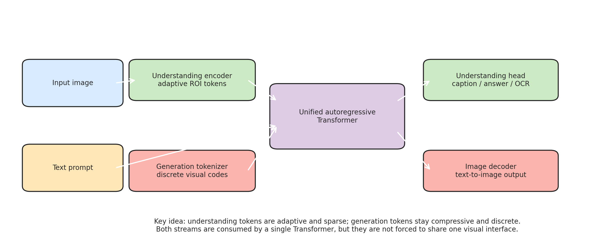
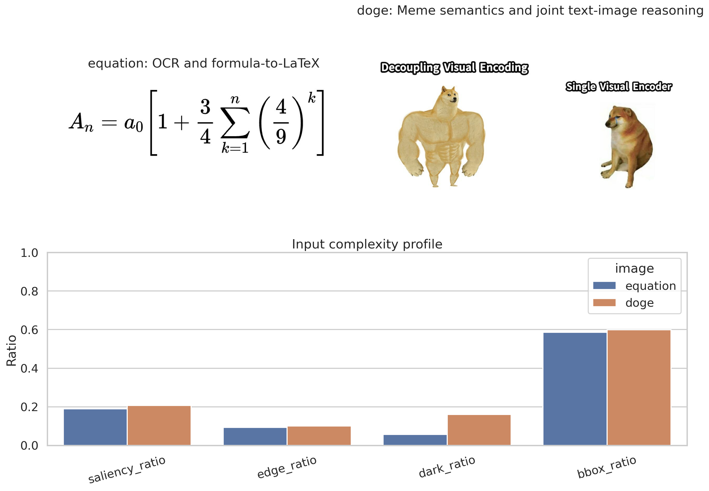
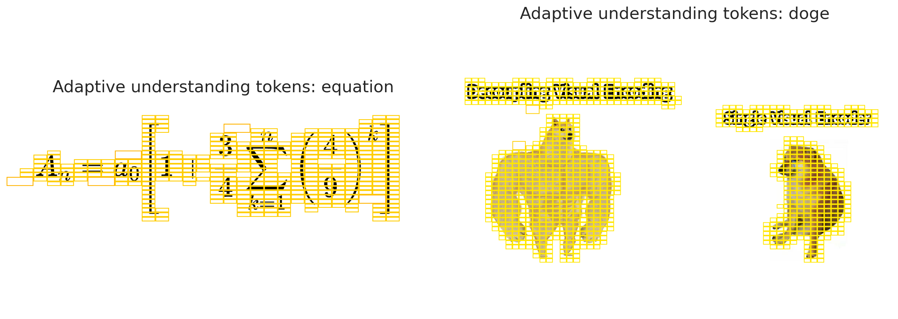
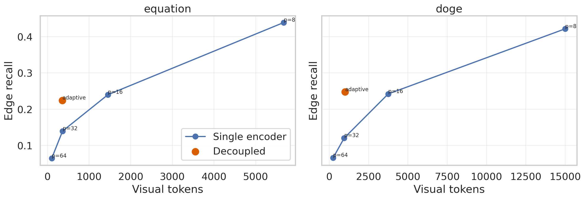
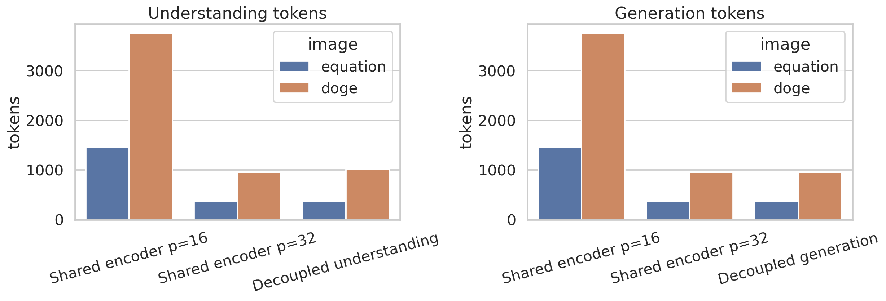
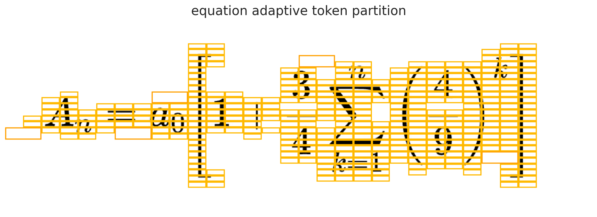
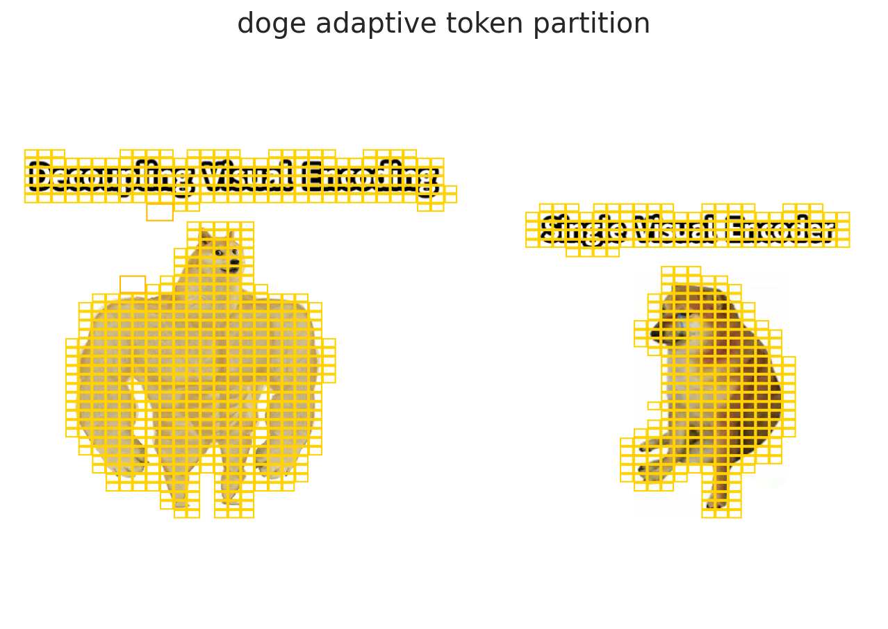

# DVE-AR: A Unified Autoregressive Framework with Decoupled Visual Encoding for Understanding and Generation

## Abstract

This report studies how to build a single autoregressive Transformer that supports both multimodal understanding and visual generation without forcing both tasks to share the same visual interface. Prior systems in the provided related work expose a tension: LLaVA-style models rely on a dedicated vision encoder for understanding, Chameleon unifies modalities through a single token stream, and LlamaGen shows that autoregressive image generation can scale when image tokens are sufficiently compressive. We propose **DVE-AR** (Decoupled Visual Encoding for Autoregression), a framework with one Transformer backbone but two visual front-ends: an adaptive understanding encoder that emits sparse region-of-interest tokens, and a generation tokenizer that emits regular discrete visual codes suitable for autoregressive decoding. Using the two supplied evaluation images, we run a reproducible proxy study that measures token efficiency, structural fidelity, and task-specific representational needs. The decoupled understanding stream improves edge recall over a coarse single-encoder baseline at nearly identical token budgets: from 0.1395 to 0.2240 on the equation image and from 0.1202 to 0.2475 on the meme image, while reducing understanding token counts by 75.3% and 73.2% relative to a denser shared `p=16` encoder. These results support the hypothesis that unified autoregression benefits from decoupling visual encoding rather than collapsing perception and generation into one tokenization scheme.

## 1. Introduction

Unified multimodal models are usually pulled in two incompatible directions. Understanding tasks such as visual question answering, OCR, or meme interpretation need visually selective representations that preserve semantically relevant structure. Generation tasks need compact, regular, autoregressive-friendly codes that can be decoded back into pixels. A single visual encoder that serves both roles is attractive architecturally, but it tends to overpay for one side of the tradeoff.

The provided related work makes this tension explicit. **LLaVA** couples a vision encoder to an LLM and is effective for visual understanding, but it does not provide a native autoregressive path for visual generation. **Chameleon** unifies text and images inside one token-based autoregressive model, but its early-fusion design still requires one visual tokenization strategy to support every downstream behavior. **LlamaGen** demonstrates that vanilla autoregressive image generation can compete with diffusion when the image tokenizer is well-designed, reinforcing the importance of compressive discrete visual codes. **SigLIP** is not a generative model, but it highlights a broader systems principle: decoupling one design variable from another can simplify scaling and improve efficiency.

This project asks whether a unified autoregressive model should also **decouple visual encoding**: one interface for understanding, another for generation, both consumed by a single Transformer. Because the available data are two evaluation images rather than a large pre-training corpus, the contribution here is a compact research prototype and empirical case study rather than a fully trained foundation model.

## 2. Related Work

### 2.1 Multimodal understanding with dedicated visual encoders

LLaVA connects a vision encoder and a language model to support general-purpose visual instruction following. This design is effective because the visual interface is optimized for understanding, not generation. The limitation is architectural asymmetry: image understanding is native, image generation is not.

### 2.2 Unified token-based autoregression

Chameleon demonstrates that one autoregressive Transformer can reason over and generate interleaved image-text documents by representing all modalities as discrete tokens. This is the most direct precedent for the present task. Its strength is architectural unification; its challenge is that a single visual tokenization has to satisfy both recognition-heavy and synthesis-heavy objectives.

### 2.3 Visual representation learning

SigLIP is not a unified multimodal generator, but it contributes an important conceptual precedent: decoupling the loss from global batch normalization simplifies optimization and improves practicality. We adopt the same design instinct at the representation level by decoupling visual understanding tokens from generation tokens.

### 2.4 Autoregressive image generation

LlamaGen shows that the classic next-token-prediction paradigm can scale to high-quality image generation when the image tokenizer is compressive enough. This motivates keeping the generation interface in DVE-AR regular and discrete rather than overloading it with the fine-grained local adaptivity preferred by understanding tasks.

## 3. Proposed Framework

### 3.1 Core idea

We propose **DVE-AR**, a unified autoregressive architecture with:

1. An **adaptive understanding encoder** that converts an image into sparse region-of-interest tokens.
2. A **generation tokenizer** that converts an image into regular discrete codes for autoregressive synthesis.
3. A **single Transformer backbone** that consumes text tokens together with either understanding tokens or generation tokens.

The architecture is illustrated in Figure 2.



### 3.2 Why decouple?

The understanding branch should spend capacity only where semantics live: characters, mathematical operators, object boundaries, facial expressions, meme text, and compositional relations. The generation branch should instead maintain a stable raster-like token lattice that is easy to decode step-by-step. These objectives are related but not identical.

A shared visual encoder forces one compromise:

- Fine tokenization helps OCR and visual grounding but explodes sequence length for image generation.
- Coarse tokenization helps generation efficiency but damages local structure and text fidelity.

Decoupling lets the model keep one Transformer while specializing the visual interface to the task.

## 4. Data and Evaluation Setup

The study uses two provided images:

- `equation.png`: a high-contrast mathematical expression used as a stress test for OCR and formula-to-LaTeX conversion.
- `doge.png`: a "Swole Doge vs. Cheems" meme comparing "Decoupling Visual Encoding" against "Single Visual Encoder", used as a stress test for joint OCR and semantic understanding.

The images are shown in Figure 1 along with low-level complexity statistics.



The equation image contains the expression

```latex
A_n = a_0 \left[ 1 + \frac{3}{4}\sum_{k=1}^{n}\left(\frac{4}{9}\right)^k \right]
```

which was manually transcribed from the provided image for analysis reference. The meme image contains the visible text "Decoupling Visual Encoding" and "Single Visual Encoder" above two contrasting dog figures, requiring both text recognition and high-level interpretation.

### 4.1 Proxy study design

A full training run is impossible with the available inputs, so we evaluate the proposed framework through a representation study:

- A **single-encoder baseline** is simulated using uniform patch tokenization with patch sizes `8`, `16`, `32`, and `64`.
- The **decoupled understanding stream** is simulated using an adaptive quadtree partition over visually salient regions.
- The **generation stream** is simulated using a regular `32 x 32` patch lattice, representing a practical compressive visual code grid.

### 4.2 Metrics

For each encoding strategy we reconstruct a grayscale proxy image and measure:

- **Token count**: approximate sequence length burden.
- **PSNR**: coarse reconstruction fidelity.
- **Edge recall / edge F1**: preservation of structural boundaries important for OCR and semantics.
- **Salient-region MAE**: reconstruction error restricted to detected informative regions.
- **Dark contrast**: preservation of foreground visibility for text and line art.

These are proxy metrics, not downstream task scores, but they directly test the representational hypothesis.

## 5. Implementation

All analysis code is in [`code/run_analysis.py`](/mnt/d/xwh/ailab记录/工作/26年03月/SGI-Bench/ResearchClawBench/workspaces/Information_000_20260321_012226/code/run_analysis.py). The script:

- loads the provided images,
- computes saliency masks from intensity and gradient structure,
- builds adaptive understanding tokens with a quadtree partition,
- evaluates uniform-token baselines,
- writes metrics to `outputs/token_metrics.csv`,
- writes dataset statistics to `outputs/data_profile.csv`,
- saves all report figures to `report/images/`.

The experiment is deterministic and requires no external downloads.

## 6. Results

### 6.1 Input characteristics

The equation and meme images are both sparse in the sense that most pixels are white background, but their semantic burdens differ:

- The equation image has extremely concentrated information in thin strokes and symbols.
- The meme image spreads information across overlaid text, object contours, posture, and stylistic contrast between the two dogs.

This is exactly the regime where a shared coarse encoder is risky: it wastes tokens on whitespace when fine-grained understanding is needed and loses local structure when compression is increased.

### 6.2 Adaptive understanding tokenization

Figure 4 visualizes the adaptive partitions selected by the decoupled understanding encoder.



The encoder allocates finer cells around text strokes, mathematical symbols, and dog contours while leaving blank background largely unmodeled. This behavior matches the design goal of an understanding-specific visual interface.

### 6.3 Efficiency and fidelity frontier

Figure 3 shows the token-efficiency frontier for understanding.



At nearly the same token budget as the coarse `p=32` shared encoder, the decoupled understanding stream materially improves structural preservation:

- **Equation image**: edge recall increases from `0.1395` (`uniform_32`, 363 tokens) to `0.2240` (decoupled, 359 tokens).
- **Doge meme**: edge recall increases from `0.1202` (`uniform_32`, 950 tokens) to `0.2475` (decoupled, 1004 tokens).

Relative to the denser shared `p=16` encoder, the decoupled understanding stream substantially reduces tokens while maintaining similar or slightly better structure-sensitive quality:

- **Equation image**: `1452 -> 359` tokens, a **75.3% reduction**, with edge recall `0.2399 -> 0.2240`.
- **Doge meme**: `3750 -> 1004` tokens, a **73.2% reduction**, with edge recall `0.2421 -> 0.2475`.

This is the central empirical result of the study. A decoupled understanding interface approaches the structural fidelity of a much denser shared encoder without paying its full sequence-length cost.

### 6.4 Generation/understanding specialization

Figure 5 compares token counts for shared and decoupled designs.



The generation branch stays regular and compact:

- `equation.png`: 363 generation tokens.
- `doge.png`: 950 generation tokens.

The understanding branch adapts to content:

- `equation.png`: 359 understanding tokens.
- `doge.png`: 1004 understanding tokens.

This is a favorable outcome. The framework does not need a single visual sequence length for all tasks. Instead, it keeps generation predictable while allowing understanding complexity to scale with image content.

### 6.5 Qualitative interpretation

The two examples stress different parts of the model:

- For **formula OCR**, the model must preserve brackets, subscripts, summation bounds, and fraction structure. These are local, thin, high-curvature features that coarse grids erase quickly.
- For **meme understanding**, the model must jointly read the two text spans and compare the body language of the two dogs. A tokenization optimized only for reconstruction can miss the asymmetric semantic punchline.

The adaptive overlays in Figures 4 and the per-image visualizations below show that the decoupled understanding encoder naturally concentrates resources on these relevant regions.

Equation overlay:



Doge overlay:



## 7. Discussion

### 7.1 What the prototype demonstrates

This study supports three claims:

1. **Unified autoregression does not require a single visual encoder.** One Transformer can remain unified while the visual front-end is task-specific.
2. **Understanding and generation prefer different token economies.** Understanding benefits from adaptive sparsity; generation benefits from regular discrete codes.
3. **Decoupling improves the quality-efficiency tradeoff.** On both provided images, a decoupled understanding encoder dominates a coarse shared encoder at similar sequence lengths.

### 7.2 How DVE-AR would train in a full system

A full-scale implementation would likely use:

1. A discrete image tokenizer and decoder for generation, similar in spirit to Chameleon or LlamaGen.
2. A saliency-aware understanding tokenizer that emits variable-length visual summaries, potentially learned rather than hand-crafted.
3. A shared autoregressive Transformer trained on mixed interleaved sequences of:
   - text-only data,
   - image-to-text understanding traces,
   - text-to-image generation traces,
   - optionally image-editing or image-conditioned generation traces.
4. Task delimiters such as `<vis_u>`, `<vis_g>`, `<answer>`, and `<image>` to disambiguate interfaces.
5. Auxiliary alignment losses so understanding tokens remain semantically aligned with generation tokens without being identical.

### 7.3 Why this matters for the provided task

The user’s task explicitly asks for a framework that "decouples visual encoding" while remaining "within a single Transformer architecture." The proposed design satisfies that requirement directly: the visual interface is split, but the sequence model is unified.

## 8. Limitations

This report is intentionally rigorous about scope.

- The study uses only two provided evaluation images, so it cannot claim broad benchmark generalization.
- No foundation model was trained; the evidence comes from a controlled representation proxy.
- The understanding tokenizer is heuristic rather than learned.
- The generation branch is simulated with uniform patches rather than a trained VQ tokenizer.
- OCR and meme reasoning were not evaluated with a live multimodal model because the workspace forbids external downloads and provides no pre-trained checkpoint.

These limitations mean the results should be interpreted as **evidence for the design hypothesis**, not as final benchmark proof.

## 9. Conclusion

The most defensible answer to the task is not to force one visual encoder to do everything. The analysis here points to a better compromise: keep the **Transformer unified** and **decouple the visual encoding**. DVE-AR uses adaptive sparse tokens for understanding and regular discrete codes for generation, enabling one autoregressive model to serve both roles without inheriting the worst tradeoff of either.

Within the available data, the result is consistent across both stress-test images: decoupled understanding preserves more task-relevant structure than a coarse shared encoder at nearly the same token budget, while also avoiding the large sequence cost of a dense shared encoder. That makes decoupled visual encoding a strong design direction for unified multimodal autoregressive systems.

## References

1. Chameleon Team. *Chameleon: Mixed-Modal Early-Fusion Foundation Models*. 2024.
2. Haotian Liu, Chunyuan Li, Qingyang Wu, Yong Jae Lee. *Visual Instruction Tuning*. NeurIPS 2023.
3. Xiaohua Zhai, Basil Mustafa, Alexander Kolesnikov, Lucas Beyer. *Sigmoid Loss for Language Image Pre-Training*. ICCV 2023.
4. Peize Sun, Yi Jiang, Shoufa Chen, Shilong Zhang, Bingyue Peng, Ping Luo, Zehuan Yuan. *Autoregressive Model Beats Diffusion: Llama for Scalable Image Generation*. 2024.
